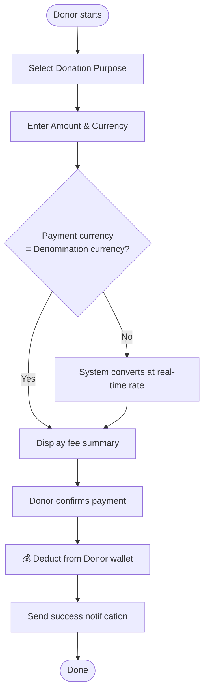
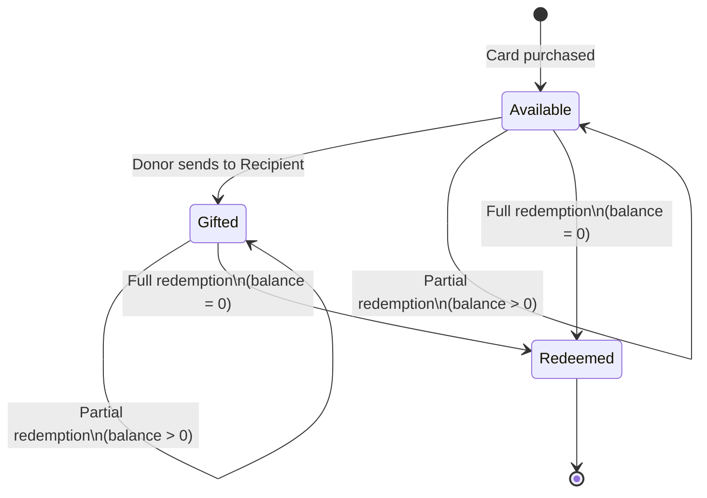
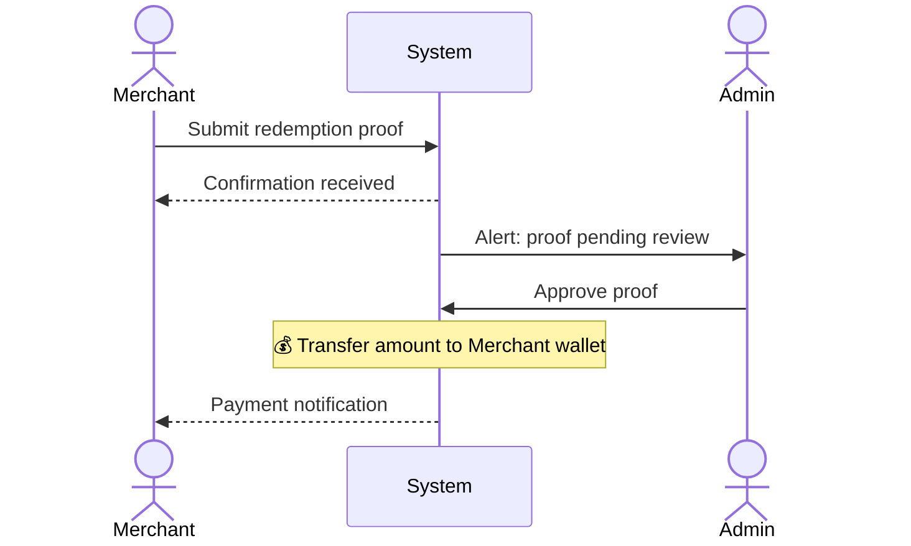

# Document — Business Documentation Generator

## Purpose

Produce clear, professional, business-facing documentation for Nexora POS (Nexora Touch) features and processes. Audience: leader, product owner, business analysts, QA, customer support, and non-technical stakeholders.

## Behavior

When invoked with `/document [feature or topic]` — or whenever creating/updating any document under `docs/business/`:

1. Extract `[feature or topic]` from the user's input.
2. Search the codebase and existing docs (`docs/business/`, `docs/screnshot/`, `docs/mockup-rules-vi.md`) to understand the feature before writing.
3. Use **business names** throughout — never expose internal code names unless annotated (e.g., "Live Ticket (`pos_tickets`)").
4. Ask one clarifying question if the scope is ambiguous. Do not ask what you can look up.
5. Produce the document using the Standard Output Template below.
6. After writing, note the recommended save path: `docs/business/{feature-slug}.md`.
7. Language: team làm việc bằng tiếng Việt — viết tiếng Việt với thuật ngữ nghiệp vụ tiếng Anh (Live Ticket, checkout, booking…), trừ khi user yêu cầu tiếng Anh.
8. **Versioned release docs** (tên dạng `POS_Nexoratouch_<Scope>_vX.Y.md`, ví dụ `POS_Nexoratouch_Phase1_v1.0.md`): là bản snapshot phát hành — KHÔNG sửa đè; mỗi lần thay đổi tạo file mới tăng version (v1.0 → v1.1 → …), thêm dòng vào bảng **Version History** ở đầu tài liệu mô tả thay đổi, và cập nhật header `Version:`.

## Diagram Rules

Use Mermaid diagrams to visualise structure and flow. Apply the correct diagram type for the information being conveyed:

| Information Type | Mermaid Diagram Type | When to Use |
| :--- | :--- | :--- |
| End-to-end user workflow | `flowchart TD` | Any multi-step process with decisions or branches |
| Entity status lifecycle | `stateDiagram-v2` | When an entity has distinct states and transitions |
| Cross-actor message flow | `sequenceDiagram` | When timing and order of messages between actors matters (e.g., payment confirmation, approval loop) |
| Data structure / hierarchy | `classDiagram` | When showing how concepts or entities relate to each other |

**Mandatory diagrams** — always include:
1. A **flowchart** for each major end-to-end workflow (one diagram per workflow).
2. A **state diagram** for any entity with a status lifecycle (e.g., gift card, order, batch).

**Optional diagrams** — add when they add clarity:
3. A **sequence diagram** for workflows with non-obvious cross-actor message order (e.g., payment gateway callbacks, multi-step approval loops, async notifications). Use judgment — if the step table already makes the order clear, skip it.

Place each diagram directly after the section it illustrates (workflow table → flowchart below it; state table → state diagram below it).

### Mermaid Diagram Style Guide

- Use plain business names for all node labels — no code identifiers.
- Keep node labels short (3–6 words). Move detail into the step table.
- Mark money-movement steps with 💰 in the node label.
- For flowcharts, use `([text])` for start/end, `[text]` for actions, `{text}` for decisions.
- For sequence diagrams, use `actor` for human roles and `participant` for systems; add `Note` annotations for important business rules.
- For state diagrams, use `[*]` for entry/exit and label each transition with the trigger action.

### Example — Flowchart



### Example — State Diagram



### Example — Sequence Diagram



---

## Standard Output Template

Every generated document must follow this Markdown structure:

---

## [Feature / Module Name]

**Last Updated:** [Today's date]
**Audience:** [e.g., Customer, Merchant, Admin, Support Agent]
**Status:** Draft | Review | Approved

---

### Overview

> One short paragraph: what this feature does, who it serves, and the core business value it delivers.

---

### Key Concepts

| Term | Definition |
| :--- | :--- |
| [Business Term] | [Plain-language definition as used in VlinkPay] |

---

### User Roles

| Role | Responsibilities in this Feature |
| :--- | :--- |
| [Role Name] | [What this actor does] |

---

### End-to-End Workflows

> Each workflow is a self-contained scope: user stories, step table, and flowchart are grouped together.
> User story format: **As a** [role], **I want to** [action], **so that** [benefit].
> Cover the primary happy path AND key edge cases (e.g., failure, partial use, rejection, cancellation) in the stories.

#### Workflow: [Workflow Name]

**Primary Actor:** [Role]
**Trigger:** [What starts this workflow]
**Outcome:** [What a successful completion looks like]

**User Stories:**
- As a [Role], I want to [action], so that [benefit].
- As a [Role], I want to [action], so that [benefit].

| Step | Who | Action | System Response | Notes |
| :--- | :--- | :--- | :--- | :--- |
| 1 | | | | |

```mermaid
flowchart TD
    %% Flowchart for the workflow above
```

---

### System Configuration & Administration

> User stories for cross-cutting concerns not tied to a single workflow (e.g., fee configuration, purpose management).

- As a [Role], I want to [action], so that [benefit].

---

### State Lifecycle

| Current Status | Trigger | New Status | Notes |
| :--- | :--- | :--- | :--- |

```mermaid
stateDiagram-v2
    %% State diagram for the entity above
```

---

### Business Rules

- **Rule 1:** [State the rule in plain language — no code references.]
- **Rule 2:** ...

> 💡 **Important:** Call out any rule that directly impacts money movement, eligibility, or account status.

---

### Edge Cases & Exception Handling

| Scenario | What Happens | Who Resolves It |
| :--- | :--- | :--- |
| [e.g., Insufficient balance] | [System behavior] | [Customer / Support / Auto] |

---

### Frequently Asked Questions

**Q: [Common user or support question]**
A: [Clear, concise answer]

---

### Related Features

- [Link or reference to related business doc]

---

## Writing Rules

- **Use business names.** Never use database column names, enum values, or code identifiers as primary labels. If a technical name must appear, put it in parentheses after the business name on first use.
- **Write for a non-developer reader.** Assume the audience understands VlinkPay's products but not its code.
- **Be specific.** Replace vague phrases like "the system processes the request" with "the system deducts the amount from the customer's VLink Token balance and records a transaction in the wallet history."
- **Highlight money-movement steps.** Any step that changes a wallet balance or triggers a financial transaction must be clearly marked with 💰.
- **Use tables and bullets.** Avoid walls of text. Structure information for quick scanning.
- **Keep scope tight.** Only document what is in scope for this feature. If a dependency (e.g., KYC approval) is a prerequisite, reference the relevant doc rather than re-explaining it.
- **Language:** Write in clear, professional English.
