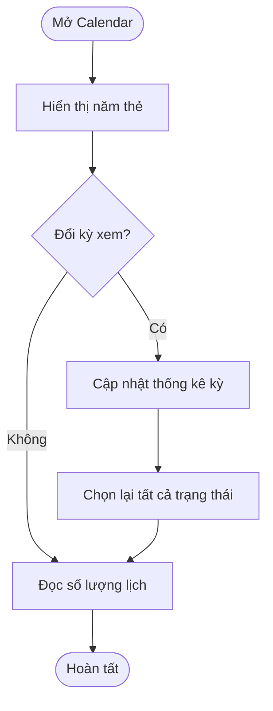
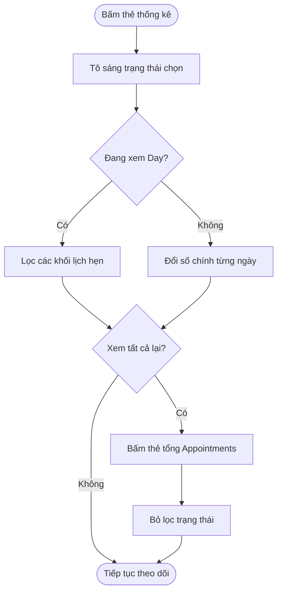

## Appointment Status Summary

**Last Updated:** 2026-09-07  
**Audience:** Chủ salon, Manager, Front Desk, Product Owner, BA, QA  
**Status:** Draft

### Overview

**Appointment Status Summary** — khu vực tổng hợp trạng thái lịch hẹn (`status-summary`) — nằm trong **POS → Front Desk → Appointments → Calendar**. Năm thẻ thống kê giúp Front Desk xem tổng số lịch và phân bố trạng thái, đồng thời chọn trạng thái cần theo dõi trên lịch. Nội dung dưới đây mô tả prototype hiện tại và chỉ rõ các phần cần hoàn thiện khi kết nối dữ liệu vận hành.

### Key Concepts

| Thuật ngữ | Ý nghĩa |
| :--- | :--- |
| Appointments | Tổng số lịch hẹn trong phạm vi thống kê; bấm thẻ này để xem tất cả trạng thái. |
| Completed | Lịch được đánh dấu đã hoàn thành trong dữ liệu. Không đồng nghĩa đã thanh toán hoặc đã trả thưởng. |
| Upcoming | Lịch mang trạng thái Upcoming trong dữ liệu mẫu; chưa được tự suy ra từ thời gian hiện tại. |
| Pending | Lịch mang trạng thái Pending, dùng để biểu diễn lịch đang chờ xác nhận. |
| Cancelled | Lịch được đánh dấu đã hủy. |
| Thẻ đang chọn | Thẻ được tô sáng, quyết định trạng thái đang xem trên lịch. |
| Kỳ xem | Day, Week, 2 Weeks, 3 Weeks hoặc Month của Calendar. |

### User Roles

| Role | Responsibilities in this Feature |
| :--- | :--- |
| Front Desk | Theo dõi lượng lịch và tập trung vào nhóm trạng thái cần xử lý. |
| Chủ salon / Manager | Xem phân bố lịch theo trạng thái và kỳ thời gian. |

Các thao tác trong phần này chỉ xem và lọc dữ liệu; không thay đổi trạng thái của lịch hẹn.

### End-to-End Workflows

#### Workflow: Xem tổng hợp trạng thái

**Primary Actor:** Front Desk / Manager  
**Trigger:** Mở Calendar hoặc đổi kỳ xem.  
**Outcome:** Xem được tổng số lịch và số lượng từng trạng thái.

**User Stories:**

- **US-01 — Xem tổng số lịch:** **As a** nhân viên Front Desk, **I want to** thấy tổng Appointments và số lượng Completed, Upcoming, Pending, Cancelled, **so that** tôi nắm được tình hình lịch hẹn nhanh chóng.
- **US-02 — Xem theo kỳ:** **As a** người quản lý salon, **I want to** xem thống kê khi đổi Day, Week, 2 Weeks, 3 Weeks hoặc Month, **so that** tôi theo dõi được lượng lịch ở các phạm vi thời gian khác nhau.

**Acceptance Criteria — hiện có:**

1. Luôn hiển thị năm thẻ theo thứ tự: Appointments, Completed, Upcoming, Pending, Cancelled.
2. Mỗi thẻ có nhãn, số lượng và biểu tượng phân biệt.
3. Mặc định chọn thẻ tổng Appointments; mỗi thời điểm chỉ có một thẻ đang chọn.
4. Nhãn thẻ tổng thay đổi theo kỳ: today, this week, in 2 weeks, in 3 weeks hoặc this month.
5. Tổng Appointments bằng tổng bốn nhóm trạng thái đối với dữ liệu mẫu đang hỗ trợ.
6. Đổi chế độ thời gian dựng lại thống kê và đưa lựa chọn trạng thái về All.
7. Chọn ngày trước/sau giữ trạng thái đang chọn và dựng lại màn hình.

**Giới hạn dữ liệu:**

- Day đếm một danh sách lịch mẫu cố định, chưa lọc theo ngày đang chọn.
- Các kỳ nhiều ngày dùng số liệu được mô phỏng theo ngày, không cộng từ cùng danh sách lịch thật của Day.
- Week bắt đầu từ Chủ nhật; 2 Weeks và 3 Weeks lần lượt gồm 14 và 21 ngày.
- Month thống kê toàn bộ 42 ô ngày của lưới lịch, gồm cả ngày ngoài tháng. Nhãn “this month” hiện chưa thể hiện rõ phạm vi này.
- Dòng “8% busier than last Saturday” và “Live range overview” là nội dung mẫu, không phải kết quả so sánh hoặc xác nhận dữ liệu thời gian thực.

| Step | Who | Action | System Response | Notes |
| :--- | :--- | :--- | :--- | :--- |
| 1 | Front Desk | Mở Calendar | Hiển thị năm thẻ, chọn All | Không sửa lịch hẹn. |
| 2 | Manager | Đổi kỳ xem | Cập nhật thống kê và nhãn kỳ | Trở về All khi đổi chế độ. |
| 3 | Front Desk | Đọc các số lượng | Phân biệt lịch theo trạng thái | Dữ liệu hiện là demo. |

#### Workflow: Chọn trạng thái để theo dõi trên lịch

**Primary Actor:** Front Desk  
**Trigger:** Bấm một thẻ thống kê.  
**Outcome:** Lịch thể hiện trạng thái được chọn; có thể trở lại All.

**User Stories:**

- **US-03 — Tập trung vào một trạng thái:** **As a** nhân viên Front Desk, **I want to** bấm Pending, Upcoming, Completed hoặc Cancelled, **so that** tôi có thể tập trung xem nhóm lịch cần theo dõi.
- **US-04 — Trở về tất cả:** **As a** nhân viên Front Desk, **I want to** bấm thẻ tổng Appointments, **so that** tôi bỏ bộ lọc trạng thái và xem lại toàn bộ lịch trong phạm vi hiện tại.
- **US-05 — Xem số lượng theo từng ngày:** **As a** người quản lý salon, **I want to** chọn trạng thái khi xem lịch nhiều ngày, **so that** tôi thấy số lượng của trạng thái đó trên từng ô ngày.
- **US-06 — Nhận biết không có kết quả:** **As a** nhân viên Front Desk, **I want to** nhận biết khi nhóm trạng thái không có lịch phù hợp, **so that** tôi phân biệt việc không có dữ liệu với lỗi hiển thị.

**Acceptance Criteria — hiện có:**

1. Bấm thẻ sẽ tô sáng thẻ đó; các thẻ còn lại bỏ trạng thái được chọn.
2. Các thẻ là nút và có trạng thái hỗ trợ truy cập cho biết nút nào đang được chọn.
3. Trong Day, các khối lịch hẹn chỉ hiển thị trạng thái đã chọn; All bỏ điều kiện trạng thái.
4. Số trên năm thẻ vẫn biểu diễn tổng hợp toàn phạm vi, không giảm theo thẻ đang chọn.
5. Trong Week/2 Weeks/3 Weeks/Month, số lớn trên mỗi ô ngày chuyển sang số lượng của trạng thái được chọn; bấm All trả về tổng số của ngày.
6. Chọn thẻ không sửa trạng thái booking, không phân công thợ và không cập nhật reward.
7. Bấm lại thẻ đang chọn giữ nguyên lựa chọn; muốn bỏ lọc phải bấm Appointments.
8. Bấm một ô ngày từ lịch nhiều ngày chuyển sang Day và đặt lại trạng thái All.
9. Khi không có booking phù hợp trong Day, không hiển thị khối lịch hẹn thuộc nhóm khác.

**Tiêu chí cần hoàn thiện:** Khi không có booking phù hợp, cần có thông báo rõ ràng. Hiện Day chỉ có thông báo riêng cho trường hợp không tìm thấy thợ; nhóm trạng thái không có booking có thể chỉ hiện lưới trống. Preview booking, thanh công suất và tổng phụ trên ô lịch nhiều ngày chưa lọc theo trạng thái đã chọn.

| Step | Who | Action | System Response | Notes |
| :--- | :--- | :--- | :--- | :--- |
| 1 | Front Desk | Bấm một thẻ trạng thái | Tô sáng thẻ, cập nhật lịch | Số tổng hợp trên thẻ giữ nguyên. |
| 2 | Front Desk | Xem Day | Chỉ hiện khối booking phù hợp | Cùng xét các điều kiện lọc nội bộ đang có. |
| 3 | Manager | Hoặc xem lịch nhiều ngày | Số chính từng ngày thể hiện trạng thái đã chọn | Không phải toàn bộ nội dung ô ngày đều được lọc. |
| 4 | Front Desk | Bấm Appointments | Bỏ lọc trạng thái | Giữ chế độ thời gian hiện tại. |

### System Configuration & Administration

- Năm nhóm thống kê được xác định sẵn, chưa có màn hình thêm hoặc đổi tên nhóm trạng thái.
- Chọn thẻ không yêu cầu lưu cấu hình và không tạo thay đổi dữ liệu nghiệp vụ.
- Bộ lọc trạng thái này hoạt động bên trong Calendar; chưa đồng bộ với All Statuses trên thanh bộ lọc bên ngoài.
- Lựa chọn thẻ chưa được ghi vào URL hoặc lưu bền vững. Không coi việc URL đã lưu chế độ Calendar là đã lưu cả trạng thái summary.

### State Lifecycle

Status Summary không quản lý vòng đời booking. Các trạng thái Completed, Upcoming, Pending, Cancelled là đầu vào dùng để đếm và lọc; bấm thẻ không tạo chuyển trạng thái của booking.

| Lựa chọn hiện tại | Trigger | Lựa chọn mới | Notes |
| :--- | :--- | :--- | :--- |
| All | Bấm thẻ trạng thái | Trạng thái đã chọn | Chỉ thay đổi điều kiện xem. |
| Một trạng thái | Bấm trạng thái khác | Trạng thái mới | Không chọn đồng thời nhiều trạng thái. |
| Một trạng thái | Bấm Appointments | All | Hiển thị lại toàn bộ trạng thái. |
| Bất kỳ | Đổi Day/Week/2 Weeks/3 Weeks/Month hoặc mở một ô ngày | All | Theo xử lý bấm nút hiện tại. |
| Một trạng thái | Chọn ngày trước/sau | Giữ nguyên trạng thái | Thay đổi khoảng thời gian, giữ lựa chọn lọc. |

Không mô tả sơ đồ vòng đời booking trong tài liệu này vì phần summary không thực hiện các chuyển trạng thái đó.

### Business Rules

- Mỗi lịch mẫu thuộc một trong bốn trạng thái được hỗ trợ và được đếm một lần vào tổng Appointments.
- Số liệu summary không bị thu hẹp theo tìm kiếm hoặc bộ lọc thợ đang hiển thị trên lịch; số booking nhìn thấy có thể nhỏ hơn số trên thẻ.
- Upcoming là nhãn dữ liệu hiện có, chưa tự chuyển theo đồng hồ hoặc thời điểm bắt đầu dịch vụ.
- Completed không phải bằng chứng thanh toán, điều kiện thưởng hay xác nhận chi trả.
- Lựa chọn summary không thay đổi danh sách Appointments Need Assignment hoặc các chỉ số Technician Overview.
- Màn hình hiện chưa có quy tắc ánh xạ hoàn chỉnh giữa các trạng thái Calendar và trạng thái trong kho Appointments chung.

### Edge Cases & Exception Handling

| Scenario | What Happens | Who Resolves It |
| :--- | :--- | :--- |
| Một trạng thái có số lượng 0 | Thẻ vẫn tồn tại và có thể được chọn; Day không có khối booking phù hợp | Cần bổ sung thông báo không có lịch phù hợp. |
| Không có thợ khớp tìm kiếm | Có thông báo không tìm thấy thợ; bộ lọc hiện chưa xử lý an toàn danh sách thợ rỗng trong mọi trường hợp | Đội phát triển cần bảo đảm không dựng booking ngoài các cột thợ hợp lệ. |
| Thẻ có số lớn hơn booking nhìn thấy | Summary đếm toàn bộ, trong khi lịch Day có thể bị lọc theo thợ hoặc khách | Cần làm rõ phạm vi thống kê trên giao diện. |
| Chọn Cancelled ở Week | Số chính từng ngày phản ánh Cancelled nhưng preview và công suất vẫn dùng dữ liệu tổng | Đội phát triển thống nhất cách lọc từng thành phần. |
| Xem Month | Tổng gồm 42 ô, có ngày ngoài tháng | Product xác định phạm vi tháng; đội phát triển đồng bộ nhãn và phép đếm. |
| Chọn ngày khác trong Day | Tiếp tục dùng cùng danh sách booking mẫu | Cần kết nối booking theo ngày thực tế. |
| Tải lại hoặc chia sẻ URL | Chế độ xem có thể khôi phục, nhưng thẻ trạng thái không được lưu trong URL | Cần bổ sung nếu yêu cầu giữ đầy đủ bộ lọc. |
| Dữ liệu có trạng thái chưa hỗ trợ | Chưa có cơ chế nhóm hoặc ánh xạ đầy đủ | Cần quy định xử lý để tránh sai tổng. |
| Muốn xem tỷ lệ tăng giảm | Dòng so sánh hiện là nội dung cố định | Cần dữ liệu kỳ so sánh và công thức thực tế. |

### Frequently Asked Questions

**Q: Bấm Completed có đánh dấu lịch là hoàn thành không?**  
A: Không. Thao tác chỉ chọn nhóm dữ liệu để xem.

**Q: Tại sao số trên thẻ không đổi khi tìm một khách hoặc chọn một thợ?**  
A: Summary hiện thống kê toàn phạm vi, không theo các bộ lọc đó.

**Q: Bộ lọc All Statuses phía trên và các thẻ summary có liên kết không?**  
A: Chưa. Prototype đang có hai bộ lọc riêng.

**Q: Thông tin “8% busier than last Saturday” đã được tính từ dữ liệu chưa?**  
A: Chưa. Đây là câu minh họa trong mẫu.

### Related Features

- [Front Desk — Calendar](../../html/pages/pos-front-desk.html?tab=appointments&view=calendar)
- [Appointments Need Assignment](appointments-need-assignment.md)
- [Technician Overview](technician-overview.md)
- [Booking Incentive Policy](booking-incentive-policy.md)
