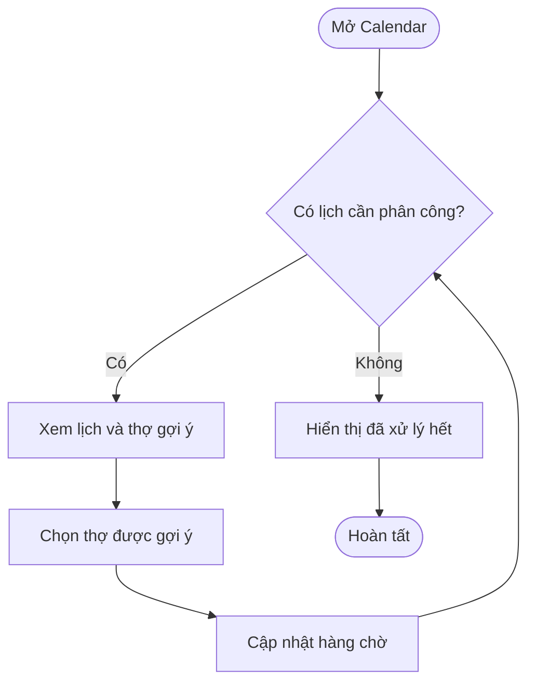
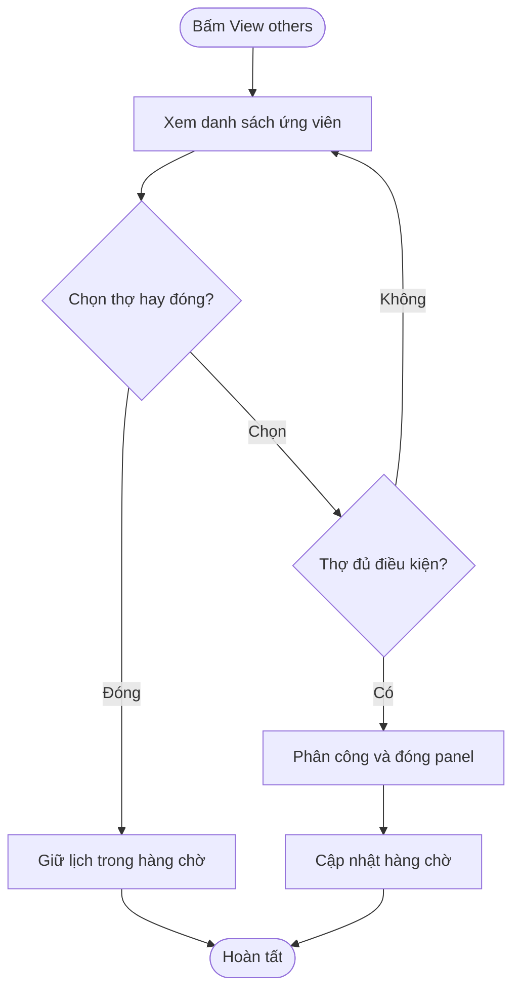
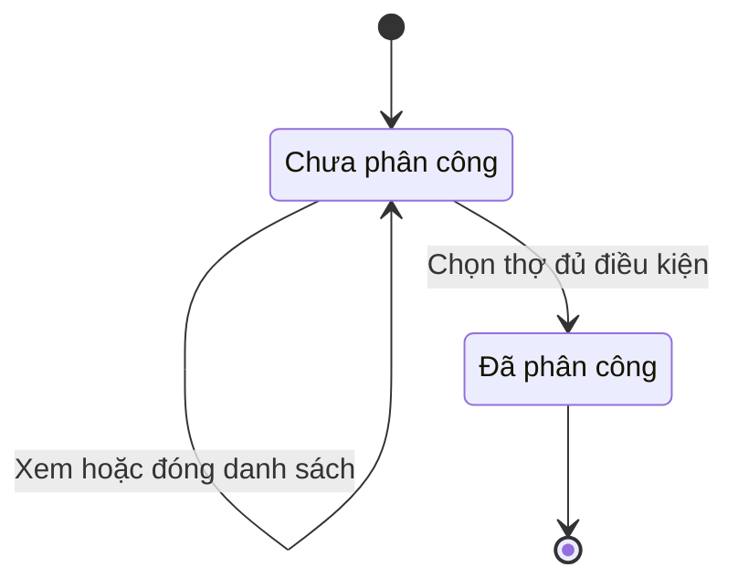

## Appointments Need Assignment

**Last Updated:** 2026-09-07  
**Audience:** Chủ salon, Manager, Front Desk, Product Owner, BA, QA  
**Status:** Draft

### Overview

Tại **POS → Front Desk → Appointments → Calendar**, khu vực **Appointments need assignment** tập hợp các lịch hẹn **Anyone** chưa được phân công thợ. Người phụ trách có thể chọn thợ được gợi ý hoặc xem danh sách ứng viên để phân công. Tài liệu phân biệt hành vi prototype hiện có với tiêu chí cần hoàn thiện trước khi vận hành thực tế.

### Key Concepts

| Thuật ngữ | Ý nghĩa |
| :--- | :--- |
| Anyone appointment | Khách không yêu cầu đích danh thợ. |
| Needs assignment | Lịch hẹn chưa có thợ được phân công. |
| Suggested technician | Ứng viên đủ điều kiện xếp đầu danh sách gợi ý. |
| Eligible | Có kỹ năng phù hợp, có lịch làm việc và không bị đánh dấu trùng lịch. |
| Turn score | Điểm lượt dùng để so sánh thứ tự ưu tiên; thấp hơn được ưu tiên. |
| Daily workload | Số booking hôm nay, dùng khi các ứng viên có cùng điểm lượt. |
| Assignment due soon | Dấu hiệu lịch hẹn cần được phân công sớm. Prototype đang dùng cờ dữ liệu mẫu. |

### User Roles

| Role | Responsibilities in this Feature |
| :--- | :--- |
| Manager / Front Desk phụ trách điều phối | Xem lịch chưa có thợ và chọn người thực hiện. |
| Chủ salon / Manager | Cấu hình cách phân công Anyone và thời điểm cảnh báo. |
| Thợ | Người được phân công thực hiện dịch vụ. |

Đây là vai trò nghiệp vụ dự kiến; prototype chưa xác thực quyền thao tác theo người dùng đăng nhập.

### End-to-End Workflows

#### Workflow: Xem và phân công thợ được gợi ý

**Primary Actor:** Manager / Front Desk  
**Trigger:** Mở Calendar và thấy lịch hẹn cần phân công.  
**Outcome:** Lịch được xử lý khỏi danh sách chờ phân công, số lượng còn lại cập nhật.

**User Stories:**

- **US-01 — Nhận biết lịch cần phân công:** **As a** nhân viên Front Desk, **I want to** xem danh sách lịch Anyone chưa có thợ cùng giờ hẹn, thời lượng, khách và dịch vụ, **so that** tôi biết lịch nào cần xử lý và lịch nào sắp đến giờ.
- **US-02 — Chọn thợ gợi ý:** **As a** người điều phối, **I want to** xem và chọn thợ được gợi ý cho từng lịch, **so that** tôi phân công nhanh dựa trên điều kiện dịch vụ và tải công việc.
- **US-03 — Nhận biết đã xử lý hết:** **As a** nhân viên Front Desk, **I want to** thấy thông báo khi không còn lịch cần phân công, **so that** tôi biết không còn thao tác chờ xử lý tại khu vực này.

**Acceptance Criteria — đã có trong prototype:**

1. Mỗi thẻ hiển thị giờ bắt đầu, thời lượng, tên khách, dịch vụ và nhãn Anyone.
2. Lịch được đánh dấu khẩn có dòng **Assignment due soon**.
3. Thẻ có tên thợ gợi ý, cấp độ demo, điểm lượt, số booking hôm nay, nút **Assign [tên thợ]** và **View others**.
4. Bấm Assign phân công ngay, không có bước xác nhận thứ hai; thẻ được gỡ khỏi hàng chờ và tổng số giảm một.
5. Khi vẫn còn lịch chờ, thông báo cho biết khách vừa được phân công cho thợ nào.
6. Khi không còn lịch chờ, hiển thị **All Anyone appointments are assigned** và **No manager action needed right now.**

| Step | Who | Action | System Response | Notes |
| :--- | :--- | :--- | :--- | :--- |
| 1 | Front Desk | Mở Calendar | Hiển thị hàng chờ và ứng viên gợi ý | Dữ liệu mẫu hiện có ba lịch Anyone. |
| 2 | Người điều phối | Kiểm tra thông tin lịch và thợ | Hiển thị điều kiện, điểm lượt, tải công việc | Không phải dữ liệu lịch làm việc thời gian thực. |
| 3 | Người điều phối | Bấm Assign | Gỡ lịch khỏi hàng chờ, cập nhật số lượng và thông báo | Kết quả chỉ tồn tại trong phiên prototype. |

#### Workflow: Chọn thợ khác

**Primary Actor:** Manager / Front Desk  
**Trigger:** Bấm **View others** trên một lịch chờ.  
**Outcome:** Phân công một ứng viên đủ điều kiện hoặc đóng panel và giữ lịch trong hàng chờ.

**User Stories:**

- **US-04 — So sánh ứng viên:** **As a** người điều phối, **I want to** xem các ứng viên cùng thứ hạng và lý do đủ hoặc không đủ điều kiện, **so that** tôi có cơ sở chọn người phù hợp.
- **US-05 — Chọn thợ khác:** **As a** người điều phối, **I want to** chọn một thợ đủ điều kiện khác với gợi ý đầu tiên, **so that** tôi đáp ứng tình huống điều phối cụ thể của salon.
- **US-06 — Đóng mà không phân công:** **As a** người điều phối, **I want to** đóng panel lựa chọn mà chưa chọn thợ, **so that** lịch vẫn được giữ để xử lý sau.

**Acceptance Criteria — đã có trong prototype:**

1. Panel **Choose technician** hiển thị giờ hẹn, tên khách và dịch vụ của lịch đang chọn.
2. Danh sách đưa ứng viên đủ điều kiện lên trước, sau đó sắp theo điểm lượt tăng dần và số booking hôm nay tăng dần.
3. Mỗi ứng viên có thứ hạng, tên, cấp độ demo, điểm lượt và nhãn Eligible hoặc Unavailable.
4. Thợ không đủ điều kiện bị vô hiệu hóa nút chọn và có lý do: không phù hợp dịch vụ, không có lịch làm việc hoặc trùng lịch.
5. Bấm một ứng viên đủ điều kiện phân công ngay, đóng panel và cập nhật hàng chờ.
6. Đóng bằng nút ×, vùng nền hoặc Escape không thay đổi lịch chờ.
7. Hiện chưa yêu cầu nhập lý do khi chọn khác thợ được gợi ý đầu tiên.

| Step | Who | Action | System Response | Notes |
| :--- | :--- | :--- | :--- | :--- |
| 1 | Người điều phối | Bấm View others | Mở danh sách ứng viên của lịch đã chọn | Giữ ngữ cảnh khách và dịch vụ. |
| 2 | Người điều phối | So sánh thứ hạng và điều kiện | Hiển thị lý do; khóa ứng viên không đủ điều kiện | Kỹ năng và xung đột đang được mô phỏng. |
| 3 | Người điều phối | Chọn ứng viên hoặc đóng panel | Phân công và cập nhật hàng chờ, hoặc giữ nguyên | Không cần xác nhận lần hai. |

### System Configuration & Administration

**US-07 — Cấu hình cách phân công:** **As a** Chủ salon / Manager, **I want to** chọn cách xử lý lịch Anyone và mốc cảnh báo trước giờ hẹn, **so that** cách điều phối phù hợp quy trình salon.

Trong **Reward settings → Anyone assignment**, prototype có các lựa chọn:

| Cấu hình | Lựa chọn / giá trị mẫu | Mức triển khai |
| :--- | :--- | :--- |
| Cách phân công | System suggests · Manager confirms; Auto-assign immediately; Manager assigns manually | Lưu lựa chọn trong phiên và đổi dòng mô tả. Chưa thực thi ba luồng riêng. |
| Mốc cảnh báo | Mặc định 24 giờ trước lịch hẹn | Lưu và hiển thị mốc; chưa có bộ tính cảnh báo theo giờ thực. |

Mặc định đang chọn **Auto-assign immediately**, nhưng hàng chờ vẫn yêu cầu thao tác Assign. Không coi việc chọn cấu hình này là đã có auto-assign thực tế.

### State Lifecycle

Đây là trạng thái **phân công**, không phải trạng thái hoàn thành dịch vụ hay thanh toán.

| Current Status | Trigger | New Status | Notes |
| :--- | :--- | :--- | :--- |
| Chưa phân công | Mở hoặc đóng danh sách ứng viên | Chưa phân công | Lịch vẫn nằm trong hàng chờ. |
| Chưa phân công | Chọn thợ đủ điều kiện | Đã phân công | Prototype biểu diễn bằng việc gỡ thẻ khỏi hàng chờ. |

### Business Rules

- Hàng chờ này dành cho Anyone chưa có thợ, không thay thế danh sách tất cả Appointments.
- Điều kiện ứng viên được xét theo kỹ năng, lịch làm việc và cờ xung đột. Cấp độ hiển thị hiện là dữ liệu demo; chưa liên kết với Level 1–3 trong Salon Settings.
- Trong số ứng viên đủ điều kiện, điểm lượt thấp hơn được ưu tiên; nếu bằng nhau, số booking hôm nay thấp hơn được ưu tiên.
- Phân công lịch không đồng nghĩa bắt đầu dịch vụ, hoàn thành dịch vụ hoặc thanh toán.
- Booking Anyone không tự trở thành booking khách yêu cầu đích danh thợ sau khi phân công.
- Prototype ghi thông báo lịch sử phân công với người thao tác và thời gian mẫu; chưa có audit vận hành thực tế.

### Edge Cases & Exception Handling

| Scenario | What Happens | Who Resolves It |
| :--- | :--- | :--- |
| Không còn lịch chờ | Hiển thị thông báo đã xử lý hết | Hệ thống. |
| Thợ không đủ điều kiện | Không cho chọn trong panel, hiển thị lý do | Người điều phối chọn thợ khác. |
| Không có ứng viên đủ điều kiện | **Cần bổ sung:** giữ lịch chờ, không hiển thị gợi ý rỗng, thông báo cần xử lý thủ công. Hàm dựng thẻ hiện chưa xử lý trường hợp này an toàn. | Đội phát triển; người điều phối xử lý nghiệp vụ. |
| Lịch thợ thay đổi sau khi mở panel | **Cần bổ sung:** kiểm tra lại điều kiện trước khi xác nhận, tránh phân công trùng. | Hệ thống; người điều phối chọn lại khi cần. |
| Phân công xong rồi tải lại trang | Dữ liệu demo được khởi tạo lại. **Cần bổ sung:** lưu kết quả và đồng bộ với kho Appointments, ô lịch và các màn hình liên quan. | Đội phát triển. |
| Thay đổi khoảng ngày hoặc bộ lọc của Appointments | Hàng chờ hiện là danh sách mẫu riêng; chưa được lọc đồng bộ | Cần xác định và triển khai phạm vi lọc. |
| Lưu cấu hình auto-assign hoặc mốc cảnh báo | Chỉ cập nhật cấu hình và mô tả trong phiên | Cần triển khai cơ chế phân công và cảnh báo thực tế. |

### Frequently Asked Questions

**Q: Bấm Assign có cần xác nhận thêm không?**  
A: Không. Prototype xử lý ngay khi bấm thợ gợi ý hoặc ứng viên đủ điều kiện.

**Q: Vì sao đã chọn Auto-assign mà vẫn thấy lịch chờ?**  
A: Hiện cấu hình này chưa kích hoạt cơ chế tự động phân công.

**Q: Đổi Technician Level trong Staff có đổi thứ hạng gợi ý không?**  
A: Chưa. Danh sách ứng viên hiện dùng dữ liệu demo riêng, chưa đồng bộ với Staff.

### Related Features

- [Technician Level](technician-level.md)
- [Front Desk — Appointments / Calendar](../../html/pages/pos-front-desk.html?tab=appointments&view=calendar)
- [Turn Board](../../html/pages/pos-front-desk-turn-board.html)
