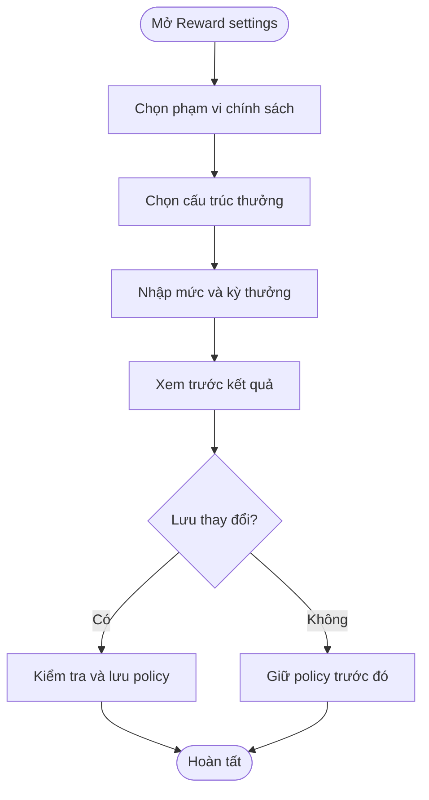
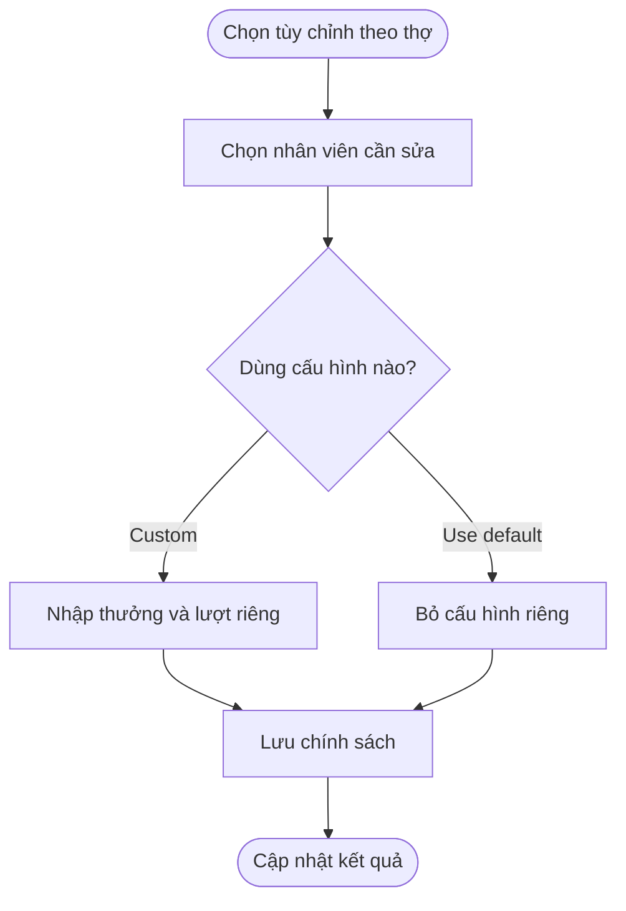
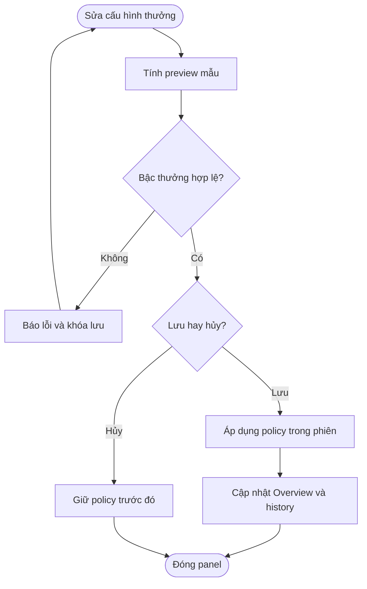
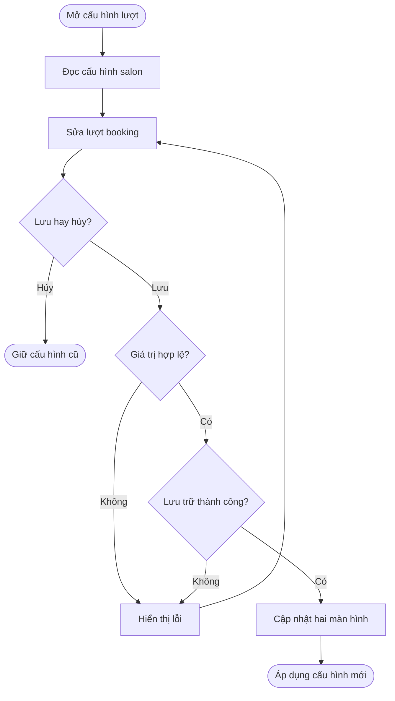
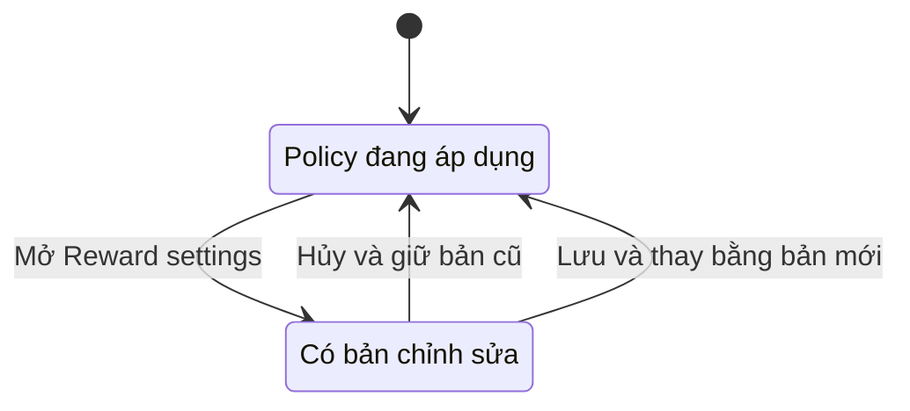

## Booking Incentive Policy

**Last Updated:** 2026-09-15

**Audience:** Chủ salon, Manager, Product Owner, BA, QA  
**Status:** Draft

### Overview

**Booking incentive policy** được mở bằng nút **Reward settings** tại **POS → Front Desk → Appointments → Calendar**. Chủ salon cấu hình cách thưởng booking, booking turn credit, phạm vi áp dụng và cách phân công lịch Anyone. Tài liệu này mô tả user stories và tiêu chí nghiệm thu, đồng thời nêu rõ các giới hạn của prototype; lưu policy hiện chưa tạo ra khoản chi trả hay một phiên bản chính sách vận hành bền vững.

### Key Concepts

| Thuật ngữ | Ý nghĩa |
| :--- | :--- |
| Same policy for all | Một chính sách chung cho các thợ. |
| Customize by technician | Chính sách mặc định kèm cấu hình riêng cho từng thợ. |
| Flat reward | Một mức tiền cho mỗi booking được tính thưởng. |
| By level | Mức thưởng trên mỗi booking tùy cấp độ Junior/Senior/Master trong demo. |
| Volume tiers | Mức thưởng thay đổi theo bậc số lượng booking. |
| Progressive | Tính riêng số booking thuộc từng bậc rồi cộng thưởng. |
| Final tier | Áp mức thưởng của bậc đạt được cho toàn bộ số booking dùng tính thưởng. |
| Booking turn credit | Số lượt quy đổi cho mỗi booking được tính lượt; cho phép số không âm, gồm cả số lẻ. Theo quy tắc đã chốt, chỉ Customer Request thuộc phạm vi áp dụng. Giá trị mặc định của salon dùng chung với Weighted Turn Settings. |
| Weighted Turn Settings | Màn hình tại Turn Board để thêm/xóa khoảng dịch vụ, chỉnh Up to và lượt dịch vụ, cùng booking turn credit mặc định. Phần lượt chung của Booking Incentive Policy chỉ có booking turn credit. |
| Effective date | Ngày người quản lý muốn chính sách bắt đầu áp dụng. Hiện mới được lưu trong phiên và hiển thị. |
| Override | Cấu hình riêng của một thợ, thay thế một số giá trị mặc định. |
| Live payout preview | Phần xem trước phép tính cho 45 booking mẫu; không thực hiện payout. |

### User Roles

| Role | Responsibilities in this Feature |
| :--- | :--- |
| Chủ salon / Manager | Thiết lập chính sách, xem trước, kiểm tra và lưu thay đổi. |
| Thợ | Đối tượng áp dụng mức thưởng và booking turn credit. |
| Front Desk | Tham khảo cấu hình điều phối lịch Anyone và kết quả trên Calendar. |

Nhãn **Owner Access** thể hiện đối tượng sử dụng dự kiến. Prototype chưa thực thi kiểm soát quyền chỉnh policy theo tài khoản.

### End-to-End Workflows

#### Workflow: Thiết lập chính sách thưởng chung

**Primary Actor:** Chủ salon / Manager  
**Trigger:** Bấm Reward settings.  
**Outcome:** Có bộ cấu hình thưởng chung để xem trước và lưu.

**User Stories:**

- **US-01 — Chọn phạm vi chính sách:** **As a** Chủ salon, **I want to** chọn chính sách chung hoặc tùy chỉnh theo thợ, **so that** tôi có thể áp dụng quy tắc nhất quán và xử lý các thỏa thuận riêng.
- **US-02 — Chọn cách tính thưởng:** **As a** Chủ salon, **I want to** chọn Flat reward, By level hoặc Volume tiers, **so that** cách tính thưởng phù hợp mục tiêu khuyến khích booking của salon.
- **US-03 — Thiết lập kỳ và lượt quy đổi:** **As a** Manager, **I want to** chọn kỳ thưởng, booking turn credit và ngày hiệu lực, **so that** tôi xác định được khoảng tính thưởng và ảnh hưởng dự kiến đến lượt của thợ.

**Acceptance Criteria — giao diện và hành vi hiện có:**

1. Mở panel hiển thị cấu hình thưởng trong phiên và booking turn credit mặc định đã lưu trong trình duyệt cho salon.
2. Policy scope có **Same policy for all** và **Customize by technician**.
3. Reward structure có ba lựa chọn; chỉ phần nhập tương ứng với lựa chọn hiện tại được hiển thị.
4. Flat reward cho nhập đơn giá; By level có mức riêng cho Junior, Senior và Master.
5. Volume tiers cho nhập From, To và Reward; có Add tier, xóa bậc, Progressive và Final tier.
6. Reward period có Daily, Weekly, Biweekly, Monthly.
7. Booking turn credit cho nhập số không âm, ví dụ 0, 0.5, 1 hoặc 1.25. Không chấp nhận ô trống hoặc số không hữu hạn.
8. Có ô chọn Effective date.
9. Chuyển cấu trúc thưởng trong cùng phiên chỉnh sửa giữ các giá trị đã nhập ở các cấu trúc khác.

**Giới hạn:** Reward period chưa xác lập kỳ đối soát thực tế. Effective date chưa điều khiển thời điểm áp dụng: Save policy vẫn tính lại màn hình ngay. By level chưa đồng bộ với Level 1–3 của Staff.

| Step | Who | Action | System Response | Notes |
| :--- | :--- | :--- | :--- | :--- |
| 1 | Chủ salon | Mở Reward settings | Hiển thị Booking incentive policy | Tạo bản chỉnh sửa trong phiên. |
| 2 | Chủ salon | Chọn scope và cấu trúc thưởng | Hiện các trường tương ứng | Có thể thay đổi trước khi lưu. |
| 3 | Manager | Nhập mức thưởng, kỳ và turn credit | Cập nhật preview | Preview dùng 45 booking mẫu. |
| 4 | Manager | Kiểm tra và lưu hoặc hủy | Áp dụng trong phiên hoặc giữ cấu hình cũ | Chưa có version vận hành thực tế. |

#### Workflow: Tùy chỉnh chính sách cho từng thợ

**Primary Actor:** Chủ salon / Manager  
**Trigger:** Chọn Customize by technician.  
**Outcome:** Một thợ sử dụng chính sách mặc định hoặc cấu hình riêng.

**User Stories:**

- **US-04 — Thiết lập override:** **As a** Chủ salon, **I want to** đặt mức thưởng và lượt quy đổi riêng cho một thợ, **so that** tôi thể hiện được thỏa thuận khuyến khích booking riêng của thợ đó.
- **US-05 — Trở về mặc định:** **As a** Manager, **I want to** chuyển một thợ từ Custom về Use default, **so that** thợ tiếp tục tuân theo chính sách chung của salon.

**Acceptance Criteria — hiện có:**

1. Chỉ hiện Technician overrides khi chọn Customize by technician.
2. Mỗi dòng có tên, cấp độ demo, Use default/Custom, mức tiền thưởng và booking turn credit.
3. Chọn Custom và lưu sẽ tạo cấu hình thưởng cố định riêng cho thợ, kể cả khi policy mặc định dùng By level hoặc Volume tiers.
4. Chọn Use default và lưu sẽ bỏ override của thợ đó.
5. Chọn Same policy for all khiến phép tính sử dụng policy chung, dù trước đó đã có override.

**Hành vi hiện có:** Mở lại hoặc dựng lại form giữ đúng booking turn credit riêng đã lưu trong phiên. Thay đổi lượt mặc định của salon không ghi đè lượt riêng của thợ. Danh sách override hiện chỉ có sáu thợ đầu tiên của bộ dữ liệu mẫu; override chưa lưu qua lần tải lại trang.

| Step | Who | Action | System Response | Notes |
| :--- | :--- | :--- | :--- | :--- |
| 1 | Chủ salon | Chọn Customize by technician | Hiện danh sách override | Tối đa sáu thợ mẫu. |
| 2 | Chủ salon | Chọn Custom hoặc Use default | Ghi nhận lựa chọn trong bản chỉnh sửa | Custom dùng thưởng cố định. |
| 3 | Chủ salon | Nhập mức riêng và lưu | Tính lại kết quả theo scope đang chọn | Giữ đúng turn credit riêng khi mở lại trong phiên. |

#### Workflow: Xem trước, kiểm tra và lưu policy

**Primary Actor:** Chủ salon / Manager  
**Trigger:** Thay đổi cấu hình trong panel.  
**Outcome:** Lưu cấu hình hợp lệ hoặc bỏ thay đổi chưa lưu.

**User Stories:**

- **US-06 — Xem trước cách tính:** **As a** Manager, **I want to** xem số tiền thưởng mẫu ngay khi đổi cấu hình, **so that** tôi có thể kiểm tra cách tính trước khi lưu.
- **US-07 — Ngăn bậc thưởng không hợp lệ:** **As a** Chủ salon, **I want to** được báo lỗi và không cho lưu khi các bậc thưởng không hợp lệ, **so that** chính sách không có khoảng trống, chồng lấn hoặc mức thưởng âm.
- **US-08 — Lưu hoặc hủy thay đổi:** **As a** Manager, **I want to** lưu policy sau khi kiểm tra hoặc đóng panel để bỏ thay đổi, **so that** tôi kiểm soát được cấu hình được áp dụng.

**Acceptance Criteria — hiện có:**

1. Preview tính cho **45 booking**, và dùng cấp độ **Master** khi chọn By level.
2. Khi Volume tiers không hợp lệ, preview hiện **Check policy settings**, có thông báo lỗi và nút Save policy bị vô hiệu hóa.
3. Danh sách bậc phải có ít nhất một bậc; bậc đầu bắt đầu từ 1; các bậc kế tiếp bắt đầu ngay sau giới hạn trên bậc trước.
4. Giá trị To phải lớn hơn hoặc bằng From; mức Reward phải hữu hạn và không âm.
5. To để trống nghĩa là không giới hạn; bậc này chỉ được nằm cuối.
6. Save policy hợp lệ lưu booking turn credit mặc định vào trình duyệt, giữ các khoảng tiền và lượt dịch vụ đã lưu mới nhất, đóng panel, cập nhật Technician Overview và thêm dòng Policy history trong phiên. Nếu lưu trữ thất bại, panel giữ mở và báo lỗi; không áp dụng bản thưởng mới.
7. Cancel, nút × hoặc bấm vùng nền đóng panel mà không áp dụng bản chỉnh sửa. Mở lại lấy cấu hình đã lưu trước đó.

**Ví dụ nghiệm thu phép tính, với 45 booking đủ điều kiện mẫu:**

| Cấu hình | Kết quả |
| :--- | :--- |
| Flat reward: $2/booking | $90 |
| By level: Master $3/booking | $135 |
| Bậc 1–20: $1; 21–40: $2; 41+: $3; Progressive | 20 × $1 + 20 × $2 + 5 × $3 = $75 |
| Cùng các bậc trên; Final tier | 45 × $3 = $135 |

Preview không tính riêng từng override và không tự kiểm chứng rằng 45 booking đều là Customer Request đủ điều kiện.

| Step | Who | Action | System Response | Notes |
| :--- | :--- | :--- | :--- | :--- |
| 1 | Manager | Thay đổi cấu hình | Cập nhật phép tính mẫu và thông báo kiểm tra | Không chi trả tiền. |
| 2 | Manager | Sửa lỗi nếu có | Cho phép Save policy khi kiểm tra bậc đạt | Validation mức tiền khác còn thiếu. |
| 3 | Manager | Save policy | Lưu lượt booking mặc định trong trình duyệt; áp dụng phần thưởng trong phiên | Lịch sử vẫn là dữ liệu mẫu. |
| 4 | Manager | Hoặc Cancel/đóng panel | Không áp dụng thay đổi chưa lưu | Mở lại lấy policy trước đó. |

#### Workflow: Đồng bộ lượt booking với Turn Board

**Primary Actor:** Chủ salon / Manager
**Trigger:** Mở Booking Incentive Policy hoặc Weighted Turn Settings tại Turn Board.
**Outcome:** Cả hai màn hình sử dụng cùng booking turn credit mặc định; Save policy giữ nguyên cấu hình dịch vụ mới nhất đã lưu từ Turn Board.

**User Stories:**

- **US-10 — Thiết lập lượt booking từ hai màn hình:** **As a** Manager, **I want to** sửa booking turn credit mặc định từ một trong hai màn hình, **so that** tôi không phải nhập lại cùng giá trị ở nhiều nơi.
- **US-11 — Giữ cấu hình sau khi mở lại:** **As a** Chủ salon, **I want to** mở màn hình còn lại hoặc tải lại trang và thấy giá trị đã lưu, **so that** các thao tác tiếp theo dùng đúng cấu hình của salon.
- **US-12 — Ngăn lưu lượt không hợp lệ:** **As a** Manager, **I want to** nhận thông báo khi thiếu số lượt, nhập số âm hoặc không thể lưu, **so that** cấu hình đang áp dụng không bị thay thế bởi dữ liệu lỗi.

**Acceptance Criteria — hiện có:**

1. Cả hai form có booking turn credit mặc định. Booking Incentive Policy không có mục Weighted Turn Settings, danh sách range hoặc ô lượt dịch vụ, áp dụng cho cả Calendar trong Front Desk và trang Calendar độc lập. Thêm/xóa range, chỉnh Up to và lượt dịch vụ tại Turn Board.
2. Booking turn credit mặc định là 0.5. Cấu hình khoảng tiền và lượt dịch vụ được quản lý trong Weighted Turn Settings tại Turn Board.
3. Save Rules lưu toàn bộ range, lượt dịch vụ và lượt booking. Save policy cập nhật booking turn credit, giữ nguyên toàn bộ khoảng tiền và lượt dịch vụ đã lưu mới nhất, kể cả khi Turn Board đã đổi chúng sau lúc mở policy. Turn Board có liên kết mở Booking Incentive Policy; liên kết không tự lưu bản đang chỉnh.
4. Các trang cùng salon trên cùng địa chỉ ứng dụng và trình duyệt nhận booking turn credit đã lưu, kể cả khi tải lại. Calendar đang mở cập nhật ô booking turn credit; các trường thưởng, Anyone assignment và override đang sửa vẫn giữ nguyên.
5. Cancel hoặc đóng form không lưu bản chỉnh sửa. Mở lại form lấy giá trị đã lưu gần nhất.
6. Ô trống, số âm hoặc số không hữu hạn bị từ chối. Lỗi lưu trữ giữ form mở và thông báo thất bại.
7. Add Turn dùng khoảng tiền và mức lượt dịch vụ đã lưu để gợi ý lượt, kể cả mức lẻ như 1.25; các lượt đã ghi trên Turn Board không tự tính lại.
8. Technician Overview cập nhật booking credit từ mặc định mới; thợ có override đang áp dụng tiếp tục dùng lượt riêng.

**Phạm vi tích hợp:** Đây là chia sẻ cấu hình trong prototype. Chưa có sổ lượt chung giữa Calendar và Turn Board, chưa tự ghi lượt từ booking hoàn thành, chưa cộng hoặc trừ lại lượt lịch sử. Không tự cộng cả lượt booking và lượt theo giá trị dịch vụ cho cùng booking. Số liệu Overview vẫn mô phỏng; các ngưỡng giá trị dịch vụ chưa dùng để tính lại Walk-in turns mô phỏng.

| Step | Who | Action | System Response | Notes |
| :--- | :--- | :--- | :--- | :--- |
| 1 | Manager | Mở một trong hai form | Đọc lượt booking mặc định của salon | Phần thưởng vẫn nằm trong Booking Incentive Policy. |
| 2 | Manager | Nhập booking turn credit | Giữ bản chỉnh sửa | Chưa đổi lượt đã ghi. |
| 3 | Manager | Bấm lưu | Kiểm tra giá trị, lưu cấu hình | Save policy giữ khoảng tiền và lượt dịch vụ mới nhất; nếu thất bại, giữ form mở. |
| 4 | Hệ thống | Thông báo cấu hình mới | Đồng bộ booking turn credit và kết quả liên quan | Không ghi đè trường thưởng hoặc override đang sửa. |
| 5 | Manager | Mở màn hình còn lại | Thấy lượt booking vừa lưu | Cùng trình duyệt và địa chỉ ứng dụng. |

### System Configuration & Administration

**US-09 — Cấu hình Anyone assignment:** **As a** Chủ salon, **I want to** chọn cách phân công booking Anyone và mốc cảnh báo lịch chưa có thợ, **so that** tôi thống nhất quy trình điều phối trong salon.

- Cách phân công: System suggests, manager confirms; Auto-assign immediately; Manager assigns manually.
- Mốc Unassigned alert: 2, 6, 12, 24 hoặc 48 giờ trước lịch hẹn.
- Save policy lưu cấu hình thưởng và cấu hình Anyone trong phiên, đồng thời lưu booking turn credit mặc định trong trình duyệt theo salon. Các khoảng tiền và lượt dịch vụ đã lưu mới nhất được giữ nguyên. Auto-assign và cảnh báo theo thời gian thực chưa hoạt động; chi tiết được mô tả trong tài liệu Appointments Need Assignment.
- Mặc định: thưởng theo bậc lũy tiến, kỳ Weekly, 0.5 booking turn credit; Anyone chọn Automatic và cảnh báo trước 24 giờ.
- Panel hiện chưa có công tắc bật/tắt chương trình thưởng, dù mô hình tính toán có hỗ trợ trạng thái này.

### State Lifecycle

Đây là vòng đời chỉnh sửa trong phiên, không phải quy trình phê duyệt hoặc phát hành phiên bản policy.

| Current Status | Trigger | New Status | Notes |
| :--- | :--- | :--- | :--- |
| Đang áp dụng | Mở Reward settings | Có bản chỉnh sửa | Policy trước đó vẫn được giữ. |
| Có bản chỉnh sửa | Cancel/đóng panel | Đang áp dụng bản cũ | Không áp dụng nội dung vừa nhập. |
| Có bản chỉnh sửa | Save policy | Đang áp dụng bản mới trong phiên | Có dòng history mẫu; chưa có version ID. |

### Business Rules

- Quy tắc thưởng hiển thị: chỉ booking Customer Request hoàn thành đủ điều kiện thưởng; Anyone nhận $0 booking reward.
- **Điều kiện Booking turn credit — đã chốt:** Chỉ booking khách yêu cầu đích danh thợ (Customer Request) thuộc phạm vi tính Booking turn credit; Anyone không được tính khoản lượt này. Điều kiện này không quyết định lượt dịch vụ hoặc người nhận khi booking được giao lại. Tiêu chí nghiệm thu nằm trong [Weighted Turn Settings](weighted-turn-settings.md).
- **Giới hạn:** Phép tính Overview và preview vẫn dùng số booking mô phỏng, chưa kiểm chứng điều kiện thưởng hoặc lọc Customer Request để tính Booking turn credit trên từng booking thực tế.
- Reward và booking turn credit là hai đại lượng riêng; không coi thưởng tiền bằng 0 đồng nghĩa lượt bằng 0.
- Booking turn credit mặc định dùng chung giữa hai màn hình. Khoảng tiền và lượt dịch vụ chỉ được chỉnh tại Turn Board; Save policy giữ cấu hình dịch vụ mới nhất đã lưu. Thay đổi không tự điều chỉnh các lượt đã ghi. Chưa đồng bộ cấu hình qua thiết bị khác hoặc tài khoản trên máy chủ.
- Custom override hiện là mức thưởng cố định và turn credit riêng; không có bộ bậc thưởng riêng trên từng dòng thợ.
- Lưu policy chỉ tính lại số liệu prototype; không tạo giao dịch, không chi trả và không xác nhận tiền đã được nhận.
- Policy history hiện dùng người thao tác và thời gian mẫu. Không coi đây là audit bất biến hoặc lịch sử phiên bản chính thức.

### Edge Cases & Exception Handling

| Scenario | What Happens | Who Resolves It |
| :--- | :--- | :--- |
| Không có bậc, bậc chồng lấn hoặc bị hở | Có thông báo và khóa Save policy | Người quản lý sửa bậc. |
| Bậc không giới hạn không nằm cuối | Bị từ chối bởi kiểm tra bậc | Người quản lý sửa To hoặc thứ tự bậc. |
| Số âm ở Flat reward, By level hoặc override | Trường có giới hạn nhập nhưng chưa kiểm tra đầy đủ trước Save | Đội phát triển bổ sung validation tại bước lưu. |
| Mốc From/To là số lẻ hoặc không bao phủ toàn bộ lượng booking | Prototype chưa kiểm tra đầy đủ tính nguyên và phạm vi cuối | Cần xác định quy tắc và bổ sung kiểm tra. |
| Effective date ở tương lai | Lưu vẫn áp dụng ngay trên màn hình | Cần cơ chế ngày hiệu lực và policy theo kỳ. |
| Mở lại override đã lưu trong phiên | Giữ đúng lượt riêng đã chọn | Không cần xử lý. |
| Không thể ghi vào bộ nhớ trình duyệt | Báo lỗi và không đóng form | Người quản lý kiểm tra lưu trữ trình duyệt rồi thử lại. |
| Cấu hình lưu trữ bị hỏng | Dùng bộ lượt mặc định của salon | Người quản lý kiểm tra và lưu lại cấu hình. |
| Tải lại trang sau Save | Giữ lượt chung đã lưu; phần thưởng, override và Anyone trở về demo | Cần máy chủ để lưu toàn bộ chính sách và quản lý phiên bản. |
| Hai quản lý cùng sửa hoặc sửa policy của kỳ đã chốt | Chưa có kiểm soát xung đột, khóa kỳ hay phê duyệt | Chủ salon xác định nghiệp vụ; đội phát triển triển khai. |
| Giao dịch bị hoàn tiền | Chưa có quy tắc đảo thưởng thực tế hoặc gắn giao dịch với phiên bản policy | Cần hoàn thiện đối soát booking và reward. |

### Frequently Asked Questions

**Q: Live payout preview có chuyển tiền không?**  
A: Không. Đây chỉ là phép tính thưởng mẫu cho 45 booking.

**Q: Progressive và Final tier khác nhau ở đâu?**  
A: Progressive cộng thưởng theo từng bậc. Final tier lấy mức của bậc đạt được để tính cho toàn bộ số booking.

**Q: Ngày hiệu lực đã điều khiển lúc áp dụng policy chưa?**  
A: Chưa. Prototype hiện áp dụng ngay khi Save policy.

**Q: Có thể cấu hình toàn bộ thợ và lưu lâu dài chưa?**  
A: Chưa. Override chỉ hiển thị sáu thợ mẫu và dữ liệu mới lưu trong phiên.

**Q: Weighted Turn Settings có chỉnh được lượt booking không?**
A: Có. Cả hai màn hình chỉnh cùng lượt booking mặc định. Khoảng tiền và lượt dịch vụ chỉ được chỉnh trong Weighted Turn Settings tại Turn Board. Save policy giữ nguyên các khoảng tiền và lượt dịch vụ đã lưu mới nhất. Lượt riêng của thợ vẫn được cấu hình trong Booking Incentive Policy; chỉ cấu hình chung được lưu qua lần tải lại trang.

### Related Features

- [Weighted Turn Settings](weighted-turn-settings.md)

- [Technician Overview](technician-overview.md)
- [Appointments Need Assignment](appointments-need-assignment.md)
- [Technician Level](technician-level.md)
- [Front Desk — Calendar](../../html/pages/pos-front-desk.html?tab=appointments&view=calendar)

- [Weighted Turn Settings — Turn Board](../../html/pages/pos-front-desk-turn-board.html?settings=weighted-turns)
