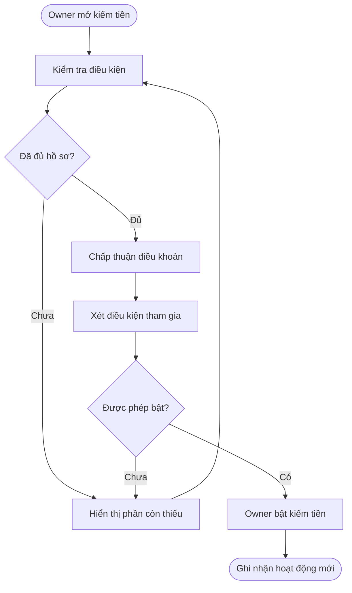
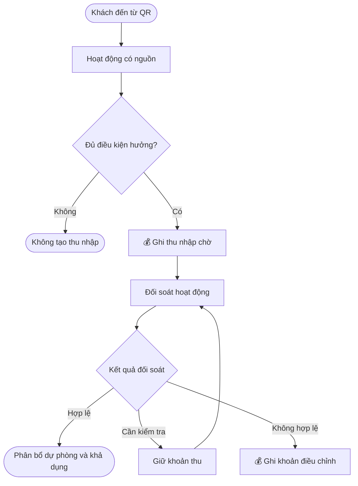
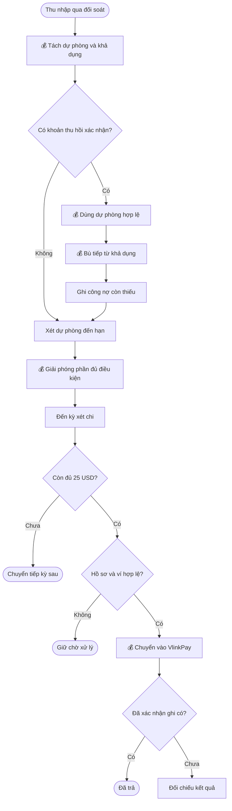
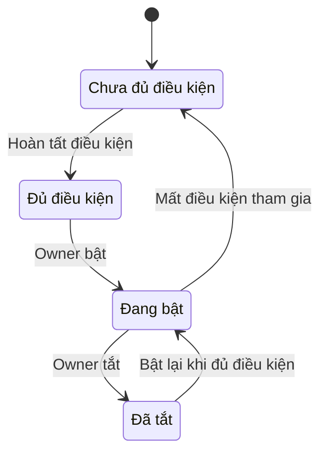
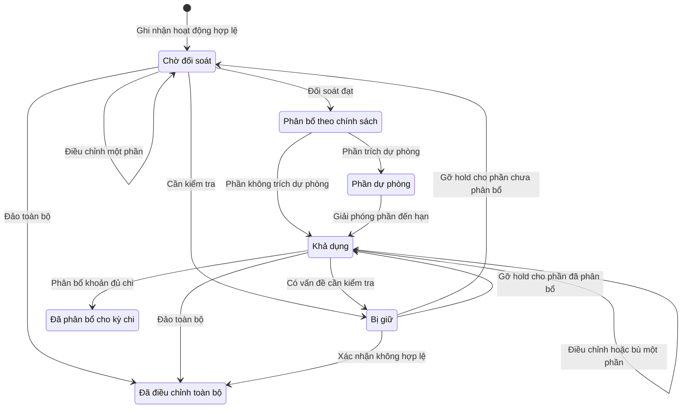
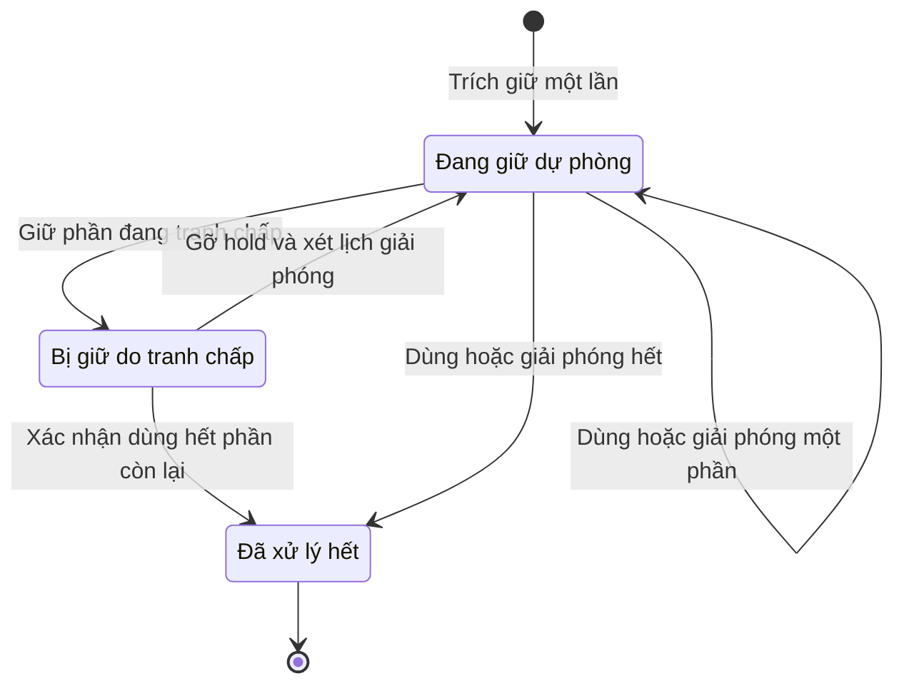
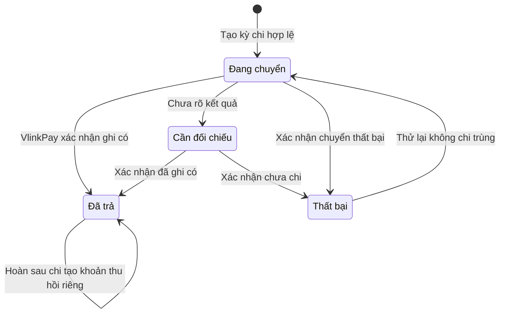

## Business OneQR — Kiếm tiền từ QR, đối soát và nhận tiền

**Last Updated:** 2026-09-22

**Audience:** Business Owner, Product Owner, BA, FE, BE, QA, Support

**Status:** Draft — phạm vi và các quyết định của user đã được ghi nhận; phụ thuộc tích hợp và các điểm chưa được HTML quy định được nêu riêng.

### Overview

Business Owner bật kiếm tiền cho OneQR của doanh nghiệp để nhận thu nhập từ hoạt động quảng cáo hoặc giao dịch đủ điều kiện do QR của mình giới thiệu. Owner theo dõi nguồn thu, đối soát, khoản dự phòng, điều chỉnh và lịch sử nhận tiền. Sau đối soát, hệ thống giữ lại một phần thu nhập theo chính sách dự phòng hoàn tiền/tranh chấp; phần được phép chi trả chuyển vào **ví VlinkPay liên kết SSO của tài khoản Business**. Khoản dự phòng và thu nhập trên Nexora chưa phải tiền đã được ghi có vào ví VlinkPay.

**User story chính:** Là Business Owner, tôi muốn bật kiếm tiền cho OneQR, theo dõi thu nhập và đối soát, rồi nhận tiền vào ví VlinkPay của tài khoản Business, để biết QR tạo ra thu nhập từ đâu và số tiền thực tế tôi nhận được.

**Trong phạm vi:** đăng ký/bật/tắt kiếm tiền; kế thừa KYB và yêu cầu thuế; ghi nhận nguồn và thu nhập trực tiếp của Business; đối soát; trích giữ, sử dụng và giải phóng khoản dự phòng hoàn tiền/tranh chấp; lịch sử; chi trả vào ví VlinkPay SSO; khấu trừ khoản đã trả cần thu hồi, chuyển phần chưa bù hết sang thu nhập các kỳ sau.

**Ngoài phạm vi:** Personal; Sponsor Override và cấp Sponsor; nạp Ads Credit; xây Campaign Manager, Discovery, bộ lọc ngành hoặc hệ thống KYB mới; mua voucher trả trước; rút tiền từ VlinkPay về ngân hàng. Các hệ thống campaign, discovery, xác minh và ví là phần liên quan được tích hợp.

#### Quyết định đã chốt và thứ tự ưu tiên

| Nội dung | Quyết định áp dụng |
| :--- | :--- |
| Chủ thể | Chỉ Business; Business Owner quản lý kiếm tiền và xem thu nhập của doanh nghiệp trong phạm vi này. |
| Nguồn chính sách | Dùng **ONEQR-ADS-REF-REV-2026-09-21-v1**, bản mới nhất có mã phiên bản trong bộ HTML. Không trộn tỷ lệ 70% của chính sách ngày 20/09 hoặc tỷ lệ minh họa từ các prototype khác vào bản này. |
| Xác minh | Kế thừa KYB hiện có và yêu cầu thuế áp dụng cho Business; hiển thị các điều kiện còn thiếu. Không xây lại KYB trong story. |
| Nơi nhận tiền | Ví VlinkPay của tài khoản Business, xác định qua liên kết SSO được hệ thống xác nhận. Quyết định này thay phần chọn phương thức nhận tiền tổng quát trong HTML. |
| Đối soát và kỳ chi | Thời gian đối soát mặc định **14 ngày**, áp dụng cả click quảng cáo và thưởng dịch vụ. **Admin vận hành hệ thống cấu hình số ngày**; Business Owner không được sửa. Hết thời gian và không có hold mới phân bổ dự phòng/khả dụng; xét chi thứ Ba tại 00:00 America/Chicago, số dư đủ chi sau dự phòng và khấu trừ tối thiểu $25. |
| Dự phòng hoàn tiền/tranh chấp | Giữ lại một phần Publisher Share sau đối soát trên Nexora, chưa chuyển phần này vào ví VlinkPay. Admin vận hành cấu hình tỷ lệ, thời hạn và phạm vi Business/nhóm rủi ro áp dụng; công khai cho Owner. User đã chọn cơ chế, chưa chốt tỷ lệ và số ngày cụ thể. |
| Thu hồi sau payout | Ưu tiên dùng dự phòng còn lại được phép sử dụng của cùng Business, rồi thu nhập khả dụng chưa chi; chỉ phần thiếu mới bù vào thu nhập các kỳ sau. Mọi lần sử dụng đều liên kết khoản phải thu hồi và không thu trùng. |
| Sponsor | Không xây luồng Sponsor. Phần Publisher Share của Business vẫn theo chính sách mới; không tự cộng phần Sponsor vào thu nhập Business vì story không triển khai Sponsor. |

### Key Concepts

| Thuật ngữ | Ý nghĩa |
| :--- | :--- |
| Chủ QR / QR Host / Publisher | Business sở hữu QR hoặc nguồn truy cập hợp lệ dẫn khách đến hoạt động đủ điều kiện. |
| Nhà quảng cáo / Advertiser | Doanh nghiệp trả phí theo campaign; có thể là Business khác với chủ QR. |
| Publisher Share | Phần thu nhập trực tiếp của chủ QR từ phí quảng cáo/giao dịch hợp lệ, không phải toàn bộ giá trị dịch vụ khách thanh toán. |
| Thu nhập chờ đối soát | Khoản đã ghi nhận nhưng chưa đủ điều kiện chi trả. |
| Thu nhập khả dụng | Phần đã qua đối soát, không nằm trong dự phòng hoặc hold và chưa đưa vào một đợt chi trả; có thể dùng bù khoản cần thu hồi trước khi chi. |
| Khoản dự phòng / Reserve | Một phần thu nhập được trích giữ theo chính sách để xử lý hoàn tiền/tranh chấp. Có nguồn, số tiền còn lại và ngày dự kiến giải phóng; chưa ở ví VlinkPay và không phải phí mất đi. |
| Hold do tranh chấp | Tạm giữ khoản cụ thể đang cần kiểm tra; khác với tỷ lệ dự phòng định kỳ. Chưa có kết luận thì chưa ghi là khoản thu hồi cuối cùng. |
| Khoản cần thu hồi | Phần thưởng đã trả nhưng được xác nhận mất điều kiện hưởng; bù từ dự phòng hợp lệ, thu nhập khả dụng hoặc thu nhập tương lai. |
| Số tiền thực nhận | Phần khả dụng còn lại sau xử lý nghĩa vụ thu hồi, không bao gồm dự phòng/hold; phải đạt ngưỡng payout. |
| Ví VlinkPay SSO | Ví nhận tiền thuộc đúng tài khoản Business đã liên kết; không suy ví nhận chỉ từ email hoặc địa chỉ ví nhập tự do. |

### User Roles

| Vai trò | Trách nhiệm |
| :--- | :--- |
| Business Owner | Đồng ý điều khoản, hoàn thiện điều kiện, bật/tắt kiếm tiền và kiểm tra thu nhập/payout của doanh nghiệp. |
| Khách quét QR | Tạo hoạt động có nguồn được ghi nhận; không cần biết cơ chế chia tiền để sử dụng tiện ích. |
| Nexora Operations / Support | Admin được phân quyền cấu hình dự phòng; vận hành xử lý xét duyệt, hold, gian lận, điều chỉnh và khiếu nại theo quyền. Không xây toàn bộ portal Admin trong story này. |
| VlinkPay | Xác nhận ví nhận và kết quả ghi có theo tích hợp SSO/payout. |

### End-to-End Workflows

#### Workflow: Đăng ký và bật/tắt kiếm tiền

**Primary Actor:** Business Owner.

**Trigger:** Owner mở mục kiếm tiền trong OneQR.

**Outcome:** Business đủ điều kiện có thể chủ động bật kiếm tiền; trạng thái và bước cần hoàn thiện rõ ràng.

**User Stories:**

- Là Business Owner, tôi muốn xem điều kiện tham gia và sử dụng kết quả KYB hiện có để hoàn thiện hồ sơ mà không làm lại bước đã được chấp thuận.
- Là Business Owner, tôi muốn chủ động bật/tắt kiếm tiền và hiểu ảnh hưởng tới các khoản đã được ghi nhận.
- Là Business Owner, khi hồ sơ chưa đủ hoặc bị từ chối, tôi muốn thấy lý do và cách bổ sung.

| Bước | Ai | Hành động | Phản hồi hệ thống |
| :--- | :--- | :--- | :--- |
| 1 | Owner | Mở OneQR → Kiếm tiền. | Hiển thị Business, trạng thái tham gia, chính sách và điều kiện còn thiếu. |
| 2 | Owner / hệ thống | Kiểm tra KYB, thông tin thuế, quyền sở hữu nguồn QR, điều kiện bảo mật và liên kết ví. | Kế thừa kết quả xác minh; dẫn tới luồng hiện có nếu cần bổ sung. SSO đăng nhập thành công không tự được coi là ví đủ điều kiện nhận tiền. |
| 3 | Owner | Đọc và chủ động đồng ý điều khoản. | Hiển thị cả tỷ lệ/thời hạn dự phòng, ngày giải phóng dự kiến và thứ tự xử lý thu hồi. Ghi nhận người chấp thuận, thời điểm và phiên bản chính sách; ô đồng ý không được chọn sẵn. |
| 4 | Nexora / Owner | Xét điều kiện; Owner bật khi đủ điều kiện. | Hiển thị đã bật, chờ xét hoặc cần bổ sung/từ chối cùng lý do phù hợp. |
| 5 | Owner | Tắt kiếm tiền. | Không ẩn Nearby/Search hoặc làm mất tiện ích OneQR; giữ các khoản thưởng đã khóa hợp lệ để xử lý theo chính sách đã ghi nhận. |

#### Workflow: Ghi nhận nguồn và đối soát thu nhập

**Primary Actor:** Business Owner theo dõi kết quả; khách tạo hoạt động, hệ thống đối soát.

**Trigger:** Khách từ OneQR của Business tạo hoạt động đủ điều kiện.

**Outcome:** Thu nhập đúng nguồn, đúng chính sách và truy được lý do của mỗi thay đổi.

**User Stories:**

- Là Business Owner, tôi muốn biết hoạt động nào từ QR của doanh nghiệp tạo thu nhập và khoản đó đang ở trạng thái nào.
- Là Business Owner, tôi muốn thấy lý do khoản thu bị giữ, loại hoặc điều chỉnh để đối chiếu được kết quả.

| Bước | Ai | Hành động | Phản hồi hệ thống |
| :--- | :--- | :--- | :--- |
| 1 | Khách | Quét QR, khám phá và mở quảng cáo/deal phù hợp. | Giữ nguồn Business trong hành trình; scan và mở menu không tự tạo tiền. |
| 2 | Hệ thống | Kiểm tra hoạt động, campaign, nguồn, quyền hưởng và gian lận. | Loại hoạt động trùng/không hợp lệ; không tạo thu nhập nếu không có nguồn hợp lệ của Business. |
| 3 | Hệ thống | Với dịch vụ, khóa nguồn khi booking/order được xác nhận. | Giữ nguồn và phiên bản chính sách của giao dịch; quét QR khác sau đó không thay nguồn đã khóa. Booking chưa hoàn tất chưa tạo thưởng dịch vụ. |
| 4 | Hệ thống | 💰 Ghi nhận Publisher Share khi đủ điều kiện. | Tạo khoản chờ đối soát gắn hoạt động, campaign, nguồn và cách tính; chưa ghi có ví VlinkPay. |
| 5 | Hệ thống / vận hành | Đối soát; xử lý hold, hủy hoặc hoàn tiền. | Khoản hợp lệ được phân bổ thành dự phòng và phần khả dụng theo chính sách. Khoản sai có lý do và bút toán điều chỉnh, không sửa/xóa lịch sử gốc. |
| 6 | Owner | Xem tổng quan và chi tiết. | Phân biệt hoạt động, khoản chờ, dự phòng, khả dụng, hold, đã chi và điều chỉnh; chỉ hiển thị dữ liệu thuộc Business, không lộ hồ sơ khách/hóa đơn ngoài quyền. |

#### Workflow: Dự phòng, khấu trừ và nhận tiền vào ví VlinkPay

**Primary Actor:** Business Owner.

**Trigger:** Khoản thu hoàn tất đối soát, phát sinh hoàn tiền/tranh chấp, dự phòng đến hạn giải phóng hoặc đến kỳ xét chi trả.

**Outcome:** Có khoản dự phòng để giảm rủi ro hoàn tiền/tranh chấp sau payout; Owner thấy rõ tiền đang giữ, ngày giải phóng, khoản khấu trừ và tiền thực nhận vào đúng ví Business.

**User Stories:**

- Là Business Owner, tôi muốn khoản đủ điều kiện được chuyển vào ví VlinkPay SSO của doanh nghiệp và xem được lịch sử nhận tiền.
- Là Business Owner, tôi muốn biết số tiền được giữ dự phòng, lý do, tỷ lệ và ngày dự kiến giải phóng để chủ động theo dõi khoản mình sẽ nhận.
- Là Business Owner, tôi muốn khoản dự phòng còn lại được giải phóng khi hết hạn và đủ điều kiện, không bị giữ lại lần nữa ở kỳ chi tiếp theo.
- Là Business Owner, tôi muốn xem rõ khoản thưởng bị điều chỉnh, phần dự phòng đã sử dụng, khoản khấu trừ và số còn phải bù để đối chiếu thu nhập thực nhận.
- Là Business Owner, khi chuyển tiền thất bại hoặc chưa xác định kết quả, tôi muốn thấy trạng thái thực tế mà không bị tạo thêm giao dịch chuyển tiền trùng.

| Bước | Ai | Hành động | Phản hồi hệ thống |
| :--- | :--- | :--- | :--- |
| 1 | Hệ thống | 💰 Phân bổ khoản thu mới hoàn tất đối soát. | Theo chính sách đã lưu cho khoản thu, trích một phần làm dự phòng và chuyển phần còn lại thành khả dụng. Ghi thời điểm bắt đầu giữ và ngày dự kiến giải phóng; chỉ trích một lần. |
| 2 | Hệ thống / vận hành | Nhận thông tin hoàn tiền hoặc tranh chấp. | Với tranh chấp chưa kết luận, giữ phần liên quan và hiển thị lý do. Khi đã xác nhận mất điều kiện hưởng, tách phần chưa trả để đảo trực tiếp và phần đã trả cần thu hồi; không tính cùng một khoản hai lần. |
| 3 | Hệ thống | 💰 Xử lý phần đã trả cần thu hồi. | Dùng dự phòng còn lại được phép sử dụng của cùng Business trước, rồi thu nhập khả dụng chưa chi. Phần thiếu ghi công nợ để bù kỳ sau; vận hành theo dõi số tiền/thời gian tồn đọng. Mỗi lần sử dụng dự phòng/khấu trừ truy được khoản điều chỉnh gốc. |
| 4 | Hệ thống | 💰 Giải phóng dự phòng đến hạn. | Sau khi xử lý nghĩa vụ đã xác nhận, chuyển phần còn lại không bị hold sang khả dụng. Nếu còn tranh chấp, giữ phần liên quan với lý do; phần không liên quan vẫn được xét giải phóng. |
| 5 | Hệ thống | Xét kỳ thứ Ba lúc 00:00 America/Chicago. | Lấy số dư khả dụng hiện tại đã phản ánh phần chuyển kỳ, thu nhập mới sau trích dự phòng, dự phòng đã giải phóng và các lần bù; xử lý nghĩa vụ còn thiếu, không cộng/trừ lại bút toán đã ghi. Không tính phần dự phòng còn giữ, hold, đã chi hoặc đang chuyển. Kiểm tra hồ sơ và ví nhận. |
| 6 | Hệ thống | Kiểm tra số đủ chi. | Đạt tối thiểu $25 thì đưa vào kỳ chi; thấp hơn thì giữ sang kỳ sau. Không trích dự phòng lại trên số dư chuyển kỳ hoặc khoản dự phòng vừa giải phóng. |
| 7 | Hệ thống / VlinkPay | 💰 Chuyển số đủ điều kiện vào ví Business liên kết SSO. | Hiển thị đang chuyển, số tiền và tham chiếu giao dịch; không cho cùng khoản thu vào hai payout. |
| 8 | VlinkPay / Nexora | Xác nhận kết quả. | Chỉ đánh dấu đã trả khi ghi có được xác nhận. Lỗi/chưa rõ kết quả phải được đối chiếu trước khi thử lại; thử lại không trích dự phòng thêm. |
| 9 | Owner | Xem chi tiết thu nhập và kỳ chi. | Hiển thị thu nhập mới, dự phòng mới giữ, dự phòng còn lại/đã dùng/đã giải phóng, ngày giải phóng, khấu trừ, số thực nhận, công nợ còn lại và giao dịch ví. |

**Phân biệt hai thời hạn:** đối soát mặc định 14 ngày vẫn giữ nguyên. Thời hạn dự phòng là thời gian giữ thêm cho phần được trích sau đối soát, không khóa tiếp toàn bộ thu nhập. Mỗi phần dự phòng có ngày bắt đầu và ngày giải phóng riêng; hết hạn không đồng nghĩa tự chuyển ví ngay, mà chuyển sang khả dụng để xét kỳ chi.

**Ví dụ minh họa, không phải cấu hình đã chốt:** $100 Publisher Share qua đối soát, tỷ lệ dự phòng 20%, giữ thêm 30 ngày → giữ $20 dự phòng, $80 khả dụng để xét payout. Sau 30 ngày, nếu không có hold/thu hồi, $20 chuyển thành khả dụng và cộng với số khác để xét ngưỡng $25; không bị trích thêm 20% lần nữa.

### System Configuration & Administration

- Là Admin vận hành hệ thống, tôi muốn cấu hình số ngày đối soát, mặc định 14 ngày cho cả click quảng cáo và thưởng dịch vụ, để điều chỉnh thời gian chờ theo chính sách vận hành.
- Là Admin vận hành hệ thống, tôi muốn cấu hình tỷ lệ trích dự phòng, số ngày giữ thêm sau đối soát, nhóm Business áp dụng và thời điểm hiệu lực, để kiểm soát rủi ro hoàn tiền/tranh chấp mà vẫn công khai ngày dự kiến nhận tiền.
- Là người vận hành, tôi muốn thấy công nợ chưa bù theo Business, số tiền và thời gian tồn đọng, để xử lý khoản có nguy cơ không thu hồi được thay vì chờ thu nhập tương lai vô thời hạn.
- Là người vận hành được phân quyền, tôi muốn quản lý phiên bản chính sách, ngưỡng/kỳ chi và lý do hold để xử lý nhất quán.
- Là người vận hành, tôi muốn tra cứu cùng một hoạt động và giao dịch ví qua các lần ghi nhận, điều chỉnh và chi trả để xử lý khiếu nại mà không sửa lịch sử.
- Thay đổi chính sách không tự tính lại giao dịch đã khóa theo phiên bản cũ. Các màn hình quản trị đầy đủ thuộc phần triển khai liên quan, không mặc định nằm trong FE Business của story.

**Cấu hình số ngày đối soát:** mặc định 14 ngày ở cấp hệ thống. Chỉ Admin vận hành có quyền mới được thay đổi; lưu người sửa, giá trị trước/sau và thời điểm có hiệu lực. Khoản thu mới lưu số ngày và ngày dự kiến đủ điều kiện theo cấu hình hiệu lực khi ghi nhận; khoản đã ghi nhận giữ thời hạn cũ. FE Business đọc và hiển thị thời hạn từ hệ thống, không hardcode 14 ngày. Chức năng cấu hình phía Admin là yêu cầu phụ thuộc cần triển khai hoặc xác nhận có sẵn ở hệ thống vận hành.

**Cấu hình dự phòng:** Admin vận hành cấu hình tỷ lệ trên Publisher Share của Business, thời gian giữ thêm sau đối soát, phạm vi Business/nhóm rủi ro và ngày hiệu lực. Không tính tỷ lệ trên toàn bộ doanh thu dịch vụ hoặc tiền nạp Ads. Lưu phiên bản chính sách với từng khoản thu khi ghi nhận; thay đổi chỉ tác động khoản thu mới. Business Owner được xem tỷ lệ, thời hạn, điều kiện sử dụng/giải phóng và điều khoản áp dụng, nhưng không được sửa. Giảm/tắt chính sách cho khoản mới không tự giải phóng khoản cũ; khoản cũ tiếp tục theo lịch đã lưu. Mọi sửa đổi, hold hoặc xử lý thủ công có lý do và lịch sử người thực hiện. Tỷ lệ/thời hạn cụ thể chưa được user chốt, không mặc định lấy 20%/30 ngày từ ví dụ.

### State Lifecycle

Các nhãn dưới đây là trạng thái nghiệp vụ cần biểu đạt, chưa phải tên trạng thái API đã được xác nhận. Trạng thái bật kiếm tiền, khoản thu, phần dự phòng và payout được theo dõi riêng. Một khoản thu có thể đồng thời có phần khả dụng và phần dự phòng; không gộp cả khoản thành một trạng thái khiến Owner không biết số được chi.

| Đối tượng | Chuyển trạng thái | Điều kiện |
| :--- | :--- | :--- |
| Tham gia | Chưa đủ điều kiện → Đủ điều kiện → Đang bật | Hồ sơ, chính sách và điều kiện tham gia được xác nhận; Owner chủ động bật. |
| Tham gia | Đang bật ↔ Đã tắt | Owner thay đổi lựa chọn; khi bật lại phải còn đủ điều kiện. |
| Khoản thu | Chờ đối soát → Phân bổ dự phòng + Khả dụng | Qua thời gian áp dụng và kiểm tra; chỉ phần không trích dự phòng/hold mới khả dụng. |
| Phần dự phòng | Đang giữ → Giải phóng một phần/toàn bộ | Đến hạn, không còn nghĩa vụ đã xác nhận hoặc hold cho phần tương ứng. |
| Phần dự phòng | Đang giữ → Sử dụng một phần/toàn bộ | Bù nghĩa vụ thu hồi hợp lệ của cùng Business theo điều khoản; ghi số đã dùng và phần còn lại. |
| Phần dự phòng | Đang giữ → Hold → Tiếp tục giữ/Giải phóng/Sử dụng | Tranh chấp chưa kết luận không tự chuyển thành mất tiền; kết quả kiểm tra quyết định xử lý. |
| Khoản thu | Chờ đối soát/Khả dụng → Bị giữ → tiếp tục xử lý | Có lý do giữ và kết quả kiểm tra. |
| Khoản thu | Chờ đối soát/Khả dụng → Điều chỉnh một phần/toàn bộ | Hoạt động mất điều kiện; lưu bút toán điều chỉnh gắn bản gốc. |
| Payout | Đang chuyển → Đã trả | VlinkPay xác nhận ghi có. |
| Payout | Đang chuyển → Cần đối chiếu/Thất bại | Kết quả chưa rõ hoặc nhà cung cấp xác nhận lỗi; thử lại chỉ sau khi xác định không chi trùng. |
| Khoản đã trả | Giữ lịch sử đã trả + tạo khoản cần thu hồi | Hoàn/đảo được xác nhận; bù bằng dự phòng hợp lệ, khả dụng, rồi thu nhập tương lai cho phần thiếu. |

### Business Rules

1. **Quyền và nguồn tiền:** thu nhập, consent, điều chỉnh và payout thuộc đúng Business. Không gộp hoặc bù chéo với Personal, Business khác, tiền tip hoặc Ads Credit.
2. **Bật kiếm tiền là tùy chọn:** không yêu cầu Business phải mua quảng cáo hoặc giới thiệu thêm tài khoản mới để nhận thu nhập trực tiếp. Scan, mở menu, xem danh sách và impression không tự tạo tiền.
3. **Hoạt động được hưởng:** phải có nguồn QR hợp lệ, campaign đủ điều kiện/ngân sách, Business có quyền hưởng và hoạt động vượt kiểm tra trùng lặp/gian lận. Nội dung Internal của chính chủ QR và click Public organic không tạo Publisher Share từ CPC.
4. **Bộ lọc bảo vệ:** quảng cáo trả phí cũng không được vượt bộ lọc đối thủ trong phiên OneQR doanh nghiệp. Story nhận kết quả phân phối hợp lệ từ phần discovery/campaign liên quan.
5. **Nguồn giao dịch:** với dịch vụ, kế thừa mẫu nguồn hợp lệ cuối trong 30 ngày trước khi khóa booking/order và tối đa 60 ngày từ khóa tới hoàn tất/thanh toán. Đây là cửa sổ nguồn dịch vụ, khác cửa sổ chống click trùng và thời gian đối soát.
6. **Tắt kiếm tiền:** không xóa thưởng đã khóa hợp lệ hoặc công nợ còn thiếu; tiếp tục đối soát và xử lý hoàn/đảo theo chính sách gốc. Dự phòng không được giải phóng sớm chỉ vì Owner tắt kiếm tiền; vẫn giải phóng đúng lịch khi đủ điều kiện, kể cả Business không còn thu nhập mới. Click phát sinh lúc tắt không được cộng hồi tố sau khi bật lại.
7. **Đối soát:** thời gian chờ mặc định **14 ngày**, dùng chung cho click quảng cáo và thưởng dịch vụ; Admin vận hành hệ thống cấu hình số ngày. Thời gian tính từ lúc khoản thu đủ điều kiện được ghi nhận chờ đối soát: click sau xác nhận hợp lệ, dịch vụ sau khi đã hoàn tất và thanh toán quyết toán được xác nhận. Đổi cấu hình chỉ áp dụng cho khoản ghi nhận mới; không đổi thời hạn của khoản đã ghi nhận. Hết thời gian chờ không tự giải phóng hold hoặc bỏ qua điều kiện khác.
8. **💰 Kỳ chi:** thứ Ba, mốc 00:00 America/Chicago; phần khả dụng còn lại sau trích dự phòng và bù nghĩa vụ thu hồi phải đạt $25. Dự phòng đến hạn được cộng vào khả dụng một lần, không trích dự phòng lại. Ngày hết đối soát hoặc giải phóng dự phòng không phải cam kết tiền về ví ngay.
9. **💰 Ví nhận:** dùng ví VlinkPay liên kết SSO của tài khoản Business. Hiển thị ví đủ để Owner nhận biết; hệ thống xác nhận quyền sở hữu và điều kiện nhận tiền. Chưa xác định được ví thì giữ khoản chi và báo lý do, không chuyển sang một tài khoản suy đoán.
10. **💰 Hoàn/đảo phần chưa trả:** khi xác nhận mất điều kiện hưởng, xác định phần thưởng phải điều chỉnh theo giao dịch gốc. Đảo phần chưa chi liên quan trước, gồm dự phòng của chính khoản thu và phần khả dụng chưa chi. Không vừa đảo phần này vừa ghi cùng số tiền thành công nợ phải thu hồi. Hoàn một phần chỉ điều chỉnh phần thưởng tương ứng, không thu hồi toàn bộ giá trị hóa đơn của khách.
11. **💰 Hoàn/đảo phần đã trả:** giữ lịch sử payout; chỉ phần nghĩa vụ còn thiếu sau khi xử lý phần chưa chi mới là khoản cần thu hồi. Dùng dự phòng còn lại được phép sử dụng của cùng Business trước, sau đó thu nhập khả dụng chưa chi; phần thiếu mới chuyển sang thu nhập đủ điều kiện các kỳ sau. Mỗi lần bù có số tiền, lý do, giao dịch gốc, nguồn bù, kỳ bù và số còn thiếu. Không tự trừ lại số dư ví VlinkPay đã nhận tiền hoặc dùng số đã phân bổ vào payout đang chuyển mà chưa đối chiếu kết quả.
12. **Không ghi nhận trùng:** gửi lại sự kiện, xác nhận ví hoặc thao tác kiểm tra trạng thái không được tạo thêm thu nhập, lần trích/sử dụng/giải phóng dự phòng, khoản thu hồi, khấu trừ hoặc payout cho cùng nghĩa vụ.
13. **💰 Trích dự phòng một lần:** trên mỗi khoản Publisher Share mới qua đối soát, trích theo tỷ lệ đã lưu; phần còn lại mới khả dụng. Thời gian giữ thêm tính từ lúc trích sau đối soát. Không trích trên số dư đã chuyển kỳ, phần dự phòng vừa giải phóng hoặc payout thử lại. Cả tỷ lệ và ngày giải phóng phải hiển thị cho Owner; tiền dự phòng vẫn ở phần theo dõi thu nhập Nexora, chưa chuyển vào số dư sử dụng được của ví VlinkPay.
14. **💰 Giải phóng dự phòng:** tới hạn, xử lý nghĩa vụ đã xác nhận rồi chuyển phần còn lại không bị hold sang khả dụng. Chỉ phần đang cần kiểm tra tiếp tục bị giữ, kèm lý do và lịch sử cập nhật; không gia hạn toàn bộ dự phòng vô thời hạn vì một khoản tranh chấp nhỏ. Mỗi khoản phải đối chiếu được: số đã trích = số còn giữ + số đã sử dụng/đảo + số đã giải phóng.
15. **Tranh chấp và thu hồi:** khi mới nhận khiếu nại, giữ phần liên quan để kiểm tra, chưa ghi giảm cuối cùng hoặc công nợ đã xác nhận. Nếu khoản thu hồi bị hủy/đính chính, tạo bút toán hoàn nguyên liên kết giao dịch gốc; số đã bù được khôi phục vào đúng phần dự phòng/khả dụng theo thời hạn còn hiệu lực và không bị trích dự phòng mới.
16. **Rủi ro còn lại:** dự phòng không bảo đảm luôn đủ để bù mọi khoản thu hồi. Công nợ chưa bù phải có số tiền, ngày phát sinh, tuổi nợ và trạng thái xử lý cho vận hành; cảnh báo theo ngưỡng được cấu hình. Không tự xóa công nợ khi Business tắt kiếm tiền hoặc không có thu nhập mới.

#### Cách tính theo chính sách ngày 21/09

Các giá trị sau lấy từ bản user chọn làm nguồn chuẩn cho story; lưu theo phiên bản chính sách/campaign, không hardcode vào FE.

| Hoạt động | Phí của Advertiser | Publisher Share của Business |
| :--- | :--- | :--- |
| Click banner tài trợ hợp lệ | $0.40/click | 40% phí hợp lệ; ví dụ $0.16. |
| Click card tài trợ Nearby/Explore | $0.25/click | 35% phí hợp lệ. |
| Click card tài trợ Search Deals | $0.30/click | 35% phí hợp lệ. |
| Dịch vụ hoàn tất và thanh toán — khách mới đủ điều kiện | 10% giá trị dịch vụ sau giảm giá đủ điều kiện | 50% performance fee. |
| Dịch vụ — khách quay lại sau ít nhất 90 ngày | 5% nếu campaign bật điều kiện này | 50% performance fee. |
| Mở menu, impression, click organic hoặc Internal | Không tính phí mạng tương ứng | Không phát sinh thưởng từ những hoạt động này. |

Giá trị dịch vụ tính phí không gồm thuế, tip, phụ phí, retail, gift card lúc bán hoặc phần đã hoàn. Một số tỷ lệ tạo phần lẻ dưới một cent; FE hiển thị giá trị đã được hệ thống đối soát xác nhận. Quy tắc làm tròn/tích lũy cần xác nhận trong contract trước phát hành. Không mặc định cộng phí click và phí dịch vụ trên cùng hành trình nếu campaign chưa chấp thuận mô hình tương ứng. Bán voucher trả trước là giai đoạn sau, ngoài phạm vi.

Cửa sổ click mẫu của bản 21/09: banner tối đa một valid click mỗi khách/phiên × advertiser × 24 giờ; sponsored card tối đa một valid click mỗi khách/phiên × deal × 24 giờ. Hoạt động service dùng booking/order để chống ghi nhận trùng. Cách nhận diện khách qua guest/login được xử lý trong tích hợp tracking.

#### Ví dụ dự phòng, khấu trừ và ngưỡng nhận tiền

Tỷ lệ **20%** và thời gian **30 ngày giữ thêm** dưới đây chỉ để minh họa; Admin cần cấu hình giá trị được duyệt trước phát hành. Các ví dụ là những tình huống độc lập. “Khả dụng” đã loại phần dự phòng/hold; không trích thêm dự phòng trên số đó.

| Trường hợp | Kết quả |
| :--- | :--- |
| Khoản thu $100 qua đối soát, dự phòng 20%, chưa có công nợ | 💰 Trích $20, còn $80 khả dụng để xét chi. Dự phòng $20 chưa vào ví; có ngày dự kiến giải phóng sau 30 ngày giữ thêm. |
| $20 dự phòng đến hạn, không có hold/công nợ và chưa có số khả dụng khác | 💰 Giải phóng $20 thành khả dụng; chưa chi vì dưới $25, không trích lại 20%. Có thêm $10 khả dụng thì xét chi $30 ở kỳ tiếp theo. |
| Có $20 dự phòng hợp lệ và $80 khả dụng; cần thu hồi $30 từ khoản cũ đã trả | 💰 Dùng $20 dự phòng + $10 khả dụng; còn $70 xét chi. Công nợ về $0; không lấy thêm $30 lần nữa. |
| Khoản $100 đã trả $80, còn $20 dự phòng; xác nhận $50 phần thưởng gốc mất điều kiện | 💰 Đảo $20 chưa trả của khoản gốc; phần đã trả cần thu hồi còn $30. Không ghi công nợ $50 rồi dùng lại cùng $20 lần thứ hai. |
| Cần thu hồi $4; không còn dự phòng; kỳ sau có $30 khả dụng | 💰 Bù $4; còn $26, đủ ngưỡng xét chi vào ví VlinkPay. |
| Cần thu hồi $4; không còn dự phòng; kỳ sau có $3 khả dụng | 💰 Bù $3; không chi kỳ này; còn $1 cần bù ở kỳ sau. |
| Cần thu hồi $4; không còn dự phòng; kỳ sau có $27 khả dụng | 💰 Bù $4; còn $23, giữ sang kỳ tiếp theo vì chưa đạt $25. |
| $20 dự phòng đến hạn; $5 đang bị hold vì tranh chấp chưa kết luận | Giữ riêng $5 có lý do; 💰 giải phóng $15 còn lại nếu không có nghĩa vụ khác. Chưa coi $5 là khoản mất quyền hưởng cuối cùng. |
| Business tắt kiếm tiền và chưa có thu nhập mới | Dự phòng tiếp tục theo lịch; dùng/giải phóng theo chính sách. Công nợ chưa bù vẫn hiển thị và được vận hành theo dõi; không tự trừ ví VlinkPay. |

#### Acceptance Criteria

1. Business Owner chỉ xem/thao tác trên Business mình có quyền; Personal và Sponsor không xuất hiện trong luồng này.
2. Hiển thị trạng thái KYB, điều kiện tham gia, thuế, liên kết ví và chính sách dự phòng áp dụng; kế thừa kết quả xác minh hiện có. Chỉ bật khi hệ thống xác nhận đủ điều kiện; consent có người đồng ý, thời điểm và phiên bản.
3. Bật/tắt không làm mất tiện ích OneQR hoặc tắt bộ lọc đối thủ. Khoản đã khóa hợp lệ không bị xóa khi tắt; click lúc tắt không được cộng hồi tố.
4. Scan, mở menu, impression, click organic và Internal không tạo thu nhập trái chính sách. Hoạt động trùng, tự giao dịch, gian lận hoặc campaign không đủ điều kiện không được cộng thưởng.
5. Khoản thu hiển thị loại hoạt động, nguồn QR, campaign, thời điểm, căn cứ/phần chia, trạng thái và lý do giữ/điều chỉnh khi có; chỉ hiển thị dữ liệu khách trong quyền được phép.
6. Booking/order khóa nguồn; việc quét QR khác không thay nguồn đã khóa. Thưởng dịch vụ chỉ phát sinh khi hoàn tất và thanh toán được xác minh.
7. Tổng quan phân biệt chờ đối soát, dự phòng còn giữ, khả dụng, hold do tranh chấp, đang chi, đã trả và điều chỉnh. Không cộng hai lần khoản vừa thuộc dự phòng vừa bị hold. Số tiền đã chuyển ví chỉ hiển thị khi có xác nhận ghi có.
8. Cả click quảng cáo và thưởng dịch vụ dùng thời gian đối soát mặc định 14 ngày do Admin vận hành cấu hình. Lưu thời hạn áp dụng cho từng khoản thu; đổi cấu hình không tính lại khoản cũ. Sau đối soát, trích dự phòng theo chính sách của khoản thu. Kiểm tra $25 trên phần khả dụng còn lại sau xử lý công nợ; không dùng phần dự phòng chưa giải phóng, chờ đối soát, hold hoặc đang chi để trả tiếp.
9. Payout gửi vào đúng ví VlinkPay SSO của Business. Thiếu ví hợp lệ, ví bị hạn chế hoặc hồ sơ chưa đủ phải có lý do và bước xử lý; không mất số tiền đang chờ chi.
10. Điều chỉnh được xác nhận phải tách phần chưa trả để đảo trực tiếp và phần đã trả cần thu hồi. Dùng dự phòng hợp lệ còn lại cùng Business, rồi khả dụng, sau cùng chuyển tiếp phần thiếu sang kỳ sau. Không ghi hoặc thu hai lần cùng nghĩa vụ; không đổi lịch sử đã trả và không tự trừ ví VlinkPay.
11. Chi tiết đối soát hiển thị thu nhập kỳ này, dự phòng mới trích/còn giữ/đã dùng/đã giải phóng, ngày giải phóng, khấu trừ, số thực nhận và số còn phải bù; mỗi thay đổi truy được giao dịch gốc. Các ví dụ phía trên phải cho kết quả tương ứng.
12. Payout lỗi/chưa rõ kết quả có trạng thái riêng và đối chiếu trước khi thử lại; sự kiện lặp không chi, trích dự phòng, giải phóng hoặc khấu trừ trùng.
13. Lịch sử lưu mã giao dịch Nexora/VlinkPay khi có, thời điểm, trạng thái và số tiền; Owner có thể lọc kỳ và mở chi tiết để đối chiếu.
14. Giao diện dùng được trên điện thoại và desktop, có EN/VI; ngày tiếng Việt viết đầy đủ “tháng”. Chưa có dữ liệu, đang tải hoặc lỗi kết nối có trạng thái rõ ràng.
15. Business Owner không sửa được số ngày đối soát. Thay đổi của Admin vận hành có lịch sử người sửa, giá trị trước/sau, thời điểm hiệu lực; FE Business hiển thị ngày dự kiến đủ điều kiện do hệ thống xác nhận.
16. Admin vận hành được phân quyền cấu hình tỷ lệ dự phòng, số ngày giữ thêm, phạm vi áp dụng và ngày hiệu lực; Owner chỉ xem. Lưu chính sách với từng khoản thu khi ghi nhận; thay đổi/giảm/tắt cấu hình cho khoản mới không tính lại hay giải phóng sớm khoản cũ.
17. Dự phòng chỉ trích một lần trên Publisher Share mới qua đối soát. Không trích lại trên tiền chuyển kỳ, dự phòng được giải phóng hoặc payout thử lại. Tổng dự phòng trích phải bằng còn giữ + đã dùng/đảo + đã giải phóng.
18. Đến hạn, hệ thống giải phóng phần dự phòng không còn nghĩa vụ/hold vào khả dụng; chưa đủ $25 thì chuyển kỳ. Phần bị hold có lý do; không giữ cả số tiền không liên quan. Tắt kiếm tiền không ngừng giải phóng khoản đủ điều kiện theo lịch.
19. Tranh chấp chưa kết luận chỉ tạo hold; khi xác nhận mới điều chỉnh/thu hồi. Nếu quyết định thu hồi được hủy, có bút toán hoàn nguyên đúng nguồn và lịch sử, không tạo thu nhập hay lần dự phòng mới.
20. Công nợ chưa bù hiển thị số tiền, ngày phát sinh và tuổi nợ cho vận hành; có cảnh báo theo ngưỡng cấu hình. Dự phòng không đủ hoặc Business ngừng hoạt động không làm công nợ tự biến mất.

### Edge Cases & Exception Handling

| Tình huống | Cách xử lý | Bên xử lý |
| :--- | :--- | :--- |
| KYB/hồ sơ chưa đạt hoặc bị yêu cầu bổ sung | Hiển thị phần thiếu/lý do; dẫn tới luồng xác minh hiện có. | Owner / xác minh |
| Mất liên kết ví hoặc ví chưa đủ điều kiện nhận | Giữ khoản chi, hiển thị lý do; xác nhận lại đúng ví Business trước khi trả. | Owner / VlinkPay / vận hành |
| Booking hủy, no-show, hết hạn trước hoàn tất | Không tạo thưởng dịch vụ; giải phóng giữ chỗ qua nghiệp vụ campaign liên quan. | Hệ thống |
| Hoàn một phần/toàn bộ trước hoặc sau payout | Đảo phần chưa trả đúng một lần; phần đã trả cần thu hồi dùng dự phòng hợp lệ, khả dụng và chuyển tiếp phần thiếu. Chỉ điều chỉnh phần thưởng mất điều kiện hưởng. | Hệ thống / vận hành |
| Dự phòng đến hạn khi vẫn có tranh chấp | Giải phóng phần không liên quan; giữ phần liên quan với lý do cho đến khi có kết quả. | Hệ thống / vận hành |
| Payout chưa đủ ngưỡng sau trích dự phòng/khấu trừ | Giữ phần khả dụng sang kỳ tiếp theo, không trích dự phòng lại. | Hệ thống |
| Business tắt kiếm tiền | Không giải phóng dự phòng sớm; không trì hoãn phần đến hạn đủ điều kiện. Tiếp tục theo dõi công nợ. | Hệ thống / vận hành |
| Công nợ vượt ngưỡng hoặc lâu không bù được | Cảnh báo vận hành và theo dõi xử lý; không tự xóa nợ hoặc tự lấy tiền từ ví VlinkPay. | Vận hành |
| Điều chỉnh thu hồi bị hủy/đính chính | Hoàn nguyên khoản đã dùng/khấu trừ bằng bút toán liên kết; trở lại dự phòng/khả dụng theo thời hạn áp dụng. | Hệ thống / vận hành |
| Thu nhập thấp hơn ngưỡng hoặc khoản cần thu hồi | Chuyển tiếp số dư/khoản còn thiếu; hiển thị riêng từng loại. | Hệ thống |
| Payout chậm, thất bại hoặc không rõ kết quả | Giữ dấu vết giao dịch, đối chiếu VlinkPay; không coi timeout là chắc chắn chưa chuyển tiền. | VlinkPay / vận hành |
| Hoạt động nghi gian lận | Giữ khoản liên quan và hiển thị lý do phù hợp; xử lý theo kết quả xác minh. | Vận hành |
| Owner thắc mắc khoản điều chỉnh | Tra cứu hoạt động, chính sách và lịch sử; dùng kênh hỗ trợ hiện có. | Support |

### Frequently Asked Questions

**Quét QR là có tiền ngay?**

Không. Chỉ hoạt động đủ điều kiện của campaign và có nguồn hợp lệ mới được xét thưởng.

**Phải nạp Ads Credit hoặc mời người khác mới được bật kiếm tiền?**

Không. Đây là thu nhập trực tiếp của QR Host; mua quảng cáo và Sponsor là nghiệp vụ khác.

**Tiền chờ đối soát hoặc giữ dự phòng có nằm trong ví VlinkPay chưa?**

Chưa. Chỉ khoản đã được VlinkPay xác nhận ghi có mới là tiền đã nhận vào ví.

**Tắt kiếm tiền có mất khoản đang chờ không?**

Không xóa khoản đã khóa hợp lệ; khoản đó vẫn chịu điều kiện đối soát, dự phòng, hoàn/đảo và khấu trừ. Dự phòng vẫn được xét giải phóng đúng lịch dù Owner đã tắt kiếm tiền.

**Dự phòng có phải phí bị trừ mất không?**

Không. Đây là phần thu nhập tạm giữ trên Nexora để bảo đảm nghĩa vụ hoàn tiền/tranh chấp. Phần không sử dụng được giải phóng theo lịch vào khả dụng rồi xét kỳ chi; Owner thấy số tiền, lý do và ngày dự kiến giải phóng.

**Đã chờ đối soát 14 ngày thì còn chờ thêm bao lâu?**

Chỉ phần trích dự phòng chờ thêm theo số ngày Admin cấu hình; phần còn lại có thể được xét chi ngay kỳ đủ điều kiện. Ví dụ 20%/30 ngày trong tài liệu chỉ minh họa, chưa phải mức mặc định đã chốt.

**Đã nhận tiền nhưng sau đó khách được hoàn thì sao?**

Sau khi xác nhận, hệ thống điều chỉnh phần thưởng mất điều kiện hưởng, ưu tiên xử lý phần chưa trả; phần đã trả còn phải thu hồi dùng dự phòng hợp lệ, rồi khả dụng, rồi thu nhập các kỳ sau cho phần thiếu. Mỗi lần dùng tiền có lý do và lịch sử; không tự trừ số dư ví VlinkPay đã nhận.

### Related Features

- [Nạp Ads Credit — story hiện có](merchant-ads-credit.md): nghiệp vụ Advertiser riêng, không dùng chung số dư với earnings Business.
- [Chính sách Ads/Referral 21/09 — nguồn tính thu nhập](../archive/2026-09-22-oneqr-ads-credit/NEXORA-OneQR-Ads-Referral-Revenue-Policy.html).
- [Menu Placement — onboarding, payout và hành vi tắt](../archive/2026-09-22-business-oneqr-earnings/NEXORA-OneQR-Menu-Placement.html): chỉ lấy phần không mâu thuẫn chính sách 21/09 và quyết định user; không áp dụng tỷ lệ 70% của phần chính sách cũ trong file.
- [Monetization & Sponsor Terms — điều kiện QR Host](../archive/2026-09-22-business-oneqr-earnings/NEXORA-OneQR-Monetization-Sponsor-Terms.html): không lấy tỷ lệ minh họa làm tỷ lệ của story; Sponsor ngoài phạm vi.
- [Business Verification / KYB — bối cảnh xác minh](../archive/2026-09-22-business-oneqr-earnings/NEXORA-OneQR-Business-Verification-KYB.html): các level là đề xuất; không đồng nhất trực tiếp với trạng thái KYB đang chạy.
- [Five-Part Pilot — không cộng hồi tố click lúc tắt](../archive/2026-09-22-business-oneqr-earnings/NEXORA-OneQR-Five-Part-Pilot.html): tỷ lệ demo không thay thế chính sách 21/09.

#### Hiện trạng và phụ thuộc tích hợp

Đối chiếu mã nguồn FE tại thời điểm viết: đã có [OneQR](../../src/data/repositories/merchantOneQr.ts), [tracking bấm menu](../../src/data/repositories/publicOneQr.ts), [KYB](../../src/components/settings/tabs/KybTab.tsx) và [khai báo mở Wallet qua hồ sơ SSO](../../src/data/repositories/profileSettings.ts). Những phần này chưa chứng minh có tích hợp payout earnings OneQR vào VlinkPay. Không lấy payout Tips hoặc trường địa chỉ crypto của phương thức thanh toán làm bằng chứng cho cơ chế ghi có ví SSO.

Các điểm cần xác nhận trước tích hợp/phát hành, không tự đặt giá trị trong story:

| Phụ thuộc | Cần xác nhận |
| :--- | :--- |
| Contract kiếm tiền | Trạng thái/điều kiện, consent, bật/tắt, tổng quan, chi tiết thu nhập, dự phòng, điều chỉnh, công nợ và lịch sử payout; chưa xác nhận API triển khai trong công việc tài liệu này. |
| VlinkPay | Định danh Business/ví qua SSO, đơn vị ghi có hoặc tài sản nhận, phí nếu có, mã và trạng thái giao dịch, cơ chế chống trùng/đối chiếu. Không tự chọn USDV hoặc USDT chỉ vì FE có phương thức crypto. |
| Tích hợp cấu hình đối soát | Đã chốt mặc định 14 ngày, gồm cả click, Admin vận hành cấu hình. Contract cần cung cấp thời hạn của từng khoản thu, quyền cấu hình và lịch sử thay đổi; xác nhận giới hạn giá trị cấu hình hợp lệ trước triển khai. |
| Chính sách và tích hợp dự phòng | Cơ chế đã được user chọn. Cần chốt tỷ lệ, số ngày giữ thêm, nhóm Business áp dụng và ngưỡng cảnh báo công nợ; 20%/30 ngày chỉ là ví dụ. Contract cần cung cấp chính sách đã lưu, ngày giải phóng từng khoản, lịch sử trích/dùng/đảo/giải phóng và hold; không mặc định VlinkPay đã có chức năng reserve. |
| Làm tròn | Quy tắc phần chia lẻ dưới một cent, tích lũy và đối soát để tổng phân bổ khớp. |
| Eligibility | Mapping KYB hiện có với quyền bật kiếm tiền/payout, yêu cầu thuế và 2FA trong mẫu; thời điểm tái xác minh/giữ chi khi điều kiện thay đổi. |
| Hoàn tiền khi đang chuyển | Phối hợp trạng thái chuyển ví và adjustment để quyết định giảm phần chưa trả hay tạo khoản thu hồi cho phần đã trả, không vừa giảm vừa thu hồi cùng một khoản. |

Phạm vi công việc hiện tại là tài liệu nghiệp vụ; chưa sửa FE/BE, chưa gọi giao dịch tiền thật và chưa xác nhận tính sẵn sàng của API trên staging.
