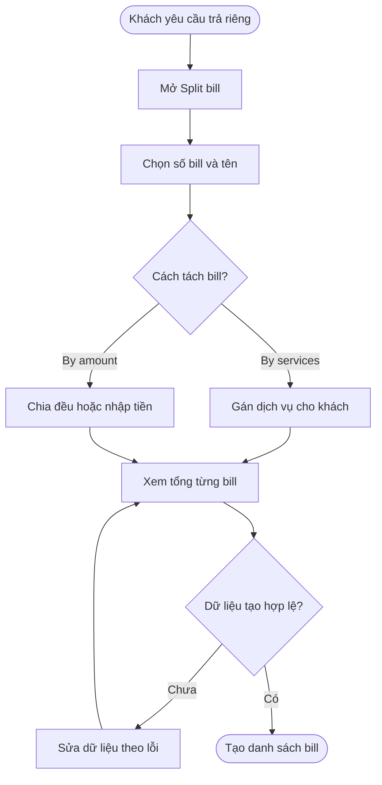
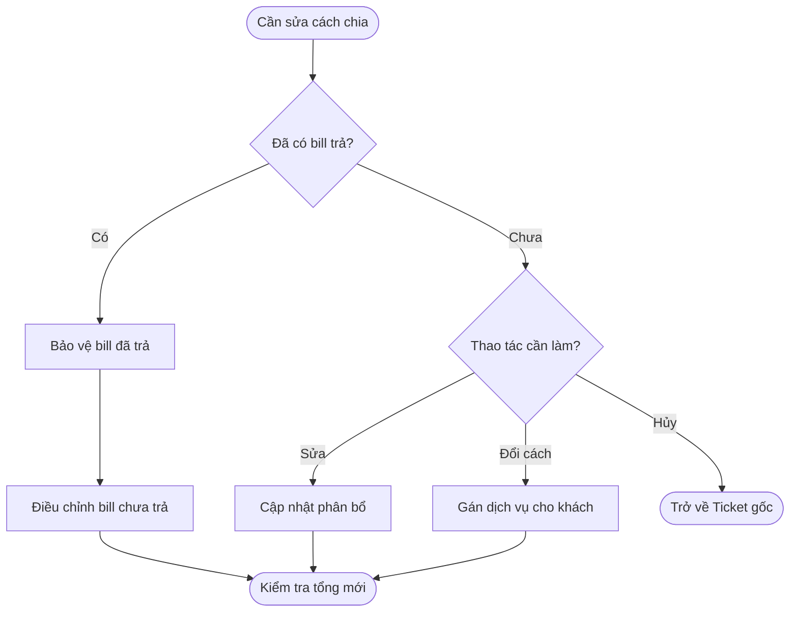
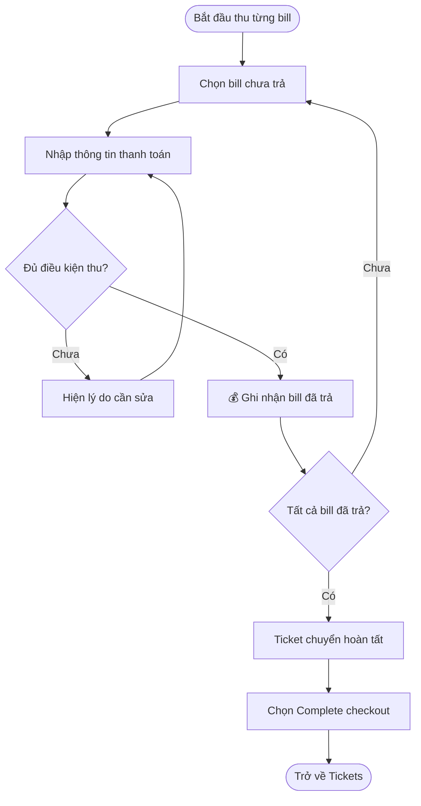
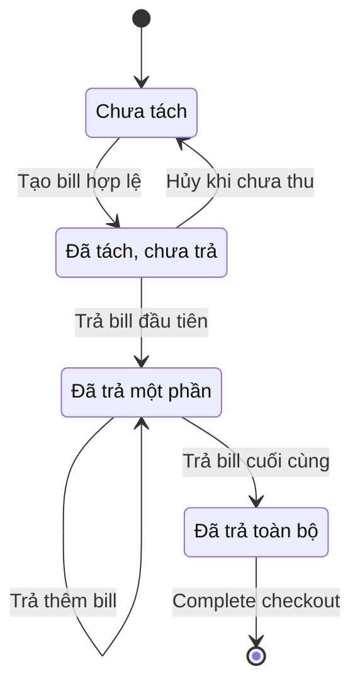

## POS — Split bill khi Checkout

**Last Updated:** 2026-09-14

**Audience:** Product Owner, BA, QA, nhân viên Front Desk, thu ngân, quản lý salon

**Status:** Draft

### Overview

Split bill cho phép thu ngân tách một Ticket thành nhiều bill để từng khách thanh toán riêng khi checkout. Khách có thể trả theo dịch vụ mình nhận hoặc chia tổng tiền theo số tiền thỏa thuận. Thu ngân theo dõi bill đã trả, tiếp tục thu các bill còn lại và hoàn tất Ticket khi tất cả bill đã thanh toán.

**Vị trí:** POS → Front Desk → Tickets → Checkout → Payment Summary → Split bill.

**Phạm vi đối chiếu:** Luồng Split bill trong workspace Tickets hiện tại. Thanh toán và SMS receipt trong bản HTML là **mô phỏng**; tài liệu không khẳng định đã có kết nối cổng thanh toán, trừ số dư Gift Card, hoàn tiền hoặc đồng bộ nhiều thiết bị. Các tiêu chí bên dưới mô tả hành vi của luồng này, chưa phải tiêu chí nghiệm thu tích hợp thanh toán thực tế.

### Key Concepts

| Thuật ngữ | Ý nghĩa |
| :--- | :--- |
| Ticket | Lượt phục vụ gốc chứa khách hàng, dịch vụ, thợ và thông tin checkout. |
| Bill | Phần thanh toán riêng của một khách trong Ticket. |
| By services | Tách theo dịch vụ; mỗi dòng dịch vụ thuộc tối đa một bill. |
| By amount | Tách tổng tiền thành các phần bằng nhau hoặc số tiền tùy chỉnh, giữ chung danh sách dịch vụ. |
| Split Pay | Kết hợp Cash và Card để trả **một bill** trong workspace này; có thể dùng cho từng bill đã tách. |
| Remaining to assign | Phần tiền chưa phân bổ khi thiết lập; khác với tiền còn chưa thanh toán. |
| Bills paid | Số bill đã ghi nhận thanh toán trên tổng số bill. |

### User Roles

| Vai trò | Trách nhiệm |
| :--- | :--- |
| Front Desk / Thu ngân | Thiết lập bill, xác định người trả, kiểm tra tổng tiền, thu tiền và hoàn tất checkout. |
| Khách hàng | Thống nhất phần phải trả, tip và phương thức thanh toán. |
| Quản lý salon | Đối chiếu tổng thu, giảm giá và tiến độ thanh toán khi hỗ trợ thu ngân. |

### End-to-End Workflows

#### Workflow 1: Thiết lập Split bill

**Primary Actor:** Thu ngân.

**Trigger:** Nhóm khách yêu cầu trả riêng tại checkout.

**Outcome:** Tạo danh sách bill theo dịch vụ hoặc theo số tiền, có tổng tiền để kiểm tra trước khi thu.

**User Stories:**

- **US-SB-01 — Chọn cách tách:** Là thu ngân, tôi muốn chọn By services hoặc By amount và số bill, để đáp ứng cách trả tiền mà nhóm khách thống nhất.
- **US-SB-02 — Gán dịch vụ:** Là thu ngân, tôi muốn gán từng dịch vụ cho khách chịu tiền và xem phần chưa gán, để không bỏ sót hoặc tính trùng dịch vụ.
- **US-SB-03 — Chia theo số tiền:** Là thu ngân, tôi muốn chia đều hoặc nhập số tiền từng bill và xem chênh lệch, để tổng các phần khớp tổng Ticket đến từng cent.
- **US-SB-04 — Xác định khách:** Là thu ngân, tôi muốn đặt tên từng bill, để chọn đúng khách khi thu tiền.

| Bước | Người thực hiện | Thao tác | Phản hồi hệ thống | Ghi chú |
| :--- | :--- | :--- | :--- | :--- |
| 1 | Thu ngân | Chọn Split bill | Mở hộp thiết lập, chưa thay đổi Ticket | Có thể mở khi dịch vụ chưa hoàn tất hoặc còn thiếu giá. |
| 2 | Thu ngân | Chọn cách tách, số bill, tên khách | Hiện thông tin nhập tương ứng | Tên khách không bắt buộc. |
| 3a | Thu ngân | Chọn By services và gán dịch vụ | Hiện tổng từng bill, số dịch vụ đã gán và phần còn lại | Một dịch vụ không đồng thời thuộc hai bill. |
| 3b | Thu ngân | Chọn By amount, chia đều hoặc nhập riêng | Hiện số tiền từng khách, tổng đã phân bổ và phần chênh lệch | Tổng bao gồm giảm giá và tip hiện tại. |
| 4 | Thu ngân | Kiểm tra Summary, bấm Create bills | Kiểm tra dữ liệu rồi tạo bill | Thiếu giá thì yêu cầu sửa tại Ticket Detail. |
| 5 | Thu ngân | Chọn từng bill | Hiện khách đang trả, chi tiết và tổng tiền tương ứng | By services có thể tiếp tục phân bổ sau khi tạo. |

**Acceptance Criteria:**

| ID | User story | Given — Điều kiện | When — Thao tác | Then — Kết quả |
| :--- | :--- | :--- | :--- | :--- |
| AC-SB-01 | US-SB-01 | Ticket chưa thanh toán, chưa tách | Mở Split bill rồi đóng hộp thoại | Không tạo bill hoặc đổi dữ liệu Ticket. |
| AC-SB-02 | US-SB-01 | Đang thiết lập | Chọn số bill | By services: số nguyên từ 2 đến số dòng dịch vụ; By amount: số nguyên từ 2 đến 20; số ngoài giới hạn không được tạo. |
| AC-SB-03 | US-SB-04 | Có nhiều bill | Nhập tên hoặc để trống | Tên nhập được dùng để nhận diện bill, tối đa 80 ký tự; tên trống khi tạo dùng Guest 1, Guest 2… |
| AC-SB-04 | US-SB-02 | Dịch vụ đang thuộc bill A | Gán dịch vụ sang bill B chưa trả | Dịch vụ chỉ thuộc B; tổng A và B cập nhật; không đổi thợ chỉ vì đổi người trả. |
| AC-SB-05 | US-SB-02 | Còn dịch vụ chưa gán hoặc bill rỗng | Tạo bill theo dịch vụ | Cho phép tạo để tiếp tục phân bổ; **chặn thanh toán bất kỳ bill nào** cho đến khi mọi dịch vụ được gán và mọi bill có dịch vụ. |
| AC-SB-06 | US-SB-03 | Tổng Ticket $100.00, chia đều 3 bill | Tạo By amount | Các bill lần lượt $33.34, $33.33, $33.33; tổng đúng $100.00. |
| AC-SB-07 | US-SB-03 | Tổng Ticket $90.00 | Nhập $40.00, $30.00, $10.00 | Hiện còn $10.00 chưa phân bổ và không tạo bill; sửa bill cuối thành $20.00 thì tạo được. |
| AC-SB-08 | US-SB-03 | Đang nhập số tiền riêng | Bỏ trống, nhập số âm hoặc tổng vượt Ticket | Không tạo bill; yêu cầu số tiền hợp lệ cho từng bill và tổng khớp Ticket. Giá trị 0 hợp lệ nếu tổng vẫn khớp. |
| AC-SB-09 | US-SB-01 | Ticket có dịch vụ thiếu giá | Bấm Create bills | Không tạo bill; yêu cầu bổ sung giá tại Ticket Detail. Dịch vụ chưa hoàn tất nhưng đã có giá vẫn cho phép tạo. |

#### Workflow 2: Điều chỉnh và hủy tách

**Primary Actor:** Thu ngân.

**Trigger:** Khách đổi người trả, cách chia, tip hoặc thu ngân cần sửa giảm giá trước khi thu.

**Outcome:** Bill phản ánh thỏa thuận mới và bảo vệ các khoản đã thanh toán.

**User Stories:**

- **US-SB-05 — Sửa phân bổ:** Là thu ngân, tôi muốn lọc dịch vụ, chuyển người trả và hoàn tác lần gán gần nhất, để sửa nhầm lẫn nhanh.
- **US-SB-06 — Kiểm tra giảm giá và tip:** Là thu ngân, tôi muốn thấy giảm giá và tip được tính vào từng bill, để giải thích chính xác số tiền khách phải trả.
- **US-SB-07 — Đổi hoặc hủy cách tách:** Là thu ngân, tôi muốn chuyển từ chia tiền sang gán dịch vụ hoặc hủy Split bill khi chưa ai trả, để xử lý khi nhóm khách đổi ý.

| Bước | Người thực hiện | Thao tác | Phản hồi hệ thống | Ghi chú |
| :--- | :--- | :--- | :--- | :--- |
| 1 | Thu ngân | Chọn bill cần sửa | Hiện người trả, dịch vụ và tổng tiền | Bill đã trả chỉ được xem. |
| 2 | Thu ngân | Gán lại dịch vụ, Undo hoặc đổi tip | Cập nhật bill liên quan | Tip riêng áp dụng cho By services. |
| 3 | Thu ngân | Dùng Discount all trước bill đầu tiên được trả | Tính lại phân bổ giảm giá và tổng bill | Khóa giảm giá chung sau lần thanh toán đầu tiên. |
| 4a | Thu ngân | Chọn Assign services từ By amount | Mở thiết lập gán dịch vụ, giữ tên và nhận diện bill | Chỉ thực hiện khi chưa bill nào trả. |
| 4b | Thu ngân | Chọn Cancel split bill | Bỏ nhóm bill, trở về Ticket gốc | Chỉ thực hiện khi chưa bill nào trả; không tạo hoàn tiền. |

**Acceptance Criteria:**

| ID | User story | Given — Điều kiện | When — Thao tác | Then — Kết quả |
| :--- | :--- | :--- | :--- | :--- |
| AC-SB-10 | US-SB-05 | Split theo dịch vụ | Lọc tất cả, bill hiện tại hoặc chưa gán | Chỉ thay đổi danh sách hiển thị, không đổi phân bổ. |
| AC-SB-11 | US-SB-05 | Vừa gán lại dịch vụ, chưa thanh toán phần liên quan | Chọn Undo | Khôi phục người trả và tổng tiền trước lần gán gần nhất; sau ghi nhận thanh toán không còn Undo lần gán đó. |
| AC-SB-12 | US-SB-05 | By services có bill rỗng chưa trả | Thêm hoặc xóa bill rỗng | Thêm khi số bill ít hơn số dòng dịch vụ; chỉ xóa bill rỗng khi còn ít nhất 2 bill sau xóa. |
| AC-SB-13 | US-SB-06 | Chưa bill nào trả | Sửa Discount all | By services phân bổ lại giảm giá theo dịch vụ; By amount chia đều lại hoặc giữ tỷ lệ số tiền tùy chỉnh; tổng giảm giá không mất cent. Khi tổng cũ bằng 0, phân bổ lại theo chia đều. |
| AC-SB-14 | US-SB-06 | By services, bill chưa trả | Nhập tip riêng | Tổng bill và số tiền cần thu cập nhật; tip % tính trên tiền dịch vụ của bill sau giảm giá. Khi mới tách, tip hiện tại đặt ở bill đầu tiên, các bill còn lại khởi tạo tip 0. |
| AC-SB-15 | US-SB-06 | Đã tạo By amount | Xem bill | Tip hiện tại của Ticket được phân bổ trong các phần tiền; không có ô nhập tip riêng cho từng bill. |
| AC-SB-16 | US-SB-07 | By amount, chưa bill nào trả | Chọn Assign services và lưu | Chuyển sang By services, giữ nhận diện và tên khách; tổng bill theo dịch vụ được chọn. Số khách vượt số dịch vụ thì chặn lưu; đóng hộp thoại giữ nguyên cách chia cũ. |
| AC-SB-17 | US-SB-07 | Chưa bill nào trả | Chọn Cancel split bill | Bỏ nhóm bill và trở lại checkout Ticket gốc với dịch vụ còn nguyên; tip riêng của bill không được gộp về Ticket. |
| AC-SB-18 | US-SB-07 | Ít nhất một bill đã trả | Xem thao tác hủy hoặc sửa | Cancel split bill bị khóa và có lý do; không đổi By amount sang By services, không sửa Discount all, không chuyển dịch vụ ra/vào bill đã trả. |

#### Workflow 3: Thu từng bill và hoàn tất checkout

**Primary Actor:** Thu ngân.

**Trigger:** Khách xác nhận phần tiền và sẵn sàng thanh toán.

**Outcome:** Ghi nhận từng bill đúng một lần; Ticket hoàn tất sau bill cuối cùng.

**User Stories:**

- **US-SB-08 — Thanh toán riêng:** Là thu ngân, tôi muốn chọn phương thức và thu tiền cho bill đang chọn, để mỗi khách thanh toán độc lập.
- **US-SB-09 — Sửa dữ liệu chưa hợp lệ:** Là thu ngân, tôi muốn biết lý do chưa thể thu tiền, để bổ sung đúng dữ liệu mà không ghi nhận nhầm bill đã trả.
- **US-SB-10 — Tiếp tục thu phần còn lại:** Là thu ngân, tôi muốn xem số bill đã trả và mở lại phần chưa trả, để tiếp tục checkout sau khi quay về Tickets hoặc tải lại trang.
- **US-SB-11 — Hoàn tất Ticket:** Là thu ngân, tôi muốn hoàn tất checkout sau khi tất cả bill đã trả, để kết thúc lượt phục vụ và trở về Tickets.

| Bước | Người thực hiện | Thao tác | Phản hồi hệ thống | Ghi chú |
| :--- | :--- | :--- | :--- | :--- |
| 1 | Thu ngân | Chọn bill chưa trả | Hiện tên khách, tổng tiền và phương thức | Có thể trả theo thứ tự khách sẵn sàng. |
| 2 | Thu ngân | Chọn Cash, Card, Gift Card hoặc Split Pay; nhập thông tin | Hiện số tiền cần thu | Có lựa chọn receipt cho bill. |
| 3 | Thu ngân | Bấm Pay | Kiểm tra phân bổ, dịch vụ hoàn tất, tip và dữ liệu phương thức | Lỗi thì giữ bill chưa trả, thông báo lý do. |
| 4 | Hệ thống | 💰 Ghi nhận thanh toán bill | Khóa bill, cập nhật Bills paid và tổng đã thu | Bản HTML ghi nhận mô phỏng. |
| 5 | Thu ngân | Chọn bill tiếp theo hoặc Back | Giữ tiến độ để tiếp tục | Ticket chưa hoàn tất nếu còn bill chưa trả. |
| 6 | Hệ thống | Ghi nhận bill cuối cùng | Ticket chuyển hoàn tất, hiện Complete checkout | Tổng thanh toán bằng tổng các bill đã trả. |
| 7 | Thu ngân | Chọn Complete checkout | Trở về Tickets | Không ghi nhận thêm giao dịch. |

**Acceptance Criteria:**

| ID | User story | Given — Điều kiện | When — Thao tác | Then — Kết quả |
| :--- | :--- | :--- | :--- | :--- |
| AC-SB-19 | US-SB-08, US-SB-09 | Bill chưa trả | Bấm Pay khi dịch vụ chưa hoàn tất | By services kiểm tra dịch vụ của bill đang trả; By amount kiểm tra toàn bộ dịch vụ Ticket. Còn dịch vụ chưa hoàn tất thì không ghi nhận thanh toán. |
| AC-SB-20 | US-SB-08, US-SB-09 | Bill $30.00, chọn Cash | Nhập tiền nhận $25.00 rồi $35.00 | $25.00 bị chặn; $35.00 ghi nhận bill $30.00 và tiền thừa $5.00. Tổng đã thu cho bill là $30.00. |
| AC-SB-21 | US-SB-08, US-SB-09 | Bill $30.00, chọn Split Pay | Nhập Cash $10.00 | Ghi nhận Cash $10.00 và Card $20.00; Cash âm, trống hoặc vượt $30.00 bị chặn. |
| AC-SB-22 | US-SB-09 | Chọn Gift Card | Bấm Pay khi chưa nhập mã tham chiếu | Không ghi nhận thanh toán; bản mô phỏng chỉ kiểm tra mã không trống, chưa kiểm tra số dư. |
| AC-SB-23 | US-SB-08 | Bill đã trả | Chọn lại bill hoặc mở lại Ticket | Không có thao tác Pay cho bill đã trả; không sửa khoản đã ghi nhận. |
| AC-SB-24 | US-SB-10 | Đã trả 1/3 bill | Back, tải lại trang và mở lại Ticket trên cùng trình duyệt | Giữ tiến độ 1/3, số tiền đã trả và bill chưa trả; mở vào bill chưa trả đầu tiên. Không coi Ticket đã hoàn tất. |
| AC-SB-25 | US-SB-11 | Chỉ còn một bill chưa trả | Thanh toán bill cuối | Hiện 3/3 nếu có 3 bill, cộng đúng tổng thu, giảm giá và tip; Ticket hoàn tất và hiện Complete checkout. |
| AC-SB-26 | US-SB-11 | Tất cả bill đã trả | Chọn Complete checkout | Trở về Tickets, không đổi các khoản đã ghi nhận; Ticket hoàn tất không còn trong hàng chờ đang phục vụ. |

### System Configuration & Administration

Luồng hiện tại không có cấu hình Split bill hoặc bước duyệt riêng của quản lý. Số bill và phương thức khả dụng tuân theo các giới hạn ở trên. Phân quyền, nhật ký kiểm toán và đối soát với cổng thanh toán thực tế cần được đặc tả khi triển khai tích hợp; chưa thuộc các user story đối chiếu bản HTML này.

### State Lifecycle

Các trạng thái dưới đây mô tả tiến độ thanh toán của nhóm bill; “đã trả một phần” không phải một trạng thái Ticket riêng trên giao diện Tickets.

| Trạng thái hiện tại | Sự kiện | Trạng thái mới | Ghi chú |
| :--- | :--- | :--- | :--- |
| Chưa tách | Create bills hợp lệ | Đã tách, chưa trả | Chưa thu tiền. |
| Đã tách, chưa trả | Cancel split bill | Chưa tách | Giữ Ticket gốc. |
| Đã tách, chưa trả | Bill đầu được trả | Đã trả một phần | Khóa hủy tách và giảm giá chung. |
| Đã trả một phần | Trả thêm bill, còn bill chưa trả | Đã trả một phần | Giữ tiến độ. |
| Đã trả một phần | Bill cuối được trả | Đã trả toàn bộ | Ticket chuyển hoàn tất. |
| Đã trả toàn bộ | Complete checkout | Đã trả toàn bộ | Chỉ điều hướng về Tickets. |

### Business Rules

1. **Split bill giữ một Ticket gốc và nhiều phần thanh toán.** Tách người trả không nhân đôi dịch vụ hoặc tự đổi thợ thực hiện.
2. By services gán nguyên dòng dịch vụ cho một khách. Muốn nhiều khách chia tiền cùng một dịch vụ, dùng By amount.
3. Tiền được tính theo cent. Chia đều rải cent lẻ cho các bill đầu; phân bổ giảm giá và tip phải bảo toàn tổng tương ứng.
4. Tổng tiền trong workspace = Subtotal − Discount + Tip. Luồng hiện tại không có thành phần tax riêng; không bổ sung giả định thuế vào user story.
5. By services tính giảm giá từng dịch vụ trước, sau đó phân bổ giảm giá chung theo giá trị còn lại. Tip được tính theo từng bill; tổng tip có thể thay đổi khi khách chỉnh tip hoặc khi tip % của bill đầu được tính lại trên phần dịch vụ của khách đó.
6. By amount chia tổng đã gồm tip và giảm giá. Phần tip, giảm giá của từng bill được phân bổ theo phần tiền; không thu thêm tip riêng tại bill.
7. **💰 Chỉ bill vượt qua kiểm tra thanh toán mới được ghi nhận đã trả.** Bill tổng $0.00 được phép nhưng vẫn phải qua thao tác xác nhận và các kiểm tra liên quan; không tự coi là đã trả khi tạo.
8. **Có một bill đã trả thì không hủy toàn bộ nhóm hoặc sửa giảm giá chung.** Bill đã trả và dịch vụ thuộc bill đó được khóa; bill chưa trả có thể tiếp tục xử lý theo điều kiện của cách tách.
9. **Ticket chỉ hoàn tất khi mọi bill đã trả.** Complete checkout là thao tác rời màn hình, không phải một lần thu tiền nữa.
10. Tiến độ trong prototype được lưu cục bộ trên trình duyệt; không suy rộng thành khả năng khôi phục ở thiết bị khác.

### Edge Cases & Exception Handling

| Tình huống | Hành vi / giới hạn | Người xử lý |
| :--- | :--- | :--- |
| Một dịch vụ nhưng nhiều người trả | Chọn By amount; By services cần ít nhất 2 dòng để tạo 2 bill. | Thu ngân. |
| By services còn dòng chưa gán hoặc bill rỗng | Chặn Pay; gán đủ dịch vụ hoặc xóa bill rỗng nếu đủ điều kiện. | Thu ngân. |
| Tổng nhập riêng khác tổng Ticket | Hiện Remaining to assign, chặn tạo bill đến khi khớp. | Thu ngân. |
| Bill tùy chỉnh bằng 0 hoặc Ticket giảm hết về 0 | Cho phép số 0 hợp lệ; ô trống vẫn phải nhập; giữ nguyên tổng giảm giá khi phân bổ. | Thu ngân. |
| Khách đổi ý sau khi một bill đã trả | Không hủy Split bill; tiếp tục các bill chưa trả. Hoàn tiền chưa có trong luồng này. | Thu ngân / quản lý. |
| Thu ngân quay lại Tickets giữa chừng | Giữ nhóm bill và tiến độ; lần mở tiếp theo chọn bill chưa trả đầu tiên. | Hệ thống. |
| Card bị từ chối, mất kết nối hoặc chưa rõ kết quả thu thật | Chưa được mô phỏng trong bản hiện tại; cần user story riêng cho kết quả thất bại/chờ xác minh và chống thu trùng khi tích hợp cổng thanh toán. | PO / đội tích hợp. |

### Frequently Asked Questions

**Split bill có giống Split Pay không?**

Split bill tạo phần trả riêng cho từng khách. Split Pay trong workspace này cho phép dùng Cash và Card để trả một bill; có thể chọn riêng cho mỗi khách.

**Có cần hoàn tất dịch vụ mới được tạo bill không?**

Không. Có thể thiết lập trước nếu giá hợp lệ. Điều kiện hoàn tất dịch vụ được kiểm tra khi bấm Pay theo cách tách đang dùng.

**Tách bill có làm thay đổi tip không?**

By amount phân bổ tip hiện có trong tổng tiền. By services đặt tip hiện tại vào bill đầu, cho điều chỉnh từng bill; tip % tính trên phần dịch vụ sau giảm giá của bill nên phải kiểm tra tổng mới trước khi thu.

### Related Features

- [Front Desk — Estimate](front-desk-estimate.md).
- [Trạng thái Appointment](appointment-status-summary.md).
- [Màn hình Tickets](../../html/pages/pos-front-desk-tickets.html).

**Nguồn đối chiếu nội bộ:** [Workspace checkout](../../html/assets/ticket-workspace.js), [tích hợp Tickets](../../html/assets/pos-front-desk-tickets.js), [kiểm thử workspace](../../html/assets/ticket-workspace.test.cjs), [kiểm thử lưu và mở lại Tickets](../../html/pages/pos-front-desk-workspace.test.mjs).
