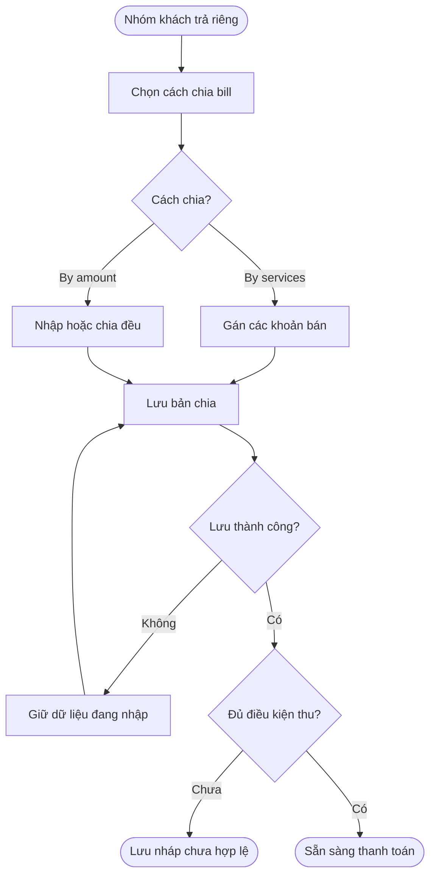
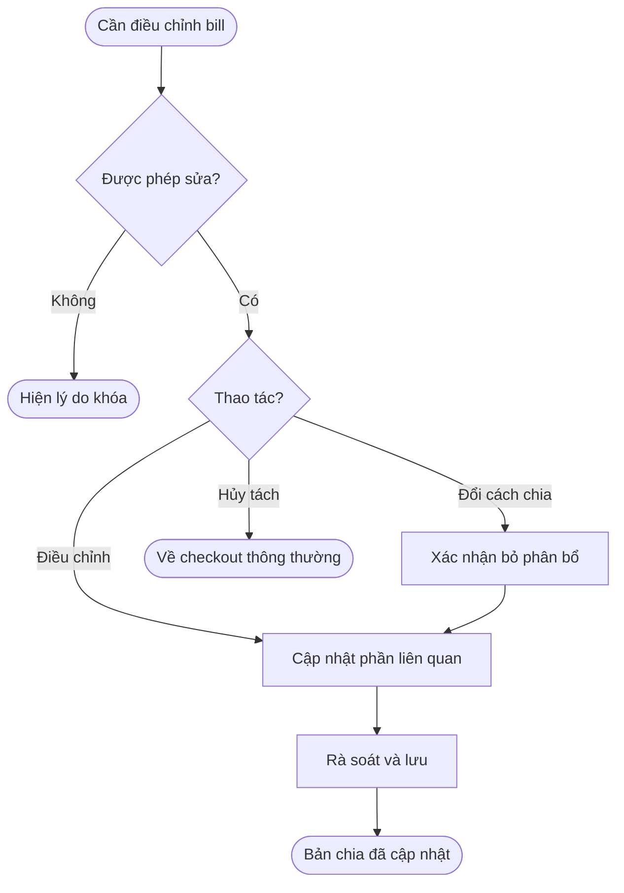
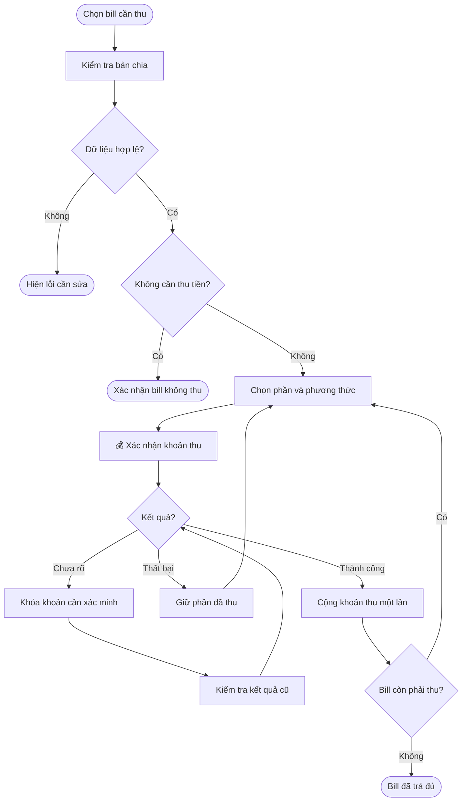
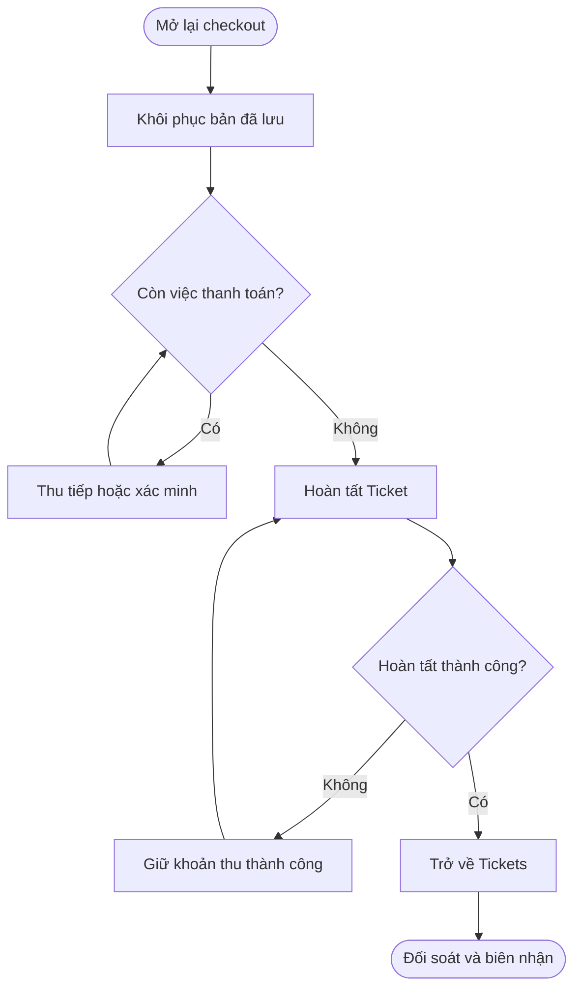
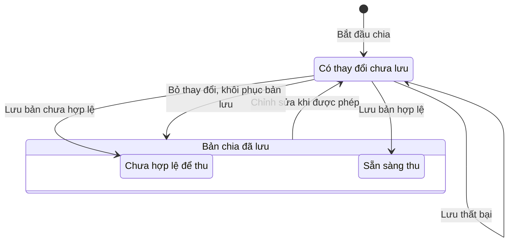
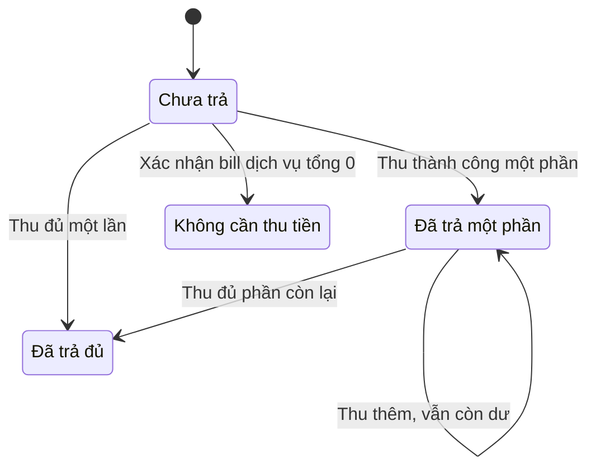
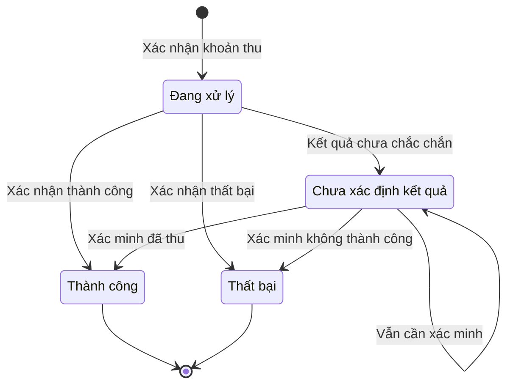
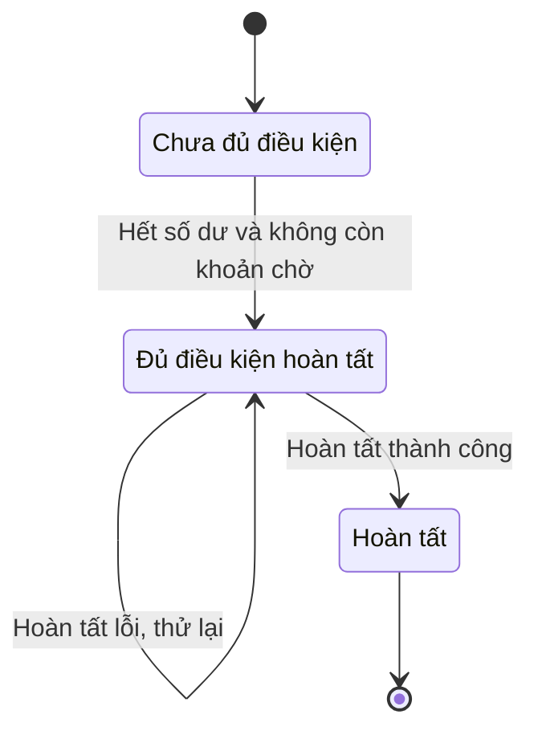

## POS — Split bill khi Checkout

**Last Updated:** 2026-09-14

**Audience:** Product Owner, BA, QA, thu ngân có quyền checkout, quản lý hoặc thu ngân có quyền xem báo cáo

**Status:** Draft — Đề xuất nghiệp vụ, chưa phê duyệt triển khai

**Version:** Draft 2

**Vị trí:** POS → Front Desk → Tickets → Checkout → Payment Summary → **Split bill**

### Version History

| Phiên bản | Ngày | Thay đổi |
| :--- | :--- | :--- |
| Draft 1 | 2026-09-14 | 11 user story và 26 tiêu chí nghiệm thu đối chiếu prototype checkout. |
| Draft 2 | 2026-09-14 | Thay nội dung bằng bộ 22 user story đề xuất; mở rộng sản phẩm, add-on, thuế, thanh toán từng phần, xác minh kết quả, biên nhận và đối soát. |

**Quản lý mã:** Draft 2 sử dụng nguyên mã US-SB-01 đến US-SB-22 của bản đề xuất. Một số mã cùng số có phạm vi khác Draft 1; các tham chiếu US-SB và AC-SB cũ cần đối chiếu lại nội dung, không tự coi là tương đương. Draft 1 được lưu trong lịch sử Git tại commit `3d35bcc`.

### Overview

Split bill cho phép thu ngân chia khoản phải thanh toán của một Ticket thành nhiều bill để từng khách trả riêng. Khách có thể trả theo dịch vụ, sản phẩm mình nhận hoặc theo số tiền thỏa thuận.

Mỗi bill có tên người trả, số tiền và tiến độ thanh toán riêng. Một bill có thể thanh toán bằng một phương thức hoặc kết hợp nhiều phương thức qua Split Pay. Thu ngân có thể lưu cách chia, tiếp tục thu phần còn lại và hoàn tất Ticket khi không còn khoản phải thu.

**Phạm vi tài liệu:** Các user story bên dưới là yêu cầu đề xuất cho sản phẩm. Prototype hiện có Split bill theo dịch vụ/số tiền và Split Pay Cash + Card mô phỏng; chưa thể hiện đầy đủ các yêu cầu về lần thu độc lập, thuế, kết quả chưa xác định và đối soát trong Draft này.

### Key Concepts

| Thuật ngữ | Ý nghĩa |
| :--- | :--- |
| Ticket gốc | Lượt bán hàng chứa dịch vụ, sản phẩm, add-on và các thành phần tiền gốc. |
| Bản chia | Cấu hình bill và phần phân bổ; có bản đang chỉnh và bản đã lưu. |
| Bill | Phần nghĩa vụ thanh toán của người trả, có mã riêng và số dư riêng. |
| By services | Gán dịch vụ, add-on đi kèm và sản phẩm cho bill chịu tiền. |
| By amount | Chia tổng tiền Ticket; thành phần tiền được phân bổ, không đồng nghĩa gán dịch vụ thực tế. |
| Split Pay | Chia phần còn phải thu của một bill thành nhiều khoản theo phương thức hỗ trợ. |
| Lần thanh toán | Một yêu cầu thu tiền có kết quả riêng; chỉ kết quả thành công được cộng vào số đã thu. |
| No payment required | Bill có nội dung, tổng bằng 0 sau discount, đã được xác nhận không cần thu; không tạo giao dịch 0 đồng. |
| Payment status unknown | Yêu cầu đã gửi nhưng chưa xác định kết quả; cần xác minh trước khi xử lý lại. |

### User Roles

| Vai trò | Trách nhiệm |
| :--- | :--- |
| Thu ngân có quyền checkout | Lập và lưu bản chia, rà soát, thu tiền, xác minh trạng thái, cung cấp biên nhận và hoàn tất Ticket. |
| Khách hàng | Thống nhất phần trả, tip và phương thức thanh toán. |
| Quản lý / thu ngân có quyền báo cáo | Đối soát tiền thu, discount, thuế, tip và phần thu nhập thợ theo US-SB-22. |

### End-to-End Workflows

**User Stories:** Giữ nguyên 22 mã và tiêu chí chấp nhận của bản đề xuất; nhóm theo bốn workflow.

#### Workflow 1: Thiết lập và lưu Split bill

**Primary Actor:** Thu ngân có quyền checkout.

**Trigger:** Nhóm khách yêu cầu thanh toán riêng.

**Outcome:** Có danh sách bill và cách phân bổ đầy đủ khoản phải thu.

##### US-SB-01 — Chọn cách chia và số bill

Là thu ngân, tôi muốn chọn cách chia và số bill, để thiết lập phần thanh toán cho từng người trong nhóm.

**Tiêu chí chấp nhận:**

- Có hai lựa chọn: **By services** và **By amount**.
- Có thể tạo từ hai bill trở lên.
- Trước khi bắt đầu thanh toán, có thể thêm hoặc xóa bill.
- Khi xóa bill đang có phân bổ, các khoản của bill trở về phần chưa phân bổ; không bị xóa khỏi Ticket.
- Không cho tạo cách chia mới trên Ticket đã hoàn tất hoặc đã hủy.

##### US-SB-02 — Gán dịch vụ cho bill

Là thu ngân, tôi muốn gán từng dịch vụ cho bill chịu tiền, để mỗi khách thanh toán đúng phần đã nhận.

**Tiêu chí chấp nhận:**

- Trong By services, hiển thị dịch vụ, giá trị phải trả và bill đang được gán.
- Mỗi dòng dịch vụ chỉ thuộc một bill.
- Hai dòng cùng tên dịch vụ vẫn được nhận diện riêng.
- Dịch vụ chưa gán xuất hiện trong danh sách **Unassigned**.
- Không cho bắt đầu thanh toán khi còn dịch vụ chưa gán.

##### US-SB-03 — Chia đều hoặc nhập số tiền thỏa thuận

Là thu ngân, tôi muốn chia đều hoặc nhập số tiền từng bill, để đáp ứng thỏa thuận thanh toán của nhóm khách.

**Tiêu chí chấp nhận:**

- By amount phân bổ tổng tiền hiện tại của Ticket, đã gồm thuế và tip, sau giảm giá.
- Có thao tác **Split evenly** và điền phần tiền còn lại vào một bill.
- Hiển thị tổng đã phân bổ, số tiền còn thiếu hoặc vượt.
- Ví dụ Ticket `$100.00` chia đều ba bill: `$33.33`, `$33.33`, `$33.34`.
- By amount không yêu cầu gán dịch vụ cho từng bill.
- Mỗi phần chia phải lớn hơn `$0.00` và tổng các phần phải khớp Ticket trước khi bắt đầu thanh toán.

##### US-SB-04 — Đặt tên người trả

Là thu ngân, tôi muốn đặt tên dễ nhận biết cho từng bill, để chọn đúng người khi thu tiền.

**Tiêu chí chấp nhận:**

- Bill có tên mặc định như **Bill 1**, **Bill 2**.
- Có thể đổi tên bill chưa có khoản thanh toán thành công.
- Không bắt buộc tạo hoặc chọn hồ sơ khách hàng.
- Bill có mã nhận diện riêng, kể cả khi nhiều bill cùng tên.
- Tên bill được lưu và hiển thị nhất quán trong danh sách, màn thanh toán và biên nhận.

##### US-SB-12 — Phân bổ sản phẩm và add-on

Là thu ngân, tôi muốn phân bổ đầy đủ sản phẩm và add-on, để mọi khoản trên Ticket đều có người chịu tiền.

**Tiêu chí chấp nhận:**

- Add-on đi cùng dịch vụ cha khi gán hoặc chuyển bill.
- Sản phẩm được gán cho bill chịu tiền.
- Sản phẩm có nhiều đơn vị có thể chia theo số lượng nguyên; tổng số lượng trên các bill phải bằng Ticket.
- Không thay đổi số lượng bán hoặc tạo thêm dòng bán hàng chỉ để biểu diễn cách chia.
- Không cho bắt đầu thu khi còn sản phẩm hoặc khoản tính tiền chưa phân bổ.

##### US-SB-13 — Lưu và mở lại bản chia

Là thu ngân, tôi muốn lưu cách chia đang làm, để có thể tiếp tục sau mà không mất phần đã thiết lập.

**Tiêu chí chấp nhận:**

- Cho phép lưu bản nháp chưa phân bổ xong hoặc tổng chưa khớp.
- Bản nháp chưa hợp lệ được đánh dấu rõ và chưa được thanh toán.
- Khi đóng màn hình có thay đổi chưa lưu, cho chọn **Save draft**, **Discard changes** hoặc **Keep editing**.
- Lưu thất bại phải giữ nguyên dữ liệu đang nhập và hiển thị lỗi.
- Tải lại trang khôi phục bản lưu thành công gần nhất.

**Luồng thao tác:**

| Bước | Người thực hiện | Thao tác | Phản hồi hệ thống | Ghi chú |
| :--- | :--- | :--- | :--- | :--- |
| 1 | Thu ngân | Chọn cách chia, số bill và tên người trả | Khởi tạo bản chia đang chỉnh | US-SB-01, 04. |
| 2 | Thu ngân | Gán dịch vụ, sản phẩm, add-on hoặc nhập phần tiền | Cập nhật tổng đã phân bổ và chênh lệch | US-SB-02, 03, 12. |
| 3 | Thu ngân | Save draft | Lưu cả bản chưa hợp lệ và đánh dấu chưa được thu | US-SB-13. |
| 4 | Thu ngân | Rà soát và lưu bản hợp lệ | Sẵn sàng chuyển sang thanh toán | Lưu không thu tiền. |

#### Workflow 2: Điều chỉnh cách chia, discount và tip

**Primary Actor:** Thu ngân có quyền checkout.

**Trigger:** Khách đổi thỏa thuận hoặc thu ngân cần sửa thông tin trước khi thu.

**Outcome:** Các bill phản ánh đúng khoản phải trả và không làm sai phần đã thanh toán.

##### US-SB-05 — Chuyển dịch vụ và hoàn tác

Là thu ngân, tôi muốn tìm dịch vụ, chuyển sang bill khác và hoàn tác lần gán gần nhất, để sửa nhanh thao tác nhầm.

**Tiêu chí chấp nhận:**

- Có thể tìm theo tên dịch vụ và lọc các dịch vụ chưa gán.
- Chuyển dịch vụ phải chuyển cả add-on đi kèm.
- Nội dung và số tiền của các bill liên quan được cập nhật đồng thời.
- Hoàn tác khôi phục đúng lần gán hoặc chuyển gần nhất.
- Chỉ cho sửa phân bổ khi chưa có khoản thu thành công và không có thanh toán đang xử lý hoặc cần xác minh.

##### US-SB-06 — Xem thành phần số tiền và chỉnh tip

Là thu ngân, tôi muốn biết số tiền của từng bill được hình thành như thế nào và chỉnh tip khi còn được phép, để xác nhận đúng với khách.

**Tiêu chí chấp nhận:**

- Hiển thị phần dịch vụ, sản phẩm, giảm giá, thuế, tip và tổng phải trả của bill.
- Với By amount, các thành phần là phần phân bổ từ Ticket; không coi đó là việc gán dịch vụ thực tế cho khách.
- Tip có sẵn trên Ticket được phân bổ đúng một lần. Ví dụ Ticket `$120`, gồm tip `$20`, chia đều hai bill thì mỗi bill `$60`, gồm tip `$10`.
- Đổi tip từ `$10` thành `$15` làm tổng bill và Ticket tăng `$5`; không cộng thêm `$15`.
- Chỉ sửa tip khi bill chưa có khoản thu thành công và không có thanh toán đang xử lý hoặc cần xác minh.
- Thay đổi tip của một bill không tự phân bổ lại tiền sang bill khác.
- Đổi người trả hoặc phương thức thanh toán không tự đổi thợ nhận tip. Khi tổng tip thay đổi, phần chia cho thợ phải được cập nhật và khớp tổng tip mới trước khi tiếp tục thu.

##### US-SB-07 — Đổi cách chia hoặc hủy Split bill

Là thu ngân, tôi muốn đổi giữa By services và By amount hoặc quay về checkout thông thường, để xử lý khi nhóm khách đổi ý.

**Tiêu chí chấp nhận:**

- Chỉ cho đổi hoặc hủy khi chưa có khoản thu thành công và không có thanh toán đang xử lý hoặc cần xác minh.
- Trước khi đổi cách chia, hiển thị phần phân bổ sẽ bị bỏ và yêu cầu xác nhận.
- Hủy Split bill đưa Ticket về checkout thông thường.
- Giữ nguyên dịch vụ, sản phẩm, discount, thuế và tổng tip hiện tại của Ticket.
- Việc hủy hoặc đổi cách chia không tạo giao dịch thanh toán.

##### US-SB-14 — Rà soát lại khi Ticket thay đổi

Là thu ngân, tôi muốn biết cách chia bị ảnh hưởng khi Ticket thay đổi, để kiểm tra lại trước khi thu.

**Tiêu chí chấp nhận:**

- Khi chưa bị khóa, thay đổi dịch vụ, sản phẩm, số lượng, giá hoặc discount phải cập nhật tổng Ticket.
- Với By services, khoản mới thêm trở về **Unassigned**; khoản đã xóa được bỏ khỏi bill liên quan.
- Với By amount, giữ số tiền thu ngân đã nhập và hiển thị chênh lệch mới.
- Bản chia bị ảnh hưởng phải được rà soát và lưu lại trước khi thanh toán.
- Không tự thay đổi số tiền của bill đã có khoản thu thành công.

##### US-SB-15 — Bảo vệ khoản đã thu

Là thu ngân, tôi muốn những khoản đã thanh toán được giữ nguyên, để thao tác sau đó không làm sai số tiền đã thu.

**Tiêu chí chấp nhận:**

- Khi bắt đầu xác nhận thanh toán đầu tiên, tạm khóa cách chia và dữ liệu gốc ảnh hưởng số tiền.
- Nếu lần thanh toán được xác nhận thất bại và chưa có khoản nào thành công, có thể mở lại quyền sửa.
- Khi đã có khoản thu thành công, khóa dịch vụ, sản phẩm, số lượng, giá, discount, cơ sở tính thuế và phân bổ bill.
- Bill đã trả một phần không được sửa tổng tip, xóa bill hoặc thay đổi khoản đã thu.
- Bill đã trả đủ không được chỉnh sửa thông tin thanh toán.
- Thao tác bị khóa phải hiển thị lý do; không chỉ vô hiệu hóa nút.

##### US-SB-20 — Giữ nguyên discount và phần thợ chịu

Là thu ngân, tôi muốn việc tách bill giữ nguyên ưu đãi và phần giảm giá salon hoặc thợ phải chịu, để cách thanh toán không làm thay đổi quyền lợi của khách hoặc thu nhập của thợ.

**Tiêu chí chấp nhận:**

- Discount trên dịch vụ hoặc add-on giữ nguyên và đi cùng dòng tương ứng.
- Discount cấp Ticket được tính một lần theo quy tắc checkout hiện hành, gồm cơ sở tính phần trăm và giới hạn giảm giá.
- Discount cấp Ticket chỉ áp dụng cho các khoản dịch vụ và add-on đủ điều kiện; không chuyển thành discount cho sản phẩm hoặc tip.
- Với By services, phần discount cấp Ticket dành cho khách được phân bổ dựa trên giá trị dịch vụ còn lại sau discount từng dòng; không làm khoản phải trả âm.
- Tổng discount phân bổ phải bằng discount của Ticket đến từng cent.
- Tách bill không áp dụng lại promotion, tạo thêm lượt áp dụng hoặc xét lại điều kiện theo thời điểm thanh toán từng bill.
- Đổi bill chịu tiền không thay đổi thợ thực hiện, người chịu discount, cơ sở tính commission hoặc phần discount đã xác định của từng thợ.
- Phần discount khách được hưởng và phần chi phí thợ chịu được tính, đối soát riêng.

**Luồng thao tác:**

| Bước | Người thực hiện | Thao tác | Phản hồi hệ thống | Ghi chú |
| :--- | :--- | :--- | :--- | :--- |
| 1 | Thu ngân | Yêu cầu điều chỉnh | Kiểm tra khoản thành công, đang xử lý hoặc cần xác minh | Quyền sửa phụ thuộc dữ liệu cần sửa. |
| 2 | Thu ngân | Chuyển dịch vụ, Undo, sửa tip hoặc discount | Tính lại thành phần liên quan và phần tip thợ nhận | US-SB-05, 06, 20; khóa theo US-SB-15. |
| 3 | Thu ngân | Đổi cách chia hoặc hủy | Hiện phần sẽ bỏ, xác nhận trước khi đổi; giữ tiền Ticket khi hủy | US-SB-07. |
| 4 | Thu ngân | Rà soát bản chia bị ảnh hưởng và lưu lại | Cho thu khi dữ liệu mới hợp lệ | US-SB-14. |

#### Workflow 3: Thanh toán bill bằng một hoặc nhiều phương thức

**Primary Actor:** Thu ngân có quyền checkout.

**Trigger:** Bản chia đã lưu, hợp lệ và khách sẵn sàng thanh toán.

**Outcome:** Các khoản tiền được ghi nhận đúng bill, đúng phương thức và đúng một lần.

##### US-SB-08 — Thanh toán bill đang chọn

Là thu ngân, tôi muốn chọn bill chưa trả đủ và thu phần còn thiếu, để từng khách thanh toán độc lập.

**Tiêu chí chấp nhận:**

- Hiển thị rõ tên bill, tổng phải trả, số đã thu và số còn phải thu.
- Có thể chọn một phương thức hoặc mở **Split Pay** cho bill.
- Nhiều bill được dùng cùng phương thức, ví dụ Bill 1 và Bill 2 đều trả bằng Card.
- Mỗi khoản chỉ được ghi nhận sau khi xác nhận thanh toán thành công theo luồng của phương thức đó.
- Bill chuyển thành đã trả đủ khi tổng các khoản thành công bằng tổng phải trả.
- Thu một bill không tự đánh dấu các bill khác đã trả hoặc hoàn tất Ticket.

##### US-SB-09 — Kiểm tra dữ liệu trước khi thu

Là thu ngân, tôi muốn biết chính xác dữ liệu nào chưa hợp lệ, để sửa đúng vấn đề trước khi xác nhận thanh toán.

**Tiêu chí chấp nhận:**

- Kiểm tra bản chia đã lưu, tổng phân bổ khớp Ticket và không còn khoản chưa gán.
- By services không cho bắt đầu thu khi có bill rỗng.
- By amount không yêu cầu có dịch vụ trong bill nhưng không cho tạo phần thanh toán `$0.00`.
- Bill By services có nội dung nhưng tổng còn `$0.00` sau discount được xác nhận **No payment required**; không cần chọn phương thức hoặc tạo giao dịch `$0.00`.
- Ticket có tổng `$0.00` không cần tạo các bill By amount để hoàn tất.
- Lỗi phải chỉ rõ bill hoặc trường cần sửa; không làm thay đổi kết quả thanh toán đã ghi nhận.

##### US-SB-16 — Thu tiền mặt và trả tiền thối

Là thu ngân, tôi muốn nhập tiền mặt nhận cho khoản đang thu, để trả đúng tiền thối cho khách.

**Tiêu chí chấp nhận:**

- Hiển thị **Amount due**, **Cash received** và **Change due**.
- Khi dùng Split Pay, Amount due là số tiền của phần Cash đang thu.
- Không cho xác nhận nếu tiền mặt nhận thấp hơn khoản phải thu.
- Tiền thối bằng tiền nhận trừ khoản phải thu.
- Tiền thối không được tính vào doanh thu, tip hoặc số tiền đã trả của phần khác.

##### US-SB-17 — Xử lý thất bại hoặc chưa rõ kết quả

Là thu ngân, tôi muốn phân biệt thanh toán thất bại với thanh toán chưa rõ kết quả, để tiếp tục mà không thu trùng.

**Tiêu chí chấp nhận:**

- Khi thanh toán thất bại, giữ nguyên số tiền đã thu trước đó và cho phép xử lý phần còn thiếu.
- Mất kết nối sau khi gửi xác nhận không tự được xem là thanh toán thất bại.
- Khi chưa rõ kết quả, hiển thị **Payment status unknown** và cho phép kiểm tra trạng thái.
- Trong lúc cần xác minh, không cho thu lại, đổi phương thức hoặc sửa số tiền của khoản đó.
- Chỉ cho thử lại sau khi xác nhận lần trước không thành công.
- Nếu xác nhận lần trước thành công, cập nhật khoản đã thu thay vì tạo khoản mới.
- Tải lại trang vẫn giữ được trạng thái cần xác minh.

##### US-SB-18 — Ngăn thanh toán trùng và xung đột

Là thu ngân, tôi muốn hệ thống ngăn ghi nhận một khoản nhiều lần, để thao tác lặp hoặc nhiều thu ngân cùng làm không tạo khoản thu trùng.

**Tiêu chí chấp nhận:**

- Bấm nhiều lần khi đang xử lý không tạo thêm lần thanh toán cho cùng yêu cầu.
- Nếu thu ngân khác đã thanh toán khoản đó, hiển thị kết quả mới nhất và không cho thu lại.
- Nếu số tiền đã được người khác sửa, yêu cầu rà soát dữ liệu mới trước khi xác nhận.
- Một kết quả thanh toán thành công chỉ được cộng vào số đã thu một lần.
- Thử lại hoặc tải lại trang không nhân bản khoản thanh toán.

##### US-SB-21 — Sử dụng Split Pay trong một bill

Là thu ngân, tôi muốn chia phần tiền của một bill thành nhiều khoản thanh toán, để khách có thể kết hợp Cash, Card hoặc các phương thức được hỗ trợ.

**Tiêu chí chấp nhận:**

- Có thể nhập số tiền cho từng phần; tổng các phần phải khớp số tiền bill còn phải thu.
- Mỗi phần được nhận diện và ghi nhận độc lập; không gộp lịch sử chỉ vì cùng phương thức thanh toán.
- Khi một phần thành công nhưng bill còn số dư, bill hiển thị **Partially paid**.
- Phần đã thành công bị khóa. Chỉ phần chưa thu được điều chỉnh khi không có thanh toán đang xử lý hoặc cần xác minh.
- Nếu một phần thất bại, không yêu cầu thực hiện lại các phần đã thành công.
- Tip phải được gắn rõ với khoản thanh toán mang tip; không tự chuyển tip đã thu sang phương thức khác.
- Tip qua các phương thức khác nhau và phần tip thợ nhận phải đối soát được đến từng cent.
- Chức năng **50/50** của Split Pay giữ quy tắc chia phần trước tip rồi cộng tip vào phần được chỉ định. **Split evenly** của Split bill chia tổng tiền bao gồm tip.
- Checkout không dùng Split bill vẫn giữ khả năng Split Pay hiện tại.
- Khi chuyển một bản nháp Split Pay cấp Ticket sang Split bill, phải xác nhận phân bổ lại; không đồng thời sử dụng hai bản phân bổ để ghi nhận cùng khoản tiền.

**Luồng thao tác:**

| Bước | Người thực hiện | Thao tác | Phản hồi hệ thống | Ghi chú |
| :--- | :--- | :--- | :--- | :--- |
| 1 | Thu ngân | Chọn bill và một phương thức hoặc Split Pay | Hiện tổng, số đã thu và số còn thiếu | US-SB-08, 21. |
| 2 | Hệ thống / thu ngân | Kiểm tra bản lưu, phân bổ và thông tin phương thức | Chặn lỗi; bill dịch vụ 0 đồng được xác nhận không cần thu | US-SB-09, 16. |
| 3 | Thu ngân | 💰 Xác nhận khoản thanh toán | Khóa dữ liệu liên quan, ngăn yêu cầu trùng | US-SB-15, 18. |
| 4 | Hệ thống | Nhận kết quả | Thành công: cộng đúng một lần; thất bại: giữ số đã thu; chưa rõ: yêu cầu xác minh | US-SB-17. |
| 5 | Thu ngân | Tiếp tục phần còn thiếu | Giữ các khoản thành công và trạng thái từng phần | US-SB-21. |

#### Workflow 4: Tiếp tục checkout, biên nhận và đối soát

**Primary Actor:** Thu ngân; quản lý hoặc thu ngân có quyền báo cáo cho đối soát.

**Trigger:** Đã có bill hoặc phần thanh toán được xử lý.

**Outcome:** Thu ngân tiếp tục đúng số dư, cung cấp biên nhận và hoàn tất Ticket mà không ghi nhận trùng.

##### US-SB-10 — Mở lại và tiếp tục thu phần còn lại

Là thu ngân, tôi muốn thấy đúng tiến độ khi mở lại Ticket, để tiếp tục checkout từ phần còn thiếu.

**Tiêu chí chấp nhận:**

- Hiển thị số bill đã trả đủ, trả một phần, chưa trả và không cần thu tiền.
- Hiển thị tổng đã thu thành công và số dư còn phải thu.
- Mở lại từ Tickets hoặc tải lại trang phải khôi phục bản chia đã lưu cùng kết quả từng khoản thanh toán.
- Bill đã trả một phần hiển thị rõ các khoản đã thu và phần còn thiếu.
- Bill hoặc khoản cần xác minh giữ nguyên trạng thái và không được coi là chưa thu.
- Ticket còn số dư vẫn có thể tìm thấy để tiếp tục checkout.

##### US-SB-11 — Hoàn tất Ticket

Là thu ngân, tôi muốn hoàn tất Ticket sau khi xử lý hết các bill, để kết thúc checkout mà không bỏ sót khoản phải thu.

**Tiêu chí chấp nhận:**

- Chỉ cho hoàn tất khi mọi bill đã trả đủ hoặc được xác nhận **No payment required**.
- Số dư Ticket phải bằng `$0.00`.
- Không còn khoản thanh toán đang xử lý hoặc chưa rõ kết quả.
- Việc thu một phần không tự đóng Ticket hoặc thực hiện các tác động của hoàn tất toàn bộ Ticket.
- Hoàn tất thành công cập nhật Ticket và đưa thu ngân về Tickets theo luồng checkout.
- Nếu tất cả tiền đã thu nhưng hoàn tất Ticket lỗi, giữ nguyên các khoản thành công và cho thử lại **hoàn tất Ticket**.
- Thử lại bước hoàn tất không thu lại tiền hoặc ghi nhận lại discount, tip và doanh số.

##### US-SB-19 — Cung cấp biên nhận từng bill

Là thu ngân, tôi muốn in hoặc gửi biên nhận cho phần khách đã thanh toán, để khách có chứng từ đúng số tiền đã trả.

**Tiêu chí chấp nhận:**

- Biên nhận xác định được Ticket gốc, mã bill, tên bill, các khoản thanh toán, phương thức và thời điểm.
- Với By services, hiển thị dịch vụ, add-on và sản phẩm thuộc bill.
- Với By amount, ghi rõ đây là phần thanh toán của Ticket; không trình bày toàn bộ dịch vụ như thể bill đã trả toàn bộ Ticket.
- Nếu bill mới trả một phần, chứng từ phải ghi số đã nhận và số còn thiếu; không hiển thị đã thanh toán đủ.
- Bill đã trả đủ có biên nhận thể hiện tổng tiền, giảm giá, thuế và tip tương ứng.
- Cho phép xem lại, in lại hoặc gửi lại qua kênh được hỗ trợ.
- Lỗi in hoặc gửi không thay đổi kết quả thanh toán; thử lại biên nhận không thực hiện lại thu tiền.

##### US-SB-22 — Đối soát tiền thu, discount và tip

Là quản lý hoặc thu ngân có quyền xem báo cáo, tôi muốn đối soát Ticket với các bill và khoản thanh toán, để kiểm tra tiền đã thu và phát hiện chênh lệch.

**Tiêu chí chấp nhận:**

- Có thể đối chiếu từ Ticket → bill → từng khoản thanh toán.
- Tổng tiền các bill khớp Ticket; tổng khoản thanh toán thành công khớp số đã thu.
- Tổng discount, thuế và tip phân bổ khớp các giá trị tương ứng của Ticket.
- Báo cáo tiền thu phản ánh từng khoản thành công theo thời điểm nhận tiền, kể cả khi Ticket chưa hoàn tất.
- Khi Ticket hoàn tất, không cộng lại các khoản tiền đã ghi nhận.
- Báo cáo dịch vụ và thu nhập thợ giữ thời điểm ghi nhận theo chính sách hoàn tất Ticket; phân biệt rõ với tiền đã nhận trước đó.
- Có thể phân biệt số Ticket, số bill và số lần thanh toán; bill `$0.00` không làm tăng số lần thu tiền.
- Hai bill cùng trả Card vẫn có lịch sử riêng và được cộng đúng vào tổng Card.
- Phần discount salon/thợ chịu và nguồn tip Cash/Card không thay đổi do cách nhóm bill.
- Biên nhận tổng Ticket và các biên nhận bill không bị tính thành nhiều lần bán hàng.

**Luồng thao tác:**

| Bước | Người thực hiện | Thao tác | Phản hồi hệ thống | Ghi chú |
| :--- | :--- | :--- | :--- | :--- |
| 1 | Thu ngân | Mở lại Ticket | Khôi phục bản lưu và từng kết quả thanh toán | US-SB-10. |
| 2 | Thu ngân | Thu tiếp hoặc xác minh phần còn lại | Cập nhật đúng số dư, không thu lại phần thành công | US-SB-17, 18. |
| 3 | Thu ngân | In / gửi biên nhận | Thể hiện số đã trả và còn thiếu theo bill | US-SB-19; lỗi chứng từ không đổi khoản thu. |
| 4 | Thu ngân | Hoàn tất Ticket | Kiểm tra mọi bill đã xử lý, số dư 0 và không còn khoản chờ | US-SB-11; lỗi hoàn tất chỉ thử lại bước hoàn tất. |
| 5 | Người có quyền báo cáo | Đối soát Ticket → bill → khoản thanh toán | Tách tiền nhận theo thời điểm thu và ghi nhận dịch vụ theo chính sách hoàn tất | US-SB-22. |

### System Configuration & Administration

- Áp dụng quyền checkout cho thao tác lập bill và thu tiền; quyền xem báo cáo cho US-SB-22. Không suy rộng thành quyền hoàn tiền hoặc chỉnh giao dịch đã thu.
- Danh sách phương thức hỗ trợ, điều kiện discount/promotion, thuế, commission và phân bổ tip cho thợ phải theo chính sách checkout được phê duyệt.
- Mức tối đa số bill và chính sách phân bổ từng thành phần thuế/tip cần chốt trước triển khai; không lấy giới hạn prototype làm yêu cầu đã được duyệt.

### State Lifecycle

Các trạng thái sau là mô hình nghiệp vụ đề xuất. Lưu bản chia không đồng nghĩa đã thu tiền; thất bại ở lần thu sau không xóa khoản thành công trước đó.

#### Bản chia

| Trạng thái hiện tại | Sự kiện | Trạng thái mới | Ghi chú |
| :--- | :--- | :--- | :--- |
| Chưa lưu | Lưu bản chưa phân bổ đủ / tổng chưa khớp | Đã lưu, chưa hợp lệ | Chặn thu. |
| Chưa lưu hoặc đã lưu | Lưu bản hợp lệ | Sẵn sàng thu | Còn phải kiểm tra quyền và trạng thái thanh toán. |
| Bản đã lưu | Chỉnh sửa hoặc Ticket thay đổi | Có thay đổi chưa lưu | Cần rà soát và lưu lại. |
| Có thay đổi chưa lưu | Discard changes | Bản lưu gần nhất | Không ảnh hưởng khoản đã thu. |
| Có thay đổi chưa lưu | Lưu thất bại | Có thay đổi chưa lưu | Giữ dữ liệu đang nhập. |

#### Bill

| Trạng thái hiện tại | Sự kiện | Trạng thái mới | Ghi chú |
| :--- | :--- | :--- | :--- |
| Chưa trả | Có khoản thành công, còn số dư | Đã trả một phần | Giữ lịch sử từng khoản. |
| Chưa trả hoặc đã trả một phần | Khoản thành công làm số dư bằng 0 | Đã trả đủ | Không cộng tiền thối vào số đã trả. |
| Chưa trả | Xác nhận bill dịch vụ có nội dung, tổng 0 | Không cần thu tiền | Không tạo giao dịch 0 đồng. |
| Chưa trả hoặc đã trả một phần | Lần thu thất bại / chưa rõ | Giữ trạng thái bill theo số đã thu | Trạng thái lần thanh toán được theo dõi riêng. |

#### Lần thanh toán

| Trạng thái hiện tại | Sự kiện | Trạng thái mới | Ghi chú |
| :--- | :--- | :--- | :--- |
| Chưa gửi yêu cầu | Xác nhận thu | Đang xử lý | Khóa dữ liệu và ngăn thu trùng. |
| Đang xử lý | Có xác nhận thành công | Thành công | Cộng số đã thu một lần. |
| Đang xử lý | Có xác nhận thất bại | Thất bại | Không cộng số đã thu. |
| Đang xử lý | Không nhận được kết quả chắc chắn | Chưa xác định kết quả | Không tự xem là thất bại. |
| Chưa xác định kết quả | Xác minh thành công / thất bại | Thành công / thất bại | Cập nhật lần cũ; chỉ được thử lại sau khi xác nhận không thành công. |

#### Hoàn tất Ticket

| Trạng thái hiện tại | Sự kiện | Trạng thái mới | Ghi chú |
| :--- | :--- | :--- | :--- |
| Chưa đủ điều kiện hoàn tất | Mọi bill đã trả đủ / không cần thu, số dư 0, không có khoản chờ | Đủ điều kiện hoàn tất | Chưa đồng nghĩa đã hoàn tất Ticket. |
| Đủ điều kiện hoàn tất | Hoàn tất thành công | Hoàn tất | Không cộng doanh số hoặc khoản thu thêm lần nữa. |
| Đủ điều kiện hoàn tất | Hoàn tất lỗi | Đủ điều kiện hoàn tất | Giữ khoản thu và cho thử lại hoàn tất. |

### Business Rules

| Nội dung | Quy tắc |
|---|---|
| Ticket gốc | Giữ một Ticket và các dòng dịch vụ, sản phẩm gốc. Tách bill không tạo thêm doanh số hoặc dịch vụ. |
| Split bill | Xác định người trả và phần tiền từng người chịu. |
| Split Pay | Xác định các phương thức dùng để thanh toán một bill, ví dụ Cash + Card. |
| Discount | Tính trên Ticket theo quy tắc hiện hành rồi phân bổ sang bill; không áp dụng lại discount hoặc promotion cho từng bill. |
| Tip | Mỗi bill hiển thị tổng tip của bill. Sửa tip là thay giá trị hiện tại, không cộng thêm lần nữa. |
| Khóa dữ liệu | Khi bắt đầu xác nhận khoản thanh toán đầu tiên, khóa dịch vụ, sản phẩm, giá, discount và cách phân bổ bill trong lúc xử lý. Sau khi có khoản thu thành công, tiếp tục giữ khóa. |
| Chưa rõ kết quả | Không cho thu lại hoặc thay đổi dữ liệu liên quan trước khi xác minh kết quả lần trước. |
| Tiền lẻ | Tổng tiền và từng thành phần phân bổ phải khớp Ticket đến từng cent. Kết quả làm tròn đã lưu phải ổn định khi đổi tên bill hoặc tải lại trang. |
| Hoàn tất | Ticket chỉ hoàn tất khi mọi bill đã trả đủ hoặc được xác nhận không cần thu tiền, đồng thời không còn thanh toán đang xử lý hoặc cần xác minh. |

**💰 Tiền đã thu:** Chỉ cộng khoản thành công, đúng một lần. Tiền thối, bill không cần thu và thao tác lưu/hoàn tất/in lại không tạo thêm doanh thu hoặc khoản thanh toán.

#### Các quyết định nghiệp vụ mới trong bản Draft

Bản này đề xuất **hỗ trợ Split Pay trong từng bill**, **khóa cơ sở tính tiền từ lần thanh toán đầu tiên** và **ghi nhận tiền đã thu ngay cả khi Ticket chưa hoàn tất**. Đây là các phần mở rộng so với luồng hiện tại, cần được duyệt cùng quy tắc phân bổ discount, thuế và tip trước khi triển khai.

#### Khác biệt chính so với prototype đã đối chiếu

| Nội dung | Prototype hiện tại | Draft 2 đề xuất |
| :--- | :--- | :--- |
| Thanh toán | Ghi nhận mô phỏng một kết quả cho bill, kể cả Split Pay Cash + Card. | Mỗi phần thanh toán có kết quả và lịch sử độc lập; bill trả một phần; xác minh kết quả chưa rõ. |
| Làm tròn chia đều | $100 chia 3 thành $33.34, $33.33, $33.33. | Ví dụ được yêu cầu là $33.33, $33.33, $33.34; giữ kết quả đã lưu ổn định. |
| Bill tổng 0 | Cho phép phần By amount bằng 0 và thao tác Pay mô phỏng. | By amount phải dương; bill dịch vụ đủ điều kiện xác nhận No payment required, không tạo giao dịch 0. |
| Tip | By services đặt tip hiện tại ở bill đầu; By amount không có nhập tip riêng. | Phân bổ tip một lần, sửa tip bill đủ điều kiện theo phần chênh lệch; đối soát tip với thợ và khoản thanh toán. |
| Khóa phân bổ | Khóa bill đã trả; vẫn có thể chuyển dịch vụ giữa các bill chưa trả. | Khóa cơ sở tiền và phân bổ từ lúc xử lý khoản đầu; giữ khóa sau khi có khoản thành công. |
| Lưu và thay đổi Ticket | Lưu cục bộ; tạo By amount phải khớp tổng; giảm giá có thể tự chia lại theo tỷ lệ. | Lưu nháp chưa khớp, cảnh báo thay đổi chưa lưu; giữ số tiền nhập By amount và yêu cầu rà soát. |
| Thuế, sản phẩm, add-on | Workspace tính dịch vụ, discount và tip; chưa thể hiện đủ mô hình thành phần đề xuất. | Bao gồm thuế, sản phẩm, số lượng và add-on gắn dịch vụ cha. |
| Hoàn tất | Tự đánh dấu Ticket hoàn tất khi mọi bill có kết quả mô phỏng. | Có điều kiện hoàn tất đầy đủ và xử lý riêng lỗi hoàn tất sau khi đã thu đủ. |
| Báo cáo và nhiều thu ngân | Chưa thể hiện đối soát và ngăn xung đột nhiều thiết bị trong workspace. | Tiền thu theo thời điểm nhận, dịch vụ/thu nhập thợ theo chính sách hoàn tất; chống thu trùng và xung đột. |

### Edge Cases & Exception Handling

| Tình huống | Hành vi đề xuất | Người xử lý |
| :--- | :--- | :--- |
| Xóa bill có phân bổ trước khi bị khóa | Đưa các khoản về Unassigned, giữ nguyên Ticket. | Thu ngân. |
| Lưu bản chia lỗi | Giữ dữ liệu đang nhập, hiện lỗi; không coi là đã lưu. | Thu ngân / hệ thống. |
| Ticket đổi sau khi lập bản chia | Cập nhật tổng, đánh dấu cần rà soát; giữ số tiền nhập By amount. | Thu ngân. |
| Một phần thành công, phần sau thất bại | Giữ phần thành công, chỉ xử lý số còn thiếu. | Thu ngân. |
| Mất kết nối sau xác nhận thu | Giữ trạng thái chưa rõ, kiểm tra kết quả trước khi thử lại. | Thu ngân / hệ thống thanh toán. |
| Nhiều thu ngân thao tác cùng khoản | Hiện kết quả mới nhất hoặc yêu cầu rà soát số tiền mới; không thu trùng. | Hệ thống / thu ngân. |
| Thu đủ nhưng hoàn tất Ticket lỗi | Thử lại hoàn tất, không thu lại hoặc ghi lại doanh số. | Thu ngân / hệ thống. |
| In hoặc gửi biên nhận lỗi | Cho thử lại chứng từ, giữ nguyên kết quả thu. | Thu ngân. |

### Frequently Asked Questions

**Split bill và Split Pay có dùng cùng nhau không?**

Có theo Draft này: Split bill xác định phần của từng người, Split Pay xác định các phương thức trả phần còn thiếu của một bill.

**50/50 và Split evenly có cùng cách xử lý tip không?**

Không. Theo US-SB-21, 50/50 của Split Pay chia phần trước tip rồi cộng tip vào phần chỉ định; Split evenly của Split bill chia tổng đã gồm tip. Đây là quy tắc đề xuất cần đối chiếu khi triển khai, không phải xác nhận workspace hiện đã hỗ trợ 50/50.

**Bill trả một phần có được sửa tip không?**

Không. Bill chưa có khoản thành công chỉ được sửa tip khi không có khoản đang xử lý hoặc cần xác minh; tổng tip mới phải khớp phần tip thợ nhận.

**Tiền đã thu trước khi Ticket hoàn tất có vào báo cáo không?**

Có trong báo cáo tiền thu theo thời điểm nhận. Báo cáo dịch vụ và thu nhập thợ theo chính sách hoàn tất Ticket; hoàn tất không cộng lại khoản tiền đã nhận.

### Related Features

- [Front Desk — Estimate](front-desk-estimate.md).
- [Techs Pay Daily](techs-pay-daily.md).
- [Màn hình Tickets](../../html/pages/pos-front-desk-tickets.html).

**Nguồn đối chiếu triển khai:** [Workspace checkout](../../html/assets/ticket-workspace.js), [tích hợp Tickets](../../html/assets/pos-front-desk-tickets.js), [kiểm thử workspace](../../tests/html/assets/ticket-workspace.test.cjs), [kiểm thử lưu và mở lại Tickets](../../tests/html/pages/pos-front-desk-workspace.test.mjs). Nguồn này dùng để xác định khoảng cách triển khai; yêu cầu Draft 2 theo bản đề xuất nghiệp vụ.
