# Customer Rewards App (Nexora Touch)

**Last Updated:** 2026-07-17
**Audience:** Leader, Product Owner, Business Analyst, QA, Customer Support
**Status:** Draft
**Scope:** Toàn bộ ứng dụng khách hàng Nexora Touch — Customer Rewards (bản prototype `html/customer/cutomer-reward.html`, 33 màn hình, 5 module).

> Tài liệu này là **bản hoạt động độc lập duy nhất**: mọi khái niệm, quy tắc, vòng đời trạng thái và edge case cần thiết đều nằm trong chính tài liệu này. Không cần đọc kèm bất kỳ tài liệu nào khác.

---

## Overview

Nexora Touch — Customer Rewards là ứng dụng dành cho **khách hàng** của các tiệm nail/spa/salon trong một **alliance** (liên minh) địa phương. Khách hàng quét QR tại tiệm để **check-in**, theo dõi **Live Ticket** (phiếu dịch vụ) theo thời gian thực, **tip** cho thợ, **thanh toán trực tiếp** cho tiệm, để lại **review riêng tư**, và tích/đổi **points** thành dịch vụ.

Giá trị nghiệp vụ cốt lõi nằm ở một nguyên tắc chi phối toàn bộ sản phẩm: **Nexora không bao giờ giữ tiền của khách** (*"NEXORA never holds your money"*). Mọi giao dịch tiền đều là **chuyển khoản ngoài hệ thống** (Zelle, Venmo, Cash App, Apple Cash, PayPal, VLinkPay) giữa khách và tiệm/thợ. Nexora chỉ làm hai việc: **ghi nhận** rằng khách khẳng định đã chuyển tiền, và **giữ sổ points** (ledger). Vì vậy phí nền tảng hiển thị cố định **$0.00**, và **mọi điểm thưởng chỉ được cộng sau khi tiệm xác nhận bằng mắt người** — không có OCR hay đối soát tự động nào cho bằng chứng thanh toán.

---

## Key Concepts

| Term | Definition |
| :--- | :--- |
| **Nexora Touch** | Ứng dụng khách hàng. Chạy như một SPA, toàn bộ dữ liệu lưu trên thiết bị (`localStorage`, schema version 3). |
| **Business / Salon** | Tiệm tham gia. Mỗi tiệm tự đặt kinh tế điểm riêng: `checkinPoints`, `tipMultiplier`, `directPayBonusPct`, `bookingBonus`. |
| **Alliance** | Liên minh các tiệm (demo: *Houston Beauty*). Là **điều kiện bắt buộc** để một reward đổi ở tiệm A được chấp nhận ở tiệm B. |
| **Points** | Đơn vị tích lũy. **Giữ riêng theo từng tiệm** — không có số dư toàn cục. Chỉ đổi được dịch vụ, **không bao giờ quy đổi ra tiền mặt**. |
| **Balance** | Số dư điểm của khách tại một tiệm: `{ points, credits, expiringPoints }`. |
| **Ledger** | Sổ cái điểm, append-only, mới nhất trước. Mỗi bút toán: tiệm, loại, số điểm (+/−), tham chiếu nguồn, thời điểm. |
| **Tier** | Hạng thành viên tính từ điểm tại tiệm: **Bronze 0 · Silver 1,000 · Gold 2,500 · Platinum 5,000**. |
| **Reward** | Ưu đãi trong catalog (service credit / free service / percent code) có giá bằng points. |
| **Redemption** | Kết quả sau khi đổi reward: một mã (code) khách đưa cho nhân viên. |
| **Member** | Khách đã đăng nhập và xác thực OTP, hồ sơ khớp số điện thoại session. |
| **Guest** | Khách chưa đăng nhập. Vẫn check-in, thanh toán và tích điểm treo được. |
| **Guest Check-in** | Bản ghi một lượt ghé tiệm: tiệm, tên, SĐT, dịch vụ, thợ yêu cầu, điểm treo. |
| **Live Ticket** | Phiếu dịch vụ đang chạy, do tiệm mở và cập nhật; khách xem được và phải duyệt add-on. |
| **Add-on** | Dịch vụ phát sinh thợ đề xuất giữa chừng; **phải được khách duyệt trước khi tính tiền**. |
| **Tip Batch** | Một lượt tip cho 1–12 thợ, gộp thành **một** giao dịch chuyển khoản duy nhất. |
| **Direct Pay** | Thanh toán trực tiếp cho tiệm với số tiền tùy ý, phí nền tảng $0. |
| **Guest Checkout** | Thanh toán theo phiếu dịch vụ đã hoàn tất, có line item và tip theo %. |
| **Proof** | Ảnh chụp màn hình chuyển khoản khách nộp làm bằng chứng. **Tùy chọn**, tối đa 3 ảnh. |
| **Look** | Kho lưu kiểu móng/làm đẹp của khách: ảnh, dịch vụ, màu/công thức, ghi chú, thợ. |
| **Offer** | Khuyến mãi của tiệm trong alliance, khách lưu lại và dùng ngoài đời thực. |
| **Wish** | Mong muốn khách gửi ẩn danh cho tiệm. |
| **Referral** | Lời mời bạn bè. Điểm thưởng **do tiệm tài trợ**, không phải Nexora. |
| **Consent** | Bản ghi đồng ý nhận tin marketing, append-only, theo từng scope. |

---

## User Roles

| Role | Responsibilities in this Feature |
| :--- | :--- |
| **Customer (Member)** | Đăng nhập OTP, đặt lịch, check-in, duyệt add-on, tip, thanh toán, review, đổi reward, mời bạn. |
| **Guest** | Check-in và thanh toán không cần tài khoản; điểm treo lại, claim sau bằng cùng số điện thoại. |
| **Technician / Staff** | Thực hiện dịch vụ, đề xuất add-on, nhận tip. Có `tipEligible` và kỹ năng theo dịch vụ. |
| **Front Desk / Salon** | Mở Live Ticket, **xác nhận hoặc từ chối bằng chứng thanh toán và tip**, xác nhận booking. Đây là bên duy nhất quyết định điểm có được cộng hay không. |
| **Business (Owner)** | Cấu hình kinh tế điểm, catalog reward, tài khoản nhận tiền, tài trợ điểm referral. |
| **Nexora Platform** | Giữ ledger, đảm bảo tính toàn vẹn. **Không giữ tiền, không xác minh thanh toán.** |

---

## End-to-End Workflows

### Workflow 1: Sign In (Phone + OTP)

**Primary Actor:** Customer
**Trigger:** Mở app khi chưa đăng nhập, hoặc bấm *"Sign in to use my profile"*.
**Outcome:** Session được xác thực; điểm của các lượt check-in guest cùng SĐT được gộp về tài khoản.

**User Stories:**
- As a Customer, I want to đăng nhập chỉ bằng số điện thoại, so that tôi không phải nhớ mật khẩu.
- As a Guest, I want to điểm của các lượt ghé trước tự động về tài khoản khi tôi đăng nhập, so that tôi không mất điểm đã tích.
- As a Business, I want to khóa tài khoản sau nhiều lần nhập sai OTP, so that số điện thoại khách không bị dò mã.

| Step | Who | Action | System Response | Notes |
| :--- | :--- | :--- | :--- | :--- |
| 1 | Customer | Nhập *"Mobile number"* | Chuẩn hóa: bỏ ký tự không phải số, bỏ số `1` đầu nếu là 11 chữ số | Phải đúng **10 chữ số** |
| 2 | System | Gửi OTP | Sinh mã (demo cố định `246810`), reset số lần thử, chuyển sang màn nhập mã | **Cooldown 30 giây** giữa 2 lần gửi |
| 3 | Customer | Nhập *"Verification code"* | Đối chiếu 6 chữ số | Sai → tăng bộ đếm |
| 4 | System | Kiểm tra giới hạn | **Sai 5 lần → khóa 15 phút** | Lần sai thứ 5 trả về trạng thái khóa |
| 5 | System | Xác thực thành công | Session `authenticated`, chép SĐT session vào profile | — |
| 6 | System | Gộp hành trình guest | 💰 Điểm treo của mọi check-in guest cùng SĐT được claim về tài khoản; hiện toast số điểm nhận được | Đây là bước có tác động số dư |
| 7 | System | Điều hướng | Về màn Home | — |

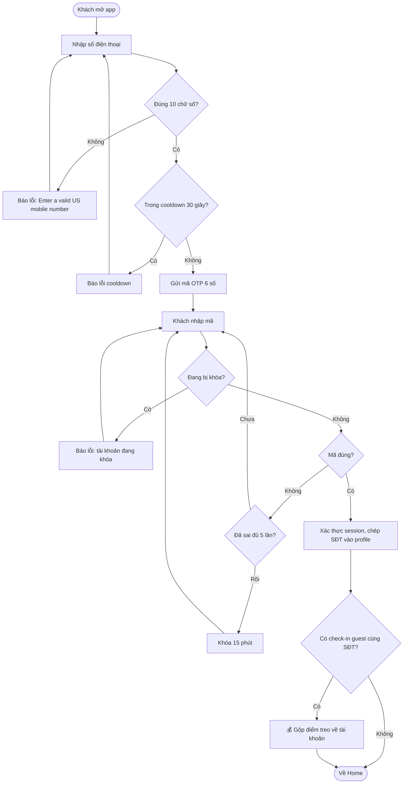
```mermaid
flowchart TD
    A([Khách mở app]) --> B[Nhập số điện thoại]
    B --> C{Đúng 10 chữ số?}
    C -- Không --> B2[Báo lỗi: Enter a valid US mobile number] --> B
    C -- Có --> D{Trong cooldown 30 giây?}
    D -- Có --> D2[Báo lỗi cooldown] --> B
    D -- Không --> E[Gửi mã OTP 6 số]
    E --> F[Khách nhập mã]
    F --> G{Đang bị khóa?}
    G -- Có --> G2[Báo lỗi: tài khoản đang khóa] --> F
    G -- Không --> H{Mã đúng?}
    H -- Không --> I{Đã sai đủ 5 lần?}
    I -- Chưa --> F
    I -- Rồi --> J[Khóa 15 phút] --> F
    H -- Có --> K[Xác thực session, chép SĐT vào profile]
    K --> L{Có check-in guest cùng SĐT?}
    L -- Có --> M[💰 Gộp điểm treo về tài khoản]
    L -- Không --> N
    M --> N([Về Home])
```

---

### Workflow 2: Onboarding & Marketing Consent

**Primary Actor:** Customer (lần đầu)
**Trigger:** Nhận quà chào mừng từ tiệm.
**Outcome:** Khách có 25 điểm và một lựa chọn nhận tin được ghi nhận rõ ràng (đồng ý hoặc từ chối).

**User Stories:**
- As a Customer, I want to nhận điểm mà không bắt buộc phải đồng ý nhận quảng cáo, so that tôi không bị ép đánh đổi quyền riêng tư.
- As a Business, I want to lưu bằng chứng đồng ý không thể sửa, so that tiệm chứng minh được tuân thủ khi bị kiểm tra.

| Step | Who | Action | System Response | Notes |
| :--- | :--- | :--- | :--- | :--- |
| 1 | Customer | Nhập SĐT để nhận quà chào mừng | Kiểm tra 10 chữ số | — |
| 2 | System | Kiểm tra trùng | SĐT trùng tài khoản có sẵn → gửi OTP, chuyển sang đăng nhập; SĐT đã nhận quà → báo *"already claimed"* | Mỗi SĐT chỉ nhận quà **một lần** |
| 3 | System | Cấp quà | 💰 Ghi **+25 điểm** loại *Welcome gift* vào tiệm Bitcoin Nail Bar | Cố định 25, không theo cấu hình tiệm |
| 4 | Customer | Chọn loại tin muốn nhận | 2 lựa chọn: tin của tiệm / ưu đãi đối tác gần đây | Phải tick ít nhất 1 hoặc bấm Skip |
| 5 | Customer | *"Agree & continue"* hoặc *"Skip — points only"* | Agree → staging, chờ xác nhận; Skip → **ghi bản ghi từ chối tường minh** cho cả 2 scope | Skip vẫn giữ nguyên 25 điểm |
| 6 | System | Xác nhận đồng ý | Ghi consent `grant`, method `sms_y` | — |
| 7 | Customer | *"Enter app"* | Về Home | — |

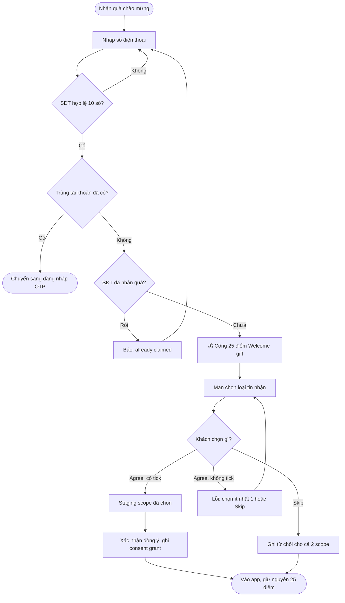
```mermaid
flowchart TD
    A([Nhận quà chào mừng]) --> B[Nhập số điện thoại]
    B --> C{SĐT hợp lệ 10 số?}
    C -- Không --> B
    C -- Có --> D{Trùng tài khoản đã có?}
    D -- Có --> D2([Chuyển sang đăng nhập OTP])
    D -- Không --> E{SĐT đã nhận quà?}
    E -- Rồi --> E2[Báo: already claimed] --> B
    E -- Chưa --> F[💰 Cộng 25 điểm Welcome gift]
    F --> G[Màn chọn loại tin nhận]
    G --> H{Khách chọn gì?}
    H -- Agree, có tick --> I[Staging scope đã chọn]
    H -- Agree, không tick --> G2[Lỗi: chọn ít nhất 1 hoặc Skip] --> G
    H -- Skip --> J[Ghi từ chối cho cả 2 scope]
    I --> K[Xác nhận đồng ý, ghi consent grant]
    K --> L
    J --> L([Vào app, giữ nguyên 25 điểm])
```

---

### Workflow 3: Booking (Đặt lịch)

**Primary Actor:** Customer
**Trigger:** *"Book again"* từ Home / All features / thẻ Look.
**Outcome:** Tiệm xác nhận lịch hẹn, khách nhận booking bonus.

**User Stories:**
- As a Customer, I want to gửi yêu cầu đặt lịch và biết rõ đây mới là *request*, so that tôi không hiểu nhầm là đã chắc chắn có chỗ.
- As a Customer, I want to nhận điểm khi tiệm xác nhận, so that tôi có động lực đặt trước thay vì tới ngẫu nhiên.
- As a Salon, I want to điểm chỉ được cộng khi tôi xác nhận, so that khách không farm điểm bằng cách spam yêu cầu.

| Step | Who | Action | System Response | Notes |
| :--- | :--- | :--- | :--- | :--- |
| 1 | Customer | Chọn dịch vụ, thợ, ngày, giờ (Step 1/3) | Ghi vào booking draft | Cả 4 đều có giá trị mặc định |
| 2 | Customer | Xem lại + ghi chú tùy chọn (Step 2/3) | Hiển thị *"This is a request. The business will confirm your appointment shortly."* | — |
| 3 | Customer | *"Send booking request"* | Tạo booking `requested`; **chưa có lịch hẹn, chưa có điểm** | Thiếu 1 trong 4 → *"Choose service, technician, day and time."* |
| 4 | System | Chốt mức thưởng | Snapshot `bookingBonus` của tiệm tại thời điểm gửi | Tiệm sau đổi mức không ảnh hưởng yêu cầu cũ |
| 5 | System | Hiển thị SLA (Step 3/3) | *"{business} usually responds within 10 minutes."* | — |
| 6 | Salon | Xác nhận | Booking → `confirmed`; **tạo appointment**; 💰 ghi *Booking bonus* nếu mức thưởng > 0 | Mức thưởng = 0 → **không ghi bút toán nào** |
| 7 | Customer | *"Add to calendar"* | Tải file lịch 1 tiếng | Chỉ dùng được khi đã confirmed |

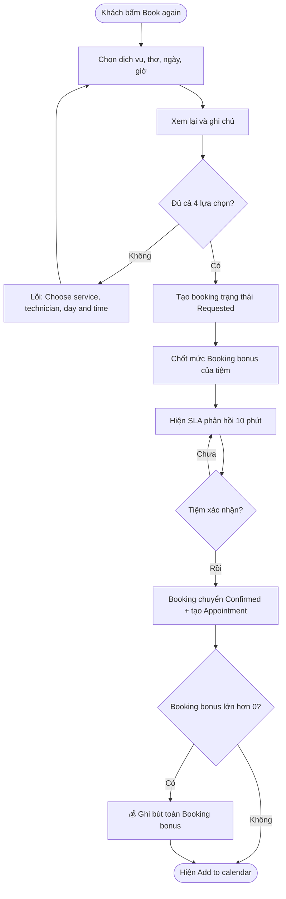
```mermaid
flowchart TD
    A([Khách bấm Book again]) --> B[Chọn dịch vụ, thợ, ngày, giờ]
    B --> C[Xem lại và ghi chú]
    C --> D{Đủ cả 4 lựa chọn?}
    D -- Không --> D2[Lỗi: Choose service, technician, day and time] --> B
    D -- Có --> E[Tạo booking trạng thái Requested]
    E --> F[Chốt mức Booking bonus của tiệm]
    F --> G[Hiện SLA phản hồi 10 phút]
    G --> H{Tiệm xác nhận?}
    H -- Chưa --> G
    H -- Rồi --> I[Booking chuyển Confirmed + tạo Appointment]
    I --> J{Booking bonus lớn hơn 0?}
    J -- Có --> K[💰 Ghi bút toán Booking bonus]
    J -- Không --> L
    K --> L([Hiện Add to calendar])
```

---

### Workflow 4: Arrival & Check-in

**Primary Actor:** Customer / Guest
**Trigger:** Quét QR tại tiệm, nhập mã thủ công, hoặc bấm *"Check In Now"* trên thẻ lịch hẹn.
**Outcome:** Khách vào hàng chờ, biết vị trí của mình, và có Live Ticket để theo dõi.

**User Stories:**
- As a Customer, I want to báo tiệm khi đang trên đường, so that tiệm chuẩn bị trước và tôi chờ ít hơn.
- As a Guest, I want to check-in mà không cần tạo tài khoản, so that tôi không bị chặn ngay ở cửa.
- As a Customer, I want to biết mình thứ mấy trong hàng chờ, so that tôi quyết định được nên chờ hay quay lại sau.
- As a Customer, I want to dùng luôn một reward khi check-in, so that tôi không quên áp dụng lúc tính tiền.

| Step | Who | Action | System Response | Notes |
| :--- | :--- | :--- | :--- | :--- |
| 1 | Customer | *"I'm On My Way"* / *"I've Arrived"* | Ghi trạng thái đến; *"The salon has been notified."* | Chỉ đặt được trên lịch hẹn đã confirmed |
| 2 | System | Hiện nút Check-in | **Chỉ hiện khi trạng thái là Arrived** | Chưa tới nơi thì check-in vô nghĩa |
| 3 | Customer | Quét QR / bấm Check In Now | Kiểm tra QR nghiêm ngặt (xem Business Rules) | Sai → *"Invalid QR code."* |
| 4 | System | Nhận diện tiệm | Hiện *"Welcome to {business}"* | Không tra được tiệm → *"This QR action could not open."* |
| 5 | System | Phân nhánh danh tính | **Member** (đã xác thực + SĐT khớp): ẩn và tự điền tên/SĐT. **Guest**: hiện form nhập | Chưa xác thực → nút đổi thành *"Sign in to use my profile"* |
| 6 | Customer | Chọn dịch vụ + thợ (tùy chọn) | Thợ mặc định lấy từ QR nếu hợp lệ, không thì *"Anyone"* | — |
| 7 | Customer | Chọn reward (tùy chọn) | Hiện tối đa **2 chip**: đã đổi sẵn (🤝) hoặc đổi ngay bằng điểm (🎁) | **Mỗi lượt chỉ 1 reward** |
| 8 | Customer | *"Check In Now"* | Tạo bản ghi check-in, điểm **treo** (`pointsPending`), chưa vào ledger | Lỗi → *"Check the name, phone, and service."* |
| 9 | System | Chống trùng | Trong **120 phút**, submit lại cùng thông tin → trả về đúng lượt cũ, không tạo lượt thứ hai | — |
| 10 | System | Tính hàng chờ | *"You're next in line"* hoặc *"#{position} in line"* | Tính theo thứ tự đến, chưa được phục vụ |
| 11 | Customer | *"Open my service ticket"* | Mở Live Ticket | — |

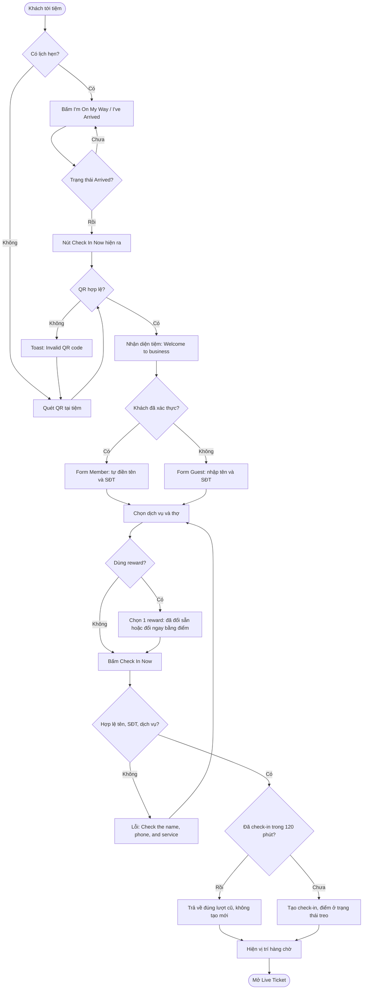
```mermaid
flowchart TD
    A([Khách tới tiệm]) --> B{Có lịch hẹn?}
    B -- Có --> C[Bấm I'm On My Way / I've Arrived]
    C --> D{Trạng thái Arrived?}
    D -- Chưa --> C
    D -- Rồi --> E[Nút Check In Now hiện ra]
    B -- Không --> F[Quét QR tại tiệm]
    E --> G
    F --> G{QR hợp lệ?}
    G -- Không --> G2[Toast: Invalid QR code] --> F
    G -- Có --> H[Nhận diện tiệm: Welcome to business]
    H --> I{Khách đã xác thực?}
    I -- Có --> J[Form Member: tự điền tên và SĐT]
    I -- Không --> K[Form Guest: nhập tên và SĐT]
    J --> L[Chọn dịch vụ và thợ]
    K --> L
    L --> M{Dùng reward?}
    M -- Có --> N[Chọn 1 reward: đã đổi sẵn hoặc đổi ngay bằng điểm]
    M -- Không --> O
    N --> O[Bấm Check In Now]
    O --> P{Hợp lệ tên, SĐT, dịch vụ?}
    P -- Không --> P2[Lỗi: Check the name, phone, and service] --> L
    P -- Có --> Q{Đã check-in trong 120 phút?}
    Q -- Rồi --> R[Trả về đúng lượt cũ, không tạo mới]
    Q -- Chưa --> S[Tạo check-in, điểm ở trạng thái treo]
    R --> T
    S --> T[Hiện vị trí hàng chờ]
    T --> U([Mở Live Ticket])
```

---

### Workflow 5: Live Ticket — Đổi thợ & Duyệt Add-on

**Primary Actor:** Customer
**Trigger:** Mở Live Ticket sau check-in.
**Outcome:** Khách kiểm soát được ai phục vụ mình và tiệm sẽ tính tiền những gì.

**User Stories:**
- As a Customer, I want to thấy phiếu của mình cập nhật theo tiệm, so that tôi không bị bất ngờ khi tính tiền.
- As a Customer, I want to được đề xuất thợ khác khi thợ tôi chọn bận hoặc không đủ kỹ năng, so that tôi không phải chờ vô định.
- As a Customer, I want to duyệt add-on trước khi bị tính tiền, so that không ai thêm dịch vụ mà tôi không đồng ý.
- As a Salon, I want to khách xác nhận 4 số cuối khi trả lời add-on, so that không ai khác thay khách quyết định hóa đơn.

| Step | Who | Action | System Response | Notes |
| :--- | :--- | :--- | :--- | :--- |
| 1 | System | Hiện phiếu | Tiệm chưa mở → *"Awaiting salon"*, hiện tạm giá dịch vụ khách chọn | Không tự động refresh; cập nhật theo thao tác |
| 2 | Salon | Mở phiếu | Trạng thái → *"In service"*, có số phiếu | Không có thợ nào làm được đủ dịch vụ → *"No technician can cover every service you picked."* |
| 3 | System | Cảnh báo thợ | Thợ yêu cầu bận hoặc thiếu kỹ năng → hiện thẻ *"Review"* kèm lý do và danh sách thợ đề xuất | Kỹ năng ưu tiên hơn bận |
| 4 | Customer | Chọn thợ khác / *"Let the salon choose"* | Đổi ngay, không cần xác nhận thêm | Miễn phí nên không cần bước xác nhận |
| 5 | System | Chặn đổi sai | Phiếu đã mở, hoặc chọn người ngoài danh sách đề xuất → *"The technician could not be changed."* | Không thợ nào phù hợp → chỉ còn *"Ask Front Desk"* |
| 6 | Staff | Đề xuất add-on | Hiện thẻ *"Approval"*: giá add-on, tổng cũ → tổng mới | **Mỗi phiếu chỉ 1 add-on chờ trả lời** |
| 7 | Customer | *"Accept"* hoặc *"Decline"* | Yêu cầu nhập **4 số cuối SĐT** cho **cả hai** lựa chọn | Vì cả hai đều thay đổi số tiền tiệm sẽ tính |
| 8 | System | Đối chiếu | Sai → *"Those last 4 digits do not match this check-in."* | — |
| 9 | System | Ghi kết quả | *"The add-on was added to your ticket."* / *"The add-on was declined."* | — |
| 10 | Customer | Bấm **Pay** | Bị chặn nếu tiệm chưa mở phiếu, hoặc còn add-on chưa trả lời | **Không chặn theo trạng thái phiếu** — khách được thanh toán sớm |

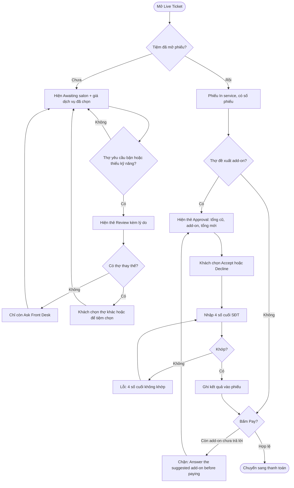
```mermaid
flowchart TD
    A([Mở Live Ticket]) --> B{Tiệm đã mở phiếu?}
    B -- Chưa --> C[Hiện Awaiting salon + giá dịch vụ đã chọn]
    C --> D{Thợ yêu cầu bận hoặc thiếu kỹ năng?}
    D -- Có --> E[Hiện thẻ Review kèm lý do]
    E --> F{Có thợ thay thế?}
    F -- Không --> G[Chỉ còn Ask Front Desk] --> C
    F -- Có --> H[Khách chọn thợ khác hoặc để tiệm chọn]
    H --> C
    D -- Không --> C
    B -- Rồi --> I[Phiếu In service, có số phiếu]
    I --> J{Thợ đề xuất add-on?}
    J -- Có --> K[Hiện thẻ Approval: tổng cũ, add-on, tổng mới]
    K --> L[Khách chọn Accept hoặc Decline]
    L --> M[Nhập 4 số cuối SĐT]
    M --> N{Khớp?}
    N -- Không --> N2[Lỗi: 4 số cuối không khớp] --> M
    N -- Có --> O[Ghi kết quả vào phiếu]
    J -- Không --> P
    O --> P{Bấm Pay?}
    P -- Còn add-on chưa trả lời --> P2[Chặn: Answer the suggested add-on before paying] --> K
    P -- Hợp lệ --> Q([Chuyển sang thanh toán])
```

---

### Workflow 6: Tip (Multi-staff)

**Primary Actor:** Customer
**Trigger:** Quét QR của thợ, quét QR tiệm, hoặc chọn *"Send a tip"* trong app.
**Outcome:** Tiền được chuyển ngoài hệ thống; tiệm xác nhận; khách nhận tip bonus.

**User Stories:**
- As a Customer, I want to tip nhiều thợ trong một lần chuyển khoản, so that tôi không phải mở app ngân hàng nhiều lần.
- As a Customer, I want to chia đều hoặc chỉ định từng người, so that tôi thưởng đúng công sức từng thợ.
- As a Staff, I want to nhận tip thẳng vào tài khoản của mình khi chỉ có mình tôi được tip, so that tiền không phải đi vòng qua tiệm.
- As a Customer, I want to biết rõ Nexora không giữ tiền, so that tôi hiểu mình đang chuyển thẳng cho ai.

| Step | Who | Action | System Response | Notes |
| :--- | :--- | :--- | :--- | :--- |
| 1 | Customer | Chọn thợ (*"Who helped you today?"*) | Cho phép **1–12 thợ** | Thợ nghỉ hoặc không nhận tip → loại |
| 2 | System | Định tuyến tiền | **1 thợ → tiền vào tài khoản riêng của thợ. 2+ thợ → MỘT chuyển khoản vào tài khoản chung của tiệm**, tiệm chia lại | Tiệm chưa có tài khoản chung → **chặn hoàn toàn** tip nhiều thợ |
| 3 | Customer | Chọn *"Split equally"* / *"Individual amounts"* | Chia đều: chia hết, phần lẻ rải 1 xu cho từng người đầu — **không mất xu nào** | Chọn 1 thợ → tự ép về chia đều |
| 4 | Customer | Nhập số tiền | Presets $10/$20/$30/$40 hoặc nhập tay | **Tối thiểu $1 mỗi người** |
| 5 | Customer | Chọn phương thức | Chỉ hiện phương thức bên nhận đã bật | Không bật → *"This payment method is unavailable."* |
| 6 | Customer | Chuyển tiền ngoài app | Hiện hướng dẫn + QR/địa chỉ ví; *"NEXORA never holds your money."* | Nexora **không** thực hiện chuyển khoản |
| 7 | Customer | Nộp ảnh bằng chứng (tùy chọn) | Tối đa **3 ảnh, mỗi ảnh 5 MB** | **Tùy chọn** — khách có thể khẳng định mà không có ảnh |
| 8 | Customer | *"I sent the tip"* | 💰 Tạo tip batch `pending` + 1 dòng tip/thợ + 1 proof | Bắt buộc khẳng định đã chuyển tiền |
| 9 | System | Chống trùng | Cùng mã yêu cầu + cùng nội dung → trả về batch cũ; nội dung khác → từ chối | Chống double-tap tính tiền 2 lần |
| 10 | Salon | Xác nhận / từ chối | Xác nhận → 💰 cộng *Tip bonus*. Từ chối → **0 điểm**, kèm lý do | **Người thật quyết định — không có OCR** |
| 11 | Customer | *"Replace proof"* (nếu bị từ chối) | Tạo proof mới, batch quay lại `pending` | **Không giới hạn số lần thử lại** |

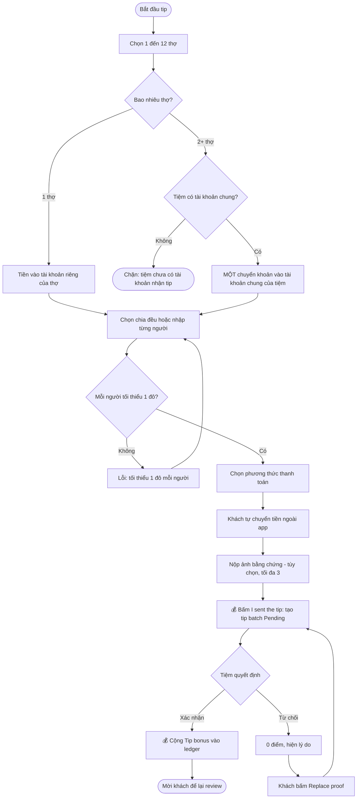
```mermaid
flowchart TD
    A([Bắt đầu tip]) --> B[Chọn 1 đến 12 thợ]
    B --> C{Bao nhiêu thợ?}
    C -- 1 thợ --> D[Tiền vào tài khoản riêng của thợ]
    C -- 2+ thợ --> E{Tiệm có tài khoản chung?}
    E -- Không --> E2([Chặn: tiệm chưa có tài khoản nhận tip]) 
    E -- Có --> F[MỘT chuyển khoản vào tài khoản chung của tiệm]
    D --> G[Chọn chia đều hoặc nhập từng người]
    F --> G
    G --> H{Mỗi người tối thiểu 1 đô?}
    H -- Không --> H2[Lỗi: tối thiểu 1 đô mỗi người] --> G
    H -- Có --> I[Chọn phương thức thanh toán]
    I --> J[Khách tự chuyển tiền ngoài app]
    J --> K[Nộp ảnh bằng chứng - tùy chọn, tối đa 3]
    K --> L[💰 Bấm I sent the tip: tạo tip batch Pending]
    L --> M{Tiệm quyết định}
    M -- Xác nhận --> N[💰 Cộng Tip bonus vào ledger]
    M -- Từ chối --> O[0 điểm, hiện lý do]
    O --> P[Khách bấm Replace proof]
    P --> L
    N --> Q([Mời khách để lại review])
```

---

### Workflow 7: Direct Pay (Thanh toán trực tiếp cho tiệm)

**Primary Actor:** Customer
**Trigger:** Quét QR tiệm hoặc chọn *"Pay salon"*.
**Outcome:** Tiệm nhận đủ tiền, phí nền tảng $0; khách nhận điểm thanh toán + thưởng direct-pay.

**User Stories:**
- As a Customer, I want to trả tiền cho tiệm với phí $0, so that toàn bộ số tiền tới tiệm.
- As a Business, I want to tự xác nhận đúng khoản chuyển mình đã nhận, so that không ai nhận điểm bằng bằng chứng giả.

| Step | Who | Action | System Response | Notes |
| :--- | :--- | :--- | :--- | :--- |
| 1 | Customer | Nhập số tiền | Presets $20/$40/$60/$80 hoặc nhập tay | **Tối thiểu $1**, tối đa 2 chữ số thập phân |
| 2 | System | Hiện bảng phí | *"Business receives"* = toàn bộ; *"NEXORA fee"* = **$0.00**; điểm dự kiến khi xác nhận | Không có khấu trừ |
| 3 | Customer | Chọn phương thức | Chỉ tài khoản của **tiệm** | — |
| 4 | Customer | Chuyển tiền ngoài app | Hiện hướng dẫn + nút mở app thanh toán | — |
| 5 | Customer | Nộp bằng chứng (tùy chọn) + *"I sent the payment"* | 💰 Tạo direct payment `pending` + proof | Chống trùng theo mã yêu cầu |
| 6 | Salon | Xác nhận | 💰 Ghi **2 bút toán**: *Payment points* (theo số tiền) + *Direct-pay bonus* (theo % của tiệm) | Bắt buộc đúng 2 bút toán |
| 7 | Salon | Từ chối | *"The salon could not match this transfer"*, **0 điểm** | Phải nộp proof mới, **không thể xác nhận thẳng** từ trạng thái bị từ chối |
| 8 | Customer | *"Leave a review (+15 points)"* | Chuyển sang review | Tùy chọn |

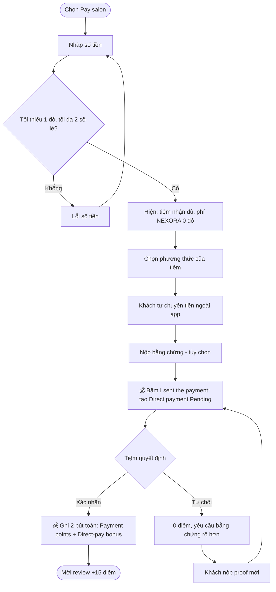
```mermaid
flowchart TD
    A([Chọn Pay salon]) --> B[Nhập số tiền]
    B --> C{Tối thiểu 1 đô, tối đa 2 số lẻ?}
    C -- Không --> C2[Lỗi số tiền] --> B
    C -- Có --> D[Hiện: tiệm nhận đủ, phí NEXORA 0 đô]
    D --> E[Chọn phương thức của tiệm]
    E --> F[Khách tự chuyển tiền ngoài app]
    F --> G[Nộp bằng chứng - tùy chọn]
    G --> H[💰 Bấm I sent the payment: tạo Direct payment Pending]
    H --> I{Tiệm quyết định}
    I -- Xác nhận --> J[💰 Ghi 2 bút toán: Payment points + Direct-pay bonus]
    I -- Từ chối --> K[0 điểm, yêu cầu bằng chứng rõ hơn]
    K --> L[Khách nộp proof mới] --> H
    J --> M([Mời review +15 điểm])
```

---

### Workflow 8: Guest Checkout (Thanh toán theo phiếu dịch vụ)

**Primary Actor:** Guest / Customer
**Trigger:** Tiệm đã hoàn tất phiếu dịch vụ; khách mở checkout từ Live Ticket hoặc từ màn quét QR.
**Outcome:** Front Desk xác minh, khách nhận biên lai và điểm (điểm của guest ở trạng thái chờ claim).

**User Stories:**
- As a Guest, I want to thanh toán đúng theo phiếu đã chốt, so that tôi không phải tự nhập số tiền và nhập sai.
- As a Guest, I want to mở phiếu của mình bằng 4 số cuối SĐT, so that người khác không xem được hóa đơn của tôi.
- As a Guest, I want to điểm được giữ lại để claim sau, so that tôi không mất điểm vì chưa có tài khoản.

| Step | Who | Action | System Response | Notes |
| :--- | :--- | :--- | :--- | :--- |
| 1 | Customer | Chọn phiếu đã hoàn tất | Phiếu không thuộc session hiện ra dạng ẩn danh *"Completed service {index}"* | Chưa hoàn tất → *"The salon must complete the service before checkout."* |
| 2 | Customer | Nhập 4 số cuối SĐT | Hồ sơ đã xác thực → **miễn nhập**, ô bị khóa | Sai → *"The last 4 phone digits do not match this check-in."* |
| 3 | System | Hiện phiếu | Line item (dịch vụ / add-on / giảm giá), *"Before Tip"*, *"Total"* | Reward đã dùng hiện thành dòng giảm giá |
| 4 | Customer | Chọn tip | Chỉ **4 mức**: *No Tip* / 15% / 18% / 20% | Tính trên số tiền sau giảm giá |
| 5 | Customer | Chọn phương thức | **Zelle/Venmo → bắt buộc nộp ảnh. Card / Pay at Counter → không cần ảnh** | Chưa chọn → *"Select a payment method to continue."* |
| 6 | Customer | Nộp proof + ghi chú (≤280 ký tự) | Checkout → `pending_verification` | — |
| 7 | Front Desk | *"Verify"* | 💰 Sinh biên lai + tạo **điểm chờ claim** cho guest | *"Rewards are pending; use the same phone to claim later."* |
| 8 | Front Desk | *"Reject"* | Hiện lý do; khách bấm *"Replace Proof"* → **tạo checkout MỚI** | Khác Direct Pay: không mở lại phiếu cũ |

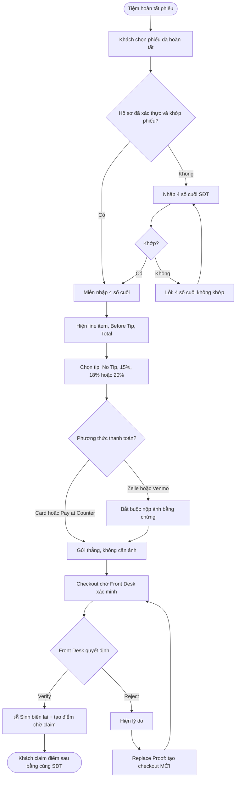
```mermaid
flowchart TD
    A([Tiệm hoàn tất phiếu]) --> B[Khách chọn phiếu đã hoàn tất]
    B --> C{Hồ sơ đã xác thực và khớp phiếu?}
    C -- Có --> E[Miễn nhập 4 số cuối]
    C -- Không --> D[Nhập 4 số cuối SĐT]
    D --> D1{Khớp?}
    D1 -- Không --> D2[Lỗi: 4 số cuối không khớp] --> D
    D1 -- Có --> E
    E --> F[Hiện line item, Before Tip, Total]
    F --> G[Chọn tip: No Tip, 15%, 18% hoặc 20%]
    G --> H{Phương thức thanh toán?}
    H -- Card hoặc Pay at Counter --> I[Gửi thẳng, không cần ảnh]
    H -- Zelle hoặc Venmo --> J[Bắt buộc nộp ảnh bằng chứng]
    J --> I
    I --> K[Checkout chờ Front Desk xác minh]
    K --> L{Front Desk quyết định}
    L -- Verify --> M[💰 Sinh biên lai + tạo điểm chờ claim]
    L -- Reject --> N[Hiện lý do]
    N --> O[Replace Proof: tạo checkout MỚI] --> K
    M --> P([Khách claim điểm sau bằng cùng SĐT])
```

---

### Workflow 9: Review (Phản hồi riêng tư)

**Primary Actor:** Customer
**Trigger:** Sau khi tip/thanh toán được xác nhận, hoặc chủ động từ menu.
**Outcome:** Tiệm nhận phản hồi riêng; khách nhận **15 điểm bất kể đánh giá mấy sao**.

**User Stories:**
- As a Customer, I want to nhận điểm dù tôi đánh giá thấp, so that tôi phản hồi thật lòng mà không bị phạt.
- As a Business, I want to nhận phản hồi tiêu cực riêng tư trước, so that tôi sửa được trước khi nó thành review công khai.

| Step | Who | Action | System Response | Notes |
| :--- | :--- | :--- | :--- | :--- |
| 1 | Customer | Chấm 1–5 sao | Nhãn Bad/Poor/Okay/Great/Excellent | Chỉ số nguyên 1–5 |
| 2 | Customer | Chọn tag + ghi chú riêng (≤500 ký tự) | — | Tùy chọn |
| 3 | Customer | *"Send feedback + earn 15 points"* | 💰 Ghi **+15 điểm** loại *Private feedback* | **Mọi mức sao đều +15** |
| 4 | System | Chống trùng | Gửi lại cho cùng lượt → trả về 15 điểm nhưng **không cộng lần hai** | — |
| 5 | Customer | *"Share on Google (optional · no points)"* | Mở Google Reviews | **Cố ý không thưởng điểm** |

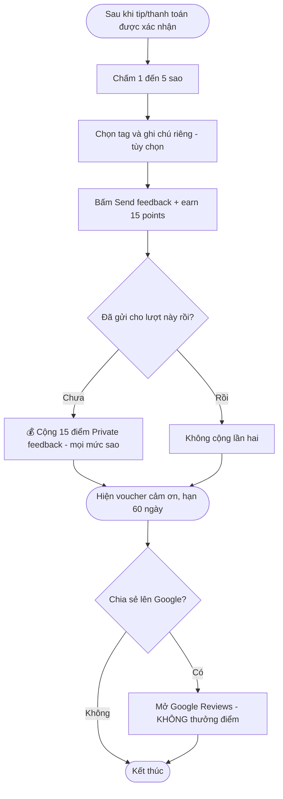
```mermaid
flowchart TD
    A([Sau khi tip/thanh toán được xác nhận]) --> B[Chấm 1 đến 5 sao]
    B --> C[Chọn tag và ghi chú riêng - tùy chọn]
    C --> D[Bấm Send feedback + earn 15 points]
    D --> E{Đã gửi cho lượt này rồi?}
    E -- Rồi --> F[Không cộng lần hai]
    E -- Chưa --> G[💰 Cộng 15 điểm Private feedback - mọi mức sao]
    G --> H([Hiện voucher cảm ơn, hạn 60 ngày])
    F --> H
    H --> I{Chia sẻ lên Google?}
    I -- Có --> J[Mở Google Reviews - KHÔNG thưởng điểm]
    I -- Không --> K([Kết thúc])
    J --> K
```

---

### Workflow 10: Reward Redemption (Đổi thưởng)

**Primary Actor:** Customer
**Trigger:** Bấm *"Redeem"* trên thẻ reward trong tab Explore.
**Outcome:** Khách có mã đưa cho nhân viên; điểm bị trừ vĩnh viễn.

**User Stories:**
- As a Customer, I want to đổi điểm của tiệm này lấy ưu đãi ở tiệm khác cùng liên minh, so that điểm của tôi có giá trị rộng hơn.
- As a Customer, I want to được cảnh báo rõ trước khi trừ điểm, so that tôi không đổi nhầm.
- As a Business, I want to mỗi mã chỉ dùng được một lần, so that không ai dùng lại ưu đãi đã tiêu.

| Step | Who | Action | System Response | Notes |
| :--- | :--- | :--- | :--- | :--- |
| 1 | Customer | Xem catalog | Nút hiện *"Redeem"*, hoặc bị khóa với *"{n} more"* (thiếu điểm) / *"Different alliance"* | Reward giá 0 điểm (referral) **không** vào catalog |
| 2 | Customer | Bấm *"Redeem"* | Tạo phiên đổi, hiện: giá reward, số dư hiện tại, **số dư sau khi đổi** | — |
| 3 | System | Cảnh báo | *"This action cannot be undone."* | **Không có bước xác nhận thứ hai** |
| 4 | Customer | *"Use points now"* | 💰 Trừ điểm tại **tiệm nguồn**, tạo redemption `Ready`, ghi bút toán *Reward redeemed* (âm) | Nút bị khóa trong lúc xử lý |
| 5 | System | Chống trùng | Cùng khóa phiên → trả về redemption cũ; khóa cũ + reward khác → từ chối | Không bao giờ trừ điểm 2 lần |
| 6 | Customer | *"Show QR code"* | Hiện mã để đưa nhân viên | Chỉ mã chưa tiêu mới hiện được |
| 7 | Staff | Nhận mã tại check-in | Redemption chuyển sang **Used** (suy ra từ check-in, không ghi đè trạng thái) | **1 mã chỉ gắn được 1 check-in** |

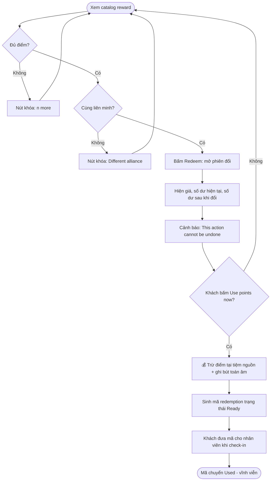
```mermaid
flowchart TD
    A([Xem catalog reward]) --> B{Đủ điểm?}
    B -- Không --> B2[Nút khóa: n more] --> A
    B -- Có --> C{Cùng liên minh?}
    C -- Không --> C2[Nút khóa: Different alliance] --> A
    C -- Có --> D[Bấm Redeem: mở phiên đổi]
    D --> E[Hiện giá, số dư hiện tại, số dư sau khi đổi]
    E --> F[Cảnh báo: This action cannot be undone]
    F --> G{Khách bấm Use points now?}
    G -- Không --> A
    G -- Có --> H[💰 Trừ điểm tại tiệm nguồn + ghi bút toán âm]
    H --> I[Sinh mã redemption trạng thái Ready]
    I --> J[Khách đưa mã cho nhân viên khi check-in]
    J --> K([Mã chuyển Used - vĩnh viễn])
```

---

### Workflow 11: Referral (Mời bạn bè)

**Primary Actor:** Customer
**Trigger:** Chia sẻ mã/QR giới thiệu từ màn *"Invite friends"*.
**Outcome:** Sau khi bạn được mời có lượt ghé trả phí đầu tiên, người mời nhận **50 điểm do tiệm tài trợ**.

**User Stories:**
- As a Customer, I want to mời bạn bằng link hoặc QR, so that việc mời không có ma sát.
- As a Business, I want to chỉ trả điểm sau lượt ghé có trả tiền, so that tôi không trả cho lời mời ảo.
- As a Business, I want to chặn tự giới thiệu chính mình, so that không ai farm điểm bằng số của chính họ.

| Step | Who | Action | System Response | Notes |
| :--- | :--- | :--- | :--- | :--- |
| 1 | Customer | Chia sẻ mã / QR / link | Tạo referral `Invited` | Chia sẻ thất bại → hiện link để copy tay |
| 2 | System | Chặn gian lận | SĐT trùng chính chủ → *"You cannot refer yourself."* | Kiểm tra **2 lần**: lúc tạo và lúc nạp lại dữ liệu |
| 3 | System | Chống trùng | Mời lại cùng SĐT → trả về lời mời cũ | Mỗi SĐT một lời mời |
| 4 | Friend | Tham gia | Referral → `Joined` | **Không thể bỏ qua bước này** |
| 5 | Friend | Có lượt ghé trả phí đầu tiên | Referral → `Rewarded`; 💰 ghi **+50 điểm** loại *Referral* | Điểm ghi vào **tiệm tài trợ** |
| 6 | System | Bảo vệ quyền riêng tư | Hiện tên nếu có, không thì `••• {4 số cuối}` | Số điện thoại đầy đủ không bao giờ hiển thị |

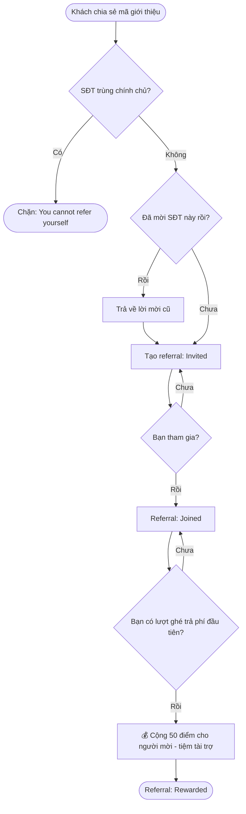
```mermaid
flowchart TD
    A([Khách chia sẻ mã giới thiệu]) --> B{SĐT trùng chính chủ?}
    B -- Có --> B2([Chặn: You cannot refer yourself])
    B -- Không --> C{Đã mời SĐT này rồi?}
    C -- Rồi --> C2[Trả về lời mời cũ] --> D
    C -- Chưa --> D[Tạo referral: Invited]
    D --> E{Bạn tham gia?}
    E -- Chưa --> D
    E -- Rồi --> F[Referral: Joined]
    F --> G{Bạn có lượt ghé trả phí đầu tiên?}
    G -- Chưa --> F
    G -- Rồi --> H[💰 Cộng 50 điểm cho người mời - tiệm tài trợ]
    H --> I([Referral: Rewarded])
```

---

### Workflow 12: My Looks (Kho kiểu đã làm)

**Primary Actor:** Customer
**Trigger:** *"Add look"* hoặc *"Scan receipt"* trên màn *"My looks"*.
**Outcome:** Khách có kho kiểu để rebook, khoe với thợ, hoặc nhớ lại công thức màu.

**User Stories:**
- As a Customer, I want to lưu ảnh và công thức màu của lần làm trước, so that lần sau tôi chỉ cần đưa thợ xem.
- As a Customer, I want to quét hóa đơn để tự điền dịch vụ, so that tôi chỉ phải nhập phần mà chỉ tôi biết.
- As a Customer, I want to rebook hoặc tip thẳng từ một look, so that tôi không phải tìm lại thợ cũ.

| Step | Who | Action | System Response | Notes |
| :--- | :--- | :--- | :--- | :--- |
| 1 | Customer | *"Scan receipt"* (tùy chọn) | Đọc chữ từ ảnh hóa đơn, điền sẵn dịch vụ; *"Filled in from your scanned receipt. Add the color and notes only you know."* | Đây là **nơi duy nhất trong app dùng OCR** |
| 2 | Customer | Nhập ảnh / dịch vụ / màu / ghi chú | Cần **ít nhất một trường** có nội dung | Trống hết → *"Add a photo, service, color or note."* |
| 3 | Customer | *"Save look"* | Lưu look kèm nguồn gốc (lượt ghé, thợ) | — |
| 4 | System | Xử lý hết bộ nhớ | Lưu lại look **không kèm ảnh**; *"Image storage is full; look details were saved without the photo."* | — |
| 5 | Customer | Tìm kiếm / sắp xếp | Ô tìm kiếm được nhớ giữa các lần mở; sắp xếp *"Newest"* / *"Oldest"* | Tìm không ra → **ẩn** nút *"Add your first look"* |
| 6 | Customer | View / Edit / Rebook / Tip / Delete | Rebook mở luồng đặt lịch; Tip mở luồng tip đúng thợ đó | Nút *"Follow"* chỉ hiện nếu khách thật sự từng được thợ đó phục vụ |

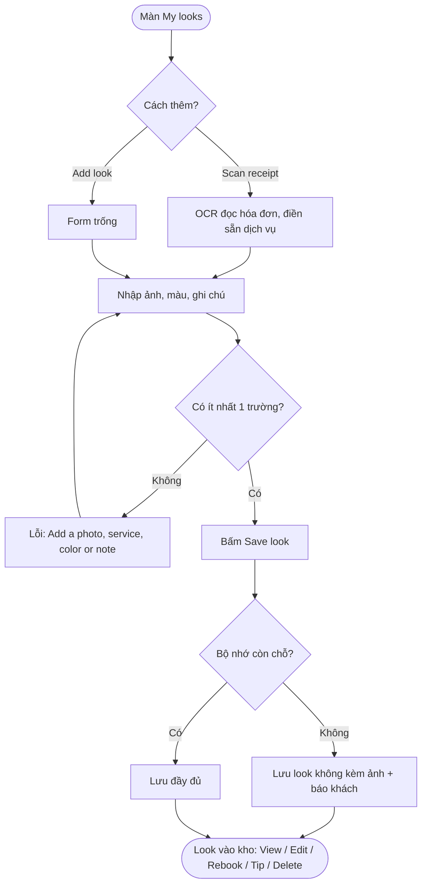
```mermaid
flowchart TD
    A([Màn My looks]) --> B{Cách thêm?}
    B -- Scan receipt --> C[OCR đọc hóa đơn, điền sẵn dịch vụ]
    B -- Add look --> D[Form trống]
    C --> E[Nhập ảnh, màu, ghi chú]
    D --> E
    E --> F{Có ít nhất 1 trường?}
    F -- Không --> F2[Lỗi: Add a photo, service, color or note] --> E
    F -- Có --> G[Bấm Save look]
    G --> H{Bộ nhớ còn chỗ?}
    H -- Không --> I[Lưu look không kèm ảnh + báo khách]
    H -- Có --> J[Lưu đầy đủ]
    I --> K
    J --> K([Look vào kho: View / Edit / Rebook / Tip / Delete])
```

---

## System Configuration & Administration

Các nội dung liên quan cấu hình và vận hành không thuộc riêng một workflow nào:

- As a Business Owner, I want to đặt riêng `checkinPoints`, `tipMultiplier`, `directPayBonusPct`, `bookingBonus`, so that tôi kiểm soát chi phí loyalty của tiệm mình.
- As a Business Owner, I want to đặt `bookingBonus = 0`, so that tiệm tôi không thưởng điểm đặt lịch (hệ thống sẽ không ghi bút toán nào).
- As a Business Owner, I want to bật/tắt từng phương thức nhận tiền, so that khách chỉ thấy kênh tôi thật sự dùng.
- As a Business Owner, I want to khai báo tài khoản nhận tiền chung của tiệm, so that khách tip được cho nhiều thợ cùng lúc.
- As an Alliance Admin, I want to gán các tiệm vào cùng một alliance, so that reward dùng chéo giữa các tiệm hợp lệ.
- As a Customer, I want to đổi ngôn ngữ hiển thị EN/VI, so that tôi đọc app bằng tiếng của mình.
- As a Customer, I want to bật/tắt từng loại tin marketing bất cứ lúc nào, so that tôi luôn kiểm soát được việc bị nhắn tin.
- As a Customer, I want to đổi tên và ảnh đại diện, so that hồ sơ của tôi đúng. (Số điện thoại **không đổi được** tại đây — cần xác thực OTP.)
- As a Support Agent, I want to biết dữ liệu chỉ nằm trên thiết bị khách, so that tôi không hứa khôi phục được dữ liệu đã mất.

---

## State Lifecycle

### 1. Booking & Appointment

| Current Status | Trigger | New Status | Notes |
| :--- | :--- | :--- | :--- |
| *(chưa có)* | Khách gửi yêu cầu đặt lịch | `Requested` | Chưa có lịch hẹn, chưa có điểm |
| `Requested` | Tiệm xác nhận | `Confirmed` | 💰 Tạo appointment + ghi booking bonus (nếu > 0) |
| `Confirmed` | Xác nhận lại | `Confirmed` | Không cộng điểm lần hai |

Appointment chỉ có **một** trạng thái hợp lệ: `Confirmed`. **Không có luồng hủy hay đổi lịch** trong phạm vi này. Trạng thái đến nơi (*arrival*) là trường **độc lập**: `null` → `On my way` ⇄ `Arrived`, chỉ đặt được trên lịch đã confirmed.

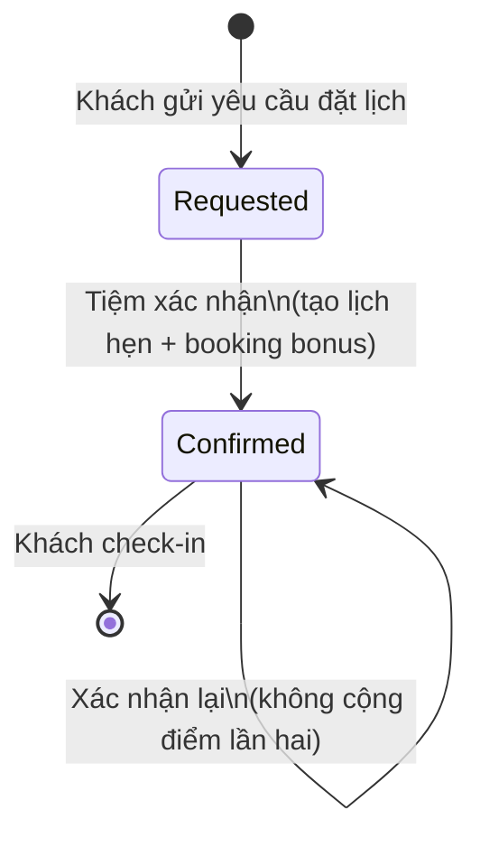
```mermaid
stateDiagram-v2
    [*] --> Requested : Khách gửi yêu cầu đặt lịch
    Requested --> Confirmed : Tiệm xác nhận\n(tạo lịch hẹn + booking bonus)
    Confirmed --> Confirmed : Xác nhận lại\n(không cộng điểm lần hai)
    Confirmed --> [*] : Khách check-in
```

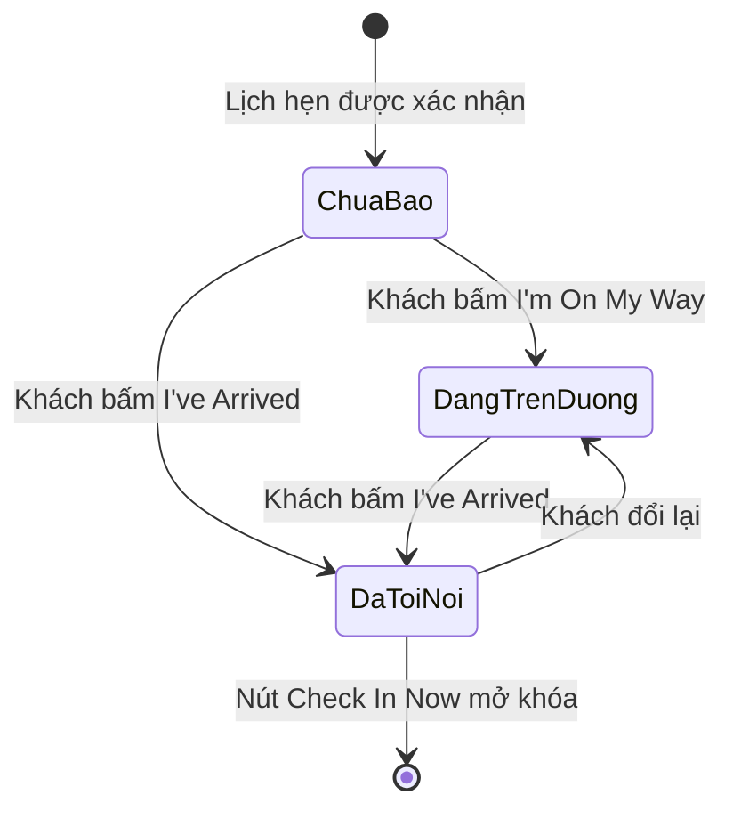
```mermaid
stateDiagram-v2
    [*] --> ChuaBao : Lịch hẹn được xác nhận
    ChuaBao --> DangTrenDuong : Khách bấm I'm On My Way
    ChuaBao --> DaToiNoi : Khách bấm I've Arrived
    DangTrenDuong --> DaToiNoi : Khách bấm I've Arrived
    DaToiNoi --> DangTrenDuong : Khách đổi lại
    DaToiNoi --> [*] : Nút Check In Now mở khóa
```

### 2. Live Ticket

| Current Status | Trigger | New Status | Notes |
| :--- | :--- | :--- | :--- |
| `Awaiting salon` | Tiệm mở phiếu | `In service` | Cần có thợ làm được **đủ** dịch vụ |
| `In service` | Tiệm hoàn tất | `Completed` | Mở khóa Guest Checkout |

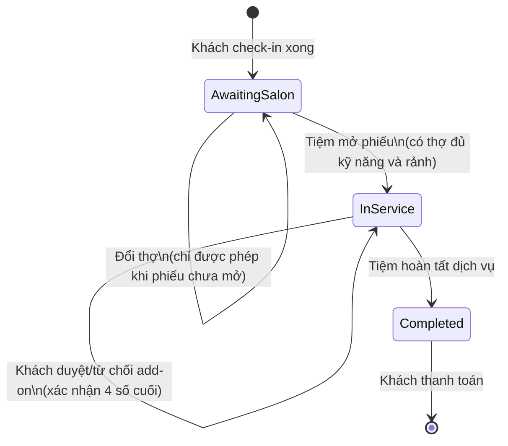
```mermaid
stateDiagram-v2
    [*] --> AwaitingSalon : Khách check-in xong
    AwaitingSalon --> AwaitingSalon : Đổi thợ\n(chỉ được phép khi phiếu chưa mở)
    AwaitingSalon --> InService : Tiệm mở phiếu\n(có thợ đủ kỹ năng và rảnh)
    InService --> InService : Khách duyệt/từ chối add-on\n(xác nhận 4 số cuối)
    InService --> Completed : Tiệm hoàn tất dịch vụ
    Completed --> [*] : Khách thanh toán
```

### 3. Tip Batch (và Direct Payment — cùng hình dạng)

| Current Status | Trigger | New Status | Notes |
| :--- | :--- | :--- | :--- |
| *(chưa có)* | Khách bấm *"I sent the tip"* | `Pending` | 💰 Khẳng định đã chuyển tiền |
| `Pending` | Tiệm xác nhận | `Confirmed` | 💰 Cộng điểm. **Trạng thái cuối, không đảo ngược** |
| `Pending` | Tiệm từ chối | `Rejected` | 0 điểm, bắt buộc có lý do |
| `Rejected` | Khách nộp bằng chứng mới | `Pending` | Tạo proof mới, **không giới hạn số lần** |
| `Confirmed` | Mọi thao tác từ chối | *(bị chặn)* | Đã xác nhận là vĩnh viễn |

> 💡 **Important:** Từ `Rejected` **không thể đi thẳng** sang `Confirmed`. Tiệm buộc phải xác nhận trên một bằng chứng mới mà họ đã thật sự nhìn thấy.

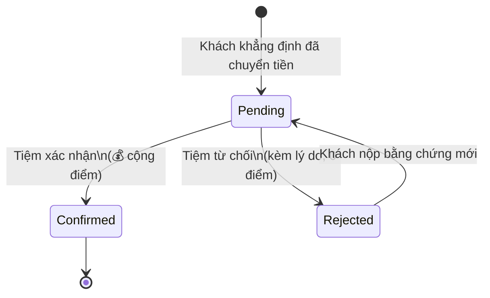
```mermaid
stateDiagram-v2
    [*] --> Pending : Khách khẳng định đã chuyển tiền
    Pending --> Confirmed : Tiệm xác nhận\n(💰 cộng điểm)
    Pending --> Rejected : Tiệm từ chối\n(kèm lý do, 0 điểm)
    Rejected --> Pending : Khách nộp bằng chứng mới
    Confirmed --> [*]
```

### 4. Guest Checkout & Payment Proof

| Current Status | Trigger | New Status | Notes |
| :--- | :--- | :--- | :--- |
| *(chưa có)* | Tiệm hoàn tất phiếu | `Draft` | Mỗi check-in chỉ 1 checkout đang mở |
| `Draft` | Card / Pay at Counter | `Pending verification` | Không cần ảnh |
| `Draft` | Zelle/Venmo + nộp ảnh | `Pending verification` | Bắt buộc ảnh |
| `Pending verification` | Front Desk xác minh | `Confirmed` | 💰 Sinh biên lai + điểm chờ claim |
| `Pending verification` | Front Desk từ chối | `Rejected` | Kèm lý do |
| `Rejected` | *"Replace Proof"* | *(checkout MỚI)* | **Không mở lại phiếu cũ** — khác Tip/Direct Pay |

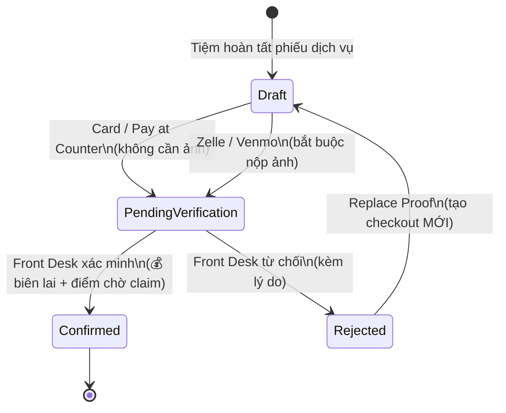
```mermaid
stateDiagram-v2
    [*] --> Draft : Tiệm hoàn tất phiếu dịch vụ
    Draft --> PendingVerification : Card / Pay at Counter\n(không cần ảnh)
    Draft --> PendingVerification : Zelle / Venmo\n(bắt buộc nộp ảnh)
    PendingVerification --> Confirmed : Front Desk xác minh\n(💰 biên lai + điểm chờ claim)
    PendingVerification --> Rejected : Front Desk từ chối\n(kèm lý do)
    Rejected --> Draft : Replace Proof\n(tạo checkout MỚI)
    Confirmed --> [*]
```

### 5. Reward Redemption

| Current Status | Trigger | New Status | Notes |
| :--- | :--- | :--- | :--- |
| *(chưa có)* | Bấm *"Redeem"* | `Attempt pending` | Chưa trừ điểm |
| `Attempt pending` | *"Use points now"* | `Ready` | 💰 Trừ điểm tại tiệm nguồn |
| `Attempt pending` | Phiên hết hiệu lực | *(hủy)* | *"This redemption attempt expired. Choose the reward again."* |
| `Ready` | Một check-in mang mã này | `Used` | **Vĩnh viễn**, 1 mã 1 check-in |
| `Ready` / `Used` | Tiệm đổi giá/nội dung reward | *(bị loại bỏ)* | Redemption cũ và bút toán của nó bị xóa cùng lúc |

> 💡 **Important:** **Không có** trạng thái Expired, Cancelled hay Refunded. *"This action cannot be undone."* là đúng nghĩa đen — không tồn tại đường hoàn điểm.

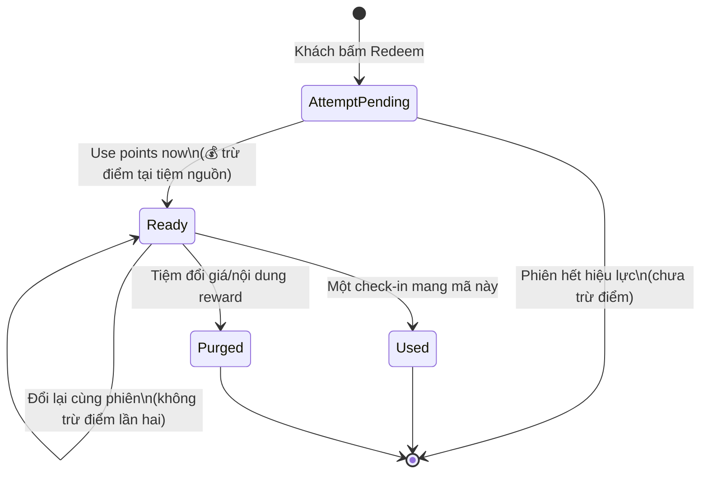
```mermaid
stateDiagram-v2
    [*] --> AttemptPending : Khách bấm Redeem
    AttemptPending --> Ready : Use points now\n(💰 trừ điểm tại tiệm nguồn)
    AttemptPending --> [*] : Phiên hết hiệu lực\n(chưa trừ điểm)
    Ready --> Ready : Đổi lại cùng phiên\n(không trừ điểm lần hai)
    Ready --> Used : Một check-in mang mã này
    Ready --> Purged : Tiệm đổi giá/nội dung reward
    Used --> [*]
    Purged --> [*]
```

### 6. Referral

| Current Status | Trigger | New Status | Notes |
| :--- | :--- | :--- | :--- |
| *(chưa có)* | Khách chia sẻ lời mời | `Invited` | Chưa có điểm, chưa gắn tiệm |
| `Invited` | Bạn tham gia | `Joined` | Vẫn chưa có điểm |
| `Joined` | Bạn có lượt ghé trả phí đầu tiên | `Rewarded` | 💰 Đúng **50 điểm**, tiệm tài trợ |
| `Invited` | Cố nhảy thẳng sang thưởng | *(bị chặn)* | Bắt buộc qua bước `Joined` |

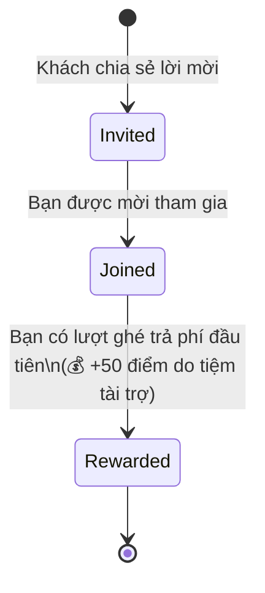
```mermaid
stateDiagram-v2
    [*] --> Invited : Khách chia sẻ lời mời
    Invited --> Joined : Bạn được mời tham gia
    Joined --> Rewarded : Bạn có lượt ghé trả phí đầu tiên\n(💰 +50 điểm do tiệm tài trợ)
    Rewarded --> [*]
```

### 7. Marketing Consent (theo từng scope)

| Current Status | Trigger | New Status | Notes |
| :--- | :--- | :--- | :--- |
| *(chưa có)* | Tick lựa chọn khi onboarding | `Staged` | **Chưa** ghi bản ghi đồng ý |
| `Staged` | Xác nhận | `Granted` | Ghi `grant`, method `sms_y` |
| *(chưa có)* | *"Skip — points only"* | `Revoked` | Ghi từ chối **tường minh** cho cả 2 scope |
| `Granted` | Tắt toggle ở Notifications & privacy | `Revoked` | Có hiệu lực ngay |
| `Revoked` | Bật toggle | `Granted` | Có hiệu lực ngay |

Mọi bản ghi consent là **append-only** — không bao giờ bị sửa hay xóa, nên vết audit luôn nguyên vẹn.

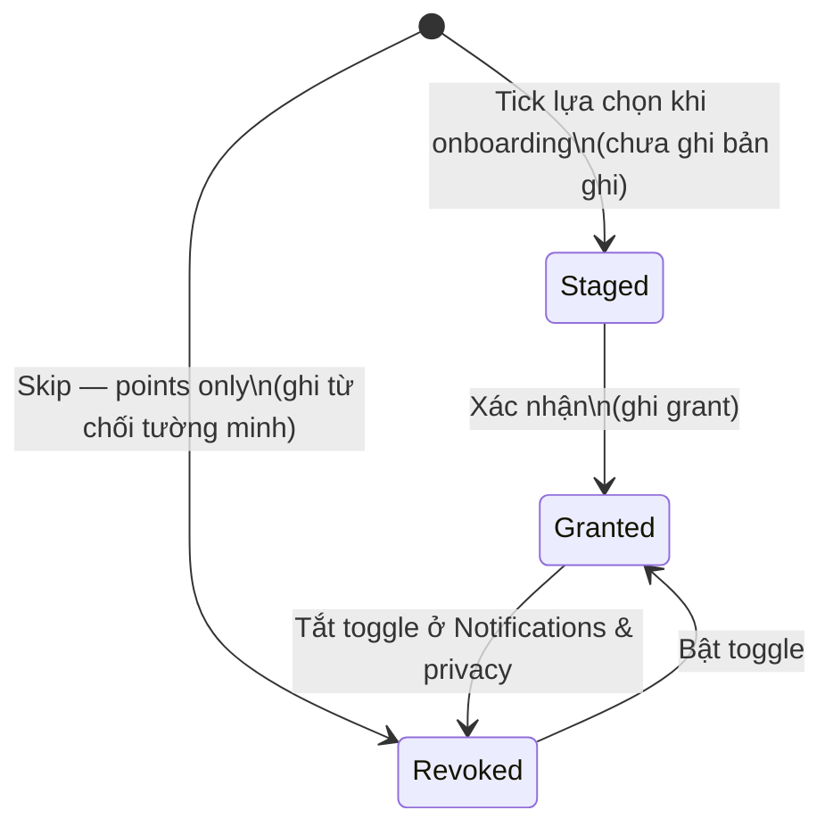
```mermaid
stateDiagram-v2
    [*] --> Staged : Tick lựa chọn khi onboarding\n(chưa ghi bản ghi)
    Staged --> Granted : Xác nhận\n(ghi grant)
    [*] --> Revoked : Skip — points only\n(ghi từ chối tường minh)
    Granted --> Revoked : Tắt toggle ở Notifications & privacy
    Revoked --> Granted : Bật toggle
```

---

## Business Rules

### Nguyên tắc tiền

- **Rule 1 — Nexora không giữ tiền.** Mọi giao dịch (tip, direct pay, checkout) là chuyển khoản **ngoài hệ thống** qua Zelle / Venmo / Cash App / Apple Cash / PayPal / VLinkPay. App chỉ ghi nhận việc khách **khẳng định** đã chuyển. Không khẳng định → không gửi được.
- **Rule 2 — Phí nền tảng bằng $0.** Tiệm nhận đúng số tiền khách chuyển.
- **Rule 3 — Số tiền tối thiểu là $1**, tối đa 2 chữ số thập phân. Với tip chia nhiều người: **tối thiểu $1 mỗi người**.
- **Rule 4 — Không có hạn mức trên.** Không có trần số tiền, không có giới hạn theo ngày hay theo tần suất.
- **Rule 5 — Định tuyến tip theo số người nhận.** 1 thợ → tiền vào tài khoản **riêng của thợ**. 2+ thợ → **một** chuyển khoản vào tài khoản **chung của tiệm**, tiệm chia lại. Tiệm chưa có tài khoản chung thì **không tip nhiều thợ được**.
- **Rule 6 — Chia đều không mất xu.** Phần lẻ được rải 1 xu cho từng người đầu danh sách.
- **Rule 7 — Chống tính tiền hai lần.** Mỗi lần gửi mang một mã yêu cầu và một "vân tay" nội dung. Bấm hai lần → trả về giao dịch cũ. Mã cũ nhưng nội dung khác → **từ chối**.
- **Rule 8 — Khóa phiên bản tài khoản nhận tiền.** Nếu tiệm đổi tài khoản nhận tiền giữa chừng, bằng chứng cũ **không** dùng để chứng minh cho khoản chuyển mới được.

### Nguyên tắc điểm

- **Rule 9 — Điểm giữ riêng theo từng tiệm.** Không có số dư toàn cục. Tier cũng tính theo điểm tại tiệm.
- **Rule 10 — Điểm chỉ đổi dịch vụ, không bao giờ ra tiền mặt.**
- **Rule 11 — Điểm luôn đi cùng bút toán.** Số dư và ledger không bao giờ được ghi tách rời. Số dư **không thể âm**.
- **Rule 12 — Điểm chỉ cộng khi bên nhận xác nhận.** Tip và Direct Pay ở trạng thái chờ hoặc bị từ chối → **0 điểm**. Một giao dịch đã xác nhận phải có **đúng** số bút toán quy định (tip: 1; direct pay: 2).
- **Rule 13 — Guest check-in chỉ có điểm treo.** Điểm chỉ vào ledger khi khách đăng nhập bằng cùng SĐT (gộp hành trình) hoặc khi claim tại checkout.
- **Rule 14 — Mức thưởng được chốt tại thời điểm phát sinh.** Booking bonus snapshot lúc gửi yêu cầu; tiệm đổi mức sau không ảnh hưởng yêu cầu cũ.
- **Rule 15 — Review được +15 điểm ở mọi mức sao.** Chia sẻ lên Google **cố ý không được thưởng** — tránh mua đánh giá tốt.
- **Rule 16 — Referral do tiệm tài trợ, đúng 50 điểm**, chỉ giải phóng sau lượt ghé **trả phí** đầu tiên của người được mời.

### Nguyên tắc reward

- **Rule 17 — Quy tắc alliance.** Reward đổi ở tiệm A dùng được ở tiệm B **chỉ khi** cả hai cùng một alliance. Khác liên minh → nút bị khóa với nhãn *"Different alliance"*.
- **Rule 18 — Đổi thưởng là không thể hoàn.** Không có trạng thái hủy/hoàn/hết hạn cho redemption.
- **Rule 19 — Một mã, một lượt.** Một redemption chỉ gắn được vào một check-in; mỗi check-in chỉ mang được một reward.
- **Rule 20 — Reward giá 0 điểm không mua được**, chỉ được trao (ví dụ phần thưởng referral).

### Nguyên tắc kiểm soát & quyền riêng tư

- **Rule 21 — Add-on phải được khách duyệt trước khi tính tiền**, và **cả hai** câu trả lời (đồng ý lẫn từ chối) đều cần xác nhận 4 số cuối SĐT.
- **Rule 22 — Đổi thợ chỉ được khi phiếu chưa mở**, và chỉ chọn trong danh sách tiệm đề xuất.
- **Rule 23 — Chống trùng check-in trong 120 phút.**
- **Rule 24 — QR phải hợp lệ tuyệt đối:** đúng tên miền `nexoratouch.com`, đúng dạng đường dẫn `/touch/{tiệm}/{trạm}`, không cổng, không fragment, không ký tự lạ, tối đa **một** tham số và phải là mã thợ thuộc đúng tiệm đó.
- **Rule 25 — Số điện thoại phải đúng 10 chữ số** sau chuẩn hóa (tự bỏ số `1` đầu nếu là 11 chữ số).
- **Rule 26 — OTP: cooldown 30 giây; sai 5 lần khóa 15 phút.**
- **Rule 27 — Không hiển thị số điện thoại đầy đủ** ở bất kỳ đâu trong danh sách referral: chỉ hiện tên hoặc `••• {4 số cuối}`.
- **Rule 28 — Không tự giới thiệu chính mình**, kiểm tra hai lần (lúc tạo và lúc nạp lại dữ liệu).
- **Rule 29 — Phiếu của người khác hiển thị ẩn danh** (*"Completed service {index}"*), và phải nhập đúng 4 số cuối mới mở được.
- **Rule 30 — Tin giao dịch luôn được gửi**, nằm ngoài mô hình consent. Chỉ tin **marketing** cần đồng ý, và mặc định là **tắt** (opt-in).

> 💡 **Important:** Ba quy tắc có ảnh hưởng tiền trực tiếp cần nhấn mạnh với mọi bên: (1) **Nexora không giữ tiền và không xác minh thanh toán** — một người thật ở tiệm quyết định; (2) **điểm chỉ cộng sau xác nhận**, nên khách bị từ chối là mất điểm hoàn toàn cho lượt đó; (3) **đổi thưởng không thể hoàn**.

---

## Edge Cases & Exception Handling

| Scenario | What Happens | Who Resolves It |
| :--- | :--- | :--- |
| Khách bấm gửi tip/thanh toán hai lần | Trả về đúng giao dịch cũ, không tính tiền hai lần | Auto |
| Khách gửi lại với mã cũ nhưng số tiền khác | Từ chối hoàn toàn (`request mismatch`) | Auto |
| Khách khẳng định đã chuyển nhưng **không nộp ảnh** | Vẫn tạo được giao dịch chờ — ảnh là **tùy chọn** | Salon (xác nhận thủ công) |
| Bộ nhớ thiết bị đầy khi nộp proof checkout | Proof được gửi **không kèm ảnh**, khách được báo *"Proof was saved without the image because storage is full."* | Front Desk (phải hỏi khách trực tiếp) |
| Bộ nhớ đầy khi lưu Look có ảnh | Look lưu **không kèm ảnh**, khách được báo | Auto |
| Tiệm từ chối bằng chứng | 0 điểm; khách nộp bằng chứng mới, **không giới hạn số lần** | Customer |
| Khách muốn tip 2+ thợ nhưng tiệm chưa có tài khoản chung | **Chặn hoàn toàn** — *"This salon has not set up a payout account yet."* | Business Owner |
| Thợ được yêu cầu bận hoặc thiếu kỹ năng | Hiện danh sách thợ đề xuất + tùy chọn *"Any technician"*; hệ thống **không bao giờ** trả khách về đúng người vừa bị loại | Customer |
| Không thợ nào làm được **đủ** dịch vụ khách chọn | Tiệm không mở được phiếu; chỉ còn *"Ask Front Desk"* | Front Desk |
| Khách check-in lại trong 120 phút | Trả về đúng lượt cũ, không tạo lượt thứ hai | Auto |
| Khách bấm Check In Now khi chưa báo Arrived | Nút **không hiện** | Customer |
| Khách đã check-in rồi | Thẻ lịch hẹn ở Home **ẩn hoàn toàn**; thẻ "đang được phục vụ" thay thế | Auto |
| Không đủ điểm đổi reward | Nút khóa, hiện *"{n} more"* | Customer |
| Reward thuộc liên minh khác | Nút khóa, hiện *"Different alliance"* | Customer |
| Tiệm đổi giá một reward đã có người đổi | Redemption cũ **và bút toán của nó bị xóa** khi nạp lại — lịch sử điểm thay đổi âm thầm | ⚠️ Cần Business Owner cân nhắc trước khi đổi giá |
| Khách chưa đăng nhập nhưng đã ghé nhiều lần | Điểm treo lại; đăng nhập bằng cùng SĐT sẽ **tự gộp** toàn bộ | Auto |
| Khách nhập sai OTP 5 lần | Khóa 15 phút | Customer (chờ) |
| Khách sai OTP nhiều lần rồi bấm Resend | Bộ đếm sai **bị reset về 0** — khóa 5 lần **không chặn được** đường này | ⚠️ Cần khắc phục (xem Known Gaps) |
| Dữ liệu lưu trữ bị hỏng | Bản hỏng được **giữ lại để điều tra** trước khi tạo state mới; chỉ xóa chọn lọc, giữ nguyên consent/referral/ledger | Auto |
| Mất mạng khi check-in | Check-in vào hàng đợi, tự gửi lại khi có mạng — *"Weak connection — check-in queued for retry."* | Auto (**chỉ check-in** được xếp hàng đợi) |
| Khách chia sẻ link giới thiệu thất bại | Hiện link dạng chỉ-đọc để copy tay | Customer |

---

## Frequently Asked Questions

**Q: Nexora có giữ tiền của khách không?**
A: Không, tuyệt đối không. Mọi khoản tiền đi thẳng từ khách tới thợ hoặc tới tiệm qua ứng dụng bên ngoài (Zelle, Venmo, Cash App, Apple Cash, PayPal, VLinkPay). Nexora chỉ ghi lại việc khách nói rằng đã chuyển, và giữ sổ điểm. Phí nền tảng vì thế là $0.00.

**Q: Ai quyết định khách có được cộng điểm hay không?**
A: Người thật tại tiệm. Không có OCR, không có đối soát tự động cho bằng chứng tip và thanh toán. Nhân viên nhìn ảnh (nếu có) và tự đối chiếu với tài khoản của mình rồi bấm xác nhận hoặc từ chối. *(Lưu ý: OCR có được dùng trong app, nhưng chỉ ở tính năng quét hóa đơn để điền sẵn một Look — hoàn toàn không liên quan tới xác minh thanh toán.)*

**Q: Điểm của tôi ở tiệm này có tiêu được ở tiệm khác không?**
A: Điểm thì không — mỗi tiệm giữ số dư riêng. Nhưng **reward** thì có: một reward đổi bằng điểm tại tiệm A có thể được tiệm B chấp nhận, **miễn là hai tiệm cùng một alliance**.

**Q: Tôi tip cho 3 thợ thì phải chuyển khoản 3 lần à?**
A: Không. Khách chỉ thực hiện **một** chuyển khoản duy nhất vào tài khoản chung của tiệm, và tiệm chia lại cho từng thợ. Chỉ khi tip cho **đúng một** thợ thì tiền mới vào thẳng tài khoản riêng của thợ đó.

**Q: Tôi chưa có tài khoản, check-in rồi thì có mất điểm không?**
A: Không. Điểm được giữ ở trạng thái treo gắn với số điện thoại. Khi khách đăng nhập bằng đúng số đó, toàn bộ điểm của các lượt ghé trước sẽ tự động được gộp vào tài khoản.

**Q: Đánh giá 1 sao thì có bị mất 15 điểm không?**
A: Không. 15 điểm được cộng ở **mọi mức sao** — đây là chủ ý để khách phản hồi thật lòng. Ngược lại, chia sẻ lên Google **cố ý không được thưởng điểm** để tránh mua đánh giá tốt.

**Q: Đổi nhầm reward thì hoàn điểm được không?**
A: Không. Cảnh báo *"This action cannot be undone."* là đúng nghĩa đen — hệ thống không có trạng thái hủy, hoàn hay hết hạn cho một redemption đã tạo. Support cần được huấn luyện để trả lời dứt khoát việc này.

**Q: Thợ có thể tự thêm dịch vụ vào phiếu của tôi không?**
A: Không. Thợ chỉ **đề xuất**; add-on chỉ được tính tiền sau khi khách bấm Accept **và** nhập đúng 4 số cuối số điện thoại. Cả câu trả lời từ chối cũng cần 4 số cuối, vì cả hai lựa chọn đều thay đổi số tiền tiệm sẽ tính.

**Q: Tại sao nút Check In Now không hiện dù tôi đã có lịch hẹn?**
A: Vì khách chưa bấm *"I've Arrived"*. Check-in chỉ mở khóa khi khách đã báo có mặt tại tiệm.

**Q: Bằng chứng của tôi bị từ chối, tôi thử lại được mấy lần?**
A: Không giới hạn. Mỗi lần nộp lại tạo một bằng chứng mới và đưa giao dịch về trạng thái chờ. Lưu ý: một giao dịch đã bị từ chối **không thể** được xác nhận thẳng — tiệm buộc phải xác nhận trên bằng chứng mới mà họ đã thật sự xem.

**Q: Dữ liệu của tôi lưu ở đâu?**
A: Trên chính thiết bị của khách (bản prototype). *"NEXORA never sells your personal data."* Support cần biết: mất thiết bị hoặc xóa dữ liệu trình duyệt là **mất dữ liệu**, không khôi phục được.

---

## Known Gaps — Cần quyết định trước khi lên production

> Đây là những chỗ **copy hiển thị hứa nhiều hơn hệ thống thực làm**. Nếu tài liệu này được đọc như một bản đặc tả, đây là các hạng mục rủi ro cao nhất.

| # | Gap | Rủi ro | Đề xuất |
| :--- | :--- | :--- | :--- |
| 1 | Màn onboarding ghi *"Up to 4 marketing messages per month"* nhưng **không có bộ đếm hay chốt chặn nào** | Tuân thủ | Hoặc triển khai trần gửi thật, hoặc bỏ câu này |
| 2 | Ghi *"STOP/HELP supported"* nhưng **không có xử lý từ khóa** | Tuân thủ (cao) | Bắt buộc triển khai trước khi gửi SMS thật |
| 3 | **Không có quiet hours**, không có thông báo cước phí, không có link Terms/Privacy trong luồng consent | Tuân thủ | Bổ sung |
| 4 | Consent ghi method `sms_y` như thể khách đã nhắn "Y", nhưng **không có vòng SMS thật** | Tuân thủ (bằng chứng đồng ý không có thật) | Triển khai double opt-in thật hoặc đổi nhãn method |
| 5 | Profile quảng cáo *"Give 100 points, earn 50"* nhưng code **chỉ cộng 50 cho người mời**, không có 100 điểm cho người được mời | Sai lệch kỳ vọng khách | Chốt lại chính sách rồi sửa một trong hai |
| 6 | Bấm *"Resend code"* **reset bộ đếm sai OTP về 0** | Bảo mật — khóa 5 lần bị vô hiệu | Đếm số lần sai độc lập với số lần gửi |
| 7 | Nút *"Full history"* ở Wallet mở màn lịch sử **lọc theo một tiệm**, không phải toàn bộ | Nhãn sai chức năng | Đổi nhãn hoặc làm lịch sử toàn cục |
| 8 | Bút toán loại *Referral* **thiếu nhãn**, hiển thị thành *"Point activity"* | Khách không hiểu điểm từ đâu | Bổ sung nhãn |
| 9 | Màn thêm Look ghi *"JPG or PNG, up to 10 MB"* nhưng chỉ nhận **JPEG ≈1.1 MB**; ảnh khác bị **âm thầm bỏ** | Khách mất ảnh không báo lỗi | Sửa nhãn và báo lỗi tường minh |
| 10 | `expiringPoints` **chỉ hiển thị**, không có cơ chế thật sự trừ điểm hết hạn | Nếu bật hạn điểm sẽ lệch sổ | Quyết định có làm hạn điểm hay không |
| 11 | Không tồn tại luồng **hủy hoặc đổi lịch** booking | Thiếu nghiệp vụ cơ bản | Bổ sung trạng thái `Cancelled` |
| 12 | Hai hệ thống thanh toán song song (Direct Pay và Guest Checkout) có **người xác minh khác nhau, mô hình điểm khác nhau, cách thử lại khác nhau** | Support khó tư vấn, khách khó hiểu | Thống nhất hoặc tách bạch rõ trong tài liệu vận hành |
| 13 | Đổi giá một reward khiến **redemption cũ và bút toán bị xóa** khi nạp lại | Lịch sử điểm của khách thay đổi âm thầm | Giữ snapshot reward theo redemption |
| 14 | `pushPermission` tồn tại trong dữ liệu nhưng **không bao giờ được xin quyền thật** | Thông báo đẩy không hoạt động | Triển khai hoặc gỡ |

---

**Recommended save path:** `docs/business/customer-rewards-app.md`
