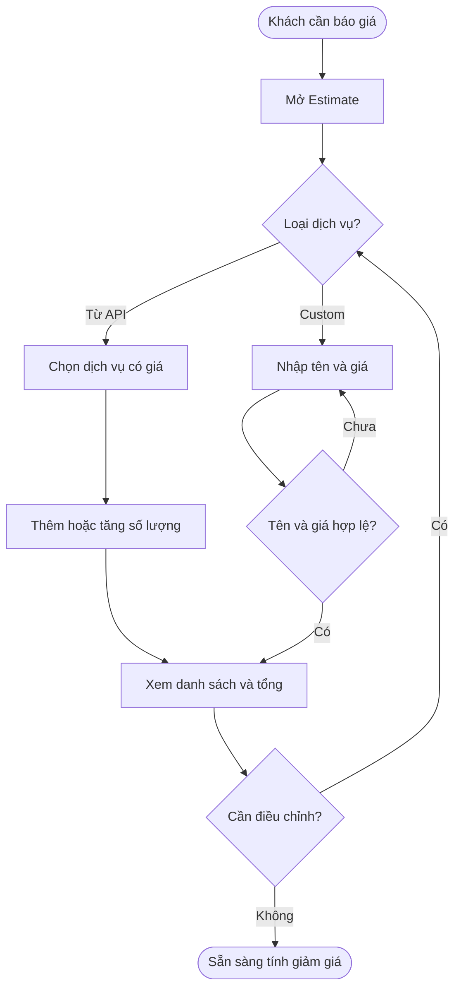
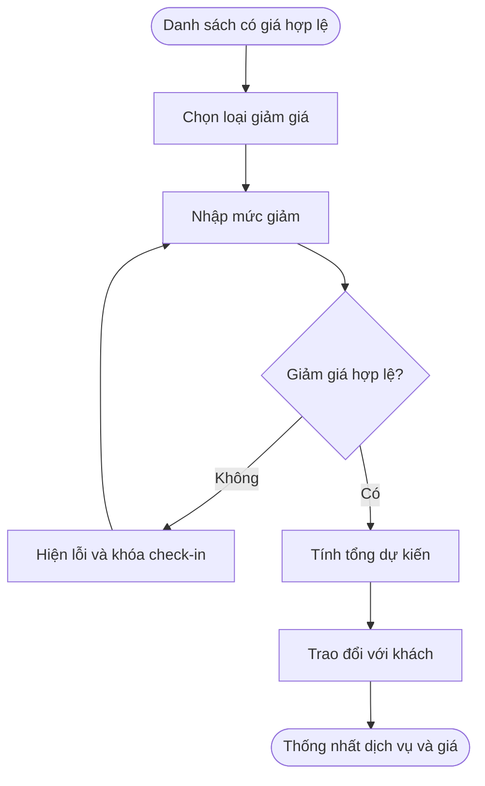
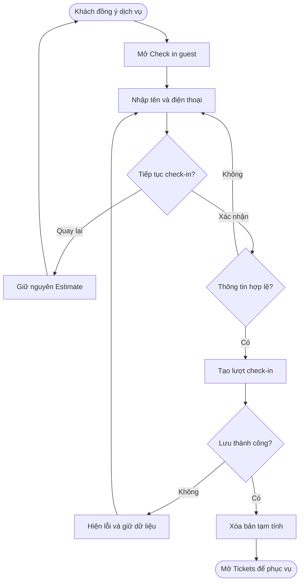
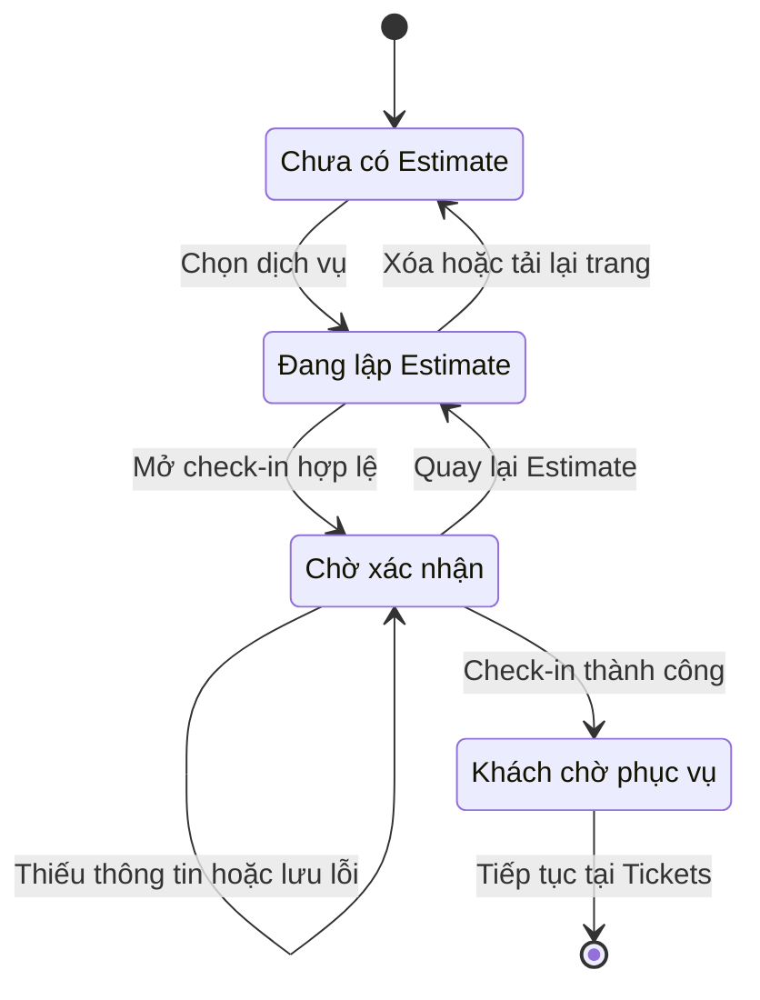

## POS — Front Desk → Estimate

**Last Updated:** 2026-09-11

**Audience:** Product Owner, BA, QA, nhân viên Front Desk, quản lý salon

**Status:** Draft

### Overview

Front Desk sử dụng **Estimate** để tư vấn dịch vụ và cho khách xem tổng tiền dự kiến trước khi check-in. Nhân viên chọn dịch vụ có giá sẵn từ API dịch vụ hoặc thêm dịch vụ custom bằng tên và giá, áp dụng giảm giá chung và chuyển danh sách đã thống nhất thành một lượt check-in để tiếp tục phục vụ tại Tickets.

**Vị trí:** POS → Front Desk → Estimate.

**Trình bày:** Services dùng màu sắc, nền và viền đồng bộ với phần Edit của Tickets. Your estimate phân biệt rõ tên dịch vụ, đơn giá và số lượng; nhóm giảm giá riêng, nhấn mạnh Estimated total và nút check-in. Khi đủ rộng, phần giảm giá và tổng tiền nằm cạnh nhau; trên màn hẹp, hai phần xếp dọc.

Tài liệu mô tả yêu cầu nghiệp vụ của Estimate. **Đối chiếu triển khai:** bản HTML hiện lấy danh mục từ dữ liệu salon cục bộ, chưa tích hợp API dịch vụ và chưa có thao tác thêm dịch vụ custom. Cơ chế nhập giá cho dịch vụ danh mục thiếu giá trong HTML hiện tại không phải yêu cầu nghiệp vụ; cần thay bằng luồng thêm custom bên dưới. Estimate chỉ tính tiền dịch vụ; chưa bao gồm tax và tip. Việc xác nhận check-in không thu tiền. Giảm giá trong Estimate được lưu để tham chiếu và cần xác nhận lại tại checkout.

### Key Concepts

| Thuật ngữ | Ý nghĩa |
| :--- | :--- |
| Service Estimate | Bản tạm tính cho các dịch vụ khách đang cân nhắc hoặc đã chọn. |
| Dịch vụ từ API | Dịch vụ trong danh mục, luôn có tên và giá sẵn từ API dịch vụ; nhân viên chọn để thêm vào Estimate. |
| Dịch vụ custom | Dịch vụ do Front Desk thêm trực tiếp vào Estimate bằng tên dịch vụ và giá. |
| Quantity (Số lượng) | Số lần sử dụng dịch vụ trên một dòng Estimate; là số nguyên từ 1 trở lên, có thể sửa trực tiếp. |
| Subtotal | Tổng đơn giá nhân số lượng của các dòng dịch vụ, trước giảm giá. |
| Discount on all services | Giảm giá chung cho toàn bộ Estimate, theo tỷ lệ % hoặc số tiền USD. |
| Estimated total | Subtotal trừ Discount; không nhỏ hơn 0. |
| Check in with these services | Chuyển thông tin khách và danh sách dịch vụ trong Estimate thành lượt check-in. |
| Tickets | Danh sách khách đang chờ hoặc đang được phục vụ tại Front Desk. |

### User Roles

| Vai trò | Trách nhiệm |
| :--- | :--- |
| Nhân viên Front Desk | Tư vấn, lập và điều chỉnh Estimate; nhập thông tin khách; xác nhận check-in. |
| Khách hàng | Xem giá dự kiến, thống nhất dịch vụ và cung cấp tên, số điện thoại. |
| Quản lý salon | Duy trì danh mục dịch vụ đang hoạt động, giá và thời lượng sử dụng khi tư vấn. |
| QA | Kiểm tra các tiêu chí nghiệm thu, phép tính và chuyển tiếp sang Tickets. |

### End-to-End Workflows

#### Workflow 1: Chọn dịch vụ và lập Estimate

**Primary Actor:** Nhân viên Front Desk.

**Trigger:** Khách muốn biết chi phí dịch vụ trước khi check-in.

**Outcome:** Có danh sách dịch vụ với giá hợp lệ để tính tổng dự kiến.

**User Stories:**

- **US-FDE-01 — Tìm và chọn dịch vụ:** Là nhân viên Front Desk, tôi muốn tìm dịch vụ theo tên và xem giá, thời lượng trước khi thêm vào Estimate, để tư vấn nhanh cho khách.
- **US-FDE-02 — Thêm dịch vụ custom:** Là nhân viên Front Desk, tôi muốn thêm dịch vụ custom bằng tên dịch vụ và giá, để báo giá cho nhu cầu ngoài danh mục dịch vụ từ API.
- **US-FDE-03 — Điều chỉnh danh sách:** Là nhân viên Front Desk, tôi muốn sửa số lượng, bỏ dịch vụ khách không chọn hoặc xóa toàn bộ Estimate, để báo giá phản ánh đúng nhu cầu hiện tại.

| Bước | Người thực hiện | Thao tác | Phản hồi hệ thống | Ghi chú |
| :--- | :--- | :--- | :--- | :--- |
| 1 | Front Desk | Mở Estimate | Hiện danh mục dịch vụ, ô tìm kiếm và Your estimate | Lấy từ API dịch vụ; chỉ hiển thị dịch vụ đang hoạt động, luôn có giá sẵn. |
| 2 | Front Desk | Nhập tên vào Search services | Lọc danh sách theo tên, không phân biệt hoa/thường | Không có kết quả thì hiện No services found. |
| 3 | Front Desk | Chọn dịch vụ | Thêm dòng mới hoặc tăng số lượng của dòng đã có, cập nhật tổng | Cùng dịch vụ và đơn giá được gộp thành một dòng; chọn 4 lần hiển thị Quantity = 4. |
| 4 | Front Desk | Nếu cần, thêm dịch vụ custom bằng tên và giá | Thêm dòng custom và tính lại tổng khi tên, giá hợp lệ | Không yêu cầu nhập thêm thông tin dịch vụ khác; không sửa giá dịch vụ từ API tại Estimate. |
| 5 | Front Desk | Sửa Quantity, bỏ một dòng dịch vụ hoặc Clear estimate | Cập nhật danh sách và tổng | Xóa hết dịch vụ sẽ khóa nút check-in. |

**Acceptance Criteria:**

| ID | User story | Given — Điều kiện | When — Thao tác | Then — Kết quả |
| :--- | :--- | :--- | :--- | :--- |
| AC-FDE-01 | US-FDE-01 | Đang ở Front Desk | Mở Estimate | Hiện Services, Your estimate, Discount on all services, Subtotal, Discount, Estimated total và nút check-in. |
| AC-FDE-02 | US-FDE-01 | Danh mục có dịch vụ hoạt động và ngừng hoạt động | Tìm theo một phần tên | Chỉ hiện dịch vụ hoạt động khớp tên; không phân biệt hoa/thường; hiển thị tên, thời lượng và giá sẵn từ API; không yêu cầu nhập giá cho dịch vụ danh mục. |
| AC-FDE-03 | US-FDE-01 | Một dịch vụ đã được chọn | Xem lại danh mục | Nút thêm vẫn khả dụng; mỗi lần bấm tăng Quantity thêm 1 trên dòng cùng dịch vụ và đơn giá. Chọn 4 lần chỉ hiện một dòng với Quantity = 4; tổng tính theo đơn giá nhân số lượng. |
| AC-FDE-04 | US-FDE-02 | Khách cần dịch vụ custom | Nhập tên dịch vụ và giá, xác nhận thêm | Thêm một dòng custom với đúng tên và giá đã nhập; cộng giá vào Subtotal và áp dụng giảm giá chung. |
| AC-FDE-05 | US-FDE-02 | Đang thêm dịch vụ custom | Để tên trống hoặc chỉ có khoảng trắng; để giá trống, nhập giá âm hoặc không hợp lệ | Không thêm dòng custom; yêu cầu sửa tên hoặc giá. Giá là số không âm, gồm 0. |
| AC-FDE-06 | US-FDE-03 | Có nhiều dịch vụ đã chọn | Bấm nút bỏ của một dòng | Bỏ toàn bộ số lượng của dòng đó; giữ các dòng khác và tính lại tổng. Muốn bớt một lần dịch vụ thì giảm Quantity, không bấm nút xóa. |
| AC-FDE-07 | US-FDE-03 | Có Estimate đang lập | Bấm Clear estimate | Xóa danh sách, đưa giá trị giảm giá về 0; giữ loại giảm giá và từ khóa tìm kiếm hiện tại; nút check-in bị khóa. |

#### Workflow 2: Tính giảm giá và thống nhất giá dự kiến

**Primary Actor:** Nhân viên Front Desk.

**Trigger:** Danh sách dịch vụ đã có giá hợp lệ.

**Outcome:** Khách xem được tổng dự kiến sau giảm giá và hiểu phạm vi của giá báo.

**User Stories:**

- **US-FDE-04 — Áp dụng giảm giá chung:** Là nhân viên Front Desk, tôi muốn chọn giảm giá theo % hoặc số tiền và xem tổng cập nhật ngay, để trao đổi với khách về giá dự kiến.
- **US-FDE-05 — Giữ báo giá khi chuyển tab:** Là nhân viên Front Desk, tôi muốn giữ các dịch vụ và giảm giá khi chuyển giữa Estimate và Appointments trong cùng trang, để tiếp tục tư vấn mà không phải nhập lại.

| Bước | Người thực hiện | Thao tác | Phản hồi hệ thống | Ghi chú |
| :--- | :--- | :--- | :--- | :--- |
| 1 | Front Desk | Chọn Percentage hoặc Amount | Đổi đơn vị nhập và nhãn các mức chọn nhanh | Giữ số đang nhập, tính theo đơn vị mới. |
| 2 | Front Desk | Nhập giá trị hoặc chọn mức 0, 5, 10, 15, 20 | Cập nhật Subtotal, Discount và Estimated total | Mức chọn nhanh dùng % hoặc USD tùy loại. |
| 3 | Front Desk | Trao đổi tổng tiền với khách | Hiển thị lưu ý chưa gồm tax/tip và xác nhận giảm giá tại checkout | Không phát sinh giao dịch. |
| 4 | Front Desk | Chuyển sang Appointments rồi quay lại Estimate | Giữ dịch vụ và giảm giá đang chọn | Chỉ áp dụng khi chuyển tab trong cùng trang đang mở. |

**Acceptance Criteria:**

| ID | User story | Given — Điều kiện | When — Thao tác | Then — Kết quả |
| :--- | :--- | :--- | :--- | :--- |
| AC-FDE-08 | US-FDE-04 | Subtotal là $52.00 | Chọn giảm 20% | Discount là $10.40; Estimated total là $41.60. |
| AC-FDE-09 | US-FDE-04 | Subtotal là $52.00 | Chọn Amount và nhập 15 | Discount là $15.00; Estimated total là $37.00. |
| AC-FDE-10 | US-FDE-04 | Subtotal là $5.00 | Nhập giảm cố định $20.00 | Chỉ trừ $5.00; Estimated total là $0.00. |
| AC-FDE-11 | US-FDE-04 | Đang nhập giảm giá | Nhập số âm, để trống, giá trị không hợp lệ hoặc tỷ lệ trên 100% | Hiện lỗi; tổng hiện dấu “—”; nút check-in bị khóa. |
| AC-FDE-12 | US-FDE-04 | Subtotal là $19.99 | Chọn giảm 15% | Discount làm tròn thành $3.00; Estimated total là $16.99. |
| AC-FDE-13 | US-FDE-04 | Đang dùng Percentage với giá trị 10 | Đổi sang Amount | Giá trị vẫn là 10, được hiểu là $10; các nút chọn nhanh đổi sang đơn vị USD. |
| AC-FDE-14 | US-FDE-05 | Đang có Estimate | Chuyển sang Appointments và quay lại bằng các tab trong trang | Các dịch vụ, giá nhập và giảm giá vẫn còn. Tải lại trang không khôi phục bản nháp Estimate. |

#### Workflow 3: Check-in từ Estimate và tiếp tục tại Tickets

**Primary Actor:** Nhân viên Front Desk.

**Trigger:** Khách đồng ý sử dụng các dịch vụ trong Estimate hợp lệ.

**Outcome:** Tạo lượt check-in chứa các dịch vụ và thông tin báo giá; khách xuất hiện tại Tickets để tiếp tục phân công thợ.

**User Stories:**

- **US-FDE-06 — Check-in bằng dịch vụ đã chọn:** Là nhân viên Front Desk, tôi muốn nhập tên, số điện thoại và check-in bằng danh sách trong Estimate, để không phải chọn lại dịch vụ khi tiếp nhận khách.
- **US-FDE-07 — Quay lại hoặc thử lại:** Là nhân viên Front Desk, tôi muốn quay lại sửa Estimate trước khi xác nhận và giữ dữ liệu khi check-in thất bại, để có thể điều chỉnh hoặc thử lại.
- **US-FDE-08 — Tiếp tục phục vụ tại Tickets:** Là nhân viên Front Desk, tôi muốn thấy khách vừa check-in cùng dịch vụ và ghi chú báo giá tại Tickets, để phân công thợ và đối chiếu giá khi checkout.

| Bước | Người thực hiện | Thao tác | Phản hồi hệ thống | Ghi chú |
| :--- | :--- | :--- | :--- | :--- |
| 1 | Front Desk | Bấm Check in with these services | Mở Check in guest, hiển thị tên dịch vụ và tổng dự kiến | Chỉ mở khi Estimate hợp lệ. |
| 2 | Front Desk | Nhập Customer name và Phone | Nhận thông tin khách | Hai trường bắt buộc; không tự tra cứu hoặc gộp khách theo số điện thoại trong màn này. |
| 3 | Front Desk | Bấm Back to estimate nếu cần sửa | Đóng hộp thoại, giữ Estimate | Chưa tạo lượt check-in. |
| 4 | Front Desk | Bấm Confirm check-in | Kiểm tra thông tin và tạo lượt check-in | Lưu dịch vụ, giá và thông tin giảm giá để tham chiếu. |
| 5 | Hệ thống | Check-in thành công | Thông báo thành công, đóng hộp thoại, xóa dịch vụ đã chọn và đưa giá trị giảm giá về 0 | Nhân viên mở Tickets để tiếp tục; không tự chuyển trang. |
| 6 | Front Desk | Mở Tickets | Hiện khách ở trạng thái Waiting, danh sách dịch vụ và ghi chú Estimate | Dịch vụ chưa được phân công thợ; tiếp tục Assign Tech. |

**Acceptance Criteria:**

| ID | User story | Given — Điều kiện | When — Thao tác | Then — Kết quả |
| :--- | :--- | :--- | :--- | :--- |
| AC-FDE-15 | US-FDE-06 | Chưa chọn dịch vụ hoặc còn giá/giảm giá không hợp lệ | Xem nút check-in | Nút bị khóa; chỉ được check-in khi có ít nhất một dịch vụ và các giá trị hợp lệ. |
| AC-FDE-16 | US-FDE-06 | Estimate hợp lệ | Mở Check in guest | Hiện tên dịch vụ kèm số lượng, tổng tiền, Customer name và Phone. |
| AC-FDE-17 | US-FDE-06 | Thiếu tên hoặc số điện thoại, kể cả chỉ có khoảng trắng | Xác nhận check-in | Không tạo lượt check-in; yêu cầu nhập đầy đủ thông tin. |
| AC-FDE-18 | US-FDE-06 | Đã nhập đủ thông tin hợp lệ | Xác nhận thành công | Tạo lượt check-in với đầy đủ các dòng dịch vụ và giá đã chọn, gồm dịch vụ từ API, tên và giá dịch vụ custom, kể cả các dòng cùng dịch vụ; mỗi đơn vị số lượng được lưu thành một lượt dịch vụ riêng; lưu Subtotal, Discount, Estimated total, loại và mức giảm; ghi nhận thời điểm check-in. |
| AC-FDE-19 | US-FDE-07 | Hộp thoại check-in đang mở | Bấm Back to estimate | Không tạo lượt check-in; giữ danh sách và giảm giá để chỉnh sửa. |
| AC-FDE-20 | US-FDE-07 | Thao tác tạo check-in trả lỗi | Xác nhận | Hiện lỗi, giữ hộp thoại, thông tin khách và Estimate để thử lại. |
| AC-FDE-21 | US-FDE-06 | Đã xác nhận check-in thành công | Gửi lại thao tác xác nhận từ hộp thoại vừa đóng | Không tạo thêm lượt từ lần xác nhận đó; form đã được đóng và đặt lại. Đây không phải quy tắc chống trùng khách theo số điện thoại. |
| AC-FDE-22 | US-FDE-08 | Check-in từ Estimate thành công | Mở Tickets | Khách hiển thị ở Waiting, chưa có thợ; có dịch vụ và ghi chú tổng dự kiến, mức giảm, chưa gồm tax/tip và yêu cầu xác nhận giảm giá tại checkout. |

### System Configuration & Administration

- **US-FDE-09 — Sử dụng danh mục hiện hành:** Là quản lý salon, tôi muốn Estimate lấy dịch vụ đang hoạt động cùng giá sẵn từ API dịch vụ, để Front Desk tư vấn theo cấu hình dịch vụ hiện hành.
- **AC-FDE-23:** Khi mở hoặc quay lại Estimate, danh mục được làm mới từ API dịch vụ; dịch vụ ngừng hoạt động không xuất hiện để chọn mới. Giá của các dòng đã chọn không tự cập nhật theo thay đổi danh mục.
- Estimate chưa có màn hình cấu hình hoặc phân quyền giảm giá riêng. Không có bước duyệt giảm giá của quản lý trong luồng HTML này.

### State Lifecycle

Các trạng thái dưới đây mô tả tiến trình thao tác, không phải danh sách trạng thái báo giá được lưu độc lập. Sau check-in, dữ liệu báo giá đi cùng lượt tiếp nhận khách.

| Trạng thái hiện tại | Sự kiện | Trạng thái mới | Ghi chú |
| :--- | :--- | :--- | :--- |
| Chưa có Estimate | Chọn dịch vụ | Đang lập Estimate | Các dòng đã thêm có giá; giảm giá có thể chưa hợp lệ. |
| Đang lập Estimate | Dữ liệu hợp lệ, mở check-in | Chờ xác nhận | Chưa tạo lượt tiếp nhận. |
| Chờ xác nhận | Back to estimate | Đang lập Estimate | Giữ nội dung. |
| Chờ xác nhận | Thông tin thiếu hoặc lưu thất bại | Chờ xác nhận | Hiển thị lỗi, cho phép sửa và thử lại. |
| Chờ xác nhận | Check-in thành công | Khách chờ phục vụ | Khách xuất hiện tại Tickets; Estimate trên màn hình được xóa. |
| Đang lập Estimate | Clear estimate hoặc tải lại trang | Chưa có Estimate | Bản nháp chưa có cơ chế lưu riêng. |

### Business Rules

1. Một Estimate cần ít nhất một dòng dịch vụ để check-in. Cùng một dịch vụ có thể được thêm nhiều lần; cùng dịch vụ và đơn giá hiển thị một dòng với cột Quantity. Nhân viên có thể sửa Quantity bằng số nguyên từ 1 trở lên; nút xóa bỏ cả dòng và toàn bộ số lượng. Khác đơn giá thì giữ dòng riêng. Khi check-in, mỗi đơn vị số lượng tạo một lượt dịch vụ riêng để tiếp tục phân công thợ.
2. Dịch vụ danh mục luôn lấy từ API dịch vụ và có giá sẵn; không nhập hoặc sửa giá các dịch vụ này tại Estimate. Dịch vụ custom chỉ cần tên dịch vụ và giá: tên không được trống, giá là số không âm. Tên và giá custom được giữ lại khi check-in.
3. Giảm giá áp dụng chung cho các dịch vụ; tỷ lệ từ 0 đến 100%, số tiền cố định không âm. Số tiền thực giảm không vượt Subtotal.
4. Phép tính dùng đơn vị cent: làm tròn từng đơn giá dịch vụ đến cent, nhân số lượng rồi cộng Subtotal, tính và làm tròn Discount, rồi trừ để ra Estimated total.
5. **Estimate và Confirm check-in không thu tiền. Tổng dự kiến chưa gồm tax/tip; giảm giá phải được xác nhận lại tại checkout, không tự áp dụng vào thanh toán chỉ vì đã lưu trong Estimate.**
6. Customer name và Phone là bắt buộc khi check-in. Màn Estimate chưa có tra cứu khách cũ, xác minh số điện thoại hoặc kiểm tra trùng lượt theo số điện thoại.
7. Check-in chưa phân công thợ; nhân viên tiếp tục xử lý tại Tickets. Chọn thợ, thanh toán và Split bill thuộc các luồng tiếp theo.
8. Chuyển tab Estimate ↔ Appointments trong cùng trang giữ bản nháp. Tải lại trang hoặc điều hướng sang trang khác không lưu bản nháp Estimate.
9. Clear estimate và check-in thành công đều xóa dịch vụ đã chọn, đặt giá trị giảm giá về 0; không đặt lại loại giảm giá hoặc từ khóa tìm kiếm.

### Edge Cases & Exception Handling

| Tình huống | Hành vi yêu cầu | Người xử lý |
| :--- | :--- | :--- |
| Không tìm thấy dịch vụ | Hiện No services found; giữ các dịch vụ đã chọn. | Front Desk sửa từ khóa. |
| Số lượng trống, không nguyên hoặc nhỏ hơn 1 | Hiện lỗi và khóa check-in đến khi nhập số lượng hợp lệ. | Front Desk. |
| Chưa có dịch vụ hoặc giảm giá không hợp lệ | Hiện lỗi, tổng hiện “—”, khóa check-in. | Front Desk bổ sung hoặc sửa dữ liệu. |
| Custom thiếu tên hoặc có giá không hợp lệ | Không thêm dòng custom cho đến khi nhập tên và giá hợp lệ. | Front Desk. |
| Thêm cùng một dịch vụ nhiều lần | Cùng dịch vụ và đơn giá hiển thị một dòng, tăng Quantity theo số lần thêm. Subtotal tính theo đơn giá nhân số lượng; xóa dòng bỏ toàn bộ số lượng trên dòng đó. | Front Desk. |
| Giảm cố định vượt tổng dịch vụ | Giới hạn tiền giảm bằng Subtotal; tổng dự kiến bằng 0. | Hệ thống. |
| Khách đổi ý trước xác nhận | Back to estimate giữ nội dung và không tạo lượt tiếp nhận. | Front Desk. |
| Check-in thất bại | Hiện thông báo lỗi; giữ thông tin để thử lại. | Front Desk kiểm tra thông báo và thử lại. |
| Cùng số điện thoại được dùng cho lượt khác | Luồng này không tự gộp lượt hoặc ngăn tạo lượt mới chỉ dựa trên số điện thoại. | Front Desk kiểm tra Tickets trước khi tạo thêm. |
| Danh mục đổi sau khi chọn dịch vụ | Làm mới danh mục không đổi giá của các dòng đã chọn. | Front Desk rà soát, bỏ và chọn lại nếu cần. |
| Tải lại trang khi đang tư vấn | Bản nháp Estimate không được khôi phục. | Front Desk lập lại Estimate. |

### Frequently Asked Questions

**Có cần nhập tên và số điện thoại trước khi báo giá không?**

Không. Chỉ bắt buộc khi xác nhận check-in.

**Có thể thêm nhiều lần cùng một dịch vụ không?**

Có. Chọn 4 lần cùng dịch vụ giá $22.00 sẽ hiện một dòng với Quantity = 4 và Subtotal $88.00. Sửa Quantity thành 3 thì Subtotal còn $66.00; giảm 20% còn $52.80. Khi check-in, hệ thống tạo đủ 3 lượt dịch vụ riêng. Nút xóa sẽ bỏ cả dòng, không chỉ giảm số lượng đi 1.

**Có thể sửa giá niêm yết không?**

Không. Dịch vụ từ API luôn có giá sẵn. Khi cần thêm dịch vụ custom, nhân viên nhập tên dịch vụ và giá; dòng custom được tính vào tổng và giảm giá chung như các dòng khác. Luồng thêm custom là yêu cầu cần triển khai trong bản HTML.

**Giảm giá đã báo có tự chuyển thành giảm giá khi thanh toán không?**

Không. Thông tin được lưu để đối chiếu; thu ngân cần xác nhận và áp dụng lại giảm giá phù hợp tại checkout.

**Sau khi check-in có tự mở Tickets không?**

Không. Hệ thống hiển thị thông báo thành công; Front Desk mở Tickets để tiếp tục.

### Related Features

- [POS — Trạng thái Appointment](appointment-status-summary.md).
- [POS — Appointment cần phân công](appointments-need-assignment.md).
- [Màn hình Front Desk](../../html/pages/pos-front-desk.html) — điểm vào Estimate.
- [Màn hình Tickets](../../html/pages/pos-front-desk-tickets.html) — tiếp tục phục vụ sau check-in.

**Nguồn đối chiếu nội bộ:** [Estimate](../../html/assets/pos-estimate.js), [tích hợp Front Desk](../../html/assets/front-desk-estimate.js), [Tickets](../../html/assets/pos-front-desk-tickets.js), [kiểm thử Estimate](../../html/assets/pos-estimate.test.cjs), [kiểm thử luồng Front Desk](../../html/pages/pos-front-desk-estimate.test.mjs).
