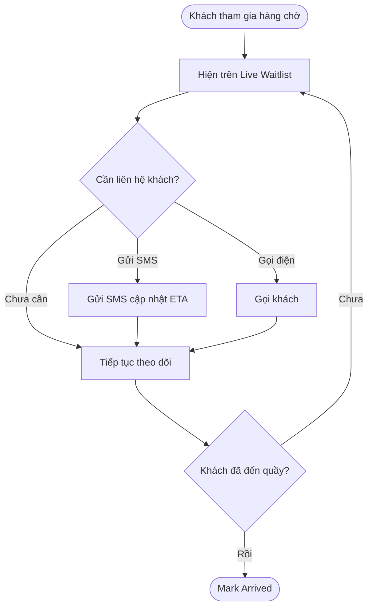
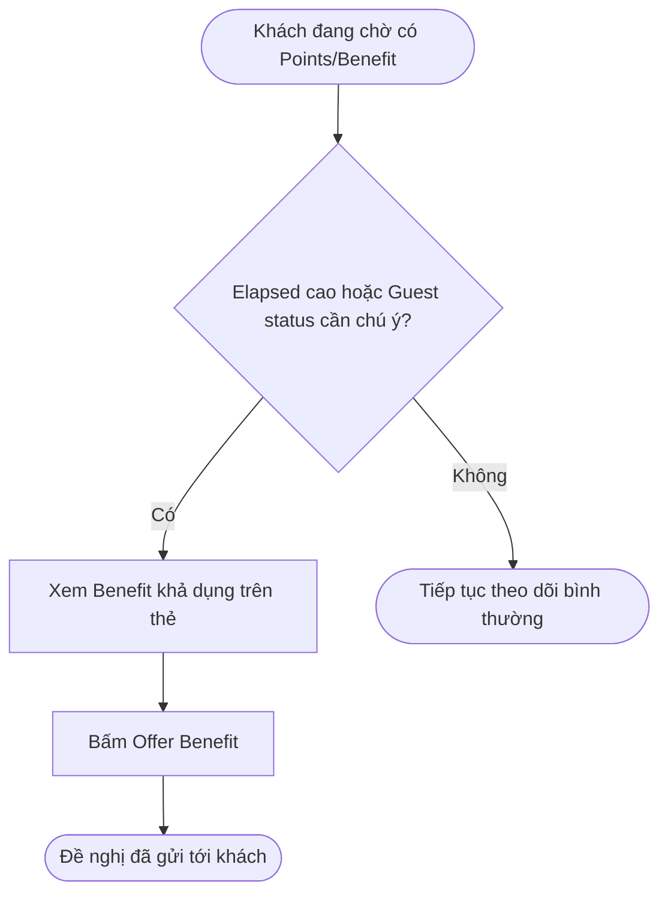
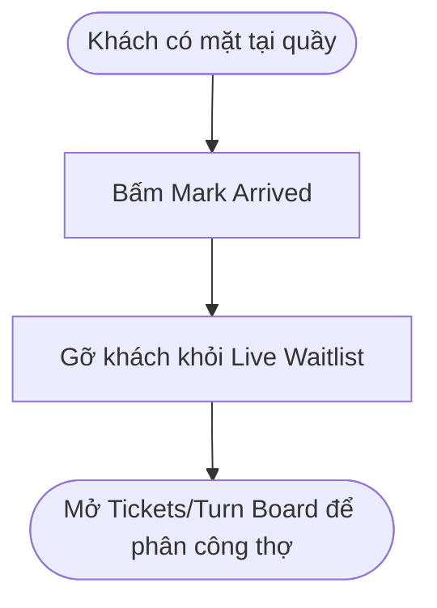
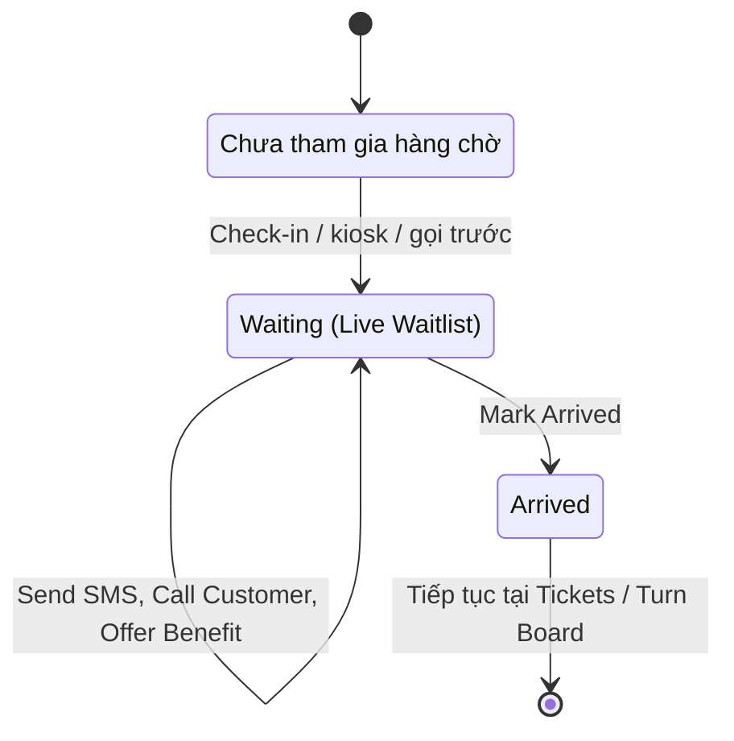

## POS — Front Desk → Live Waitlist

**Last Updated:** 2026-09-18

**Audience:** Product Owner, BA, QA, nhân viên Front Desk, quản lý salon

**Status:** Draft

### Overview

**Live Waitlist** là màn hình tổng quan thời gian thực cho các khách đã tham gia hàng chờ tại salon (qua Check-in, kiosk hoặc gọi trước) nhưng **chưa được xác nhận có mặt** tại quầy để bắt đầu dịch vụ. Nhân viên Front Desk xem nhanh dịch vụ khách chờ, trạng thái, thời gian chờ dự kiến (ETA), thời gian đã chờ (Elapsed), Points và Benefit khả dụng của khách để chủ động liên hệ, giữ chân khách có nguy cơ rời đi, và xác nhận khách khi họ đến quầy.

**Vị trí:** POS → Front Desk → Live Waitlist (tab cạnh Tickets).

**Giá trị nghiệp vụ:** giảm khách bỏ lượt (no-show) khi chờ lâu hoặc chờ ngoài tiệm, bằng cách cho nhân viên chủ động nhắn tin/gọi điện và đề nghị ưu đãi đúng lúc, thay vì chỉ đợi khách tự bước vào.

Tài liệu mô tả yêu cầu nghiệp vụ của Live Waitlist. **Đối chiếu triển khai:** bản HTML hiện dùng danh sách khách mẫu cố định (3 khách, không đổi khi tải lại trang), không đọc dữ liệu từ Check-in/Tickets thật và không có nguồn Points/Benefit thật. Send SMS, Call Customer và Offer Benefit chỉ hiển thị thông báo demo, không gửi tin nhắn hay đề nghị nào thật. Mark Arrived hiện chỉ gỡ khách khỏi danh sách hiển thị trên Live Waitlist, chưa cập nhật trạng thái Ticket hay đồng bộ với Tickets/Turn Board.

---

### Key Concepts

| Term | Definition |
| :--- | :--- |
| Live Waitlist | Danh sách khách đang chờ tại salon, cập nhật theo thời gian thực, hiển thị bên ngoài luồng bảng Tickets. |
| Waiting entry | Một dòng trên Live Waitlist, đại diện cho một khách đang chờ cùng dịch vụ, ETA, Elapsed, Points, Benefit của khách đó. |
| Guest status | Nhãn ngắn cho biết điều nhân viên cần biết ngay về khách: là khách quen (Returning), đang chờ ngoài tiệm (Waiting Outside), hay chưa phản hồi liên hệ trước đó (No Response). |
| ETA | Thời gian chờ dự kiến còn lại trước khi đến lượt (ví dụ "12–18 min"), hoặc "Ready soon" khi khách sắp được gọi. |
| Elapsed | Thời gian đã trôi qua kể từ khi khách tham gia hàng chờ. |
| Points | Số điểm thưởng hiện có của khách tại salon này, lấy theo sổ điểm trong Customer Rewards. |
| Benefit | Ưu đãi khách đủ điều kiện nhận tại lượt ghé này (ví dụ Birthday gift, $10 voucher, Member 10%, $5 reward, Wait Care eligible). |
| Offer Benefit | Thao tác nhân viên chủ động đề nghị một Benefit cho khách trong lúc chờ, thay vì để khách tự đổi. |
| Mark Arrived | Xác nhận khách đã có mặt tại quầy, sẵn sàng bắt đầu dịch vụ; đưa khách ra khỏi Live Waitlist. |

---

### User Roles

| Role | Responsibilities in this Feature |
| :--- | :--- |
| Nhân viên Front Desk | Theo dõi danh sách chờ, gửi SMS/gọi khách, đề nghị Benefit, xác nhận khách đã đến. |
| Khách hàng | Tham gia hàng chờ, nhận SMS/cuộc gọi cập nhật, nhận đề nghị Benefit, đến quầy khi sẵn sàng. |
| Quản lý salon | Theo dõi thời gian chờ trung bình và tỷ lệ khách rời hàng chờ; cấu hình Benefit áp dụng cho hàng chờ. |
| QA | Kiểm tra các tiêu chí nghiệm thu, đồng bộ dữ liệu với Check-in/Tickets và tính đúng của ETA/Elapsed. |

---

### End-to-End Workflows

#### Workflow 1: Theo dõi và liên hệ khách đang chờ

**Primary Actor:** Nhân viên Front Desk

**Trigger:** Có khách đã tham gia hàng chờ nhưng chưa được xác nhận có mặt.

**Outcome:** Nhân viên biết khách nào cần ưu tiên liên hệ, và đã liên hệ khi cần.

**User Stories:**

- **US-FDW-01 — Xem danh sách khách đang chờ:** Là nhân viên Front Desk, tôi muốn xem danh sách khách đang chờ kèm dịch vụ, Guest status, ETA và Elapsed, để ưu tiên chăm sóc khách chờ lâu hoặc chưa phản hồi trước.
- **US-FDW-02 — Gửi SMS cập nhật:** Là nhân viên Front Desk, tôi muốn gửi SMS cho khách ngay từ Live Waitlist, để báo thời gian chờ cập nhật mà không phải rời màn hình hoặc tra số điện thoại thủ công.
- **US-FDW-03 — Gọi khách:** Là nhân viên Front Desk, tôi muốn gọi trực tiếp cho khách có Guest status Waiting Outside hoặc No Response, để xác nhận khách còn muốn chờ hay đã đổi ý.

| Step | Who | Action | System Response | Notes |
| :--- | :--- | :--- | :--- | :--- |
| 1 | Front Desk | Mở Live Waitlist | Hiện danh sách khách đang chờ, mỗi khách một thẻ với tên, dịch vụ, Guest status, ETA, Elapsed, Points, Benefit | Danh sách rỗng hiện thông báo không có khách đang chờ. |
| 2 | Front Desk | Đọc Guest status và Elapsed của từng thẻ | Không đổi dữ liệu | Guest status và Elapsed giúp nhận diện khách cần ưu tiên. |
| 3 | Front Desk | Bấm Send SMS trên một thẻ | Gửi SMS cập nhật ETA cho khách, hiện xác nhận đã gửi | Không thay đổi vị trí hay Guest status của khách trên danh sách. |
| 4 | Front Desk | Bấm Call Customer trên một thẻ | Gọi số điện thoại của khách, hiện xác nhận đang gọi | Dùng khi Guest status là Waiting Outside hoặc No Response. |

**Acceptance Criteria:**

| ID | User story | Given — Điều kiện | When — Thao tác | Then — Kết quả |
| :--- | :--- | :--- | :--- | :--- |
| AC-FDW-01 | US-FDW-01 | Có khách đang chờ | Mở Live Waitlist | Mỗi khách hiện đủ tên, dịch vụ, Guest status, ETA, Elapsed, Points, số Benefit và các Benefit cụ thể. |
| AC-FDW-02 | US-FDW-01 | Không có khách nào đang chờ | Mở Live Waitlist | Hiện thông báo không có khách đang chờ, không hiện thẻ khách nào. |
| AC-FDW-03 | US-FDW-02 | Đang xem một thẻ khách | Bấm Send SMS | Hệ thống xác nhận đã gửi SMS cho đúng khách trên thẻ đó; các thẻ khác không đổi. |
| AC-FDW-04 | US-FDW-03 | Đang xem một thẻ khách | Bấm Call Customer | Hệ thống xác nhận đang gọi đúng khách trên thẻ đó; khách vẫn ở nguyên vị trí trên danh sách. |

---

#### Workflow 2: Đề nghị Benefit để giữ chân khách

**Primary Actor:** Nhân viên Front Desk

**Trigger:** Khách đang chờ có Points hoặc Benefit khả dụng, đặc biệt khi Elapsed cao hoặc Guest status là Waiting Outside/No Response.

**Outcome:** Khách nhận được đề nghị ưu đãi phù hợp, giảm khả năng rời hàng chờ.

**User Stories:**

- **US-FDW-04 — Xem Points và Benefit khả dụng:** Là nhân viên Front Desk, tôi muốn thấy Points và các Benefit cụ thể của khách ngay trên thẻ, để biết nên đề nghị ưu đãi nào.
- **US-FDW-05 — Gửi đề nghị Benefit:** Là nhân viên Front Desk, tôi muốn đề nghị Benefit cho khách ngay từ Live Waitlist, để giữ khách ở lại chờ thay vì rời tiệm.

| Step | Who | Action | System Response | Notes |
| :--- | :--- | :--- | :--- | :--- |
| 1 | Front Desk | Xem Points và các Benefit trên thẻ khách | Hiện số Points, số lượng Benefit và tên từng Benefit (ví dụ Birthday gift, $10 voucher) | Benefit hiển thị theo đúng khách, không dùng chung danh sách cho mọi khách. |
| 2 | Front Desk | Bấm Offer Benefit | Gửi đề nghị Benefit cho khách, hiện xác nhận đã gửi | Nhân viên chọn thời điểm đề nghị; hệ thống không tự động gửi. |
| 3 | Khách hàng | Nhận đề nghị | Khách quyết định dùng Benefit tại lượt dịch vụ này hoặc bỏ qua | Việc áp dụng Benefit vào hoá đơn thuộc luồng Checkout, không xử lý tại Live Waitlist. |

**Acceptance Criteria:**

| ID | User story | Given — Điều kiện | When — Thao tác | Then — Kết quả |
| :--- | :--- | :--- | :--- | :--- |
| AC-FDW-05 | US-FDW-04 | Khách có 2 Benefit khả dụng | Mở Live Waitlist | Thẻ khách hiện đúng số 2 và tên của cả hai Benefit. |
| AC-FDW-06 | US-FDW-04 | Khách không có Benefit nào | Mở Live Waitlist | Thẻ khách không hiện khu vực Benefit; nút Offer Benefit vẫn hiển thị để nhân viên chủ động đề nghị ưu đãi khác nếu cần. |
| AC-FDW-07 | US-FDW-05 | Đang xem một thẻ khách | Bấm Offer Benefit | Hệ thống xác nhận đã gửi đề nghị cho đúng khách; không tự thêm Benefit vào hoá đơn hay đổi Points. |

---

#### Workflow 3: Xác nhận khách đã đến quầy

**Primary Actor:** Nhân viên Front Desk

**Trigger:** Khách đang chờ có mặt tại quầy, sẵn sàng bắt đầu dịch vụ.

**Outcome:** Khách rời khỏi Live Waitlist; nhân viên tiếp tục xử lý tại Tickets/Turn Board.

**User Stories:**

- **US-FDW-06 — Đánh dấu khách đã đến:** Là nhân viên Front Desk, tôi muốn đánh dấu khách đã đến ngay từ thẻ của khách, để đưa khách ra khỏi hàng chờ hiển thị và chuẩn bị phân công thợ.

| Step | Who | Action | System Response | Notes |
| :--- | :--- | :--- | :--- | :--- |
| 1 | Front Desk | Khách bước vào quầy | Không tự động đổi trạng thái | Nhân viên phải chủ động xác nhận. |
| 2 | Front Desk | Bấm Mark Arrived trên thẻ khách | Gỡ thẻ khỏi Live Waitlist, hiện xác nhận đã đánh dấu | Các khách còn lại trên danh sách không đổi. |
| 3 | Front Desk | Mở Tickets/Turn Board | Tiếp tục phân công thợ cho khách | Live Waitlist không tự chuyển màn hình sau khi Mark Arrived. |

**Acceptance Criteria:**

| ID | User story | Given — Điều kiện | When — Thao tác | Then — Kết quả |
| :--- | :--- | :--- | :--- | :--- |
| AC-FDW-08 | US-FDW-06 | Danh sách có nhiều khách đang chờ | Bấm Mark Arrived trên một thẻ | Chỉ thẻ đó biến mất khỏi Live Waitlist; các thẻ khác giữ nguyên vị trí và dữ liệu. |
| AC-FDW-09 | US-FDW-06 | Vừa Mark Arrived khách cuối cùng trong danh sách | Xem lại Live Waitlist | Hiện thông báo không có khách đang chờ. |

---

### System Configuration & Administration

- **US-FDW-07 — Theo dõi hiệu quả hàng chờ:** Là quản lý salon, tôi muốn xem thời gian chờ trung bình và tỷ lệ khách được Mark Arrived so với tổng số tham gia hàng chờ, để đánh giá hiệu quả chăm sóc khách đang chờ.
- Live Waitlist chưa có màn hình cấu hình riêng cho quy tắc Benefit hay ngưỡng Elapsed cần cảnh báo; các giá trị này hiện là dữ liệu mẫu cố định trong bản HTML.

---

### State Lifecycle

| Current Status | Trigger | New Status | Notes |
| :--- | :--- | :--- | :--- |
| Chưa tham gia hàng chờ | Check-in, kiosk hoặc gọi trước | Waiting (hiện trên Live Waitlist) | Khách được gán ETA và Guest status ban đầu. |
| Waiting | Send SMS hoặc Call Customer | Waiting | Hành động liên hệ không đổi trạng thái, chỉ ghi nhận đã liên hệ. |
| Waiting | Offer Benefit | Waiting | Đề nghị đã gửi; khách vẫn ở hàng chờ cho đến khi có mặt. |
| Waiting | Mark Arrived | Arrived | Khách rời khỏi Live Waitlist. |
| Arrived | — | — | Tiếp tục tại Tickets/Turn Board, ngoài phạm vi tài liệu này. |

---

### Business Rules

1. Live Waitlist chỉ hiển thị khách đã tham gia hàng chờ nhưng chưa được Mark Arrived; khách vừa Mark Arrived phải biến mất khỏi danh sách ngay.
2. Mỗi khách trên Live Waitlist có đúng một Guest status tại một thời điểm, chọn theo thông tin cần chú ý nhất: khách quen (Returning), đang chờ ngoài tiệm (Waiting Outside), hoặc chưa phản hồi liên hệ trước đó (No Response).
3. ETA thể hiện thời gian chờ còn lại hoặc trạng thái sắp đến lượt (Ready soon); Elapsed thể hiện thời gian đã chờ. Hai giá trị này độc lập và không cộng dồn thành nhau.
4. Points và Benefit hiển thị trên Live Waitlist phải khớp với sổ điểm và ưu đãi hiện có của khách; không tạo Points hay Benefit mới chỉ vì khách xuất hiện trên danh sách.
5. Send SMS, Call Customer và Offer Benefit là hành động liên hệ độc lập; nhân viên có thể dùng nhiều hành động cho cùng một khách và không hành động nào tự đổi Guest status hay ETA.
6. Offer Benefit chỉ gửi đề nghị; việc áp dụng Benefit vào hoá đơn và trừ Points thuộc luồng Checkout, không xử lý tại Live Waitlist.
7. Mark Arrived là hành động một chiều trên màn hình này: sau khi đánh dấu, khách không quay lại Live Waitlist trừ khi tham gia một hàng chờ mới.

> 💡 **Important:** Offer Benefit và Mark Arrived không trực tiếp trừ tiền hay đổi Points; mọi thay đổi số dư Points phải đi qua Customer Rewards / Checkout để đảm bảo đúng sổ ghi nhận.

---

### Edge Cases & Exception Handling

| Scenario | What Happens | Who Resolves It |
| :--- | :--- | :--- |
| Không có khách nào đang chờ | Hiện thông báo danh sách trống, không hiện thẻ khách | Hệ thống. |
| Khách không có Benefit nào | Không hiện khu vực Benefit trên thẻ; nút Offer Benefit vẫn khả dụng | Front Desk chủ động đề nghị ưu đãi phù hợp nếu cần. |
| Khách giữ Guest status No Response quá lâu | Cần quy trình nhắc lại hoặc chuyển sang gọi điện; hiện chưa có ngưỡng thời gian tự động cảnh báo | Front Desk theo dõi thủ công theo Elapsed. |
| Bấm Mark Arrived nhầm khách | Danh sách hiện không có bước hoàn tác (undo); khách đã gỡ phải được thêm lại thủ công qua luồng tham gia hàng chờ | Front Desk kiểm tra kỹ trước khi bấm. |
| Hai nhân viên cùng thao tác trên một khách | Bản HTML hiện tại chưa đồng bộ nhiều phiên trình duyệt; hành động của phiên sau có thể ghi đè hiển thị của phiên trước | Cần bổ sung khi tích hợp dữ liệu thời gian thực thật. |

---

### Frequently Asked Questions

**Live Waitlist có phải một bảng khác của Tickets không?**

Về nghiệp vụ, đây là một lớp hiển thị tập trung cho khách đang chờ, tách khỏi bảng Tickets đầy đủ để nhân viên phản ứng nhanh hơn. Sau khi Mark Arrived, khách tiếp tục được xử lý tại Tickets/Turn Board.

**Guest status có thể có nhiều nhãn cùng lúc không, ví dụ vừa Returning vừa No Response?**

Theo bản mockup, mỗi khách chỉ hiện một nhãn. Nếu một khách vừa là khách quen vừa chưa phản hồi, nhân viên chọn nhãn quan trọng hơn tại thời điểm đó; quy tắc ưu tiên nhãn cụ thể cần thống nhất thêm với Product.

**Send SMS, Call Customer và Offer Benefit trong bản HTML hiện tại có gửi thật không?**

Chưa. Đây là bản mẫu tương tác; ba hành động này chỉ hiện thông báo xác nhận trên màn hình, không gửi SMS, không gọi điện và không tạo ưu đãi thật.

**Mark Arrived có tự chuyển thợ cho khách không?**

Không. Mark Arrived chỉ xác nhận khách đã có mặt và đưa khách ra khỏi Live Waitlist. Phân công thợ vẫn thực hiện tại Tickets/Turn Board.

---

### Related Features

- [POS — Front Desk → Estimate](front-desk-estimate.md) — luồng check-in tạo ra khách ở trạng thái Waiting mà Live Waitlist theo dõi.
- [Customer Rewards App (Nexora Touch)](customer-rewards-app.md) — nguồn nghiệp vụ cho Points và Reward hiển thị dưới dạng Benefit trên Live Waitlist.
- [Màn hình Front Desk](../../html/pages/pos-front-desk.html) — điểm vào Live Waitlist.
- [Màn hình Tickets](../../html/pages/pos-front-desk-tickets.html) — nơi khách tiếp tục được phục vụ sau khi Mark Arrived.

**Nguồn đối chiếu nội bộ:** [Live Waitlist](../../html/assets/front-desk-waitlist.js), [giao diện Live Waitlist](../../html/assets/front-desk-waitlist.css).
