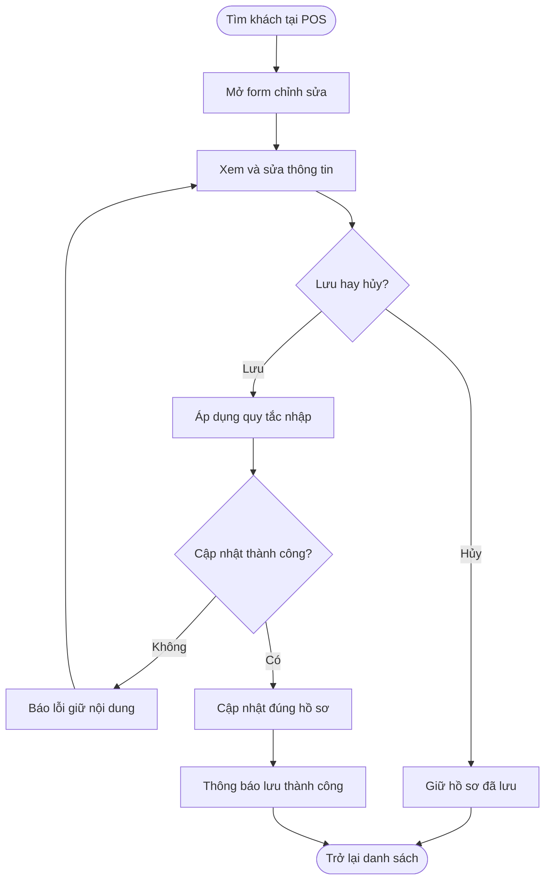
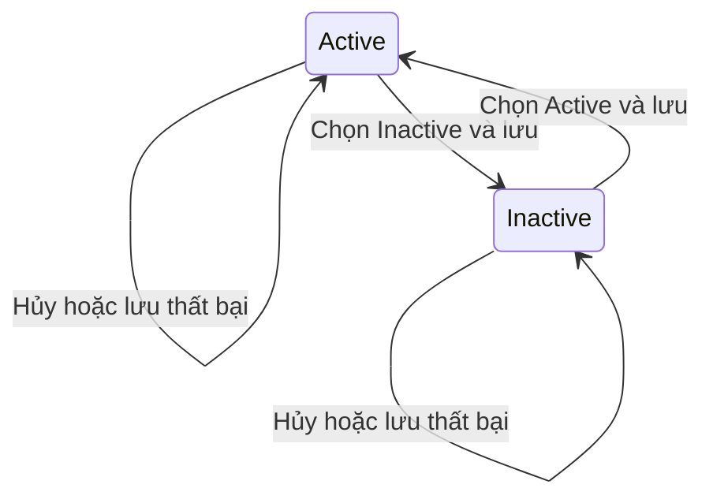

## POS - Edit thông tin Customer

**Last Updated:** 2026-09-15

**Audience:** Chủ salon, quản lý, nhân viên Front Desk, Product Owner, BA, QA

**Status:** Draft

### Overview

Cho phép nhân viên chỉnh sửa hồ sơ khách hàng tại **POS → Customers → Edit**, với bộ trường và cách thao tác thống nhất với **AI Hub → Customers → Edit**. Nhân viên cập nhật thông tin liên hệ, loại khách và trạng thái ngay tại POS để phục vụ khách chính xác hơn.

Tài liệu mô tả **yêu cầu nghiệm thu**, đối chiếu với prototype hiện có. Phạm vi đồng bộ ở đây là form và quy tắc chỉnh sửa; việc dùng chung dữ liệu khách hàng giữa POS và AI Hub được ghi rõ tại mục System Configuration & Administration.

### Key Concepts

| Thuật ngữ | Ý nghĩa |
| :--- | :--- |
| Customer | Hồ sơ khách hàng đang có trong danh sách Customers. |
| Update customer | Form chỉnh sửa hồ sơ đã chọn; không tạo khách mới. |
| Type | Loại khách được chọn thủ công: Individual, Business, VIP hoặc Partner. |
| Status | Trạng thái hồ sơ: Active hoặc Inactive. |
| Nhóm khách | Phân nhóm như New, Returning hoặc VIP trong POS; độc lập với trường Type. |

### User Roles

| Vai trò | Trách nhiệm |
| :--- | :--- |
| Nhân viên Front Desk | Tìm đúng khách, cập nhật thông tin theo yêu cầu của khách và kiểm tra kết quả. |
| Chủ salon / quản lý | Điều chỉnh thông tin, Type và Status của hồ sơ khi cần. |

Các vai trò trên mô tả người sử dụng nghiệp vụ. Prototype chưa có kiểm soát quyền riêng cho thao tác Edit Customer.

### End-to-End Workflows

#### Workflow: Chỉnh sửa hồ sơ Customer tại POS

**Primary Actor:** Nhân viên Front Desk / chủ salon / quản lý.

**Trigger:** Bấm **Edit** tại dòng khách, thẻ khách hoặc trong cửa sổ **View** của khách ở POS → Customers.

**Outcome:** Hồ sơ được chọn được cập nhật; danh sách và lần mở lại hồ sơ hiển thị thông tin vừa lưu.

**User Stories:**

- **US-PEC-01 — Chỉnh sửa thống nhất với AI Hub:** **As a** nhân viên Front Desk, **I want to** chỉnh sửa thông tin Customer ngay tại POS bằng form và quy tắc giống AI Hub → Customers, **so that** tôi cập nhật hồ sơ chính xác mà không phải chuyển màn hình hoặc học lại cách thao tác.
- **US-PEC-02 — Bỏ thay đổi chưa lưu:** **As a** người chỉnh sửa hồ sơ, **I want to** đóng hoặc hủy form trước khi lưu, **so that** thông tin đã lưu của khách được giữ nguyên.
- **US-PEC-03 — Giữ đúng hồ sơ và lịch sử:** **As a** người chỉnh sửa hồ sơ, **I want to** cập nhật tên hoặc số điện thoại mà vẫn giữ liên kết với lịch sử của khách, **so that** việc sửa thông tin không tạo khách mới hoặc làm mất dữ liệu phục vụ.
- **US-PEC-04 — Nhận biết lỗi lưu:** **As a** người chỉnh sửa hồ sơ, **I want to** được báo khi cập nhật không thành công và giữ nội dung đang nhập, **so that** tôi có thể thử lại mà không phải nhập lại từ đầu.

| Bước | Người thực hiện | Thao tác | Phản hồi hệ thống | Ghi chú |
| :--- | :--- | :--- | :--- | :--- |
| 1 | Nhân viên | Vào POS → Customers, tìm khách theo tên hoặc Phone | Hiển thị danh sách phù hợp | Hỗ trợ cả Table và Card hiện có của POS. |
| 2 | Nhân viên | Bấm Edit của khách cần sửa | Mở Update customer và điền thông tin hiện tại của đúng khách | Nếu mở từ View, đóng cửa sổ View trước khi mở Edit. |
| 3 | Nhân viên | Điều chỉnh một hoặc nhiều trường | Hiển thị nội dung đang nhập | Chưa thay đổi hồ sơ đã lưu. |
| 4 | Nhân viên | Bấm Save changes | Áp dụng quy tắc từng trường và cập nhật hồ sơ đã chọn | Không thêm một dòng Customer mới. |
| 5 | Hệ thống | Hoàn tất cập nhật | Đóng form, cập nhật danh sách, thông báo Customer updated kèm tên khách | Giữ chế độ Table/Card và điều kiện tìm kiếm, lọc đang dùng. |
| 6 | Nhân viên | Mở lại Edit hoặc View của khách | Hiển thị dữ liệu vừa lưu và lịch sử vẫn thuộc đúng khách | Nếu khách không còn khớp tìm kiếm cũ, tìm lại bằng thông tin mới. |
| Nhánh hủy | Nhân viên | Bấm Cancel, nút Close, vùng nền ngoài form hoặc Escape | Đóng form và bỏ toàn bộ thay đổi chưa lưu | Mở lại lấy thông tin đã lưu trước đó. |
| Nhánh lỗi | Hệ thống | Không cập nhật được hồ sơ | Báo lỗi, giữ form và nội dung đang nhập; không báo thành công | Yêu cầu khi tích hợp lưu dữ liệu thực tế. |

#### Bộ trường đồng bộ với AI Hub

| Trường | Cách hiển thị / thao tác yêu cầu | Quy tắc trong chế độ Edit |
| :--- | :--- | :--- |
| Name | Ô nhập tên khách | Bỏ khoảng trắng đầu/cuối. Nếu để trống, giữ tên đã lưu. |
| Phone | Ô nhập số điện thoại | Bỏ khoảng trắng đầu/cuối. Nếu để trống, giữ số đã lưu; hồ sơ cũ chưa có Phone vẫn được sửa trường khác. |
| Email | Ô nhập email | Không bắt buộc; bỏ khoảng trắng đầu/cuối. Xóa nội dung rồi lưu sẽ xóa Email đã lưu. |
| Birthday | Lịch chọn ngày; hiển thị dạng **Jun 9, 2026** như AI Hub | Không bắt buộc; cho phép bỏ ngày đã chọn. Dữ liệu ngày được lưu theo dạng năm-tháng-ngày, ví dụ **2026-06-09**. |
| Address | Ô nhập địa chỉ | Không bắt buộc; bỏ khoảng trắng đầu/cuối. Xóa nội dung rồi lưu sẽ xóa Address đã lưu. |
| Type | Dropdown: **Individual, Business, VIP, Partner** | Chọn một giá trị. Hồ sơ thiếu Type: hiển thị VIP nếu thuộc nhóm VIP, các trường hợp khác hiển thị Individual. |
| Status | Công tắc kèm nhãn **Active / Inactive** | Hiển thị trạng thái đã lưu; thiếu trạng thái thì hiển thị Active. Mỗi lần bấm đổi trạng thái đúng một lần; chỉ ghi nhận khi Save changes. |

**Acceptance Criteria:**

| ID | Điều kiện / Thao tác | Kết quả mong đợi |
| :--- | :--- | :--- |
| AC-PEC-01 | Bấm Edit từ Table, Card hoặc View, kể cả sau khi tìm kiếm/lọc | Mở đúng Customer đã chọn, tiêu đề Update customer; có đủ 7 trường theo bảng trên, nút Cancel, Close và Save changes. |
| AC-PEC-02 | Mở Edit | Điền đúng dữ liệu hiện có; các trường tùy chọn chưa có dữ liệu để trống, Type và Status áp dụng mặc định đã nêu; không giữ nội dung hoặc lỗi của khách vừa sửa trước đó. |
| AC-PEC-03 | Sửa một hoặc nhiều trường rồi Save changes | Cập nhật đúng hồ sơ, đóng form, thông báo Customer updated kèm tên; không tăng tổng số Customer và không sửa khách khác. |
| AC-PEC-04 | Xóa Name hoặc Phone rồi lưu | Giữ giá trị đã lưu của trường đó; các thay đổi khác vẫn được lưu. Không áp dụng hồi tố điều kiện bắt buộc Name và Phone của Create customer. |
| AC-PEC-05 | Xóa Email, Birthday hoặc Address rồi lưu | Trường tương ứng được bỏ khỏi hồ sơ; mở lại hiển thị trống. |
| AC-PEC-06 | Chọn Birthday rồi lưu và mở lại | Hiển thị đúng ngày đã chọn, định dạng giống AI Hub; không đổi ngày do chuyển đổi định dạng. |
| AC-PEC-07 | Chọn từng giá trị Type, lưu và mở lại | Giữ đúng lựa chọn. Đổi Type sang VIP không tự đổi nhóm khách, lượt ghé hoặc quyền lợi. |
| AC-PEC-08 | Bấm công tắc Status, lưu và mở lại | Một lần bấm chuyển Active sang Inactive hoặc ngược lại; nhãn và trạng thái công tắc khớp nhau. Khách Inactive có nhãn Inactive trong danh sách và View. |
| AC-PEC-09 | Sửa dữ liệu rồi Cancel, Close, bấm nền ngoài hoặc Escape | Không lưu bất kỳ trường nào; mở lại đúng dữ liệu trước khi sửa, không có thông báo cập nhật thành công. |
| AC-PEC-10 | Lưu khi đang dùng Table/Card và bộ lọc | Giữ chế độ hiển thị, từ khóa và bộ lọc. Nếu đổi tên/Phone làm khách không còn khớp, khách không xuất hiện trong kết quả cũ nhưng tìm được bằng thông tin mới. |
| AC-PEC-11 | Đổi tên hoặc Phone của khách đã có lịch sử | Vẫn xem được Visit history, Payment history và package của đúng khách; giữ Visits, Lifetime, Source, nhóm khách, Regular tech, Tags và Notes. Đây là yêu cầu cần bổ sung ở POS hiện tại. |
| AC-PEC-12 | Không lưu được hoặc hồ sơ không còn tồn tại khi lưu | Không thông báo thành công hoặc tạo khách thay thế; báo lỗi rõ ràng, giữ nội dung để nhân viên thử lại hoặc tải lại danh sách. Yêu cầu cho bước tích hợp dữ liệu thực tế. |
| AC-PEC-13 | Mở form trên desktop, tablet và điện thoại | Đọc và thao tác được đủ trường, nút lưu/hủy. Dropdown Type tuân thủ Form Controls: mũi tên cách mép phải 16px, icon 16px, đệm phải tối thiểu 44px, kể cả kích thước nhỏ. |

### System Configuration & Administration

- Type và Status dùng cùng danh sách lựa chọn với AI Hub; không có màn hình cấu hình thêm giá trị trong story này.
- **Đồng nhất form:** POS hiện có đủ 7 trường nhưng Birthday còn là ô nhập văn bản, Status là dropdown, nút lưu là Save. Cần thống nhất thành lịch chọn ngày, công tắc và Save changes theo tài liệu này.
- **Dữ liệu giữa POS và AI Hub:** Hai màn hình hiện dùng danh sách khách riêng trong phiên mở trang. Lưu ở POS chưa cập nhật hồ sơ bên AI Hub và chưa giữ thay đổi sau khi tải lại trang. Đồng bộ hồ sơ hai chiều, lưu bền vững và xử lý nhiều người cùng sửa cần luồng dữ liệu dùng chung; các hành vi đó chưa được triển khai hoặc xác nhận bởi story đồng nhất form này.
- **Liên kết lịch sử:** POS đang tra cứu một số lịch sử và package theo tên khách. Vì vậy, đổi tên có thể làm dữ liệu liên quan không còn xuất hiện; AC-PEC-11 là yêu cầu đích, chưa phải hành vi đã đạt.
- **Tham chiếu Status:** AI Hub hiện có hai xử lý cùng đổi công tắc trong một lần bấm, khiến trạng thái có thể quay về giá trị cũ. Tiêu chí đồng nhất là công tắc hoạt động đúng một lần theo AC-PEC-08.
- Prototype chưa kiểm tra trùng Phone/Email, định dạng Phone/Email hoặc ngày sinh tương lai đầy đủ. Story này không tự bổ sung quy tắc chống trùng, xác minh liên hệ hay giới hạn ngày sinh khi AI Hub chưa có quy tắc tương ứng.

### State Lifecycle

| Trạng thái hiện tại | Tác động | Trạng thái sau lưu | Ghi chú |
| :--- | :--- | :--- | :--- |
| Active | Chọn Inactive và Save changes thành công | Inactive | Giữ hồ sơ và lịch sử khách. |
| Inactive | Chọn Active và Save changes thành công | Active | Sử dụng lại cùng hồ sơ. |
| Active hoặc Inactive | Hủy hoặc lưu thất bại | Không đổi | Công tắc đang chọn chưa phải trạng thái đã lưu. |

### Business Rules

1. Edit chỉ cập nhật hồ sơ được chọn. Không chuyển sang Create khi không tìm thấy hồ sơ và không tạo khách mới do đổi Name hoặc Phone.
2. Chỉ Save changes thành công mới ghi nhận thay đổi. Thao tác hủy bỏ cả thay đổi Status và Type chưa lưu.
3. Type, nhóm khách và Status là các khái niệm riêng. **VIP trong Type không tự cấp ưu đãi; Inactive không xóa khách, hủy booking hoặc thay đổi giao dịch.** Story này không quy định chặn check-in, booking hay gửi SMS theo Status.
4. Việc sửa thông tin liên hệ phải giữ liên kết với lịch sử; không tự tính lại doanh thu, số lượt ghé hoặc sửa số tiền của giao dịch đã hoàn tất.
5. Regular tech, Tags, Notes, Visit history và Payment history thuộc hồ sơ POS hiện có; không đưa thêm vào form 7 trường chỉ để đồng nhất với AI Hub.
6. Create customer, import khách, gộp hồ sơ trùng, xóa khách và chỉnh thông tin riêng trên Live Ticket là các luồng khác.

### Edge Cases & Exception Handling

| Tình huống | Hành vi yêu cầu | Người xử lý |
| :--- | :--- | :--- |
| Khách cũ thiếu Phone | Cho phép chỉnh sửa trường khác; không bắt nhập Phone mới chỉ để lưu hồ sơ cũ. | Nhân viên. |
| Name hoặc Phone chỉ gồm khoảng trắng | Giữ giá trị đã lưu của trường đó. | Hệ thống. |
| Khách không còn khớp bộ lọc sau khi sửa | Cập nhật kết quả theo bộ lọc hiện tại; tìm lại bằng thông tin mới hoặc bỏ lọc. | Nhân viên. |
| Hai khách trùng tên | Edit đúng khách đã chọn; không cập nhật hoặc gộp hồ sơ còn lại. | Hệ thống. |
| Đổi tên khách đã có lịch sử | Giữ liên kết lịch sử theo AC-PEC-11; cần khắc phục cách liên kết theo tên hiện tại. | Đội phát triển. |
| Hồ sơ bị xóa hoặc không lưu được | Báo không thể cập nhật; giữ nội dung và cho phép hủy hoặc thử lại, không báo Customer updated. | Nhân viên / đội phát triển. |
| Tải lại trang hoặc chuyển sang AI Hub trong prototype hiện tại | Chưa bảo đảm nhìn thấy dữ liệu vừa sửa; cần luồng lưu và đồng bộ dùng chung để nghiệm thu khả năng này. | Đội phát triển. |

### Frequently Asked Questions

**Q: Edit có bắt buộc nhập lại Name và Phone không?**

A: Không. Theo luồng Edit của AI Hub, để trống một trong hai trường sẽ giữ giá trị trước đó. Điều kiện bắt buộc cả hai thuộc luồng Create customer.

**Q: Đổi Type sang VIP có đưa khách vào nhóm VIP hoặc cấp quyền lợi không?**

A: Không. Story này chỉ cập nhật Type của hồ sơ.

**Q: Lưu tại POS đã tự cập nhật AI Hub chưa?**

A: Chưa. Tài liệu quy định sự thống nhất của form; prototype hiện chưa có dữ liệu khách dùng chung giữa hai màn hình.

### Related Features

- [POS → Customers](../../html/pages/pos-phase-1.html?tab=customers): Form hiện tại, danh sách, View và các lịch sử liên quan.
- [AI Hub → Customers](../../html/pages/booking-book-phase-1.html?tab=customers): Nguồn tham chiếu bộ trường, lịch chọn Birthday, Status và Save changes.
- [Tạo Customer trong AI Hub](../superpowers/specs/2026-07-29-booking-customer-create-design.md): Phân biệt quy tắc Create và Edit.
- [Thiết kế vận hành POS](../superpowers/specs/2026-07-29-pos-nail-salon-operations-design.md): Vai trò Customers trong vận hành salon.
- [Form Controls](../../nexora-design-system-colors.md#form-controls): Quy chuẩn dropdown của dự án.
