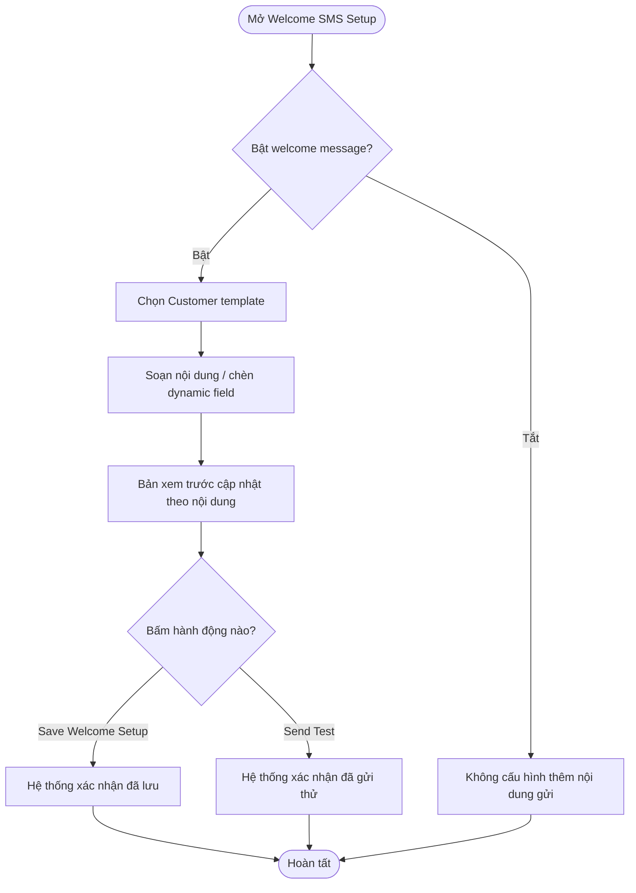
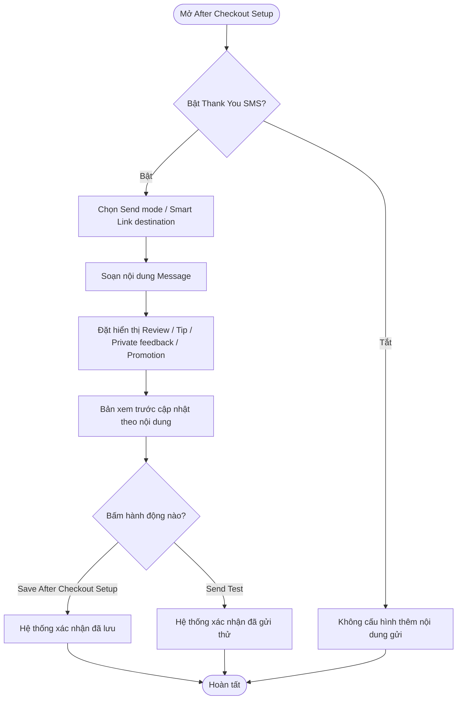
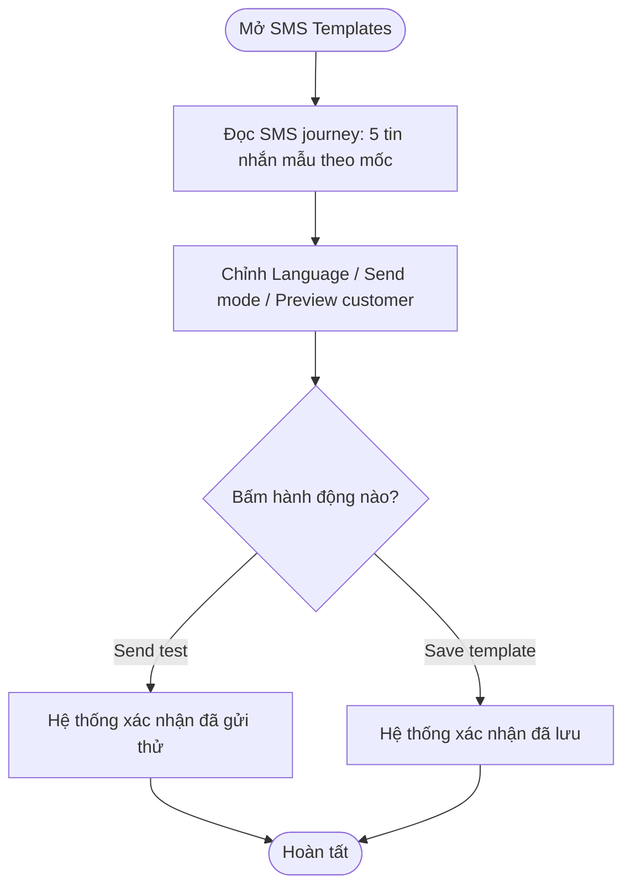
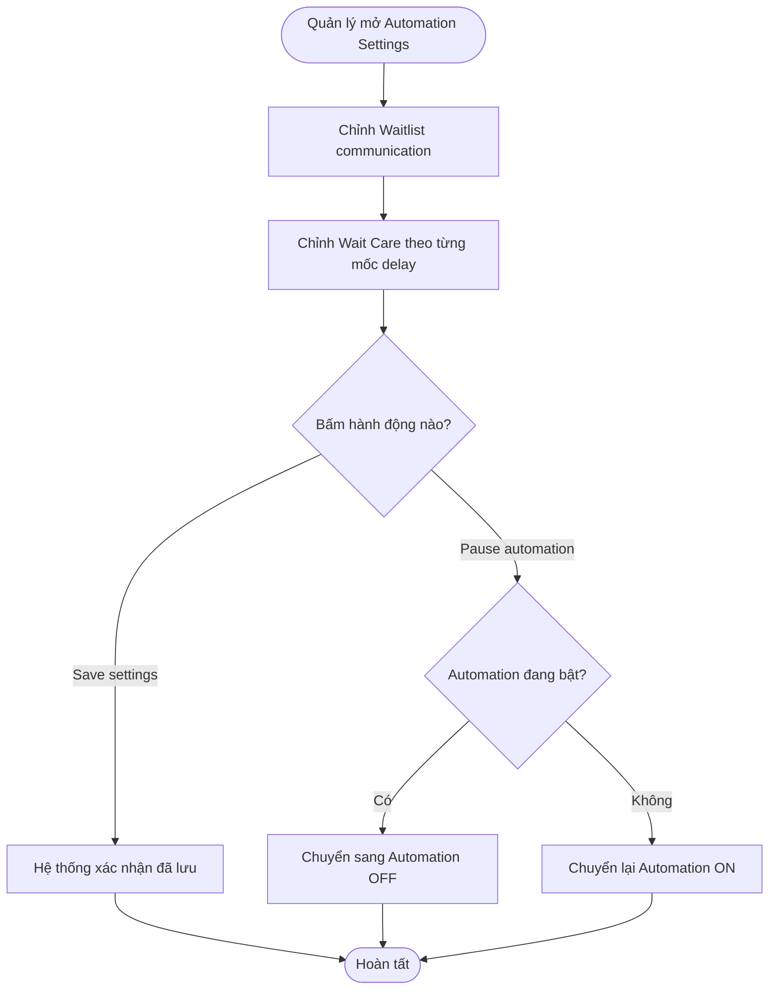
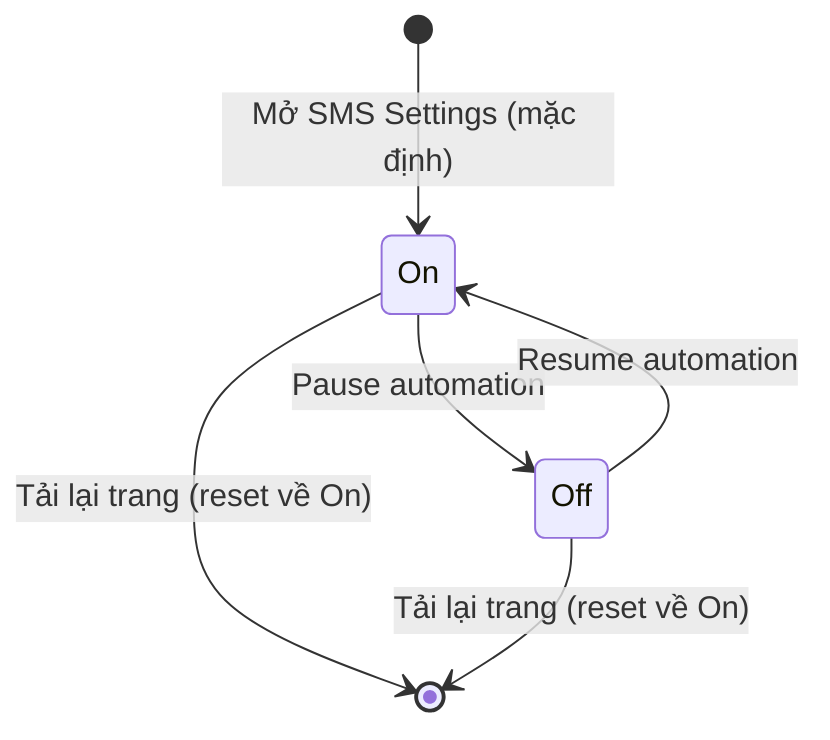

## POS — Salon Settings → SMS Settings

**Last Updated:** 2026-09-21

**Audience:** Product Owner, BA, QA, quản lý salon (Salon Owner/Manager)

**Status:** Draft

### Overview

**SMS Settings** là khu vực cấu hình trong Salon Settings, cho phép quản lý salon thiết lập toàn bộ tin nhắn SMS tự động gửi tới khách qua **Smart Link (OneQR)** xuyên suốt một chuyến ghé: từ lúc khách check-in (Welcome SMS Setup), trong lúc khách đang chờ (Automation Settings, gồm Waitlist communication và Wait Care), đến sau khi thanh toán xong (After Checkout Setup — Thank You SMS), cùng một nơi xem lại toàn bộ chuỗi tin nhắn mẫu theo hành trình khách (SMS Templates).

**Vị trí:** POS → Salon Settings → SMS Settings (tab thứ 2, ngay sau Salon Information, trước Staff/Services/Roles & Permissions/Operating Standards). Bên trong tab có 4 sub-tab dạng underline, theo đúng thứ tự: **Welcome SMS Setup** (mở mặc định) → **After Checkout Setup** → **SMS Templates** → **Automation Settings**.

**Giá trị nghiệp vụ:** giảm khách bỏ lượt trong lúc chờ nhờ Wait Care đúng lúc, tăng tỷ lệ khách để lại đánh giá/tip/đặt lịch tiếp theo sau khi thanh toán, và giữ nội dung tin nhắn nhất quán, đúng chính sách bảo vệ khách mà không cần nhân viên soạn tay từng tin.

Tài liệu mô tả yêu cầu nghiệp vụ của SMS Settings. **Đối chiếu triển khai:** bản HTML hiện dùng dữ liệu mẫu cố định (salon "Bitcoin Nail Bar · Houston", khách mẫu "Sarah"/"Sarah Nguyen"), không đọc cấu hình theo salon đang đăng nhập thật. Save settings, Save template, Save Welcome Setup, Save After Checkout Setup và Send Test chỉ hiện một thông báo xác nhận tạm thời (tự ẩn sau vài giây), **không** gọi API lưu cấu hình và **không** gửi SMS thật. Pause automation chỉ đổi trạng thái hiển thị Automation ON/OFF trong phiên trình duyệt hiện tại, mất khi tải lại trang — chưa có lưu trữ/API backend.

---

### Key Concepts

| Term | Definition |
| :--- | :--- |
| SMS Settings | Khu vực cấu hình 4 nhóm SMS tự động của một salon, theo đúng thứ tự sub-tab trên màn hình: Welcome SMS Setup (mặc định), After Checkout Setup, SMS Templates, Automation Settings. |
| Automation Settings | Nhóm cấu hình Waitlist communication và Wait Care — các ngưỡng thời gian và chính sách ưu đãi áp dụng khi khách đang chờ. |
| Wait Care | Chính sách ưu đãi theo từng mốc thời gian khách đã chờ (10–19, 20–29, 30–44, 45+ phút), có thể là Automatic hoặc cần Approval, nhằm giữ chân khách chờ lâu. |
| Welcome SMS | Tin nhắn gửi ngay sau khi khách check-in, xác nhận đã vào hàng chờ và giới thiệu Benefit khả dụng qua Smart Link. |
| After Checkout (Thank You SMS) | Tin nhắn gửi sau khi thanh toán xong, dẫn khách tới menu sau chuyến ghé (Leave a Review, Add a Tip, Private Feedback, Rewards Earned, Book Your Next Visit, Receipt). |
| SMS Templates / SMS journey | Toàn bộ chuỗi tin nhắn mẫu theo từng mốc trong hành trình khách (Welcome with benefits, Return soon, Wait Care, Ready now, Thank you), kèm cách gửi của từng tin. |
| Smart Link (OneQR) | Một đường link duy nhất gửi trong SMS; tự đổi menu hiển thị theo trạng thái chuyến ghé (đang chờ hoặc đã thanh toán) mà không cần salon tạo URL riêng cho từng tin. |
| Send mode | Cách một tin nhắn được gửi: **Automatic** (hệ thống tự gửi), **Manager approval** (cần quản lý duyệt trước), hoặc **Manual** (nhân viên tự gửi khi cần). |
| Dynamic field / Token | Các biến dạng `[Customer Name]`, `[Salon Name]`, `[OneQR Link]`, `[Benefits Status]` trong nội dung tin nhắn, được thay bằng dữ liệu thật của khách khi gửi. |
| Marketing consent | Sự đồng ý nhận tin quảng cáo của khách; quyết định nội dung khuyến mãi (Promotion) có được hiển thị trong Smart Link hay không. |
| Customer protection | Nhóm quy tắc bảo vệ trải nghiệm khách trong After Checkout Setup: không xin tip hai lần, không chỉ thưởng cho đánh giá tích cực, khuyến mãi cần marketing consent. |
| Automation ON/OFF | Trạng thái tổng của toàn bộ luồng SMS tự động trên salon, hiển thị bằng pill ở góc phải; Pause automation tạm dừng gửi tự động cho cả 4 sub-tab. |

---

### User Roles

| Role | Responsibilities in this Feature |
| :--- | :--- |
| Quản lý salon (Salon Owner/Manager) | Cấu hình Automation Settings, Wait Care, Welcome SMS, After Checkout, SMS Templates; bật/tạm dừng automation; gửi thử tin nhắn. |
| Nhân viên Front Desk | Không chỉnh sửa SMS Settings, nhưng chịu tác động trực tiếp — Wait Care và Welcome SMS quyết định nội dung khách nhận được khi đang theo dõi tại Live Waitlist. |
| Khách hàng | Nhận SMS theo cấu hình, mở Smart Link (OneQR) tương ứng với trạng thái chuyến ghé của mình. |
| QA | Kiểm tra nội dung mẫu, dynamic field, quy tắc bảo vệ khách và hành vi bản xem trước trước khi phát hành. |

---

### End-to-End Workflows

#### Workflow 1: Cấu hình Welcome SMS sau check-in

**Primary Actor:** Quản lý salon

**Trigger:** Cần đổi nội dung hoặc hành vi tin nhắn chào khách ngay sau check-in.

**Outcome:** Welcome SMS phản ánh đúng mẫu theo loại khách, đúng nội dung mong muốn, và bản xem trước khớp với tin khách sẽ nhận.

**User Stories:**

- **US-SMS-06 — Bật/tắt Welcome SMS:** Là quản lý salon, tôi muốn bật hoặc tắt tin nhắn chào sau check-in, để chủ động dừng gửi khi không cần.
- **US-SMS-07 — Chọn mẫu theo loại khách:** Là quản lý salon, tôi muốn chọn Customer template (New/Returning/Member/Birthday), để nội dung mặc định phù hợp với từng nhóm khách.
- **US-SMS-08 — Soạn nội dung với dynamic field:** Là quản lý salon, tôi muốn chèn các trường động (`[Customer Name]`, `[Salon Name]`, `[OneQR Link]`, `[Benefits Status]`) vào tin nhắn, để cá nhân hoá nội dung mà không phải gõ thủ công cho từng khách.
- **US-SMS-09 — Xem trước tin nhắn khách sẽ nhận:** Là quản lý salon, tôi muốn thấy bản xem trước dạng khung điện thoại cập nhật ngay khi chỉnh nội dung, để biết chính xác khách sẽ đọc gì trước khi lưu.

| Step | Who | Action | System Response | Notes |
| :--- | :--- | :--- | :--- | :--- |
| 1 | Quản lý salon | Mở Welcome SMS Setup | Hiện form với toggle "Enable welcome message" đang bật, mẫu Returning Customer mặc định | Nội dung mẫu nạp sẵn theo Returning Customer. |
| 2 | Quản lý salon | Tắt toggle "Enable welcome message after check-in" | Toggle chuyển sang trạng thái tắt | Xem Edge Cases về giới hạn hiện tại của Send Test khi toggle tắt. |
| 3 | Quản lý salon | Đổi Customer template sang Birthday Customer | Message và bản xem trước tự cập nhật theo mẫu Birthday | Mẫu mới ghi đè nội dung đang gõ dở, không có cảnh báo. |
| 4 | Quản lý salon | Bấm một token trong "Insert a dynamic field" (ví dụ Benefits Status) | Token nối vào cuối Message, bản xem trước cập nhật với dữ liệu mẫu | Token giữ nguyên dạng `[Benefits Status]` cho tới khi gửi tin thật. |
| 5 | Quản lý salon | Bấm Save Welcome Setup | Hiện thông báo "Welcome SMS settings saved." | Xem mục Đối chiếu triển khai. |
| 6 | Quản lý salon | Bấm Send Test | Hiện thông báo "Test SMS queued." | Không gửi SMS thật ở bản hiện tại. |

**Acceptance Criteria:**

| ID | User story | Given — Điều kiện | When — Thao tác | Then — Kết quả |
| :--- | :--- | :--- | :--- | :--- |
| AC-SMS-09 | US-SMS-07 | Customer template đang là Returning Customer | Đổi sang Member | Message đổi thành nội dung mẫu Member; bản xem trước cập nhật theo nội dung đó (token đã thay bằng dữ liệu mẫu). |
| AC-SMS-10 | US-SMS-08 | Message đang có nội dung tuỳ ý | Bấm token "Salon Name" | Token `[Salon Name]` được nối vào cuối Message; bản xem trước hiện đúng tên salon mẫu thay cho token. |
| AC-SMS-11 | US-SMS-09 | Đang gõ trong ô Message | Gõ thêm ký tự | Bản xem trước cập nhật theo thời gian thực, không cần bấm Save. |
| AC-SMS-12 | US-SMS-06 | Toggle "Enable welcome message" đang bật | Bấm để tắt | Toggle chuyển sang trạng thái tắt; các trường khác trên form giữ nguyên giá trị. |

---

#### Workflow 2: Cấu hình After Checkout Setup (Thank You SMS)

**Primary Actor:** Quản lý salon

**Trigger:** Cần điều chỉnh tin nhắn cảm ơn và các mục hiển thị sau khi thanh toán (Review, Tip, Private Feedback, Promotion).

**Outcome:** Thank You SMS và menu sau checkout phản ánh đúng chính sách Customer protection, sẵn sàng gửi sau khi khách thanh toán xong.

**User Stories:**

- **US-SMS-10 — Bật/tắt Thank You SMS:** Là quản lý salon, tôi muốn bật hoặc tắt tin nhắn cảm ơn sau checkout, để kiểm soát khi nào khách nhận lời mời đánh giá/tip/đặt lịch tiếp theo.
- **US-SMS-11 — Cấu hình hiển thị Review, Tip, Private feedback, Promotion:** Là quản lý salon, tôi muốn đặt điều kiện hiển thị riêng cho từng mục (ví dụ Tip chỉ hiện khi chưa có tip), để tuân thủ chính sách bảo vệ khách và tránh làm phiền khách đã hoàn tất.
- **US-SMS-12 — Soạn nội dung và xem trước menu sau checkout:** Là quản lý salon, tôi muốn soạn nội dung Thank You SMS và xem trước toàn bộ menu (Leave a Review, Add a Tip, Private Feedback, Rewards Earned, Book Your Next Visit, Receipt), để đảm bảo khách thấy đúng lựa chọn sau khi ghé salon.

| Step | Who | Action | System Response | Notes |
| :--- | :--- | :--- | :--- | :--- |
| 1 | Quản lý salon | Mở After Checkout Setup | Hiện form Thank You SMS Setup với toggle đang bật và nội dung mẫu | Bản xem trước bên phải hiện tin nhắn + menu tương ứng. |
| 2 | Quản lý salon | Chọn Send mode và Smart Link destination | Form cập nhật lựa chọn | Không ảnh hưởng nội dung Message. |
| 3 | Quản lý salon | Sửa nội dung Message | Bản xem trước cập nhật theo thời gian thực | Token `[Salon Name]`, `[Customer Name]`, `[OneQR Link]` được thay bằng dữ liệu mẫu trong bản xem trước. |
| 4 | Quản lý salon | Đặt Review/Tip/Private feedback/Promotion theo chính sách mong muốn | Form cập nhật lựa chọn | Đọc kèm khối Customer protection ngay bên dưới. |
| 5 | Quản lý salon | Bấm Save After Checkout Setup | Hiện thông báo "After Checkout settings saved." | Xem mục Đối chiếu triển khai. |
| 6 | Quản lý salon | Bấm Send Test | Hiện thông báo "Thank You test SMS queued." | Không gửi SMS thật ở bản hiện tại. |

**Acceptance Criteria:**

| ID | User story | Given — Điều kiện | When — Thao tác | Then — Kết quả |
| :--- | :--- | :--- | :--- | :--- |
| AC-SMS-13 | US-SMS-11 | Tip đang đặt "Show only when no tip was completed" | Đổi sang "Hide tip after checkout" | Lựa chọn Tip cập nhật đúng giá trị mới; không ảnh hưởng Review/Private feedback/Promotion. |
| AC-SMS-14 | US-SMS-12 | Đang gõ trong Message của After Checkout | Sửa nội dung có chứa `[Customer Name]` | Bản xem trước After Checkout cập nhật ngay, thay `[Customer Name]` bằng tên khách mẫu. |
| AC-SMS-15 | US-SMS-10 | Toggle "Send after checkout is completed" đang bật | Bấm để tắt | Toggle chuyển sang trạng thái tắt; các trường khác giữ nguyên giá trị. |
| AC-SMS-16 | US-SMS-12 | Đang xem After Checkout preview | Xem menu bên dưới khung tin nhắn | Hiện đủ 6 mục: Leave a Review, Add a Tip, Private Feedback, Rewards Earned, Book Your Next Visit, Receipt, cùng nút "← Back to Main Menu". |

---

#### Workflow 3: Xem và kiểm thử SMS Templates (SMS journey)

**Primary Actor:** Quản lý salon / QA

**Trigger:** Cần rà soát toàn bộ nội dung và cách gửi của chuỗi tin nhắn trước khi phát hành, hoặc khi khách phản hồi sai nội dung.

**Outcome:** Người dùng xác nhận đúng nội dung và Send mode (Auto/Manager approval/Manual) của từng mốc trong hành trình, và gửi thử một tin nếu cần.

**User Stories:**

- **US-SMS-04 — Xem toàn bộ SMS journey:** Là quản lý salon, tôi muốn xem cả 5 tin nhắn mẫu (Welcome with benefits, Return soon, Wait Care, Ready now, Thank you) cùng cách gửi của từng tin, để hiểu toàn bộ hành trình nhắn tin khách sẽ nhận.
- **US-SMS-05 — Gửi thử tin nhắn theo khách mẫu:** Là quản lý salon, tôi muốn nhập tên một khách xem trước và bấm Send test, để kiểm tra luồng gửi hoạt động trước khi áp dụng thật.

| Step | Who | Action | System Response | Notes |
| :--- | :--- | :--- | :--- | :--- |
| 1 | Quản lý salon | Mở SMS Templates | Hiện danh sách SMS journey (5 mục) kèm nhãn cách gửi (Auto, Auto at 15 min, Manager approval, Manual, Auto after checkout) | Nội dung mẫu cố định, không đổi theo Preview customer. |
| 2 | Quản lý salon | Nhập tên khách vào Preview customer, chọn Language/Send mode | Template controls cập nhật giá trị | Chưa liên kết ngược lại nội dung SMS journey — xem Đối chiếu triển khai. |
| 3 | Quản lý salon | Bấm Send test | Hiện thông báo "Test SMS queued." | Không gửi SMS thật ở bản hiện tại. |
| 4 | Quản lý salon | Bấm Save template | Hiện thông báo "Template saved." | Không lưu vào hệ thống thật ở bản hiện tại. |

**Acceptance Criteria:**

| ID | User story | Given — Điều kiện | When — Thao tác | Then — Kết quả |
| :--- | :--- | :--- | :--- | :--- |
| AC-SMS-06 | US-SMS-04 | Đang mở SMS Templates | Đọc mục "Wait Care" trong SMS journey | Hiển thị đúng nhãn "Manager approval" và nội dung ưu đãi hot-stone upgrade. |
| AC-SMS-07 | US-SMS-05 | Preview customer để trống hoặc có tên bất kỳ | Bấm Send test | Hiện thông báo "Test SMS queued." không phụ thuộc giá trị đã nhập. |
| AC-SMS-08 | US-SMS-05 | Đang mở SMS Templates | Bấm Save template | Hiện thông báo "Template saved." |

---

#### Workflow 4: Cấu hình Automation Settings và Wait Care

**Primary Actor:** Quản lý salon

**Trigger:** Cần điều chỉnh ngưỡng thời gian hoặc chính sách ưu đãi cho khách đang chờ.

**Outcome:** Automation Settings được xác nhận lưu (theo giới hạn ở mục Đối chiếu triển khai), và Automation ON/OFF phản ánh đúng trạng thái mong muốn.

**User Stories:**

- **US-SMS-01 — Cấu hình Waitlist communication:** Là quản lý salon, tôi muốn đặt Welcome SMS, Welcome wait time, Return notice, No response grace và Internal ETA threshold, để kiểm soát khi nào và nội dung gì được gửi cho khách trong lúc chờ.
- **US-SMS-02 — Cấu hình Wait Care theo mốc thời gian chờ:** Là quản lý salon, tôi muốn đặt chính sách ưu đãi riêng cho từng mốc chờ (10–19, 20–29, 30–44, 45+ phút), để tự động hoặc duyệt thủ công ưu đãi giữ chân khách chờ lâu.
- **US-SMS-03 — Tạm dừng/khôi phục automation:** Là quản lý salon, tôi muốn tạm dừng toàn bộ SMS tự động khi cần (ví dụ sự cố, bảo trì) và khôi phục lại khi sẵn sàng, để kiểm soát rủi ro gửi nhầm.

| Step | Who | Action | System Response | Notes |
| :--- | :--- | :--- | :--- | :--- |
| 1 | Quản lý salon | Mở SMS Settings → Automation Settings | Hiện 2 khối: Waitlist communication và Wait Care với giá trị mặc định | Automation ON/OFF hiển thị chung cho cả 4 sub-tab. |
| 2 | Quản lý salon | Chọn lại giá trị từng trường trong Waitlist communication | Form cập nhật lựa chọn, chưa gửi lên hệ thống | Cần bấm Save settings để xác nhận. |
| 3 | Quản lý salon | Chọn lại chính sách cho từng mốc delay trong Wait Care | Form cập nhật lựa chọn | 4 mốc độc lập, không tự suy ra từ nhau. |
| 4 | Quản lý salon | Bấm Save settings | Hiện thông báo "Automation settings saved." | Xem mục Đối chiếu triển khai. |
| 5 | Quản lý salon | Bấm Pause automation | Pill Automation ON → OFF, nút đổi thành Resume automation | Áp dụng cho toàn bộ SMS Settings, không riêng Automation Settings. |

**Acceptance Criteria:**

| ID | User story | Given — Điều kiện | When — Thao tác | Then — Kết quả |
| :--- | :--- | :--- | :--- | :--- |
| AC-SMS-01 | US-SMS-01 | Đang mở Automation Settings | Đổi Welcome wait time sang "Show estimated range" | Trường hiển thị đúng giá trị mới; các trường khác không đổi. |
| AC-SMS-02 | US-SMS-02 | Đang mở Automation Settings | Đổi mốc "45+ min delay" sang "Auto · $10 voucher" | Chỉ mốc 45+ đổi giá trị; 3 mốc còn lại giữ nguyên. |
| AC-SMS-03 | US-SMS-03 | Automation đang ở trạng thái ON | Bấm Pause automation | Pill đổi thành "Automation OFF", nút đổi thành "Resume automation", hiện thông báo "Automation paused." |
| AC-SMS-04 | US-SMS-03 | Automation đang ở trạng thái OFF | Bấm Resume automation | Pill đổi lại "Automation ON", nút đổi lại "Pause automation", hiện thông báo "Automation resumed." |
| AC-SMS-05 | US-SMS-01, US-SMS-02 | Đang mở Automation Settings | Bấm Save settings | Hiện thông báo "Automation settings saved."; không đổi Automation ON/OFF. |

---

### System Configuration & Administration

- **US-SMS-13 — Kiểm soát trạng thái automation toàn cục:** Là quản lý salon, tôi muốn thấy rõ trạng thái Automation ON/OFF ở mọi sub-tab của SMS Settings, để biết ngay SMS tự động có đang hoạt động hay không, bất kể đang xem tab nào.
- 4 sub-tab (Welcome SMS Setup, After Checkout Setup, SMS Templates, Automation Settings) dùng chung một trạng thái Automation ON/OFF và một vùng thông báo trạng thái (status message) ở đầu panel; hành động Save/Send Test ở bất kỳ sub-tab nào cũng ghi đè vào cùng vùng thông báo này.
- SMS Settings hiện chưa có màn hình phân quyền riêng — mặc định mọi tài khoản có quyền vào Salon Settings đều thấy và chỉnh được tab này; quy tắc phân quyền chi tiết theo Role cần đối chiếu thêm với Roles & Permissions khi triển khai thật.

---

### State Lifecycle

| Current Status | Trigger | New Status | Notes |
| :--- | :--- | :--- | :--- |
| Automation ON (mặc định khi mở trang) | Bấm Pause automation | Automation OFF | Pill đổi màu/nội dung, nút đổi thành "Resume automation"; áp dụng toàn bộ SMS Settings. |
| Automation OFF | Bấm Resume automation | Automation ON | Pill và nút đổi lại như ban đầu. |
| Automation ON hoặc OFF | Tải lại trang | Automation ON | Bản HTML hiện chưa lưu trạng thái Pause; mỗi lần mở lại mặc định về ON. |

---

### Business Rules

1. Automation ON/OFF là trạng thái dùng chung cho cả 4 sub-tab; Pause automation tắt toàn bộ SMS tự động cùng lúc, không tắt riêng từng loại (Welcome, Wait Care, Thank You).
2. Mỗi tin nhắn (Welcome, Return soon, Wait Care, Ready now, Thank you) có đúng một Send mode tại một thời điểm: Automatic, Manager approval hoặc Manual; không kết hợp nhiều cách gửi cho cùng một tin.
3. Nội dung khuyến mãi (Promotion) trong After Checkout, và mọi ưu đãi cá nhân hoá hiển thị qua Smart Link, chỉ hiển thị khi khách có marketing consent hợp lệ; nếu không, Smart Link chỉ mở menu OneQR tiêu chuẩn và các Benefit sẵn có của khách.
4. Customer protection trong After Checkout Setup là bắt buộc: không xin tip lần hai khi khách đã hoàn tất tip; không gắn điều kiện thưởng chỉ cho đánh giá tích cực (public review).
5. Wait Care áp dụng theo đúng một mốc delay tương ứng với thời gian khách đã chờ tại thời điểm đánh giá (10–19 / 20–29 / 30–44 / 45+ phút); mốc càng dài càng có xu hướng cần Manager approval thay vì Automatic.
6. Dynamic field (`[Customer Name]`, `[Salon Name]`, `[OneQR Link]`, `[Benefits Status]`) chỉ được thay bằng dữ liệu thật tại thời điểm gửi tin thật; trên màn hình cấu hình, token chỉ được minh hoạ bằng dữ liệu mẫu ở khung xem trước.
7. Smart Link (OneQR) là một đường link duy nhất cho mỗi khách; nội dung menu mở ra tự đổi theo trạng thái chuyến ghé (đang chờ hay đã thanh toán xong), salon không tạo link riêng cho từng loại tin nhắn.

> 💡 **Important:** SMS Settings không trực tiếp thay đổi tiền hay Points của khách; mọi thay đổi số dư (ví dụ ưu đãi Wait Care quy đổi thành voucher, Points từ Rewards) vẫn phải xử lý qua Checkout/Customer Rewards để đảm bảo đúng sổ ghi nhận — cùng nguyên tắc với [Live Waitlist](front-desk-live-waitlist.md).

---

### Edge Cases & Exception Handling

| Scenario | What Happens | Who Resolves It |
| :--- | :--- | :--- |
| Toggle "Enable welcome message"/"Send after checkout" đang tắt nhưng vẫn bấm Send Test | Bản HTML hiện tại vẫn hiện thông báo xác nhận đã gửi thử ("Test SMS queued." hoặc "Thank You test SMS queued.") vì Send Test chưa kiểm tra trạng thái toggle | Cần bổ sung khi nối API gửi SMS thật. |
| Đổi Customer template sau khi đã tự soạn nội dung Message trong Welcome SMS Setup | Nội dung tự soạn bị ghi đè hoàn toàn bởi mẫu mới, không có cảnh báo xác nhận | Quản lý salon cần soạn lại nếu muốn giữ nội dung tuỳ chỉnh. |
| Bấm Save/Send Test ở nhiều sub-tab liên tiếp trong thời gian ngắn | Vùng thông báo trạng thái dùng chung một chỗ hiển thị; thông báo mới nhất ghi đè thông báo trước đó (mỗi thông báo tự ẩn sau khoảng 3 giây) | Hệ thống. |
| Tải lại trang sau khi Pause automation hoặc chỉnh sửa form | Toàn bộ lựa chọn trở về mặc định ban đầu (Automation ON, nội dung mẫu gốc); không có cảnh báo mất thay đổi chưa lưu | Cần bổ sung xác nhận rời trang khi tích hợp lưu trữ thật. |
| Khách không có marketing consent nhưng Promotion đang đặt "Show only with marketing consent" | Theo thiết kế nghiệp vụ, Smart Link phải tự ẩn mục Promotion; bản HTML hiện chưa có dữ liệu consent thật để kiểm chứng hành vi này | Cần xác thực lại khi nối dữ liệu khách thật. |

---

### Frequently Asked Questions

**Q: SMS Settings trong bản HTML hiện tại có gửi SMS thật cho khách không?**
A: Chưa. Toàn bộ Save settings, Save template, Save Welcome Setup, Save After Checkout Setup, Send Test và Pause automation chỉ hiện thông báo xác nhận trên màn hình trong phiên trình duyệt hiện tại; chưa gọi API gửi SMS hay lưu cấu hình vào hệ thống thật.

**Q: Pause automation có huỷ những tin nhắn đã lên lịch gửi trước đó không?**
A: Bản HTML hiện tại không mô phỏng hàng đợi tin nhắn đã lên lịch; Pause automation chỉ đổi trạng thái hiển thị Automation ON/OFF, chưa có logic huỷ lịch gửi thật.

**Q: Nội dung SMS Templates (SMS journey) có tự đổi khi tôi sửa Welcome SMS Setup hoặc After Checkout Setup không?**
A: Chưa. SMS journey trên tab SMS Templates hiện là nội dung mẫu cố định, độc lập với nội dung đang chỉnh ở hai tab Welcome SMS Setup và After Checkout Setup.

**Q: SMS Settings áp dụng cho một salon hay dùng chung nhiều salon?**
A: Theo bản mockup, SMS Settings minh hoạ theo từng salon (hiện đang cố định "Bitcoin Nail Bar · Houston"); quy tắc chia sẻ hay tách riêng cấu hình giữa nhiều salon cần thống nhất thêm với Product khi triển khai thật.

---

### Related Features

- [POS — Front Desk → Live Waitlist](front-desk-live-waitlist.md) — nơi khách chờ thực tế nhận Wait Care và Welcome SMS được cấu hình tại đây.
- [Customer Rewards App (Nexora Touch)](customer-rewards-app.md) — nguồn Points/Benefit hiển thị qua Smart Link (OneQR) trong Welcome SMS và Thank You SMS.
- [Màn hình Salon Settings](../../html/pages/pos-salon-settings.html) — điểm vào tab SMS Settings.

**Nguồn đối chiếu nội bộ:** [SMS Settings logic](../../html/assets/pos-salon-sms-settings.js), [giao diện SMS Settings](../../html/assets/pos-salon-sms-settings.css).
