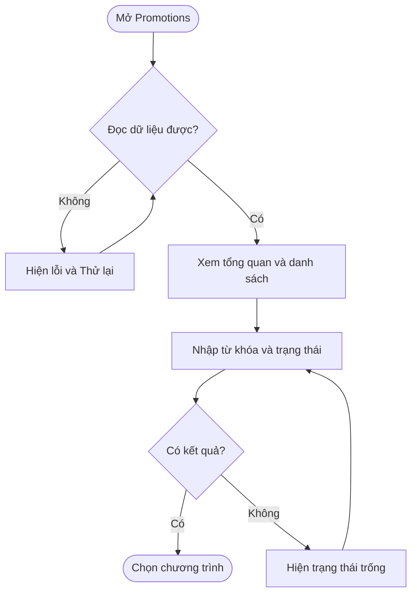
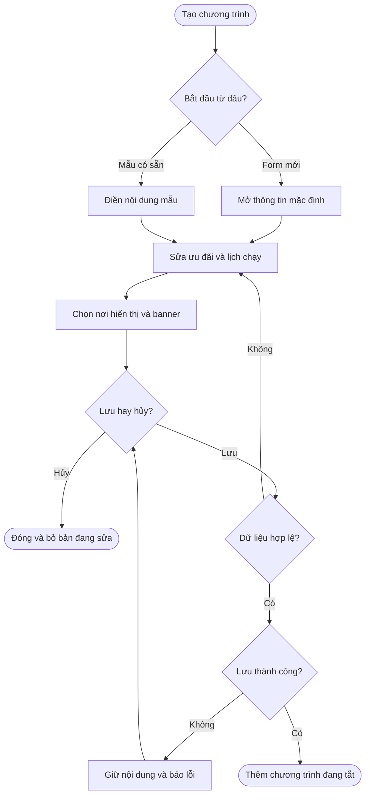
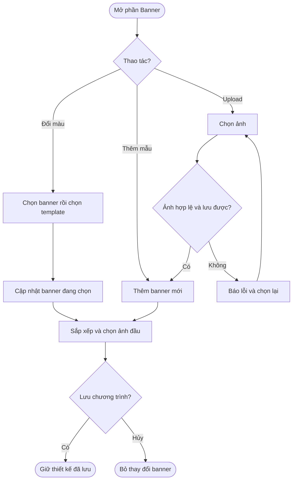
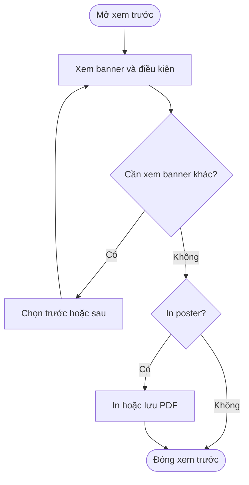
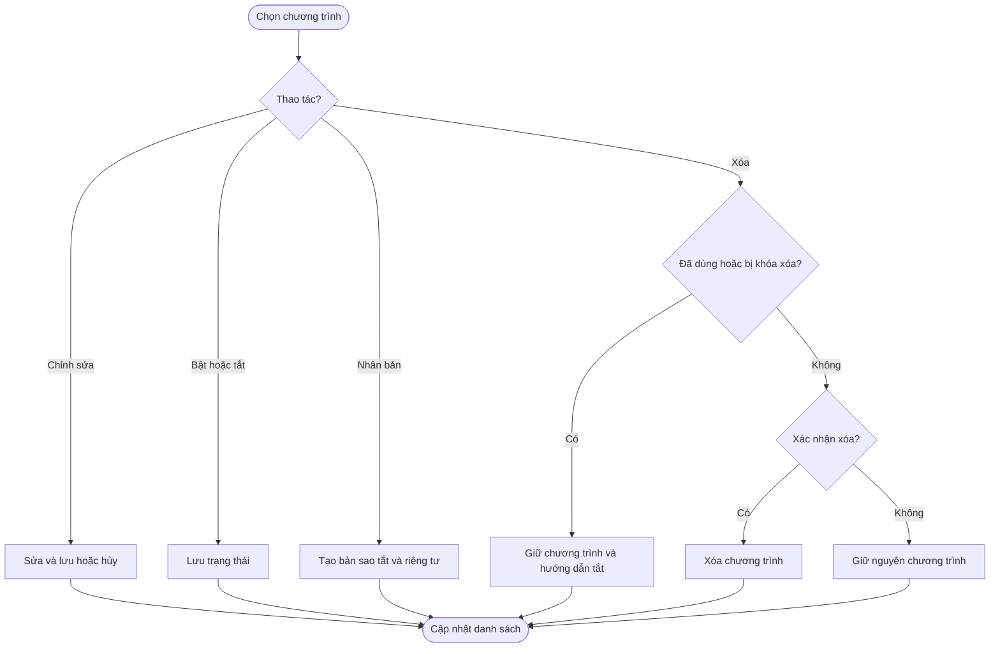
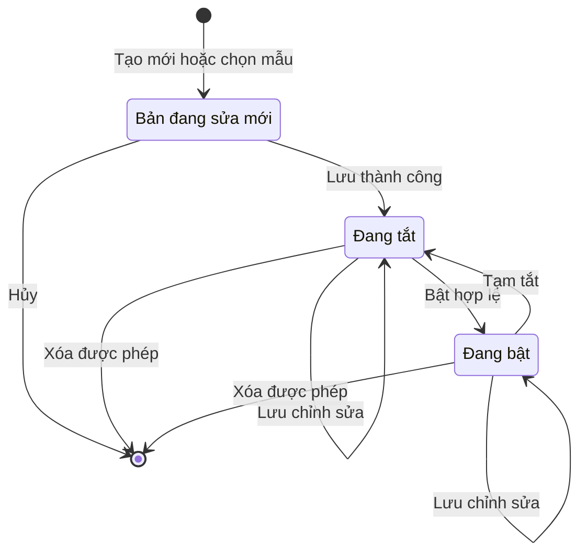
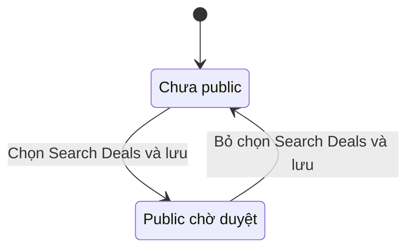

## Promotions — User Stories: Tạo và quản lý chương trình ưu đãi

**Last Updated:** 2026-09-15

**Audience:** Product Owner, BA, QA, chủ tiệm, quản lý tiệm và đội phát triển

**Status:** Draft

**Version:** 0.1

### Version History

| Phiên bản | Ngày | Nội dung |
| :--- | :--- | :--- |
| 0.1 | 2026-09-15 | Mô tả user story và tiêu chí nghiệm thu theo trang Promotions hiện có; gồm tạo từ mẫu, quản lý chương trình, banner, 8 màu template, upload và xem trước/in. |

### Overview

Chủ tiệm sử dụng **Reward → Promotions** để tạo chương trình ưu đãi, nhập nội dung và lịch chạy, thiết kế banner, chọn nơi hiển thị và quản lý trạng thái bật/tắt. Người dùng có thể bắt đầu từ mẫu điền sẵn hoặc tạo chương trình mới, xem trước và chủ động bật chương trình sau khi lưu.

**Màn hình tham chiếu:** [Promotions](../../html/pages/reward-promotions.html).

**Phạm vi tài liệu:** tiêu chí nghiệm thu cho bản HTML tương tác hiện có. Các mục dưới đây mô tả hành vi của màn hình này; không xác nhận rằng ưu đãi đã được áp dụng vào thanh toán hoặc được xuất bản cho khách hàng.

| Trong phạm vi bản HTML | Chưa được triển khai trong luồng này |
| :--- | :--- |
| Tạo, sửa, nhân bản, bật/tắt, xóa; tìm kiếm và lọc chương trình. | Đăng nhập, phân quyền theo tài khoản/tiệm và API quản lý chương trình. |
| Nhập mức giảm, ngày trong tuần, giờ chạy và lựa chọn nơi hiển thị. | Tự áp dụng ưu đãi vào POS checkout; kiểm tra khách/dịch vụ đủ điều kiện; tính cộng dồn, thuế, tip hoặc giới hạn sử dụng. |
| Quản lý nhiều banner, thay màu banner đang chọn, upload, xem trước và in. | Xuất bản banner lên OneQR; gửi yêu cầu, duyệt hoặc từ chối trên Search Deals thật. |
| Lưu chương trình và ảnh trong trình duyệt đang sử dụng. | Đồng bộ tài khoản, thiết bị, tiệm hoặc lưu ảnh lên máy chủ. |

### Key Concepts

| Thuật ngữ | Ý nghĩa |
| :--- | :--- |
| Promotion — Chương trình | Một ưu đãi với tên, nội dung, mức giảm, lịch chạy, nơi hiển thị và danh sách banner. |
| Mẫu chương trình | Mẫu điền sẵn thông tin để bắt đầu tạo chương trình, ví dụ lấp giờ vắng hoặc đón khách mới. |
| Template banner | Mẫu màu dùng cho **một banner đang được chọn**. Khác với mẫu chương trình. |
| Badge | Nhãn ngắn trên banner, ví dụ GIỜ VÀNG hoặc FIRST VISIT. |
| Banner / ảnh đầu | Một hình quảng bá thuộc chương trình. Banner đầu tiên trong danh sách là ảnh đại diện trên thẻ quản lý. |
| Bản đang sửa | Nội dung trong form chưa lưu. Chọn mẫu, đổi màu hoặc xem trước chưa tạo/cập nhật chương trình đã lưu. |
| Đang bật / đang tắt | Trạng thái do người quản lý điều khiển. “Đang bật” trong bản HTML không có nghĩa là đang đúng khung giờ hoặc đã áp dụng tại checkout. |
| OneQR hero | Lựa chọn đưa các banner vào khu vực banner nổi bật của OneQR; bản HTML mới lưu lựa chọn. |
| Public · Chờ duyệt | Trạng thái mô phỏng khi chọn gửi chương trình lên Search Deals. Chưa phải đã được công khai. |

### User Roles

| Vai trò | Trách nhiệm |
| :--- | :--- |
| Chủ tiệm / người quản lý Promotion | Tạo và kiểm tra nội dung, mức giảm, lịch chạy, banner; quyết định bật/tắt hoặc xóa. |
| Khách hàng | Là đối tượng đọc nội dung ưu đãi và điều kiện áp dụng; không thao tác trên màn quản lý này. |
| QA | Kiểm tra các tiêu chí nghiệm thu và phân biệt hành vi HTML với các tích hợp chưa có. |

Các vai trò trên dùng để mô tả nghiệp vụ. Bản HTML chưa thực thi phân quyền theo vai trò.

### End-to-End Workflows

#### Workflow 1: Xem, tìm kiếm và lọc chương trình

**Primary Actor:** Người quản lý Promotion.

**Trigger:** Mở Reward → Promotions.

**Outcome:** Tìm được chương trình cần xử lý hoặc nhận biết rõ trạng thái trống/lỗi.

**US-PRO-01 — Xem danh sách chương trình**

- **Là** người quản lý Promotion,
- **Tôi muốn** xem tổng quan, tìm theo tên/badge và lọc theo trạng thái,
- **Để** nhanh chóng tìm đúng chương trình cần quản lý.

| Bước | Người thực hiện | Thao tác | Phản hồi hệ thống | Ghi chú |
| :--- | :--- | :--- | :--- | :--- |
| 1 | Người quản lý | Mở Promotions | Hiện các mẫu, ba số liệu tổng quan và danh sách chương trình | Dữ liệu mẫu chỉ được khởi tạo khi chưa có dữ liệu lưu. |
| 2 | Người quản lý | Nhập từ khóa, chọn trạng thái | Lọc danh sách theo đồng thời hai điều kiện | Không thay đổi số liệu tổng quan. |
| 3 | Người quản lý | Chọn thao tác trên thẻ | Mở form, xem trước hoặc xử lý chương trình tương ứng | Chỉ tác động chương trình được chọn. |

**Acceptance Criteria — US-PRO-01**

1. Hiển thị ba số liệu: tổng số chương trình, số chương trình đang bật và tổng số banner của tất cả chương trình đã lưu.
2. Mỗi thẻ hiển thị ảnh đầu, tên chương trình, các ngày/khung giờ chạy, trạng thái bật/tắt, số banner và các nhãn nơi hiển thị đã chọn.
3. Tìm kiếm theo một phần tên chương trình hoặc badge, không phân biệt hoa/thường; bỏ khoảng trắng ở đầu/cuối từ khóa.
4. Bộ lọc có **All statuses / Enabled / Disabled**. Từ khóa và trạng thái kết hợp với nhau; số liệu tổng quan không bị thu hẹp theo bộ lọc.
5. Phân biệt **chưa có chương trình** với **không có kết quả phù hợp**. Trường hợp không khớp bộ lọc có nút xóa bộ lọc.
6. Khi dữ liệu không đọc được, hiện lỗi và **Try again**; số liệu hiện “—”, không hiển thị lỗi thành trạng thái danh sách rỗng thông thường và không ghi đè bằng dữ liệu mẫu. Khóa **Add promotion** và **Use this template** cho đến khi tải dữ liệu thành công.

#### Workflow 2: Tạo chương trình và nhập điều kiện

**Primary Actor:** Người quản lý Promotion.

**Trigger:** Chọn Add promotion hoặc Use this template.

**Outcome:** Lưu được một chương trình hợp lệ ở trạng thái tắt.

**US-PRO-02 — Tạo mới từ form trống**

- **Là** người quản lý Promotion,
- **Tôi muốn** tạo chương trình với thông tin và mức ưu đãi của tiệm,
- **Để** triển khai một chương trình phù hợp nhu cầu kinh doanh.

**US-PRO-03 — Tạo từ mẫu điền sẵn**

- **Là** người quản lý Promotion,
- **Tôi muốn** chọn mẫu và điều chỉnh thông tin trước khi lưu,
- **Để** giảm thời gian nhập liệu và rà soát được điều kiện áp dụng.

**US-PRO-04 — Cấu hình ưu đãi, lịch chạy và nơi hiển thị**

- **Là** người quản lý Promotion,
- **Tôi muốn** xác định mức giảm, ngày/giờ chạy và nơi giới thiệu ưu đãi,
- **Để** nội dung chương trình rõ ràng và được chuẩn bị cho đúng kênh sử dụng.

| Bước | Người thực hiện | Thao tác | Phản hồi hệ thống | Ghi chú |
| :--- | :--- | :--- | :--- | :--- |
| 1 | Người quản lý | Tạo mới hoặc chọn mẫu | Mở form với bốn nhóm thông tin | Chưa ghi vào danh sách. |
| 2 | Người quản lý | Nhập/sửa tên, badge, mô tả | Tên và badge cập nhật trên preview banner template; mô tả được xem trong Preview & print poster | Điều kiện dịch vụ/khách hàng được mô tả bằng nội dung. |
| 3 | Người quản lý | Chọn mức giảm, ngày/giờ và nơi hiển thị | Giữ lựa chọn trong bản đang sửa | Không phát sinh thanh toán hoặc xuất bản. |
| 4 | Người quản lý | Kiểm tra banner và bấm Save promotion | Kiểm tra hợp lệ và lưu chương trình ở trạng thái tắt | Muốn bật phải thực hiện riêng từ danh sách. |
| 5 | Người quản lý | Hoặc bấm Cancel/đóng form | Bỏ nội dung chưa lưu | Không tạo chương trình mới. |

**Acceptance Criteria — US-PRO-02**

1. Form gồm: **Promotion details**, **Discount & schedule**, **Placements**, **Banners & posters**.
2. Tên, badge và mô tả ban đầu trống; loại giảm mặc định **Percent**, giá trị **10%**.
3. Mặc định chọn đủ bảy ngày trong tuần, giờ **00:00–23:59**; có một banner template màu tím.
4. Mặc định chọn **Offer this at checkout**, không chọn **OneQR hero** và **Submit to Search Deals**.
5. Lưu thành công tạo một chương trình ở trạng thái **Disabled**. Nếu người dùng đã chọn Search Deals, chương trình được lưu thêm trạng thái **Public · Pending review**; nếu không chọn thì chưa public.
6. Cancel, nút đóng hoặc Escape bỏ bản đang sửa. Xem trước không làm thay đổi dữ liệu đã lưu.
7. Sau khi lưu thành công, đóng form, xóa bộ lọc tìm kiếm/trạng thái để chương trình hiển thị trong danh sách; không tạo thêm bản khi gửi lại thao tác từ form đã đóng.

**Acceptance Criteria — US-PRO-03**

1. Hiển thị sáu mẫu sau:

   | Mục đích | Ưu đãi điền sẵn | Ngày/giờ điền sẵn |
   | :--- | :--- | :--- |
   | Bán thêm dịch vụ | Giảm 20% phần add-on | Tất cả các ngày, 00:00–23:59 |
   | Lấp giờ vắng | Giảm 15% | Thứ Ba–thứ Năm, 10:00–14:00 |
   | Khách quay lại | Giảm $5 lần ghé sau | Tất cả các ngày, 00:00–23:59 |
   | Đón khách mới | Giảm 10% lần đầu | Tất cả các ngày, 00:00–23:59 |
   | Ưu đãi bữa trưa | Giảm $3 combo trưa | Thứ Hai–thứ Sáu, 11:00–14:00 |
   | Khuyến mãi sản phẩm | Giảm 15% bộ quà tặng | Tất cả các ngày, 00:00–23:59 |

2. **Use this template** mở form điền sẵn tên, badge, mô tả, mức giảm và lịch chạy theo mẫu; cho phép chỉnh trước khi lưu.
3. Form từ mẫu ban đầu chọn cả checkout và OneQR hero; chưa chọn Search Deals, có một banner tím. Đây là mặc định khác với form trống.
4. Mỗi lần chọn mẫu tạo bản đang sửa độc lập, không sửa mẫu gốc và chưa thêm chương trình vào danh sách.
5. Nội dung mẫu là minh họa. Những câu như “khách mới”, “không cộng dồn” hoặc “chỉ áp dụng add-on” chưa phải rule được máy tự kiểm tra tại checkout.

**Acceptance Criteria — US-PRO-04**

| ID | Điều kiện/thao tác | Kết quả |
| :--- | :--- | :--- |
| AC-PRO-04.1 | Bỏ trống tên hoặc chỉ nhập khoảng trắng | Không cho lưu; thông báo lỗi tại tên chương trình. |
| AC-PRO-04.2 | Nhập tên, badge, mô tả | Giới hạn lần lượt 100, 50 và 1.000 ký tự; badge và mô tả không bắt buộc. |
| AC-PRO-04.3 | Chọn Percent | Giá trị phải lớn hơn 0 và không vượt 100; hỗ trợ bước nhập 0,01. |
| AC-PRO-04.4 | Chọn Amount | Số tiền USD phải lớn hơn 0; hỗ trợ bước nhập 0,01. Chưa kiểm tra so với giá trị hóa đơn. |
| AC-PRO-04.5 | Bỏ chọn toàn bộ ngày | Không cho lưu; phải có ít nhất một ngày trong tuần. |
| AC-PRO-04.6 | Nhập giờ kết thúc bằng/trước giờ bắt đầu hoặc giờ không hợp lệ | Không cho lưu; chỉ hỗ trợ khung giờ trong cùng ngày, không hỗ trợ chạy qua nửa đêm. |
| AC-PRO-04.7 | Xem hướng dẫn giờ chạy | Ghi rõ giờ địa phương của tiệm; bản HTML hiện hiển thị America/Chicago, chưa có lựa chọn tiệm/múi giờ hoặc cơ chế thực thi lịch. |
| AC-PRO-04.8 | Chọn/bỏ chọn từng nơi hiển thị | Lưu độc lập lựa chọn checkout, OneQR hero và Search Deals; không bắt buộc chọn ít nhất một nơi. |
| AC-PRO-04.9 | Chọn Submit to Search Deals | Sau lưu hiển thị Public · Chờ duyệt; không tự bật chương trình, quảng cáo trả phí hoặc thưởng giới thiệu. |
| AC-PRO-04.10 | Nhập dữ liệu chưa hợp lệ và lưu | Giữ form và nội dung để sửa; hiển thị lỗi và đưa focus tới trường liên quan khi xác định được. |

#### Workflow 3: Quản lý banner và màu template

**Primary Actor:** Người quản lý Promotion.

**Trigger:** Đang tạo hoặc sửa chương trình.

**Outcome:** Có danh sách banner đúng thiết kế, màu và thứ tự mong muốn.

**US-PRO-05 — Chọn màu và sắp xếp banner**

- **Là** người quản lý Promotion,
- **Tôi muốn** đổi màu banner đang chọn, thêm/bỏ banner và đổi ảnh đầu,
- **Để** kiểm soát cách chương trình được trình bày.

**US-PRO-06 — Upload thiết kế riêng**

- **Là** người quản lý Promotion,
- **Tôi muốn** tải ảnh banner của tiệm lên chương trình,
- **Để** sử dụng thiết kế riêng cùng với các banner template.

| Bước | Người thực hiện | Thao tác | Phản hồi hệ thống | Ghi chú |
| :--- | :--- | :--- | :--- | :--- |
| 1 | Người quản lý | Chọn Xem trên một dòng banner | Đổi banner đang xem và đồng bộ ô Choose template | Mở form luôn chọn banner đầu tiên. |
| 2 | Người quản lý | Đổi template hoặc thêm/upload banner | Cập nhật đúng banner, hoặc thêm một banner mới | Đổi template khác thao tác Add banner. |
| 3 | Người quản lý | Chuyển lên/xuống hoặc xóa banner | Cập nhật thứ tự và ảnh đầu | Luôn giữ từ 1 đến 8 banner. |
| 4 | Người quản lý | Save promotion | Lưu danh sách, thứ tự và thiết kế | Cancel bỏ thay đổi chưa lưu. |

**Acceptance Criteria — US-PRO-05**

1. Một chương trình có **tối thiểu 1, tối đa 8 banner**, tính cả template và ảnh upload. Không cho xóa banner cuối cùng; đủ 8 thì khóa thêm/upload.
2. **Choose template** có tám màu: **Signature · Tím**, **Luxury · Vàng**, **Soft · Hồng**, **Ocean · Xanh dương**, **Fresh · Xanh ngọc**, **Nature · Xanh lá**, **Sunset · Cam đào**, **Minimal · Xám**.
3. Đổi Choose template phải cập nhật ngay màu của **banner đang chọn** trên preview và tên mẫu trong danh sách; không đổi các banner khác, không tạo thêm banner và không đổi thứ tự.
4. Chọn xem một banner khác phải đồng bộ ô Choose template theo banner đó. Nếu là ảnh upload, hiển thị **Uploaded image / Ảnh upload**.
5. Khi đang chọn ảnh upload và chọn một template màu, chuyển **chính banner đó** thành banner template. Giữ vị trí của banner và các banner khác; không nhuộm màu hoặc chỉnh sửa nội dung ảnh gốc.
6. **Add banner** thêm một banner mới theo template đang chọn và chọn banner mới để xem; nếu đang xem ảnh upload/mẫu cũ không thuộc tám lựa chọn thì mặc định thêm màu tím.
7. Chuyển lên/xuống thay đổi thứ tự; banner tại vị trí đầu tiên được đánh dấu **Cover / Ảnh đầu** và trở thành ảnh đại diện của thẻ chương trình sau lưu.
8. Xóa một banner phía trước banner đang xem vẫn giữ đúng banner đang xem nếu nó còn tồn tại. Xóa chính banner đang xem thì chọn một banner còn lại hợp lệ.
9. Lưu rồi tải lại giữ màu, loại ảnh và thứ tự đã lưu. Cancel/đóng form khôi phục phiên bản đã lưu; đổi EN/VI không làm mất màu hoặc đổi banner đang chọn.
10. Các banner dùng chung thông tin của một chương trình. Đổi tên/badge/mức giảm cập nhật phần chữ của banner template; ảnh upload giữ nguyên nội dung được thiết kế trong file.

**Acceptance Criteria — US-PRO-06**

1. Chấp nhận **PNG, JPG/JPEG, WebP**; mỗi file lớn hơn 0 và không vượt **8 MiB (8.388.608 byte)**, nhãn giao diện là “8 MB”. Phải đọc được file như một ảnh hợp lệ.
2. Upload thành công thêm một banner ảnh vào cuối danh sách và chọn ảnh đó để xem; không tự thay ảnh đầu.
3. Khi ảnh đang xử lý, hiển thị trạng thái chờ; khóa lưu chương trình, chọn màu, thêm/upload, chọn/di chuyển/xóa banner để tránh thao tác chồng nhau.
4. File sai loại, quá dung lượng, rỗng, không đọc được hoặc không lưu được phải báo lỗi phù hợp; giữ nội dung form và không thêm banner lỗi.
5. Ảnh của chương trình đã lưu hiển thị lại sau tải trang trong cùng trình duyệt, miễn là dữ liệu ảnh còn tồn tại.
6. Đóng form khi upload chưa xong không được làm ảnh hoàn tất muộn xuất hiện trong chương trình khác mở sau đó.
7. Nếu ảnh đã lưu không còn khả dụng, hiển thị thông báo và yêu cầu upload lại, không coi như ảnh đã tải thành công.

#### Workflow 4: Xem trước và in poster

**Primary Actor:** Người quản lý Promotion.

**Trigger:** Chọn Preview tại danh sách hoặc Preview & print poster trong form.

**Outcome:** Kiểm tra hình và điều kiện trước khi in hoặc lưu PDF.

**US-PRO-07 — Xem trước và in chương trình**

- **Là** người quản lý Promotion,
- **Tôi muốn** xem từng banner cùng nội dung chương trình và in poster,
- **Để** kiểm tra thông tin trước khi chia sẻ với khách hàng.

| Bước | Người thực hiện | Thao tác | Phản hồi hệ thống | Ghi chú |
| :--- | :--- | :--- | :--- | :--- |
| 1 | Người quản lý | Mở Preview | Hiện banner, tên, mô tả và lịch chạy | Từ form lấy bản đang sửa; từ danh sách lấy bản đã lưu. |
| 2 | Người quản lý | Chọn banner trước/sau | Đổi hình và số trang | Không đổi thứ tự banner. |
| 3 | Người quản lý | Print poster | Mở hộp thoại in của trình duyệt | Có thể chọn lưu PDF nếu trình duyệt hỗ trợ. |

**Acceptance Criteria — US-PRO-07**

1. Preview từ danh sách bắt đầu ở ảnh đầu. Preview từ form bắt đầu ở banner đang chọn và phản ánh nội dung chưa lưu.
2. Hiện số banner đang xem/tổng số banner; khóa nút trước/sau tại hai đầu danh sách.
3. Hiển thị tên, mô tả, lịch ngày/giờ. Với chương trình cũ có mã sử dụng, khoảng ngày hiệu lực, dịch vụ hoặc nhóm khách riêng, vẫn hiển thị các điều kiện đó.
4. In banner đang xem và phần thông tin chương trình; không in sidebar, form chỉnh sửa và các nút thao tác.
5. Xem trước hoặc in không lưu thay đổi, không bật chương trình và không xuất bản lên kênh khác. Nội dung người dùng nhập phải được hiển thị như văn bản, không thực thi thành nội dung trang.

#### Workflow 5: Sửa, bật/tắt, nhân bản và xóa

**Primary Actor:** Người quản lý Promotion.

**Trigger:** Chọn thao tác trên thẻ chương trình.

**Outcome:** Quản lý chương trình đã lưu mà không làm mất lịch sử không được phép xóa.

**US-PRO-08 — Sửa chương trình**

- **Là** người quản lý Promotion,
- **Tôi muốn** chỉnh thông tin và banner của chương trình đã tạo,
- **Để** cập nhật ưu đãi khi nhu cầu thay đổi.

**US-PRO-09 — Chủ động bật hoặc tạm tắt**

- **Là** người quản lý Promotion,
- **Tôi muốn** bật/tắt chương trình từ danh sách,
- **Để** quyết định thời điểm sẵn sàng sử dụng và tạm ngừng chương trình.

**US-PRO-10 — Nhân bản chương trình**

- **Là** người quản lý Promotion,
- **Tôi muốn** tạo bản sao từ chương trình hiện có,
- **Để** chuẩn bị ưu đãi tương tự mà không sửa chương trình gốc.

**US-PRO-11 — Xóa chương trình chưa sử dụng**

- **Là** người quản lý Promotion,
- **Tôi muốn** xóa chương trình không còn cần thiết khi được phép,
- **Để** giữ danh sách gọn mà vẫn bảo toàn lịch sử sử dụng.

| Bước | Người thực hiện | Thao tác | Phản hồi hệ thống | Ghi chú |
| :--- | :--- | :--- | :--- | :--- |
| 1 | Người quản lý | Chọn chương trình | Xác định đúng bản cần xử lý | Có thể tìm/lọc trước. |
| 2 | Người quản lý | Edit hoặc Duplicate | Mở bản đang sửa, hoặc tạo bản sao đã lưu | Duplicate không tự mở form sửa. |
| 3 | Người quản lý | Enable/Disable | Kiểm tra khi bật, lưu trạng thái | Không đổi lựa chọn nơi hiển thị. |
| 4 | Người quản lý | Delete trong More actions | Kiểm tra quyền xóa của bản ghi và yêu cầu xác nhận | Chương trình đã dùng thì hướng dẫn tạm tắt. |

**Acceptance Criteria — US-PRO-08**

1. Edit mở đúng dữ liệu đã lưu và chọn banner đầu tiên. Save chỉ áp dụng khi thông tin hợp lệ và lưu thành công.
2. Cancel/đóng form giữ nguyên chương trình đã lưu, gồm nội dung, màu, ảnh và thứ tự banner.
3. Lưu chỉnh sửa giữ nguyên trạng thái bật/tắt; không bắt chương trình đang bật trở lại trạng thái tắt.
4. Giữ thông tin sử dụng và các điều kiện cũ không được sửa trên form, như mã dùng ưu đãi, khoảng ngày, dịch vụ/nhóm khách áp dụng.
5. Chương trình cũ dạng miễn phí hoặc ưu đãi tùy chỉnh vẫn có thể mở và giữ loại hiện tại. Form tạo mới chỉ cung cấp Percent và Amount; không diễn giải việc tương thích dữ liệu cũ thành tính năng tạo mới hai loại còn lại.

**Acceptance Criteria — US-PRO-09**

1. Chương trình tắt có nút **Enable promotion**; chương trình bật có nút **Disable**.
2. Khi bật, kiểm tra lại tên, mức giảm, lịch chạy và số banner. Nếu không hợp lệ, mở form kèm lỗi để sửa; chưa bật chương trình.
3. Khi lưu trạng thái thành công, cập nhật nhãn, nút, số chương trình đang bật và kết quả bộ lọc.
4. Bật/tắt không tự thay checkbox checkout, OneQR hero hoặc trạng thái gửi public. Bản HTML không tự chuyển trạng thái theo giờ thực tế.

**Acceptance Criteria — US-PRO-10**

1. Duplicate tạo ngay một chương trình đã lưu với tên gốc kèm **Copy / Bản sao**, sao chép nội dung, ưu đãi, lịch và danh sách banner.
2. Bản sao luôn **Disabled**, **private**, số lượt sử dụng và doanh thu bắt đầu lại từ 0; giữ lựa chọn checkout/OneQR hero của bản gốc.
3. Bản sao có định danh chương trình và định danh từng banner riêng. Sửa, đổi màu hoặc sắp xếp banner của bản sao không làm đổi bản gốc.
4. Ảnh upload đã lưu có thể được dùng chung bởi bản gốc và bản sao; nhân bản không yêu cầu upload lại. Không được làm mất ảnh còn được chương trình khác sử dụng.
5. Tạo bản sao thành công xóa bộ lọc để bản mới xuất hiện trong danh sách; thất bại thì không báo đã tạo thành công.

**Acceptance Criteria — US-PRO-11**

1. Thao tác xóa nằm trong **More actions** và yêu cầu xác nhận tên chương trình.
2. Không cho xóa nếu chương trình có số lượt sử dụng lớn hơn 0 hoặc đã được đánh dấu không được xóa; hiển thị hướng dẫn tạm tắt để giữ lịch sử.
3. Hủy xác nhận không thay đổi dữ liệu. Xác nhận và lưu thành công mới bỏ chương trình khỏi danh sách và cập nhật số liệu.
4. Lưu thất bại giữ chương trình; không hiển thị thông báo xóa thành công.

### System Configuration & Administration

**US-PRO-12 — Đổi ngôn ngữ giao diện**

- **Là** người quản lý Promotion,
- **Tôi muốn** chuyển giữa English và Tiếng Việt tại danh sách hoặc form,
- **Để** thao tác bằng ngôn ngữ thuận tiện mà không mất nội dung đang nhập.

**Acceptance Criteria:**

1. Có lựa chọn EN/VI tại trang và form; hai lựa chọn đồng bộ. Mặc định English nếu chưa lưu lựa chọn trước đó.
2. Đổi ngôn ngữ cập nhật nhãn, nút, thông báo và tên màu tương ứng; một số thuật ngữ nghiệp vụ như POS checkout, Days it runs, Starts at, Ends at vẫn được giữ theo giao diện hiện có.
3. Không tự dịch hoặc ghi đè tên, badge, mô tả của chương trình đã nhập; không làm mất mức giảm, lịch chạy, banner đang chọn hoặc màu của banner.
4. Ghi nhớ ngôn ngữ trong trình duyệt nếu lưu được. Mở lại form dùng ngôn ngữ đang chọn trên trang.

**US-PRO-13 — Giữ dữ liệu khi lưu lỗi hoặc thay đổi từ tab khác**

- **Là** người quản lý Promotion,
- **Tôi muốn** được báo khi không thể lưu hoặc khi chương trình đang sửa đã thay đổi,
- **Để** xử lý lỗi và tránh ghi đè phiên bản mới bằng bản cũ.

**Acceptance Criteria:**

1. Lưu thất bại do bộ nhớ trình duyệt không khả dụng/đầy phải giữ form và nội dung để thử lại; bản đã lưu không bị thay thế bằng thay đổi thất bại.
2. Khi nhận được cập nhật chương trình từ tab khác trong cùng trình duyệt, làm mới danh sách.
3. Nếu chương trình đang sửa đã bị thay đổi hoặc xóa ở tab khác và trang đã nhận cập nhật đó, chặn lưu bản cũ, yêu cầu đóng/mở lại; không tạo lại chương trình đã xóa.
4. Một chương trình khác thay đổi không tự ngăn lưu chương trình hiện tại nếu chính chương trình hiện tại vẫn chưa đổi.
5. Dữ liệu cũ tương thích được giữ lại khi mở/sửa. Dữ liệu không đọc được được giữ nguyên để xử lý và thử tải lại.
6. Đây là cơ chế đối chiếu giữa các tab của bản HTML, chưa phải cam kết chống xung đột đồng thời ở máy chủ.

**Yêu cầu giao diện chung:**

- Giữ bảng màu, kiểu điều khiển và icon của hệ thống; trình bày gọn theo trang Promotions hiện tại.
- Preview trong form và thẻ mẫu không dùng banner/chữ quá lớn; khung xem trước/in poster được phép lớn hơn để kiểm tra nội dung.
- Form hai cột khi đủ rộng, xếp lại phù hợp trên màn hẹp; phần hành động lưu/hủy dễ tiếp cận khi cuộn.
- Mọi select đặt mũi tên cách mép phải **16px**, icon **16px**, đệm phải ít nhất **44px**, áp dụng cả tablet và điện thoại.

### State Lifecycle

#### Trạng thái quản lý chương trình

“Bản đang sửa” dưới đây là trạng thái thao tác trong form, không phải trạng thái Draft được lưu trong danh sách.

| Hiện tại | Sự kiện | Sau thao tác | Ghi chú |
| :--- | :--- | :--- | :--- |
| Chưa có chương trình | Add promotion / Use this template | Bản đang sửa | Chưa ghi vào danh sách. |
| Bản đang sửa mới | Lưu hợp lệ, thành công | Đang tắt | Chưa tự bật. |
| Bản đang sửa mới | Hủy/đóng | Không tạo chương trình | Bỏ nội dung chưa lưu. |
| Đang tắt | Bật và kiểm tra hợp lệ | Đang bật | Không đồng nghĩa đã public. |
| Đang bật | Tạm tắt | Đang tắt | Giữ nội dung và lịch sử. |
| Đang bật/tắt | Lưu chỉnh sửa | Giữ trạng thái bật/tắt | Nội dung được cập nhật. |
| Đang bật/tắt | Nhân bản | Thêm bản sao đang tắt | Bản gốc giữ nguyên. |
| Đang bật/tắt | Xóa hợp lệ, xác nhận và lưu được | Đã xóa | Bản ghi bị loại khỏi danh sách, không có mục thùng rác. |

#### Trạng thái yêu cầu public

Trạng thái public độc lập với bật/tắt. Trong bản HTML chỉ có hành vi chọn chưa public hoặc chờ duyệt; chưa có thao tác duyệt/từ chối.

### Business Rules

1. **Tạo mới và nhân bản không tự bật chương trình.** Tạo mới có thể lưu yêu cầu public chờ duyệt nếu người dùng chọn; bản sao luôn bắt đầu chưa public.
2. Tên bắt buộc; badge/mô tả tùy chọn. Điều kiện ai được dùng, dịch vụ nào, loại trừ gì cần viết rõ trong nội dung; bản HTML chưa có bộ chọn điều kiện để tự xét tại checkout.
3. Phần trăm giảm nằm trong khoảng lớn hơn 0 đến 100; số tiền giảm USD lớn hơn 0. Chưa có rule tính tiền giảm thực tế trên hóa đơn trong module này.
4. Chọn ít nhất một ngày chạy và khung giờ có kết thúc sau bắt đầu trong cùng ngày. Giờ chạy là cấu hình được lưu, chưa phải bộ lập lịch tự động.
5. Một chương trình có 1–8 banner. Đổi template chỉ thay banner đang chọn; banner đầu tiên là ảnh đại diện, không phải banner được chọn gần nhất để xem.
6. Ảnh upload là thiết kế hoàn chỉnh. Đổi tên/mức giảm trong form không viết lại chữ nằm trong ảnh; cần upload thiết kế mới khi nội dung ảnh thay đổi.
7. **Lưu, bật, in hoặc chọn nơi hiển thị không thu tiền và không tự áp dụng giảm giá vào giao dịch.** Gửi public không bật quảng cáo trả phí hoặc thưởng giới thiệu.
8. Chương trình đã dùng hoặc bị khóa xóa phải được giữ lịch sử; dùng tạm tắt thay cho xóa.
9. Nội dung và ảnh đã lưu chỉ thuộc trình duyệt hiện tại; bản đang sửa chưa được tự lưu để khôi phục khi rời/tải lại trang.
10. Không coi ba chương trình minh họa được khởi tạo lần đầu là các chương trình thật đã được tiệm phê duyệt.

### Edge Cases & Exception Handling

| Tình huống | Hành vi | Người xử lý |
| :--- | :--- | :--- |
| Không có chương trình hoặc không khớp bộ lọc | Hiện đúng trạng thái trống, hướng dẫn tạo mới hoặc đổi bộ lọc. | Người quản lý. |
| Tên, mức giảm, ngày/giờ hoặc số banner không hợp lệ | Chặn lưu/bật, báo lỗi và giữ nội dung. | Người quản lý sửa. |
| Đã đủ 8 banner / còn 1 banner | Khóa thêm/upload / khóa xóa banner cuối. | Hệ thống. |
| Upload lỗi, bộ nhớ ảnh bị chặn hoặc đầy | Không thêm ảnh lỗi; báo lý do và cho thử lại. | Người quản lý. |
| Upload hoàn tất sau khi đóng form | Không gắn ảnh sang bản đang sửa khác. | Hệ thống. |
| Đổi template trên ảnh upload | Chuyển banner đang chọn sang template; các banner khác giữ nguyên. | Người quản lý kiểm tra trước lưu. |
| Ảnh đã lưu bị thiếu | Hiện thông báo ảnh không khả dụng, yêu cầu upload lại. | Người quản lý. |
| Lưu thất bại | Giữ nội dung đang sửa và bản đã lưu; không thông báo thành công. | Người quản lý thử lại. |
| Chương trình bị sửa/xóa ở tab khác | Sau khi nhận cập nhật, chặn lưu bản cũ; đóng và mở lại bản mới. | Người quản lý. |
| Chương trình đã dùng bị yêu cầu xóa | Không xóa; hướng dẫn tạm tắt. | Người quản lý. |
| Tải lại trang khi chưa lưu form | Không khôi phục bản đang sửa; chỉ đọc lại chương trình đã lưu. | Người quản lý nhập lại. |
| Dữ liệu trình duyệt bị xóa hoặc dùng thiết bị khác | Không bảo đảm khôi phục chương trình/ảnh bằng bản HTML này. | Cần cơ chế lưu máy chủ khi tích hợp. |

### Frequently Asked Questions

**Chọn mẫu có tạo chương trình ngay không?**

Không. Chỉ mở form điền sẵn; phải lưu để thêm vào danh sách. Riêng Duplicate tạo ngay một bản sao đã lưu ở trạng thái tắt.

**Đổi Choose template sẽ đổi tất cả banner không?**

Không. Chỉ đổi banner đang chọn. Muốn có thêm banner màu khác thì dùng Add banner.

**Chương trình đang bật có nghĩa là khách đã thấy trên OneQR hoặc Search Deals không?**

Không. Trong bản HTML, đó là trạng thái quản lý; lựa chọn kênh và chờ duyệt mới được lưu mô phỏng. Cần tích hợp và cơ chế xuất bản thật.

**Mô tả “không cộng dồn” hoặc “chỉ khách mới” có được checkout tự kiểm tra không?**

Chưa. Đó là điều kiện bằng nội dung. Rule xét điều kiện và áp dụng ưu đãi tại checkout cần được đặc tả/triển khai ở phần tích hợp.

**Có cần tạo PDF riêng để in không?**

Không. Preview & print poster mở chức năng in của trình duyệt; có thể chọn lưu PDF theo khả năng của trình duyệt.

### Related Features

- [Trang Promotions](../../html/pages/reward-promotions.html) — đối chiếu giao diện.
- [Luồng và dữ liệu Promotions](../../html/assets/reward-promotions.js) — đối chiếu hành vi.
- [Lưu và đọc ảnh banner](../../html/assets/promotion-banner-assets.js).
- [Kiểm thử Promotions](../../html/pages/reward-promotions.test.mjs) và [kiểm thử ảnh banner](../../html/assets/promotion-banner-assets.test.cjs).
- [Quy tắc giao diện hệ thống](../../nexora-design-system-colors.md#form-controls).
- [Customer Rewards App](customer-rewards-app.md) — luồng phần thưởng phía khách hàng, cần đối chiếu riêng khi tích hợp.
