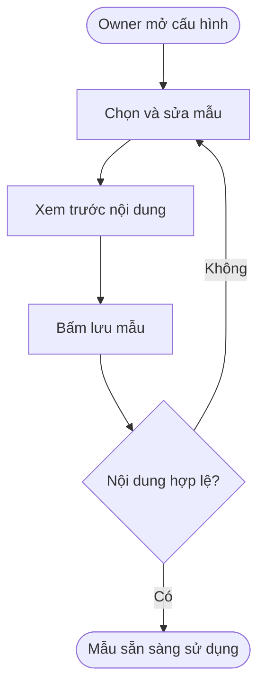
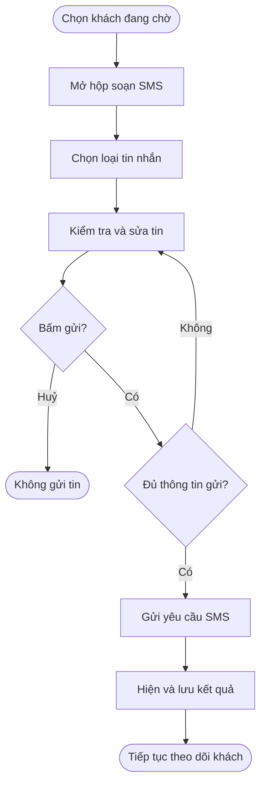
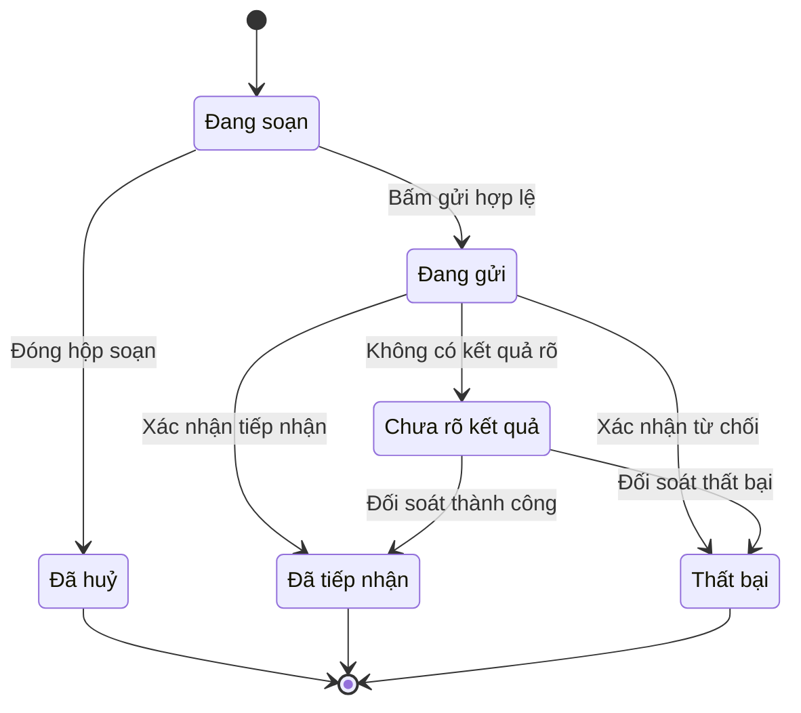

## Salon — SMS thủ công cho khách đang chờ

**Last Updated:** 2026-09-24

**Audience:** Salon Owner, Front Desk, Product Owner, BA, Developer, QA

**Status:** Draft

**Version:** 1.2

| Version | Date | Changes |
| :--- | :--- | :--- |
| 1.2 | 2026-09-24 | Gộp Wait Care vào Waitlist SMS, đổi tên thành Wait Update; một nút Save Templates lưu cả ba nhóm. |
| 1.1 | 2026-09-24 | Cập nhật HTML Settings sang thủ công và bổ sung hộp soạn SMS demo tại Live Waitlist. |
| 1.0 | 2026-09-24 | Mô tả hướng chuyển SMS hàng chờ sang gửi thủ công; tách cấu hình mẫu của Owner và thao tác gửi của lễ tân. |

### Overview

Tiệm hiện cần lễ tân chủ động quyết định khi nào liên hệ khách đang chờ. Salon Owner cấu hình mẫu SMS; lễ tân chọn khách trên Live Waitlist, chọn loại tin, kiểm tra nội dung rồi bấm gửi. Không tự gửi theo thời gian chờ, ETA hoặc trạng thái đến lượt.

Một tab **Waitlist SMS** gồm **Wait Update** (tên cũ: Wait Care), **Return Soon** và **Ready Now**. Welcome SMS và After Checkout giữ cấu hình riêng, không bị thay đổi bởi đề xuất này.

**Đối chiếu triển khai:** HTML đã đổi Automation Settings thành Waitlist SMS, bỏ timing/cách gửi tự động và Pause automation. Wait Update nằm trong cùng tab, giữ mẫu và công tắc cho phép lễ tân sử dụng; một nút Save Templates lưu cả ba nhóm. Live Waitlist đã có hộp chọn loại tin, nạp mẫu Owner lưu trong cùng trình duyệt, chỉnh tin cho từng khách, xác nhận thời gian chờ hoặc tình trạng sẵn sàng phục vụ và mô phỏng gửi. Settings và Front Desk cần chạy trên cùng origin để dùng chung mẫu lưu.

**Giới hạn prototype:** Danh sách khách, số điện thoại và Visit link là dữ liệu mẫu. Send Test không gửi thật; Send SMS (demo) chỉ ghi nhận lần mô phỏng gần nhất của từng khách trong phiên trang, không thay đổi hàng chờ. Chưa tích hợp dịch vụ SMS, dữ liệu khách thật, kiểm tra quyền nhận tin, lịch sử bền vững hoặc kết quả giao tin. Các quy tắc nghiệp vụ bên dưới mô tả đích triển khai; không suy ra các trạng thái gửi thật đã hoạt động. Các quy tắc automation trong tài liệu SMS Settings cũ không còn đại diện cho hướng thủ công này.

### Key Concepts

| Term | Definition |
| :--- | :--- |
| Waitlist SMS | Tab chứa ba nhóm mẫu: cập nhật chờ, nhắc quay lại và báo đã đến lượt. |
| Return Soon | Nhắc khách sắp đến lượt và nên quay lại tiệm; chưa khẳng định có thể bắt đầu phục vụ ngay. |
| Ready Now | Báo tiệm đã sẵn sàng phục vụ; lễ tân kiểm tra thực tế trước khi gửi. |
| Wait Update | Cập nhật việc phải chờ thêm và thời gian chờ dự kiến; không tự cấp ưu đãi. |
| Quick template | Nội dung gợi ý để Owner chọn nhanh, sửa và lưu thành mẫu đang sử dụng cho từng loại tin. |
| Visit link | Link OneQR gắn với lượt ghé của khách, dùng chung thời hạn tại Link Settings. |
| Send Test | Thử nội dung tới số điện thoại do Owner nhập khi có tích hợp thật; trong HTML hiện tại chỉ mô phỏng. |

### User Roles

| Role | Responsibilities in this Feature |
| :--- | :--- |
| Salon Owner / quản lý được cấp quyền | Chỉnh mẫu dùng chung, xem trước, lưu cấu hình và kiểm tra nội dung. |
| Front Desk / lễ tân được cấp quyền | Chọn đúng khách, xác nhận tình trạng chờ, sửa nội dung cho lần gửi và chủ động gửi SMS. |
| Khách hàng | Nhận tin nhắn liên quan đến lượt ghé của mình. |

### End-to-End Workflows

#### Workflow 1: Owner cấu hình mẫu SMS

**Primary Actor:** Salon Owner.

**Trigger:** Cần thiết lập hoặc đổi nội dung liên hệ khách đang chờ.

**Outcome:** Mẫu đã lưu được sử dụng khi lễ tân soạn tin mới.

**User Stories:**

- Là Salon Owner, tôi muốn chọn và sửa mẫu theo từng loại tin, để lễ tân dùng nội dung thống nhất.
- Là Salon Owner, tôi muốn xem nội dung đã thay biến và phát hiện trường còn thiếu, để tránh lưu mẫu không sử dụng được.

| Step | Who | Action | System Response | Notes |
| :--- | :--- | :--- | :--- | :--- |
| 1 | Owner | Mở SMS Settings → Waitlist SMS | Hiện mẫu đang lưu và phần xem trước | Hiện cả ba nhóm trong cùng tab. |
| 2 | Owner | Chọn Quick template, sửa nội dung, chèn biến cần thiết | Cập nhật ô soạn, số ký tự và bản xem trước | Mỗi loại có 2 mẫu gợi ý. |
| 3 | Owner | Nhập mã quốc gia, số điện thoại và bấm Send Test nếu cần | Kiểm tra nội dung và số nhận | Không gửi đến khách trên Waitlist; HTML chỉ mô phỏng. |
| 4 | Owner | Bấm Save Templates | Kiểm tra và lưu cả ba nhóm mẫu cùng lúc | Không gửi SMS cho khách khi lưu. |
| 5 | Hệ thống | Phát hiện nội dung rỗng hoặc biến không hỗ trợ | Hiện lỗi tại phần soạn và giữ nội dung đang sửa | Chưa thay thế mẫu đã lưu. |

#### Workflow 2: Lễ tân gửi SMS từ Live Waitlist

**Primary Actor:** Front Desk.

**Trigger:** Lễ tân cần nhắc khách quay lại, báo đã đến lượt hoặc cập nhật việc phải chờ thêm.

**Outcome:** Tin được gửi theo thao tác chủ động của lễ tân và có kết quả để theo dõi.

**User Stories:**

- Là lễ tân, tôi muốn chọn loại tin trên đúng khách đang chờ, để liên hệ nhanh mà không nhập lại số điện thoại.
- Là lễ tân, tôi muốn xem và sửa nội dung trước khi gửi, để thông tin phù hợp với tình hình thực tế.
- Là lễ tân, tôi muốn biết tin đang gửi, đã được tiếp nhận hay thất bại, để tránh gửi trùng hoặc hiểu nhầm khách đã nhận tin.

| Step | Who | Action | System Response | Notes |
| :--- | :--- | :--- | :--- | :--- |
| 1 | Lễ tân | Chọn khách → Send SMS trên Live Waitlist | Mở hộp soạn tin, hiển thị tên khách và số nhận có mã quốc gia | Chưa gửi ngay khi bấm nút trên thẻ khách. |
| 2 | Lễ tân | Chọn Return Soon, Ready Now hoặc Wait Update | Nạp mẫu Owner đã lưu, điền thông tin của khách và lượt ghé | Wait Update chỉ xuất hiện khi được bật. |
| 3 | Lễ tân | Kiểm tra số nhận, tình trạng khách và nội dung | Hiện đầy đủ tin sẽ gửi | Có thể sửa cho lần gửi này; không sửa mẫu dùng chung. |
| 4 | Lễ tân | Với tin có thời gian chờ, nhập hoặc xác nhận ước lượng hiện tại | Thay biến bằng thời gian đã xác nhận | Không lấy mốc nhắc tự động làm thời gian còn lại. |
| 5 | Lễ tân | Bấm Send SMS | Kiểm tra điều kiện, gửi yêu cầu và khoá nút trong lúc xử lý | Đóng hộp soạn trước khi bấm gửi thì không gửi. |
| 6 | Hệ thống | Nhận kết quả gửi | Hiện kết quả, ghi nhận người gửi, thời điểm, loại tin, số nhận và nội dung | Được dịch vụ tiếp nhận không đồng nghĩa khách đã nhận hoặc đọc. |
| 7 | Lễ tân | Xử lý tin thất bại hoặc kết quả chưa xác định | Cho xem lại thông tin; chỉ gửi lại khi lễ tân chủ động thao tác sau khi kiểm tra | Không tự gửi lại khi hết thời gian chờ phản hồi. |

### System Configuration & Administration

- Là Owner, tôi muốn Settings chỉ hiển thị những cấu hình tiệm đang sử dụng, để không nhầm rằng hệ thống tự điều phối hàng chờ.
- Là Owner, tôi muốn bật/tắt Wait Update để quyết định lễ tân có sử dụng nhóm tin này hay không. Bật chỉ cho phép sử dụng mẫu, không kích hoạt gửi tự động.

| Khu vực | Điều chỉnh đề xuất |
| :--- | :--- |
| Tên tab | Đổi Automation Settings → **Waitlist SMS**. |
| Tiêu đề | Đổi Waitlist Automation Setup → **Waitlist SMS Templates**. |
| Waitlist timing | Bỏ Return notice, No response grace và Internal ETA threshold. |
| Send mode | Bỏ lựa chọn Automatic, Manager approval và Manual; hiển thị hướng dẫn gửi thủ công bởi lễ tân. |
| Điều khiển automation | Bỏ trạng thái Waitlist automation ON/OFF và nút Pause/Resume automation. |
| Waitlist SMS | Gồm Wait Update, Return Soon và Ready Now; mỗi nhóm 2 Quick templates, Insert, ô sửa nội dung, Preview và Send Test. Một nút **Save Templates** lưu cả ba nhóm. |
| Wait Update | Gộp vào Waitlist SMS, giữ công tắc bật/tắt ở đầu nhóm và 2 mẫu delay; bỏ tab và nút lưu riêng. Không có Send mode, Waiting time since check-in hoặc quy tắc cấp ưu đãi. |
| Insert | Return Soon và Ready Now dùng Customer name, Shop name, Visit link. Wait Update bổ sung Wait time. Bỏ Return notice; không thêm biến cấp ưu đãi trong phạm vi tin cập nhật chờ này. |
| Link Settings | Giữ thời hạn Visit link dùng chung. Gửi lại SMS không gia hạn link. |
| Dữ liệu cũ | Giữ nội dung mẫu đã lưu; cấu hình thời gian, cách gửi và trạng thái automation cũ không còn tác dụng. Mẫu có biến Return notice cần được rà và sửa trước khi dùng, không tự thay bằng một số phút cố định. |

**Nội dung mẫu đề xuất:** Nội dung tiếng Anh dùng trong giao diện salon; Owner có thể chỉnh trước khi lưu.

| Loại tin | Quick template | Nội dung |
| :--- | :--- | :--- |
| Return Soon | Return reminder | Hi [Customer Name], your turn at [Salon Name] is coming up. Please return soon: [OneQR Link] |
| Return Soon | Head back now | Hi [Customer Name], please head back to [Salon Name]. Your turn is coming up: [OneQR Link] |
| Ready Now | Ready now | Hi [Customer Name], we're ready for you at [Salon Name]. Please come to the front desk. |
| Ready Now | Your turn | Hi [Customer Name], it's your turn at [Salon Name]. Please come to the front desk now. |
| Wait Update | Delay update | Hi [Customer Name], sorry for the wait at [Salon Name]. Estimated wait: [Wait Time]. Updates: [OneQR Link] |
| Wait Update | Wait time update | Hi [Customer Name], thanks for your patience at [Salon Name]. Estimated wait: [Wait Time]. Updates: [OneQR Link] |

### State Lifecycle

Trạng thái dưới đây thuộc **một lần gửi SMS**, không phải trạng thái hàng chờ của khách.

| Current Status | Trigger | New Status | Notes |
| :--- | :--- | :--- | :--- |
| Đang soạn | Lễ tân bấm gửi, nội dung hợp lệ | Đang gửi | Chặn bấm gửi lặp trong lúc xử lý. |
| Đang soạn | Lễ tân đóng hộp soạn | Đã huỷ | Không phát sinh gửi SMS. |
| Đang gửi | Dịch vụ xác nhận tiếp nhận | Đã tiếp nhận | Chưa xác nhận thiết bị của khách nhận tin. |
| Đang gửi | Có kết quả từ chối rõ ràng | Thất bại | Hiện lý do nếu có; lễ tân kiểm tra trước khi thử lại. |
| Đang gửi | Mất kết nối hoặc không xác định được kết quả | Chưa rõ kết quả | Không khẳng định thất bại và không tự gửi lại. |
| Chưa rõ kết quả | Đối soát được kết quả | Đã tiếp nhận hoặc Thất bại | Cập nhật cùng lần gửi. |

### Business Rules

1. Chỉ thao tác **Send SMS của lễ tân** mới khởi tạo gửi tin cho khách. Lưu mẫu, thay ETA hoặc khách chờ lâu không tự gửi SMS.
2. Mỗi lần gửi gắn với đúng khách và lượt ghé được chọn; hiển thị rõ người nhận trước khi gửi.
3. Return Soon không hứa chính xác còn bao nhiêu phút. Ready Now chỉ gửi sau khi lễ tân kiểm tra tiệm đã sẵn sàng phục vụ.
4. Nếu có Wait Time, lễ tân phải nhập hoặc xác nhận ước lượng hiện tại. Không gửi nguyên biến chưa được thay hoặc dùng giá trị demo làm dữ liệu thật.
5. Gửi tin không tự đổi vị trí hàng chờ, đánh dấu Arrived, bắt đầu dịch vụ hoặc kết thúc lượt ghé.
6. Wait Update là tin cập nhật việc chờ; không tự cộng Points, tạo voucher hay cấp Benefit. Thao tác ưu đãi thuộc luồng riêng.
7. Sửa nội dung cho một lần gửi không thay đổi mẫu Owner đã lưu. Tin đã gửi giữ nguyên nội dung trong lịch sử.
8. Không áp dụng giới hạn tự động một tin cho mỗi lượt ghé. Nếu cần gửi thêm, lễ tân xem lần liên hệ trước và chủ động tạo lần gửi mới; hệ thống ngăn gửi trùng do bấm lặp.
9. Trước khi gửi, kiểm tra khách còn trong hàng chờ, số nhận hợp lệ và trạng thái cho phép nhận SMS. Nếu không đạt, thông báo rõ và không gửi.

### Edge Cases & Exception Handling

| Scenario | What Happens | Who Resolves It |
| :--- | :--- | :--- |
| Thiếu số điện thoại hoặc số không hợp lệ | Chặn gửi; yêu cầu cập nhật thông tin khách | Lễ tân. |
| Thiếu tên khách hoặc biến bắt buộc chưa có giá trị | Đánh dấu phần thiếu; cho sửa lời chào hoặc bổ sung thông tin trước khi gửi | Lễ tân. |
| Chưa biết thời gian chờ | Không dùng số phút mẫu; lễ tân sửa tin để bỏ lời hẹn thời gian hoặc xác nhận ước lượng | Lễ tân. |
| Khách đã rời hàng chờ khi hộp soạn còn mở | Kiểm tra lại lúc gửi và chặn tin hàng chờ không còn phù hợp | Hệ thống và lễ tân. |
| Khách không phản hồi | Lễ tân chủ động xem xét gọi điện hoặc liên hệ lại; không tự chuyển No Response sau một mốc thời gian | Lễ tân. |
| Tin bị từ chối hoặc kết quả chưa rõ | Hiện đúng trạng thái; không báo khách đã nhận tin, không tự gửi lại | Hệ thống và lễ tân. |
| Wait Update bị tắt | Không cho chọn/gửi Wait Update; Return Soon và Ready Now vẫn sử dụng được | Owner quản lý cấu hình. |

**Tiêu chí nghiệm thu chính:**

- Waitlist SMS không còn các trường timing, lựa chọn cách gửi hoặc nút Pause/Resume automation.
- Wait Update không còn mốc kích hoạt tự động; công tắc chỉ kiểm soát việc sử dụng nhóm mẫu.
- Một tab Waitlist SMS chứa ba nhóm, mỗi loại có 2 mẫu gợi ý; chọn mẫu và Insert cập nhật đúng nội dung và Preview.
- Một nút Save Templates lưu cả ba nhóm; mẫu Wait Care và trạng thái bật/tắt đã lưu trước đây được giữ lại trong Wait Update. Lưu lỗi không ghi dở một phần cấu hình.
- Bấm Send SMS trên thẻ khách chỉ mở hộp soạn; chỉ nút gửi bên trong mới tạo yêu cầu gửi.
- Mẫu Owner lưu được nạp khi lễ tân soạn tin mới; chỉnh một lần gửi không ghi đè mẫu chung.
- Biến thiếu, số nhận không hợp lệ hoặc khách không còn trong hàng chờ đều chặn gửi.
- Đổi thời gian chờ, trạng thái khách, lưu mẫu hoặc tải lại trang không tự gửi SMS.
- Lưu cấu hình và Send Test trên HTML vẫn phải nói rõ giới hạn mô phỏng cho đến khi có tích hợp thật.

### Frequently Asked Questions

**Owner có gửi tin cho khách tại Settings không?**

Không. Settings dùng để quản lý mẫu và thử nội dung. Gửi cho khách thực hiện tại Live Waitlist.

**Return Soon và Ready Now có gửi liên tiếp tự động không?**

Không. Lễ tân quyết định từng lần gửi theo tình trạng thực tế.

**Bật Wait Update có tự nhắn khi khách chờ lâu không?**

Không. Bật chỉ cho phép lễ tân sử dụng nhóm tin Wait Update.

**Phần này đã có trên HTML chưa?**

Đã có cấu hình mẫu thủ công và hộp soạn/gửi demo ở Live Waitlist. Gửi SMS thật, dữ liệu khách/lượt ghé, phân quyền và lịch sử gửi bền vững vẫn cần tích hợp; xem giới hạn prototype ở đầu tài liệu.

### Related Features

- [Front Desk — Live Waitlist](front-desk-live-waitlist.md): màn hình lễ tân và thao tác liên hệ khách.
- [Salon SMS Settings](pos-salon-sms-settings.md): tài liệu nền, có mô tả automation cũ cần đối chiếu với đề xuất này.
- [HTML Salon Settings](../../html/pages/pos-salon-settings.html).
- [Mã giao diện SMS Settings](../../html/assets/pos-salon-sms-settings.js).
- [Mã giao diện Live Waitlist](../../html/assets/front-desk-waitlist.js).
