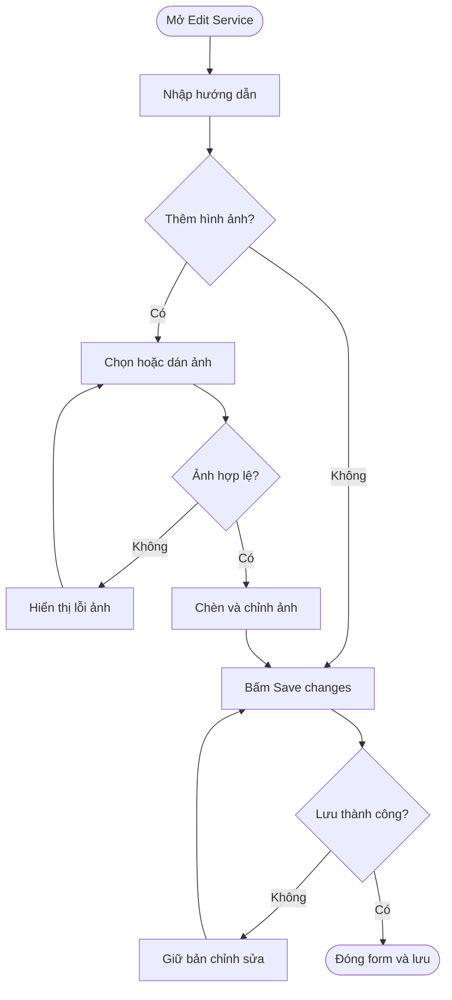
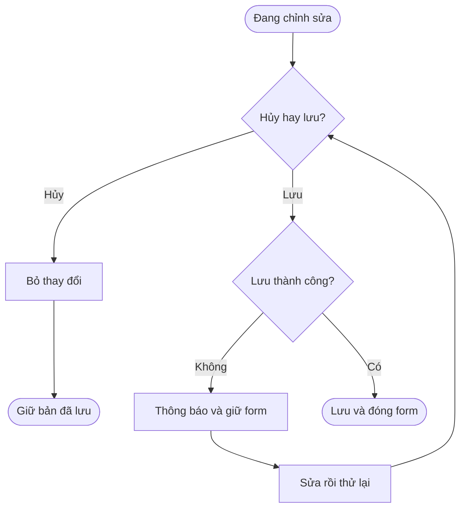

## POS — Steps / Materials

**Last Updated:** 2026-09-11

**Audience:** Product Owner, BA, QA, quản lý salon, đội phát triển

**Status:** Draft

### Overview

Steps / Materials cho phép người quản lý salon lưu hướng dẫn thực hiện dịch vụ bằng văn bản có định dạng và hình ảnh minh họa. Nội dung nằm trong POS → Salon Settings → Services → Edit Service, ở cuối form, sau Service image và trước Cancel / Save changes.

### Key Concepts

| Thuật ngữ | Ý nghĩa |
| :--- | :--- |
| Steps | Các bước thực hiện dịch vụ; có thể trình bày bằng danh sách đánh số. |
| Materials | Nguyên vật liệu sử dụng, số lượng, cách dùng và lưu ý được nhập dưới dạng mô tả. |
| Steps / Materials | Một editor chung chứa các bước, nguyên vật liệu và ảnh xen kẽ nội dung chữ. |
| Service image | Ảnh đại diện riêng của dịch vụ; độc lập với ảnh minh họa trong editor. |
| Bản chỉnh sửa | Nội dung đang nhập, chưa được lưu bằng Save changes. |

### User Roles

| Vai trò | Trách nhiệm |
| :--- | :--- |
| Người quản lý cấu hình dịch vụ | Nhập, định dạng, chèn ảnh, kiểm tra và lưu hướng dẫn cho từng dịch vụ. |
| QA | Kiểm tra nhập liệu, hình ảnh, lưu/mở lại, hủy chỉnh sửa và xử lý lỗi. |

Vai trò trên mô tả đối tượng sử dụng. Bản HTML chưa bổ sung cơ chế phân quyền riêng cho trường Steps / Materials.

### End-to-End Workflows

#### Workflow: Soạn và lưu hướng dẫn dịch vụ

**Primary Actor:** Người quản lý cấu hình dịch vụ.

**Trigger:** Mở View / Edit của một dịch vụ trong Services.

**Outcome:** Nội dung và hình ảnh được lưu cùng dịch vụ, hiển thị lại khi mở Edit Service.

**User Stories:**

- **US-01 — Soạn hướng dẫn:** Là người quản lý salon, tôi muốn nhập các bước thực hiện và nguyên vật liệu trong một editor có định dạng, để lưu hướng dẫn rõ ràng và thống nhất theo từng dịch vụ.
- **US-02 — Chèn ảnh minh họa:** Là người quản lý salon, tôi muốn chọn ảnh từ thiết bị hoặc dán ảnh từ clipboard tại vị trí con trỏ, để minh họa thao tác, nguyên vật liệu và kết quả mong muốn.
- **US-03 — Điều chỉnh ảnh:** Là người quản lý salon, tôi muốn thay đổi kích thước hiển thị và xóa từng ảnh, để nội dung hướng dẫn dễ đọc và đúng với dịch vụ.
- **US-04 — Lưu và xem lại:** Là người quản lý salon, tôi muốn lưu nội dung chữ, định dạng và hình ảnh cùng dịch vụ, để tiếp tục xem và chỉnh sửa trong các lần mở sau.
- **US-05 — Nội dung tùy chọn:** Là người quản lý salon, tôi muốn để trống hoặc xóa hướng dẫn đã nhập, để cấu hình dịch vụ phù hợp với nhu cầu thực tế.

| Bước | Người thực hiện | Thao tác | Phản hồi hệ thống | Ghi chú |
| :--- | :--- | :--- | :--- | :--- |
| 1 | Quản lý | Vào Services, mở View / Edit | Hiển thị Edit Service và nội dung đã lưu | Dịch vụ chưa có hướng dẫn hiển thị editor trống. |
| 2 | Quản lý | Đến Steps / Materials cuối form | Hiển thị editor và thanh công cụ | Trường không bắt buộc. |
| 3 | Quản lý | Nhập bước thực hiện, nguyên vật liệu, số lượng, lưu ý | Cho phép nhiều dòng và định dạng chữ | Một editor chung cho toàn bộ nội dung. |
| 4 | Quản lý | Đặt con trỏ, bấm Image và chọn một hoặc nhiều ảnh; hoặc dán ảnh từ clipboard | Kiểm tra định dạng/dung lượng, hiển thị Adding images… và tạm khóa Save changes trong lúc đọc ảnh | Ảnh hợp lệ được chèn tại con trỏ; nếu chưa đặt con trỏ thì chèn cuối nội dung. |
| 5 | Quản lý | Bấm một ảnh trong editor | Đánh dấu ảnh đang chọn và hiện Small / Medium / Large / Remove image | Thay đổi kích thước giữ tỷ lệ ảnh. |
| 6 | Quản lý | Bấm Save changes | Kiểm tra form, lưu nội dung và ảnh cùng dịch vụ, đóng form khi thành công | Các trường bắt buộc khác của dịch vụ vẫn phải hợp lệ. |
| 7 | Quản lý | Mở lại View / Edit | Hiển thị nội dung và thứ tự ảnh đã lưu | Một dịch vụ ở nhiều category dùng cùng hướng dẫn. |

#### Workflow: Hủy chỉnh sửa hoặc xử lý lỗi

**Primary Actor:** Người quản lý cấu hình dịch vụ.

**Trigger:** Muốn bỏ thay đổi, ảnh không hợp lệ hoặc lưu thất bại.

**Outcome:** Nội dung đã lưu được giữ nguyên; người dùng có thể sửa lỗi và thử lại.

**User Stories:**

- **US-06 — Hủy thay đổi:** Là người quản lý salon, tôi muốn Cancel hoặc đóng form để bỏ các thay đổi chưa lưu, bao gồm thêm/xóa/đổi kích thước ảnh, để không ghi đè hướng dẫn đang sử dụng.
- **US-07 — Khắc phục lỗi:** Là người quản lý salon, tôi muốn nhận thông báo khi ảnh không hợp lệ hoặc lưu thất bại và giữ nội dung đang nhập, để sửa lỗi mà không phải soạn lại.

| Bước | Người thực hiện | Thao tác | Phản hồi hệ thống | Ghi chú |
| :--- | :--- | :--- | :--- | :--- |
| 1 | Quản lý | Chỉnh nội dung hoặc ảnh | Giữ thay đổi trong form đang mở | Chưa thay đổi nội dung đã lưu. |
| 2a | Quản lý | Bấm Cancel hoặc đóng form | Bỏ thay đổi chưa lưu | Ảnh đọc xong sau khi đóng form không được chèn vào lần chỉnh sửa tiếp theo. |
| 2b | Hệ thống | Phát hiện ảnh không hợp lệ hoặc lỗi đọc ảnh | Hiển thị thông báo; không chèn nhóm ảnh lỗi | Giữ nội dung trước thao tác thêm ảnh. |
| 2c | Hệ thống | Không lưu được dịch vụ | Giữ form mở và nội dung hiện tại, hiển thị lỗi | Có thể giảm số lượng/dung lượng ảnh rồi thử lại. |
| 3 | Quản lý | Mở lại sau khi hủy hoặc thử lưu lại sau khi sửa lỗi | Nạp bản đã lưu hoặc lưu bản chỉnh sửa thành công | Không tự động lưu khi đóng form. |

### System Configuration & Administration

- Steps / Materials là trường tùy chọn; có thể lưu chỉ chữ, chỉ ảnh, chữ xen kẽ ảnh hoặc để trống.
- Bản HTML lưu cấu hình theo salon trong bộ nhớ trình duyệt (localStorage). Dữ liệu chưa được tải lên máy chủ hoặc đồng bộ giữa thiết bị.
- Người dùng quản lý category qua chức năng Services hiện có; thay đổi category không tạo hướng dẫn riêng cho cùng một dịch vụ.
- Custom service hiện khóa chỉnh sửa Steps / Materials, giống các thông tin cố định khác của dịch vụ này.

### State Lifecycle

Steps / Materials không có trạng thái nghiệp vụ độc lập hoặc quy trình phê duyệt. Bản chỉnh sửa chỉ tồn tại trong form đến khi người dùng lưu hoặc hủy. Adding images… là thông báo xử lý tạm thời.

### Business Rules

1. **Định dạng chữ:** hỗ trợ đậm, nghiêng, gạch chân, danh sách đánh số, danh sách gạch đầu dòng và xóa định dạng chữ.
2. **Hình ảnh:** chấp nhận JPG/JPEG, PNG, WebP; tối đa 10 MB mỗi ảnh. Có thể chọn nhiều ảnh trong một lần.
3. **Kích thước:** ảnh mặc định Medium (320 px); Small 160 px và Large 480 px. Ảnh tự thu nhỏ theo chiều rộng editor, giữ tỷ lệ. Đổi kích thước hiển thị không nén file ảnh.
4. **Nguồn ảnh:** hỗ trợ file từ thiết bị và ảnh clipboard. Không tải ảnh từ đường dẫn bên ngoài; nội dung dán được lọc để loại bỏ mã thực thi và ảnh không được hỗ trợ.
5. **Lưu dữ liệu:** Save changes lưu cả chữ và ảnh. Khi đang đọc ảnh, không cho lưu dịch vụ để tránh lưu thiếu nội dung.
6. **Giới hạn tổng:** không đặt số lượng ảnh tối đa riêng; khả năng lưu phụ thuộc dung lượng còn lại của trình duyệt. Ảnh dưới 10 MB vẫn có thể khiến tổng dữ liệu vượt giới hạn lưu trữ.
7. **Đồng nhất dịch vụ:** cùng một dịch vụ thuộc nhiều category vẫn dùng chung Steps / Materials.
8. **Xóa nội dung:** xóa hết chữ và ảnh rồi lưu sẽ xóa hướng dẫn trước đó. Nội dung chỉ có khoảng trắng/xuống dòng được coi là trống.
9. **Phạm vi nghiệp vụ:** mô tả nguyên vật liệu không tự tính Supply Fee, không tự trừ tồn kho và không thay đổi giá dịch vụ.
10. **Phạm vi hiển thị:** tính năng hiện áp dụng trong Edit Service; chưa bổ sung màn hình hướng dẫn riêng cho thợ hoặc hiển thị cho khách.

### Acceptance Criteria

| ID | Điều kiện / Thao tác | Kết quả nghiệm thu |
| :--- | :--- | :--- |
| AC-01 | Mở Edit Service | Steps / Materials ở cuối form, sau Service image, trước các nút lưu/hủy. |
| AC-02 | Nhập nhiều dòng và dùng thanh công cụ chữ | Hiển thị đúng định dạng; lưu và mở lại giữ định dạng được hỗ trợ. |
| AC-03 | Đặt con trỏ giữa nội dung, chọn ảnh hợp lệ | Ảnh chèn tại vị trí con trỏ, không xóa phần chữ ngoài vùng chọn. |
| AC-04 | Chọn nhiều ảnh hợp lệ | Chèn đủ ảnh theo thứ tự danh sách file nhận từ thiết bị, có thể xen kẽ với chữ. |
| AC-05 | Dán ảnh từ clipboard | Ảnh được kiểm tra và chèn vào nội dung. |
| AC-06 | Chọn ảnh và bấm Small / Medium / Large | Chỉ ảnh đang chọn thay đổi kích thước, giữ tỷ lệ và không tràn editor. |
| AC-07 | Chọn ảnh rồi bấm Remove image | Xóa đúng ảnh, giữ nội dung và các ảnh còn lại. |
| AC-08 | Lưu nội dung chỉ có ảnh | Mở lại vẫn hiển thị ảnh. |
| AC-09 | Lưu dịch vụ có chữ và ảnh, mở lại | Giữ nội dung, thứ tự, định dạng và kích thước ảnh đã lưu. |
| AC-10 | Dịch vụ thuộc nhiều category | Mở dịch vụ từ các category hiển thị cùng hướng dẫn. |
| AC-11 | Thêm/xóa/đổi kích thước ảnh rồi Cancel | Mở lại phục hồi bản đã lưu, bỏ toàn bộ thay đổi chưa lưu. |
| AC-12 | Đóng form trong lúc đọc ảnh rồi mở dịch vụ khác | Ảnh đang đọc không xuất hiện ở dịch vụ khác. |
| AC-13 | Xóa toàn bộ chữ và ảnh rồi lưu | Mở lại editor trống. |
| AC-14 | Chọn ảnh sai định dạng hoặc lớn hơn 10 MB | Hiển thị lỗi; không chèn nhóm ảnh được chọn trong lần đó. |
| AC-15 | Đọc ảnh thất bại | Hiển thị lỗi, giữ nội dung hiện có và cho phép thử lại. |
| AC-16 | Đang đọc ảnh | Save changes bị khóa; được mở lại khi việc đọc ảnh hoàn tất hoặc thất bại. |
| AC-17 | Bộ nhớ trình duyệt không đủ khi lưu | Không đóng form, không ghi đè bản đã lưu; giữ nội dung đang nhập và báo lỗi. |
| AC-18 | Mở Custom service | Không thể nhập nội dung hoặc chèn ảnh vào Steps / Materials. |

### Edge Cases & Exception Handling

| Tình huống | Xử lý | Người giải quyết |
| :--- | :--- | :--- |
| Dịch vụ cũ chưa có Steps / Materials | Editor trống; có thể bổ sung hướng dẫn | Quản lý |
| Nhóm file chứa ảnh quá lớn hoặc sai định dạng | Không chèn nhóm file đó; thông báo định dạng/dung lượng hợp lệ | Quản lý chọn lại |
| File lỗi hoặc không đọc được | Không chèn ảnh; thông báo lỗi | Quản lý chọn file khác |
| Tổng ảnh vượt dung lượng lưu của trình duyệt | Giữ form và nội dung, báo không lưu được | Quản lý giảm số lượng hoặc dung lượng ảnh |
| Dán nội dung có ảnh từ URL bên ngoài hoặc mã không an toàn | Lọc phần không hỗ trợ, giữ chữ/định dạng hợp lệ | Quản lý chèn ảnh bằng file hoặc clipboard |
| Rời trang hoặc tải lại trước khi lưu | Không bảo đảm giữ bản chỉnh sửa | Quản lý lưu trước khi rời trang |

### Frequently Asked Questions

**Steps / Materials có bắt buộc không?**

Không. Có thể lưu dịch vụ mà không nhập trường này.

**Ảnh minh họa có thay ảnh Service image không?**

Không. Service image là ảnh đại diện riêng; ảnh trong editor thuộc nội dung hướng dẫn.

**Chọn Small có giúp giảm dung lượng lưu không?**

Không. Small chỉ đổi kích thước hiển thị. Muốn giảm dung lượng, cần chọn file ảnh nhỏ hơn.

**Ảnh có được lưu và xem trên thiết bị khác không?**

Bản HTML hiện lưu trong trình duyệt đang dùng; chưa có đồng bộ máy chủ.

### Related Features

- [POS Salon Settings — HTML](../../html/pages/pos-salon-settings.html): Services, Categories, Service image, Supply Fee và cấu hình dịch vụ.
- [Technician Overview](technician-overview.md): thông tin nghiệp vụ liên quan đến thợ; việc hiển thị hướng dẫn cho thợ là phạm vi riêng.
