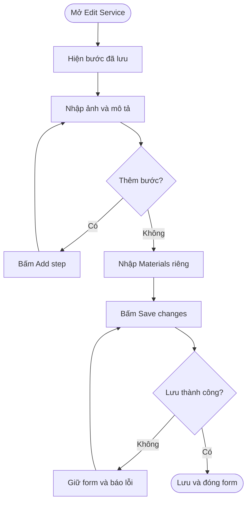
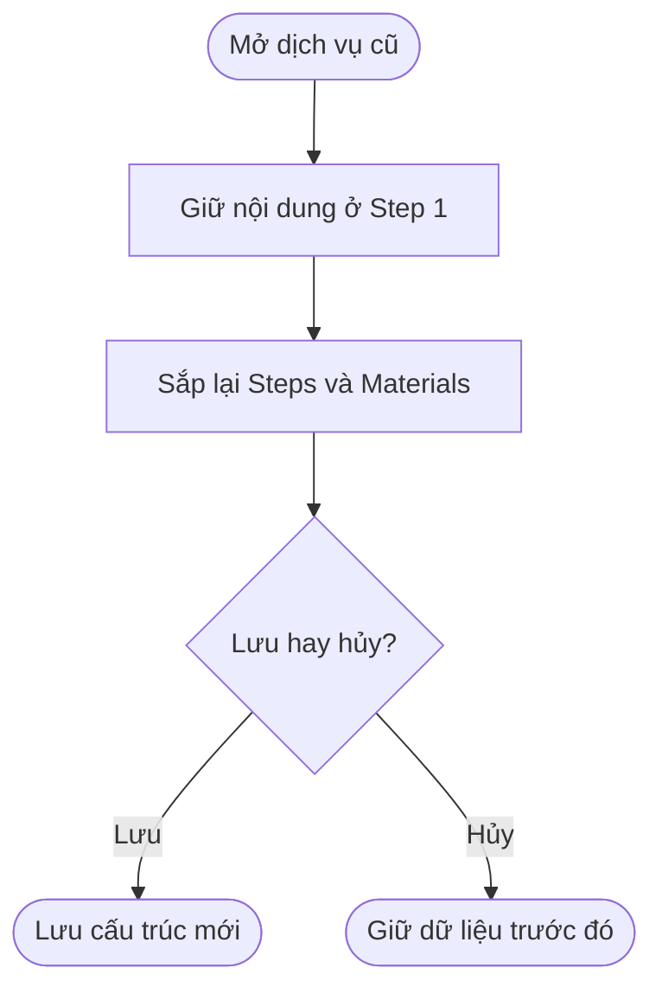

## POS — Steps và Materials

**Last Updated:** 2026-09-11

**Audience:** Product Owner, BA, QA, quản lý salon, đội phát triển

**Status:** Draft

### Overview

Quản lý salon cấu hình hướng dẫn dịch vụ bằng danh sách Steps và một editor Materials riêng. Vị trí: POS → Salon Settings → Services → Edit Service, cuối form sau Service image. Mỗi Step có một ảnh minh họa riêng, Title và Description có định dạng. Form mặc định hiện Step 1 và nút Add step.

### Key Concepts

| Thuật ngữ | Ý nghĩa |
| :--- | :--- |
| Step | Một bước thực hiện, gồm Image, Title và Description. |
| Image | Một ảnh minh họa riêng cho bước; chọn ảnh mới sẽ thay ảnh đang có. |
| Description | Mô tả chi tiết thao tác bằng editor có định dạng. |
| Materials | Editor riêng nhập nguyên vật liệu, số lượng và lưu ý cho toàn bộ dịch vụ. |
| Service image | Ảnh đại diện dịch vụ, độc lập với ảnh của các Step. |

### User Roles

| Vai trò | Trách nhiệm |
| :--- | :--- |
| Người quản lý cấu hình dịch vụ | Soạn Steps, chọn ảnh, nhập Materials và lưu hướng dẫn. |
| QA | Kiểm tra thêm/xóa bước, ảnh, định dạng, lưu/hủy và dữ liệu cũ. |

Bản HTML chưa bổ sung cơ chế phân quyền riêng cho chức năng này.

### End-to-End Workflows

#### Workflow: Cấu hình Steps và Materials

**Primary Actor:** Người quản lý cấu hình dịch vụ.

**Trigger:** Mở View / Edit của một dịch vụ.

**Outcome:** Danh sách bước và Materials được lưu cùng dịch vụ.

**User Stories:**

- **US-01:** Là quản lý salon, tôi muốn thấy sẵn Step 1 với các ô Image, Title và Description, để bắt đầu soạn hướng dẫn ngay.
- **US-02:** Là quản lý salon, tôi muốn bấm Add step để thêm bước và Remove để xóa bước, để mô tả đúng trình tự thực hiện dịch vụ.
- **US-03:** Là quản lý salon, tôi muốn chụp ảnh, chọn hoặc thay ảnh minh họa riêng cho từng bước, để nhân viên dễ hiểu thao tác cần làm.
- **US-04:** Là quản lý salon, tôi muốn nhập Materials trong editor riêng, để phân biệt nguyên vật liệu chuẩn bị với các bước thực hiện.
- **US-05:** Là quản lý salon, tôi muốn lưu toàn bộ Steps và Materials cùng dịch vụ và xem lại khi mở form, để tiếp tục cập nhật hướng dẫn.

| Bước | Người thực hiện | Thao tác | Phản hồi hệ thống | Ghi chú |
| :--- | :--- | :--- | :--- | :--- |
| 1 | Quản lý | Mở Edit Service | Nạp dữ liệu đã lưu; hiện Step 1 nếu chưa có bước | Steps và Materials đều tùy chọn. |
| 2 | Quản lý | Nhập Title và Description | Nhận tiêu đề và nội dung có định dạng | Title tối đa 120 ký tự. |
| 3 | Quản lý | Bấm Take photo để chụp hoặc Choose image để chọn file | Kiểm tra file, hiển thị Adding image…, gắn ảnh vào đúng bước | Một ảnh riêng mỗi bước. |
| 4 | Quản lý | Bấm Add step | Thêm bước trống cuối danh sách, đánh số tiếp theo, đặt con trỏ vào Title | Giữ nội dung các bước trước. |
| 5 | Quản lý | Bấm Remove ở một bước | Xóa bước và đánh số lại | Xóa bước cuối sẽ tạo Step 1 trống. |
| 6 | Quản lý | Nhập Materials | Hiển thị nội dung nguyên vật liệu riêng bên dưới Steps | Áp dụng chung cho dịch vụ. |
| 7 | Quản lý | Bấm Save changes | Kiểm tra form, lưu Steps và Materials rồi đóng form | Các trường bắt buộc khác vẫn phải hợp lệ. |

#### Workflow: Hủy chỉnh sửa và khôi phục dữ liệu cũ

**Primary Actor:** Người quản lý cấu hình dịch vụ.

**Trigger:** Mở dịch vụ từng dùng editor Steps / Materials chung hoặc muốn hủy thay đổi.

**Outcome:** Giữ nội dung cũ và chỉ cập nhật dữ liệu khi lưu thành công.

**User Stories:**

- **US-06:** Là quản lý salon, tôi muốn giữ lại nội dung chữ và ảnh đã nhập trong editor cũ, để không phải soạn lại khi chuyển sang form mới.
- **US-07:** Là quản lý salon, tôi muốn Cancel để bỏ các thay đổi và nhận thông báo khi ảnh/lưu dữ liệu thất bại, để bảo vệ hướng dẫn đã lưu.

| Bước | Người thực hiện | Thao tác | Phản hồi hệ thống | Ghi chú |
| :--- | :--- | :--- | :--- | :--- |
| 1 | Quản lý | Mở dịch vụ có nội dung cũ | Đưa toàn bộ nội dung chung cũ vào Description của Step 1; Materials để trống | Giữ ảnh và định dạng được hỗ trợ; không tự đoán cách chia nội dung. |
| 2a | Quản lý | Phân chia lại nội dung rồi lưu | Lưu Steps và Materials theo cấu trúc mới | Lần mở sau dùng cấu trúc mới. |
| 2b | Quản lý | Cancel hoặc đóng form | Bỏ thay đổi chưa lưu | Không ghi đè bản đã lưu. |
| 3 | Hệ thống | Ảnh đọc xong sau khi bước đã bị xóa hoặc form đã đóng | Bỏ kết quả đọc ảnh | Không gắn ảnh nhầm sang bước/dịch vụ khác. |

### System Configuration & Administration

- Bản HTML lưu cấu hình theo salon trong bộ nhớ trình duyệt (localStorage); chưa đồng bộ máy chủ/thiết bị.
- Một dịch vụ thuộc nhiều category dùng chung Steps và Materials.
- Custom service khóa chỉnh sửa các trường này theo hành vi cấu hình hiện có.

### State Lifecycle

Steps và Materials không có trạng thái nghiệp vụ hay quy trình phê duyệt độc lập. Thay đổi nằm trong form cho đến khi lưu hoặc hủy; Adding image… là thông báo xử lý tạm thời.

### Business Rules

1. Luôn hiện ít nhất một bước. Bước trống và Materials trống không chặn lưu dịch vụ.
2. Các bước được đánh số theo thứ tự hiển thị, tự cập nhật sau khi thêm/xóa.
3. Mỗi bước có hai nút Take photo và Choose image, cùng cập nhật một ảnh riêng. Take photo yêu cầu camera sau trên thiết bị hỗ trợ; trên máy tính, trình duyệt có thể mở bộ chọn file. Ảnh mới thay ảnh hiện tại; Remove image chỉ xóa ảnh, giữ Title và Description.
4. Chấp nhận JPG/JPEG, PNG, WebP tối đa 10 MB mỗi ảnh. Có thể dán một ảnh từ clipboard khi đặt con trỏ trong Description; ảnh được gắn vào ô Image của bước đó.
5. Description và Materials hỗ trợ đậm, nghiêng, gạch chân, danh sách đánh số/gạch đầu dòng và xóa định dạng chữ.
6. Ảnh trong nội dung cũ vẫn được giữ trong Description để không mất dữ liệu. Không tự tách ảnh/chữ cũ sang các bước hoặc Materials.
7. Save changes bị khóa khi đang đọc ảnh; lỗi đọc ảnh giữ lại nội dung và ảnh trước đó.
8. Nếu không đủ bộ nhớ khi lưu, giữ form mở và nội dung đang nhập; người dùng có thể giảm dung lượng/số ảnh rồi thử lại.
9. Materials chỉ là mô tả, không tự tính Supply Fee hoặc trừ tồn kho.
10. Chức năng hiện áp dụng trong Edit Service; chưa bổ sung màn hình hướng dẫn riêng cho thợ/khách.

### Acceptance Criteria

| ID | Thao tác / Điều kiện | Kết quả |
| :--- | :--- | :--- |
| AC-01 | Mở dịch vụ chưa có hướng dẫn | Có Step 1 gồm Image, Title, Description; Materials riêng bên dưới. |
| AC-02 | Bấm Add step | Thêm bước cuối, đánh số tiếp theo, không mất nội dung đang nhập. |
| AC-03 | Xóa một bước giữa danh sách | Xóa đúng bước, giữ các bước còn lại và đánh số liên tục. |
| AC-04 | Xóa bước cuối cùng | Hiện một Step 1 trống. |
| AC-05 | Chụp/chọn/thay/xóa ảnh ở một bước | Chỉ ảnh của bước đó thay đổi; Title, Description và các bước khác giữ nguyên. |
| AC-06 | Nhập và định dạng Description / Materials | Hai vùng nội dung độc lập; lưu/mở lại giữ định dạng được hỗ trợ. |
| AC-07 | Lưu nhiều bước và Materials, mở lại | Giữ đúng thứ tự, tiêu đề, mô tả, ảnh và Materials. |
| AC-08 | Cancel sau khi thêm/xóa bước hoặc ảnh | Mở lại thấy bản đã lưu trước đó. |
| AC-09 | Mở dịch vụ dùng editor cũ | Chữ và ảnh cũ có trong Description của Step 1; Materials trống. |
| AC-10 | Lưu cấu trúc mới, xóa nội dung rồi lưu lại | Nội dung cũ không tự xuất hiện trở lại. |
| AC-11 | Ảnh sai định dạng, quá lớn hoặc không đọc được | Hiển thị lỗi; giữ ảnh và nội dung trước thao tác. |
| AC-12 | Xóa bước/đóng form trong lúc đọc ảnh | Không gắn kết quả đọc ảnh vào bước hoặc dịch vụ khác. |
| AC-13 | Lưu thất bại do bộ nhớ đầy | Giữ form và bản đang nhập; không ghi đè dữ liệu đã lưu. |
| AC-14 | Mở cùng dịch vụ từ category khác | Hiển thị cùng Steps và Materials. |
| AC-15 | Mở Custom service | Không thêm/xóa bước, sửa nội dung hoặc ảnh. |

### Edge Cases & Exception Handling

| Tình huống | Xử lý | Người giải quyết |
| :--- | :--- | :--- |
| Không có bước hoặc danh sách rỗng | Hiện Step 1 trống | Hệ thống |
| Chưa rõ phần nào của nội dung cũ là nguyên vật liệu | Giữ toàn bộ ở Description Step 1 | Quản lý tự phân chia |
| Ảnh bị lỗi hoặc quá 10 MB | Báo lỗi, giữ ảnh trước đó | Quản lý chọn lại |
| Bộ nhớ trình duyệt không đủ | Giữ bản đang nhập và báo lỗi | Quản lý giảm số lượng/dung lượng ảnh |
| Tải lại trang trước khi lưu | Không bảo đảm giữ bản chỉnh sửa | Quản lý lưu trước khi rời trang |

### Frequently Asked Questions

**Có bắt buộc nhập đủ cả ảnh, Title và Description không?**

Không. Steps và Materials đều tùy chọn.

**Materials có phải nhập lại cho mỗi bước không?**

Không. Materials là một editor chung cho toàn bộ dịch vụ.

**Nội dung từ bản editor cũ nằm ở đâu?**

Trong Description của Step 1, gồm cả chữ và ảnh hợp lệ. Người quản lý có thể tự chia thành nhiều bước và chuyển nguyên vật liệu sang Materials.

### Related Features

- [POS Salon Settings — HTML](../../html/pages/pos-salon-settings.html): Services, Categories, Service image, Supply Fee.
