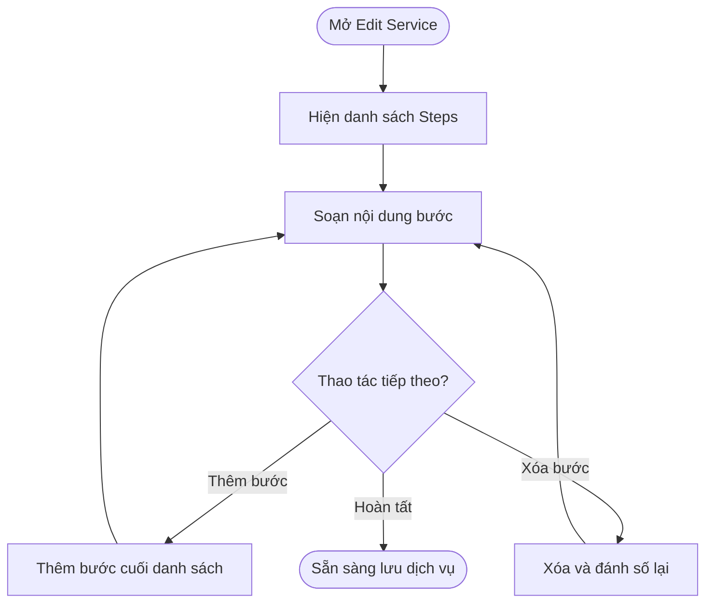
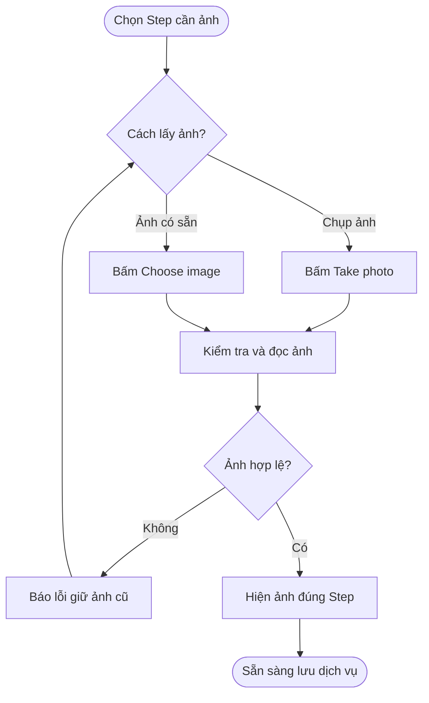
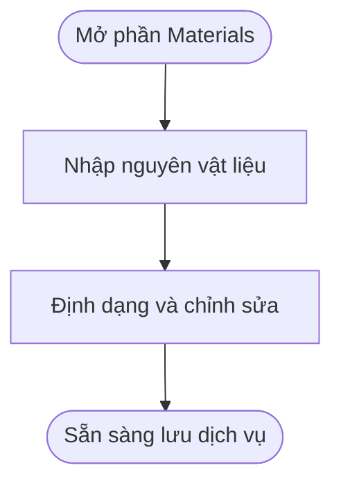
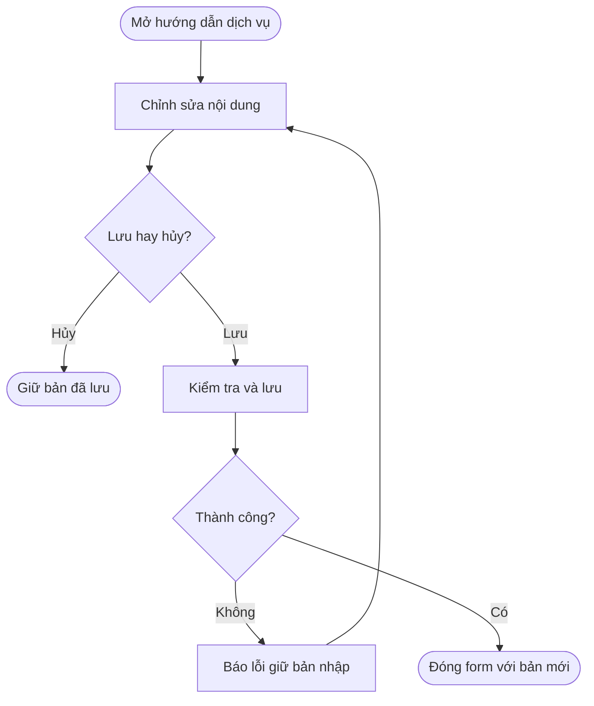

## POS — Cấu hình Steps và Materials cho dịch vụ

**Last Updated:** 2026-09-11

**Audience:** Product Owner, BA, QA, quản lý salon, đội phát triển

**Status:** Draft

### Overview

Quản lý salon nhập hướng dẫn thực hiện dịch vụ bằng danh sách **Steps** và nội dung chuẩn bị **Materials** riêng. Mỗi Step gồm ảnh minh họa, tiêu đề và mô tả bằng editor; Materials dùng một editor chung cho toàn bộ dịch vụ. Tính năng giúp quản lý trình bày rõ thứ tự thao tác và nguyên vật liệu cần chuẩn bị.

**Vị trí:** POS → Salon Settings → Services → View / Edit → Edit Service. Steps nằm gần cuối form, sau Require approval; Materials nằm dưới danh sách Steps và nút Add step.

Tài liệu mô tả hành vi của bản HTML hiện tại. Phạm vi là cấu hình hướng dẫn trong Edit Service; chưa có màn hình hướng dẫn riêng cho nhân viên hoặc khách hàng.

### Key Concepts

| Thuật ngữ | Ý nghĩa |
| :--- | :--- |
| Steps | Danh sách bước thực hiện theo thứ tự hiển thị: Step 1, Step 2… |
| Step Image | Ảnh minh họa riêng của một bước, có thể chụp hoặc chọn từ thiết bị. |
| Step Title | Tiêu đề ngắn của bước, tối đa 120 ký tự. |
| Step Description | Mô tả thao tác chi tiết bằng editor có định dạng. |
| Materials | Nội dung nguyên vật liệu, số lượng và lưu ý chuẩn bị chung cho dịch vụ. |
| Service image | Ảnh đại diện dịch vụ, độc lập với ảnh từng Step. |
| Supply Fee | Khoản phí cấu hình riêng; không tự tính từ nội dung Materials. |

### User Roles

| Vai trò | Trách nhiệm |
| :--- | :--- |
| Người quản lý cấu hình dịch vụ | Thêm, sửa, xóa Steps; cập nhật ảnh và Materials; lưu hoặc hủy chỉnh sửa. |
| QA | Kiểm tra tiêu chí nghiệm thu về nội dung, ảnh, thứ tự bước, lưu/hủy và xử lý lỗi. |

Bản HTML chưa bổ sung cơ chế phân quyền riêng cho Steps và Materials.

### End-to-End Workflows

#### Workflow 1: Soạn và quản lý Steps

**Primary Actor:** Người quản lý cấu hình dịch vụ.

**Trigger:** Mở View / Edit của một dịch vụ thông thường.

**Outcome:** Có danh sách bước để lưu cùng dịch vụ.

**User Stories:**

- **US-ST-01 — Nhập bước đầu tiên:** Là quản lý salon, tôi muốn form hiển thị sẵn Step 1 khi chưa có hướng dẫn, để nhập nội dung ngay mà không phải bấm thêm bước.
- **US-ST-02 — Soạn nội dung bước:** Là quản lý salon, tôi muốn nhập Title và Description có định dạng cho từng Step, để diễn đạt rõ thao tác và lưu ý thực hiện.
- **US-ST-03 — Thêm bước:** Là quản lý salon, tôi muốn bấm Add step để thêm bước tiếp theo ở cuối danh sách, để mô tả đầy đủ trình tự dịch vụ.
- **US-ST-04 — Xóa bước:** Là quản lý salon, tôi muốn xóa bước không còn sử dụng và để hệ thống đánh số lại, để danh sách hướng dẫn luôn liên tục.

| Bước | Người thực hiện | Thao tác | Phản hồi hệ thống | Ghi chú |
| :--- | :--- | :--- | :--- | :--- |
| 1 | Quản lý | Mở Edit Service | Hiện các bước đã lưu; nếu chưa có thì hiện Step 1 trống | Không bắt buộc nhập Steps. |
| 2 | Quản lý | Nhập Title và Description | Hiển thị nội dung trong đúng bước | Ảnh bên trái, Title và Description bên phải trên màn hình đủ rộng. |
| 3 | Quản lý | Dùng thanh định dạng Description | Áp dụng định dạng vào nội dung của editor đang thao tác | Không đổi Materials hoặc bước khác. |
| 4 | Quản lý | Bấm Add step | Thêm bước trống cuối danh sách, đánh số tiếp theo và đặt con trỏ vào Title mới | Giữ nguyên nội dung bước trước. |
| 5 | Quản lý | Bấm Remove của một bước | Xóa cả bước cùng ảnh, tiêu đề và mô tả; đánh số lại | Xóa bước cuối cùng sẽ hiện Step 1 trống. |
| 6 | Quản lý | Tiếp tục chỉnh sửa hoặc lưu | Giữ danh sách trong form cho đến khi Save changes | Lưu/hủy theo Workflow 4. |

**Acceptance Criteria:**

| ID | User story | Given — Điều kiện | When — Thao tác | Then — Kết quả |
| :--- | :--- | :--- | :--- | :--- |
| AC-ST-01 | US-ST-01 | Dịch vụ chưa có Steps hoặc danh sách rỗng | Mở Edit Service | Hiện Step 1 với Image, Title, Description và nút Remove; có Add step bên dưới. |
| AC-ST-02 | US-ST-02 | Đang sửa một Step | Nhập Title | Nhập được tối đa 120 ký tự; nội dung độc lập với tên dịch vụ. |
| AC-ST-03 | US-ST-02 | Đang nhập Description | Chọn định dạng | Hỗ trợ đậm, nghiêng, gạch chân, danh sách đánh số, danh sách gạch đầu dòng và xóa định dạng chữ. |
| AC-ST-04 | US-ST-03 | Có nhiều bước đang nhập | Bấm Add step | Thêm một bước trống cuối danh sách; con trỏ ở Title mới; nội dung đã nhập giữ nguyên. |
| AC-ST-05 | US-ST-04 | Có ba bước | Xóa Step 2 | Bước cũ thứ ba trở thành Step 2, giữ nguyên nội dung và ảnh của nó. |
| AC-ST-06 | US-ST-04 | Chỉ còn một bước | Bấm Remove | Hiện Step 1 trống để tiếp tục nhập. |
| AC-ST-07 | US-ST-01, US-ST-02 | Các trường bắt buộc của dịch vụ hợp lệ | Để trống toàn bộ Step hoặc chỉ nhập một phần rồi lưu | Không báo lỗi bắt buộc nhập ảnh, Title hoặc Description. |

#### Workflow 2: Chụp, chọn và thay ảnh từng Step

**Primary Actor:** Người quản lý cấu hình dịch vụ.

**Trigger:** Muốn minh họa một bước bằng ảnh.

**Outcome:** Ảnh được gắn vào đúng Step và sẵn sàng lưu cùng dịch vụ.

**User Stories:**

- **US-IM-01 — Chụp ảnh:** Là quản lý salon, tôi muốn bấm Take photo tại một Step, để chụp ảnh minh họa bằng thiết bị đang sử dụng.
- **US-IM-02 — Chọn hoặc thay ảnh:** Là quản lý salon, tôi muốn bấm Choose image và xem trước ảnh đã chọn, để sử dụng ảnh có sẵn hoặc thay ảnh chưa phù hợp.
- **US-IM-03 — Xóa ảnh:** Là quản lý salon, tôi muốn xóa riêng ảnh của Step, để giữ lại tiêu đề và mô tả khi không cần ảnh minh họa.
- **US-IM-04 — Xử lý ảnh lỗi:** Là quản lý salon, tôi muốn nhận thông báo nếu ảnh không hợp lệ và giữ ảnh trước đó, để sửa lỗi mà không mất nội dung đã soạn.

| Bước | Người thực hiện | Thao tác | Phản hồi hệ thống | Ghi chú |
| :--- | :--- | :--- | :--- | :--- |
| 1 | Quản lý | Chọn Step cần thêm ảnh | Hiện Take photo và Choose image tại bước đó | Hai nút cùng cập nhật một ô ảnh. |
| 2 | Quản lý | Bấm Take photo hoặc Choose image | Mở chức năng chụp/chọn ảnh theo khả năng thiết bị và trình duyệt | Take photo ưu tiên camera sau khi được hỗ trợ. |
| 3 | Quản lý | Chọn một ảnh | Kiểm tra định dạng, dung lượng; hiện Adding image… khi đọc ảnh | JPG/JPEG, PNG, WebP; tối đa 10 MB mỗi ảnh. |
| 4a | Hệ thống | Đọc ảnh thành công | Hiện ảnh xem trước tại đúng Step; thay ảnh cũ nếu có | Không thay Service image. |
| 4b | Hệ thống | Phát hiện ảnh lỗi | Báo lỗi và giữ ảnh trước đó | Có thể chọn lại ảnh. |
| 5 | Quản lý | Bấm Remove image nếu cần | Xóa ảnh của bước; giữ Title và Description | Nút chỉ hiện khi bước có ảnh. |

**Acceptance Criteria:**

| ID | User story | Given — Điều kiện | When — Thao tác | Then — Kết quả |
| :--- | :--- | :--- | :--- | :--- |
| AC-IM-01 | US-IM-01, US-IM-02 | Có một Step | Xem vùng Image | Có hai nút riêng Take photo và Choose image, vùng xem trước và hướng dẫn định dạng/dung lượng. |
| AC-IM-02 | US-IM-01 | Thiết bị hỗ trợ chụp ảnh qua trình duyệt | Bấm Take photo | Yêu cầu chức năng chụp ảnh; trên thiết bị không hỗ trợ, trình duyệt có thể mở bộ chọn file. |
| AC-IM-03 | US-IM-02 | Step đã có ảnh | Chọn ảnh mới hợp lệ | Thay đúng ảnh của Step đó; giữ Title, Description, Service image và các bước khác. |
| AC-IM-04 | US-IM-03 | Step có ảnh | Bấm Remove image | Vùng ảnh về trạng thái trống; tiêu đề và mô tả giữ nguyên. |
| AC-IM-05 | US-IM-04 | Step có hoặc chưa có ảnh | Chọn ảnh sai định dạng, quá 10 MB hoặc không đọc được | Báo lỗi; không thay ảnh hiện tại; giữ nội dung đang nhập. |
| AC-IM-06 | US-IM-02 | Đang đọc ảnh | Quan sát form | Hiện Adding image…; tạm khóa thao tác ảnh tại bước đó và Save changes đến khi xử lý xong. |
| AC-IM-07 | US-IM-02 | Con trỏ trong Description của Step | Dán file ảnh từ clipboard | Đọc ảnh đầu tiên và gắn vào ô Image của Step; áp dụng cùng kiểm tra ảnh. |
| AC-IM-08 | US-IM-04 | Đang đọc ảnh | Xóa Step hoặc đóng form trước khi đọc xong | Bỏ kết quả đọc ảnh của bước/form cũ, không gắn nhầm sang nơi khác. |

#### Workflow 3: Nhập Materials chung cho dịch vụ

**Primary Actor:** Người quản lý cấu hình dịch vụ.

**Trigger:** Cần ghi nguyên vật liệu chuẩn bị cho dịch vụ.

**Outcome:** Nội dung Materials được soạn độc lập với danh sách Steps.

**User Stories:**

- **US-MA-01 — Nhập nguyên vật liệu:** Là quản lý salon, tôi muốn có một editor Materials riêng bên dưới Steps, để ghi nguyên vật liệu, số lượng và lưu ý chuẩn bị cho toàn bộ dịch vụ.
- **US-MA-02 — Định dạng danh sách:** Là quản lý salon, tôi muốn định dạng Materials thành danh sách và làm nổi bật lưu ý, để nội dung dễ đọc và kiểm tra.
- **US-MA-03 — Cập nhật độc lập:** Là quản lý salon, tôi muốn sửa hoặc xóa nội dung Materials mà không làm thay đổi Steps, để cập nhật phần chuẩn bị khi quy trình thực hiện vẫn giữ nguyên.

| Bước | Người thực hiện | Thao tác | Phản hồi hệ thống | Ghi chú |
| :--- | :--- | :--- | :--- | :--- |
| 1 | Quản lý | Đến Materials dưới Add step | Hiện một editor chung cho dịch vụ | Không tạo Materials riêng cho từng Step. |
| 2 | Quản lý | Nhập tên vật liệu, số lượng và lưu ý | Hiện nội dung tự do trong editor | Ví dụ: Bông cotton — 5 miếng; dung dịch làm sạch — 10 ml. |
| 3 | Quản lý | Định dạng hoặc chỉnh sửa nội dung | Cập nhật riêng Materials | Không làm thay đổi các Step. |
| 4 | Quản lý | Lưu cùng dịch vụ | Lưu nội dung và định dạng được hỗ trợ | Theo Workflow 4. |

**Acceptance Criteria:**

| ID | User story | Given — Điều kiện | When — Thao tác | Then — Kết quả |
| :--- | :--- | :--- | :--- | :--- |
| AC-MA-01 | US-MA-01 | Mở Edit Service | Đến cuối phần Steps | Materials có nhãn optional và editor riêng bên dưới Add step. |
| AC-MA-02 | US-MA-01, US-MA-02 | Đang nhập Materials | Nhập và định dạng nội dung | Hỗ trợ đậm, nghiêng, gạch chân, danh sách đánh số/gạch đầu dòng và xóa định dạng chữ. |
| AC-MA-03 | US-MA-03 | Đã có Steps và Materials | Sửa hoặc xóa toàn bộ Materials | Steps giữ nguyên; Materials được phép để trống. |
| AC-MA-04 | US-MA-03 | Đã có Materials | Thêm/xóa Step | Materials giữ nguyên, không nhân bản theo số bước. |
| AC-MA-05 | US-MA-01 | Đã cấu hình Supply Fee | Nhập số lượng/chi phí trong Materials | Không tự thay Supply Fee, giá dịch vụ hoặc tồn kho. |

#### Workflow 4: Lưu, hủy và sử dụng lại hướng dẫn đã có

**Primary Actor:** Người quản lý cấu hình dịch vụ.

**Trigger:** Hoàn tất chỉnh sửa hoặc mở lại dịch vụ có hướng dẫn.

**Outcome:** Lưu đúng nội dung mới khi thành công; giữ dữ liệu đã lưu nếu hủy hoặc lưu thất bại.

**User Stories:**

- **US-SV-01 — Lưu hướng dẫn:** Là quản lý salon, tôi muốn lưu Steps và Materials bằng Save changes cùng thông tin dịch vụ, để mở lại và tiếp tục cập nhật khi cần.
- **US-SV-02 — Hủy chỉnh sửa:** Là quản lý salon, tôi muốn Cancel hoặc đóng form để bỏ thay đổi chưa lưu, để giữ bản hướng dẫn trước đó.
- **US-SV-03 — Lưu thất bại:** Là quản lý salon, tôi muốn form giữ nội dung đang nhập khi lưu thất bại, để chỉnh sửa và thử lại.
- **US-SV-04 — Giữ nội dung cũ:** Là quản lý salon, tôi muốn giữ nội dung từ editor Steps / Materials chung trước đây, để tự phân chia lại mà không phải soạn từ đầu.

| Bước | Người thực hiện | Thao tác | Phản hồi hệ thống | Ghi chú |
| :--- | :--- | :--- | :--- | :--- |
| 1 | Quản lý | Mở dịch vụ đã có hướng dẫn | Nạp Steps và Materials đã lưu | Nếu chỉ có nội dung chung cũ, đưa vào Description của Step 1; Materials trống. |
| 2 | Quản lý | Chỉnh sửa nội dung | Giữ bản đang nhập trong form | Chưa tự lưu. |
| 3a | Quản lý | Bấm Save changes | Kiểm tra form và lưu cùng dịch vụ | Các trường bắt buộc khác phải hợp lệ; chờ ảnh xử lý xong. |
| 3b | Quản lý | Bấm Cancel hoặc đóng form | Bỏ thay đổi và đóng form | Không ghi đè bản đã lưu. |
| 4a | Hệ thống | Lưu thành công | Đóng form; lần mở sau hiện nội dung mới | Giữ thứ tự bước, ảnh, tiêu đề và định dạng hỗ trợ. |
| 4b | Hệ thống | Lưu thất bại | Báo lỗi, giữ form và nội dung đang nhập | Quản lý xử lý nguyên nhân rồi thử lại. |

**Acceptance Criteria:**

| ID | User story | Given — Điều kiện | When — Thao tác | Then — Kết quả |
| :--- | :--- | :--- | :--- | :--- |
| AC-SV-01 | US-SV-01 | Form hợp lệ, nhiều bước có ảnh và Materials có định dạng | Save changes rồi mở lại | Giữ đúng thứ tự, Title, Description, ảnh và Materials của dịch vụ. |
| AC-SV-02 | US-SV-01 | Thiếu category hoặc trường bắt buộc khác không hợp lệ | Lưu | Chặn lưu theo quy tắc của Edit Service; không bắt nhập Steps/Materials. |
| AC-SV-03 | US-SV-02 | Đã thêm/xóa/sửa bước, ảnh hoặc Materials | Cancel hoặc đóng form rồi mở lại | Hiện dữ liệu đã lưu trước lần chỉnh sửa đó. |
| AC-SV-04 | US-SV-03 | Bộ nhớ lưu trữ không đủ | Save changes | Báo lỗi, giữ form và bản đang nhập; không ghi đè danh mục dịch vụ đã lưu. |
| AC-SV-05 | US-SV-04 | Dịch vụ chỉ có nội dung editor chung cũ | Mở Edit Service | Đưa chữ, ảnh hợp lệ và định dạng hỗ trợ vào Description của Step 1; không tự đoán cách chia Steps/Materials. |
| AC-SV-06 | US-SV-04 | Đã chuyển và lưu theo cấu trúc mới | Xóa nội dung, lưu rồi mở lại | Nội dung chung cũ không tự xuất hiện trở lại. |
| AC-SV-07 | US-SV-01 | Một dịch vụ thuộc nhiều category | Lưu rồi mở từ category khác | Hiện cùng Steps và Materials của dịch vụ đó. |

### System Configuration & Administration

- **US-AD-01:** Là quản lý salon, tôi muốn hướng dẫn thuộc về dịch vụ và được dùng chung khi dịch vụ xuất hiện ở nhiều category, để không phải cập nhật nhiều bản nội dung.
- **US-AD-02:** Là quản lý salon, tôi muốn các trường hướng dẫn của Custom service được khóa theo cấu hình hiện có, để giữ hành vi riêng của dịch vụ này.
- Bản HTML lưu cấu hình theo salon trong bộ nhớ trình duyệt; chưa đồng bộ máy chủ hoặc thiết bị khác.
- Với Custom service, không cho thêm/xóa Step, sửa Title, Description, Materials hoặc ảnh bước.

### State Lifecycle

Steps và Materials không có vòng đời trạng thái nghiệp vụ hay quy trình phê duyệt riêng. Nội dung trong form chỉ được ghi nhận khi Save changes thành công. Adding image… là thông báo xử lý ảnh tạm thời.

### Business Rules

1. **Tùy chọn:** Steps và Materials không bắt buộc. Mỗi Step cũng không bắt buộc đủ ảnh, Title và Description.
2. **Bước mặc định:** Luôn hiển thị ít nhất một Step; xóa bước cuối sẽ tạo Step 1 trống.
3. **Thứ tự:** Add step thêm cuối danh sách; Remove xóa bước và đánh số lại. Bản hiện tại chưa có kéo thả hoặc nút đổi vị trí Step.
4. **Ảnh riêng:** Mỗi Step có một ô ảnh; ảnh mới thay ảnh cũ. Ảnh bước độc lập với Service image và ảnh bước khác.
5. **Giới hạn ảnh:** Nhận JPG/JPEG, PNG, WebP tối đa 10 MB mỗi ảnh. Kết quả chụp ảnh phụ thuộc khả năng thiết bị/trình duyệt.
6. **Editor:** Description và Materials dùng editor riêng, hỗ trợ các định dạng đã nêu. Nội dung dán chỉ giữ phần được hỗ trợ và ảnh hợp lệ; không giữ mã thực thi hoặc nội dung nhúng không được hỗ trợ.
7. **Ảnh trong Materials:** Materials hiện không có nút chụp/chọn ảnh; dán trực tiếp file ảnh vào Materials không thêm ảnh. Ảnh hợp lệ nằm trong nội dung định dạng được hỗ trợ có thể được giữ lại. Luồng nhập ảnh mới được thiết kế ở ô Image của từng Step.
8. **Lưu:** Lưu Steps và Materials cùng dịch vụ; không có nút lưu riêng từng bước và không tự lưu khi đang nhập. Save changes bị khóa trong lúc đọc ảnh bước hoặc ảnh dịch vụ.
9. **Phí và tồn kho:** Materials chỉ là nội dung mô tả; không tự tính Supply Fee, giá dịch vụ, định mức hoặc trừ tồn kho.
10. **Dữ liệu cũ:** Giữ nội dung chung cũ trong Description của Step 1 khi chưa có danh sách Steps mới. Người quản lý tự phân chia; sau khi lưu cấu trúc mới, sử dụng bản mới cho những lần mở tiếp theo.

### Edge Cases & Exception Handling

| Tình huống | Xử lý | Người giải quyết |
| :--- | :--- | :--- |
| Hủy bộ chọn ảnh mà không chọn file | Giữ nguyên ảnh và nội dung hiện tại | Quản lý |
| Chọn ảnh sai định dạng, quá lớn hoặc bị lỗi | Báo lỗi, giữ ảnh trước đó; cho chọn lại | Quản lý |
| Xóa Step hoặc đóng form khi đang đọc ảnh | Không gắn kết quả vào bước hoặc form khác | Hệ thống |
| Xóa nhầm Step nhưng chưa lưu | Có thể Cancel để quay lại toàn bộ bản đã lưu; không có nút Undo riêng cho bước | Quản lý |
| Bộ nhớ trình duyệt không đủ khi lưu | Giữ bản đang nhập; có thể giảm số ảnh hoặc dung lượng ảnh rồi thử lại | Quản lý |
| Tải lại trang trước khi Save changes | Không bảo đảm giữ nội dung chưa lưu | Quản lý |
| Không xác định được nguyên vật liệu trong nội dung cũ | Giữ toàn bộ ở Description của Step 1, để người quản lý tự chuyển phần phù hợp sang Materials | Quản lý |
| Mở Custom service | Khóa chỉnh sửa Steps, ảnh bước và Materials | Hệ thống |

### Frequently Asked Questions

**Có phải bấm Add step để bắt đầu không?**

Không. Dịch vụ chưa có hướng dẫn sẽ hiện sẵn Step 1.

**Có bắt buộc nhập ảnh và tiêu đề cho mỗi bước không?**

Không. Có thể chỉ nhập mô tả hoặc để trống, miễn các trường bắt buộc khác của dịch vụ hợp lệ.

**Materials có phải danh sách từng dòng với ô số lượng riêng không?**

Không. Materials hiện là một editor nhập tự do; quản lý ghi tên vật liệu, số lượng và lưu ý trong nội dung.

**Có nhập Materials cho từng Step không?**

Materials áp dụng chung cho toàn bộ dịch vụ. Lưu ý sử dụng vật liệu ở bước cụ thể có thể ghi trong Description của bước đó.

**Ảnh cũ trong editor chung có bị mất không?**

Ảnh hợp lệ được giữ cùng nội dung cũ trong Description của Step 1. Ảnh này không tự chuyển sang ô Image riêng của bước.

### Related Features

- [POS Salon Settings — HTML](../../html/pages/pos-salon-settings.html): Edit Service, Categories, Service image, Supply Fee và Require approval.
