# Tài Liệu Nghiệp Vụ — Tax IQ / Nexora Touch

**Đối tượng đọc:** Leader, Product Owner, Business Analyst, QA, Customer Support và các bên liên quan không chuyên kỹ thuật.

---

## Phần I — Nền Tảng Chung

### Tổng quan sản phẩm

> **Tax IQ** là nền tảng vận hành và tuân thủ thuế dành cho merchant ngành nail/beauty tại Mỹ — phần lớn là tiệm do người Việt làm chủ. Sản phẩm nối liền ba mảng vốn tách rời nhau ở tiệm nhỏ: **bán hàng tại quầy** (POS, checkout, tip), **trả tiền cho thợ** (payout, payroll, commission), và **hồ sơ thuế** (ledger, chứng từ, 1099/W-2, ước tính thuế, làm việc với CPA). Giá trị cốt lõi không nằm ở chỗ tính thuế thay chủ tiệm, mà ở chỗ **biến từng giao dịch hằng ngày thành hồ sơ có bằng chứng, có audit trail, sẵn sàng cho CPA** — để tới kỳ khai thuế, chủ tiệm không phải đi gom lại từ đầu.

Nguyên tắc định vị xuyên suốt toàn bộ sản phẩm:

> 💡 **Quan trọng:** Tax IQ là **công cụ lưu trữ hồ sơ và báo cáo (record keeping và reporting)**, **không phải** tư vấn pháp lý hay tư vấn thuế. Điều kiện hợp lệ, số tiền khấu trừ cuối cùng, và biểu mẫu thuế phải do **CPA hoặc tax preparer có giấy phép** xác nhận. Mọi ước tính trong hệ thống đều là hỗ trợ chuẩn bị, không phải kết luận.

### Cách hệ thống được tổ chức

Toàn bộ 32 màn hình được chia thành 5 nhóm chức năng, phản ánh đúng thứ tự công việc của một merchant:

| Nhóm | Trả lời câu hỏi | Màn hình |
| :--- | :--- | :--- |
| **Overview** | Hôm nay tôi cần làm gì trước? | Dashboard, Analytics, Onboarding |
| **Merchant Ops** | Vận hành tiệm và thu tiền khách | POS, Checkout, Quick Pay, Payout Hub, Reviews, AI Assistant |
| **Payroll** | Trả tiền cho thợ bao nhiêu và bằng cách nào? | Employers, Employees, Payroll Runs, Pay Engine, Weekly Payroll, Connections |
| **Tax IQ** | Hồ sơ thuế có đủ và có bằng chứng chưa? | Tax Ledger, Exceptions, Data Quality, Jurisdictions, Forms & Reports, Tax Center — 1099/W-2, OCR Vault, Share Links, GPS Mileage, CPA Review, Tip Ledger, Tax Estimate, AI Advisor |
| **System** | Ai được làm gì, và tổ chức có tuân thủ không? | Notifications, Compliance Review, Billing & Plans, Settings |

### Dòng chảy nghiệp vụ xuyên suốt

Đây là mạch chính nối 32 màn hình lại với nhau. Hiểu được sơ đồ này là hiểu được sản phẩm:

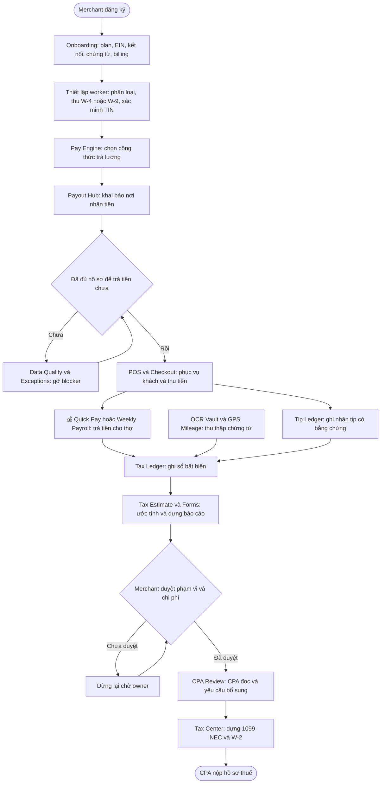
```mermaid
flowchart TD
    A([Merchant đăng ký]) --> B["Onboarding: plan, EIN, kết nối, chứng từ, billing"]
    B --> C["Thiết lập worker: phân loại, thu W-4 hoặc W-9, xác minh TIN"]
    C --> D[Pay Engine: chọn công thức trả lương]
    D --> E[Payout Hub: khai báo nơi nhận tiền]
    E --> F{Đã đủ hồ sơ để trả tiền chưa}
    F -- Chưa --> G[Data Quality và Exceptions: gỡ blocker]
    G --> F
    F -- Rồi --> H[POS và Checkout: phục vụ khách và thu tiền]
    H --> I["💰 Quick Pay hoặc Weekly Payroll: trả tiền cho thợ"]
    I --> J[Tax Ledger: ghi sổ bất biến]
    H --> K[Tip Ledger: ghi nhận tip có bằng chứng]
    L[OCR Vault và GPS Mileage: thu thập chứng từ] --> J
    K --> J
    J --> M[Tax Estimate và Forms: ước tính và dựng báo cáo]
    M --> N{Merchant duyệt phạm vi và chi phí}
    N -- Chưa duyệt --> O[Dừng lại chờ owner]
    O --> N
    N -- Đã duyệt --> P[CPA Review: CPA đọc và yêu cầu bổ sung]
    P --> Q[Tax Center: dựng 1099-NEC và W-2]
    Q --> R([CPA nộp hồ sơ thuế])
```

Ba điểm chặn quan trọng nhất trong sơ đồ trên:

1. **Chưa đủ hồ sơ thì không trả tiền.** Thiếu W-4/W-9/TIN thì worker không được trả (trừ khi owner override và ghi lý do vào audit).
2. **Chưa có bằng chứng thì không xuất gói CPA.** Payout không có proof, receipt không có business purpose — đều chặn export.
3. **Chưa có merchant duyệt thì CPA không bắt đầu làm và không có gì được chia sẻ ra ngoài.**

---

### Thuật ngữ nghiệp vụ

Bảng này là từ điển dùng chung cho toàn bộ tài liệu. Các thuật ngữ giữ nguyên tiếng Anh vì đây là từ đã chuẩn hoá trong ngành và trên biểu mẫu thuế Mỹ.

#### Vai trò và thực thể cơ bản

| Thuật ngữ | Giải thích |
| :--- | :--- |
| **Merchant** | Doanh nghiệp sử dụng Tax IQ — thường là một tiệm nail/beauty. |
| **Employer** | Pháp nhân chịu trách nhiệm thuế: tên pháp lý, EIN, địa chỉ, ngành nghề. Một merchant có thể có nhiều employer. |
| **Worker** | Người được tiệm trả tiền. Chia hai loại theo thuế: **employee (W-2)** và **contractor (1099)**. |
| **Technician / Thợ** | Worker trực tiếp làm dịch vụ cho khách. Phần lớn thợ nail là contractor 1099. |
| **Tenant** | Không gian dữ liệu riêng của một merchant. Dữ liệu giữa các tenant hoàn toàn cách ly. |
| **CPA / Bookkeeper** | Chuyên gia thuế bên thứ ba. Có quyền **read-only** trên phạm vi mà merchant cho phép. |

#### Phân loại worker và biểu mẫu

| Thuật ngữ | Giải thích |
| :--- | :--- |
| **W-2 Employee** | Nhân viên chính thức. Tiệm phải khấu trừ thuế thu nhập, Social Security, Medicare và đóng phần của employer. |
| **1099 Contractor** | Nhà thầu độc lập. Tiệm trả tiền gộp, không khấu trừ; worker tự lo thuế của mình. |
| **W-4** | Biểu mẫu employee khai để tiệm biết khấu trừ bao nhiêu thuế thu nhập. Bắt buộc **trước khi** chạy payroll. |
| **W-9** | Biểu mẫu contractor khai để tiệm có TIN hợp lệ. Bắt buộc **trước lần payout đầu tiên**. |
| **TIN** | Mã số thuế của worker (thường là SSN). Luôn hiển thị dạng mask và lưu dưới dạng token. |
| **EIN** | Mã số thuế của doanh nghiệp. |
| **Worker classification** | Việc xác định worker là W-2 hay 1099. Phân loại sai là rủi ro pháp lý lớn — hệ thống tạo cảnh báo khi phát hiện dấu hiệu bất thường. |

#### Trả tiền cho thợ

| Thuật ngữ | Giải thích |
| :--- | :--- |
| **Payout** | Một lần chuyển tiền cho worker. |
| **Pay Engine** | Nơi cấu hình **cách tính** tiền: hourly, commission, hybrid, tiered, bonus, overtime, pay schedule. |
| **Payout Hub** | Nơi cấu hình **tiền đi đâu**: Zelle, ACH/direct deposit, Venmo, Cash App, check, cash — kèm phương thức dự phòng. |
| **Quick Pay** | Công cụ tạo một giao dịch lẻ: tip payout, wage payout, bonus. |
| **Weekly Payroll** | Bảng lương tuần theo lô: trả từng người hoặc trả tất cả. |
| **Commission** | Phần trăm thợ được hưởng trên doanh số dịch vụ mình làm. |
| **Guarantee / "bao"** | Mức thu nhập tối thiểu tiệm cam kết cho thợ trong tuần, bất kể doanh số. |
| **Overtime** | Giờ làm vượt ngưỡng tuần, trả theo hệ số 1.5 lần lương giờ. |
| **Take-home** | Tổng tiền thợ thực nhận trong kỳ. |
| **Proof / Evidence** | Bằng chứng đã trả tiền: ảnh màn hình chuyển khoản, bank memo, số check, biên nhận cash, hoặc ghi chú của owner. |

#### Thuế và sổ sách

| Thuật ngữ | Giải thích |
| :--- | :--- |
| **Ledger** | Sổ cái. Trong Tax IQ, ledger là **append-only**: đã ghi thì không sửa, mọi điều chỉnh sinh bản ghi mới. |
| **Payroll run** | Một kỳ lương: khoảng thời gian, ngày trả, danh sách worker, tổng gross và tổng thuế. |
| **Finalize** | Hành động chốt payroll run. Sau khi chốt, kỳ lương bị khoá. |
| **Strict mode** | Chế độ nghiêm ngặt: thiếu hồ sơ bắt buộc thì **chặn** finalize, thay vì chỉ cảnh báo. |
| **Exception** | Vấn đề cần xử lý trước khi đi tiếp. Severity High thường là blocker. |
| **Jurisdiction** | Vùng thuế: federal, state, hoặc local. Mỗi vùng có registration, deposit schedule và hạn nộp riêng. |
| **Deposit schedule** | Nhịp nộp thuế đã khấu trừ cho cơ quan thuế: semiweekly, monthly, quarterly. |
| **Withholding** | Phần thuế tiệm giữ lại từ lương employee để nộp thay. |
| **FICA** | Social Security (6.2%) và Medicare (1.45%) — employee và employer mỗi bên đóng một phần bằng nhau. |
| **FUTA** | Thuế thất nghiệp liên bang, chỉ employer đóng, khai trên Form 940. |
| **SUTA** | Thuế thất nghiệp tiểu bang, chỉ employer đóng. |
| **Form 941** | Tờ khai thuế payroll theo quý. |
| **Form 1099-NEC** | Biểu mẫu báo cáo tiền trả cho contractor. |
| **Form 1096** | Tờ tổng hợp đi kèm khi nộp 1099 bằng giấy. |
| **Box 1a / 1b / 1c / 1d** | Các ô trên 1099-NEC: tổng tiền trả, phần cash tips nằm trong tổng, mã nghề có tip, và overtime đủ điều kiện. |
| **TTOC** | Treasury Tipped Occupation Code — mã nghề nhận tip. Thợ nail dùng mã **605**. |
| **IRIS / FIRE** | Hai hệ thống nộp biểu mẫu điện tử của IRS. |
| **No Tax on Tips** | Chính sách cho phép khấu trừ tip đủ điều kiện, tối đa **$25,000/năm**. |
| **MAGI** | Thu nhập điều chỉnh dùng để xét ngưỡng phase-out của khoản khấu trừ tip. |

#### Chứng từ và chia sẻ

| Thuật ngữ | Giải thích |
| :--- | :--- |
| **OCR** | Công nghệ đọc chữ từ ảnh, dùng để bóc tách vendor, số tiền, thuế, ngày từ receipt. |
| **Confidence** | Độ tin cậy của từng trường OCR bóc ra. Dưới ngưỡng thì phải có người xác nhận tay. |
| **Business purpose** | Mục đích kinh doanh của một khoản chi. Thiếu trường này thì chứng từ không vào được gói CPA. |
| **Share Link** | Link chia sẻ có phạm vi và hạn dùng, cấp cho CPA, thợ, hoặc người review bên ngoài. |
| **Access scope** | Phạm vi quyền của một link: chỉ upload, chỉ đọc, hoặc cả hai. |
| **Audit log** | Nhật ký bất biến ghi lại ai làm gì, lúc nào, trên tài nguyên nào, trạng thái trước và sau. |
| **Soft delete** | Xoá khỏi danh sách nhưng giữ bản ghi trong audit. **Hồ sơ thuế không bao giờ bị hard delete.** |

---

### Vai trò người dùng

| Vai trò | Trách nhiệm chính | Được làm | Bị chặn |
| :--- | :--- | :--- | :--- |
| **Merchant Owner** | Người ra quyết định kinh doanh | Billing, kết nối CPA, duyệt export, quản lý share link, xem dashboard tổng thể, override cảnh báo kèm ghi chú | Sửa quy tắc thuế hệ thống, các thiết lập nền tảng ẩn |
| **Payroll Admin** | Người vận hành payroll hằng ngày | Tạo và chốt payroll run, xử lý exception, xuất báo cáo payroll, cấu hình pay rule và payout method | Duyệt chi phí CPA (trừ khi kiêm luôn vai trò billing owner) |
| **CPA / Bookkeeper** | Chuyên gia thuế bên thứ ba | Đọc gói hồ sơ, để lại comment, yêu cầu bổ sung tài liệu, chuẩn bị hồ sơ khai thuế | Chốt payroll run, đổi settings, xem PII đầy đủ khi chưa được cấp quyền |
| **Auditor** | Kiểm tra tuân thủ nội bộ | Đọc báo cáo, đọc audit log, xem chứng từ trong phạm vi được cấp | Sửa hoặc xoá bản ghi, export PII khi chưa được duyệt |
| **Employee / Worker** | Người tự khai hồ sơ của mình | Cập nhật hồ sơ cá nhân, nộp W-4/W-9/TIN, upload chứng từ tip và payout của mình | Xem payroll toàn tiệm, xem billing, xem gói CPA |
| **Tax IQ Admin** | Hỗ trợ vận hành nền tảng | Hỗ trợ merchant, xem audit log, cấu hình hệ thống, sửa dữ liệu kèm audit trail đầy đủ | — |

---

### Quy tắc nghiệp vụ toàn hệ thống

Những quy tắc dưới đây áp dụng cho **mọi màn hình**, không lặp lại ở từng mục.

#### Nhóm 1 — Tính toàn vẹn của hồ sơ thuế

- **Ledger là bất biến.** Bản ghi đã post vào Tax Ledger không thể sửa. Mọi điều chỉnh tạo bản ghi mới, giữ nguyên bản gốc. Chuỗi hash liên kết các bản ghi để phát hiện việc chèn hoặc sửa lén.
- **Không hard delete hồ sơ thuế.** Xoá tip, xoá trip, xoá receipt đều là soft delete. Bản ghi vẫn nằm trong audit log kèm người xoá, lý do và thời điểm.
- **Xoá và sửa hồ sơ thuế bắt buộc có lý do.** Hệ thống không cho hoàn tất thao tác nếu ô lý do để trống.
- **Kỳ lương đã finalize thì bị khoá.** Không sửa trực tiếp; muốn điều chỉnh phải tạo adjustment entry mới.

#### Nhóm 2 — Cổng chặn trước khi đi tiếp

> 💡 **Quan trọng:** Đây là các quy tắc trực tiếp chặn dòng tiền và việc nộp hồ sơ.

- **Không trả tiền khi thiếu hồ sơ thuế của worker.** W-2 phải có W-4 trước payroll; 1099 phải có W-9 trước payout đầu tiên. Owner có thể override nhưng bắt buộc để lại audit note.
- **Không finalize ở strict mode khi còn blocker.** Thiếu TIN/W-4, thiếu registration của bang, hoặc còn exception severity High đều chặn.
- **Không export gói CPA khi còn thiếu bằng chứng.** Receipt thiếu business purpose, OCR confidence thấp chưa xác nhận, payout thiếu proof — đều chặn.
- **Không bật giao nhận dữ liệu tự động khi kết nối đang lỗi.** Endpoint, chữ ký, retry và dead-letter phải được xác minh trước.
- **Không tính mileage deduction khi thiếu route và business purpose.** Điểm A, điểm B, số dặm và mục đích là bắt buộc.
- **Bắt buộc proof cho mọi payout không phải ACH.** Cash, check, Zelle, Venmo, Cash App đều cần bằng chứng.

#### Nhóm 3 — Quyền và phê duyệt

- **Owner duyệt mọi thứ nhạy cảm.** Export PII, chia sẻ gói CPA, đổi plan, duyệt chi phí CPA, và hành động nộp hồ sơ cuối cùng đều cần merchant chấp thuận rõ ràng.
- **Duyệt billing không thay thế CPA review.** Đây là hai việc tách biệt: duyệt tiền và duyệt chuyên môn.
- **Không có việc CPA nào bắt đầu trước khi merchant duyệt chi phí.** Merchant phải thấy hourly rate, số giờ ước tính, retainer và tổng ước tính trước khi mời CPA.
- **Quyền được kiểm tra ở phía server, không dựa vào việc ẩn nút.** Mỗi hành động được bảo vệ đều kiểm tra role, tenant, resource và scope.
- **CPA chỉ có quyền đọc.** Quyền nộp thuế trực tiếp mặc định tắt. Quyền download cần merchant duyệt từng lần.

#### Nhóm 4 — Bảo vệ dữ liệu cá nhân

- **SSN/TIN lưu dưới dạng token, hiển thị dạng mask.** Giao diện mặc định chỉ hiện 4 số cuối. Chỉ owner/admin có thẩm quyền mới yêu cầu hiện đầy đủ được, và thao tác đó sinh audit event.
- **Không bao giờ gửi TIN gốc qua email.** Chỉ gửi secure link có kiểm tra quyền truy cập.
- **Share link theo nguyên tắc quyền tối thiểu.** Mặc định chỉ đọc, mặc định hết hạn sau 15 ngày, và nên thu hồi ngay khi việc review xong.
- **Audit lưu 7 năm.** Mọi hành động create, update, delete, approve, export và share đều sinh bản ghi audit.

#### Nhóm 5 — Ngôn từ và ranh giới trách nhiệm

- **Không hứa hẹn kết quả thuế.** Dùng các từ: *ước tính*, *có khả năng đủ điều kiện*, *cần CPA review*, *dựa trên hồ sơ hiện có*. Tuyệt đối tránh: *chắc chắn được hoàn thuế*, *chắc chắn được khấu trừ*.
- **Tách bạch phần mềm và tư vấn chuyên môn.** Tax IQ sắp xếp hồ sơ và chỉ ra rủi ro; CPA, bookkeeper hoặc luật sư mới là người kết luận.
- **Luôn nêu nguồn và ngày hiệu lực.** Mọi con số theo quy định — mức mileage, trần tip, ngưỡng khai báo, hạn nộp — đều phải gắn với năm thuế và nguồn chính thức, và phải rà lại hằng năm.
- **Disclaimer bắt buộc** trên Tax Estimate, Tip Ledger, GPS Mileage, AI Advisor và CPA Review.

---

## Phần II — Chi Tiết Từng Màn Hình

## OVERVIEW

### 1. Dashboard

**Nhóm chức năng:** Overview
**Người dùng chính:** Owner / Payroll Admin
**Việc cần làm đầu tiên:** Xử lý dứt điểm các blocker dữ liệu đang chặn, trước khi chốt payroll, xuất gói CPA hoặc duyệt deposit thuế.

#### Mục đích

> Dashboard là trung tâm điều hành của merchant. Màn hình gom về một chỗ toàn bộ bức tranh tiền lương – thuế – chứng từ – rủi ro của kỳ hiện tại: bao nhiêu tiền đã trả ra, bao nhiêu thuế đã giữ lại, hồ sơ thuế Mỹ còn thiếu gì, việc gì phải làm trước, payroll run nào vừa chạy và vấn đề Tax IQ nào đang chờ. Giá trị cốt lõi: Owner mở app lên là biết ngay **việc gì đang chặn dòng tiền và hồ sơ thuế**, không phải đi dò từng màn hình.

#### Chỉ số theo dõi

| Chỉ số | Ý nghĩa nghiệp vụ | Cách đọc |
|---|---|---|
| **Total Gross Pay** — `$1.05M` | Tổng lương gộp của kỳ, bao gồm cả payroll thường và bonus quý | Đây là gross trước thuế và trước khấu trừ. Số này là gốc để tính nghĩa vụ thuế; nếu lệch bất thường so với kỳ trước, phải soi lại các payroll run. Bấm vào chỉ số để mở danh sách payroll runs. |
| **Tax Withheld** — `$193.3K` | Tổng thuế nhân viên đã bị giữ lại: thuế thu nhập liên bang và tiểu bang | Số tiền merchant đang **giữ hộ** cơ quan thuế và có nghĩa vụ nộp đúng hạn theo deposit schedule. Bấm vào chỉ số để mở ledger đối chiếu. |
| **Open Exceptions** — `5` (trong đó `4` blocking ở chế độ strict) | Số vấn đề Tax IQ đang mở | Con số tổng ít quan trọng bằng số blocking. Ở chế độ strict, 4 vấn đề này sẽ **chặn finalize payroll**. Bấm để mở hàng đợi exceptions. |
| **Evidence Vault** — `6` | Số chứng từ (receipt, bằng chứng payout) đang nằm trong kho bằng chứng cần xử lý | Chứng từ chưa đủ hoặc chưa duyệt thì gói CPA sẽ thiếu căn cứ cho các khoản khấu trừ. Bấm để mở OCR Vault. |

#### Nội dung màn hình

Dashboard gồm 4 khu vực xếp theo thứ tự ưu tiên đọc: dải chỉ số → checklist hồ sơ + hành động ưu tiên → payroll runs gần đây + hàng đợi vấn đề.

**Dải hướng dẫn đầu trang**

| Thành phần | Nội dung |
|---|---|
| Trọng tâm màn hình | Trung tâm điều hành của Owner cho công việc thuế đang mở, rủi ro payroll, chứng từ, yêu cầu CPA và hành động kế tiếp |
| Ai dùng | Owner / Payroll Admin |
| Làm gì trước | Xử lý các lỗ hổng dữ liệu đang chặn, trước khi chốt payroll, xuất gói CPA hoặc rà soát deposit thuế |
| Lối tắt | `Fix Data Gaps` → Data Quality · `Review Estimate` → Tax Estimate · `CPA Package` → CPA |

**Bảng `US Tax Readiness Checklist`** — bảng quan trọng nhất màn hình. Liệt kê 6 nhóm hồ sơ bắt buộc để merchant đủ điều kiện vận hành thuế tại Mỹ. Mỗi dòng là **một nhóm hồ sơ**, không phải một tài liệu lẻ.

| Cột | Ý nghĩa |
|---|---|
| `Area` | Tên nhóm hồ sơ |
| `Required Records` | Danh mục chứng từ / dữ liệu bắt buộc phải có trong nhóm đó |
| `Status` | Tình trạng sẵn sàng của nhóm |
| `Action` | Nút đưa thẳng tới màn hình xử lý nhóm hồ sơ đó |

Sáu dòng cố định của checklist:

| Area | Required Records | Status | Action |
|---|---|---|---|
| **Business identity** | EIN, tên pháp lý, địa chỉ doanh nghiệp, liên hệ chủ sở hữu, loại hình pháp nhân, năm thuế | `Ready` | `Review` → Employers |
| **Worker setup** | W-4 cho employee, W-9/TIN cho contractor, work state, residence state, phân loại lao động | `Needs Review` | `Fix` → Employees |
| **Federal payroll taxes** | Thuế thu nhập liên bang giữ lại, Social Security, Medicare, FUTA, deposit schedule, dữ liệu phục vụ Form 941/940 | `Active` | `Estimate` → Tax Estimate |
| **State payroll setup** | Thuế tiểu bang giữ lại, wage base và rate của SUTA, thuế địa phương nếu có, đăng ký với tiểu bang, hạn nộp | `Review` | `Map` → Jurisdictions |
| **Evidence vault** | Receipt, hóa đơn, bằng chứng payout, hồ sơ tip, bằng chứng lộ trình GPS, ghi chú của CPA | `Open` | `Collect` → OCR Vault |
| **CPA filing package** | Báo cáo payroll, bản xuất ledger, dữ liệu hỗ trợ 1099/W-2, giả định của bản ước tính thuế, yêu cầu bổ sung chứng từ, log phê duyệt | `Required` | `Send` → CPA |

Chân bảng có lối đi `Compliance Controls` sang màn hình kiểm soát tuân thủ.

**Bảng `Recommended Next Actions`** — danh sách hành động ưu tiên, xếp theo thứ tự bắt buộc phải làm trước – sau. Mỗi dòng là một nhóm việc, kèm mức độ khẩn (đỏ → vàng → xanh dương → xanh lá).

| Thứ tự | Hành động | Diễn giải | Mức |
|---|---|---|---|
| 1 | **Resolve payroll blockers first** | Sửa thiếu TIN/W-4, đăng ký tiểu bang và các exception mức High **trước khi** finalize run | Đỏ |
| 2 | **Collect evidence before CPA export** | Lưu receipt, hóa đơn, bằng chứng payout, hồ sơ tip và bằng chứng mileage GPS vào OCR Vault hoặc qua Share Links | Vàng |
| 3 | **Confirm tax assumptions with CPA** | Tax Estimate và Tip Ledger chỉ là công cụ chuẩn bị; kết luận cuối cùng do CPA/bookkeeper xác nhận | Xanh dương |
| 4 | **Protect access and audit trail** | Dùng Share Link có hạn, cấp quyền tối thiểu, giữ log phê duyệt và audit cho dữ liệu thuế nhạy cảm | Xanh lá |

Chân bảng có nút chính `Open Data Quality`.

**Bảng `Recent Payroll Runs`** — 5 payroll run gần nhất. Mỗi dòng là **một payroll run**, bấm vào dòng mở thẳng chi tiết run.

| Cột | Ý nghĩa |
|---|---|
| `Run ID` | Mã định danh của run |
| `Period` | Kỳ lương mà run này chi trả |
| `Pay Date` | Ngày trả lương |
| `Gross` | Tổng lương gộp của run |
| `Tax` | Tổng thuế của run |
| `Risk` | Điểm rủi ro do Tax IQ chấm cho run |
| `Status` | Trạng thái run |

Dữ liệu hiện hành:

| Run ID | Period | Pay Date | Gross | Tax | Risk | Status |
|---|---|---|---|---|---|---|
| `pr_2026_06_15` | Jun 1-14 | Jun 19, 2026 | $312,448 | $54,621 | 18 | `Ledger Posted` |
| `pr_2026_06_01` | May 18-31 | Jun 5, 2026 | $309,882 | $53,974 | 12 | `Ledger Posted` |
| `pr_2026_05_15` | May 1-17 | May 22, 2026 | $304,122 | $53,061 | 42 | `Review Required` |
| `pr_bonus_q2` | Q2 Bonus | Jun 15, 2026 | $124,000 | $31,000 | 8 | `Ledger Posted` |
| `pr_2026_07_01` | Jun 15-28 | Jul 3, 2026 | $0 | $0 | - | `Pending` |

Chân bảng có nút `View All` sang màn hình Payroll Runs.

**Danh sách `TaxIQ Issues`** — hàng đợi vấn đề, hiển thị 4 vấn đề đầu tiên. Mỗi dòng gồm **mã loại vấn đề**, mô tả cụ thể và **bộ phận chịu trách nhiệm**. Vấn đề mức High tô đỏ, các mức còn lại tô vàng.

| Loại vấn đề | Mô tả | Bộ phận | Mức |
|---|---|---|---|
| `WITHHOLDING_DISCREPANCY` | Payroll gửi lên $690 nhưng Tax IQ tính ra $698.89 | Payroll | High (đỏ) |
| `TIN_VERIFICATION_PENDING` | 6 nhân viên chưa xác minh SSN/TIN | HR | Medium (vàng) |
| `W4_STALE` | 3 nhân viên vẫn đang dùng W-4 bản 2024 | HR | Medium (vàng) |
| `JURISDICTION_MISMATCH` | 2 nhân viên làm việc ở CA nhưng cư trú ở TX | Tax | Medium (vàng) |

Chân danh sách có nút `Open Queue` sang màn hình Exceptions.

#### Luồng nghiệp vụ: Rà soát buổi sáng và giải phóng blocker

**Người thực hiện:** Owner hoặc Payroll Admin
**Điểm bắt đầu:** Mở Dashboard đầu ngày làm việc, hoặc trước mốc chốt payroll / gửi gói CPA / nộp deposit
**Kết quả mong đợi:** Mọi blocker mức High được giao chủ và xử lý; merchant đủ điều kiện chốt payroll và xuất gói CPA

**User stories:**

- **Là** Owner, **tôi muốn** nhìn một màn hình duy nhất biết gross, thuế đã giữ, số vấn đề đang mở và số chứng từ còn thiếu, **để** không phải mở lần lượt từng báo cáo mới biết tình hình.
- **Là** Payroll Admin, **tôi muốn** thấy ngay có bao nhiêu exception đang **chặn** finalize ở chế độ strict, **để** biết mình còn bao nhiêu việc phải dọn trước ngày trả lương.
- **Là** Owner, **tôi muốn** checklist hồ sơ thuế Mỹ chỉ rõ nhóm nào chưa `Ready`, **để** giao đúng người xử lý thay vì đoán mò.
- **Là** Payroll Admin, **khi** một run đang ở `Review Required` với điểm risk cao, **tôi muốn** bấm thẳng vào dòng đó mở chi tiết run, **để** xử lý ngay chứ không phải tìm lại mã run.
- **Là** Owner, **khi** chứng từ chưa thu đủ, **tôi muốn** hệ thống chặn tôi xuất gói CPA, **để** không gửi cho CPA một bộ hồ sơ thiếu căn cứ rồi bị trả lại.

| Bước | Ai | Hành động | Hệ thống phản hồi | Ghi chú |
|---|---|---|---|---|
| 1 | Owner / Payroll Admin | Mở Dashboard | Hiển thị 4 chỉ số điều hành, checklist hồ sơ, hành động ưu tiên, payroll runs gần đây và hàng đợi vấn đề | Dải hướng dẫn đầu trang nêu rõ việc phải làm trước |
| 2 | Owner | Đọc chỉ số `Open Exceptions` | Nêu tổng số vấn đề mở và số vấn đề blocking ở chế độ strict | Số blocking là con số quyết định, không phải tổng |
| 3 | Owner | Đọc `US Tax Readiness Checklist` | Mỗi nhóm hồ sơ hiện trạng thái riêng và nút đi thẳng tới màn hình xử lý | Nhóm chưa `Ready` là nguồn gốc của blocker |
| 4 | Owner | Bấm `Fix` ở dòng `Worker setup` | Chuyển sang màn hình Employees để bổ sung W-4 / TIN / work state | Đây là nhóm thường xuyên chặn payroll nhất |
| 5 | Payroll Admin | Bấm `Open Queue` ở `TaxIQ Issues` | Mở hàng đợi exceptions đầy đủ, đã gắn sẵn bộ phận chịu trách nhiệm | Mỗi vấn đề đã có chủ: Payroll / HR / Tax |
| 6 | Payroll Admin | Xử lý từng vấn đề High trước, rồi tới Medium | Vấn đề chuyển trạng thái; chỉ số `Open Exceptions` trên Dashboard giảm theo | Ưu tiên đúng thứ tự trong `Recommended Next Actions` |
| 7 | Owner | Bấm `Collect` ở dòng `Evidence vault` | Mở OCR Vault để thu và duyệt chứng từ còn thiếu | Phải làm xong trước khi xuất gói CPA |
| 8 | Owner | Quay lại Dashboard, kiểm tra không còn blocker | Checklist và hàng đợi phản ánh trạng thái mới | Lúc này mới được chốt payroll / xuất gói CPA / nộp deposit |

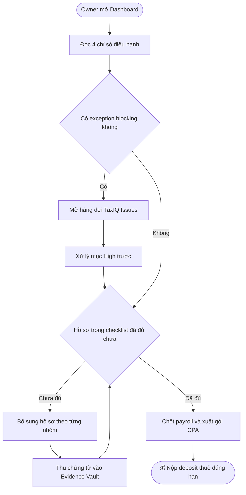
```mermaid
flowchart TD
  A([Owner mở Dashboard]) --> B[Đọc 4 chỉ số điều hành]
  B --> C{Có exception blocking không}
  C -->|Có| D[Mở hàng đợi TaxIQ Issues]
  D --> E[Xử lý mục High trước]
  E --> F{Hồ sơ trong checklist đã đủ chưa}
  C -->|Không| F
  F -->|Chưa đủ| G[Bổ sung hồ sơ theo từng nhóm]
  G --> H[Thu chứng từ vào Evidence Vault]
  H --> F
  F -->|Đã đủ| I[Chốt payroll và xuất gói CPA]
  I --> J([💰 Nộp deposit thuế đúng hạn])
```

#### Luồng nghiệp vụ: Từ Dashboard đi tới quyết định payroll

**Người thực hiện:** Payroll Admin
**Điểm bắt đầu:** Bảng `Recent Payroll Runs` xuất hiện một run có điểm risk cao hoặc trạng thái cần xử lý
**Kết quả mong đợi:** Run được đưa về trạng thái sạch trước ngày trả lương, hoặc được ghi nhận lý do hoãn

**User stories:**

- **Là** Payroll Admin, **tôi muốn** so sánh nhanh điểm risk giữa các run gần đây, **để** phát hiện run nào bất thường so với mặt bằng.
- **Là** Payroll Admin, **khi** một run ở trạng thái `Validation Failed`, **tôi muốn** biết ngay vấn đề gốc nằm ở đâu, **để** không đưa dữ liệu sai vào ledger.
- **Là** Owner, **khi** run mới nhất còn `Pending` và chưa có gross, **tôi muốn** hiểu đó là run chưa chạy chứ không phải lỗi, **để** không báo động nhầm.

| Bước | Ai | Hành động | Hệ thống phản hồi | Ghi chú |
|---|---|---|---|---|
| 1 | Payroll Admin | Quét cột `Risk` trong `Recent Payroll Runs` | Hiển thị điểm risk từng run cạnh trạng thái | Run `pr_2026_05_15` risk 42 kèm `Review Required` |
| 2 | Payroll Admin | Bấm vào dòng run cần soi | Mở màn hình chi tiết run | Cả dòng là vùng bấm được |
| 3 | Payroll Admin | Đối chiếu vấn đề liên quan trong `TaxIQ Issues` | Vấn đề nêu rõ run bị ảnh hưởng và bộ phận chịu trách nhiệm | Ví dụ `JURISDICTION_MISMATCH` gắn với `pr_2026_05_15` |
| 4 | Payroll Admin | Xử lý hoặc chuyển vấn đề cho đúng bộ phận | Vấn đề đổi trạng thái, chủ sở hữu được ghi nhận | HR xử lý hồ sơ, Tax xử lý jurisdiction |
| 5 | Payroll Admin | Quay lại chốt run sau khi hết blocker | Run chuyển sang trạng thái tiếp theo trong vòng đời | Không có blocker mới được finalize ở chế độ strict |

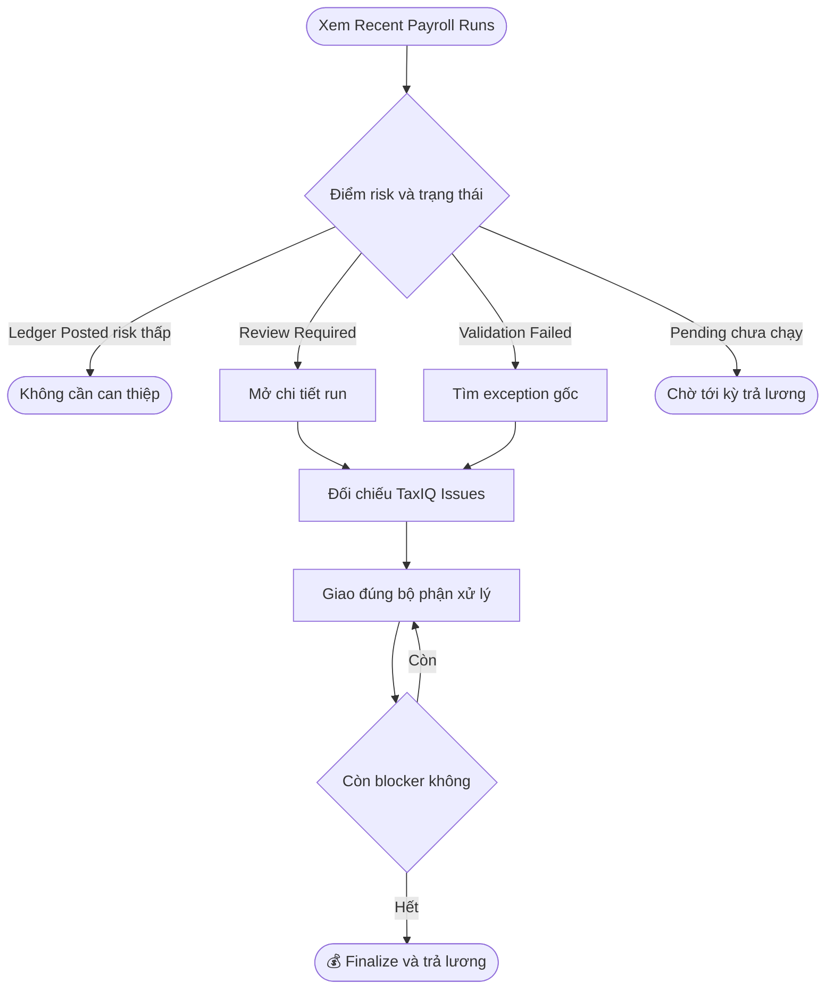
```mermaid
flowchart TD
  A([Xem Recent Payroll Runs]) --> B{Điểm risk và trạng thái}
  B -->|Ledger Posted risk thấp| C([Không cần can thiệp])
  B -->|Review Required| D[Mở chi tiết run]
  B -->|Validation Failed| E[Tìm exception gốc]
  B -->|Pending chưa chạy| F([Chờ tới kỳ trả lương])
  D --> G[Đối chiếu TaxIQ Issues]
  E --> G
  G --> H[Giao đúng bộ phận xử lý]
  H --> I{Còn blocker không}
  I -->|Còn| H
  I -->|Hết| J([💰 Finalize và trả lương])
```

#### Quy tắc nghiệp vụ

- **Blocker dữ liệu chặn ba hành động dòng tiền:** Khi còn lỗ hổng dữ liệu đang chặn, merchant không được **chốt payroll**, không được **xuất gói CPA** và không được **duyệt nộp deposit thuế**. Đây là nguyên tắc mở màn của Dashboard.
- **Chế độ strict:** Trong 5 vấn đề đang mở, có 4 vấn đề blocking ở chế độ strict. Vấn đề blocking sẽ chặn việc finalize payroll run, chặn xuất gói CPA và chặn gửi tự động.
- **Thứ tự ưu tiên bắt buộc:** Sửa blocker payroll (TIN/W-4, đăng ký tiểu bang, exception mức High) **trước** → thu chứng từ **trước khi** xuất gói CPA → xác nhận giả định thuế với CPA → cuối cùng là siết quyền truy cập và audit trail.
- **Tax IQ chuẩn bị, CPA quyết định:** Tax Estimate và Tip Ledger là công cụ **chuẩn bị hồ sơ**, không phải kết luận thuế. Mọi quyết định khai và nộp cuối cùng phải do CPA hoặc bookkeeper có chứng chỉ xác nhận.
- **Sáu nhóm hồ sơ là bắt buộc, không phải gợi ý:** Business identity, Worker setup, Federal payroll taxes, State payroll setup, Evidence vault, CPA filing package — thiếu bất kỳ nhóm nào thì hồ sơ thuế của merchant chưa hoàn chỉnh.
- **Mỗi vấn đề phải có chủ:** Mọi mục trong `TaxIQ Issues` đều gắn sẵn bộ phận chịu trách nhiệm (Payroll / HR / Tax). Không có vấn đề nào được để vô chủ.
- **Chứng từ không phải tuỳ chọn:** Bằng chứng thanh toán, memo, phê duyệt, phân loại lao động và audit log phải có đủ trước khi xuất cho CPA.

> 💡 **Quan trọng:** Chỉ số `Tax Withheld` là tiền merchant đang giữ hộ cơ quan thuế, không phải doanh thu. Nghĩa vụ nộp theo deposit schedule không phụ thuộc vào việc merchant còn tiền trong tài khoản hay không — phải bảo đảm tài khoản đủ tiền trước ngày deposit.

> 💡 **Quan trọng:** Điểm risk cao trên một payroll run là tín hiệu cảnh báo về chất lượng dữ liệu, không tự động đồng nghĩa với sai phạm. Nhưng run có risk cao **bắt buộc** phải được rà soát trước khi finalize.

#### Tình huống ngoại lệ

| Tình huống | Hệ thống xử lý | Ai giải quyết |
|---|---|---|
| Payroll gửi lên số thuế khác số Tax IQ tính | Tạo vấn đề `WITHHOLDING_DISCREPANCY` mức High, hiện đầu hàng đợi và chặn finalize ở chế độ strict | Bộ phận Payroll |
| Nhân viên chưa xác minh SSN/TIN | Tạo vấn đề `TIN_VERIFICATION_PENDING`, đồng thời nhóm `Worker setup` trong checklist chuyển sang `Needs Review` | Bộ phận HR |
| Nhân viên còn dùng W-4 bản cũ | Tạo vấn đề `W4_STALE`, yêu cầu nhân viên nộp lại form W-4 hiện hành | Bộ phận HR |
| Nhân viên làm việc và cư trú ở hai tiểu bang khác nhau | Tạo vấn đề `JURISDICTION_MISMATCH`, chuyển sang trạng thái đang rà soát và gắn với payroll run bị ảnh hưởng | Bộ phận Tax |
| Nhân viên mới chưa có tax profile | Tạo vấn đề `TAX_PROFILE_MISSING` mức Low, gắn với payroll run sắp tới để xử lý trước ngày chạy | Bộ phận HR |
| Run mới nhất hiện gross bằng 0 và không có điểm risk | Đây là run đang ở trạng thái `Pending`, chưa được chạy nên chưa có dữ liệu để chấm điểm | Không cần xử lý |
| Chứng từ trong Evidence Vault chưa được duyệt | Nhóm `Evidence vault` trong checklist giữ trạng thái `Open`, không cho xuất gói CPA | Owner / Bookkeeper |

#### Câu hỏi thường gặp

**Hỏi: `Open Exceptions` hiện 5 nhưng ghi chú nói 4 blocking. Tôi phải sửa hết 5 hay chỉ 4?**
Đáp: 4 vấn đề blocking là **bắt buộc** phải sửa trước, vì chúng chặn finalize payroll ở chế độ strict. Vấn đề còn lại vẫn cần xử lý nhưng không chặn kỳ trả lương hiện tại. Nguyên tắc là dọn từ mức High xuống mức Low.

**Hỏi: Tại sao nhóm `Business identity` đã `Ready` mà tôi vẫn không xuất được gói CPA?**
Đáp: Vì đủ cả 6 nhóm mới là đủ hồ sơ. `Business identity` mới chỉ là một nhóm; các nhóm `Worker setup`, `State payroll setup`, `Evidence vault` và `CPA filing package` vẫn còn ở trạng thái cần xử lý. Đặc biệt, phải thu đủ chứng từ trước khi xuất cho CPA.

**Hỏi: Số Tax Estimate trên hệ thống có phải là số cuối cùng tôi phải nộp không?**
Đáp: Không. Tax IQ chuẩn bị hồ sơ, tính toán và đánh dấu rủi ro dựa trên dữ liệu payroll hiện có. Con số cuối cùng phải được CPA hoặc bookkeeper có chứng chỉ xác nhận, vì còn phụ thuộc vào khấu trừ, tín thuế và tình trạng khai thuế.

**Hỏi: Một payroll run có điểm risk cao thì tôi có bị phạt không?**
Đáp: Không trực tiếp. Điểm risk là cảnh báo nội bộ của Tax IQ về chất lượng dữ liệu của run đó. Rủi ro thật nằm ở chỗ nếu bỏ qua và finalize luôn, dữ liệu sai sẽ vào ledger rồi vào hồ sơ thuế. Vì vậy run risk cao bắt buộc phải rà soát trước.

---

### 2. Analytics

**Nhóm chức năng:** Overview
**Người dùng chính:** Owner / Finance Lead
**Việc cần làm đầu tiên:** Dùng danh sách run có risk cao và xu hướng thuế theo jurisdiction để quyết định việc gì cần rà soát trước.

#### Mục đích

> Analytics là màn hình xu hướng, không phải màn hình thao tác. Nếu Dashboard trả lời câu hỏi *"hôm nay có gì đang chặn?"* thì Analytics trả lời *"chất lượng dữ liệu của tôi đang tốt lên hay xấu đi, và áp lực thuế đang dồn về đâu?"*. Màn hình phục vụ Owner và Finance Lead ra quyết định ưu tiên: run nào cần soi, tiểu bang nào đang tạo nghĩa vụ thuế lớn nhất, kỳ deposit nào sắp tới.

#### Chỉ số theo dõi

| Chỉ số | Ý nghĩa nghiệp vụ | Cách đọc |
|---|---|---|
| **Average Risk** — `24` | Điểm risk trung bình trên toàn bộ các run đã được chấm điểm | Đang ở vùng xanh (từ 25 trở xuống). Đây là thước đo sức khoẻ dữ liệu tổng thể. Trung bình tăng dần qua các kỳ là dấu hiệu quy trình nhập liệu đang xuống cấp. |
| **Integration Success** — `99.7%` | Tỷ lệ thành công của các kết nối dữ liệu trong kỳ hiện tại | Gần như hoàn hảo. Tỷ lệ tụt xuống nghĩa là dữ liệu payroll/kế toán đang chảy vào không đầy đủ, kéo theo risk của các run tăng. |
| **Blocking Exceptions** — `4` | Số vấn đề đang chặn ở chế độ strict | Đây là số việc bắt buộc phải dọn. Miễn còn lớn hơn 0 thì payroll chưa thể chốt sạch ở chế độ strict. |
| **Missing Profiles** — `2` | Số tax profile còn thiếu | Mỗi profile thiếu là một nhân viên chưa đủ điều kiện tính thuế đúng. Con số này phải về 0 trước kỳ chạy payroll liên quan. |

#### Nội dung màn hình

**Bộ lọc đầu trang** — hai bộ lọc độc lập, áp dụng cho toàn bộ biểu đồ và bảng bên dưới.

| Bộ lọc | Mặc định | Lựa chọn |
|---|---|---|
| Kỳ | `All periods` | `Q1 2026`, `Q2 2026`, `YTD 2026` |
| Employer | `All employers` | `Acme Manufacturing LLC`, `TechCorp Solutions Inc.`, `Retail Partners Group` |

**Biểu đồ `Risk Trend by Payroll Run`** — biểu đồ cột, mỗi cột là **một payroll run**, chiều cao cột là điểm risk, nhãn phụ là kỳ lương. Màu cột tự động theo ngưỡng risk.

| Run | Kỳ | Risk | Màu |
|---|---|---|---|
| `pr_2026_06_15` | Jun 1-14 | 18 | Xanh lá |
| `pr_2026_06_01` | May 18-31 | 12 | Xanh lá |
| `pr_2026_05_15` | May 1-17 | 42 | Vàng |
| `pr_bonus_q2` | Q2 Bonus | 8 | Xanh lá |
| `pr_2026_07_01` | Jun 15-28 | chưa chấm | Xanh lá (chưa có dữ liệu) |
| `pr_correction_01` | Correction | 68 | Đỏ |

**Biểu đồ `Tax by Jurisdiction`** — biểu đồ cột, mỗi cột là **một jurisdiction**, chiều cao là quy mô nghĩa vụ thuế, nhãn phụ nêu loại thuế.

| Jurisdiction | Giá trị | Loại thuế | Màu |
|---|---|---|---|
| Federal | $210K | Thuế thu nhập + FICA | Đỏ |
| California | $59.6K | Thuế tiểu bang giữ lại | Vàng |
| New York | $40K | Thuế tiểu bang giữ lại | Xanh dương |
| Texas SUTA | $6.9K | Thuế phần employer đóng | Xanh lá |

**Bảng `Risk by Run`** — dạng bảng của biểu đồ risk, đầy đủ toàn bộ run chứ không chỉ 5 run gần nhất như Dashboard. Mỗi dòng là **một payroll run**.

| Cột | Ý nghĩa |
|---|---|
| `Run` | Mã run |
| `Period` | Kỳ lương |
| `Risk` | Điểm risk |
| `Status` | Trạng thái run |

| Run | Period | Risk | Status |
|---|---|---|---|
| `pr_2026_06_15` | Jun 1-14 | 18 | `Ledger Posted` |
| `pr_2026_06_01` | May 18-31 | 12 | `Ledger Posted` |
| `pr_2026_05_15` | May 1-17 | 42 | `Review Required` |
| `pr_bonus_q2` | Q2 Bonus | 8 | `Ledger Posted` |
| `pr_2026_07_01` | Jun 15-28 | - | `Pending` |
| `pr_correction_01` | Correction | 68 | `Validation Failed` |

**Bảng `Deposit Calendar`** — lịch nộp thuế theo jurisdiction. Mỗi dòng là **một jurisdiction** kèm tần suất nộp và hạn kế tiếp.

| Cột | Ý nghĩa |
|---|---|
| `Jurisdiction` | Tên cơ quan thuế / tiểu bang |
| `Schedule` | Tần suất phải nộp |
| `Next Due` | Hạn nộp gần nhất sắp tới |

| Jurisdiction | Schedule | Next Due |
|---|---|---|
| Federal | Semiweekly | Jun 24, 2026 |
| Texas | Quarterly | Jul 31, 2026 |
| California | Semiweekly | Jun 24, 2026 |
| New York | Monthly | Jul 15, 2026 |

**Dải hướng dẫn đầu trang**

| Thành phần | Nội dung |
|---|---|
| Trọng tâm | Góc nhìn xu hướng cho risk payroll, áp lực deposit, mức phơi nhiễm thuế theo jurisdiction và sức khoẻ vận hành |
| Ai dùng | Owner / Finance Lead |
| Làm gì trước | Dùng run risk cao và xu hướng thuế theo jurisdiction để quyết định việc gì cần rà soát trước |
| Lối tắt | `Risk Runs` → Payroll Runs · `Tax Estimate` → Tax Estimate · `Exceptions` → Exceptions |

#### Luồng nghiệp vụ: Phân tích xu hướng và chọn việc ưu tiên

**Người thực hiện:** Owner hoặc Finance Lead
**Điểm bắt đầu:** Rà soát định kỳ cuối kỳ lương, hoặc khi Average Risk có dấu hiệu tăng
**Kết quả mong đợi:** Xác định được run nào cần soi trước, jurisdiction nào cần siết, và deposit nào sắp tới hạn

**User stories:**

- **Là** Finance Lead, **tôi muốn** thấy điểm risk của tất cả các run xếp cạnh nhau theo thời gian, **để** biết chất lượng dữ liệu đang tốt lên hay xấu đi.
- **Là** Owner, **tôi muốn** biết nghĩa vụ thuế đang dồn nhiều nhất ở đâu, **để** chuẩn bị dòng tiền cho đúng cơ quan thuế và đúng hạn.
- **Là** Finance Lead, **tôi muốn** lọc theo từng employer và từng kỳ, **để** so sánh giữa các pháp nhân thay vì nhìn số gộp chung.
- **Là** Owner, **khi** một run vừa được tạo và chưa có điểm risk, **tôi muốn** hiểu là chưa có dữ liệu chứ không phải rủi ro bằng 0, **để** không tưởng nhầm là mọi thứ đã sạch.
- **Là** Finance Lead, **khi** thấy một run vọt lên vùng đỏ, **tôi muốn** đi thẳng sang màn hình payroll runs, **để** xử lý ngay mà không mất dấu.

| Bước | Ai | Hành động | Hệ thống phản hồi | Ghi chú |
|---|---|---|---|---|
| 1 | Finance Lead | Mở Analytics | Hiển thị 4 chỉ số vận hành, hai biểu đồ và hai bảng tra cứu | Mặc định là toàn bộ kỳ và toàn bộ employer |
| 2 | Finance Lead | Chọn kỳ và employer cần soi | Biểu đồ và bảng thu hẹp theo phạm vi đã chọn | Ba kỳ có sẵn: `Q1 2026`, `Q2 2026`, `YTD 2026` |
| 3 | Finance Lead | Đọc `Risk Trend by Payroll Run` | Cột đỏ / vàng / xanh phân loại ngay bằng mắt theo ngưỡng | Cột đỏ luôn ưu tiên xử lý trước |
| 4 | Finance Lead | Đối chiếu `Risk by Run` để lấy trạng thái đi kèm | Bảng nêu rõ run risk cao đang ở trạng thái nào | Risk 68 gắn với trạng thái `Validation Failed` |
| 5 | Finance Lead | Bấm `Risk Runs` ở dải hướng dẫn | Chuyển sang màn hình Payroll Runs để xử lý | Không xử lý trực tiếp trên Analytics |
| 6 | Owner | Đọc `Tax by Jurisdiction` | Thấy Federal chiếm phần lớn nhất trong tổng nghĩa vụ | Quyết định ưu tiên dòng tiền |
| 7 | Owner | Đọc `Deposit Calendar` | Thấy hạn nộp gần nhất theo từng jurisdiction | Federal và California cùng đến hạn Jun 24, 2026 |
| 8 | Owner | Bảo đảm tài khoản đủ tiền trước ngày đến hạn | — | Nộp trễ dẫn tới phạt và lãi |

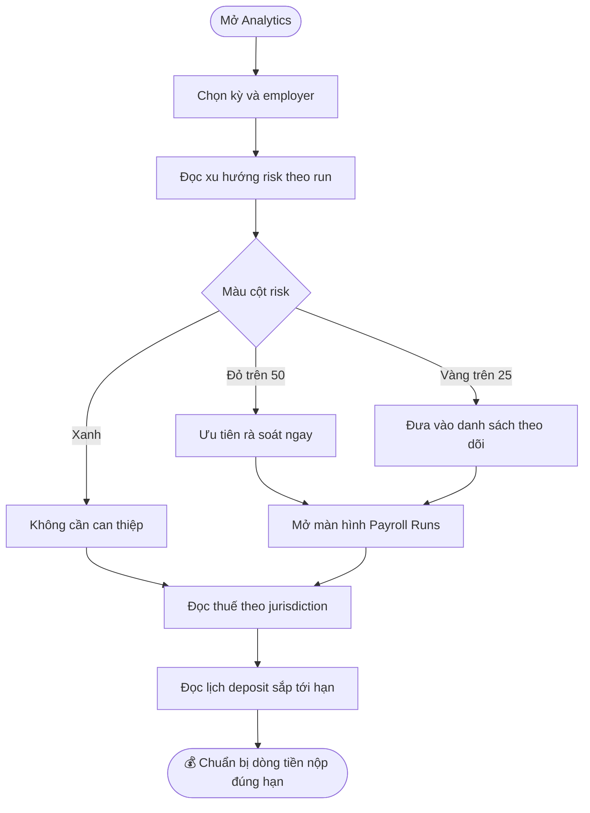
```mermaid
flowchart TD
  A([Mở Analytics]) --> B[Chọn kỳ và employer]
  B --> C[Đọc xu hướng risk theo run]
  C --> D{Màu cột risk}
  D -->|Đỏ trên 50| E[Ưu tiên rà soát ngay]
  D -->|Vàng trên 25| F[Đưa vào danh sách theo dõi]
  D -->|Xanh| G[Không cần can thiệp]
  E --> H[Mở màn hình Payroll Runs]
  F --> H
  G --> I[Đọc thuế theo jurisdiction]
  H --> I
  I --> J[Đọc lịch deposit sắp tới hạn]
  J --> K([💰 Chuẩn bị dòng tiền nộp đúng hạn])
```

#### Vòng đời trạng thái

Mỗi payroll run hiển thị trên Analytics mang một trạng thái phản ánh mức độ tin cậy của dữ liệu run đó.

| Trạng thái hiện tại | Điều kiện chuyển | Trạng thái mới | Ghi chú |
|---|---|---|---|
| `Pending` | Run được chạy và chấm điểm risk | `Review Required` hoặc `Ledger Posted` | Khi còn `Pending` thì chưa có gross, chưa có thuế, chưa có điểm risk |
| `Pending` | Dữ liệu đầu vào không qua được kiểm tra | `Validation Failed` | Không được đưa vào ledger |
| `Review Required` | Rà soát xong, hết blocker | `Ledger Posted` | Chỉ chốt được khi không còn exception blocking |
| `Validation Failed` | Sửa xong vấn đề gốc và chạy lại kiểm tra | `Review Required` | Điểm risk được chấm lại |
| `Ledger Posted` | — | (kết thúc) | Dữ liệu đã vào ledger và phục vụ hồ sơ thuế |

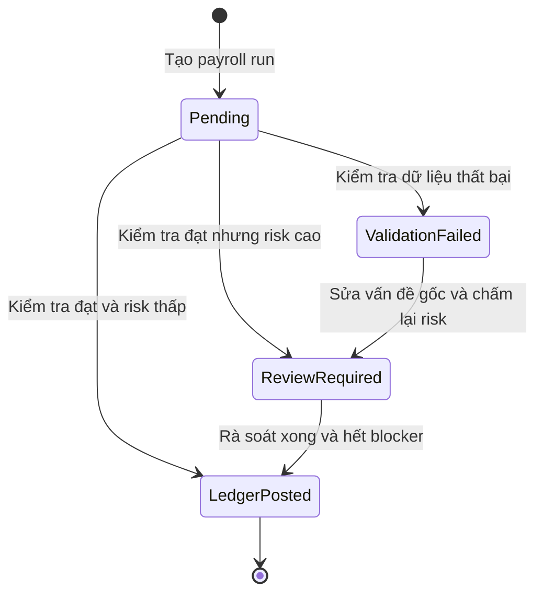
```mermaid
stateDiagram-v2
  [*] --> Pending: Tạo payroll run
  Pending --> LedgerPosted: Kiểm tra đạt và risk thấp
  Pending --> ReviewRequired: Kiểm tra đạt nhưng risk cao
  Pending --> ValidationFailed: Kiểm tra dữ liệu thất bại
  ValidationFailed --> ReviewRequired: Sửa vấn đề gốc và chấm lại risk
  ReviewRequired --> LedgerPosted: Rà soát xong và hết blocker
  LedgerPosted --> [*]
```

#### Quy tắc nghiệp vụ

- **Ngưỡng màu điểm risk:** Điểm **trên 50** hiển thị **đỏ** — bắt buộc rà soát ngay. Điểm **trên 25 đến 50** hiển thị **vàng** — cần theo dõi. Điểm **từ 25 trở xuống** hiển thị **xanh lá** — chấp nhận được.
- **Run chưa chấm điểm được coi là chưa có dữ liệu:** Run chưa chạy (`Pending`) không có điểm risk. Trên biểu đồ, cột của run này ở mức 0 và hiển thị màu xanh, nhưng **đó là do chưa có dữ liệu, không phải do đã sạch**. Không được dựa vào cột này để kết luận run an toàn.
- **Analytics là màn hình đọc, không phải màn hình sửa:** Mọi thao tác xử lý đều diễn ra ở màn hình khác — Payroll Runs, Tax Estimate hoặc Exceptions. Analytics chỉ chỉ đường.
- **Bộ lọc áp dụng toàn màn hình:** Cả hai bộ lọc kỳ và employer cùng ảnh hưởng tới biểu đồ và bảng bên dưới. Khi so sánh số liệu, phải chắc chắn đang so cùng phạm vi lọc.
- **Federal là khối nghĩa vụ lớn nhất:** Trong cơ cấu thuế theo jurisdiction, Federal (thuế thu nhập + FICA) chiếm phần lớn nhất với $210K, gấp hơn ba lần California ($59.6K) và hơn 30 lần Texas SUTA ($6.9K).
- **Tần suất deposit khác nhau theo jurisdiction:** Federal và California nộp semiweekly, New York nộp monthly, Texas nộp quarterly. Không thể áp một lịch chung cho tất cả.

> 💡 **Quan trọng:** Chỉ số `Blocking Exceptions` bằng 4 nghĩa là payroll **chưa thể chốt sạch** ở chế độ strict. Con số này phải về 0 trước khi finalize.

> 💡 **Quan trọng:** Federal và California cùng đến hạn `Jun 24, 2026` theo lịch semiweekly. Hai nghĩa vụ dồn cùng một ngày — phải bảo đảm tài khoản đủ tiền cho **cả hai**, không chỉ khoản lớn hơn.

> 💡 **Quan trọng:** `Missing Profiles` bằng 2 nghĩa là có 2 nhân viên chưa đủ dữ liệu để tính thuế đúng. Nếu chạy payroll khi profile còn thiếu, số thuế của những người này sẽ không đáng tin và sẽ đẩy điểm risk của run lên.

#### Tình huống ngoại lệ

| Tình huống | Hệ thống xử lý | Ai giải quyết |
|---|---|---|
| Một run có điểm risk vọt lên vùng đỏ (trên 50) | Cột hiển thị đỏ trên biểu đồ xu hướng, bảng `Risk by Run` nêu kèm trạng thái để xác định nguyên nhân | Payroll Admin |
| Run mới tạo chưa có điểm risk | Hiển thị không có giá trị trong bảng và cột bằng 0 trên biểu đồ; trạng thái `Pending` là chỉ dấu đúng | Không cần xử lý cho tới khi run được chạy |
| Tỷ lệ `Integration Success` tụt khỏi mức gần như tuyệt đối | Cảnh báo kết nối dữ liệu đang lỗi; kéo theo run thiếu dữ liệu và risk tăng | Payroll Admin / kỹ thuật |
| Một jurisdiction chưa hoàn tất đăng ký | Không tính được nghĩa vụ đầy đủ cho tiểu bang đó, phát sinh vấn đề trong hàng đợi Tax IQ | Bộ phận Tax |
| Hai deposit rơi cùng một ngày đến hạn | Lịch deposit hiện cả hai dòng cùng ngày, không tự động gộp | Owner / Finance Lead |
| Lọc theo một employer và một kỳ nhưng không có run nào | Biểu đồ và bảng rỗng — đây là phạm vi lọc chưa có dữ liệu chứ không phải lỗi | Không cần xử lý |

#### Câu hỏi thường gặp

**Hỏi: Điểm risk bao nhiêu thì tôi phải lo?**
Đáp: Trên 50 là đỏ, phải rà soát ngay. Trên 25 tới 50 là vàng, cần theo dõi và xử lý trong kỳ. Từ 25 trở xuống là xanh, chấp nhận được. Mức trung bình hiện tại là 24 nên tổng thể đang trong vùng an toàn, nhưng có run cá biệt ở 68 cần xử lý riêng.

**Hỏi: Một run hiện cột màu xanh nhưng lại chưa có số. Vậy nó an toàn chưa?**
Đáp: Chưa xác định được. Run đang ở trạng thái `Pending`, tức là chưa chạy nên chưa có dữ liệu để chấm điểm. Cột xanh ở đây phản ánh giá trị bằng 0 chứ không phải "đã kiểm tra và sạch". Phải chờ run được chạy mới có điểm risk thật.

**Hỏi: Tại sao Texas có nghĩa vụ SUTA nhỏ mà vẫn hiển thị riêng?**
Đáp: Vì SUTA là loại thuế do employer đóng, có wage base và rate riêng, có hạn nộp riêng theo quý. Quy mô nhỏ nhưng nếu bỏ sót vẫn dẫn tới nộp trễ. Hạn nộp gần nhất của Texas là `Jul 31, 2026`.

**Hỏi: Tôi sửa được vấn đề ngay trên Analytics không?**
Đáp: Không. Analytics là màn hình xu hướng và tra cứu. Từ đây bạn đi tiếp sang Payroll Runs để xử lý run, sang Tax Estimate để xem ước tính, hoặc sang Exceptions để dọn hàng đợi vấn đề.

---

### 3. Onboarding

**Nhóm chức năng:** Overview
**Người dùng chính:** Owner / Admin
**Việc cần làm đầu tiên:** Hoàn thành checklist khởi tạo trước khi đưa merchant vào vận hành payroll và thuế thật.

#### Mục đích

> Onboarding là cổng vào của merchant. Màn hình dẫn Owner đi qua toàn bộ thiết lập lần đầu — chọn plan, khai hồ sơ doanh nghiệp và EIN, kết nối dữ liệu, cấu hình quy tắc trả lương và phương thức payout, thu chứng từ, duyệt billing và điều khoản. Giá trị cốt lõi: **không cho merchant chạy payroll thật khi hồ sơ chưa đủ**, đồng thời chỉ rõ mỗi bước ai làm, tại sao quan trọng và bấm vào đâu để làm.

#### Chỉ số theo dõi

| Chỉ số | Ý nghĩa nghiệp vụ | Cách đọc |
|---|---|---|
| **Setup Progress** — `33%` | Phần trăm hoàn tất checklist khởi tạo | Tính bằng số bước đã ở trạng thái `Completed` hoặc `Ready` chia cho tổng số bước bắt buộc. Hiện có 2 trên 6 bước đạt, tức 33%. Phải đạt 100% trước khi vận hành thật. |
| **Open Setup Items** — `4` | Số bước bắt buộc còn dang dở | Đây là số việc phải hoàn tất **trước khi** chạy payroll và payout. Miễn còn lớn hơn 0 thì merchant chưa launch được. |
| **Business Type** — `Nail / Beauty` | Hồ sơ ngành nghề chính | Quyết định cách hệ thống xử lý tip, commission, payout cho thợ và các chứng từ đặc thù. |
| **Setup Status** — `In Progress` | Trạng thái tổng của quá trình khởi tạo | Còn hạng mục chính sách đang mở. Trạng thái này chỉ chuyển khi mọi bước bắt buộc hoàn tất và điều khoản được duyệt. |

#### Nội dung màn hình

**Bảng `Merchant First-time Setup`** — bảng trung tâm. Liệt kê **6 bước setup bắt buộc**. Mỗi dòng là một bước, có chủ sở hữu riêng, trạng thái riêng, lý do nghiệp vụ và lối đi thẳng tới màn hình thực hiện.

| Cột | Ý nghĩa |
|---|---|
| `Step` | Tên bước setup |
| `Owner` | Vai trò chịu trách nhiệm hoàn thành bước |
| `Status` | Trạng thái hiện tại của bước |
| `Why It Matters` | Lý do nghiệp vụ — vì sao không được bỏ qua |
| `Actions` | `Open` mở hộp thoại chi tiết bước · `Go` đi thẳng tới màn hình thực hiện |
| `Priority` | Mức ưu tiên — cả 6 bước đều là `Required` |

Sáu bước bắt buộc:

| # | Step | Owner | Status | Why It Matters | `Go` dẫn tới |
|---|---|---|---|---|---|
| 1 | **Choose Tax IQ plan** | Merchant Owner | `Completed` | Đã chọn gói Growth cho vận hành ngành nail và beauty | Billing |
| 2 | **Add business profile and EIN** | Merchant Owner | `Completed` | Đã lưu định danh doanh nghiệp, địa chỉ, liên hệ và EIN dạng che | Settings |
| 3 | **Connect payroll/accounting** | Payroll Admin | `Review` | Nexora Touch đã kết nối; kết nối Retail Partners đang suy giảm chất lượng | Connections |
| 4 | **Upload receipts and payout evidence** | Owner / Bookkeeper | `In progress` | OCR Vault còn 2 mục cần rà soát và 1 mục đang xử lý | OCR Vault |
| 5 | **Review billing and terms** | Merchant Owner | `Pending` | Phải duyệt subscription, ước tính chi phí CPA, Terms và chính sách bảo mật trước khi mở các luồng nhạy cảm | Billing |
| 6 | **Set worker pay rules and payout methods** | Payroll Admin | `Review` | Chọn công thức trả lương trong Pay Engine, rồi xác nhận phương thức payout cho từng thợ trong Payout Hub | Pay Engine |

Chân bảng có nút chính `Continue Setup` mở hộp thoại thiết lập bước.

**Bước tuỳ chọn:** `Invite CPA/bookkeeper` — do Merchant Owner phụ trách, trạng thái `Ready`, yêu cầu **hiện bảng ước tính chi phí trước khi** gửi lời mời vào portal và chia sẻ gói hồ sơ. Bước này **không** tính vào phần trăm hoàn tất vì không bắt buộc để launch.

**Hộp thoại `Merchant Onboarding Step`** — mở khi bấm `Open` hoặc `Continue Setup`. Dùng để rà soát một hạng mục setup: chủ sở hữu, chứng từ cần có và hành động kế tiếp chính xác.

| Khu vực | Nội dung |
|---|---|
| **Setup Item** | Chọn `Step` (một trong 6 bước bắt buộc) · chọn `Optional (if needed)` (`Invite CPA/bookkeeper`) · chọn `Owner` (`Merchant Owner`, `Payroll Admin`, `Bookkeeper`, `CPA`, `TaxIQ Admin`) · chọn `Status` (`Pending`, `In progress`, `Review`, `Ready`, `Completed`) · nhập `Target date` |
| **Required Evidence** | 4 nhóm chứng từ dạng đánh dấu: **Business profile** (tên pháp lý, DBA, EIN, địa chỉ, liên hệ chủ sở hữu, ngành nghề) · **Payroll/accounting connection** (thông tin uỷ quyền kết nối, phạm vi quyền, điểm nhận dữ liệu tự động, trạng thái ký) · **Receipt/payout evidence** (bản ghi OCR ban đầu, ảnh chụp payout, mục đích chi và phân loại) · **CPA/billing approval** (bảng ước tính chi phí, phí giữ chỗ, phạm vi chia sẻ, Terms và sự kiện audit) |
| **Guided Empty State Copy** | Nội dung chuẩn hiển thị khi màn hình chưa có dữ liệu, kèm nút hành động chính |

Nội dung chuẩn trong hộp thoại:

| Screen | Copy | CTA |
|---|---|---|
| Employers | Thêm hồ sơ doanh nghiệp trước khi tạo payroll run | `Add Employer` |
| OCR Vault | Chụp receipt và hoá đơn để Tax IQ chuẩn bị chứng từ cho CPA rà soát | `Capture Receipt` |
| CPA Review | Chỉ kết nối CPA hoặc bookkeeper sau khi đã xem chi phí ước tính và phạm vi truy cập | `Connect CPA` |

**Bảng `Merchant Operating Profile`** — mô tả bối cảnh vận hành, giúp người mới hiểu hệ thống được thiết kế cho ai.

| Nội dung | Diễn giải |
|---|---|
| **Primary business profile** | Merchant ngành nail và beauty, có payout cho thợ, tip, receipt, mileage và nhu cầu CPA |
| **Owner experience** | Dashboard, upload/share link, phê duyệt CPA, billing và hành động kế tiếp có hướng dẫn |
| **Admin/CPA experience** | Payroll run, Tax Estimate, ledger, evidence vault, audit log và rà soát gói hồ sơ khai thuế |
| **Scope control** | Giữ phạm vi setup tập trung vào hồ sơ thuế, chứng từ, payroll, payout và phê duyệt của Owner |

**Bảng `Core Workflow`** — 5 giai đoạn vận hành chuẩn sau khi setup xong. Mỗi dòng là **một giai đoạn**, nêu ai làm và đầu ra là gì.

| Phase | User | Output |
|---|---|---|
| **1. Onboard merchant** | Business Owner | Hồ sơ doanh nghiệp, EIN, plan, điều khoản và thiết lập subscription |
| **2. Connect data** | Payroll Admin | Nguồn kết nối đã được duyệt cho payroll, kế toán, payout, receipt, tip và GPS |
| **3. Resolve gaps** | Owner / Admin | Bổ sung TIN/W-4, receipt, thiết lập tiểu bang, lỗi kết nối và các lỗ hổng chứng từ |
| **4. Review with CPA** | CPA / Bookkeeper | Link portal, phê duyệt chi phí, bình luận, yêu cầu bổ sung chứng từ và gói hồ sơ khai thuế |
| **5. Approve export** | Merchant Owner | Phê duyệt gói cuối, audit log và lưu trữ báo cáo/hoá đơn |

**Bảng `Empty State Acceptance Criteria`** — chuẩn nghiệm thu trạng thái rỗng. Mỗi dòng là **một màn hình**, quy định thông điệp hiển thị và nút hành động chính khi màn hình chưa có dữ liệu.

| Screen | Empty Message | Primary CTA | Action |
|---|---|---|---|
| Employers | Chưa có hồ sơ doanh nghiệp | `Add Employer` | `Open` → Employers |
| Employees | Chưa mời thợ nào | `Invite Employee` | `Open` → Employees |
| Payroll Runs | Chưa có payroll run nào | `Create Run` | `Open` → Payroll Runs |
| OCR Vault | Chưa lưu receipt hoặc hoá đơn nào | `Capture Receipt` | `Open` → OCR Vault |
| Share Links | Chưa tạo link upload/review nào | `Create Link` | `Open` → Share Links |
| CPA Review | Chưa kết nối CPA nào | `Connect CPA` | `Open` → CPA |

**Dải hướng dẫn đầu trang**

| Thành phần | Nội dung |
|---|---|
| Trọng tâm | Setup merchant lần đầu: hồ sơ doanh nghiệp, hồ sơ thợ, kết nối, chứng từ, CPA và billing |
| Ai dùng | Owner / Admin |
| Làm gì trước | Hoàn thành checklist launch trước khi đưa merchant vào payroll và luồng thuế thật |
| Lối tắt | `Start Setup` mở hộp thoại thiết lập bước · `Data Quality` → Data Quality · `Billing` → Billing |

#### Luồng nghiệp vụ: Hoàn tất checklist khởi tạo merchant

**Người thực hiện:** Merchant Owner phối hợp Payroll Admin và Bookkeeper
**Điểm bắt đầu:** Merchant mới được tạo, Setup Progress dưới 100%
**Kết quả mong đợi:** Cả 6 bước bắt buộc đạt `Completed` hoặc `Ready`, merchant đủ điều kiện chạy payroll và payout thật

**User stories:**

- **Là** Merchant Owner, **tôi muốn** thấy còn bao nhiêu bước phải làm và đã xong bao nhiêu phần trăm, **để** biết mình còn cách ngày launch bao xa.
- **Là** Merchant Owner, **tôi muốn** mỗi bước ghi rõ ai chịu trách nhiệm, **để** giao đúng việc cho Payroll Admin và Bookkeeper thay vì tự ôm hết.
- **Là** Payroll Admin, **tôi muốn** bấm `Go` là tới đúng màn hình xử lý bước đó, **để** không phải mò trong menu.
- **Là** Merchant Owner, **khi** tôi chưa duyệt billing và điều khoản, **tôi muốn** hệ thống chặn các luồng nhạy cảm, **để** không vô tình chia sẻ dữ liệu thuế khi chưa đồng ý phạm vi.
- **Là** Merchant Owner, **khi** tôi chưa cần CPA ngay, **tôi muốn** bỏ qua bước mời CPA mà vẫn launch được, **để** không bị chặn bởi một bước không bắt buộc.
- **Là** Merchant Owner, **khi** kết nối dữ liệu bị suy giảm, **tôi muốn** bước đó dừng ở trạng thái cần rà soát chứ không tự động tính là xong, **để** không launch trên nền dữ liệu hỏng.

| Bước | Ai | Hành động | Hệ thống phản hồi | Ghi chú |
|---|---|---|---|---|
| 1 | Merchant Owner | Mở Onboarding | Hiện Setup Progress, số hạng mục còn mở, bảng 6 bước bắt buộc và 5 giai đoạn Core Workflow | Progress tính trên 6 bước bắt buộc, không tính bước CPA |
| 2 | Merchant Owner | Chọn plan Tax IQ | Bước chuyển `Completed`; `Go` dẫn sang Billing | Gói Growth phù hợp vận hành nail và beauty |
| 3 | Merchant Owner | Khai hồ sơ doanh nghiệp và EIN | Lưu tên pháp lý, DBA, EIN dạng che, địa chỉ, liên hệ chủ sở hữu, ngành nghề; bước chuyển `Completed` | Không có EIN thì không tính được nghĩa vụ thuế liên bang |
| 4 | Payroll Admin | Kết nối nguồn payroll/kế toán | Ghi nhận uỷ quyền, phạm vi quyền, điểm nhận dữ liệu tự động và trạng thái ký; kết nối suy giảm giữ bước ở `Review` | Kết nối hỏng thì dữ liệu payroll không đầy đủ |
| 5 | Payroll Admin | Cấu hình quy tắc trả lương và phương thức payout | Chọn công thức trong Pay Engine, xác nhận phương thức payout từng thợ trong Payout Hub | Chưa xong thì không trả tiền cho thợ được |
| 6 | Owner / Bookkeeper | Tải lên receipt và bằng chứng payout | OCR Vault ghi nhận; còn mục chờ rà soát thì bước giữ `In progress` | Chứng từ là căn cứ cho khấu trừ |
| 7 | Merchant Owner | Rà soát và duyệt billing, điều khoản, chính sách bảo mật | Bước chuyển từ `Pending` sang `Completed`; mở khoá các luồng nhạy cảm | Chưa duyệt thì luồng nhạy cảm bị chặn |
| 8 | Merchant Owner | *(Tuỳ chọn)* Mời CPA/bookkeeper | Hiện bảng ước tính chi phí và phạm vi truy cập **trước** khi gửi lời mời | Không bắt buộc để launch |
| 9 | Merchant Owner | Kiểm tra Setup Progress đạt 100% | `Open Setup Items` về 0, trạng thái setup chuyển khỏi `In Progress` | Lúc này mới được chạy payroll thật |

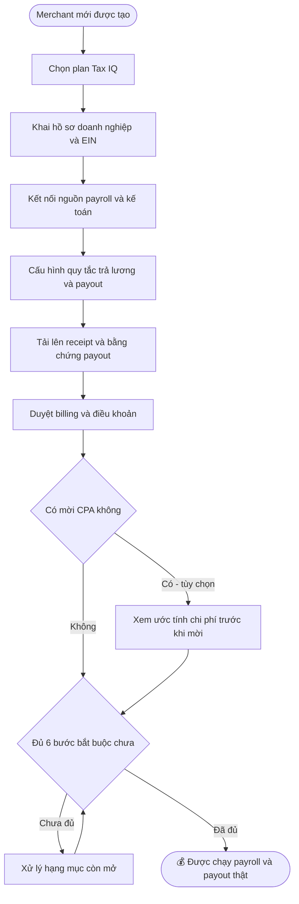
```mermaid
flowchart TD
  A([Merchant mới được tạo]) --> B[Chọn plan Tax IQ]
  B --> C[Khai hồ sơ doanh nghiệp và EIN]
  C --> D[Kết nối nguồn payroll và kế toán]
  D --> E[Cấu hình quy tắc trả lương và payout]
  E --> F[Tải lên receipt và bằng chứng payout]
  F --> G[Duyệt billing và điều khoản]
  G --> H{Có mời CPA không}
  H -->|Có - tùy chọn| I[Xem ước tính chi phí trước khi mời]
  H -->|Không| J{Đủ 6 bước bắt buộc chưa}
  I --> J
  J -->|Chưa đủ| K[Xử lý hạng mục còn mở]
  K --> J
  J -->|Đã đủ| L([💰 Được chạy payroll và payout thật])
```

#### Luồng nghiệp vụ: Cập nhật một bước setup qua hộp thoại

**Người thực hiện:** Merchant Owner hoặc Payroll Admin
**Điểm bắt đầu:** Bấm `Open` trên một dòng bước, hoặc bấm `Continue Setup`
**Kết quả mong đợi:** Bước được gán đúng chủ, đúng trạng thái, đúng hạn mục tiêu và đã đối chiếu chứng từ bắt buộc

**User stories:**

- **Là** Merchant Owner, **tôi muốn** đặt hạn mục tiêu cho từng bước, **để** kiểm soát tiến độ launch chứ không để trôi.
- **Là** Payroll Admin, **tôi muốn** thấy danh sách chứng từ bắt buộc của bước, **để** biết chính xác cần thu gì mới coi là xong.
- **Là** Merchant Owner, **khi** chứng từ chưa đủ, **tôi muốn** không đặt được bước sang `Completed`, **để** phần trăm hoàn tất phản ánh đúng thực tế.
- **Là** Merchant Owner, **tôi muốn** đổi chủ sở hữu của bước sang Bookkeeper hoặc CPA, **để** giao việc cho đúng người thay vì tự làm.

| Bước | Ai | Hành động | Hệ thống phản hồi | Ghi chú |
|---|---|---|---|---|
| 1 | Owner / Admin | Bấm `Open` trên dòng bước hoặc `Continue Setup` | Mở hộp thoại `Merchant Onboarding Step` | Nêu rõ mục setup, chủ, chứng từ và hành động kế tiếp |
| 2 | Owner / Admin | Chọn bước cần xử lý | Danh sách gồm 6 bước bắt buộc; bước mời CPA nằm ở ô tuỳ chọn riêng | Tách rõ bắt buộc và tuỳ chọn |
| 3 | Owner / Admin | Chọn chủ sở hữu | Chọn trong `Merchant Owner`, `Payroll Admin`, `Bookkeeper`, `CPA`, `TaxIQ Admin` | Mỗi bước chỉ có một chủ |
| 4 | Owner / Admin | Chọn trạng thái | Chọn trong `Pending`, `In progress`, `Review`, `Ready`, `Completed` | Trạng thái quyết định phần trăm hoàn tất |
| 5 | Owner / Admin | Đặt hạn mục tiêu | Ghi nhận ngày mục tiêu cho bước | Phục vụ theo dõi tiến độ launch |
| 6 | Owner / Admin | Đối chiếu 4 nhóm chứng từ bắt buộc | Đánh dấu từng nhóm đã đủ; nhóm phê duyệt CPA/billing để trống nếu chưa tới | Chứng từ chưa đủ thì bước chưa được coi là xong |
| 7 | Owner / Admin | Lưu bước | Trạng thái bước cập nhật; Setup Progress và số hạng mục còn mở tính lại | Đạt `Completed` hoặc `Ready` mới tính vào tiến độ |

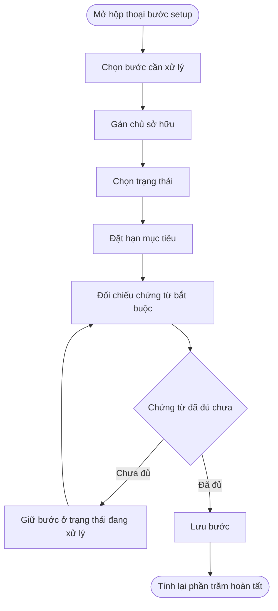
```mermaid
flowchart TD
  A([Mở hộp thoại bước setup]) --> B[Chọn bước cần xử lý]
  B --> C[Gán chủ sở hữu]
  C --> D[Chọn trạng thái]
  D --> E[Đặt hạn mục tiêu]
  E --> F[Đối chiếu chứng từ bắt buộc]
  F --> G{Chứng từ đã đủ chưa}
  G -->|Chưa đủ| H[Giữ bước ở trạng thái đang xử lý]
  H --> F
  G -->|Đã đủ| I[Lưu bước]
  I --> J([Tính lại phần trăm hoàn tất])
```

#### Vòng đời trạng thái

Mỗi bước setup đi qua vòng đời sau. Chỉ hai trạng thái cuối được tính vào phần trăm hoàn tất.

| Trạng thái hiện tại | Điều kiện chuyển | Trạng thái mới | Ghi chú |
|---|---|---|---|
| `Pending` | Chủ sở hữu bắt đầu thu thập dữ liệu và chứng từ | `In progress` | Chưa tính vào tiến độ |
| `In progress` | Đã nộp đủ dữ liệu, chờ đối chiếu chứng từ | `Review` | Chưa tính vào tiến độ |
| `Review` | Đối chiếu đạt, chờ xác nhận cuối | `Ready` | **Được tính vào tiến độ** |
| `Review` | Phát hiện thiếu chứng từ hoặc kết nối lỗi | `In progress` | Quay lại xử lý, tiến độ giảm tương ứng |
| `Ready` | Chủ sở hữu xác nhận hoàn tất | `Completed` | **Được tính vào tiến độ** |
| `Completed` | — | (kết thúc) | Bước đã đóng |

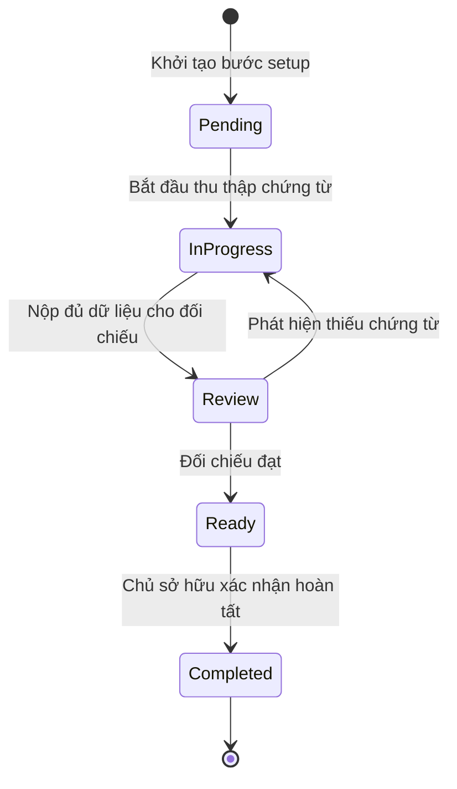
```mermaid
stateDiagram-v2
  [*] --> Pending: Khởi tạo bước setup
  Pending --> InProgress: Bắt đầu thu thập chứng từ
  InProgress --> Review: Nộp đủ dữ liệu cho đối chiếu
  Review --> InProgress: Phát hiện thiếu chứng từ
  Review --> Ready: Đối chiếu đạt
  Ready --> Completed: Chủ sở hữu xác nhận hoàn tất
  Completed --> [*]
```

#### Quy tắc nghiệp vụ

- **Sáu bước bắt buộc trước khi chạy payroll thật:** Chọn plan Tax IQ, khai hồ sơ doanh nghiệp và EIN, kết nối payroll/kế toán, cấu hình quy tắc trả lương và phương thức payout, tải lên receipt và bằng chứng payout, duyệt billing và điều khoản. Mọi bước đều mang mức ưu tiên `Required`.
- **Mời CPA là tuỳ chọn:** `Invite CPA/bookkeeper` **không bắt buộc** để launch và **không** tính vào phần trăm hoàn tất. Merchant vẫn có thể vận hành mà chưa kết nối CPA.
- **Cách tính phần trăm hoàn tất:** Phần trăm = số bước bắt buộc đạt `Completed` hoặc `Ready` chia cho tổng số bước bắt buộc. Hiện đạt 2 trên 6 bước, tức 33%; còn 4 hạng mục mở.
- **Trạng thái `Ready` được tính là đạt:** Cả `Completed` và `Ready` đều tính vào tiến độ. Các trạng thái `Pending`, `In progress`, `Review` không tính.
- **Phải xem chi phí trước khi mời CPA:** Bắt buộc hiển thị bảng ước tính chi phí và phạm vi truy cập **trước** khi gửi lời mời vào portal và chia sẻ gói hồ sơ. Không được mời trước rồi báo giá sau.
- **Duyệt billing và điều khoản mở khoá luồng nhạy cảm:** Phải phê duyệt subscription, ước tính chi phí CPA, Terms và chính sách bảo mật **trước khi** mở các luồng làm việc nhạy cảm.
- **Chứng từ bắt buộc theo từng bước:** Hồ sơ doanh nghiệp (tên pháp lý, DBA, EIN, địa chỉ, liên hệ chủ sở hữu, ngành nghề); kết nối payroll/kế toán (uỷ quyền, phạm vi quyền, điểm nhận dữ liệu tự động, trạng thái ký); chứng từ receipt/payout (bản ghi OCR ban đầu, ảnh chụp payout, mục đích chi, phân loại). Riêng nhóm phê duyệt CPA/billing không bắt buộc đánh dấu ngay từ đầu.
- **Kết nối suy giảm không được tính là xong:** Khi một nguồn dữ liệu ở tình trạng suy giảm chất lượng, bước kết nối giữ ở `Review`, không tự động chuyển sang đạt.
- **Giữ đúng phạm vi setup:** Onboarding chỉ tập trung vào hồ sơ thuế, chứng từ, payroll, payout và phê duyệt của Owner. Không mở rộng ra các hạng mục ngoài phạm vi này.
- **Chuẩn empty state là điều kiện nghiệm thu:** Sáu màn hình Employers, Employees, Payroll Runs, OCR Vault, Share Links, CPA Review đều phải hiển thị đúng thông điệp rỗng và đúng nút hành động chính khi chưa có dữ liệu.

> 💡 **Quan trọng:** Chưa duyệt billing và điều khoản thì **không được mở các luồng nhạy cảm**. Đây là ranh giới về pháp lý và quyền riêng tư dữ liệu thuế, không phải thủ tục hình thức.

> 💡 **Quan trọng:** Bước cấu hình quy tắc trả lương và phương thức payout ảnh hưởng trực tiếp tới **tiền ra khỏi tài khoản merchant**. Chọn sai công thức hoặc sai phương thức payout dẫn tới trả sai tiền cho thợ và sai cơ sở tính thuế. Bắt buộc xác nhận từng thợ trong Payout Hub.

> 💡 **Quan trọng:** EIN là định danh thuế bắt buộc. Thiếu EIN thì không tính được nghĩa vụ thuế liên bang và không lập được hồ sơ khai thuế.

#### Tình huống ngoại lệ

| Tình huống | Hệ thống xử lý | Ai giải quyết |
|---|---|---|
| Kết nối payroll/kế toán bị suy giảm chất lượng | Bước kết nối giữ nguyên `Review`, không tính vào tiến độ hoàn tất | Payroll Admin |
| OCR Vault còn mục chờ rà soát hoặc đang xử lý | Bước tải chứng từ giữ `In progress` cho tới khi mọi mục được xử lý xong | Owner / Bookkeeper |
| Owner chưa duyệt billing và điều khoản | Bước giữ `Pending`; các luồng nhạy cảm bị chặn | Merchant Owner |
| Merchant chưa muốn kết nối CPA | Bỏ qua được — bước mời CPA là tuỳ chọn, không chặn launch, không ảnh hưởng phần trăm hoàn tất | Merchant Owner |
| Owner muốn mời CPA nhưng chưa biết chi phí | Bắt buộc hiện bảng ước tính chi phí và phạm vi truy cập trước khi gửi lời mời | Merchant Owner |
| Bước đã đặt `Review` nhưng phát hiện thiếu chứng từ | Đưa bước về `In progress`, tiến độ giảm tương ứng | Chủ sở hữu của bước |
| Màn hình chưa có dữ liệu | Hiển thị đúng thông điệp rỗng và nút hành động chính theo chuẩn nghiệm thu | Không cần xử lý |
| Chưa có hồ sơ doanh nghiệp nhưng muốn tạo payroll run | Màn hình Employers hiện thông điệp yêu cầu thêm hồ sơ doanh nghiệp trước khi tạo payroll run | Merchant Owner |

#### Câu hỏi thường gặp

**Hỏi: Tôi đã xong 2 bước rồi mà sao Setup Progress mới có 33%?**
Đáp: Vì tiến độ tính trên **6 bước bắt buộc**, không phải trên số bước bạn thấy đã làm. Hiện có 2 bước đạt (chọn plan và khai hồ sơ doanh nghiệp + EIN), còn 4 hạng mục đang mở: kết nối payroll/kế toán, cấu hình quy tắc trả lương và payout, tải chứng từ, duyệt billing và điều khoản.

**Hỏi: Tôi chưa có CPA thì có launch được không?**
Đáp: Được. Mời CPA/bookkeeper là bước **tuỳ chọn**, không tính vào phần trăm hoàn tất và không chặn việc chạy payroll. Bạn có thể kết nối CPA sau, khi tới giai đoạn 4 của Core Workflow. Nhưng khi mời, hệ thống sẽ luôn hiện bảng ước tính chi phí và phạm vi truy cập trước.

**Hỏi: Bước kết nối đã báo "Nexora Touch đã kết nối" rồi mà sao vẫn ở `Review`?**
Đáp: Vì còn một kết nối khác đang suy giảm chất lượng. Bước chỉ chuyển sang đạt khi **mọi nguồn dữ liệu** trong phạm vi đều hoạt động ổn định. Kết nối hỏng nghĩa là dữ liệu payroll chảy vào không đầy đủ, và điều đó sẽ đẩy điểm risk của các payroll run lên.

**Hỏi: Tôi có thể tự đặt một bước sang `Completed` để đi tiếp không?**
Đáp: Không nên và không đúng quy trình. Mỗi bước có danh sách chứng từ bắt buộc phải đối chiếu đủ mới được coi là xong. Đặt trạng thái không phản ánh thực tế sẽ khiến merchant launch trên nền hồ sơ thiếu, và hậu quả xuất hiện muộn hơn ở khâu chốt payroll hoặc xuất gói CPA.

**Hỏi: Sau khi setup xong thì quy trình vận hành thường ngày là gì?**
Đáp: Theo 5 giai đoạn của Core Workflow: (1) Owner khởi tạo merchant, (2) Payroll Admin kết nối dữ liệu, (3) Owner và Admin xử lý các lỗ hổng dữ liệu, (4) CPA/bookkeeper rà soát và trả về gói hồ sơ khai thuế, (5) Owner phê duyệt gói cuối và lưu trữ báo cáo cùng audit log.

## MERCHANT OPS

### 4. POS

**Nhóm chức năng:** Merchant Ops
**Người dùng chính:** Lễ tân / Front desk, Quản lý ca, Chủ salon
**Việc cần làm đầu tiên:** Mở tab `Turn Board` để xem ngay trạm thợ nào đang bận, trạm nào trống trước khi nhận khách mới.

#### Mục đích
> POS là màn hình điều hành sàn của salon Nexora Nail Studio. Màn hình gom ba việc xảy ra liên tục trong ngày vào một chỗ: nhận khách vào hàng đợi, phân khách cho thợ đang trống, và bàn giao ticket sang thanh toán. Giá trị cốt lõi là để lễ tân luôn nhìn thấy thời gian chờ của khách, tình trạng từng thợ và số ticket đang sẵn sàng thu tiền — không cần hỏi miệng hay ghi giấy.

#### Chỉ số theo dõi

| Chỉ số | Ý nghĩa nghiệp vụ | Cách đọc |
|---|---|---|
| `Waiting` — 3 | Số khách đang đứng chờ chưa được xếp thợ | Càng cao càng phải ưu tiên phân khách hoặc mở thêm trạm |
| `Oldest wait: 22m` | Thời gian chờ của khách lâu nhất trong hàng đợi | Đây là khách có nguy cơ bỏ về cao nhất, xử lý trước |
| `Open stations` — 2 | Số trạm thợ đang trống, hiện là Linda P. và Kevin M. | Bằng 0 nghĩa là không thể phân thêm khách, phải để khách chờ |
| `Next ticket` — #A003 | Ticket kế tiếp trong hàng đợi: Anna Kim · Gel Polish | Là gợi ý mặc định cho lần phân khách tiếp theo |
| `Ready tickets` — 2 | Số ticket đã xong dịch vụ, chờ thu tiền — Amy T. và Sarah J. | Càng cao càng nên đẩy nhanh checkout để giải phóng trạm |
| `Open total` — $214 | Tổng tiền dịch vụ của các ticket chưa thanh toán, chưa gồm tip và thuế | Đây là tiền đang treo trên sàn, chưa vào doanh thu |
| `Next handoff` — #A002 | Ticket sắp bàn giao sang checkout: Emma W. · trạm Amy T. | Lễ tân chuẩn bị sẵn để khách không phải chờ ở quầy |

#### Nội dung màn hình

POS chia thành ba tab, mỗi tab ứng với một giai đoạn của khách trong salon. Khi mở màn hình, tab `Turn Board` được chọn sẵn.

| Tab | Nhãn phụ | Nội dung |
|---|---|---|
| `Check-in queue` | 3 waiting | Danh sách khách đã check-in nhưng chưa có thợ |
| `Turn Board` | 2 active | Bảng trạm thợ với trạng thái thời gian thực |
| `Checkout` | 2 ready | Danh sách ticket đã sẵn sàng thanh toán |

**Tab `Check-in queue` — bảng Waitlist**

Mỗi dòng là một khách đang chờ, xếp theo thứ tự vào trước ra trước.

| Cột | Nội dung |
|---|---|
| Tên khách | Tên khách check-in |
| Mã ticket | Mã ticket sinh khi check-in, ví dụ #A003 |
| Dịch vụ yêu cầu | Dịch vụ khách đăng ký khi vào |
| Thời gian chờ | Số phút đã chờ, được tô màu cảnh báo |
| Hành động | Nút `Assign` để đẩy khách sang một trạm trống |

Dữ liệu hàng đợi hiện tại:

| Khách | Ticket | Dịch vụ | Thời gian chờ |
|---|---|---|---|
| Anna Kim | #A003 | Gel Polish | 8 phút |
| Rachel M. | #A004 | Pedicure | 15 phút |
| Tom N. | #A005 | Manicure | 22 phút |

**Tab `Turn Board` — bảng trạm thợ**

Mỗi thẻ là một trạm của một thợ. Thẻ hiển thị chữ viết tắt tên thợ, tên thợ, khách đang phục vụ, dịch vụ, thanh tiến độ ca làm và khung giờ dự kiến, cùng nút hành động tương ứng với trạng thái.

| Trạm | Trạng thái | Khách đang phục vụ | Dịch vụ | Khung giờ | Tiến độ | Nút hành động |
|---|---|---|---|---|---|---|
| Amy T. | Đang phục vụ | Emma W. | Acrylic Full Set | 10:05 → 11:20 | 75% | `Checkout` |
| Linda P. | Trống | — | — | — | — | `+ Assign Guest` |
| Kevin M. | Trống | — | — | — | — | `+ Assign Guest` |
| Sarah J. | Đang phục vụ | Lisa N. | Fill In + Pedicure | 10:15 → 11:45 | 40% | `Checkout` |
| Brian L. | Nghỉ | On break | — | — | — | Không có nút |

**Tab `Checkout` — ticket sẵn sàng thanh toán**

Bảng `Active Checkout Ticket`: mỗi dòng là một ticket đã hoàn tất dịch vụ và chờ thu tiền.

| Cột | Nội dung |
|---|---|
| Ticket | Mã ticket |
| Guest | Tên khách |
| Technician | Thợ đã thực hiện dịch vụ |
| Services | Nhóm dịch vụ trên ticket |
| Status | Trạng thái sẵn sàng thu tiền |
| Action | Nút `Open Checkout` mở màn hình thanh toán đầy đủ |

| Ticket | Khách | Thợ | Dịch vụ | Trạng thái |
|---|---|---|---|---|
| #A002 | Emma W. | Amy T. | Acrylic Full Set + add-ons | `Ready` |
| #A006 | Lisa N. | Sarah J. | Fill In + Pedicure | `Ready` |

Bên cạnh là khối `Checkout Sync` nhắc ba việc sẽ xảy ra quanh thanh toán: mở màn hình checkout đầy đủ để chọn tip, payment method và cách gửi receipt; trạm thợ tự trở lại Turn Board sau khi thanh toán xong; receipt, tip, payout proof và bản ghi audit được tạo sau khi thu tiền.

#### Luồng nghiệp vụ: Khách vào salon đến khi trạm được giải phóng

**Người thực hiện:** Lễ tân **Điểm bắt đầu:** Khách bước vào và check-in tại quầy **Kết quả mong đợi:** Khách được phục vụ, ticket được thanh toán, trạm thợ trở lại trạng thái trống

**User stories:**
- **Là** lễ tân, **tôi muốn** thấy ngay thợ nào đang trống, **để** phân khách mà không phải chạy vào trong hỏi.
- **Là** lễ tân, **tôi muốn** biết khách nào chờ lâu nhất, **để** ưu tiên xử lý và giữ khách không bỏ về.
- **Là** quản lý ca, **tôi muốn** nhìn tiến độ từng trạm, **để** ước lượng khi nào có trạm trống tiếp theo.
- **Là** lễ tân, **khi tất cả trạm đều bận hoặc thợ đang nghỉ**, **tôi muốn** hệ thống báo là không phân được, **để** tôi giải thích thời gian chờ cho khách thay vì xếp nhầm.
- **Là** lễ tân, **tôi muốn** mở checkout ngay từ trạm thợ, **để** không phải tìm lại ticket ở màn hình khác.

| Bước | Ai | Hành động | Hệ thống phản hồi | Ghi chú |
|---|---|---|---|---|
| 1 | Khách | Đến quầy và check-in với dịch vụ mong muốn | Sinh ticket mới và đưa khách vào Waitlist, bắt đầu đếm thời gian chờ | Nhãn tab `Check-in queue` tăng số waiting |
| 2 | Lễ tân | Mở tab `Check-in queue`, xem khách chờ lâu nhất | Hiển thị chỉ số `Oldest wait` và `Next ticket` | Ưu tiên theo thứ tự chờ |
| 3 | Lễ tân | Bấm `Assign` trên thẻ khách | Hệ thống tìm trạm đang trống đầu tiên và gán khách vào trạm đó | Nếu không còn trạm trống, hệ thống báo không có thợ khả dụng và giữ khách trong hàng đợi |
| 4 | Hệ thống | Cập nhật Turn Board | Trạm chuyển từ trống sang đang phục vụ, hiện tên khách, dịch vụ và tiến độ khởi tạo | Thẻ khách biến mất khỏi Waitlist, số waiting giảm |
| 5 | Thợ | Thực hiện dịch vụ | Thanh tiến độ ca của trạm tăng dần theo khung giờ | Trạm ở trạng thái nghỉ không nhận khách |
| 6 | Thợ / Lễ tân | Bấm `Checkout` trên thẻ trạm hoặc mở tab `Checkout` và bấm `Open Checkout` | Chuyển sang màn hình Checkout với đúng ticket của khách | Ticket lúc này ở trạng thái `Ready` |
| 7 | Lễ tân | Hoàn tất thu tiền ở màn hình Checkout | Receipt được lưu, tip đẩy sang Tip Ledger, bản ghi audit được tạo | 💰 Đây là bước tiền thật đổi chủ |
| 8 | Hệ thống | Giải phóng trạm | Trạm thợ trở lại trạng thái trống trên Turn Board và có thể nhận khách kế tiếp | Khép vòng đời của ticket |

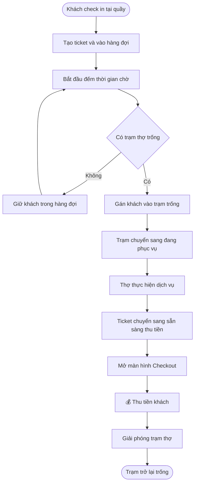
```mermaid
flowchart TD
  A([Khách check in tại quầy]) --> B[Tạo ticket và vào hàng đợi]
  B --> C[Bắt đầu đếm thời gian chờ]
  C --> D{Có trạm thợ trống}
  D -->|Không| E[Giữ khách trong hàng đợi]
  E --> C
  D -->|Có| F[Gán khách vào trạm trống]
  F --> G[Trạm chuyển sang đang phục vụ]
  G --> H[Thợ thực hiện dịch vụ]
  H --> I[Ticket chuyển sang sẵn sàng thu tiền]
  I --> J[Mở màn hình Checkout]
  J --> K[💰 Thu tiền khách]
  K --> L[Giải phóng trạm thợ]
  L --> M([Trạm trở lại trống])
```

#### Vòng đời trạng thái

Thực thể có vòng đời trên POS là **trạm thợ**.

| Trạng thái hiện tại | Điều kiện chuyển | Trạng thái mới | Ghi chú |
|---|---|---|---|
| Trống | Lễ tân bấm `Assign` cho một khách trong hàng đợi | Đang phục vụ | Chỉ trạm ở trạng thái trống mới nhận được khách |
| Đang phục vụ | Thợ hoàn tất dịch vụ | Sẵn sàng checkout | Nút trên thẻ trạm đổi thành `Checkout` |
| Sẵn sàng checkout | Thanh toán hoàn tất ở màn hình Checkout | Trống | Trạm quay lại Turn Board và nhận khách mới |
| Trống | Thợ bắt đầu giờ nghỉ | Nghỉ | Trạm không hiện nút phân khách |
| Nghỉ | Thợ quay lại ca | Trống | Trạm nhận khách trở lại |

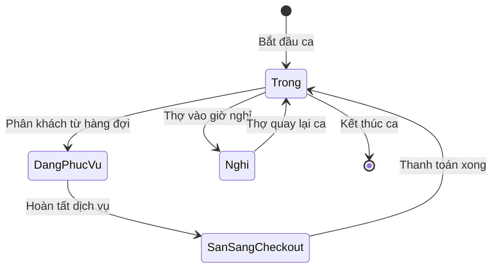
```mermaid
stateDiagram-v2
  [*] --> Trong: Bắt đầu ca
  Trong --> DangPhucVu: Phân khách từ hàng đợi
  DangPhucVu --> SanSangCheckout: Hoàn tất dịch vụ
  SanSangCheckout --> Trong: Thanh toán xong
  Trong --> Nghi: Thợ vào giờ nghỉ
  Nghi --> Trong: Thợ quay lại ca
  Trong --> [*]: Kết thúc ca
```

#### Quy tắc nghiệp vụ
- **Chỉ phân khách vào trạm trống:** khách trong hàng đợi chỉ được gán cho trạm đang ở trạng thái trống. Trạm đang phục vụ hoặc đang nghỉ không nhận thêm khách.
- **Vào trước phục vụ trước:** hàng đợi xếp theo thời gian check-in, khách chờ lâu nhất được hệ thống đề xuất là `Next ticket`.
- **Không có trạm trống thì không phân được:** khi tất cả trạm đều bận, hệ thống chặn thao tác phân khách và giữ nguyên khách trong hàng đợi thay vì xếp bừa.
- **Trạm nghỉ nằm ngoài luồng phân khách:** thợ ở trạng thái nghỉ không xuất hiện trong danh sách trạm khả dụng và không có nút phân khách.
- **Một trạm một khách tại một thời điểm:** trạm chỉ nhận khách mới sau khi ticket hiện tại được thanh toán xong.

> 💡 **Quan trọng:** `Open total` $214 là tiền dịch vụ đang treo trên sàn, chưa gồm tip và sales tax và chưa được ghi nhận là doanh thu. Chỉ khi checkout hoàn tất thì tiền mới thực sự vào và các bản ghi receipt, tip, audit mới được sinh.

> 💡 **Quan trọng:** Trạm thợ chỉ được giải phóng bởi hành động thanh toán thành công, không phải bởi việc thợ báo đã xong. Điều này bảo đảm mọi dịch vụ đã làm đều có ticket được thu tiền.

#### Tình huống ngoại lệ

| Tình huống | Hệ thống xử lý | Ai giải quyết |
|---|---|---|
| Tất cả trạm đều bận, khách vẫn check-in | Khách nằm trong Waitlist, thời gian chờ tiếp tục tăng, hệ thống báo không có thợ khả dụng khi bấm phân khách | Lễ tân thông báo thời gian chờ hoặc hẹn lại |
| Bấm nút phân khách trên thẻ trạm trống mà chưa chọn khách | Hệ thống nhắc chọn khách từ Waitlist trước rồi mới bấm phân | Lễ tân |
| Thợ vào giờ nghỉ khi hàng đợi còn khách | Trạm chuyển sang trạng thái nghỉ và bị loại khỏi danh sách khả dụng | Quản lý ca cân đối lại lịch nghỉ |
| Khách bỏ về khi đang chờ | Lễ tân gỡ khách khỏi Waitlist, số waiting giảm tương ứng | Lễ tân |
| Ticket đã `Ready` nhưng khách chưa ra quầy | Ticket vẫn nằm trong tab `Checkout`, trạm chưa được giải phóng | Lễ tân theo dõi `Next handoff` |

#### Câu hỏi thường gặp

**Hỏi: Tại sao bấm `Assign` mà khách không vào được trạm nào?**
Đáp: Vì tại thời điểm đó không còn trạm nào ở trạng thái trống. Trạm đang phục vụ và trạm đang nghỉ đều không nhận khách. Khách vẫn nằm trong Waitlist và tiếp tục được tính thời gian chờ.

**Hỏi: Thợ đã làm xong nhưng trạm vẫn hiện bận, có phải lỗi không?**
Đáp: Không. Trạm chỉ trở lại trống sau khi ticket được thanh toán xong ở màn hình Checkout. Đây là quy tắc để không dịch vụ nào bị làm xong mà quên thu tiền.

**Hỏi: Con số `Open total` $214 có phải doanh thu hôm nay không?**
Đáp: Không. Đó là tổng tiền dịch vụ của các ticket đang chờ thanh toán, chưa cộng tip và sales tax. Doanh thu chỉ được ghi nhận sau khi checkout hoàn tất.

**Hỏi: Có thể mở checkout thẳng từ Turn Board không?**
Đáp: Có. Thẻ trạm đang phục vụ có nút `Checkout` dẫn thẳng sang màn hình thanh toán của ticket đó, không cần quay lại tab `Checkout`.

---

### 5. Checkout

**Nhóm chức năng:** Merchant Ops
**Người dùng chính:** Lễ tân / Front desk, Chủ salon
**Việc cần làm đầu tiên:** Đối chiếu danh sách dịch vụ trên ticket với khách trước khi chọn tip và bấm thu tiền.

#### Mục đích
> Checkout là nơi tiền thật đổi chủ. Màn hình gom toàn bộ dịch vụ của một ticket, cho chọn mức tip cho thợ, chọn payment method, hiển thị hoá đơn tổng kết và thực hiện thu tiền. Sau khi charge thành công, hệ thống tự động lưu receipt, đẩy tip sang Tip Ledger, tạo bản ghi audit và giải phóng trạm thợ — nghĩa là một thao tác thu tiền tạo ra đầy đủ chứng từ cho kế toán và thuế về sau.

#### Chỉ số theo dõi

| Chỉ số | Ý nghĩa nghiệp vụ | Cách đọc |
|---|---|---|
| Services — $102.00 | Tổng tiền dịch vụ trên ticket | Là căn cứ tính tip theo phần trăm |
| Tip | Số tiền tip khách trả cho thợ, mặc định $15.00 | Thay đổi ngay khi chọn mức tip khác |
| Discount — -$5.00 | Giảm giá áp cho ticket, luôn là số âm | Làm giảm tổng phải thu |
| Sales tax — $8.42 | Thuế bán hàng của ticket | Không phụ thuộc vào tip |
| Total — $120.42 | Số tiền thực thu từ khách | Bằng services + tip + discount + sales tax |

#### Nội dung màn hình

Tiêu đề màn hình cho biết đang thu tiền cho ticket nào: `Ticket #A002 · Emma W. · Station Amy T.`. Nút `← POS Board` cho phép quay lại bảng POS.

**Khối ① `Active Checkout Ticket`**

Đầu khối hiện tên khách Emma W., giờ vào 10:05 AM, dịch vụ chính Acrylic Full Set, thợ Amy T. và nhãn trạng thái `In Service`.

Bảng dịch vụ — mỗi dòng là một dịch vụ hoặc add-on trên ticket:

| Cột | Nội dung |
|---|---|
| Service | Tên dịch vụ, kèm dòng phụ ghi tên thợ thực hiện |
| Price | Giá dịch vụ |
| Tip | Phần tip gắn trực tiếp vào dịch vụ đó |
| Total | Tổng dòng bằng price cộng tip |

| Dịch vụ | Thợ | Price | Tip | Total |
|---|---|---|---|---|
| Acrylic Full Set | Amy T. | $72.00 | $10.00 | $82.00 |
| Gel polish add-on | Amy T. | $18.00 | $0.00 | $18.00 |
| Nail art x2 | Amy T. | $12.00 | $0.00 | $12.00 |

Dưới bảng có ba nút bổ sung cho ticket: `+ Add Service`, `+ Discount`, `+ Coupon`.

**Khối ② `Tip & Technician Split`**

Năm mức tip để chọn nhanh, chỉ được chọn một mức tại một thời điểm:

| Nhãn | Kiểu tính | Giá trị tip khi services là $102.00 |
|---|---|---|
| `$10` | Số tiền cố định | $10.00 |
| `$15` | Số tiền cố định — mặc định | $15.00 |
| `18%` | Phần trăm trên tiền dịch vụ | $18.36 |
| `20%` | Phần trăm trên tiền dịch vụ | $20.40 |
| `Custom` | Số tiền cố định do quầy nhập | $25.00 |

Thẻ chia tip cho biết Amy T. nhận `100% of this ticket's tip`. Khối này kèm ghi chú: tip sẽ được đẩy sang Tip Ledger và audit trail của Tax IQ sau khi thanh toán hoàn tất.

**Khối ③ `Payment Method`**

Bốn phương thức, chọn một:

| Phương thức | Ghi chú |
|---|---|
| `Visa **** 4242` | Thẻ đã lưu, được chọn mặc định |
| `Cash` | Tiền mặt tại quầy |
| `Gift Card` | Thẻ quà tặng |
| `Split Pay` | Chia nhiều phương thức trên cùng một ticket |

Kèm hai ô thông tin gửi receipt: email khách (`emma.w@example.com`) và số điện thoại (`(512) 555-0194`).

**Khối `Payment Summary` — hoá đơn tổng kết**

Đây là hoá đơn xem trước mang tên Nexora Nail Studio, gồm các dòng:

| Dòng | Giá trị mặc định | Cách hình thành |
|---|---|---|
| Services | $102.00 | Tổng giá các dịch vụ trên ticket |
| Tip | $15.00 | Theo mức tip đang chọn |
| Discount | -$5.00 | Giảm giá đã duyệt cho ticket, ghi bằng số âm |
| Sales tax | $8.42 | Thuế bán hàng của ticket |
| Payment | Visa **** 4242 | Payment method đang chọn |
| **Total** | **$120.42** | services + tip + discount + sales tax |

Nút thu tiền hiển thị luôn số tiền cần charge, ví dụ `Charge $120.42`, và tự đổi theo mức tip và payment method đang chọn.

**Khối `After Checkout`** liệt kê bốn việc xảy ra sau khi charge: gửi receipt qua email hoặc SMS cho khách; giải phóng trạm để Amy T. quay lại Turn Board; đẩy tip sang Tip Ledger; ghi audit gồm người thao tác, số tiền, payment method và thời điểm.

#### Luồng nghiệp vụ: Thu tiền một ticket

**Người thực hiện:** Lễ tân **Điểm bắt đầu:** Ticket ở trạng thái sẵn sàng thu tiền được mở từ POS **Kết quả mong đợi:** Khách trả tiền, receipt được gửi, tip vào Tip Ledger, audit được ghi, trạm thợ trống trở lại

**User stories:**
- **Là** lễ tân, **tôi muốn** thấy tổng tiền tự cập nhật khi khách đổi mức tip, **để** đọc đúng số cho khách mà không cần bấm máy tính.
- **Là** lễ tân, **tôi muốn** chọn payment method trước khi charge, **để** hoá đơn và bản ghi audit ghi đúng cách khách trả tiền.
- **Là** thợ, **tôi muốn** tip của mình tự vào Tip Ledger, **để** không phải tự nhớ và khai lại cuối tuần.
- **Là** chủ salon, **tôi muốn** mỗi lần thu tiền đều sinh bản ghi audit, **để** có chứng từ khi CPA hoặc cơ quan thuế hỏi lại.
- **Là** lễ tân, **khi khách muốn thêm dịch vụ hoặc xin giảm giá lúc thanh toán**, **tôi muốn** bổ sung ngay trên ticket, **để** không phải huỷ ticket và làm lại từ đầu.

| Bước | Ai | Hành động | Hệ thống phản hồi | Ghi chú |
|---|---|---|---|---|
| 1 | Lễ tân | Mở checkout của ticket #A002 từ POS | Hiển thị đầy đủ dịch vụ, tip mặc định $15.00 và total $120.42 | Trạng thái ticket là `In Service` |
| 2 | Lễ tân | Rà soát bảng dịch vụ với khách | Mỗi dòng hiện price, tip và total riêng | Nếu thiếu, dùng `+ Add Service` |
| 3 | Lễ tân | Xin giảm giá hoặc áp coupon nếu có | Discount được ghi vào hoá đơn dưới dạng số âm | Giảm giá cần duyệt theo chính sách salon |
| 4 | Khách | Chọn mức tip | Tip và total được tính lại ngay, nút charge đổi theo số mới | Mức phần trăm tính trên tiền dịch vụ, không tính trên thuế |
| 5 | Lễ tân | Chọn payment method | Dòng `Payment` trên hoá đơn đổi theo phương thức đang chọn | Mặc định là thẻ Visa đã lưu |
| 6 | Lễ tân | Xác nhận email hoặc số điện thoại nhận receipt | Thông tin được dùng để gửi receipt sau khi charge | Khách có thể từ chối nhận receipt điện tử |
| 7 | Lễ tân | Bấm `Charge` | 💰 Thu tiền theo total đang hiển thị, nút chuyển sang trạng thái đã thanh toán và receipt được gửi | Đây là điểm không quay lui |
| 8 | Hệ thống | Sinh hồ sơ sau thanh toán | Receipt được lưu, tip đẩy sang Tip Ledger, bản ghi audit được tạo, trạm Amy T. được giải phóng | Ba khối đồng bộ chuyển sang trạng thái hoàn tất |

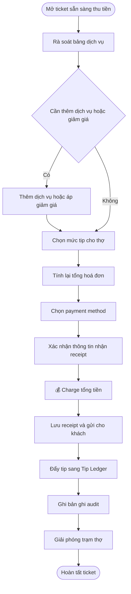
```mermaid
flowchart TD
  A([Mở ticket sẵn sàng thu tiền]) --> B[Rà soát bảng dịch vụ]
  B --> C{Cần thêm dịch vụ hoặc giảm giá}
  C -->|Có| D[Thêm dịch vụ hoặc áp giảm giá]
  D --> E[Chọn mức tip cho thợ]
  C -->|Không| E
  E --> F[Tính lại tổng hoá đơn]
  F --> G[Chọn payment method]
  G --> H[Xác nhận thông tin nhận receipt]
  H --> I[💰 Charge tổng tiền]
  I --> J[Lưu receipt và gửi cho khách]
  J --> K[Đẩy tip sang Tip Ledger]
  K --> L[Ghi bản ghi audit]
  L --> M[Giải phóng trạm thợ]
  M --> N([Hoàn tất ticket])
```

#### Luồng nghiệp vụ: Gửi receipt cho khách

**Người thực hiện:** Lễ tân **Điểm bắt đầu:** Ticket vừa được charge thành công **Kết quả mong đợi:** Khách nhận được receipt qua email hoặc SMS và salon giữ bản lưu

**User stories:**
- **Là** khách, **tôi muốn** nhận receipt qua email hoặc tin nhắn, **để** có chứng từ mà không cần giữ giấy.
- **Là** lễ tân, **khi khách không cung cấp email và số điện thoại**, **tôi muốn** vẫn hoàn tất thanh toán, **để** không giữ khách lại ở quầy.
- **Là** chủ salon, **tôi muốn** receipt luôn được lưu lại kể cả khi khách không nhận, **để** hồ sơ doanh thu không bị thủng.

| Bước | Ai | Hành động | Hệ thống phản hồi | Ghi chú |
|---|---|---|---|---|
| 1 | Lễ tân | Nhập hoặc xác nhận email và số điện thoại của khách | Thông tin được gắn vào ticket | Có thể để trống nếu khách từ chối |
| 2 | Lễ tân | Bấm `Charge` | Sau khi thu tiền, receipt được lưu và gửi tới kênh đã nhập | Nhãn nút chuyển sang trạng thái đã thanh toán và đã gửi receipt |
| 3 | Hệ thống | Lưu bản receipt của salon | Receipt nằm trong hồ sơ ticket bất kể khách có nhận hay không | Là chứng từ cho kế toán |
| 4 | Khách | Nhận receipt | Receipt gồm services, tip, discount, sales tax, payment method và total | Cùng số liệu với hoá đơn xem trước |

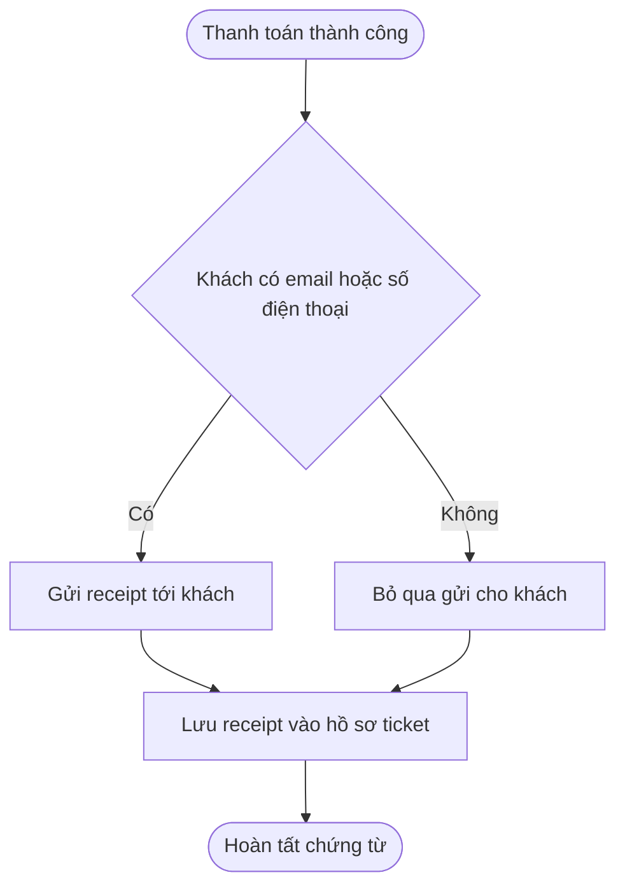
```mermaid
flowchart TD
  A([Thanh toán thành công]) --> B{Khách có email hoặc số điện thoại}
  B -->|Có| C[Gửi receipt tới khách]
  B -->|Không| D[Bỏ qua gửi cho khách]
  C --> E[Lưu receipt vào hồ sơ ticket]
  D --> E
  E --> F([Hoàn tất chứng từ])
```

#### Vòng đời trạng thái

Thực thể có vòng đời ở đây là **ticket checkout**.

| Trạng thái hiện tại | Điều kiện chuyển | Trạng thái mới | Ghi chú |
|---|---|---|---|
| In Service | Thợ hoàn tất dịch vụ trên ticket | Ready | Ticket xuất hiện ở tab `Checkout` của POS |
| Ready | Lễ tân bấm `Charge` và thu tiền thành công | Paid | 💰 Tiền vào, không quay lui |
| Paid | Hệ thống sinh hồ sơ sau thanh toán | Synced | Receipt đã lưu, tip đã vào Tip Ledger, audit đã ghi |
| Synced | — | — | Trạm thợ đã được giải phóng, ticket đóng |

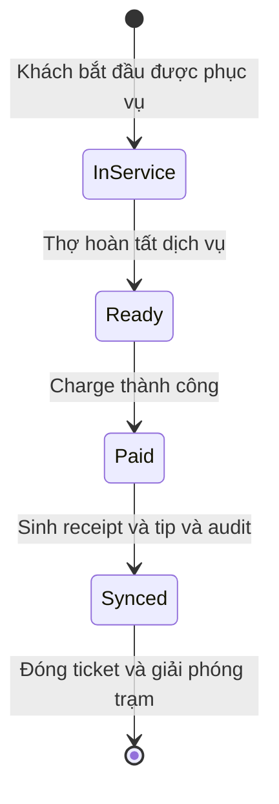
```mermaid
stateDiagram-v2
  [*] --> InService: Khách bắt đầu được phục vụ
  InService --> Ready: Thợ hoàn tất dịch vụ
  Ready --> Paid: Charge thành công
  Paid --> Synced: Sinh receipt và tip và audit
  Synced --> [*]: Đóng ticket và giải phóng trạm
```

#### Quy tắc nghiệp vụ
- **Công thức tổng phải thu:** Total = Services + Tip + Discount + Sales tax. Discount luôn được ghi bằng số âm nên tự động làm giảm tổng. Với ticket #A002: $102.00 + $15.00 + (-$5.00) + $8.42 = $120.42.
- **Tip theo phần trăm tính trên tiền dịch vụ:** mức `18%` và `20%` được tính trên tổng dịch vụ $102.00 chứ không tính trên tổng hoá đơn, nên không cộng tip trên phần thuế và không tính tip trên phần đã giảm giá.
- **Chỉ một mức tip tại một thời điểm:** chọn mức mới sẽ bỏ mức cũ, tổng và nút charge cập nhật ngay.
- **Sales tax không đổi theo tip:** phần thuế bán hàng của ticket giữ nguyên $8.42 dù khách tip bao nhiêu.
- **Toàn bộ tip của ticket thuộc về thợ thực hiện:** với ticket #A002, Amy T. nhận 100% tip.
- **Nút charge luôn hiển thị số tiền thật sẽ thu:** nhãn nút được đồng bộ với dòng Total của hoá đơn để tránh thu nhầm số.

> 💡 **Quan trọng:** Sau khi charge thành công, hệ thống thực hiện đủ bốn việc và không được bỏ sót việc nào — lưu receipt, đẩy tip sang Tip Ledger, tạo bản ghi audit gồm người thao tác, số tiền, payment method và thời điểm, và giải phóng trạm thợ. Đây là mắt xích nối doanh thu tại quầy với hồ sơ thuế về sau.

> 💡 **Quan trọng:** Tip chỉ được ghi nhận vào Tip Ledger sau khi thanh toán hoàn tất. Trước thời điểm đó, mọi con số tip trên màn hình chỉ là dự kiến.

#### Tình huống ngoại lệ

| Tình huống | Hệ thống xử lý | Ai giải quyết |
|---|---|---|
| Khách xin giảm giá tại quầy | Giảm giá được đưa vào hoá đơn dưới dạng số âm và cần duyệt theo chính sách salon | Quản lý ca hoặc chủ salon |
| Khách muốn thêm dịch vụ khi đã ra quầy | Bổ sung dịch vụ vào ticket, tổng và tip theo phần trăm được tính lại | Lễ tân |
| Khách trả bằng nhiều hình thức | Chọn `Split Pay` để chia tiền trên cùng một ticket | Lễ tân |
| Khách không muốn tip | Chọn mức tip thấp nhất hoặc điều chỉnh về không, tổng chỉ còn services + discount + sales tax | Lễ tân |
| Khách không cho email và số điện thoại | Vẫn charge được, receipt được lưu trong hồ sơ ticket nhưng không gửi đi | Lễ tân |
| Bấm charge nhầm số tiền | Ticket đã ở trạng thái đã thanh toán, phải xử lý bằng một khoản điều chỉnh có ghi chú thay vì sửa ngược | Chủ salon |

#### Câu hỏi thường gặp

**Hỏi: Chọn tip `20%` thì hệ thống tính trên $102.00 hay trên $120.42?**
Đáp: Trên $102.00 — tức tổng tiền dịch vụ. Tip 20% bằng $20.40. Cách này bảo đảm khách không tip trên phần sales tax.

**Hỏi: Tại sao dòng Discount hiện dấu trừ?**
Đáp: Vì discount được ghi vào hoá đơn như một khoản âm, để công thức tổng luôn là phép cộng thẳng: services + tip + discount + sales tax.

**Hỏi: Thợ có phải tự khai tip nữa không?**
Đáp: Không. Sau khi charge, tip của ticket tự động được đẩy sang Tip Ledger cùng bản ghi audit, nên số liệu tip cuối kỳ đã có sẵn.

**Hỏi: Đã charge rồi mới phát hiện sai thì làm sao?**
Đáp: Không sửa ngược bản ghi đã thanh toán. Phải tạo một khoản điều chỉnh riêng có ghi chú lý do, để dấu vết audit vẫn liền mạch.

---

### 6. Quick Pay

**Nhóm chức năng:** Merchant Ops
**Người dùng chính:** Chủ salon, Payroll Admin
**Việc cần làm đầu tiên:** Chọn loại payment cần tạo — `Tip Payout`, `Wage Payout` hay `Bonus` — vì loại payment quyết định hạn mức duyệt và cách xử lý thuế.

#### Mục đích
> Quick Pay là nơi tạo một khoản chi trả riêng lẻ cho thợ ngoài chu kỳ payroll thường: trả tip, trả bù lương, hoặc thưởng. Màn hình đi theo năm bước có đánh số — chọn loại payment, chọn thợ, nhập chi tiết, chọn payment method, ghi memo — và luôn hiển thị một thẻ xem trước bên phải cho biết khoản chi này đang ở trạng thái `Ready`, `Review` hay `Blocked`. Giá trị cốt lõi là chặn ngay tại chỗ những khoản chi thiếu chứng từ hoặc vượt quyền, trước khi tiền rời khỏi salon.

#### Chỉ số theo dõi

| Chỉ số | Ý nghĩa nghiệp vụ | Cách đọc |
|---|---|---|
| Risk — `Ready` | Khoản chi hợp lệ, đủ thông tin, không vượt hạn mức | Có thể tạo payment ngay |
| Risk — `Review` | Đủ thông tin nhưng có cảnh báo, ví dụ vượt hạn mức hoặc thiếu chứng từ cash/check | Tạo được nhưng bản ghi sẽ ở trạng thái chờ duyệt |
| Risk — `Blocked` | Còn lỗi bắt buộc chưa xử lý | Nút tạo payment bị khoá |
| Evidence | Trạng thái chứng từ theo nguồn tiền đã chọn | Nếu còn lỗi sẽ hiện là thiếu trường bắt buộc |
| Tax treatment | Cách khoản chi này sẽ được xử lý về thuế | Thay đổi theo loại payment đang chọn |

#### Nội dung màn hình

**Bước ① `PAYMENT TYPE` — ba loại payment**

Mỗi thẻ là một loại payment, mang theo hạn mức duyệt riêng và quy tắc chứng từ riêng.

| Loại | Dùng cho | Tax treatment | Quy tắc chứng từ | Hạn mức duyệt của owner |
|---|---|---|---|---|
| `Tip Payout` | Tip thẻ, tip tiền mặt, tip trực tiếp | Tip Ledger + hỗ trợ 1099/W-2 | Bắt buộc có receipt hoặc payment proof | $500 |
| `Wage Payout` | Ứng lương, sửa sai, trả ngoài chu kỳ | Rà soát wage payroll và withholding | Cần payroll run tham chiếu hoặc owner duyệt | $1,000 |
| `Bonus` | Thưởng KPI, lễ, giới thiệu, giữ chân | Rà soát bonus compensation / 1099 | Cần memo bonus và phê duyệt | $750 |

**Bước ② `SELECT TECHNICIAN` — danh sách thợ**

Mỗi dòng là một thợ, hiển thị chữ viết tắt, tên, phân loại thuế và email; bên phải là payment method chính đã được thợ tự thiết lập.

| Thợ | Phân loại | Email | Method chính | Thông tin nhận tiền chính | Method dự phòng | Thông tin dự phòng |
|---|---|---|---|---|---|---|
| Amy T. | 1099 | amy.t@gmail.com | Zelle | amy.t@gmail.com | Venmo | @amytran-nails |
| Linda P. | 1099 | linda.p@gmail.com | Zelle | linda.p@gmail.com | Cash App | $lindapnails |
| Kevin M. | W2 | kevin.m@gmail.com | Bank/DD | ****4521 | Check | Backup |
| Sarah J. | 1099 | sarah.j@gmail.com | Cash App | $sarahj_nails | Zelle | sarah.j@gmail.com |
| Brian L. | 1099 | brian.l@gmail.com | Venmo | @brianlnails | Zelle | brian.l@gmail.com |

Khi chọn một thợ, hệ thống tự chuyển payment method sang method chính trong hồ sơ của thợ đó và điền sẵn thông tin nhận tiền tương ứng.

**Bước ③ `DETAILS` — chi tiết khoản chi**

| Trường | Ý nghĩa | Giá trị / lựa chọn |
|---|---|---|
| Payment source | Nguồn tiền của khoản chi, quyết định loại chứng từ cần có | `Card tip from POS` (chứng từ: POS ticket A002 và receipt); `Cash tip` (cần cash drawer receipt); `Manual adjustment` (cần owner note); `Payroll correction` (cần payroll run tham chiếu) |
| Payment date | Ngày chi trả | Mặc định 02/07/2026 |
| Amount | Số tiền chi | Mặc định $150.00, kèm nút chọn nhanh $10, $20, $30, $50, $100, $150, $200 |

**Bước ④ `PAYMENT METHOD` — nơi tiền đi tới**

Khối này hiển thị hồ sơ nhận tiền do chính thợ tự thiết lập, gồm method chính có nhãn `PRIMARY` và `Verified`, và method dự phòng có nhãn `BACKUP`. Sáu method có thể chọn:

| Method | Trường thông tin nhận tiền tương ứng |
|---|---|
| `Zelle` | Zelle email / phone number |
| `Cash` | Cash receipt / drawer reference |
| `Venmo` | Venmo username |
| `Cash App` | Cash App handle |
| `Check` | Check number |
| `Bank/DD` | Bank / direct deposit token |

Nhãn ô nhập đổi theo method đang chọn. Nếu method đang chọn trùng với method chính hoặc method dự phòng của thợ, hệ thống điền sẵn thông tin từ hồ sơ.

**Bước ⑤ `NOTES` — memo mục đích kinh doanh**

Ô ghi chú bắt buộc, nêu lý do chi trả và được lưu lại như chứng từ.

**Thẻ xem trước và khối `Audit & Ledger Readiness`**

Thẻ xem trước bên phải luôn phản ánh trạng thái hiện tại của biểu mẫu:

| Dòng | Nội dung |
|---|---|
| Biểu tượng và tiêu đề | Loại payment đang chọn |
| For | Tên thợ và phân loại thuế, ví dụ `Brian L. · 1099` |
| Amount | Số tiền đang nhập |
| Method | Payment method đang chọn |
| Payment date | Ngày chi trả |
| Source | Nguồn tiền đang chọn |
| Tax treatment | Cách xử lý thuế theo loại payment |
| Risk | `Ready`, `Review` hoặc `Blocked` |
| Evidence | Trạng thái chứng từ |
| Memo | Nội dung ghi chú, nếu trống hiện là chưa có ghi chú mục đích |

Khối `Audit & Ledger Readiness` liệt kê từng lỗi bắt buộc và từng cảnh báo. Khi không còn lỗi và không còn cảnh báo, khối này báo sẵn sàng tạo bản nháp ledger, sự kiện audit của payout và nhiệm vụ thu thập chứng từ.

**Khối `Recent`** liệt kê bốn payout gần nhất với biểu tượng theo loại, tên thợ, kỳ, method, trạng thái chứng từ và số tiền; số tiền được tô cam nếu payout còn chờ duyệt hoặc chờ rà soát, tô xanh nếu đã ổn. Có liên kết mở toàn bộ danh sách payout.

#### Luồng nghiệp vụ: Tạo một khoản Quick Pay

**Người thực hiện:** Chủ salon hoặc Payroll Admin **Điểm bắt đầu:** Cần chi trả cho một thợ ngoài chu kỳ payroll **Kết quả mong đợi:** Một bản ghi payout được tạo với trạng thái `Ready to send` hoặc `Pending approval`, kèm audit và nhiệm vụ chứng từ

**User stories:**
- **Là** chủ salon, **tôi muốn** trả tip cho thợ ngay trong ngày, **để** thợ không phải chờ tới cuối tuần.
- **Là** Payroll Admin, **tôi muốn** hệ thống điền sẵn thông tin nhận tiền từ hồ sơ thợ, **để** không gõ nhầm số tài khoản.
- **Là** chủ salon, **khi tôi bỏ trống memo hoặc nhập số tiền bằng 0**, **tôi muốn** hệ thống chặn lại, **để** không tạo ra khoản chi không giải trình được.
- **Là** chủ salon, **khi khoản chi vượt hạn mức**, **tôi muốn** hệ thống đánh dấu cần duyệt, **để** khoản tiền lớn không đi ra ngoài mà không có ai xác nhận.
- **Là** bookkeeper, **khi thợ được trả bằng cash hoặc check**, **tôi muốn** hệ thống nhắc đính kèm chứng từ, **để** gói hồ sơ gửi CPA không bị thiếu.

| Bước | Ai | Hành động | Hệ thống phản hồi | Ghi chú |
|---|---|---|---|---|
| 1 | Chủ salon | Chọn loại payment ở bước ① | Thẻ xem trước đổi tiêu đề, tax treatment và hạn mức duyệt tương ứng | Hạn mức là $500 / $1,000 / $750 tuỳ loại |
| 2 | Chủ salon | Chọn thợ ở bước ② | Method chính của thợ được chọn tự động, thông tin nhận tiền được điền sẵn | Thẻ xem trước hiện tên và phân loại thuế của thợ |
| 3 | Chủ salon | Chọn payment source, ngày chi và số tiền ở bước ③ | Dòng Source và Evidence của thẻ xem trước cập nhật theo nguồn tiền đã chọn | Có thể bấm nút số tiền nhanh |
| 4 | Chủ salon | Xác nhận hoặc đổi payment method ở bước ④ | Nhãn ô thông tin nhận tiền đổi theo method | Đổi sang method ngoài hồ sơ thì phải tự nhập thông tin |
| 5 | Chủ salon | Nhập memo mục đích kinh doanh ở bước ⑤ | Memo hiện trên thẻ xem trước | Memo dưới 8 ký tự sẽ bị coi là chưa hợp lệ |
| 6 | Hệ thống | Kiểm tra hợp lệ liên tục | Cập nhật Risk thành `Ready`, `Review` hoặc `Blocked`, liệt kê lỗi và cảnh báo trong khối audit | Nút tạo payment bị khoá khi còn lỗi |
| 7 | Chủ salon | Bấm nút tạo payment | 💰 Bản ghi payout được tạo với mã dạng PAY-xxxxxx và đưa lên đầu danh sách Recent | Trạng thái là `Ready to send` nếu không có cảnh báo, `Pending approval` nếu có |
| 8 | Hệ thống | Sinh hồ sơ đi kèm | Ghi sự kiện audit, tạo bản nháp ledger và nhiệm vụ chứng từ, đồng bộ khoản chi vào danh sách payout | Khoản chi xuất hiện ở Payout Hub |

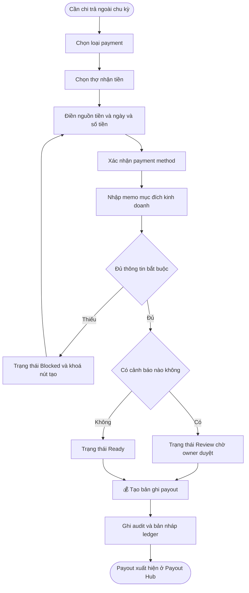
```mermaid
flowchart TD
  A([Cần chi trả ngoài chu kỳ]) --> B[Chọn loại payment]
  B --> C[Chọn thợ nhận tiền]
  C --> D[Điền nguồn tiền và ngày và số tiền]
  D --> E[Xác nhận payment method]
  E --> F[Nhập memo mục đích kinh doanh]
  F --> G{Đủ thông tin bắt buộc}
  G -->|Thiếu| H[Trạng thái Blocked và khoá nút tạo]
  H --> D
  G -->|Đủ| I{Có cảnh báo nào không}
  I -->|Có| J[Trạng thái Review chờ owner duyệt]
  I -->|Không| K[Trạng thái Ready]
  J --> L[💰 Tạo bản ghi payout]
  K --> L
  L --> M[Ghi audit và bản nháp ledger]
  M --> N([Payout xuất hiện ở Payout Hub])
```

#### Luồng nghiệp vụ: Xử lý khoản chi bị chặn hoặc cần duyệt

**Người thực hiện:** Chủ salon, Payroll Admin **Điểm bắt đầu:** Thẻ xem trước hiện `Blocked` hoặc `Review` **Kết quả mong đợi:** Khoản chi được hoàn thiện hoặc được duyệt đúng thẩm quyền

**User stories:**
- **Là** Payroll Admin, **tôi muốn** biết chính xác trường nào còn thiếu, **để** sửa đúng chỗ thay vì dò từng bước.
- **Là** chủ salon, **tôi muốn** thấy rõ khoản nào vượt hạn mức, **để** quyết định duyệt hay chia nhỏ.
- **Là** bookkeeper, **tôi muốn** cảnh báo chứng từ cash và check hiện ngay lúc tạo, **để** không phải đi tìm chứng từ vào lúc chốt sổ.

| Bước | Ai | Hành động | Hệ thống phản hồi | Ghi chú |
|---|---|---|---|---|
| 1 | Hệ thống | Phát hiện thiếu trường bắt buộc | Risk chuyển `Blocked`, nút tạo bị khoá và đổi nhãn thành yêu cầu hoàn thiện thông tin | Lỗi được liệt kê bằng chấm đỏ |
| 2 | Payroll Admin | Bổ sung trường còn thiếu | Lỗi biến mất khỏi khối audit khi trường được điền đúng | Kiểm tra chạy lại sau mỗi thay đổi |
| 3 | Hệ thống | Phát hiện số tiền vượt hạn mức của loại payment | Risk chuyển `Review`, hiện cảnh báo cần owner duyệt kèm mức hạn mức | Vẫn tạo được bản ghi |
| 4 | Hệ thống | Phát hiện trả bằng cash hoặc check mà memo không nhắc tới chứng từ | Hiện cảnh báo phải đính kèm hoặc dẫn chiếu chứng từ trước khi export CPA | Chấm cam trong khối audit |
| 5 | Chủ salon | Bổ sung dẫn chiếu chứng từ vào memo hoặc chấp nhận cảnh báo | Nếu cảnh báo được xử lý, Risk trở lại `Ready` | Nếu giữ nguyên, bản ghi được tạo ở trạng thái chờ duyệt |
| 6 | Chủ salon | Duyệt khoản chi vượt hạn mức | Bản ghi chuyển sang trạng thái sẵn sàng gửi tiền | Quyết định duyệt được ghi vào audit |

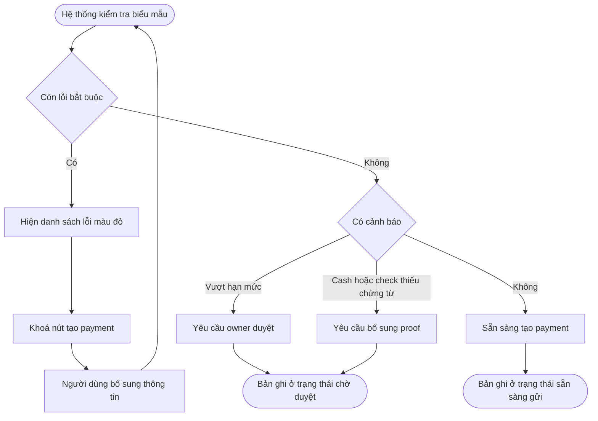
```mermaid
flowchart TD
  A([Hệ thống kiểm tra biểu mẫu]) --> B{Còn lỗi bắt buộc}
  B -->|Có| C[Hiện danh sách lỗi màu đỏ]
  C --> D[Khoá nút tạo payment]
  D --> E[Người dùng bổ sung thông tin]
  E --> A
  B -->|Không| F{Có cảnh báo}
  F -->|Vượt hạn mức| G[Yêu cầu owner duyệt]
  F -->|Cash hoặc check thiếu chứng từ| H[Yêu cầu bổ sung proof]
  F -->|Không| I[Sẵn sàng tạo payment]
  G --> J([Bản ghi ở trạng thái chờ duyệt])
  H --> J
  I --> K([Bản ghi ở trạng thái sẵn sàng gửi])
```

#### Vòng đời trạng thái

Thực thể có vòng đời là **trạng thái rủi ro của biểu mẫu Quick Pay** và **bản ghi payout được tạo ra**.

| Trạng thái hiện tại | Điều kiện chuyển | Trạng thái mới | Ghi chú |
|---|---|---|---|
| Blocked | Bổ sung đủ toàn bộ trường bắt buộc và không còn cảnh báo | Ready | Nút tạo payment được mở khoá |
| Blocked | Bổ sung đủ trường bắt buộc nhưng vẫn còn cảnh báo | Review | Tạo được nhưng cần duyệt |
| Ready | Xoá bớt thông tin bắt buộc | Blocked | Kiểm tra chạy lại ngay khi biểu mẫu đổi |
| Ready | Tăng số tiền vượt hạn mức của loại payment | Review | Cảnh báo owner duyệt xuất hiện |
| Review | Xử lý xong cảnh báo, ví dụ giảm số tiền dưới hạn mức hoặc bổ sung dẫn chiếu chứng từ | Ready | Cảnh báo biến mất |
| Ready | Bấm tạo payment | Bản ghi `Ready to send` | 💰 Khoản chi được đưa vào danh sách payout |
| Review | Bấm tạo payment | Bản ghi `Pending approval` | Chờ owner duyệt trước khi chuyển tiền |

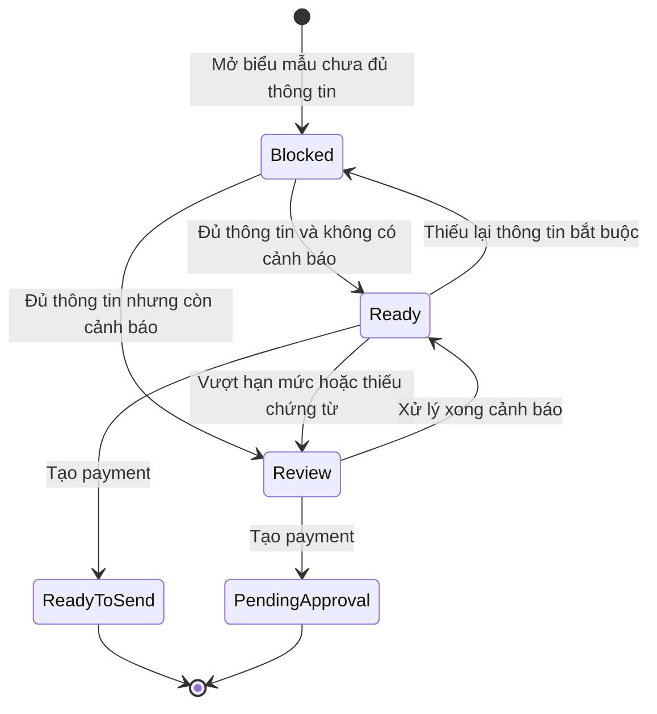
```mermaid
stateDiagram-v2
  [*] --> Blocked: Mở biểu mẫu chưa đủ thông tin
  Blocked --> Ready: Đủ thông tin và không có cảnh báo
  Blocked --> Review: Đủ thông tin nhưng còn cảnh báo
  Ready --> Blocked: Thiếu lại thông tin bắt buộc
  Ready --> Review: Vượt hạn mức hoặc thiếu chứng từ
  Review --> Ready: Xử lý xong cảnh báo
  Ready --> ReadyToSend: Tạo payment
  Review --> PendingApproval: Tạo payment
  ReadyToSend --> [*]
  PendingApproval --> [*]
```

#### Quy tắc nghiệp vụ
- **Hạn mức duyệt theo loại payment:** `Tip Payout` là $500, `Wage Payout` là $1,000, `Bonus` là $750. Khoản chi vượt hạn mức của loại đang chọn sẽ sinh cảnh báo yêu cầu owner duyệt.
- **Năm điều kiện chặn bắt buộc:** chưa chọn thợ; số tiền bằng 0 hoặc để trống; chưa chọn ngày chi trả; chưa có thông tin nhận tiền tương ứng với method đang chọn; memo mục đích kinh doanh ngắn hơn 8 ký tự. Bất kỳ điều kiện nào chưa thoả sẽ khoá nút tạo payment và đưa Risk về `Blocked`.
- **Cảnh báo chứng từ cash và check:** khi method là `Cash` hoặc `Check` mà memo không nhắc tới chứng từ, hệ thống yêu cầu đính kèm hoặc dẫn chiếu bằng chứng trước khi export CPA.
- **Ba mức rủi ro:** còn lỗi là `Blocked`, chỉ còn cảnh báo là `Review`, sạch lỗi và sạch cảnh báo là `Ready`.
- **Trạng thái bản ghi phụ thuộc cảnh báo:** khoản chi có cảnh báo được tạo ở trạng thái `Pending approval`; khoản chi không cảnh báo được tạo ở trạng thái `Ready to send`.
- **Thông tin nhận tiền lấy từ hồ sơ do thợ tự thiết lập:** hệ thống điền sẵn theo method chính hoặc method dự phòng của thợ; chọn method khác thì phải nhập tay.
- **Chứng từ đi theo nguồn tiền:** tip thẻ từ POS dựa trên ticket và receipt; tip tiền mặt cần cash drawer receipt; điều chỉnh thủ công cần owner note; sửa payroll cần dẫn chiếu payroll run.

> 💡 **Quan trọng:** Mọi khoản Quick Pay đều là tiền thật rời khỏi salon. Nút tạo payment chỉ mở khi đủ cả năm điều kiện bắt buộc — đây là lớp chặn cuối cùng trước khi tiền đi.

> 💡 **Quan trọng:** Khoản chi trả bằng cash hoặc check không có chứng từ dẫn chiếu sẽ chặn export gói hồ sơ cho CPA. Bổ sung chứng từ ngay lúc tạo rẻ hơn nhiều so với đi tìm lại vào lúc chốt sổ.

#### Tình huống ngoại lệ

| Tình huống | Hệ thống xử lý | Ai giải quyết |
|---|---|---|
| Chưa chọn thợ mà đã bấm tạo payment | Nút bị khoá, thông báo yêu cầu chọn thợ | Người tạo khoản chi |
| Nhập số tiền bằng 0 hoặc để trống | Risk `Blocked`, liệt kê lỗi yêu cầu nhập số tiền | Người tạo khoản chi |
| Bỏ trống ngày chi trả | Risk `Blocked`, yêu cầu chọn ngày | Người tạo khoản chi |
| Đổi sang method không có trong hồ sơ thợ | Ô thông tin nhận tiền bị trống, hệ thống yêu cầu nhập thông tin đúng loại method | Payroll Admin |
| Memo quá ngắn hoặc chỉ ghi vài chữ | Risk `Blocked`, yêu cầu ghi mục đích kinh doanh ngắn gọn nhưng đủ nghĩa | Người tạo khoản chi |
| Tip Payout $800 cho một thợ | Vượt hạn mức $500, Risk `Review`, bản ghi tạo ra ở trạng thái `Pending approval` | Chủ salon duyệt |
| Trả $200 tiền mặt, memo chỉ ghi lý do mà không nhắc chứng từ | Cảnh báo yêu cầu proof trước khi export CPA | Chủ salon hoặc bookkeeper |
| Thợ chưa hoàn tất hồ sơ nhận tiền | Không có thông tin để điền sẵn, phải nhập tay hoặc yêu cầu thợ tự thiết lập trước | Payroll Admin |

#### Câu hỏi thường gặp

**Hỏi: Vì sao nút tạo payment bị mờ dù tôi đã điền gần hết?**
Đáp: Vì còn ít nhất một trong năm điều kiện bắt buộc chưa thoả — chưa chọn thợ, số tiền bằng 0, thiếu ngày, thiếu thông tin nhận tiền, hoặc memo ngắn hơn 8 ký tự. Khối `Audit & Ledger Readiness` liệt kê chính xác lỗi còn lại.

**Hỏi: `Review` khác `Blocked` như thế nào?**
Đáp: `Blocked` nghĩa là còn lỗi bắt buộc, không tạo được. `Review` nghĩa là thông tin đã đủ nhưng có cảnh báo — thường là vượt hạn mức hoặc thiếu dẫn chiếu chứng từ — nên bản ghi vẫn tạo được nhưng ở trạng thái chờ duyệt.

**Hỏi: Tip Payout $600 có tạo được không?**
Đáp: Có, nhưng vượt hạn mức $500 của loại `Tip Payout` nên hệ thống đánh dấu `Review` và bản ghi được tạo ở trạng thái `Pending approval`, chờ chủ salon duyệt.

**Hỏi: Tôi trả tiền mặt cho thợ, phải ghi memo thế nào để không bị cảnh báo?**
Đáp: Memo cần nhắc tới chứng từ — ví dụ dẫn số receipt, tham chiếu drawer, hoặc ghi rõ là đã có proof đính kèm. Nếu không, hệ thống sẽ cảnh báo phải bổ sung chứng từ trước khi export CPA.

---

### 7. Payout Hub

**Nhóm chức năng:** Merchant Ops
**Người dùng chính:** Chủ salon, Payroll Admin, Bookkeeper
**Việc cần làm đầu tiên:** Mở tab `Overview` để xem có bao nhiêu thợ đã sẵn sàng nhận tiền, ai còn thiếu thiết lập, và hàng chờ chứng từ đang tồn bao nhiêu việc.

#### Mục đích
> Payout Hub là phòng điều khiển của toàn bộ việc chi trả cho thợ. Màn hình trả lời một câu hỏi duy nhất: **tiền đi đâu**. Nó quản lý hồ sơ nhận tiền của từng thợ, lịch sử payout, hàng chờ chứng từ, mức độ sẵn sàng cho 1099/W-2, cách hạch toán vào sổ và các thiết lập chặn. Payout Hub không tính tiền và cũng không chuyển tiền — nó thiết lập đường đi và các rào chắn để khi Quick Pay hoặc Weekly Payroll thực hiện giao dịch thì mọi thứ đều hợp lệ và có chứng từ.

**Nguyên tắc phân vai cần thuộc lòng:**

| Màn hình | Quyết định | Kết quả để lại |
|---|---|---|
| Pay Engine | Trả **bao nhiêu** | Công thức lương, hoa hồng, bonus, chu kỳ trả |
| Payout Hub | Tiền **đi đâu** | Method chính, method dự phòng, quy tắc chứng từ, ngưỡng duyệt |
| Quick Pay hoặc Weekly Payroll | **Tạo giao dịch thật** | Bản ghi payout, chứng từ, bản ghi audit |

#### Chỉ số theo dõi

| Chỉ số | Ý nghĩa nghiệp vụ | Cách đọc |
|---|---|---|
| `PENDING PAYMENT` — $2,945 · 2 technicians | Tổng tiền đang chờ chi cho 2 thợ | Là nghĩa vụ chi trả đang treo, cần xử lý trong kỳ |
| `Ready Workers` — 4 | Số thợ đã đủ điều kiện nhận payout ngay | Bằng số thợ có hồ sơ nhận tiền và hồ sơ thuế hoàn chỉnh |
| `Pending Setup` — 1 | Số thợ còn thiếu thiết lập, hiện là Jenny N. thiếu payment method | Không thể trả tiền cho thợ này cho tới khi hoàn tất |
| `Proof Queue` — 3 | Số mục chứng từ cần rà soát | Còn tồn nghĩa là gói hồ sơ CPA chưa export được |
| `Tax Ready` — 4/5 | Tỷ lệ thợ có hồ sơ W-9/W-4 đầy đủ | 4 trên 5 thợ đủ, 1 thợ còn thiếu |

#### Nội dung màn hình

Payout Hub có bảy tab. Khi mở màn hình, tab `Overview` được chọn sẵn.

| Tab | Trả lời câu hỏi |
|---|---|
| `Overview` | Hôm nay có gì cần xử lý ngay |
| `Worker Profiles` | Từng thợ nhận tiền bằng cách nào |
| `History` | Đã trả những khoản nào, trạng thái ra sao |
| `Proof` | Chứng từ nào còn thiếu hoặc chờ rà soát |
| `1099 / W-2` | Hồ sơ thuế cuối năm đã sẵn sàng chưa |
| `Bookkeeping` | Từng loại payout vào sổ ở đâu |
| `Settings` | Quy tắc chặn và ngưỡng duyệt là gì |

**Tab `Overview`**

Ngoài bốn chỉ số ở trên, tab này có hai khối:

- `Today's Payout Control Room`: nhắc ba việc — quy tắc tính tiền đã được cấu hình ở Pay Engine; chứng từ phải được đính kèm trước khi export CPA, chấp nhận bank memo, ảnh chụp màn hình, cash receipt hoặc owner note; lời mời của Jenny N. đang chờ, cần gửi lại link thiết lập hoặc huỷ nếu thợ không còn làm.
- `Next Best Actions`: bảng việc cần làm xếp theo mức ưu tiên.

| Mức ưu tiên | Việc | Người chịu trách nhiệm |
|---|---|---|
| High | Rà soát chứng từ payout mới nhất | Owner |
| High | Cấu hình payment method còn thiếu cho thợ | Payroll Admin |
| Medium | Export gói payout cho CPA | Bookkeeper |

**Tab `Worker Profiles`**

Bảng `Employee Payment Method Setup` liệt kê bốn hạng mục thiết lập; mỗi dòng là một hạng mục cần hoàn tất trước lần trả tiền đầu tiên.

| Hạng mục | Merchant nhập gì | Ai dùng | Quy tắc |
|---|---|---|---|
| Primary payout method | Zelle email/phone, ACH account token, Venmo, Cash App, check hoặc cash | Quick Pay và Weekly Payroll | Bắt buộc |
| Backup method | Method thứ hai phòng khi method chính lỗi hoặc thợ đổi ý | Payout retry | Khuyến nghị |
| Worker tax profile | W-2/W-4 hoặc 1099/W-9, trạng thái TIN, bang làm việc và cư trú | Tax Center và Payroll | Bắt buộc |
| Payment proof rule | Ảnh chụp màn hình, bank memo, số check, cash receipt hoặc owner note | OCR Vault và CPA Review | Bắt buộc |

Bên dưới là thẻ hồ sơ của từng thợ. Mỗi thẻ là một thợ, gồm tên, phân loại thuế, email và điện thoại, ngày thiết lập, method nhận tiền chính có nhãn `PRIMARY` và `Verified`, method dự phòng có nhãn `BACKUP`, bốn số cuối SSN, trạng thái W-9 và nút trả tiền ngay.

| Thợ | Phân loại | Liên hệ | Thiết lập từ | Method chính | Method dự phòng | SSN cuối | W-9 |
|---|---|---|---|---|---|---|---|
| Amy T. | 1099 | amy.t@gmail.com · (713)555-0201 | 06/01/2024 | Zelle — amy.t@gmail.com | Venmo — @amytran-nails | ***-4821 | Đã nộp |
| Linda P. | 1099 | linda.p@gmail.com · (713)555-0187 | 11/11/2022 | Zelle — linda.p@gmail.com | Cash App — $lindapnails | ***-7392 | Đã nộp |
| Kevin M. | W2 | kevin.m@gmail.com · (713)555-0344 | 16/01/2024 | Direct Deposit — ****4521 | Check | ***-1190 | Đã nộp |
| Sarah J. | 1099 | sarah.j@gmail.com · (713)555-0156 | 02/02/2024 | Cash App — $sarahj_nails | Zelle — sarah.j@gmail.com | ***-6047 | Đã nộp |

Tab này còn có hai thông báo thường trực: chứng từ payout mới nhất đã sẵn sàng để rà soát (PAY-2026-001 · Amy T. · Zelle · chứng từ đã khớp), và lời mời đang chờ Jenny N. thiết lập thông tin nhận tiền — kèm hai nút gửi lại và huỷ. Tổng cộng có 5 thợ đã kết nối và 1 lời mời chưa được chấp nhận.

**Tab `History` — bảng `Payout History`**

Mỗi dòng là một khoản đã chi hoặc đang chờ chi.

| Cột | Nội dung |
|---|---|
| Payout ID | Mã payout |
| Worker | Thợ nhận tiền |
| Period | Kỳ chi trả |
| Amount | Số tiền |
| Method | Payment method |
| Type | Loại payout |
| Status | `Confirmed`, `Pending` hoặc `Cancelled` |
| Actions | Nút `Review` mở chi tiết payout, và `Pay Again` mở Quick Pay |

| Payout ID | Worker | Period | Amount | Method | Type | Status |
|---|---|---|---|---|---|---|
| PAY-2026-001 | likesaa | 01-15 Jun | $250.00 | Zelle | Tip + wage | `Confirmed` |
| PAY-2026-002 | anna | 01-15 Jun | $180.00 | Zelle | Tip | `Pending` |
| PAY-2026-003 | mai | 01-10 Jun | $95.00 | PayPal | Bonus | `Confirmed` |
| PAY-2026-004 | likesaa | 16-31 May | $715.00 | Zelle | Wage + tip | `Cancelled` |

Cửa sổ chi tiết payout hiện hồ sơ khoản chi (mã payout, thợ, mã nhân sự, số tiền, method, số ảnh chứng từ), kết quả rà soát (chứng từ đã khớp với ledger, memo có nêu mục đích kinh doanh, kiểm tra phân loại thợ) và dấu vết audit theo thời gian với người thao tác và hành động.

**Tab `Proof` — bảng `Proof Review Queue`**

Mỗi dòng là một mục chứng từ đang chờ xử lý.

| Proof Item | Worker | Method | Evidence | Status |
|---|---|---|---|---|
| PAY-2026-001 | Amy T. | Zelle | Ảnh chụp màn hình và memo | `Matched` |
| PAY-2026-002 | Linda P. | Cash App | Receipt thiếu mục đích | `Review` |
| PAY-2026-003 | Kevin M. | Direct Deposit | Có bank trace đính kèm | `Ready` |

**Tab `1099 / W-2`**

Bảng `1099 / W-2 Readiness`:

| Area | Hiện trạng | Việc tiếp theo |
|---|---|---|
| W-9 / W-4 coverage | `4/5 Ready` | Thu W-9 của Jenny N. trước lần trả tiền đầu tiên |
| TIN verification | `Review` | Xác minh khớp TIN và tên của contractor trước cuối năm |
| Recipient delivery | `Ready` | Gửi email hoặc cho tải bản kê sau khi merchant duyệt |

Khối `Tax Center Workflow` nêu ba mốc: trước khi trả tiền thì hồ sơ thợ và payment method phải đầy đủ; trước khi nộp hồ sơ thì phải rà soát tổng payout luỹ kế trong năm, W-9/W-4, địa chỉ và phân loại; mở trung tâm đầy đủ để tạo PDF, gửi email người nhận, export ZIP và chuẩn bị lô e-file.

**Tab `Bookkeeping`**

Bảng `Bookkeeping Mapping` — mỗi dòng là một loại payout và nơi nó vào sổ:

| Payout Type | Books Category | Bản ghi trong hệ thống |
|---|---|---|
| Tip payout | Tips payable | Tip Ledger và chứng từ payout |
| Wage payout | Payroll clearing | Weekly Payroll và tax ledger |
| Bonus | Contract labor / payroll bonus | Quy tắc Pay Engine và chứng từ |
| Reimbursement | Expense reimbursement | Receipt và owner note |

Khối `Sync Controls` nêu ba quy tắc đồng bộ: mọi payout đã confirmed tự tạo một bản ghi Tax Ledger không thể sửa; gói CPA bị chặn export nếu thiếu chứng từ bắt buộc; AI bookkeeping đánh dấu các payout có mục đích kinh doanh không rõ để owner rà soát.

**Tab `Settings` — bảng `Payout Hub Settings`**

| Setting | Giá trị hiện tại | Vì sao quan trọng |
|---|---|---|
| Allowed methods | Zelle, ACH/DD, Venmo, Cash App, check, cash | Quyết định thợ được chọn method nào khi tự thiết lập |
| Proof required | Bắt buộc với mọi payout không phải ACH | Phục vụ rà soát CPA và dấu vết tranh chấp |
| Approval gate | Owner duyệt với khoản trên $500 | Chặn các khoản chi lớn phát sinh do nhầm lẫn |
| Audit logging | Bật cho mọi thao tác thiết lập và mọi payout | Giữ mọi thay đổi payout đều truy vết được |

Cửa sổ thiết lập thanh toán cho thợ đi theo năm phần: xác nhận thợ và mức sẵn sàng về thuế (thợ, trạng thái, hồ sơ thuế, chu kỳ trả); công thức tính tiền; method nhận tiền chính và dự phòng cùng đích đến; quy tắc chứng từ và chặn; và bảng cổng sẵn sàng trả tiền.

| Cổng kiểm tra | Trạng thái | Nơi sửa |
|---|---|---|
| Worker classification | `Ready` | Employees |
| Pay formula | `Ready` | Pay Engine |
| Payout method | `Verified` | Payout Hub |
| Proof rule | `Required` | Payout Hub |
| First payment action | `After setup` | Quick Pay hoặc Weekly Payroll |

Bốn quy tắc chặn có thể bật tắt: bắt buộc chứng từ thanh toán; đồng bộ chứng từ sang payout ledger; chặn thanh toán nếu hồ sơ thuế còn thiếu; cho phép owner ghi đè cảnh báo kèm ghi chú audit — mặc định tắt.

#### Luồng nghiệp vụ: Đưa một thợ mới vào trạng thái sẵn sàng nhận tiền

**Người thực hiện:** Payroll Admin, thợ, chủ salon **Điểm bắt đầu:** Thợ mới vào salon và chưa có hồ sơ nhận tiền **Kết quả mong đợi:** Thợ chuyển từ `Pending Setup` sang `Ready Workers` và có thể được trả tiền

**User stories:**
- **Là** Payroll Admin, **tôi muốn** gửi link để thợ tự nhập thông tin nhận tiền, **để** không phải cầm giữ thông tin nhạy cảm của thợ.
- **Là** thợ, **tôi muốn** tự chọn method nhận tiền và method dự phòng, **để** tiền về đúng ví tôi hay dùng.
- **Là** chủ salon, **khi thợ chưa nộp W-9 hoặc W-4**, **tôi muốn** hệ thống chặn trả tiền, **để** cuối năm không bị vướng hồ sơ thuế.
- **Là** Payroll Admin, **khi thợ không phản hồi lời mời**, **tôi muốn** gửi lại hoặc huỷ, **để** danh sách chờ không tồn đọng.

| Bước | Ai | Hành động | Hệ thống phản hồi | Ghi chú |
|---|---|---|---|---|
| 1 | Payroll Admin | Gửi lời mời thiết lập cho thợ mới | Thợ xuất hiện trong nhóm chờ thiết lập, chỉ số `Pending Setup` tăng | Ví dụ hiện tại là Jenny N. |
| 2 | Thợ | Mở link và tự nhập method nhận tiền chính và dự phòng | Hồ sơ nhận tiền được lưu, method chính hiện nhãn `PRIMARY` | Thợ tự thiết lập nên thông tin do thợ chịu trách nhiệm |
| 3 | Thợ | Nộp hồ sơ thuế W-9 hoặc W-4 kèm TIN | Trạng thái hồ sơ thuế được cập nhật, chỉ số `Tax Ready` tăng | Thiếu hồ sơ thuế thì bị chặn trả tiền |
| 4 | Payroll Admin | Mở cửa sổ thiết lập và rà soát năm phần | Bảng cổng sẵn sàng trả tiền hiện đủ các mục `Ready` và `Verified` | Bốn quy tắc chặn được xác nhận |
| 5 | Hệ thống | Kiểm tra cổng sẵn sàng | Nếu đủ, thợ chuyển sang `Ready Workers` | Nếu thiếu, thợ vẫn nằm ở nhóm chờ thiết lập |
| 6 | Payroll Admin | Nếu thợ không phản hồi | Gửi lại lời mời hoặc huỷ lời mời | Huỷ sẽ gỡ thông báo chờ khỏi màn hình |

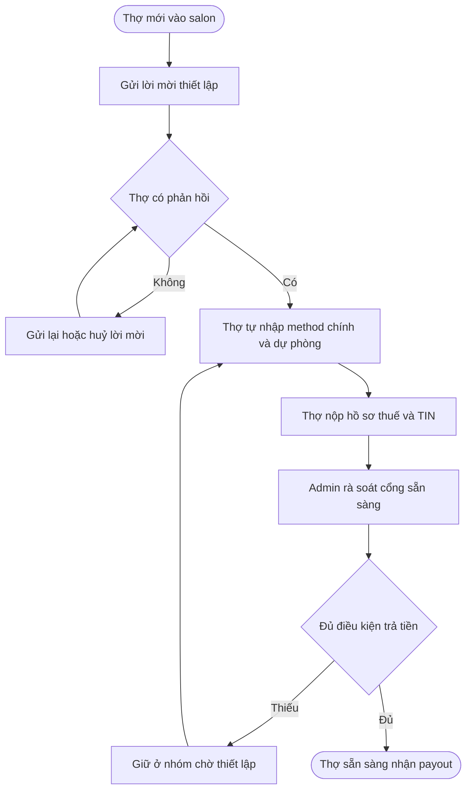
```mermaid
flowchart TD
  A([Thợ mới vào salon]) --> B[Gửi lời mời thiết lập]
  B --> C{Thợ có phản hồi}
  C -->|Không| D[Gửi lại hoặc huỷ lời mời]
  D --> C
  C -->|Có| E[Thợ tự nhập method chính và dự phòng]
  E --> F[Thợ nộp hồ sơ thuế và TIN]
  F --> G[Admin rà soát cổng sẵn sàng]
  G --> H{Đủ điều kiện trả tiền}
  H -->|Thiếu| I[Giữ ở nhóm chờ thiết lập]
  I --> E
  H -->|Đủ| J([Thợ sẵn sàng nhận payout])
```

#### Luồng nghiệp vụ: Rà soát chứng từ và đóng một payout

**Người thực hiện:** Chủ salon, Bookkeeper **Điểm bắt đầu:** Một payout được tạo ở trạng thái `Pending` **Kết quả mong đợi:** Payout chuyển sang `Confirmed` với chứng từ đã khớp và có bản ghi Tax Ledger, hoặc bị `Cancelled`

**User stories:**
- **Là** chủ salon, **tôi muốn** rà soát chứng từ trước khi xác nhận payout, **để** số tiền chi ra khớp với bằng chứng.
- **Là** bookkeeper, **tôi muốn** payout đã confirmed tự sinh bản ghi Tax Ledger, **để** không phải nhập lại vào sổ.
- **Là** bookkeeper, **khi receipt thiếu mục đích kinh doanh**, **tôi muốn** payout bị giữ lại, **để** gói CPA không bị trả về.
- **Là** chủ salon, **khi payout bị tạo nhầm**, **tôi muốn** huỷ nó, **để** không có tiền đi ra và bản ghi vẫn còn dấu vết.

| Bước | Ai | Hành động | Hệ thống phản hồi | Ghi chú |
|---|---|---|---|---|
| 1 | Hệ thống | Payout được tạo từ Quick Pay hoặc Weekly Payroll | Payout vào lịch sử với trạng thái `Pending` và vào hàng chờ chứng từ | Chứng từ bắt buộc với mọi method không phải ACH |
| 2 | Bookkeeper | Mở tab `Proof` và xem hàng chờ | Mỗi mục hiện method, loại chứng từ và trạng thái | Trạng thái có thể là `Matched`, `Review` hoặc `Ready` |
| 3 | Chủ salon | Mở chi tiết payout | Hiện hồ sơ khoản chi, kết quả rà soát và dấu vết audit | Kiểm tra số tiền có khớp chứng từ không |
| 4 | Hệ thống | Kiểm tra ngưỡng duyệt | Khoản trên $500 yêu cầu chủ salon duyệt | 💰 Đây là rào chắn tiền lớn |
| 5 | Chủ salon | Xác nhận payout | Payout chuyển sang `Confirmed` | 💰 Tiền được ghi nhận là đã chi |
| 6 | Hệ thống | Sinh bản ghi Tax Ledger | Mọi payout `Confirmed` tự tạo một bản ghi không thể sửa | Cơ sở cho gói hồ sơ CPA |
| 7 | Chủ salon | Nếu payout sai hoặc trùng | Huỷ payout, trạng thái chuyển `Cancelled` | Bản ghi vẫn lưu để truy vết |
| 8 | Bookkeeper | Export gói payout cho CPA | Nếu còn mục chứng từ thiếu, hệ thống chặn export | Phải xử lý hết hàng chờ chứng từ trước |

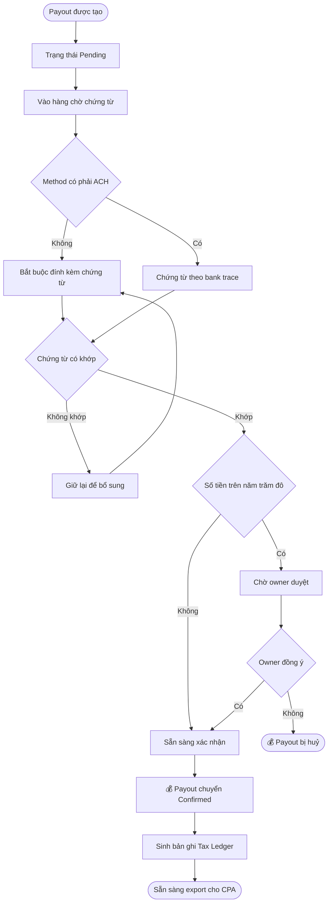
```mermaid
flowchart TD
  A([Payout được tạo]) --> B[Trạng thái Pending]
  B --> C[Vào hàng chờ chứng từ]
  C --> D{Method có phải ACH}
  D -->|Không| E[Bắt buộc đính kèm chứng từ]
  D -->|Có| F[Chứng từ theo bank trace]
  E --> G{Chứng từ có khớp}
  F --> G
  G -->|Không khớp| H[Giữ lại để bổ sung]
  H --> E
  G -->|Khớp| I{Số tiền trên năm trăm đô}
  I -->|Có| J[Chờ owner duyệt]
  I -->|Không| K[Sẵn sàng xác nhận]
  J --> L{Owner đồng ý}
  L -->|Không| M([💰 Payout bị huỷ])
  L -->|Có| K
  K --> N[💰 Payout chuyển Confirmed]
  N --> O[Sinh bản ghi Tax Ledger]
  O --> P([Sẵn sàng export cho CPA])
```

#### Vòng đời trạng thái

Thực thể có vòng đời là **payout**.

| Trạng thái hiện tại | Điều kiện chuyển | Trạng thái mới | Ghi chú |
|---|---|---|---|
| Pending | Chứng từ đã khớp và nếu trên $500 thì owner đã duyệt | Confirmed | 💰 Tự sinh bản ghi Tax Ledger |
| Pending | Owner từ chối, phát hiện trùng, hoặc khoản chi bị tạo nhầm | Cancelled | Bản ghi vẫn lưu để truy vết |
| Pending | Chứng từ thiếu hoặc không khớp | Pending | Payout nằm lại trong hàng chờ cho tới khi bổ sung |
| Confirmed | — | — | Không sửa ngược; sai sót phải xử lý bằng khoản điều chỉnh mới |
| Cancelled | — | — | Không có tiền đi ra; muốn trả lại phải tạo payout mới |

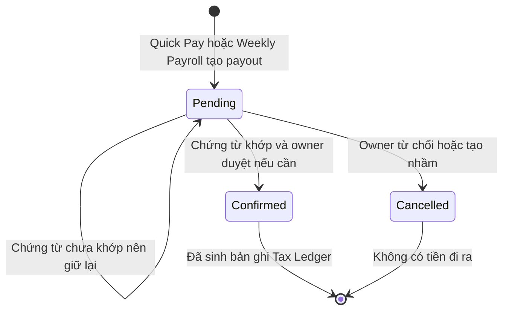
```mermaid
stateDiagram-v2
  [*] --> Pending: Quick Pay hoặc Weekly Payroll tạo payout
  Pending --> Pending: Chứng từ chưa khớp nên giữ lại
  Pending --> Confirmed: Chứng từ khớp và owner duyệt nếu cần
  Pending --> Cancelled: Owner từ chối hoặc tạo nhầm
  Confirmed --> [*]: Đã sinh bản ghi Tax Ledger
  Cancelled --> [*]: Không có tiền đi ra
```

#### Quy tắc nghiệp vụ
- **Phân vai ba màn hình:** Pay Engine quyết định trả bao nhiêu; Payout Hub quyết định tiền đi đâu; Quick Pay hoặc Weekly Payroll tạo giao dịch thật. Không màn hình nào làm thay việc của màn hình khác.
- **Bắt buộc chứng từ cho mọi payout không phải ACH:** Zelle, Venmo, Cash App, check và cash đều phải có ảnh chụp màn hình, bank memo, số check, cash receipt hoặc owner note.
- **Owner duyệt trên $500:** mọi khoản chi vượt $500 phải qua phê duyệt của chủ salon trước khi tiền đi.
- **Mọi payout confirmed tự sinh bản ghi Tax Ledger:** bản ghi này không thể sửa và là cơ sở cho gói hồ sơ thuế.
- **Thiếu chứng từ thì chặn export CPA:** gói payout không được export chừng nào hàng chờ chứng từ còn mục bắt buộc chưa xử lý.
- **Bốn hạng mục thiết lập trước lần trả tiền đầu tiên:** primary payout method (bắt buộc), backup method (khuyến nghị), worker tax profile (bắt buộc), payment proof rule (bắt buộc).
- **Chặn trả tiền khi hồ sơ thuế thiếu:** thợ chưa có W-4/W-9/TIN ở trạng thái sẵn sàng thì không được trả.
- **Ghi đè cảnh báo là đặc quyền của owner:** chỉ owner hoặc admin được ghi đè, và ghi chú lý do được lưu lại. Tuỳ chọn này mặc định tắt.
- **Audit logging luôn bật:** mọi thao tác thiết lập và mọi payout đều được ghi lại.

> 💡 **Quan trọng:** `PENDING PAYMENT` $2,945 cho 2 thợ là nghĩa vụ chi trả đang treo. Đây là tiền thật salon còn nợ thợ, không phải con số tham khảo.

> 💡 **Quan trọng:** Payout chuyển sang `Confirmed` là điểm không quay lui về mặt sổ sách — bản ghi Tax Ledger được sinh ra và không thể sửa. Nếu sai, phải tạo một khoản điều chỉnh riêng chứ không sửa bản ghi cũ.

> 💡 **Quan trọng:** Method dự phòng chỉ là khuyến nghị chứ không bắt buộc, nhưng khi method chính lỗi mà không có dự phòng thì việc trả tiền sẽ bị treo cho tới khi thợ cập nhật hồ sơ.

#### Tình huống ngoại lệ

| Tình huống | Hệ thống xử lý | Ai giải quyết |
|---|---|---|
| Thợ mới chưa thiết lập payment method | Thợ nằm ở nhóm `Pending Setup` và không thể nhận payout | Payroll Admin gửi lại link thiết lập |
| Thợ không phản hồi lời mời | Thông báo chờ vẫn hiện, có thể gửi lại hoặc huỷ lời mời | Payroll Admin |
| Receipt thiếu mục đích kinh doanh | Mục chứng từ ở trạng thái `Review`, payout bị giữ lại và gói CPA không export được | Bookkeeper bổ sung trong kho chứng từ |
| Payout trên $500 chưa được duyệt | Payout ở trạng thái `Pending` cho tới khi owner duyệt | Chủ salon |
| Payout bị tạo nhầm hoặc trùng | Huỷ payout, trạng thái chuyển `Cancelled`, không có tiền đi ra | Chủ salon |
| Method chính bị lỗi khi chuyển tiền | Chuyển sang method dự phòng đã đăng ký của thợ | Payroll Admin |
| Thợ 1099 chưa nộp W-9 | Chỉ số `Tax Ready` không đủ, phải thu W-9 trước lần trả tiền đầu tiên | Payroll Admin |
| TIN của contractor không khớp tên | Mục xác minh TIN ở trạng thái `Review`, phải xử lý trước cuối năm | Payroll Admin cùng CPA |
| Payout có mục đích kinh doanh không rõ | AI bookkeeping đánh dấu để owner rà soát | Chủ salon |

#### Câu hỏi thường gặp

**Hỏi: Payout Hub và Pay Engine khác nhau ra sao?**
Đáp: Pay Engine quyết định trả bao nhiêu — công thức lương, hoa hồng, bonus, chu kỳ. Payout Hub quyết định tiền đi đâu — method nhận tiền, quy tắc chứng từ, ngưỡng duyệt. Còn giao dịch thật thì do Quick Pay hoặc Weekly Payroll tạo ra.

**Hỏi: Vì sao trả bằng Zelle vẫn phải đính kèm chứng từ?**
Đáp: Vì quy tắc là bắt buộc chứng từ cho mọi payout không phải ACH. ACH có bank trace tự động, còn Zelle, Venmo, Cash App, check và cash thì không, nên cần ảnh chụp màn hình, memo hoặc receipt để có bằng chứng khi CPA rà soát hoặc khi có tranh chấp.

**Hỏi: Tại sao không export được gói payout cho CPA?**
Đáp: Vì hàng chờ chứng từ còn mục bắt buộc chưa xử lý. Mở tab `Proof`, xử lý các mục ở trạng thái `Review` rồi export lại.

**Hỏi: Đã xác nhận payout rồi mà phát hiện sai số tiền thì sửa thế nào?**
Đáp: Không sửa bản ghi đã `Confirmed` vì bản ghi Tax Ledger đã được sinh và không thể sửa. Phải tạo một khoản điều chỉnh riêng qua Quick Pay với memo nêu rõ lý do.

---

### 8. Reviews

**Nhóm chức năng:** Merchant Ops
**Người dùng chính:** Chủ salon, Quản lý ca, Marketing
**Việc cần làm đầu tiên:** Xem chỉ số `Needs Reply` để biết có review nào dưới 4 sao cần trả lời gấp trước khi xử lý các review còn lại.

#### Mục đích
> Reviews gom toàn bộ đánh giá của khách từ Google, Yelp và Facebook vào một danh sách duy nhất, để chủ salon không phải mở ba ứng dụng khác nhau. Màn hình cho biết review nào chưa được trả lời, review nào có điểm thấp cần xử lý gấp, và cho phép đánh dấu đã trả lời ngay tại chỗ. Giá trị cốt lõi là không để review xấu nằm im không ai đụng tới.

#### Chỉ số theo dõi

| Chỉ số | Ý nghĩa nghiệp vụ | Cách đọc |
|---|---|---|
| `Average Rating` — 4.9 | Điểm trung bình trên tất cả kênh đã kết nối | Là chỉ số uy tín tổng thể của salon |
| `Total Reviews` — 847 (+18 tuần này) | Tổng số review tích luỹ và số review mới trong tuần | Tăng đều nghĩa là khách vẫn đang đánh giá |
| `New Reviews` — 3 | Số review chưa được trả lời | Là hàng tồn công việc cần xử lý |
| `Needs Reply` — 1 | Số review chưa trả lời và dưới 4 sao | Đây là nhóm cần trả lời gấp nhất |

#### Nội dung màn hình

**Bộ lọc kênh**

Bốn nút lọc, mỗi nút kèm số review của kênh đó; chọn một kênh sẽ chỉ hiện review của kênh đó.

| Bộ lọc | Số review |
|---|---|
| `All` | 5 |
| `Google` | 3 |
| `Yelp` | 1 |
| `Facebook` | 1 |

Dưới bộ lọc có dòng tóm tắt cho biết đang hiển thị bao nhiêu review trên kênh nào. Nếu kênh được chọn không có review nào, danh sách hiện thông báo không có review khớp bộ lọc.

**Danh sách `Recent Reviews`**

Mỗi dòng là một review của một khách.

| Phần | Nội dung |
|---|---|
| Ảnh đại diện | Biểu tượng khách |
| Tên khách | Tên hiển thị, có thể là `Anonymous` |
| Kênh và thời điểm | Nguồn review và khoảng thời gian kể từ khi đăng |
| Nội dung | Nguyên văn nhận xét của khách |
| Số sao | Điểm đánh giá dạng sao |
| Nút trạng thái | `Reply` nếu chưa trả lời, `Replied` nếu đã trả lời |

| Khách | Kênh | Thời điểm | Sao | Nội dung tóm tắt | Trạng thái |
|---|---|---|---|---|---|
| Jennifer Tran | Google | 2 giờ trước | 5 | Khen Amy làm bộ móng đẹp và tỉ mỉ, salon sạch, nhân viên thân thiện | `Reply` |
| Emma Wilson | Google | 5 giờ trước | 5 | Khen kỹ thuật balayage của Linda, màu đẹp và bền | `Replied` |
| Anonymous | Yelp | 1 ngày trước | 3 | Phàn nàn chờ hơi lâu nhưng kết quả tốt | `Reply` |
| Maria Garcia | Facebook | 2 ngày trước | 5 | Lần đầu tới và rất hài lòng, sẽ quay lại | `Replied` |
| Lisa Nguyen | Google | 3 ngày trước | 4 | Khen salon đẹp và nhân viên nhiệt tình, chờ hơi lâu | `Reply` |

#### Luồng nghiệp vụ: Xử lý hàng chờ review

**Người thực hiện:** Chủ salon hoặc quản lý ca **Điểm bắt đầu:** Chỉ số `New Reviews` lớn hơn 0 **Kết quả mong đợi:** Mọi review chưa trả lời được xử lý, ưu tiên các review dưới 4 sao

**User stories:**
- **Là** chủ salon, **tôi muốn** thấy tất cả review từ Google, Yelp và Facebook trong một danh sách, **để** không bỏ sót review ở kênh ít dùng.
- **Là** chủ salon, **tôi muốn** biết ngay review nào dưới 4 sao chưa trả lời, **để** xử lý trước khi khách khác đọc được.
- **Là** quản lý ca, **tôi muốn** lọc theo kênh, **để** xử lý gọn từng nền tảng một.
- **Là** chủ salon, **khi một kênh không có review nào**, **tôi muốn** danh sách nói rõ là trống, **để** không tưởng là hệ thống lỗi.
- **Là** chủ salon, **tôi muốn** mỗi lần trả lời đều được ghi lại, **để** có bằng chứng là salon đã phản hồi khách.

| Bước | Ai | Hành động | Hệ thống phản hồi | Ghi chú |
|---|---|---|---|---|
| 1 | Chủ salon | Mở màn hình Reviews | Hiện điểm trung bình, tổng review, số chưa trả lời và số cần trả lời gấp | Mặc định hiển thị tất cả kênh |
| 2 | Chủ salon | Xem chỉ số `Needs Reply` | Cho biết có bao nhiêu review dưới 4 sao chưa được trả lời | Đây là nhóm ưu tiên cao nhất |
| 3 | Chủ salon | Bấm một bộ lọc kênh | Danh sách chỉ còn review của kênh đó, dòng tóm tắt cập nhật số lượng | Nếu kênh trống, hiện thông báo không có review |
| 4 | Chủ salon | Đọc nội dung review | Hiện nguyên văn nhận xét, số sao, kênh và thời điểm | Review 3 sao được ưu tiên xử lý |
| 5 | Chủ salon | Soạn phản hồi và bấm `Reply` | Nút chuyển thành `Replied`, review được đánh dấu đã trả lời | Nội dung phản hồi được đăng lên kênh gốc |
| 6 | Hệ thống | Cập nhật lại chỉ số và bộ lọc | `New Reviews` và `Needs Reply` giảm tương ứng, danh sách được lọc lại theo kênh đang chọn | Việc trả lời được ghi vào Audit Log |
| 7 | Chủ salon | Lặp lại cho tới khi hàng chờ trống | `New Reviews` về 0 | Hoàn tất một vòng xử lý |

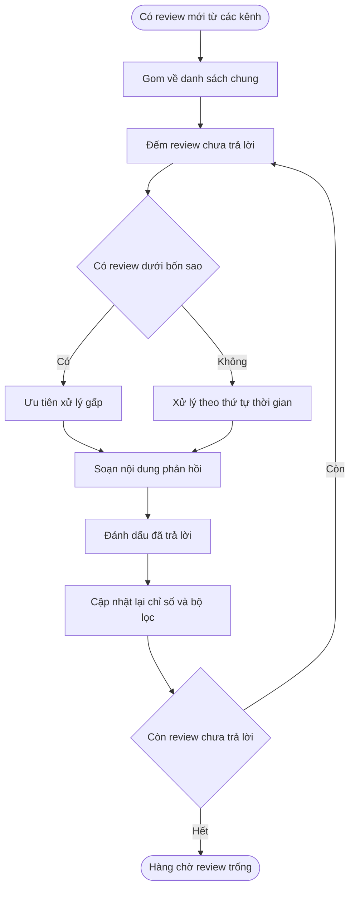
```mermaid
flowchart TD
  A([Có review mới từ các kênh]) --> B[Gom về danh sách chung]
  B --> C[Đếm review chưa trả lời]
  C --> D{Có review dưới bốn sao}
  D -->|Có| E[Ưu tiên xử lý gấp]
  D -->|Không| F[Xử lý theo thứ tự thời gian]
  E --> G[Soạn nội dung phản hồi]
  F --> G
  G --> H[Đánh dấu đã trả lời]
  H --> I[Cập nhật lại chỉ số và bộ lọc]
  I --> J{Còn review chưa trả lời}
  J -->|Còn| C
  J -->|Hết| K([Hàng chờ review trống])
```

#### Vòng đời trạng thái

Thực thể có vòng đời là **một review**.

| Trạng thái hiện tại | Điều kiện chuyển | Trạng thái mới | Ghi chú |
|---|---|---|---|
| Reply | Chủ salon soạn phản hồi và đánh dấu đã trả lời | Replied | Chỉ số `New Reviews` giảm; nếu review dưới 4 sao thì `Needs Reply` cũng giảm |
| Replied | — | — | Review đã xử lý, không quay lại hàng chờ |

```mermaid
stateDiagram-v2
  [*] --> Reply: Khách đăng review mới
  Reply --> Replied: Salon phản hồi
  Replied --> [*]: Đã xử lý và ghi audit
```

#### Quy tắc nghiệp vụ
- **Gom review từ ba kênh:** Google, Yelp và Facebook đổ chung về một danh sách, có thể lọc theo từng kênh hoặc xem tất cả.
- **Ngưỡng cần trả lời gấp là dưới 4 sao:** review từ 3 sao trở xuống mà chưa trả lời được đếm vào `Needs Reply`. Review 4 sao và 5 sao chưa trả lời chỉ được đếm vào `New Reviews`.
- **Chỉ đếm review chưa trả lời:** một review đã ở trạng thái `Replied` không còn được tính vào bất kỳ chỉ số hàng chờ nào, kể cả khi điểm thấp.
- **Một review chỉ trả lời một lần:** sau khi đánh dấu đã trả lời, review không quay lại hàng chờ.
- **Bộ lọc chỉ ảnh hưởng hiển thị:** lọc theo kênh không làm thay đổi các chỉ số tổng ở đầu màn hình.
- **Trả lời review được ghi nhận:** mỗi lần đánh dấu đã trả lời đều được ghi vào Audit Log.

#### Tình huống ngoại lệ

| Tình huống | Hệ thống xử lý | Ai giải quyết |
|---|---|---|
| Kênh được lọc không có review nào | Danh sách hiện thông báo không có review khớp bộ lọc | Không cần xử lý |
| Review ẩn danh | Vẫn hiện trong danh sách với tên `Anonymous`, xử lý như review thường | Chủ salon |
| Review điểm thấp về thời gian chờ | Được đếm vào `Needs Reply`, cần ưu tiên trả lời | Chủ salon và quản lý ca |
| Review nhắc đích danh một thợ | Chuyển thông tin cho quản lý ca để xử lý nội bộ, đồng thời vẫn phản hồi công khai | Quản lý ca |
| Đã trả lời nhưng bấm lại nút trạng thái | Không có thay đổi, review giữ nguyên trạng thái đã trả lời | Không cần xử lý |

#### Câu hỏi thường gặp

**Hỏi: `New Reviews` và `Needs Reply` khác nhau ở đâu?**
Đáp: `New Reviews` đếm tất cả review chưa được trả lời, bất kể mấy sao. `Needs Reply` chỉ đếm phần chưa trả lời có điểm dưới 4 sao — đây là nhóm ảnh hưởng uy tín nhiều nhất nên cần xử lý trước.

**Hỏi: Review 4 sao có bị tính là cần trả lời gấp không?**
Đáp: Không. Ngưỡng là dưới 4 sao, nên review 4 sao chỉ nằm trong `New Reviews` cho tới khi được trả lời.

**Hỏi: Lọc theo Yelp thì các chỉ số ở đầu màn hình có đổi không?**
Đáp: Không. Bộ lọc chỉ thay đổi danh sách hiển thị bên dưới. Điểm trung bình, tổng review, số chưa trả lời và số cần trả lời gấp vẫn tính trên tất cả kênh.

**Hỏi: Nhân viên có tự trả lời review được không?**
Đáp: Việc trả lời review luôn cần người thao tác và được ghi vào Audit Log, nên nên giới hạn cho chủ salon hoặc quản lý ca — vì nội dung phản hồi công khai ảnh hưởng trực tiếp tới uy tín salon.

---

### 9. AI Assistant

**Nhóm chức năng:** Merchant Ops
**Người dùng chính:** Chủ salon, Quản lý ca
**Việc cần làm đầu tiên:** Gõ một câu hỏi về salon vào ô chat — ví dụ về thu nhập của thợ, lịch hẹn hay dịch vụ bán chạy — rồi bấm gửi.

#### Mục đích
> AI Assistant là trợ lý hỏi đáp và trung tâm bật tắt các tính năng tự động hoá của salon. Chủ salon có thể hỏi bằng ngôn ngữ thường về doanh thu, lịch hẹn, hiệu suất thợ và bookkeeping, và nhận câu trả lời dựa trên dữ liệu đang có trong workspace. Bên cạnh đó là sáu công tắc tự động hoá cho phép chủ salon quyết định việc nào để AI làm thay và việc nào giữ lại cho người.

#### Chỉ số theo dõi

| Chỉ số | Ý nghĩa nghiệp vụ | Cách đọc |
|---|---|---|
| `AI CALLS HANDLED` — 8 | Số cuộc gọi AI đã xử lý trong ngày | Càng cao càng bớt việc trực điện thoại cho quầy |
| `AI-BOOKED APPOINTMENTS` — 4 | Số lịch hẹn AI đặt được mà không cần nhân viên | Là kết quả trực tiếp của AI Receptionist |
| `AI BOOKKEEPING` — Updated | Trạng thái sổ sách theo thời gian thực | `Updated` nghĩa là P&L đang khớp với dữ liệu mới nhất |
| `TIME SAVED` — 3.2 giờ mỗi ngày | Thời gian tiết kiệm so với làm thủ công | Là ước lượng lợi ích, không phải số liệu kế toán |

#### Nội dung màn hình

**Khung chat `AI Assistant`**

Một luồng hội thoại hai chiều, mỗi dòng là một lượt nói của AI hoặc của người dùng. Cuối khung là ô nhập câu hỏi và nút gửi. AI mở đầu bằng lời giới thiệu về những gì nó làm được: phân tích doanh thu, sắp lịch cho thợ, và trả lời câu hỏi về salon.

Các nhóm câu hỏi AI trả lời được:

| Nhóm câu hỏi | AI trả lời gì | Ví dụ nội dung |
|---|---|---|
| Thu nhập của một thợ | Tổng take-home trong tuần và gợi ý mở Quick Pay để tạo payout cho thợ đó | Amy T. tuần 23-28/6: sales $2,195, pay $1,486.85 gồm $480 hourly, $768 commission và $238 KPI bonus; tổng take-home $1,804.85 gồm $318 tip; đạt 127% mục tiêu KPI |
| Lịch hẹn và sắp xếp | Số lịch AI đã đặt trong ngày và khung giờ còn trống phù hợp với dịch vụ nào | Hôm nay AI đặt 4 lịch; khung 14:00-16:00 còn 2 chỗ, hợp với Gel Polish hoặc Manicure |
| Doanh thu và dịch vụ | Dịch vụ bán chạy nhất trong tháng kèm số lượt và doanh thu | Top 3 tháng 6: Gel Full Set 148 lượt và $9,620; Acrylic 114 lượt và $6,840; Dip Powder 96 lượt và $5,280 |
| Thuế và bookkeeping | Nhắc chuẩn bị chứng từ tip, payout, receipt và mileage trước khi CPA rà soát, kèm khuyến cáo | Mọi ước tính đều kèm câu lưu ý đây không phải tư vấn thuế |
| Câu hỏi ngoài phạm vi | Xác nhận đã nhận câu hỏi và nêu rõ chỉ trả lời được trong phạm vi dữ liệu salon hiện có | Không bịa số liệu ngoài dữ liệu workspace |

**Khối `AI at Work` — sáu công tắc tự động hoá**

Mỗi dòng là một tính năng tự động hoá có công tắc bật tắt riêng.

| Tính năng | Làm gì | Mặc định |
|---|---|---|
| `AI Receptionist` | Trực và xử lý cuộc gọi 24/7 | Bật |
| `Smart Scheduling` | Tự tối ưu lịch hẹn và lịch thợ | Bật |
| `AI Bookkeeping` | Cập nhật P&L theo thời gian thực | Bật |
| `Auto Review Reply` | Tự trả lời review của khách | **Tắt** |
| `Smart Campaigns` | Gợi ý chiến dịch SMS cho khách | Bật |
| `Revenue Forecast` | Dự báo doanh thu tuần tới | Bật |

#### Luồng nghiệp vụ: Hỏi AI về tình hình salon

**Người thực hiện:** Chủ salon **Điểm bắt đầu:** Cần một con số hoặc một câu trả lời nhanh về salon **Kết quả mong đợi:** Nhận câu trả lời dựa trên dữ liệu workspace, kèm khuyến cáo nếu liên quan tới thuế

**User stories:**
- **Là** chủ salon, **tôi muốn** hỏi bằng câu nói thường về thu nhập của một thợ, **để** không phải tự cộng từ nhiều bảng.
- **Là** quản lý ca, **tôi muốn** hỏi khung giờ nào còn trống, **để** nhận thêm khách mà không xếp chồng lịch.
- **Là** chủ salon, **tôi muốn** biết dịch vụ nào bán chạy nhất tháng, **để** quyết định đẩy chương trình cho dịch vụ đó.
- **Là** chủ salon, **khi tôi hỏi về thuế**, **tôi muốn** AI nói rõ đây không phải tư vấn thuế, **để** tôi biết vẫn phải hỏi CPA.
- **Là** chủ salon, **khi tôi gửi câu hỏi trống**, **tôi muốn** hệ thống nhắc nhập nội dung, **để** không tạo lượt hỏi vô nghĩa.

| Bước | Ai | Hành động | Hệ thống phản hồi | Ghi chú |
|---|---|---|---|---|
| 1 | Chủ salon | Gõ câu hỏi vào ô chat | Câu hỏi hiện trong luồng hội thoại ở phía người dùng | Ô nhập được xoá sau khi gửi |
| 2 | Chủ salon | Bấm gửi khi ô chat còn trống | Hệ thống nhắc nhập câu hỏi trước khi gửi | Không tạo lượt hỏi |
| 3 | Hệ thống | Nhận diện chủ đề câu hỏi | Đối chiếu với dữ liệu salon đang có trong workspace | Bốn nhóm chủ đề chính là thu nhập thợ, lịch hẹn, doanh thu dịch vụ, và thuế |
| 4 | AI | Trả lời trong luồng chat | Hiện câu trả lời kèm số liệu cụ thể và gợi ý hành động tiếp theo nếu có | Ví dụ gợi ý mở Quick Pay để tạo payout cho thợ |
| 5 | Hệ thống | Nếu câu hỏi liên quan tới thuế | Kèm khuyến cáo đây không phải tư vấn thuế và nhắc chuẩn bị chứng từ trước khi CPA rà soát | Bắt buộc với mọi câu trả lời về thuế |
| 6 | Hệ thống | Nếu câu hỏi nằm ngoài dữ liệu có sẵn | Xác nhận đã nhận câu hỏi và nêu rõ chỉ trả lời trong phạm vi dữ liệu salon hiện có | Không suy đoán số liệu |
| 7 | Chủ salon | Làm theo gợi ý nếu phù hợp | Chuyển sang màn hình tương ứng để thực hiện hành động | AI đề xuất chứ không tự thực hiện thay |

```mermaid
flowchart TD
  A([Chủ salon gõ câu hỏi]) --> B{Ô nhập có nội dung}
  B -->|Trống| C[Nhắc nhập câu hỏi]
  C --> A
  B -->|Có| D[Đưa câu hỏi vào luồng chat]
  D --> E[Nhận diện chủ đề]
  E --> F{Chủ đề nào}
  F -->|Thu nhập thợ| G[Trả về take home và gợi ý mở Quick Pay]
  F -->|Lịch hẹn| H[Trả về số lịch và khung giờ trống]
  F -->|Doanh thu dịch vụ| I[Trả về dịch vụ bán chạy nhất]
  F -->|Thuế| J[Trả lời kèm khuyến cáo không phải tư vấn thuế]
  F -->|Ngoài phạm vi| K[Nêu rõ giới hạn dữ liệu hiện có]
  G --> L([Chủ salon quyết định hành động])
  H --> L
  I --> L
  J --> L
  K --> L
```

#### Luồng nghiệp vụ: Bật tắt tự động hoá

**Người thực hiện:** Chủ salon **Điểm bắt đầu:** Muốn giao thêm việc cho AI hoặc lấy lại quyền kiểm soát một việc **Kết quả mong đợi:** Công tắc được đặt đúng mức tự động hoá mà chủ salon chấp nhận

**User stories:**
- **Là** chủ salon, **tôi muốn** bật AI Receptionist, **để** không bỏ lỡ cuộc gọi ngoài giờ.
- **Là** chủ salon, **tôi muốn** giữ Auto Review Reply ở trạng thái tắt, **để** mọi phản hồi công khai đều do người duyệt.
- **Là** chủ salon, **tôi muốn** tắt một công tắc bất cứ lúc nào, **để** lấy lại quyền kiểm soát khi thấy kết quả chưa như ý.

| Bước | Ai | Hành động | Hệ thống phản hồi | Ghi chú |
|---|---|---|---|---|
| 1 | Chủ salon | Mở khối `AI at Work` | Hiện sáu tính năng với trạng thái bật tắt hiện tại | Năm tính năng bật sẵn, `Auto Review Reply` tắt |
| 2 | Chủ salon | Gạt công tắc của một tính năng | Tính năng chuyển sang trạng thái mới ngay | Áp dụng cho toàn salon |
| 3 | Hệ thống | Với `Auto Review Reply` | Giữ mặc định tắt vì phản hồi review công khai cần người duyệt | Bật là quyết định có cân nhắc của chủ salon |
| 4 | Chủ salon | Theo dõi kết quả qua chỉ số đầu màn hình | Số cuộc gọi AI xử lý, số lịch AI đặt và thời gian tiết kiệm phản ánh hiệu quả | Là cơ sở để giữ hay tắt |
| 5 | Chủ salon | Tắt lại nếu không phù hợp | Tính năng ngừng chạy tự động, việc quay lại cho người | Có thể bật lại bất cứ lúc nào |

```mermaid
flowchart TD
  A([Mở khối tự động hoá]) --> B[Xem trạng thái sáu công tắc]
  B --> C{Muốn bật hay tắt}
  C -->|Bật| D{Có phải Auto Review Reply}
  D -->|Đúng| E[Cân nhắc vì phản hồi review cần người duyệt]
  D -->|Không| F[Bật tính năng cho toàn salon]
  E --> G{Chủ salon vẫn muốn bật}
  G -->|Không| H([Giữ nguyên trạng thái tắt])
  G -->|Có| F
  C -->|Tắt| I[Ngừng tự động và trả việc cho người]
  F --> J[Theo dõi chỉ số hiệu quả]
  I --> J
  J --> K([Điều chỉnh khi cần])
```

#### Quy tắc nghiệp vụ
- **Chỉ trả lời trong phạm vi dữ liệu salon:** AI trả lời dựa trên hồ sơ đang có trong workspace. Câu hỏi ngoài phạm vi được xác nhận đã nhận nhưng AI nêu rõ giới hạn thay vì suy đoán.
- **Mọi câu trả lời liên quan tới thuế đều kèm khuyến cáo:** AI luôn nói rõ các ước tính không phải tư vấn thuế và nhắc chuẩn bị chứng từ tip, payout, receipt và mileage trước khi CPA rà soát.
- **`Auto Review Reply` mặc định tắt:** phản hồi review là nội dung công khai ảnh hưởng trực tiếp tới uy tín salon nên cần người duyệt. Năm tính năng còn lại bật mặc định.
- **AI gợi ý chứ không tự chi tiền:** khi câu hỏi liên quan tới trả tiền cho thợ, AI đề xuất mở Quick Pay chứ không tự tạo payout.
- **Câu hỏi trống không được gửi:** hệ thống yêu cầu nhập nội dung trước khi gửi.
- **Công tắc áp dụng cho toàn salon:** bật hoặc tắt một tính năng ảnh hưởng tới toàn bộ hoạt động, không theo từng thợ.
- **Chỉ số hiệu quả là ước lượng:** thời gian tiết kiệm 3.2 giờ mỗi ngày là con số so sánh với làm thủ công, không dùng làm số liệu kế toán.

> 💡 **Quan trọng:** AI không bao giờ tự tạo hoặc tự phê duyệt một khoản chi. Mọi việc liên quan tới tiền đều phải do người thực hiện qua Quick Pay hoặc Weekly Payroll, đi qua đầy đủ các rào chắn chứng từ và ngưỡng duyệt.

> 💡 **Quan trọng:** Số liệu AI đưa ra về thuế chỉ mang tính tham khảo và luôn kèm khuyến cáo không phải tư vấn thuế. Quyết định về thuế phải dựa trên rà soát của CPA.

#### Tình huống ngoại lệ

| Tình huống | Hệ thống xử lý | Ai giải quyết |
|---|---|---|
| Bấm gửi khi ô chat trống | Hệ thống nhắc nhập câu hỏi trước khi gửi | Người dùng |
| Hỏi về dữ liệu salon chưa có trong workspace | AI xác nhận đã nhận câu hỏi và nêu rõ chỉ trả lời được trong phạm vi dữ liệu hiện có | Chủ salon bổ sung dữ liệu ở màn hình tương ứng |
| Hỏi câu liên quan tới thuế | AI trả lời kèm khuyến cáo không phải tư vấn thuế và nhắc chuẩn bị chứng từ | Chủ salon xác nhận lại với CPA |
| Hỏi về việc trả tiền cho một thợ | AI đưa số take-home và gợi ý mở Quick Pay, không tự tạo payout | Chủ salon thực hiện ở Quick Pay |
| Bật `Auto Review Reply` | Tính năng chạy nhưng đây là quyết định có cân nhắc vì mất bước người duyệt nội dung công khai | Chủ salon |
| Kết quả tự động hoá không như ý | Tắt công tắc tương ứng, việc quay lại cho người | Chủ salon |

#### Câu hỏi thường gặp

**Hỏi: Vì sao `Auto Review Reply` bị tắt sẵn trong khi năm tính năng kia bật?**
Đáp: Vì trả lời review là nội dung công khai ảnh hưởng trực tiếp tới uy tín salon, nên mặc định cần người duyệt. Chủ salon vẫn bật được nếu chấp nhận rủi ro đó.

**Hỏi: AI có tự trả tiền cho thợ được không?**
Đáp: Không. AI chỉ đưa ra số liệu và gợi ý mở Quick Pay. Mọi khoản chi phải do người tạo và đi qua đầy đủ kiểm tra chứng từ cùng ngưỡng duyệt.

**Hỏi: Câu trả lời của AI về thuế có dùng để nộp hồ sơ được không?**
Đáp: Không. Mọi câu trả lời liên quan tới thuế đều kèm khuyến cáo đây không phải tư vấn thuế. Chúng dùng để chuẩn bị chứng từ và đặt câu hỏi đúng chỗ cho CPA.

**Hỏi: AI lấy số liệu từ đâu?**
Đáp: Từ dữ liệu salon đang có trong workspace. Nếu chưa có dữ liệu, AI nói rõ giới hạn thay vì đưa ra con số suy đoán.

## PAYROLL

### 10. Employers

**Nhóm chức năng:** Payroll
**Người dùng chính:** Payroll Admin
**Việc cần làm đầu tiên:** Kiểm tra EIN và các registration payroll tax theo từng bang trước khi thiết lập nhân sự hoặc chạy payroll.

#### Mục đích

> `Employers` là sổ đăng ký pháp nhân của hệ thống. Mỗi dòng là một doanh nghiệp có nghĩa vụ trả lương và nộp thuế: tên pháp lý, EIN, ngành nghề, số nhân sự, các jurisdiction đã đăng ký, deposit schedule và ngày nộp thuế kế tiếp. Đây là nền móng — mọi payroll run, mọi khoản thuế, mọi báo cáo đều gắn vào một employer. Nếu hồ sơ employer chưa đủ (thiếu registration ở bang mà thợ đang làm việc, thiếu tài khoản deposit), hệ thống sẽ chặn hoặc cảnh báo ở bước finalize payroll.

#### Chỉ số theo dõi

| Chỉ số | Ý nghĩa nghiệp vụ | Cách đọc |
|---|---|---|
| `Employees` | Số nhân sự đang gắn với employer này | Con số này quyết định quy mô mỗi payroll run. Chênh lệch bất thường so với kỳ trước là dấu hiệu import sai |
| `Registrations` | Danh sách jurisdiction đã đăng ký, ví dụ `FED, TX, CA` | Nếu thợ làm việc ở bang không có trong danh sách, hồ sơ chưa đủ để finalize ở strict mode |
| `Deposit Schedule` | Nhịp nộp thuế đã khai với cơ quan thuế: `Semiweekly` / `Monthly` / `Quarterly` | Semiweekly là nhịp gấp nhất, sai hạn là bị phạt. Quarterly thường áp cho thuế bang nhẹ |
| `Next Deposit` | Ngày đến hạn nộp gần nhất | Đây là ngày phải giữ đủ tiền mặt. Đọc cùng với `Deposit Due` của payroll run đang mở |
| `Health` | Điểm sức khỏe hồ sơ employer tính theo phần trăm | 99–100% là hồ sơ sạch. Dưới 80% nghĩa là có registration đang review, thiếu setup, hoặc connection lỗi |
| `Status` | Trạng thái vận hành: `Active` / `Degraded` | `Degraded` nghĩa là employer vẫn chạy được nhưng có thành phần hỏng cần xử lý trước kỳ lương tới |

#### Nội dung màn hình

**Bảng `Employers`** — mỗi dòng là một pháp nhân trả lương.

| Cột | Nội dung | Ghi chú nghiệp vụ |
|---|---|---|
| `Employer` | Tên pháp lý đầy đủ của doanh nghiệp | Phải trùng tên đã đăng ký EIN, không dùng tên thương hiệu |
| `ID` | Mã employer nội bộ, ví dụ `biz_789` | Mã này xuất hiện trong mọi connection, run, và bản ghi ledger |
| `Industry` | Ngành nghề | Ảnh hưởng tới cách phân loại chi phí và gợi ý của CPA |
| `Employees` | Số nhân sự | |
| `Registrations` | Các jurisdiction đã đăng ký | Dạng rút gọn, chi tiết xem ở `Registrations` |
| `Deposit Schedule` | Nhịp nộp thuế liên bang chính | |
| `Next Deposit` | Ngày đến hạn gần nhất | |
| `Health` | Điểm sức khỏe | |
| `Status` | `Active` / `Degraded` | |
| `Actions` | `View` · `Edit` · `Registrations` | Ba lối vào ba tác vụ khác nhau |

Ví dụ ba pháp nhân minh hoạ ba tình huống khác nhau:

| Employer | ID | Registrations | Deposit Schedule | Next Deposit | Health | Status |
|---|---|---|---|---|---|---|
| Acme Manufacturing LLC | `biz_789` | FED, TX, CA | Semiweekly | Jun 24, 2026 | 99.8% | Active |
| TechCorp Solutions Inc. | `biz_1024` | FED, NY | Monthly | Jul 15, 2026 | 100% | Active |
| Retail Partners Group | `biz_2201` | FED, TX | Monthly | Jul 15, 2026 | 74% | Degraded |

**Nút `Add Employer`** mở form tạo pháp nhân mới với ba khối:

| Khối | Trường | Ý nghĩa |
|---|---|---|
| Business Profile | `Legal business name`, `EIN`, `Industry`, `Primary state` | Bốn trường tối thiểu để tạo hồ sơ |
| Payroll Tax Setup | Bảng jurisdiction — registration và deposit schedule cho từng nơi | Mở sẵn Federal / Texas / California để khai nhanh |
| Controls | `Enable strict finalization`, `Create audit workspace` | Hai công tắc quyết định mức độ chặt của toàn bộ quy trình sau này |

**Nút `View`** (Employer Detail) — màn hình chỉ đọc, gồm bốn khối:

| Khối | Liệt kê gì |
|---|---|
| Business Profile | Tên pháp lý, employer ID, EIN dạng mask, ngành, địa chỉ chính, người liên hệ |
| Registration Footprint | Từng jurisdiction với registration, deposit schedule, ngày đến hạn, và bộ phận chịu trách nhiệm |
| Recent Payroll Runs | Bốn kỳ lương gần nhất: mã run, kỳ, gross, tax, trạng thái |
| Recent Activity | Nhật ký sự kiện gần đây: run đã finalize, yêu cầu review registration, tình trạng connection |

**Nút `Edit`** (Edit Employer) — cho sửa ba nhóm:

| Nhóm | Nội dung |
|---|---|
| Business Profile | Tên, EIN, ngành, bang chính, email liên hệ, `Status` (`Active` / `Inactive` / `Suspended`) |
| Deposit Settings | `Federal schedule` (Semiweekly / Monthly / Quarterly), tài khoản deposit liên bang dạng mask, lịch bang, ngày đến hạn kế tiếp |
| Strict Mode | `Require TIN verification` — chặn finalize nếu TIN chưa verify; `Require W-4 current year` — cảnh báo nếu W-4 là năm cũ |

**Nút `Registrations`** (Employer Registrations) — quản lý đăng ký thuế theo jurisdiction:

| Cột | Nội dung |
|---|---|
| `Jurisdiction` | Mã vùng thuế, ví dụ `US-FED`, `US-TX`, `US-CA`, `US-NY` |
| `Account Number` | Số tài khoản thuế, luôn hiển thị dạng mask |
| `Registration` | `Active` / `Review` / `Missing setup` |
| `Deposit Schedule` | Nhịp nộp cho riêng jurisdiction đó |
| `Next Due` | Ngày đến hạn |
| `Action` | `Edit` với jurisdiction đã có, `Add` với jurisdiction chưa khai |

Bên dưới là khối `Add Registration` để khai jurisdiction mới: chọn bang, nhập số tài khoản thuế bang, chọn deposit schedule, nhập ngày đăng ký.

#### Luồng nghiệp vụ: Thêm employer mới và khai registration

**Người thực hiện:** Payroll Admin
**Điểm bắt đầu:** Nhấn `Add Employer` trên bảng `Employers`
**Kết quả mong đợi:** Pháp nhân được tạo với EIN, deposit schedule mặc định, và ít nhất registration liên bang ở trạng thái hợp lệ

**User stories:**

- **Là** Payroll Admin, **tôi muốn** tạo hồ sơ employer với tên pháp lý và EIN, **để** mọi payroll run và bản ghi thuế sau này đều có chủ thể chịu trách nhiệm rõ ràng.
- **Là** Payroll Admin, **tôi muốn** khai registration cho từng bang mà nhân sự đang làm việc, **để** kỳ lương không bị chặn ở bước finalize.
- **Là** Payroll Admin, **tôi muốn** bật strict finalization ngay khi tạo employer, **để** hệ thống tự chặn thay vì để tôi phát hiện sai sót sau khi tiền đã ra.
- **Là** Payroll Admin, **tôi muốn** thấy ngay employer nào đang `Degraded`, **để** ưu tiên xử lý trước kỳ lương kế tiếp.
- **Là** Payroll Admin, **khi** tôi chưa khai registration cho bang mới mở chi nhánh, **tôi muốn** hệ thống đánh dấu `Missing setup` thay vì im lặng, **để** tôi biết còn thiếu gì.

| Bước | Ai | Hành động | Hệ thống phản hồi | Ghi chú |
|---|---|---|---|---|
| 1 | Payroll Admin | Nhấn `Add Employer` | Mở form ba khối: Business Profile, Payroll Tax Setup, Controls | |
| 2 | Payroll Admin | Nhập tên pháp lý, EIN, ngành, bang chính | Nhận dữ liệu vào form | Tên phải trùng hồ sơ EIN |
| 3 | Payroll Admin | Xem lại bảng Payroll Tax Setup, xác nhận registration và deposit schedule từng jurisdiction | Hiển thị trạng thái từng nơi: `Active`, `Review` | Jurisdiction ở trạng thái `Review` chưa dùng để finalize được |
| 4 | Payroll Admin | Bật `Enable strict finalization` và `Create audit workspace` | Ghi nhận hai lựa chọn vào cấu hình employer | Strict mode là công tắc ảnh hưởng tới mọi run sau này |
| 5 | Payroll Admin | Nhấn `Save Employer` | Sinh employer ID mới, thêm dòng vào bảng với deposit schedule mặc định `Monthly`, registration mặc định `FED`, trạng thái `Active` | Employer mới chưa có nhân sự nên số `Employees` bằng 0 |
| 6 | Payroll Admin | Mở `Registrations` của employer vừa tạo | Hiện bảng jurisdiction, các bang chưa khai ở trạng thái `Missing setup` | |
| 7 | Payroll Admin | Khai từng bang: chọn jurisdiction, nhập số tài khoản, chọn deposit schedule, nhập ngày đăng ký | Lưu registration, cập nhật `Next Due` | Số tài khoản được mask ngay khi lưu |
| 8 | Payroll Admin | Nhấn `Save Registrations` | Cập nhật `Registrations` và `Health` trên bảng chính | Employer sẵn sàng nhận nhân sự và payroll run |

```mermaid
flowchart TD
  A([Payroll Admin mở Employers]) --> B[Nhấn Add Employer]
  B --> C[Nhập tên pháp lý và EIN]
  C --> D[Xác nhận deposit schedule]
  D --> E{Bật strict finalization}
  E -->|Có| F[Lưu employer với chế độ chặt]
  E -->|Không| G[Lưu employer chế độ cảnh báo]
  F --> H[Mở bảng Registrations]
  G --> H
  H --> I{Đã khai đủ jurisdiction}
  I -->|Chưa| J[Khai thêm bang còn thiếu]
  J --> H
  I -->|Đủ| K[Cập nhật Health và Next Deposit]
  K --> L([Employer sẵn sàng chạy payroll])
```

#### Vòng đời trạng thái

| Trạng thái hiện tại | Điều kiện chuyển | Trạng thái mới | Ghi chú |
|---|---|---|---|
| — | Payroll Admin lưu employer mới | `Active` | Mặc định deposit schedule `Monthly`, registration `FED` |
| `Active` | Có registration ở trạng thái `Review` hoặc `Missing setup`, hoặc connection của employer hỏng | `Degraded` | Vẫn chạy được nhưng `Health` tụt, cần xử lý trước kỳ tới |
| `Degraded` | Khai đủ registration và sửa xong connection | `Active` | `Health` phục hồi |
| `Active` | Admin đổi `Status` trong `Edit Employer` | `Inactive` | Ngừng nhận payroll run mới, dữ liệu cũ giữ nguyên |
| `Active` / `Degraded` | Admin đổi `Status` sang `Suspended` | `Suspended` | Khoá toàn bộ tác vụ trả tiền của pháp nhân này |
| `Inactive` | Admin đổi `Status` về `Active` | `Active` | |

```mermaid
stateDiagram-v2
  [*] --> Active: Lưu employer mới
  Active --> Degraded: Registration thiếu hoặc connection hỏng
  Degraded --> Active: Khai đủ và sửa xong
  Active --> Inactive: Admin đổi trạng thái
  Inactive --> Active: Admin kích hoạt lại
  Active --> Suspended: Admin đình chỉ
  Degraded --> Suspended: Admin đình chỉ
  Suspended --> [*]
```

#### Quy tắc nghiệp vụ

- **EIN là bắt buộc và duy nhất:** mỗi employer phải có EIN riêng. Trong toàn bộ giao diện, EIN hiển thị dạng mask (`**-***6789`), chỉ khớp đầy đủ khi đối chiếu nội bộ.
- **Số tài khoản thuế luôn mask:** số tài khoản của từng jurisdiction hiển thị dạng `XX-XXXXXXX (masked)`, không bao giờ hiện nguyên bản trên bảng.
- **Deposit schedule quyết định lịch tiền:** `Semiweekly` là nhịp gấp nhất và thường áp cho thuế liên bang của employer quy mô lớn; `Monthly` và `Quarterly` áp cho nhịp nhẹ hơn. Mỗi jurisdiction có thể có schedule riêng — ví dụ liên bang `Semiweekly` nhưng bang Texas `Quarterly`.
- **Registration phải phủ hết nơi có người làm việc:** nếu có nhân sự khai work state là một bang mà employer chưa khai registration, jurisdiction đó hiện `Missing setup`.
- **Strict finalization là công tắc cấp employer:** bật thì thiếu registration hoặc thiếu tax profile sẽ **chặn** payroll run; tắt thì chỉ **cảnh báo**.

> 💡 **Quan trọng:** Bật `Enable strict finalization` nghĩa là hệ thống sẽ từ chối finalize payroll run khi employer còn thiếu registration bắt buộc hoặc còn worker thiếu tax profile. Đây là hàng rào bảo vệ dòng tiền và nghĩa vụ thuế — không nên tắt để "chạy cho nhanh".

> 💡 **Quan trọng:** `Next Deposit` là ngày phải có đủ tiền trong tài khoản nộp thuế. Trễ hạn deposit là lỗi bị phạt trực tiếp, không liên quan tới việc payroll đã trả cho thợ hay chưa.

#### Tình huống ngoại lệ

| Tình huống | Hệ thống xử lý | Ai giải quyết |
|---|---|---|
| Employer mới tạo nhưng chưa nhập tên | Lưu với tên tạm `New Employer`, hiển thị trên bảng để admin sửa lại | Payroll Admin |
| Employer mới tạo nhưng chưa nhập EIN | Lưu với EIN tạm dạng rỗng, hồ sơ chưa dùng được để finalize | Payroll Admin |
| Registration ở jurisdiction đang `Review` | Jurisdiction vẫn hiện trên hồ sơ nhưng không tính là hợp lệ; `Health` bị trừ điểm; strict mode chặn finalize | CPA hoặc Tax Admin xác nhận |
| Registration `Missing setup` cho bang có nhân sự đang làm | Đánh dấu đỏ trên `Registration Footprint`, chặn finalize ở strict mode | Tax Admin khai bổ sung |
| Employer `Degraded` do connection lỗi | Không chặn tạo run, nhưng dữ liệu import từ connection đó không đáng tin | Admin / Developer sửa connection |
| Trùng EIN với employer đã có | Hồ sơ thứ hai không được coi là pháp nhân độc lập, cần rà lại | Payroll Admin |

#### Câu hỏi thường gặp

**Hỏi: Tôi có một salon nhưng hai chi nhánh ở hai bang, có cần tạo hai employer không?**
Đáp: Không, nếu hai chi nhánh cùng một pháp nhân và cùng EIN thì chỉ tạo một employer. Cái cần làm là khai thêm registration cho bang thứ hai trong `Registrations`, kèm số tài khoản thuế bang và deposit schedule riêng của bang đó.

**Hỏi: `Health` 74% nghĩa là gì và làm sao nâng lên?**
Đáp: Điểm này phản ánh mức độ đầy đủ của hồ sơ. Điểm thấp thường do có registration đang `Review` hoặc `Missing setup`, hoặc connection của employer đang `Degraded`. Mở `Registrations` khai bổ sung và sửa connection lỗi, điểm sẽ lên.

**Hỏi: Tôi có thể để deposit schedule liên bang khác với bang không?**
Đáp: Có, và thực tế là bình thường. Ví dụ liên bang `Semiweekly` trong khi Texas `Quarterly`. Mỗi jurisdiction có `Next Due` riêng, hệ thống theo dõi độc lập.

**Hỏi: Nếu tôi đổi employer sang `Inactive` thì dữ liệu cũ có mất không?**
Đáp: Không. `Inactive` chỉ ngăn tạo payroll run mới. Toàn bộ run, ledger, và audit trail cũ vẫn giữ nguyên để phục vụ báo cáo và kiểm tra thuế.

---

### 11. Employees

**Nhóm chức năng:** Payroll
**Người dùng chính:** Payroll Admin / HR
**Việc cần làm đầu tiên:** Lọc danh sách theo TIN `Missing` và `Pending` để xử lý dứt điểm trước kỳ lương kế tiếp.

#### Mục đích

> `Employees` là danh bạ hồ sơ thuế của người lao động. Mỗi dòng là một worker với đầy đủ thông tin quyết định cách tính và khấu trừ thuế: trạng thái TIN, năm W-4, filing status, bang cư trú, bang làm việc và điểm rủi ro. Màn hình này trả lời một câu hỏi duy nhất: *worker này đã đủ hồ sơ để trả lương hợp lệ chưa?* Nếu chưa, hệ thống chặn hoặc cảnh báo tại bước finalize payroll run tuỳ theo strict mode của employer.

#### Chỉ số theo dõi

| Chỉ số | Ý nghĩa nghiệp vụ | Cách đọc |
|---|---|---|
| `TIN` | Trạng thái xác thực mã số thuế cá nhân: `Verified` / `Pending` / `Missing` | `Verified` mới là đủ. `Pending` là đang xác thực, `Missing` là chưa có gì cả — nặng nhất |
| `W-4` | Năm của form W-4 đang có trên hồ sơ | Phải là năm hiện hành. Năm cũ hoặc `Missing` đều là vấn đề |
| `Filing` | Filing status khai trên W-4 | Quyết định bảng khấu trừ áp dụng. `Unknown` nghĩa là chưa thu thập được |
| `Risk` | Điểm rủi ro hồ sơ, thang số | Càng cao càng gấp. Hồ sơ sạch quanh 8–10, hồ sơ trắng vượt 60 |
| `Residence` vs `Work` | Bang cư trú và bang làm việc | Hai bang khác nhau là tình huống cần cảnh báo mismatch |
| `Updated` | Lần cập nhật hồ sơ gần nhất | `Not started` nghĩa là worker chưa mở link tự khai lần nào |

#### Nội dung màn hình

**Bộ lọc** ba tầng ở đầu màn hình:

| Bộ lọc | Giá trị |
|---|---|
| TIN status | `Verified` · `Pending` · `Missing` |
| W-4 year | `2026` · `2024` · `Missing` |
| Department | `Finance` · `Engineering` · `Operations` · `Sales` · `Support` |

**Bảng `Employees`** — mỗi dòng là một worker.

| Cột | Nội dung | Ghi chú nghiệp vụ |
|---|---|---|
| `Employee` | Tên pháp lý | Phải trùng tên trên giấy tờ thuế |
| `ID` | Mã worker nội bộ, ví dụ `emp_1002` | |
| `Dept` | Bộ phận | |
| `Residence` | Bang cư trú | Quyết định nghĩa vụ thuế thu nhập bang của worker |
| `Work` | Bang làm việc | Quyết định nghĩa vụ đăng ký của employer |
| `TIN` | `Verified` / `Pending` / `Missing` | |
| `W-4` | Năm W-4 hoặc `Missing` | |
| `Filing` | Filing status | |
| `Updated` | Ngày cập nhật gần nhất | |
| `Risk` | Điểm rủi ro | |
| `Actions` | `View` · `Verify` · `Request W-4` | |

Năm hồ sơ mẫu minh hoạ đủ các dạng vấn đề:

| Employee | ID | Dept | Residence | Work | TIN | W-4 | Filing | Updated | Risk |
|---|---|---|---|---|---|---|---|---|---|
| Jane A. Nguyen | `emp_1002` | Finance | TX | TX | Pending | 2026 | Single | Jun 10, 2026 | 18 |
| Marcus Chen | `emp_0891` | Engineering | TX | TX | Verified | 2026 | Married filing jointly | May 28, 2026 | 10 |
| Sofia Reyes | `emp_0334` | Operations | TX | TX | Verified | 2026 | Single | Apr 16, 2026 | 8 |
| David Kim | `emp_0112` | Sales | TX | CA | Verified | 2024 | Head of household | Dec 20, 2024 | 35 |
| Noah Patel | `emp_1441` | Support | NY | NY | Missing | Missing | Unknown | Not started | 61 |

Đọc bảng này theo nghiệp vụ: Sofia và Marcus là hồ sơ sạch. Jane đang chờ TIN nên chỉ vướng một điểm. David Kim risk 35 vì hai lý do cộng dồn — W-4 còn là năm 2024 và cư trú TX nhưng làm việc CA. Noah Patel risk 61 vì hồ sơ trắng hoàn toàn: chưa TIN, chưa W-4, chưa filing status, chưa từng mở link.

**Nút `Invite Employee`** — gửi link tự khai cho worker:

| Khối | Nội dung |
|---|---|
| Employee Invite | `Legal name`, `Email`, `Department`, `Worker type` (`W-2 Employee` / `1099 Contractor` / `Unknown — needs review`) |
| Required Collection | `W-4 profile` (filing status, dependents, extra withholding), `TIN verification` (thu SSN dạng token kèm consent), `State tax profile` (mapping bang cư trú và bang làm việc) |
| Link Settings | `Expiration` (`15 days` mặc định, hoặc `7 days` / `30 days` / `Never`), `Reminder cadence` (`Every 3 days` mặc định, hoặc `Once only` / `Every 7 days`) |

**Nút `View`** mở hồ sơ chi tiết worker gồm bốn khối:

| Khối | Liệt kê gì |
|---|---|
| Employee Summary | Tên, bộ phận, employer, và trạng thái thuế tổng quan |
| Payroll Tax History | Các kỳ lương gần đây của worker: gross, taxable, employee tax, employer tax, net, trạng thái |
| Tax Profile | Form W-4 và năm, filing status, SSN dạng mask (`***-**-6789`), token lưu trữ (`tok_ssn_abc123`), kèm cảnh báo nếu TIN đang pending |
| Recent Tips | Số bản ghi tip trong tháng và tổng tip đã theo dõi từ đầu năm |

**Nút `Verify`** (Verify TIN / W-4) — khởi động xác thực:

| Khối | Nội dung |
|---|---|
| Employee Tax Identity | Tên, employee ID, masked SSN, token, năm W-4, ngày cập nhật gần nhất |
| Blocking Policy | Bảng ba dòng: trạng thái TIN, W-4 năm hiện hành, và chế độ finalization đang áp dụng |
| Required Actions | `Send secure employee link` — worker tự xác nhận mà không lộ SSN đầy đủ; `Record verification audit` — lưu ai khởi động và kết quả cuối |

**Nút `Edit Tax Status`** — sửa hồ sơ thuế:

| Khối | Nội dung |
|---|---|
| W-4 Information | `W-4 tax year`, `Filing status` (Single / Married filing jointly / Married filing separately / Head of household / Qualifying surviving spouse), `Dependents claimed`, `Extra withholding / pay period` |
| State Withholding | `Residence state` — Texas ghi rõ *no state income tax*; `State extra withholding`; `Work state` |
| Blocking Status | Bảng ba kiểm tra: TIN verification, W-4 year, State setup — kèm hành động cần làm |
| Override Note | Lý do sửa thủ công, bắt buộc ghi |

**Nút `Edit Profile`** — sửa thông tin chung: tên, email, employee ID, bộ phận, worker type, status (`Active` / `On leave` / `Terminated`), bang cư trú, bang làm việc, ngày bắt đầu, lần cập nhật W-4 gần nhất; kèm hai công tắc thông báo: `Send W-4 reminder if older than 1 year` và `Alert on state mismatch`.

**Nút `Export Roster`** xuất toàn bộ danh sách worker ra file bảng tính.

#### Luồng nghiệp vụ: Mời worker và hoàn tất hồ sơ thuế

**Người thực hiện:** HR / Payroll Admin và worker
**Điểm bắt đầu:** Nhấn `Invite Employee`
**Kết quả mong đợi:** Worker có TIN `Verified`, W-4 năm hiện hành, filing status rõ ràng, risk về mức thấp

**User stories:**

- **Là** HR, **tôi muốn** gửi link tự khai cho worker mới, **để** worker tự nhập thông tin thuế mà tôi không phải cầm giấy tờ của họ.
- **Là** worker, **tôi muốn** xác nhận hồ sơ thuế qua link an toàn, **để** số SSN đầy đủ của tôi không bị lộ ra ngoài.
- **Là** Payroll Admin, **tôi muốn** thấy ngay ai đang thiếu TIN hoặc W-4, **để** xử lý trước khi kỳ lương bị chặn.
- **Là** Payroll Admin, **khi** worker không phản hồi link sau nhiều lần nhắc, **tôi muốn** hệ thống giữ hồ sơ ở trạng thái `Missing` và tính risk cao, **để** vấn đề không bị trôi.
- **Là** Payroll Admin, **khi** worker chuyển bang làm việc giữa năm, **tôi muốn** được cảnh báo mismatch, **để** kiểm tra employer đã đăng ký ở bang mới chưa.

| Bước | Ai | Hành động | Hệ thống phản hồi | Ghi chú |
|---|---|---|---|---|
| 1 | HR | Nhấn `Invite Employee` | Mở form ba khối | |
| 2 | HR | Nhập tên pháp lý, email, bộ phận, chọn worker type | Nhận dữ liệu | `Unknown — needs review` dùng khi chưa chắc W-2 hay 1099 |
| 3 | HR | Chọn nội dung cần thu: W-4 profile, TIN verification, state tax profile | Đánh dấu ba mục thu thập | |
| 4 | HR | Đặt hạn link (mặc định 15 ngày) và nhịp nhắc (mặc định 3 ngày một lần) | Ghi nhận cấu hình link | Hạn `Never` nên tránh vì link không hết hạn là rủi ro |
| 5 | HR | Nhấn `Send Invite` | Sinh employee ID, thêm dòng vào bảng với TIN `Pending`, W-4 `Missing`, filing `Unknown`, `Updated` là hôm nay | Worker xuất hiện ngay dù chưa khai gì |
| 6 | Worker | Mở link, nhập filing status, dependents, extra withholding, SSN | Nhận dữ liệu, mask SSN và lưu dạng token | Số gốc không bao giờ được lưu |
| 7 | Payroll Admin | Nhấn `Verify` trên dòng worker | Mở màn hình xác thực với masked SSN, token, năm W-4, và bảng blocking policy | |
| 8 | Payroll Admin | Nhấn `Start Verification` | Chạy xác thực TIN, ghi audit ai khởi động | |
| 9 | Hệ thống | Trả kết quả | TIN chuyển `Verified`, risk giảm, hoặc giữ `Pending` nếu chưa xong | `Pending` là cảnh báo, không phải lỗi cứng |

```mermaid
flowchart TD
  A([HR nhấn Invite Employee]) --> B[Nhập tên email và worker type]
  B --> C[Đặt hạn link và nhịp nhắc]
  C --> D[Gửi link tờ khai]
  D --> E[Worker mở link và khai W-4]
  E --> F[Hệ thống mask SSN và lưu token]
  F --> G[Payroll Admin nhấn Verify]
  G --> H{Kết quả xác thực TIN}
  H -->|Thành công| I[TIN chuyển Verified]
  H -->|Đang chờ| J[TIN giữ Pending]
  H -->|Không có dữ liệu| K[TIN giữ Missing]
  I --> L([Hồ sơ đủ điều kiện trả lương])
  J --> M[Cảnh báo khi finalize]
  K --> N[Chặn finalize ở strict mode]
```

#### Luồng nghiệp vụ: Xử lý hồ sơ bị chặn trước kỳ lương

**Người thực hiện:** Payroll Admin
**Điểm bắt đầu:** Lọc bảng theo TIN `Missing` hoặc W-4 `Missing`
**Kết quả mong đợi:** Mọi hồ sơ chặn được giải quyết, hoặc được override có audit note

**User stories:**

- **Là** Payroll Admin, **tôi muốn** lọc nhanh những worker có W-4 năm cũ, **để** gửi yêu cầu cập nhật hàng loạt.
- **Là** Payroll Admin, **tôi muốn** biết Texas không có state income tax, **để** không mất công đi tìm cấu hình khấu trừ bang cho thợ ở Texas.
- **Là** Payroll Admin, **khi** buộc phải chạy lương cho worker còn thiếu hồ sơ, **tôi muốn** ghi override note bắt buộc, **để** CPA biết vì sao và đánh dấu lại sau.

| Bước | Ai | Hành động | Hệ thống phản hồi | Ghi chú |
|---|---|---|---|---|
| 1 | Payroll Admin | Lọc TIN `Missing` và W-4 `Missing` | Hiện danh sách hồ sơ chặn | |
| 2 | Payroll Admin | Nhấn `Request W-4` trên từng dòng | Gửi yêu cầu cập nhật tới worker | |
| 3 | Payroll Admin | Với dòng có mismatch bang, mở `Edit Tax Status` | Hiện khối State Withholding và bảng Blocking Status | |
| 4 | Payroll Admin | Kiểm tra employer đã đăng ký registration ở work state chưa | Bảng Blocking Status hiện `State setup` là `Active` hoặc chưa | Nếu chưa, phải khai registration ở hồ sơ employer trước |
| 5 | Payroll Admin | Nếu cần sửa thủ công, nhập `Override Note` | Bắt buộc có nội dung mới cho lưu | Note vào audit trail |
| 6 | Payroll Admin | Nhấn `Update Tax Status` | Cập nhật hồ sơ, risk tính lại | |

```mermaid
flowchart TD
  A([Lọc TIN Missing và W-4 Missing]) --> B{Loại vấn đề}
  B -->|Thiếu W-4| C[Nhấn Request W-4]
  B -->|Thiếu TIN| D[Nhấn Verify và gửi link]
  B -->|Lệch bang cư trú và làm việc| E[Mở Edit Tax Status]
  E --> F{Employer đã đăng ký work state}
  F -->|Chưa| G[Khai registration ở hồ sơ employer]
  F -->|Rồi| H[Xác nhận mapping bang]
  C --> I{Worker phản hồi}
  D --> I
  I -->|Có| J[Cập nhật hồ sơ và giảm risk]
  I -->|Không| K[Giữ trạng thái chặn]
  G --> H
  H --> J
  J --> L([Hồ sơ sẵn sàng])
  K --> M[Cần override có audit note]
```

#### Vòng đời trạng thái

Vòng đời của trạng thái TIN trên hồ sơ worker:

| Trạng thái hiện tại | Điều kiện chuyển | Trạng thái mới | Ghi chú |
|---|---|---|---|
| — | HR gửi invite | `Pending` | Hồ sơ mới luôn bắt đầu ở `Pending`, W-4 `Missing`, filing `Unknown` |
| `Pending` | Worker không khai gì và hết hạn link | `Missing` | Risk tăng mạnh |
| `Pending` | Payroll Admin chạy `Start Verification` và kết quả khớp | `Verified` | Ghi audit ai khởi động và kết quả |
| `Pending` | Kết quả xác thực không khớp hoặc chưa có dữ liệu | `Pending` | Giữ nguyên, cần xử lý thủ công |
| `Missing` | Worker khai bổ sung qua link | `Pending` | Quay lại vòng xác thực |
| `Verified` | Worker đổi SSN hoặc đổi tên pháp lý | `Pending` | Phải xác thực lại từ đầu |

```mermaid
stateDiagram-v2
  [*] --> Pending: HR gửi invite
  Pending --> Verified: Xác thực TIN thành công
  Pending --> Missing: Hết hạn link và không khai
  Missing --> Pending: Worker khai bổ sung
  Verified --> Pending: Đổi SSN hoặc tên pháp lý
  Verified --> [*]: Hồ sơ hợp lệ
```

#### Quy tắc nghiệp vụ

- **SSN không bao giờ lưu số gốc:** hệ thống chỉ giữ dạng mask để hiển thị (`***-**-6789`) và một token định danh (`tok_ssn_abc123`). Không màn hình nào, không bản export nào hiện đủ chín số.
- **Thiếu TIN hoặc W-4 chặn finalize ở strict mode:** khi employer bật strict finalization, worker thiếu TIN hoặc thiếu W-4 sẽ chặn cứng payroll run. Khi tắt strict mode, hệ thống chỉ cảnh báo và cho đi tiếp.
- **W-4 quá 1 năm thì tự nhắc:** nếu `Send W-4 reminder if older than 1 year` đang bật, hệ thống tự gửi nhắc tới worker và HR khi W-4 trên hồ sơ cũ hơn một năm.
- **Mismatch bang phải được cảnh báo:** nếu `Alert on state mismatch` bật, hệ thống thông báo khi bang cư trú và bang làm việc lệch nhau giữa năm. Đây không chỉ là vấn đề của worker — nó kéo theo nghĩa vụ đăng ký registration của employer ở bang làm việc.
- **Texas không có state income tax:** worker cư trú Texas không có khấu trừ thuế thu nhập bang. Trường `State extra withholding` với worker Texas không có tác dụng.
- **Link tự khai có hạn:** mặc định 15 ngày với nhắc mỗi 3 ngày. Tuỳ chọn `Never` tồn tại nhưng không nên dùng cho hồ sơ chứa thông tin thuế.
- **Mọi sửa tay phải có lý do:** `Edit Tax Status` bắt buộc điền `Override Note` mô tả lý do, note đi vào audit trail.

> 💡 **Quan trọng:** TIN `Verified` và W-4 năm hiện hành là hai điều kiện hợp lệ tối thiểu để trả lương cho một worker. Bỏ qua hai điều kiện này nghĩa là chấp nhận rủi ro khấu trừ sai và rủi ro bị phạt khi khai form cuối năm.

> 💡 **Quan trọng:** Bang làm việc của worker quyết định nghĩa vụ đăng ký của employer. Nhận một worker làm việc ở bang mới mà chưa khai registration là đưa cả pháp nhân vào trạng thái thiếu hồ sơ.

#### Tình huống ngoại lệ

| Tình huống | Hệ thống xử lý | Ai giải quyết |
|---|---|---|
| Worker không mở link sau nhiều lần nhắc | Giữ TIN `Pending`, W-4 `Missing`, `Updated` là `Not started`, risk tăng dần | HR liên hệ trực tiếp |
| Worker khai sai filing status | Sửa qua `Edit Tax Status` kèm `Override Note` bắt buộc | Payroll Admin |
| Xác thực TIN trả về không khớp | Giữ `Pending`, hiện cảnh báo trên hồ sơ, chặn ở strict mode | Payroll Admin yêu cầu worker xác nhận lại giấy tờ |
| Worker cư trú TX nhưng làm việc CA | Cảnh báo mismatch, risk tăng, kiểm tra registration CA của employer | Payroll Admin + Tax Admin |
| W-4 còn là năm cũ (ví dụ 2024) tại kỳ lương 2026 | Tự gửi nhắc cập nhật, risk tăng, cảnh báo tại finalize | HR |
| Worker type chưa xác định W-2 hay 1099 | Chọn `Unknown — needs review` khi invite; hồ sơ chờ phân loại trước khi trả tiền | Owner / CPA quyết định phân loại |
| Cần chạy lương gấp cho worker chưa đủ hồ sơ | Chỉ owner/admin được override, bắt buộc ghi audit note, item bị CPA đánh dấu ở gói cuối kỳ | Owner |

#### Câu hỏi thường gặp

**Hỏi: Thợ của tôi ở Texas, tại sao vẫn phải khai W-4?**
Đáp: Vì W-4 phục vụ khấu trừ thuế liên bang, không liên quan tới thuế bang. Texas không có state income tax nên phần khấu trừ bang bằng không, nhưng khấu trừ liên bang vẫn áp dụng bình thường cho worker W-2.

**Hỏi: Tôi có thể xem số SSN đầy đủ của thợ để đối chiếu không?**
Đáp: Không. Hệ thống chỉ lưu dạng mask và token, số gốc không tồn tại trong hồ sơ. Muốn xác nhận đúng người, dùng `Verify` để chạy xác thực TIN — cách này an toàn và có ghi audit.

**Hỏi: Risk 61 nghĩa là gì?**
Đáp: Đó là hồ sơ trắng — chưa có TIN, chưa có W-4, chưa có filing status, worker chưa từng mở link tự khai. Đây là mức phải xử lý trước kỳ lương kế tiếp, vì strict mode sẽ chặn.

**Hỏi: Thợ vừa chuyển từ TX sang làm ở CA thì tôi phải làm gì?**
Đáp: Cập nhật `Work state` trong hồ sơ worker, sau đó kiểm tra pháp nhân đã có registration ở CA chưa. Nếu chưa, phải khai registration CA trước, nếu không kỳ lương sẽ bị chặn ở bước finalize.

---

### 12. Payroll Runs

**Nhóm chức năng:** Payroll
**Người dùng chính:** Payroll Admin
**Việc cần làm đầu tiên:** Mở run đang ở `Review Required`, giải quyết exception, rồi mới finalize sau khi validation pass.

#### Mục đích

> `Payroll Runs` là bảng điều khiển của mọi kỳ lương. Mỗi dòng là một run — một chu kỳ trả lương cho một employer, từ lúc mở draft đến lúc post ledger và báo cáo. Màn hình cho biết kỳ nào đang chờ, kỳ nào cần review, kỳ nào đã posted, số tiền gross và thuế của từng kỳ, và ngày deposit đến hạn. Đây là nơi tiền lương và nghĩa vụ thuế chuyển từ trạng thái "tính toán" sang trạng thái "đã ghi sổ và không sửa được nữa".

#### Chỉ số theo dõi

| Chỉ số | Ý nghĩa nghiệp vụ | Cách đọc |
|---|---|---|
| `Employees` | Số worker trong kỳ này | So sánh với kỳ trước: chênh lệch bất thường là dấu hiệu import thiếu |
| `Gross` | Tổng lương gộp của kỳ | Đây là số vào payroll ledger khi finalize |
| `Tax` | Tổng thuế của kỳ | Số này chia thành employee tax và employer tax khi post |
| `Risk` | Điểm rủi ro của run | Càng cao càng nhiều vấn đề. Run bị `Validation Failed` thường có risk rất cao |
| `Deposit Due` | Hạn nộp thuế của kỳ này | Ngày phải có tiền, không phải ngày trả lương |
| `Status` | Trạng thái hiển thị của run | Quyết định nút hành động nào xuất hiện |

#### Nội dung màn hình

**Bộ lọc:**

| Bộ lọc | Giá trị |
|---|---|
| Status | `Ledger Posted` · `Review Required` · `Pending` · `Validation Failed` |
| Employer | Danh sách pháp nhân đang quản lý |

**Bảng `Payroll Runs`** — mỗi dòng là một kỳ lương.

| Cột | Nội dung |
|---|---|
| `Run ID` | Mã kỳ, ví dụ `pr_2026_06_15`, `pr_bonus_q2`, `pr_correction_01` |
| `Period` | Khoảng thời gian tính lương |
| `Pay Date` | Ngày trả cho worker |
| `Deposit Due` | Ngày đến hạn nộp thuế của kỳ |
| `Employees` | Số worker |
| `Gross` | Tổng lương gộp |
| `Tax` | Tổng thuế |
| `Risk` | Điểm rủi ro |
| `Status` | Trạng thái |
| `Actions` | `View` · nút chính theo trạng thái · `Line Items` |

Sáu run mẫu cho thấy đủ các dạng kỳ:

| Run ID | Period | Pay Date | Deposit Due | Employees | Gross | Tax | Risk | Status |
|---|---|---|---|---|---|---|---|---|
| `pr_2026_06_15` | Jun 1-14 | Jun 19, 2026 | Jun 24, 2026 | 142 | $312,448 | $54,621 | 18 | Ledger Posted |
| `pr_2026_06_01` | May 18-31 | Jun 5, 2026 | Jun 11, 2026 | 142 | $309,882 | $53,974 | 12 | Ledger Posted |
| `pr_2026_05_15` | May 1-17 | May 22, 2026 | May 28, 2026 | 139 | $304,122 | $53,061 | 42 | Review Required |
| `pr_bonus_q2` | Q2 Bonus | Jun 15, 2026 | Jun 18, 2026 | 48 | $124,000 | $31,000 | 8 | Ledger Posted |
| `pr_2026_07_01` | Jun 15-28 | Jul 3, 2026 | Jul 8, 2026 | 144 | $0 | $0 | — | Pending |
| `pr_correction_01` | Correction | Jun 20, 2026 | Jun 24, 2026 | 3 | $4,840 | $689 | 68 | Validation Failed |

Chú ý ba dạng run đặc biệt: `pr_bonus_q2` là kỳ thưởng riêng chỉ cho 48 người; `pr_2026_07_01` là kỳ mới mở nên gross và tax còn bằng 0; `pr_correction_01` là kỳ điều chỉnh cho 3 người nhưng risk 68 vì validation không qua.

**Nút hành động thay đổi theo trạng thái** — đây là logic cốt lõi của màn hình:

| Trạng thái | Nút chính hiển thị | Ý nghĩa |
|---|---|---|
| `Pending` | `Finalize` | Kỳ đã sẵn sàng, chờ duyệt chốt |
| `Validation Failed` | `Finalize` | Kỳ có lỗi validation; muốn chốt phải xử lý và duyệt có note |
| `Review Required` | `Review` | Kỳ cần soi từng dòng line item trước khi đi tiếp |
| `Ledger Posted` | `Report` | Kỳ đã ghi sổ, việc còn lại là xuất báo cáo |

Ngoài nút chính, mọi dòng đều có `View` (mở màn hình chi tiết run) và `Line Items` (mở bảng chi tiết từng worker).

**Nút `Create Run`** mở form ba khối:

| Khối | Nội dung |
|---|---|
| Run Setup | `Employer`, `Pay Schedule` (`Biweekly` mặc định, hoặc `Weekly` / `Semi-monthly` / `Monthly`), `Period Start`, `Period End`, `Pay Date`, `Deposit Due` |
| Import Sources | `Payroll source` — import gross pay, hours, bonus, deduction từ nguồn đã kết nối; `Tax profiles` — bắt buộc TIN/W-4 trước strict finalization; `Payout evidence` — đính kèm bản ghi payout cho thợ hoặc contractor |
| Pre-flight Checklist | Bảng ba kiểm tra: `Employer registration` (Tax IQ chịu trách nhiệm), `Employee profiles` (HR), `Jurisdiction setup` (Tax) |

**Màn hình chi tiết run (`View`)** — nơi thực sự soi và chốt kỳ lương:

| Khối | Nội dung |
|---|---|
| Thanh tiến trình | Tám bước vòng đời hiển thị trực quan: Draft → Imported → Validated → Tax Preview → Approved → Finalized → Ledger Posted → Reported |
| Validation Gate | Ba kiểm tra: `Schema and source integrity`, `TIN/W-4 readiness`, `Ledger reconciliation` — mỗi cái `Pass` hoặc `Warn` kèm diễn giải |
| Line Items | Bảng từng worker: employee, dept, gross, taxable, pre-tax, employee tax, employer tax, net, status |
| Tax Breakdown | Bảng ledger: entry, run, employee, jurisdiction, type, taxable, employee tax, employer tax, hash, và nút `Verify` để kiểm tra hash |
| Run Summary | Run ID, gross pay, employee tax, employer tax, deposit due |
| Audit Trail | Nhật ký ai làm gì với run này |
| Thanh hành động | `Back` · `Line Items` · `Cancel Run` (bắt buộc nêu lý do) · `Finalize Run` |

Bảng `Line Items` cho thấy cấu trúc một dòng lương hoàn chỉnh, ví dụ:

| Employee | Dept | Gross | Taxable | Pre-tax | Employee Tax | Employer Tax | Net | Status |
|---|---|---|---|---|---|---|---|---|
| Jane A. Nguyen | Finance | $3,769.23 | $3,449.23 | $320.00 | $698.89 | $288.34 | $2,750.34 | Calculated |
| Marcus Chen | Engineering | $4,230.77 | $3,780.77 | $450.00 | $784.22 | $312.31 | $2,996.55 | Calculated |
| Sofia Reyes | Operations | $2,884.62 | $2,634.62 | $250.00 | $535.11 | $220.11 | $2,149.51 | Calculated |
| David Kim | Sales | $3,461.54 | $3,141.54 | $320.00 | $641.88 | $268.80 | $2,499.66 | Needs Review |

Đọc dòng của Jane: gross $3,769.23 trừ pre-tax $320.00 còn taxable $3,449.23; employee tax $698.89 là phần worker chịu, trừ vào net $2,750.34; employer tax $288.34 là phần doanh nghiệp gánh thêm, không trừ vào lương worker. Dòng David Kim ở `Needs Review` vì hồ sơ thuế của worker này có vấn đề đã nêu ở màn `Employees`.

**Nút `Finalize`** mở form chốt kỳ:

| Khối | Nội dung |
|---|---|
| Finalization Gate | `Ledger reconciliation` — tổng employee và employer tax khớp ledger sinh ra; `TIN/W-4 warning` — liệt kê worker còn pending, override phải có note; `Deposit schedule` — nhắc ngày deposit liên bang |
| Approval Note | Ô ghi chú **bắt buộc** — không có nội dung thì không finalize được |
| Posting Preview | Bảng cho biết chính xác cái gì đi đâu |

Bảng Posting Preview là điểm quan trọng nhất của toàn bộ luồng:

| Record | Amount | Destination |
|---|---|---|
| Gross wages | $312,448 | Payroll ledger |
| Employee tax | $54,621 | Tax ledger |
| Employer tax | $26,402 | Tax ledger |

**Nút `Line Items`** mở bảng chi tiết kèm hai công tắc kiểm soát: `Lock reviewed lines` — khoá dòng đã duyệt để tránh tính lại nhầm; `Export with audit hashes` — kèm hash dòng và hash run vào bản xuất.

#### Luồng nghiệp vụ: Tạo và chốt một kỳ lương

**Người thực hiện:** Payroll Admin
**Điểm bắt đầu:** Nhấn `Create Run`
**Kết quả mong đợi:** Run đi hết vòng đời tới `Ledger Posted`, gross wages vào payroll ledger, thuế vào tax ledger, toàn bộ có audit trail

**User stories:**

- **Là** Payroll Admin, **tôi muốn** mở kỳ lương mới và import dữ liệu từ nguồn đã kết nối, **để** không phải nhập tay hàng trăm dòng.
- **Là** Payroll Admin, **tôi muốn** validation gate soi trước hồ sơ và số liệu, **để** phát hiện lỗi khi còn sửa được, chưa phải sau khi tiền đã ra.
- **Là** Payroll Admin, **tôi muốn** thấy trước cái gì sẽ vào ledger nào, **để** biết chính xác hệ quả của nút Finalize.
- **Là** CPA, **tôi muốn** mỗi lần finalize đều có approval note, **để** khi rà soát cuối kỳ tôi biết vì sao admin cho qua cảnh báo đó.
- **Là** Payroll Admin, **khi** validation thất bại, **tôi muốn** bị chặn thay vì được cho qua, **để** không post nhầm số liệu sai vào ledger không sửa được.
- **Là** Payroll Admin, **khi** cần huỷ một run đã mở, **tôi muốn** bắt buộc nêu lý do, **để** người sau hiểu chuyện gì đã xảy ra.

| Bước | Ai | Hành động | Hệ thống phản hồi | Ghi chú |
|---|---|---|---|---|
| 1 | Payroll Admin | Nhấn `Create Run` | Mở form Run Setup | |
| 2 | Payroll Admin | Chọn employer, pay schedule, nhập period start/end, pay date, deposit due | Nhận dữ liệu | Deposit due phải khớp deposit schedule của employer |
| 3 | Payroll Admin | Chọn Import Sources: payroll source, tax profiles, payout evidence | Đánh dấu nguồn sẽ import | Bật `Tax profiles` là điều kiện để strict mode hoạt động |
| 4 | Payroll Admin | Xem Pre-flight Checklist | Hiện trạng thái registration employer, employee profiles, jurisdiction setup | Mục nào `Review` là còn việc phải làm |
| 5 | Payroll Admin | Nhấn `Create Draft` | Sinh run ID theo ngày bắt đầu kỳ, thêm dòng vào bảng với gross $0, tax $0, trạng thái `Pending` | Run mới chưa có số liệu cho tới khi import xong |
| 6 | Hệ thống | Import line item từ nguồn đã kết nối | Run chuyển sang trạng thái đã có dữ liệu, gross và tax được tính | |
| 7 | Hệ thống | Chạy validation gate | Trả ba kết quả: schema integrity, TIN/W-4 readiness, ledger reconciliation | Mỗi kết quả là `Pass` hoặc `Warn` |
| 8 | Payroll Admin | Mở `View` xem chi tiết, kiểm tra Line Items và Tax Breakdown | Hiện đủ bảng chi tiết và thanh tiến trình | |
| 9 | Payroll Admin | Nhấn `Finalize Run` | Mở form với Finalization Gate, ô Approval Note, và Posting Preview | |
| 10 | Payroll Admin | Đọc Posting Preview, nhập approval note | Nếu để trống note, hệ thống từ chối và yêu cầu nhập | Note bắt buộc, không có ngoại lệ |
| 11 | Payroll Admin | Nhấn `Finalize` 💰 | Run chuyển `Ledger Posted`; gross wages vào payroll ledger; employee tax và employer tax vào tax ledger; ghi audit trail với người thực hiện và nội dung note | Sau bước này ledger là bất biến |
| 12 | Payroll Admin | Nhấn `Report` trên dòng run | Xuất gói báo cáo của kỳ | Run chuyển sang `Reported` |

```mermaid
flowchart TD
  A([Payroll Admin nhấn Create Run]) --> B[Chọn employer và kỳ lương]
  B --> C[Chọn nguồn import]
  C --> D[Xem pre-flight checklist]
  D --> E[Tạo draft run]
  E --> F[Hệ thống import line item]
  F --> G[Chạy validation gate]
  G --> H{Kết quả validation}
  H -->|Thất bại| I[Run vào Validation Failed]
  H -->|Cần soi lại| J[Run vào Review Required]
  H -->|Pass| K[Run sẵn sàng finalize]
  I --> L[Sửa nguồn và chạy lại]
  L --> G
  J --> M[Soi từng line item]
  M --> K
  K --> N[Mở form Finalize]
  N --> O{Đã nhập approval note}
  O -->|Chưa| P[Từ chối và yêu cầu nhập note]
  P --> N
  O -->|Rồi| Q{Strict mode kiểm tra}
  Q -->|Còn blocking| R[Chặn finalize]
  Q -->|Sạch| S[Post ledger 💰]
  S --> T[Gross wages vào payroll ledger]
  S --> U[Thuế vào tax ledger]
  T --> V([Run ở Ledger Posted])
  U --> V
  V --> W[Xuất báo cáo]
  W --> X([Run ở Reported])
```

#### Luồng nghiệp vụ: Xử lý run bị Validation Failed

**Người thực hiện:** Payroll Admin
**Điểm bắt đầu:** Run hiện trạng thái `Validation Failed` với risk cao
**Kết quả mong đợi:** Nguyên nhân được xử lý và run đi tiếp, hoặc run bị huỷ có lý do

**User stories:**

- **Là** Payroll Admin, **tôi muốn** biết chính xác kiểm tra nào thất bại, **để** sửa đúng chỗ thay vì mò.
- **Là** Payroll Admin, **khi** số liệu nguồn lệch với số hệ thống tính, **tôi muốn** thấy cả hai con số, **để** xác định bên nào sai.
- **Là** Payroll Admin, **khi** kỳ điều chỉnh không thể sửa được, **tôi muốn** huỷ nó kèm lý do, **để** không để rác trong danh sách.

| Bước | Ai | Hành động | Hệ thống phản hồi | Ghi chú |
|---|---|---|---|---|
| 1 | Payroll Admin | Mở `View` của run `Validation Failed` | Thanh tiến trình dừng ở bước không qua; Validation Gate chỉ rõ kiểm tra nào hỏng | |
| 2 | Payroll Admin | Đọc chi tiết kiểm tra hỏng | Hiện diễn giải cụ thể và con số chênh lệch | |
| 3 | Payroll Admin | Xác định nguyên nhân: hồ sơ worker, jurisdiction, hay số liệu nguồn | | Ba nhóm nguyên nhân phổ biến nhất |
| 4a | Payroll Admin | Nếu do hồ sơ worker: sang màn `Employees` xử lý TIN/W-4 | Sau khi sửa, chạy lại validation | |
| 4b | Payroll Admin | Nếu do jurisdiction: sang hồ sơ employer khai registration | Sau khi khai, chạy lại validation | |
| 4c | Payroll Admin | Nếu do số liệu nguồn: kiểm tra connection còn khoẻ không, import lại | | Connection `Degraded` là nghi phạm hàng đầu |
| 5 | Payroll Admin | Chạy lại validation | Run chuyển sang trạng thái mới theo kết quả | |
| 6 | Payroll Admin | Nếu không sửa được, nhấn `Cancel Run` | Yêu cầu nhập lý do; không có lý do thì không huỷ được | Lý do vào audit trail |

```mermaid
flowchart TD
  A([Run ở Validation Failed]) --> B[Mở View xem Validation Gate]
  B --> C{Kiểm tra nào hỏng}
  C -->|Hồ sơ worker| D[Sang Employees xử lý TIN và W-4]
  C -->|Jurisdiction| E[Khai registration cho employer]
  C -->|Số liệu nguồn| F[Kiểm tra connection và import lại]
  D --> G[Chạy lại validation]
  E --> G
  F --> G
  G --> H{Đã pass chưa}
  H -->|Rồi| I([Run đi tiếp tới Finalize])
  H -->|Chưa| J{Còn sửa được không}
  J -->|Có| C
  J -->|Không| K[Nhấn Cancel Run]
  K --> L{Đã nhập lý do}
  L -->|Chưa| M[Từ chối hủy]
  M --> K
  L -->|Rồi| N([Run bị hủy có lý do])
```

#### Vòng đời trạng thái

Vòng đời đầy đủ của một payroll run gồm tám bước:

| Trạng thái hiện tại | Điều kiện chuyển | Trạng thái mới | Ghi chú |
|---|---|---|---|
| — | Payroll Admin nhấn `Create Draft` | `Draft` | Run mở, chưa có số liệu, gross và tax bằng 0 |
| `Draft` | Import line item từ nguồn đã kết nối thành công | `Imported` | Gross, hours, bonus, deduction đã vào |
| `Imported` | Validation gate chạy và pass | `Validated` | Ba kiểm tra: schema integrity, TIN/W-4 readiness, ledger reconciliation |
| `Imported` | Validation gate phát hiện lỗi cứng | `Validation Failed` | Phải sửa nguyên nhân rồi chạy lại |
| `Imported` | Validation gate phát hiện dòng cần soi | `Review Required` | Nút chính đổi thành `Review` |
| `Validated` | Hệ thống tính trước employee tax và employer tax | `Tax Preview` | Xem trước hệ quả thuế trước khi duyệt |
| `Tax Preview` | Payroll Admin duyệt kỳ | `Approved` | |
| `Approved` | Payroll Admin nhập approval note và nhấn `Finalize` | `Finalized` | Note **bắt buộc**; strict mode kiểm tra lần cuối |
| `Finalized` | Hệ thống post gross wages vào payroll ledger và thuế vào tax ledger 💰 | `Ledger Posted` | Ledger bất biến, không sửa được nữa. Nút chính đổi thành `Report` |
| `Ledger Posted` | Payroll Admin xuất gói báo cáo | `Reported` | Kỳ đóng hoàn toàn |
| `Draft` / `Imported` / `Validation Failed` | Payroll Admin nhấn `Cancel Run` kèm lý do | Đã huỷ | Không huỷ được run đã `Ledger Posted` |

```mermaid
stateDiagram-v2
  [*] --> Draft: Tạo draft run
  Draft --> Imported: Import line item thành công
  Imported --> Validated: Validation gate pass
  Imported --> ValidationFailed: Validation gate thất bại
  Imported --> ReviewRequired: Có dòng cần soi lại
  ValidationFailed --> Imported: Sửa nguyên nhân và import lại
  ReviewRequired --> Validated: Soi xong và duyệt dòng
  Validated --> TaxPreview: Tính trước thuế
  TaxPreview --> Approved: Payroll Admin duyệt kỳ
  Approved --> Finalized: Nhập approval note và finalize
  Finalized --> LedgerPosted: Post ledger
  LedgerPosted --> Reported: Xuất gói báo cáo
  Reported --> [*]
  Draft --> [*]: Cancel Run có lý do
  ValidationFailed --> [*]: Cancel Run có lý do
```

#### Quy tắc nghiệp vụ

- **Approval note là bắt buộc tuyệt đối:** không nhập nội dung thì hệ thống từ chối finalize. Đây không phải trường tuỳ chọn có nhắc nhở — nó chặn thật.
- **Strict mode kiểm tra bốn thứ trước khi cho finalize:** blocking exception còn mở, trạng thái TIN/W-4 của worker trong kỳ, jurisdiction setup của employer, và đối chiếu ledger. Bất kỳ mục nào không đạt đều chặn.
- **Post ledger là hành động một chiều:** khi run chuyển `Ledger Posted`, gross wages vào payroll ledger, employee tax và employer tax vào tax ledger. Các bản ghi này bất biến, có hash để kiểm tra, và không sửa được. Muốn điều chỉnh phải mở một kỳ correction riêng.
- **Employee tax và employer tax là hai khoản khác nhau:** employee tax trừ vào lương worker (gross trừ đi để ra net); employer tax là chi phí doanh nghiệp gánh thêm, không trừ vào lương worker. Cả hai đều vào tax ledger.
- **Nút hành động do trạng thái quyết định:** `Pending` và `Validation Failed` hiện `Finalize`; `Review Required` hiện `Review`; `Ledger Posted` hiện `Report`. Không có cách nào nhấn nút không phù hợp với trạng thái.
- **Huỷ run phải nêu lý do:** `Cancel Run` yêu cầu lý do trước khi thực hiện.
- **Deposit due độc lập với pay date:** ngày trả cho worker và ngày nộp thuế cho cơ quan thuế là hai mốc khác nhau, thường cách nhau vài ngày. Ví dụ kỳ `pr_2026_06_15` trả ngày Jun 19 nhưng deposit đến hạn Jun 24.
- **`Lock reviewed lines` chống tính lại nhầm:** khi bật, những dòng đã duyệt không bị tính lại khi có thay đổi khác trong run.

> 💡 **Quan trọng:** Nút `Finalize` là điểm không quay lại. Sau khi nhấn, tiền lương và nghĩa vụ thuế được ghi vào ledger bất biến. Luôn đọc kỹ bảng Posting Preview trước khi nhấn — bảng đó nói chính xác số tiền nào đi vào sổ nào.

> 💡 **Quan trọng:** Approval note không phải thủ tục hình thức. Đây là bằng chứng duy nhất giải thích vì sao admin cho qua một cảnh báo. CPA sẽ đọc note này khi rà soát gói thuế cuối kỳ.

> 💡 **Quan trọng:** Kỳ có `Deposit Due` đang tới gần cần được ưu tiên. Trễ hạn deposit là lỗi bị phạt độc lập với việc đã trả lương cho thợ hay chưa.

#### Tình huống ngoại lệ

| Tình huống | Hệ thống xử lý | Ai giải quyết |
|---|---|---|
| Nhấn `Finalize` mà chưa nhập approval note | Từ chối, hiện yêu cầu nhập note trước | Payroll Admin |
| Còn worker TIN `Pending` khi finalize | Strict mode: chặn. Không strict: cảnh báo trên Finalization Gate, override phải có note | Payroll Admin, có thể cần Owner override |
| Employer thiếu registration ở jurisdiction có worker | Strict mode: chặn finalize | Tax Admin khai registration |
| Tổng thuế không khớp ledger sinh ra | `Ledger reconciliation` báo lỗi, chặn finalize | Payroll Admin rà lại nguồn |
| Số liệu nguồn lệch với số hệ thống tính | Sinh exception kiểu chênh lệch withholding, run vào `Validation Failed` | Payroll Admin đối chiếu và sửa nguồn |
| Import không lấy đủ worker | Số `Employees` thấp hơn thực tế, cần import lại | Payroll Admin, kiểm tra connection |
| Muốn sửa run đã `Ledger Posted` | Không sửa được. Phải mở kỳ correction riêng | Payroll Admin tạo run correction |
| Muốn huỷ run mà không nêu lý do | Từ chối huỷ | Payroll Admin |
| Connection nguồn `Degraded` khi import | Dữ liệu import không đáng tin, cần sửa connection trước | Admin / Developer |

#### Câu hỏi thường gặp

**Hỏi: Tại sao `pr_2026_07_01` có gross $0?**
Đáp: Vì kỳ đó vừa mở ở trạng thái `Pending`, chưa import line item. Gross và tax sẽ có số ngay sau khi import từ nguồn đã kết nối thành công.

**Hỏi: `Employee Tax` và `Employer Tax` khác nhau thế nào?**
Đáp: Employee tax là phần trừ vào lương của worker — gross trừ đi để ra net worker nhận. Employer tax là phần doanh nghiệp phải nộp thêm ngoài lương, không đụng vào tiền của worker. Cả hai đều vào tax ledger khi finalize, nhưng chỉ employee tax làm giảm net pay.

**Hỏi: Lỡ finalize nhầm thì sửa thế nào?**
Đáp: Không sửa được run đã post. Ledger là bất biến theo thiết kế. Cách xử lý là mở một kỳ correction riêng (dạng `pr_correction_01`) để điều chỉnh phần sai, và kỳ correction đó cũng đi qua đủ validation và finalize như một run bình thường.

**Hỏi: Run của tôi ở `Review Required` nhưng tôi thấy số liệu đúng, có bỏ qua được không?**
Đáp: Mở `View`, xem `Validation Gate` để biết chính xác dòng nào và lý do gì. Thường là một worker có `Needs Review` trên line item vì hồ sơ thuế chưa đủ. Xử lý hồ sơ đó rồi chạy lại, đừng tìm cách đi vòng.

**Hỏi: Vì sao `pr_correction_01` chỉ có 3 người mà risk tới 68?**
Đáp: Risk không tính theo số người mà theo mức độ nghiêm trọng của vấn đề. Kỳ correction thường phát sinh vì đã có sai sót ở kỳ trước, và nếu validation vẫn không qua thì risk rất cao dù quy mô nhỏ.

---

### 13. Pay Engine

**Nhóm chức năng:** Payroll
**Người dùng chính:** Owner / Payroll Admin
**Việc cần làm đầu tiên:** Xem lại phân loại worker trước khi áp pay rule cho tính thuế lương hoặc gộp 1099.

#### Mục đích

> `Pay Engine` là **phòng điều khiển cách tính lương** của từng thợ. Đây là nơi quyết định: thợ này ăn theo giờ, theo phần trăm doanh số, hay cả hai; ngưỡng overtime là bao nhiêu; có thưởng vượt doanh số không; trả theo tuần hay theo tháng. Mọi con số mà `Weekly Payroll` hiển thị và mọi khoản mà `Quick Pay` trả ra đều xuất phát từ cấu hình ở đây. Trước lần trả tiền đầu tiên cho một thợ, bốn bước ở màn hình này phải hoàn tất — không có lối tắt.

#### Nội dung màn hình

**Khối 1 — Payment Setup Flow: bốn bước bắt buộc**

Đây là xương sống của màn hình. Bốn thẻ theo thứ tự, phải làm xong mới trả tiền được:

| Bước | Tên | Nội dung phải hoàn tất | Đi tới đâu |
|---|---|---|---|
| 1 | Worker Profile | Xác nhận W-2 hay 1099, có W-4 hay W-9/TIN, email, điện thoại, trạng thái | Màn `Employees` |
| 2 | Pay Rule | Chọn hourly, commission, hybrid, tiered, bonus, overtime, pay period | Form `Employee Payment Setup` |
| 3 | Payout Method | Đặt phương thức chính: Zelle, ACH/direct deposit, Venmo, Cash App, check, hoặc cash | Màn Payout Hub |
| 4 | Pay Worker | Dùng `Weekly Payroll` cho lương định kỳ, hoặc `Quick Pay` cho tip, bonus, tạm ứng, điều chỉnh | Màn `Quick Pay` |

Danh sách bắt buộc trước lần trả đầu tiên: worker classification, tax form status, pay formula, pay schedule, payout method, và proof rule.

**Khối 2 — Which screen does what: bản đồ phân vai**

| Nhu cầu | Vào màn nào | Cái gì được lưu | Trước khi trả? |
|---|---|---|---|
| Định danh worker + form thuế | Employees | W-2/1099, W-4/W-9, trạng thái TIN, work state | Bắt buộc |
| Cách tính lương | Pay Engine | Hourly rate, commission %, rule hybrid/tiered, bonus, pay period | Bắt buộc |
| Tiền đi đâu | Payout Hub | Zelle, ACH, Venmo, Cash App, check, cash, phương thức dự phòng | Bắt buộc |
| Trả một lần | Quick Pay | Tip payout, bonus, tạm ứng, hoàn ứng, điều chỉnh | Sau khi setup |
| Trả theo lô hàng tuần | Weekly Payroll | Hours, sales, tips, bonus, take-home, duyệt trả tất cả | Sau khi setup |

**Khối 3 — Pay Formula: chọn 1 trong 4**

| Công thức | Cách tính | Dùng cho |
|---|---|---|
| ⏰ **Hourly** | Số giờ × mức giờ; overtime tự tính ở 1.5× | Worker W-2 hoặc nhân sự ăn giờ |
| 📊 **Commission** | Phần trăm trên tổng doanh số; không có lương giờ | Contractor 1099 hoặc thợ ăn hoa hồng, cần rà lại phân loại |
| ⚡ **Hybrid** ⭐ | Lương giờ + hoa hồng + tips + bonus | **Phổ biến nhất** — thợ có cấu trúc lương hỗn hợp |
| 📈 **Tiered** | Phần trăm hoa hồng tăng theo bậc doanh số | Thợ giỏi hoặc mô hình lương bậc thang |

**Khối 4 — Hourly Pay Settings**

| Trường | Mô tả | Ví dụ | Ghi chú |
|---|---|---|---|
| `Hourly rate ($)` | Số tiền cho mỗi giờ làm | $12/giờ | Giờ thường |
| `Overtime after (hours/week)` | Ngưỡng giờ trong tuần trước khi tính overtime | 40 giờ/tuần | Overtime = mức giờ × 1.5, tính tự động |

Ví dụ minh hoạ với Amy T.: 40 giờ × $12 = $480 giờ thường, cộng 10.5 giờ × $18 = $189 overtime, tổng $669 tiền lương giờ.

**Khối 5 — Commission Settings: chia doanh thu**

| Thiết lập | Mô tả | Ví dụ |
|---|---|---|
| Slider **20% → 65%** | Kéo trái phải để chỉnh phần trăm hoa hồng trên tổng doanh số | Amy T.: 35% × $2,195 doanh số = $768.25 |
| Gợi ý của hệ thống | Khoảng phổ biến của ngành nail: **35–45%** | Linda P.: 40% · Sarah J.: 38% |

Dùng công thức này khi thợ ăn phần trăm trên doanh số dịch vụ.

**Khối 6 — Sales Threshold Bonus**

| Trường | Mô tả | Ví dụ |
|---|---|---|
| `On/Off` | Bật hoặc tắt thưởng vượt ngưỡng | ON cho Amy T. |
| `Threshold ($)` | Doanh số phải **vượt** mức này mới được thưởng | $1,200 |
| `Extra bonus (%)` | Phần trăm thưởng thêm trên **toàn bộ** doanh số khi đã vượt ngưỡng | 5% → doanh số $1,800: thưởng = 5% × $1,800 = +$90 |

Điểm cần hiểu đúng: thưởng tính trên **toàn bộ** doanh số, không phải chỉ phần vượt ngưỡng. Vượt ngưỡng $1,200 với doanh số $1,800 thì thưởng là 5% của $1,800, không phải 5% của $600.

**Khối 7 — KPI Bonus**

| Trường | Mô tả | Ví dụ Amy T. |
|---|---|---|
| `KPI target ($)` | Mức doanh số phải đạt để được thưởng KPI | $1,500 |
| `Bonus % when reached` | Phần trăm trên tổng doanh số trả thành thưởng sau khi đạt KPI | 3% × $2,195 = +$65.85 |

KPI Bonus hoạt động cùng cơ chế với Sales Threshold Bonus: đạt mốc thì thưởng tính trên toàn bộ doanh số. Hai loại thưởng này cộng dồn được — Amy T. vượt cả ngưỡng $1,200 lẫn mốc KPI $1,500 nên nhận cả hai.

**Khối 8 — Pay Schedule**

| Nhịp trả | Mô tả |
|---|---|
| **Weekly** | Trả mỗi tuần |
| **Biweekly** | Trả 2 tuần một lần |
| **15th & 30th** | Trả vào ngày 15 và ngày 30 |
| **Monthly** | Trả mỗi tháng một lần |

Nhịp này quyết định worker có xuất hiện trong `Weekly Payroll` hay không.

**Khối 9 — Real-Time Result Preview**

Bảng xem trước kết quả tính, ví dụ Amy T. tuần Jun 23–28:

| Line Item | Cách tính | Số tiền |
|---|---|---|
| Hours worked | 40h × $12 | $480.00 |
| Overtime | 10.5h × $18.00 | $63.00 |
| Revenue split | 35% × $2,195 doanh số | $768.25 |
| Sales Threshold Bonus 🎯 | Vượt ngưỡng $1,200 → +5% tổng doanh số | $109.75 |
| KPI Bonus 🏆 | Vượt $1,500 → +3% tổng doanh số | $65.85 |
| Direct tips | Tips cá nhân | +$318 |
| **TOTAL TAKE-HOME** | | **$1,804.85** |

Công thức take-home đầy đủ: **hourly + overtime + commission + threshold bonus + KPI bonus + tips**.

**Form `Employee Payment Setup`** — nơi thực sự cấu hình, năm khối:

| Khối | Nội dung |
|---|---|
| 1. Worker + Tax Readiness | `Technician`, `Worker status` (`Ready for pay setup` / `Missing tax form` / `TIN review` / `Inactive`), `Tax profile` (`W-9 on file - 1099` / `W-4 ready - W-2` / `TIN review` / `Missing form`), `Pay schedule` |
| 2. Pay Formula | `Pay type`, `Hourly rate`, `Commission rate`, `Overtime after`, `Sales threshold bonus`, `KPI bonus` |
| 3. Payout Method | `Primary method`, `Primary destination`, `Backup method`, `Backup destination` |
| 4. Proof + Blocking Rules | Bốn công tắc kiểm soát |
| 5. Ready To Pay Gate | Bảng kiểm tra cuối |

Bốn công tắc ở khối 4 là các quy tắc bảo vệ dòng tiền:

| Công tắc | Ý nghĩa | Mặc định |
|---|---|---|
| `Require payment proof` | Bắt buộc có ảnh chụp, memo ngân hàng, số check, hoặc biên nhận tiền mặt trước khi đánh dấu đã trả | Bật |
| `Sync proof to payout ledger` | Tạo bằng chứng payout bất biến cho CPA và gói thuế | Bật |
| `Block payment if tax profile is missing` | Worker không được trả cho tới khi W-4/W-9/TIN sẵn sàng | Bật |
| `Allow owner override with audit note` | Chỉ owner/admin được vượt cảnh báo, và note được lưu lại | Tắt |

Bảng `Ready To Pay Gate` ở khối 5 tổng kết đúng năm điều kiện:

| Check | Trạng thái | Sửa ở đâu |
|---|---|---|
| Worker classification | Ready | Employees |
| Pay formula | Ready | Pay Engine |
| Payout method | Verified | Payout Hub |
| Proof rule | Required | Payout Hub |
| First payment action | After setup | Quick Pay hoặc Weekly Payroll |

**Ví dụ hồ sơ pay của một nhóm thợ** — minh hoạ cách bốn công thức được áp trong thực tế:

| Thợ | Loại | Công thức | Commission | Mức giờ | Pay schedule | Payout | Form thuế |
|---|---|---|---|---|---|---|---|
| Amy T. | 1099 | Hybrid | 35% | $12/hr | Weekly | Zelle | W-9 on file |
| Linda P. | 1099 | Commission | 40% | — | Weekly | Venmo | W-9 on file |
| Kevin M. | W-2 | Hourly | — | $15/hr | Weekly | ACH | W-4 ready |
| Sarah J. | 1099 | Tiered | 38% | — | Weekly | Cash App | TIN review |
| Brian L. | 1099 | Hybrid | 30% | $10/hr | Weekly | Check | W-9 on file |

Đọc bảng này: Linda ăn thuần hoa hồng nên không có mức giờ. Kevin là W-2 ăn thuần giờ nên không có commission. Sarah đang `TIN review` — theo quy tắc chặn, thợ này chưa được trả cho tới khi TIN xong.

#### Luồng nghiệp vụ: Thiết lập cách trả lương cho thợ mới

**Người thực hiện:** Owner / Payroll Admin
**Điểm bắt đầu:** Nhấn `Configure Rule` ở bước 2 của Payment Setup Flow
**Kết quả mong đợi:** Thợ có đủ pay formula, pay schedule, payout method và proof rule; xuất hiện đúng ở `Weekly Payroll`

**User stories:**

- **Là** Owner, **tôi muốn** chọn một trong bốn công thức pay cho từng thợ, **để** trả đúng theo thoả thuận đã ký với họ.
- **Là** Owner, **tôi muốn** xem trước take-home ngay khi chỉnh slider commission, **để** biết thoả thuận này ra bao nhiêu tiền trước khi chốt.
- **Là** Owner, **tôi muốn** hệ thống tự tính overtime ở 1.5× sau 40 giờ, **để** không phải nhớ và tính tay mỗi tuần.
- **Là** Payroll Admin, **khi** thợ chưa có W-9 hoặc TIN chưa xong, **tôi muốn** hệ thống chặn trả tiền, **để** không phát sinh khoản chi không có hồ sơ thuế.
- **Là** Owner, **khi** buộc phải trả gấp cho thợ thiếu hồ sơ, **tôi muốn** override có audit note, **để** kế toán biết khoản đó cần bổ sung giấy tờ sau.
- **Là** Bookkeeper, **tôi muốn** mọi khoản trả đều có proof, **để** gói hồ sơ gửi CPA không bị thiếu bằng chứng.

| Bước | Ai | Hành động | Hệ thống phản hồi | Ghi chú |
|---|---|---|---|---|
| 1 | Owner | Mở `Pay Engine`, xem Payment Setup Flow | Hiện bốn bước với lối đi tương ứng | |
| 2 | Owner | Kiểm tra bước 1 — mở `Employees` xác nhận W-2/1099 và form thuế | Nếu thiếu, quay về xử lý ở màn `Employees` trước | Không bỏ qua được bước này |
| 3 | Owner | Nhấn `Configure Rule` ở bước 2 | Mở form `Employee Payment Setup` năm khối | |
| 4 | Owner | Khối 1: chọn thợ, xác nhận worker status và tax profile, chọn pay schedule | Hiện trạng thái sẵn sàng của thợ | `TIN review` hoặc `Missing form` là dấu hiệu chặn |
| 5 | Owner | Khối 2: chọn pay type trong bốn công thức | Form hiện các trường tương ứng công thức đã chọn | Hybrid là lựa chọn phổ biến nhất |
| 6 | Owner | Nhập hourly rate, kéo slider commission trong khoảng 20%–65% | Hệ thống gợi ý khoảng ngành nail 35%–45% | |
| 7 | Owner | Đặt ngưỡng overtime (mặc định 40 giờ/tuần) | Overtime tự tính ở 1.5× mức giờ | |
| 8 | Owner | Nếu muốn: bật Sales Threshold Bonus, nhập ngưỡng và phần trăm thưởng | Thưởng tính trên toàn bộ doanh số khi vượt ngưỡng | |
| 9 | Owner | Nếu muốn: bật KPI Bonus, nhập mốc KPI và phần trăm | Cộng dồn được với threshold bonus | |
| 10 | Owner | Xem Real-Time Result Preview | Hiện take-home dự kiến với đủ dòng: hourly, overtime, commission, hai loại bonus, tips | Đây là số tiền thợ thực nhận |
| 11 | Owner | Khối 3: chọn payout method chính và dự phòng | | Phương thức dự phòng dùng khi kênh chính hỏng |
| 12 | Owner | Khối 4: xác nhận các công tắc proof và blocking | | Nên giữ ba công tắc đầu bật |
| 13 | Owner | Khối 5: đọc Ready To Pay Gate | Hiện năm kiểm tra và nơi sửa nếu chưa đạt | |
| 14 | Owner | Nhấn `Save Setup` | Lưu cấu hình; thợ xuất hiện ở `Weekly Payroll` theo pay schedule đã chọn | |

```mermaid
flowchart TD
  A([Owner mở Pay Engine]) --> B{Bước 1 Worker Profile đủ chưa}
  B -->|Chưa| C[Sang Employees hoàn tất form thuế]
  C --> B
  B -->|Đủ| D[Nhấn Configure Rule]
  D --> E{Chọn pay formula}
  E -->|Hourly| F[Nhập mức giờ và ngưỡng overtime]
  E -->|Commission| G[Kéo slider 20 đến 65 phần trăm]
  E -->|Hybrid| H[Nhập cả mức giờ và commission]
  E -->|Tiered| I[Đặt các bậc doanh số]
  F --> J[Bật bonus nếu cần]
  G --> J
  H --> J
  I --> J
  J --> K[Xem trước take-home]
  K --> L[Chọn pay schedule]
  L --> M[Chọn payout method chính và dự phòng]
  M --> N[Xác nhận quy tắc proof và blocking]
  N --> O[Đọc Ready To Pay Gate]
  O --> P{Năm kiểm tra đã đạt}
  P -->|Chưa| Q[Sửa ở màn tương ứng]
  Q --> O
  P -->|Rồi| R[Lưu setup]
  R --> S([Thợ xuất hiện ở Weekly Payroll])
```

#### Luồng nghiệp vụ: Chặn trả tiền khi thiếu hồ sơ thuế

**Người thực hiện:** Hệ thống và Owner
**Điểm bắt đầu:** Có yêu cầu trả tiền cho thợ chưa đủ hồ sơ
**Kết quả mong đợi:** Khoản trả bị chặn, hoặc được owner override có audit note đầy đủ

**User stories:**

- **Là** hệ thống, **tôi muốn** chặn mọi khoản trả cho thợ thiếu W-4/W-9/TIN, **để** doanh nghiệp không phát sinh chi phí không chứng minh được.
- **Là** Owner, **tôi muốn** biết chính xác thợ đang thiếu gì, **để** bảo họ bổ sung đúng thứ cần.
- **Là** CPA, **tôi muốn** mọi override đều có note và người chịu trách nhiệm, **để** rà soát được vào cuối kỳ.

| Bước | Ai | Hành động | Hệ thống phản hồi | Ghi chú |
|---|---|---|---|---|
| 1 | Owner | Yêu cầu trả tiền cho một thợ | Hệ thống kiểm tra Ready To Pay Gate | |
| 2 | Hệ thống | Kiểm tra tax profile của thợ | Nếu `Block payment if tax profile is missing` bật và thợ thiếu W-4/W-9/TIN → chặn | Sarah J. đang `TIN review` là ví dụ |
| 3 | Hệ thống | Hiện lý do chặn cụ thể | Chỉ rõ thiếu form gì và sửa ở màn nào | |
| 4a | Owner | Xử lý đúng cách: bảo thợ bổ sung form, chờ TIN verify xong | Sau khi đủ, gate chuyển `Ready` và trả được | Đây là đường đúng |
| 4b | Owner | Trường hợp gấp: bật `Allow owner override with audit note` | Chỉ owner/admin mới có quyền này | |
| 5 | Owner | Nhập audit note giải thích lý do override | Không có note thì không override được | Note vào audit trail |
| 6 | Owner | Thực hiện trả tiền 💰 | Khoản trả được ghi, kèm cờ đánh dấu là khoản override | CPA sẽ thấy cờ này |
| 7 | Owner | Đính proof: ảnh chụp, memo ngân hàng, số check, hoặc biên nhận | Nếu `Require payment proof` bật, chưa có proof thì không đánh dấu đã trả được | Proof đồng bộ vào payout ledger |

```mermaid
flowchart TD
  A([Yêu cầu trả tiền cho thợ]) --> B[Kiểm tra Ready To Pay Gate]
  B --> C{Tax profile đầy đủ}
  C -->|Đủ| D[Cho phép trả tiền]
  C -->|Thiếu| E{Công tắc chặn đang bật}
  E -->|Tắt| F[Chỉ cảnh báo và cho đi tiếp]
  E -->|Bật| G[Chặn khoản trả]
  G --> H{Owner có quyền override}
  H -->|Không| I[Yêu cầu bổ sung form thuế]
  I --> J([Chờ thợ nộp form])
  H -->|Có| K{Đã nhập audit note}
  K -->|Chưa| L[Từ chối override]
  L --> K
  K -->|Rồi| M[Ghi note vào audit trail]
  M --> D
  F --> D
  D --> N[Thực hiện trả tiền 💰]
  N --> O{Công tắc yêu cầu proof}
  O -->|Bật| P[Bắt buộc đính proof trước khi đánh dấu đã trả]
  O -->|Tắt| Q[Đánh dấu đã trả]
  P --> R[Đồng bộ proof vào payout ledger]
  R --> Q
  Q --> S([Khoản trả hoàn tất])
```

#### Quy tắc nghiệp vụ

- **Bốn bước là bắt buộc trước lần trả đầu tiên:** Worker Profile → Pay Rule → Payout Method → Pay Worker. Danh sách cụ thể phải đủ: worker classification, tax form status, pay formula, pay schedule, payout method, proof rule.
- **Chỉ chọn 1 trong 4 công thức pay:** Hourly, Commission, Hybrid, hoặc Tiered. Không kết hợp tuỳ tiện — Hybrid chính là sự kết hợp đã được định nghĩa sẵn của giờ và hoa hồng.
- **Overtime = mức giờ × 1.5 sau 40 giờ/tuần:** hệ thống tự tính, không cần nhập tay. Ngưỡng 40 giờ/tuần là mặc định và có thể chỉnh.
- **Commission slider giới hạn 20%–65%:** không kéo ra ngoài khoảng này. Hệ thống khuyến nghị khoảng ngành nail là **35%–45%**.
- **Sales Threshold Bonus tính trên toàn bộ doanh số:** khi doanh số **vượt** ngưỡng, thưởng bằng phần trăm × **tổng** doanh số, không phải × phần vượt. Ví dụ ngưỡng $1,200, thưởng 5%, doanh số $1,800 → thưởng $90.
- **KPI Bonus hoạt động cùng cơ chế:** đạt mốc KPI thì thưởng bằng phần trăm × tổng doanh số. Cộng dồn được với Sales Threshold Bonus.
- **Công thức take-home:** hourly + overtime + commission + threshold bonus + KPI bonus + tips.
- **Tips vào thẳng thợ:** tips không qua công thức chia, không bị commission ăn phần trăm. Thợ nhận đủ phần tip của mình.
- **Pay schedule quyết định worker có ở `Weekly Payroll` hay không:** thợ để `Weekly` xuất hiện trong bảng lương tuần; thợ để `Biweekly`, `15th & 30th`, hoặc `Monthly` sẽ theo nhịp riêng.
- **Thiếu W-4/W-9/TIN thì chặn trả tiền:** khi `Block payment if tax profile is missing` bật, worker không được trả cho tới khi hồ sơ đủ.
- **Owner override phải có audit note:** chỉ owner/admin có quyền override cảnh báo, và note bắt buộc, được lưu vĩnh viễn.
- **Proof bắt buộc trước khi đánh dấu đã trả:** khi `Require payment proof` bật, phải có ảnh chụp, memo ngân hàng, số check, hoặc biên nhận tiền mặt. Proof đồng bộ vào payout ledger thành bằng chứng bất biến cho CPA.

> 💡 **Quan trọng:** Slider commission ảnh hưởng trực tiếp tới số tiền thợ nhận và tới biên lợi nhuận của salon. Khoảng 35%–45% là khuyến nghị dựa trên thực tế ngành nail — kéo ra ngoài khoảng này là quyết định kinh doanh cần cân nhắc kỹ.

> 💡 **Quan trọng:** Sales Threshold Bonus tính trên **toàn bộ** doanh số, không phải phần vượt. Đây là điểm dễ hiểu nhầm nhất và ảnh hưởng trực tiếp tới chi phí lương. Doanh số $1,800 với ngưỡng $1,200 và thưởng 5% cho ra $90 chứ không phải $30.

> 💡 **Quan trọng:** Việc phân loại thợ là W-2 hay 1099 quyết định toàn bộ hướng xử lý thuế phía sau. Chọn Commission cho một thợ không đồng nghĩa với việc thợ đó tự động là 1099 — phân loại phải dựa trên bản chất quan hệ lao động, không dựa trên cách tính lương.

#### Tình huống ngoại lệ

| Tình huống | Hệ thống xử lý | Ai giải quyết |
|---|---|---|
| Thợ chưa có W-9 hoặc TIN đang review | Chặn trả tiền khi công tắc blocking bật; hiện rõ thiếu gì và sửa ở đâu | Owner yêu cầu thợ bổ sung |
| Cần trả gấp cho thợ thiếu hồ sơ | Owner override kèm audit note bắt buộc; khoản trả bị đánh cờ để CPA rà lại | Owner |
| Chưa đặt payout method | Ready To Pay Gate hiện chưa đạt, không trả được | Owner vào Payout Hub cấu hình |
| Đã trả nhưng chưa có proof | Không đánh dấu được là đã trả khi `Require payment proof` bật | Owner đính bằng chứng |
| Kênh trả chính hỏng (ví dụ Zelle lỗi) | Dùng phương thức dự phòng đã cấu hình sẵn | Owner |
| Thợ ăn hoa hồng nhưng đặt pay type là Hourly | Take-home sẽ thiếu phần hoa hồng; preview cho thấy ngay | Owner sửa pay type |
| Thợ không xuất hiện ở `Weekly Payroll` | Kiểm tra pay schedule — thợ để `Biweekly` hoặc `Monthly` sẽ không có trong bảng tuần | Owner |
| Muốn kéo commission trên 65% | Slider giới hạn ở 65%, không kéo được | Owner cân nhắc lại thoả thuận |

#### Câu hỏi thường gặp

**Hỏi: Nên chọn công thức nào cho thợ nail?**
Đáp: Hybrid là phổ biến nhất — thợ có một mức lương giờ nền cộng phần trăm hoa hồng trên doanh số, cộng tips riêng. Commission thuần phù hợp với thợ có lượng khách ổn định và tự chịu rủi ro doanh số. Hourly thuần thường dùng cho vị trí W-2 không gắn doanh số. Tiered dành cho thợ giỏi muốn được thưởng theo bậc.

**Hỏi: Thưởng vượt ngưỡng $1,200 với mức 5%, thợ làm được $1,800 thì thưởng bao nhiêu?**
Đáp: $90. Vì thưởng tính trên **toàn bộ** $1,800 chứ không phải trên $600 phần vượt. Đây là điểm hay bị nhầm nhất khi tính chi phí lương.

**Hỏi: Tips có bị chia hoa hồng không?**
Đáp: Không. Tips vào thẳng thợ, không qua công thức chia và không bị commission ăn phần trăm. Trong bảng take-home, tips là một dòng riêng cộng vào cuối.

**Hỏi: Thợ của tôi không hiện trong `Weekly Payroll`, sao vậy?**
Đáp: Kiểm tra `Pay schedule` trong cấu hình của thợ đó. Chỉ thợ để `Weekly` mới xuất hiện trong bảng lương tuần. Thợ để `Biweekly`, `15th & 30th`, hoặc `Monthly` sẽ theo nhịp trả riêng.

**Hỏi: Overtime có phải nhập tay không?**
Đáp: Không. Đặt ngưỡng `Overtime after` (mặc định 40 giờ/tuần) rồi hệ thống tự tính phần vượt ở mức 1.5× mức giờ. Ví dụ thợ ăn $12/giờ làm 50.5 giờ thì 40 giờ đầu ăn $12, 10.5 giờ sau ăn $18.

---

### 14. Weekly Payroll

**Nhóm chức năng:** Payroll
**Người dùng chính:** Owner / Payroll Admin
**Việc cần làm đầu tiên:** Rà bảng lương tuần, xử lý các thợ đang có cờ review, rồi trả từng người hoặc trả tất cả.

#### Mục đích

> `Weekly Payroll` là bảng lương tuần của salon — nơi Owner nhìn toàn bộ tiền phải trả cho thợ trong một tuần, đọc theo từng dòng và từng con số. Mỗi dòng là một thợ với đủ cấu phần: số giờ, doanh số, lương giờ, hoa hồng, thưởng, tips, và take-home cuối cùng. Số liệu ở đây được tính từ cấu hình `Pay Engine`, không nhập tay. Đây là màn hình để duyệt và bấm trả, không phải màn hình để chỉnh công thức.

#### Chỉ số theo dõi

| Chỉ số | Ý nghĩa nghiệp vụ | Cách đọc |
|---|---|---|
| `Total Weekly Pay` | Tổng tiền phải trả cho thợ trong tuần — $7,325.69 | Đây là số tiền mặt cần có trước khi bấm `Pay All` |
| `Total Sales` | Tổng doanh số các thợ làm ra trong tuần — $9,048 | So với Total Weekly Pay để thấy tỷ trọng chi phí lương |
| `Total Tips` | Tổng tips thợ nhận — $1,519 | Tips vào thẳng thợ, không phải chi phí lương của salon |
| `Total Bonus` | Tổng thưởng — +$707 | Phần chi thêm ngoài lương và hoa hồng cơ bản |

Đọc bốn chỉ số cùng nhau: doanh số $9,048, chi lương $7,325.69, trong đó tips $1,519 là tiền khách trả thẳng cho thợ. Phần salon thực chi cho lương là $7,325.69 trừ đi $1,519 tips.

#### Nội dung màn hình

**Bảng `Detailed Payroll`** — mỗi dòng là một thợ trong tuần.

| Cột | Nội dung | Ghi chú nghiệp vụ |
|---|---|---|
| `Employee` | Tên thợ kèm công thức pay đang áp (Hybrid / Commission / Hourly / Tiered) | Công thức đến từ cấu hình `Pay Engine` |
| `Type` | Badge phân loại: `1099` hoặc `W-2` | **Quyết định hướng xử lý thuế** của khoản trả |
| `Hours` | Số giờ làm trong tuần | Vượt 40 giờ thì có phần overtime |
| `Sales` | Doanh số thợ làm ra | Thợ ăn thuần giờ hiện $0 |
| `Hourly Pay` | Tiền lương giờ đã gồm overtime | Thợ ăn thuần hoa hồng hiện $0 |
| `Commission` | Tiền hoa hồng trên doanh số | Thợ ăn thuần giờ hiện $0 |
| `Bonus` | Tổng thưởng: threshold bonus + KPI bonus | Dấu `—` nghĩa là không có cấu hình thưởng |
| `Tips` | Tips thợ nhận | Vào thẳng thợ |
| `Take-Home` | Tổng thực nhận | = hourly + commission + bonus + tips |
| `Actions` | Nút `Pay` cho từng thợ | |

Bảng tuần Jun 23–28:

| Employee | Công thức | Type | Hours | Sales | Hourly Pay | Commission | Bonus | Tips | Take-Home |
|---|---|---|---|---|---|---|---|---|---|
| Amy T. | Hybrid | 1099 | 50.5h | $2,195 | $543 | $768 | +$176 | $318 | **$1,804.85** |
| Linda P. | Commission | 1099 | 50.5h | $2,853 | $0 | $1,141 | +$371 | $412 | **$1,924.09** |
| Kevin M. | Hourly | W-2 | 48.5h | $0 | $720 | $0 | — | $223 | **$1,019.50** |
| Sarah J. | Tiered | 1099 | 49h | $2,357 | $0 | $892 | +$94 | $344 | **$1,329.93** |
| Brian L. | Hybrid | 1099 | 46.5h | $1,648 | $465 | $494 | +$66 | $222 | **$1,247.32** |
| **TOTAL** | | | | | **$1,728** | **$3,295** | **+$707** | **$1,519** | **$7,325.69** |

Đọc bảng này theo nghiệp vụ:

- **Amy T. (Hybrid, 1099):** có cả lương giờ $543 lẫn hoa hồng $768 vì công thức hybrid; doanh số $2,195 vượt cả ngưỡng thưởng lẫn mốc KPI nên bonus $176.
- **Linda P. (Commission, 1099):** hourly pay $0 vì ăn thuần hoa hồng; doanh số cao nhất $2,853 nên hoa hồng $1,141 và bonus $371 cũng cao nhất; take-home cao nhất tuần.
- **Kevin M. (Hourly, W-2):** sales $0 và commission $0 vì ăn thuần giờ; bonus `—` vì không cấu hình thưởng; là **W-2** duy nhất nên khoản trả của Kevin đi theo hướng payroll tax với khấu trừ, khác hẳn bốn người còn lại.
- **Sarah J. (Tiered, 1099):** hoa hồng $892 theo bậc doanh số; bonus $94 thấp hơn Amy dù doanh số cao hơn — do cấu hình thưởng khác nhau.
- **Brian L. (Hybrid, 1099):** cùng công thức với Amy nhưng mức giờ và commission thấp hơn nên take-home thấp hơn.

**Trạng thái xử lý của từng thợ** quyết định thợ đó bấm trả được ngay hay không:

| Thợ | Trạng thái | Ý nghĩa |
|---|---|---|
| Amy T. | `Ready` | Đủ điều kiện, bấm `Pay` là trả được |
| Linda P. | `Ready` | Đủ điều kiện |
| Kevin M. | `Payroll Tax` | Là W-2, khoản trả phải đi qua đường payroll với khấu trừ thuế |
| Sarah J. | `Review` | Có vấn đề hồ sơ cần xử lý trước — TIN đang review |
| Brian L. | `Ready` | Đủ điều kiện |

**Bảng `Daily Detail`** — chi tiết theo ngày của một thợ, ví dụ Amy T.:

| Cột | Nội dung |
|---|---|
| `Date` | Ngày trong tuần |
| `Services` | Các dịch vụ thợ đã làm trong ngày |
| `Hours` | Số giờ |
| `Sales` | Doanh số ngày |
| `Tips` | Tips ngày |
| `Estimated Pay` | Lương ước tính của ngày |

| Date | Services | Hours | Sales | Tips | Estimated Pay |
|---|---|---|---|---|---|
| Mon — Jun 23 | Gel Full Set · Pedicure · Nail Art | 8.5h | $342 | $48 | ~$232 |
| Tue — Jun 24 | Gel Polish · Eyebrow | 9h | $415 | $62 | ~$281 |
| Wed — Jun 25 | Pedicure · Manicure | 8h | $298 | $35 | ~$202 |
| Thu — Jun 26 | Gel Full Set · Nail Art · Pedicure | 8.5h | $388 | $55 | ~$263 |
| Fri — Jun 27 | Acrylic Full Set · Fill In · Pedicure | 9.5h | $467 | $78 | ~$316 |
| Sat — Jun 28 | Gel Polish · Pedicure | 7h | $285 | $40 | ~$193 |
| **WEEK TOTAL** | | **50.5h** | **$2,195** | **$318** | **$1,487** |

Bảng chi tiết ngày dùng để đối chiếu khi thợ thắc mắc về con số tuần. Cột `Estimated Pay` có dấu `~` vì là ước tính của riêng ngày đó — các khoản thưởng theo ngưỡng chỉ tính được khi cộng đủ doanh số cả tuần, nên tổng tuần $1,487 ở bảng ngày khác với take-home $1,804.85 ở bảng tuần.

**Các nút hành động:**

| Nút | Chức năng |
|---|---|
| `Export Report` | Xuất báo cáo lương tuần dạng tài liệu đọc được |
| `Export CSV` | Xuất bảng dữ liệu để đưa vào kế toán |
| `Pay All ($7,325.69)` | Trả toàn bộ thợ trong một lượt |
| `Pay` (từng dòng) | Trả riêng một thợ |

#### Luồng nghiệp vụ: Duyệt và trả lương tuần

**Người thực hiện:** Owner / Payroll Admin
**Điểm bắt đầu:** Mở `Weekly Payroll` đầu tuần mới
**Kết quả mong đợi:** Toàn bộ thợ được trả đúng số, có proof, các thợ vướng review được xử lý

**User stories:**

- **Là** Owner, **tôi muốn** thấy tổng tiền phải trả tuần này ngay ở đầu màn hình, **để** biết cần chuẩn bị bao nhiêu tiền mặt.
- **Là** Owner, **tôi muốn** trả cả nhóm trong một lượt, **để** không phải bấm từng người mỗi tuần.
- **Là** Owner, **tôi muốn** mở chi tiết theo ngày khi thợ thắc mắc, **để** giải thích được con số bằng dữ liệu chứ không bằng cảm tính.
- **Là** Payroll Admin, **tôi muốn** thấy badge 1099 và W-2 rõ ràng, **để** biết khoản nào đi đường payroll tax và khoản nào vào gói 1099.
- **Là** Owner, **khi** một thợ đang ở `Review`, **tôi muốn** hệ thống không cho trả gộp thợ đó, **để** không lỡ trả khoản thiếu hồ sơ.
- **Là** Bookkeeper, **tôi muốn** xuất được bảng tuần ra file, **để** đưa vào sổ sách mà không phải gõ lại.

| Bước | Ai | Hành động | Hệ thống phản hồi | Ghi chú |
|---|---|---|---|---|
| 1 | Owner | Mở `Weekly Payroll` | Hiện bốn chỉ số tuần và bảng chi tiết từng thợ | Số liệu tính từ cấu hình `Pay Engine` |
| 2 | Owner | Đọc `Total Weekly Pay` | Biết tổng tiền cần chuẩn bị | |
| 3 | Owner | Rà từng dòng, kiểm tra badge `Type` | Thợ `W-2` đi hướng payroll tax, thợ `1099` đi hướng nonemployee compensation | Đây là phân nhánh xử lý thuế quan trọng nhất |
| 4 | Owner | Với thợ có thắc mắc, xem bảng `Daily Detail` | Hiện từng ngày: dịch vụ, giờ, doanh số, tips, lương ước tính | Dùng để đối chiếu với thợ |
| 5 | Owner | Xác định thợ nào đang `Review` | Thợ đó chưa trả được cho tới khi hồ sơ xong | Sarah J. đang `TIN review` là ví dụ |
| 6a | Owner | Với thợ `Ready`: nhấn `Pay` trên dòng thợ đó 💰 | Chuyển sang tạo khoản trả với số tiền và phương thức đã cấu hình sẵn | |
| 6b | Owner | Với cả nhóm: nhấn `Pay All` 💰 | Tạo lô trả cho các thợ đủ điều kiện | Thợ đang `Review` không vào lô |
| 7 | Owner | Đính proof cho từng khoản trả | Nếu quy tắc proof bật, chưa có proof thì chưa đánh dấu đã trả được | |
| 8 | Bookkeeper | Nhấn `Export Report` hoặc `Export CSV` | Xuất bảng tuần để đưa vào sổ sách | |

```mermaid
flowchart TD
  A([Owner mở Weekly Payroll]) --> B[Đọc tổng tiền phải trả tuần]
  B --> C[Rà từng dòng theo badge phân loại]
  C --> D{Thợ thuộc loại nào}
  D -->|W-2| E[Khoản trả đi đường payroll tax]
  D -->|1099| F[Khoản trả vào gói nonemployee compensation]
  E --> G{Trạng thái thợ}
  F --> G
  G -->|Review| H[Xử lý hồ sơ trước]
  H --> I([Chờ thợ bổ sung form])
  G -->|Ready| J{Trả riêng hay trả tất cả}
  J -->|Riêng| K[Nhấn Pay trên dòng thợ 💰]
  J -->|Tất cả| L[Nhấn Pay All 💰]
  L --> M[Tạo lô trả cho thợ đủ điều kiện]
  K --> N[Đính proof cho khoản trả]
  M --> N
  N --> O{Đã có proof}
  O -->|Chưa| P[Chưa đánh dấu đã trả]
  P --> N
  O -->|Rồi| Q[Đánh dấu đã trả]
  Q --> R([Xuất báo cáo tuần])
```

#### Vòng đời trạng thái

Vòng đời trạng thái xử lý của một dòng lương tuần:

| Trạng thái hiện tại | Điều kiện chuyển | Trạng thái mới | Ghi chú |
|---|---|---|---|
| — | Thợ có pay schedule `Weekly` và đủ cấu hình `Pay Engine` | `Ready` | Sẵn sàng bấm trả |
| — | Thợ là W-2 | `Payroll Tax` | Khoản trả phải qua đường payroll với khấu trừ, không trả thẳng |
| `Ready` | Hồ sơ thuế của thợ phát sinh vấn đề (TIN review, thiếu form) | `Review` | Không vào lô `Pay All` |
| `Review` | Hồ sơ thuế được xử lý xong | `Ready` | Trả được bình thường |
| `Review` | Owner override có audit note | `Ready` | Khoản trả bị đánh cờ để CPA rà lại |
| `Ready` | Owner bấm `Pay` hoặc `Pay All` 💰 | Đã trả | Chờ đính proof |
| Đã trả | Đính proof hợp lệ | Hoàn tất | Proof vào payout ledger |

```mermaid
stateDiagram-v2
  [*] --> Ready: Đủ cấu hình Pay Engine
  [*] --> PayrollTax: Thợ phân loại W-2
  Ready --> Review: Hồ sơ thuế có vấn đề
  Review --> Ready: Xử lý xong hồ sơ
  Review --> Ready: Owner override có audit note
  PayrollTax --> Ready: Qua đường payroll có khấu trừ
  Ready --> DaTra: Owner bấm Pay hoặc Pay All
  DaTra --> HoanTat: Đính proof hợp lệ
  HoanTat --> [*]
```

#### Quy tắc nghiệp vụ

- **Số liệu là kết quả tính, không nhập tay:** mọi con số trong bảng đến từ cấu hình `Pay Engine` của từng thợ nhân với giờ và doanh số thực tế trong tuần. Muốn đổi số phải sửa cấu hình pay rule.
- **Badge phân loại quyết định hướng xử lý thuế:** thợ `W-2` — khoản trả đi qua đường payroll với khấu trừ employee tax và employer tax; thợ `1099` — khoản trả là nonemployee compensation, không khấu trừ, gộp vào gói 1099 cuối năm.
- **Take-home = hourly pay + commission + bonus + tips:** đây là số thợ thực nhận, đúng theo công thức của `Pay Engine`.
- **Tips không phải chi phí lương của salon:** tips là tiền khách trả thẳng cho thợ. Nó nằm trong take-home nhưng không phải khoản salon bỏ ra.
- **Chỉ thợ pay schedule `Weekly` mới xuất hiện:** thợ để nhịp khác không có trong bảng này.
- **Thợ ở `Review` không vào lô `Pay All`:** phải xử lý riêng.
- **`Estimated Pay` theo ngày là ước tính:** các khoản thưởng theo ngưỡng chỉ tính được khi cộng đủ doanh số cả tuần, nên tổng ngày không bằng take-home tuần. Đây là thiết kế đúng, không phải lỗi.
- **Proof bắt buộc trước khi đánh dấu đã trả:** áp dụng cả với `Pay` từng người lẫn `Pay All`.

> 💡 **Quan trọng:** `Total Weekly Pay` là số tiền mặt phải có sẵn trước khi bấm `Pay All`. Đây là dòng tiền ra thật, ngay lập tức.

> 💡 **Quan trọng:** Badge `1099` và `W-2` không phải nhãn trang trí. Nó quyết định toàn bộ nghĩa vụ thuế của khoản trả: W-2 phải khấu trừ và nộp employee/employer tax; 1099 không khấu trừ nhưng phải có W-9 và gộp vào form cuối năm. Phân loại sai là rủi ro thuế nghiêm trọng.

> 💡 **Quan trọng:** Thợ đang ở `Review` bị loại khỏi lô `Pay All` theo thiết kế. Đây không phải lỗi mà là hàng rào bảo vệ — trả cho một thợ thiếu hồ sơ thuế là tạo ra khoản chi không chứng minh được.

#### Tình huống ngoại lệ

| Tình huống | Hệ thống xử lý | Ai giải quyết |
|---|---|---|
| Thợ ở `Review` khi bấm `Pay All` | Loại thợ đó khỏi lô, các thợ `Ready` vẫn được trả | Owner xử lý hồ sơ thợ đó riêng |
| Thợ thắc mắc take-home không đúng | Mở `Daily Detail` đối chiếu từng ngày | Owner |
| Tổng bảng ngày khác take-home tuần | Đúng theo thiết kế — thưởng ngưỡng chỉ tính khi cộng đủ tuần | Owner giải thích cho thợ |
| Thợ W-2 muốn nhận thẳng như 1099 | Không được — khoản trả cho W-2 phải qua đường payroll có khấu trừ | Owner / Payroll Admin |
| Thợ không có trong bảng | Kiểm tra pay schedule của thợ đó có phải `Weekly` không | Owner sửa ở `Pay Engine` |
| Thợ có giờ nhưng doanh số $0 | Bình thường với thợ ăn thuần giờ; bất thường với thợ ăn hoa hồng | Owner kiểm tra dữ liệu bán hàng |
| Đã bấm `Pay` nhưng chưa có proof | Khoản trả chưa được đánh dấu hoàn tất | Owner đính bằng chứng |
| Số giờ vượt 40 nhưng không thấy overtime | Kiểm tra ngưỡng `Overtime after` trong cấu hình pay rule | Owner |

#### Câu hỏi thường gặp

**Hỏi: Vì sao tổng của bảng chi tiết ngày ($1,487) khác take-home của Amy T. ($1,804.85)?**
Đáp: Vì bảng ngày chỉ ước tính phần lương giờ và hoa hồng của riêng ngày đó. Các khoản Sales Threshold Bonus và KPI Bonus chỉ xác định được khi cộng đủ doanh số cả tuần để so với ngưỡng, nên chúng không thể chia đều vào từng ngày. Bảng tuần mới là con số cuối.

**Hỏi: Vì sao Linda P. có hourly pay $0?**
Đáp: Vì Linda ăn thuần hoa hồng (công thức `Commission`), không có mức lương giờ. Toàn bộ thu nhập của Linda đến từ hoa hồng $1,141 trên doanh số $2,853, cộng bonus $371 và tips $412.

**Hỏi: Kevin M. là W-2 thì trả khác gì?**
Đáp: Khoản trả cho Kevin phải đi qua đường payroll với khấu trừ employee tax, và salon còn phải gánh thêm employer tax. Bốn thợ 1099 còn lại nhận đủ số take-home không khấu trừ, nhưng phải có W-9 trên hồ sơ và khoản trả sẽ gộp vào gói 1099 cuối năm.

**Hỏi: `Pay All` có trả cả thợ đang Review không?**
Đáp: Không. Thợ đang `Review` bị loại khỏi lô. Muốn trả thợ đó, phải xử lý xong hồ sơ thuế trước, hoặc owner override kèm audit note — và khoản trả đó sẽ bị đánh cờ cho CPA rà lại.

**Hỏi: Tips $1,519 có phải salon bỏ ra không?**
Đáp: Không. Tips là tiền khách trả cho thợ, đi thẳng vào thợ. Nó nằm trong take-home vì đó là tổng thợ nhận, nhưng không phải chi phí lương của salon. Chi phí thật của salon là phần lương giờ, hoa hồng, và thưởng.

---

### 15. Connections

**Nhóm chức năng:** System
**Người dùng chính:** Admin / Developer
**Việc cần làm đầu tiên:** Sửa các connector đang `Degraded` trước khi tin vào dữ liệu payroll, payout, hoặc receipt được import.

#### Mục đích

> `Connections` là sổ đăng ký các hệ thống bên ngoài đang nối vào Tax IQ: nguồn payroll, HRIS, phần mềm kế toán, ví payout, và các endpoint nhận webhook. Mỗi dòng là một kênh dữ liệu với phương thức xác thực, cách ký webhook, phạm vi quyền, trạng thái sức khoẻ, thời điểm đồng bộ gần nhất, và lỗi gần nhất nếu có. Màn hình này trả lời một câu hỏi: *dữ liệu tôi đang thấy trong hệ thống có đáng tin không?* Một connection `Degraded` nghĩa là dữ liệu từ nguồn đó có thể cũ hoặc thiếu.

#### Chỉ số theo dõi

| Chỉ số | Ý nghĩa nghiệp vụ | Cách đọc |
|---|---|---|
| `Status` | Sức khoẻ kênh: `Connected` / `Degraded` / `Revoked` | `Connected` là bình thường. `Degraded` là đang lỗi, dữ liệu không đáng tin. `Revoked` là đã cắt vĩnh viễn |
| `Last Sync` | Thời điểm đồng bộ gần nhất | Vài phút là khoẻ. Vài chục phút trở lên là dấu hiệu tắc |
| `Last Error` | Lỗi gần nhất, ví dụ `HTTP 429 rate limited` | Dấu `—` nghĩa là chưa có lỗi nào |
| `Signing` | Cách ký webhook: `HMAC SHA-256` hoặc `None` | Connection có scope webhooks bắt buộc phải có chữ ký |
| `Scopes` | Phạm vi quyền của kênh | Nguyên tắc quyền tối thiểu — chỉ cấp cái thật sự cần |

#### Nội dung màn hình

**Bộ lọc:**

| Bộ lọc | Giá trị |
|---|---|
| Status | `Connected` · `Degraded` |
| Auth | `OAuth 2.0` · `API Key` |

**Bảng `Connections`** — mỗi dòng là một kênh kết nối.

| Cột | Nội dung |
|---|---|
| `Conn ID` | Mã kết nối, ví dụ `conn_nt_biz789` |
| `Name` | Tên hệ thống bên ngoài |
| `Employer` | Pháp nhân mà kết nối này phục vụ |
| `Auth` | `OAuth 2.0` hoặc `API Key` |
| `Signing` | `HMAC SHA-256` hoặc `None` |
| `Scopes` | Phạm vi quyền |
| `Status` | `Connected` / `Degraded` / `Revoked` |
| `Last Sync` | Đồng bộ gần nhất |
| `Endpoint URL` | Địa chỉ nhận sự kiện |
| `Last Error` | Lỗi gần nhất |
| `Actions` | `Test` · `Edit` · `Revoke` |

Ví dụ bốn kết nối:

| Conn ID | Name | Employer | Auth | Signing | Scopes | Status | Last Sync | Last Error |
|---|---|---|---|---|---|---|---|---|
| `conn_nt_biz789` | Nexora Touch Payroll | `biz_789` | OAuth 2.0 | HMAC SHA-256 | payroll+employees+webhooks | Connected | 2 min ago | — |
| `conn_hrcloud_biz1024` | TechCorp HRIS | `biz_1024` | API Key | HMAC SHA-256 | employees+webhooks | Connected | 8 min ago | — |
| `conn_retail_biz2201` | Retail Partners Payroll | `biz_2201` | API Key | HMAC SHA-256 | payroll+webhooks | **Degraded** | 47 min ago | HTTP 429 rate limited |
| `conn_qbo_biz789` | QuickBooks Accounting | `biz_789` | OAuth 2.0 | None | accounting+reports | Connected | 1h ago | — |

Đọc bảng này theo nghiệp vụ: `conn_retail_biz2201` đang `Degraded` với lỗi `HTTP 429 rate limited` và đã 47 phút chưa đồng bộ — đây chính là lý do employer `Retail Partners Group` có `Health` 74% và trạng thái `Degraded`. `conn_qbo_biz789` có `Signing` là `None` nhưng hợp lệ vì scope của nó là `accounting+reports`, không có `webhooks`.

**Nút `Add Connection`** — đăng ký kênh mới, ba khối:

| Khối | Nội dung |
|---|---|
| Connector | `System type` (`Payroll provider` / `HRIS` / `Accounting` / `Payout wallet` / `Webhook only`), `Connection name`, `Auth method` (`OAuth 2.0` / `API key` / `SFTP import` / `Webhook signing only`), `Environment` |
| Scopes | `Read payroll runs` — import gross pay, deduction, thuế; `Read employee profiles` — import phân loại worker và trạng thái hồ sơ thuế; `Write webhook events` — báo hệ thống ngoài khi Tax IQ post ledger |
| Security | `Webhook signature`: HMAC SHA-256; `Retry policy`: 5 lần có backoff |

**Nút `Edit`** — sửa cấu hình kênh:

| Khối | Nội dung |
|---|---|
| Connection Settings | `Connection name`, `Auth method`, `Webhook URL` (hiển thị mask), `Environment` (`Production` / `Staging` / `Sandbox`) |
| Scopes | Bốn quyền: đọc payroll run, đọc employee profile, ghi webhook event, đọc payout record |
| Security | `Signing secret` (mask), `Last rotated`, `Retry policy` (`5 attempts with backoff` / `3 attempts` / `10 attempts`), `Timeout` (30 giây) |

**Nút `Test`** — kiểm tra kênh trước khi tin vào nó:

| Khối | Nội dung |
|---|---|
| Connection Health | Bốn kiểm tra: `Endpoint reachable`, `HMAC signature valid`, `Auth token valid`, `Last delivery` — mỗi cái kèm chi tiết |
| Test Payload | Loại sự kiện gửi thử và nội dung gói tin thử |
| Expected Response | Hai quy tắc: `200 OK required` — mọi phản hồi không phải 2xx đều kích hoạt retry; `Signature check` — bên nhận phải verify header chữ ký bằng secret chung |

**Nút `Revoke`** cắt kết nối vĩnh viễn, chuyển trạng thái sang `Revoked`.

#### Luồng nghiệp vụ: Thêm và kiểm tra một connection mới

**Người thực hiện:** Admin / Developer
**Điểm bắt đầu:** Nhấn `Add Connection`
**Kết quả mong đợi:** Kênh ở trạng thái `Connected`, chữ ký hợp lệ, đã gửi test ping thành công

**User stories:**

- **Là** Developer, **tôi muốn** nối hệ thống payroll bên ngoài vào Tax IQ, **để** dữ liệu kỳ lương tự chảy vào thay vì nhập tay.
- **Là** Developer, **tôi muốn** gửi test ping trước khi tin vào kênh, **để** phát hiện lỗi cấu hình khi chưa có dữ liệu thật.
- **Là** Admin, **tôi muốn** cấp đúng scope cần thiết, **để** hệ thống ngoài không truy cập được thứ không liên quan.
- **Là** Developer, **khi** endpoint trả về mã không phải 2xx, **tôi muốn** hệ thống tự retry, **để** sự cố tạm thời không làm mất sự kiện.
- **Là** Admin, **khi** một kênh không còn dùng, **tôi muốn** revoke dứt khoát, **để** không còn đường truy cập nào sót lại.

| Bước | Ai | Hành động | Hệ thống phản hồi | Ghi chú |
|---|---|---|---|---|
| 1 | Developer | Nhấn `Add Connection` | Mở form ba khối | |
| 2 | Developer | Chọn `System type` và đặt tên kênh | Nhận dữ liệu | Loại quyết định scope khả dụng |
| 3 | Developer | Chọn `Auth method`: OAuth 2.0 hoặc API key | | OAuth 2.0 an toàn hơn, ưu tiên khi bên kia hỗ trợ |
| 4 | Developer | Chọn `Environment` | | Nên test ở Sandbox/Staging trước |
| 5 | Admin | Chọn scope cần thiết | Ghi nhận phạm vi quyền | Chỉ cấp cái thật sự cần |
| 6 | Hệ thống | Nếu có scope `webhooks`: bắt buộc cấu hình chữ ký HMAC SHA-256 | Hiện cấu hình bảo mật với retry 5 lần có backoff | Không có chữ ký thì không lưu được |
| 7 | Developer | Nhấn `Connect` | Tạo kênh, sinh conn ID, trạng thái `Connected` | |
| 8 | Developer | Nhấn `Test` trên dòng kênh vừa tạo | Mở màn hình kiểm tra sức khoẻ | |
| 9 | Developer | Nhấn `Send Test Ping` | Chạy bốn kiểm tra: endpoint reachable, HMAC signature valid, auth token valid, last delivery | |
| 10 | Hệ thống | Trả kết quả từng kiểm tra | Nếu tất cả đạt, kênh sẵn sàng nhận dữ liệu thật | Bất kỳ kiểm tra nào hỏng là chưa dùng được |
| 11 | Developer | Nếu chữ ký không hợp lệ: kiểm tra bên nhận có verify header đúng cách không | | Đây là lỗi cấu hình phổ biến nhất |

```mermaid
flowchart TD
  A([Developer nhấn Add Connection]) --> B[Chọn loại hệ thống và đặt tên]
  B --> C{Chọn auth method}
  C -->|"OAuth 2.0"| D[Cấu hình luồng ủy quyền]
  C -->|API Key| E[Nhập khóa truy cập]
  D --> F[Chọn scope cần thiết]
  E --> F
  F --> G{Scope có webhooks không}
  G -->|Có| H[Bắt buộc cấu hình HMAC SHA-256]
  G -->|Không| I[Bỏ qua cấu hình chữ ký]
  H --> J[Đặt retry 5 lần và timeout 30 giây]
  I --> K[Tạo kết nối]
  J --> K
  K --> L[Nhấn Test và gửi test ping]
  L --> M{Bốn kiểm tra có đạt hết}
  M -->|Không| N[Sửa cấu hình endpoint hoặc chữ ký]
  N --> L
  M -->|Đạt| O([Kết nối sẵn sàng nhận dữ liệu thật])
```

#### Luồng nghiệp vụ: Xử lý connection Degraded

**Người thực hiện:** Admin / Developer
**Điểm bắt đầu:** Bảng hiện một kênh ở trạng thái `Degraded` kèm `Last Error`
**Kết quả mong đợi:** Kênh trở lại `Connected`, hoặc bị revoke nếu không còn dùng

**User stories:**

- **Là** Admin, **tôi muốn** thấy ngay lỗi gần nhất của kênh hỏng, **để** biết nguyên nhân mà không phải đi tìm.
- **Là** Payroll Admin, **tôi muốn** biết kênh nào hỏng ảnh hưởng tới employer nào, **để** không tin nhầm vào dữ liệu import của employer đó.
- **Là** Developer, **khi** endpoint bị rate limit, **tôi muốn** hệ thống retry có backoff thay vì bắn dồn, **để** không làm bên kia tệ thêm.

| Bước | Ai | Hành động | Hệ thống phản hồi | Ghi chú |
|---|---|---|---|---|
| 1 | Admin | Lọc bảng theo status `Degraded` | Hiện danh sách kênh đang hỏng | |
| 2 | Admin | Đọc cột `Last Error` và `Last Sync` | Biết loại lỗi và kênh đã tắc bao lâu | Ví dụ `HTTP 429 rate limited`, tắc 47 phút |
| 3 | Admin | Xem cột `Employer` | Biết pháp nhân nào đang bị ảnh hưởng | Employer đó cũng sẽ hiện `Degraded` |
| 4 | Developer | Nhấn `Test` | Chạy bốn kiểm tra sức khoẻ, chỉ ra chỗ hỏng | |
| 5a | Developer | Nếu lỗi rate limit: kiểm tra tần suất gọi, giảm nhịp | Retry có backoff tự giãn khoảng cách các lần thử | Tối đa 5 lần |
| 5b | Developer | Nếu lỗi chữ ký: kiểm tra bên nhận verify header đúng chưa | | Có thể phải xoay secret |
| 5c | Developer | Nếu lỗi token: xoay lại credential ở `Edit` | `Last rotated` cập nhật ngày mới | |
| 6 | Developer | Nhấn `Test` lại | Nếu tất cả đạt, kênh về `Connected` | |
| 7 | Admin | Nếu kênh không còn dùng: nhấn `Revoke` | Kênh chuyển `Revoked` vĩnh viễn, mất mọi quyền truy cập | Không quay lại được |
| 8 | Payroll Admin | Sau khi kênh khoẻ: import lại dữ liệu cho employer bị ảnh hưởng | Số liệu payroll run cập nhật đúng | |

```mermaid
flowchart TD
  A([Bảng hiện kết nối Degraded]) --> B[Đọc Last Error và Last Sync]
  B --> C[Xác định employer bị ảnh hưởng]
  C --> D[Nhấn Test kiểm tra sức khỏe]
  D --> E{Loại lỗi}
  E -->|Rate limit| F[Giảm nhịp gọi và chờ retry backoff]
  E -->|"Chữ ký không hợp lệ"| G[Kiểm tra bên nhận verify header]
  E -->|Token hết hạn| H[Xoay credential ở Edit]
  E -->|Endpoint không tới được| I[Kiểm tra địa chỉ endpoint]
  F --> J[Test lại]
  G --> J
  H --> J
  I --> J
  J --> K{Đã khỏe chưa}
  K -->|Rồi| L[Kênh về Connected]
  L --> M[Import lại dữ liệu cho employer]
  M --> N([Dữ liệu đáng tin trở lại])
  K -->|Chưa và không còn dùng| O[Nhấn Revoke]
  O --> P([Kênh bị cắt vĩnh viễn])
```

#### Vòng đời trạng thái

| Trạng thái hiện tại | Điều kiện chuyển | Trạng thái mới | Ghi chú |
|---|---|---|---|
| — | Developer tạo kênh và test ping đạt | `Connected` | Kênh khoẻ, đồng bộ đều |
| `Connected` | Endpoint trả lỗi liên tục, hết retry, hoặc token hết hạn | `Degraded` | `Last Error` ghi nguyên nhân, dữ liệu import không đáng tin |
| `Degraded` | Sửa nguyên nhân và test ping đạt lại | `Connected` | |
| `Connected` | Admin nhấn `Revoke` | `Revoked` | **Một chiều** — không quay lại được |
| `Degraded` | Admin nhấn `Revoke` | `Revoked` | **Một chiều** |
| `Revoked` | — | — | Trạng thái cuối. Muốn nối lại phải tạo kênh mới hoàn toàn |

```mermaid
stateDiagram-v2
  [*] --> Connected: Tạo kênh và test ping đạt
  Connected --> Degraded: Lỗi liên tục hoặc token hết hạn
  Degraded --> Connected: Sửa xong và test lại đạt
  Connected --> Revoked: Admin nhấn Revoke
  Degraded --> Revoked: Admin nhấn Revoke
  Revoked --> [*]: Trạng thái cuối không quay lại
```

#### Quy tắc nghiệp vụ

- **Hai phương thức xác thực:** `OAuth 2.0` hoặc `API Key`. Ngoài ra còn `SFTP import` và `Webhook signing only` cho các kịch bản đặc thù.
- **Ký webhook HMAC SHA-256 là bắt buộc khi có scope `webhooks`:** kênh nào gửi hoặc nhận webhook đều phải có chữ ký. Kênh chỉ đọc dữ liệu kế toán và báo cáo (`accounting+reports`) được phép để `Signing` là `None`.
- **Bên nhận phải verify header chữ ký:** hệ thống ký mỗi gói tin bằng secret chung; endpoint nhận có trách nhiệm kiểm tra header chữ ký trước khi tin vào nội dung. Không verify là lỗ hổng bảo mật của bên nhận.
- **Retry 5 lần có backoff:** khi giao không thành công, hệ thống thử lại tối đa 5 lần với khoảng cách giãn dần. Cấu hình có thể đổi sang 3 hoặc 10 lần.
- **Timeout 30 giây:** endpoint không phản hồi trong 30 giây bị coi là thất bại và kích hoạt retry.
- **Mọi phản hồi không phải 2xx đều retry:** chỉ mã 2xx được coi là giao thành công. Mọi mã khác — 4xx, 5xx, kể cả 429 — đều vào vòng retry.
- **Signing secret hiển thị dạng mask:** không màn hình nào hiện secret nguyên bản. Hệ thống theo dõi `Last rotated` để nhắc xoay định kỳ.
- **Endpoint URL hiển thị dạng mask ở form sửa:** tránh lộ địa chỉ nội bộ.
- **Revoke là một chiều:** kênh đã `Revoked` không khôi phục được. Muốn nối lại phải tạo kênh mới với credential mới.
- **Connection `Degraded` phải sửa trước khi tin vào dữ liệu import:** dữ liệu từ kênh hỏng có thể cũ hoặc thiếu. Chạy payroll run trên dữ liệu đó là rủi ro.
- **Nguyên tắc quyền tối thiểu:** chỉ cấp scope thật sự cần. Kênh chỉ cần đọc hồ sơ nhân sự thì không cấp quyền đọc payroll run.

> 💡 **Quan trọng:** Connection `Degraded` nghĩa là dữ liệu từ nguồn đó không đáng tin. Nếu employer đang chờ chạy payroll mà connection payroll của họ đang `Degraded`, phải sửa và import lại trước khi finalize — nếu không, số liệu vào ledger có thể sai và ledger là bất biến.

> 💡 **Quan trọng:** `Revoke` không có nút hoàn tác. Trước khi revoke, xác nhận kênh đó thật sự không còn dùng và không có quy trình nào phụ thuộc vào nó.

> 💡 **Quan trọng:** Chữ ký HMAC SHA-256 chỉ có tác dụng khi bên nhận thật sự kiểm tra nó. Ký mà bên kia không verify thì hệ thống của họ vẫn nhận gói tin giả mạo bình thường.

#### Tình huống ngoại lệ

| Tình huống | Hệ thống xử lý | Ai giải quyết |
|---|---|---|
| Endpoint trả `HTTP 429 rate limited` | Retry với backoff, tối đa 5 lần; hết lần thì kênh chuyển `Degraded` và ghi `Last Error` | Developer giảm tần suất gọi hoặc xin nâng hạn mức |
| Endpoint không phản hồi trong 30 giây | Coi là thất bại, kích hoạt retry | Developer kiểm tra endpoint |
| Chữ ký không khớp | Test connection báo lỗi ở kiểm tra `HMAC signature valid` | Developer kiểm tra bên nhận verify header đúng secret chưa |
| Token OAuth hết hạn | Kênh chuyển `Degraded`, ghi lỗi token | Developer xoay lại credential ở `Edit` |
| Kênh `Degraded` nhưng payroll đang cần chạy | Không chặn tạo run, nhưng dữ liệu import từ kênh đó không đáng tin | Admin sửa kênh, Payroll Admin import lại |
| Revoke nhầm kênh đang dùng | Không hoàn tác được, phải tạo kênh mới với credential mới | Admin / Developer |
| Kênh có scope `webhooks` nhưng chưa cấu hình chữ ký | Không lưu được cho tới khi có HMAC SHA-256 | Developer |
| Cấp quá nhiều scope cho một kênh | Không có cảnh báo tự động, nhưng vi phạm nguyên tắc quyền tối thiểu | Admin rà lại ở `Edit` |
| Đã 1 giờ chưa đồng bộ nhưng vẫn `Connected` | Không phải lỗi nếu kênh đó vốn đồng bộ theo giờ (ví dụ kế toán) | Admin đối chiếu nhịp mong đợi của từng loại kênh |

#### Câu hỏi thường gặp

**Hỏi: Vì sao QuickBooks Accounting có `Signing` là `None` mà vẫn `Connected`?**
Đáp: Vì scope của kênh đó là `accounting+reports`, không có `webhooks`. Yêu cầu ký HMAC SHA-256 chỉ bắt buộc với kênh có scope webhooks. Kênh chỉ đọc dữ liệu kế toán và xuất báo cáo không cần chữ ký webhook.

**Hỏi: Connection `Degraded` thì payroll của employer đó có chạy được không?**
Đáp: Hệ thống không chặn tạo run, nhưng dữ liệu import từ kênh hỏng có thể cũ hoặc thiếu. Phải sửa kênh và import lại trước khi finalize — vì sau khi post ledger thì không sửa được nữa, chỉ mở kỳ correction.

**Hỏi: Nếu endpoint của tôi trả 500 thì sao?**
Đáp: Mọi mã không phải 2xx đều kích hoạt retry, kể cả 500. Hệ thống thử lại tối đa 5 lần với backoff. Nếu hết 5 lần vẫn không được, kênh chuyển `Degraded` và ghi lỗi vào `Last Error`.

**Hỏi: Revoke rồi có nối lại được không?**
Đáp: Không. `Revoked` là trạng thái cuối, một chiều. Muốn nối lại phải tạo một connection hoàn toàn mới với credential mới. Cân nhắc kỹ trước khi revoke.

**Hỏi: Tôi phải làm gì với header chữ ký ở phía nhận?**
Đáp: Tính lại HMAC SHA-256 của nội dung gói tin bằng secret chung mà bạn đã cấu hình, rồi so với giá trị trong header chữ ký. Chỉ xử lý gói tin khi hai giá trị khớp. Không kiểm tra bước này thì chữ ký không có tác dụng bảo vệ gì.

**Hỏi: OAuth 2.0 và API Key nên chọn cái nào?**
Đáp: Ưu tiên OAuth 2.0 khi bên kia hỗ trợ, vì token có hạn và xoay được mà không phải sửa cấu hình thủ công. API Key đơn giản hơn nhưng phải tự quản lý việc xoay khoá và bảo vệ khoá.

## TAX IQ

### 16. Tax Ledger

**Nhóm chức năng:** Tax IQ
**Người dùng chính:** CPA / Auditor / Payroll Admin
**Việc cần làm đầu tiên:** Lọc theo jurisdiction hoặc theo run để xem đúng nhóm bút toán thuế cần đối chiếu.

#### Mục đích
> Tax Ledger là sổ cái thuế của toàn hệ thống. Mỗi khi một payroll run được finalize, hệ thống sinh ra các bút toán thuế và post vào sổ cái này. Sổ cái **bất biến**: đã post thì không ai sửa được — mọi điều chỉnh đều phải sinh bản ghi mới. Đây là nguồn số liệu gốc cho báo cáo 941, 940, W-2 và cho hồ sơ CPA/kiểm toán. Giá trị cốt lõi: một bản ghi thuế duy nhất, có bằng chứng toàn vẹn, không thể chỉnh sửa lén.

#### Chỉ số theo dõi
| Chỉ số | Ý nghĩa nghiệp vụ | Cách đọc |
|---|---|---|
| `Taxable Wages` | Tổng nền tính thuế của các bút toán đang hiển thị | Cộng cột `Taxable` theo bộ lọc hiện tại. Đổi bộ lọc thì chỉ số đổi theo. |
| `Employee Tax` | Tổng phần thuế do người lao động chịu | Là tiền trừ khỏi lương worker. Đây là số phải khớp với phần withholding trên phiếu lương. |
| `Employer Tax` | Tổng phần thuế do doanh nghiệp chịu | Là chi phí thêm của merchant ngoài lương. Gồm phần employer của FICA và SUTA. |

#### Nội dung màn hình

**Thanh lọc** — ba bộ lọc độc lập, kết hợp được với nhau:

| Bộ lọc | Giá trị chọn | Dùng khi nào |
|---|---|---|
| Jurisdiction | `US-FED`, `US-TX`, `US-CA`, `US-NY` | Đối chiếu nghĩa vụ với một cơ quan thuế cụ thể |
| Loại thuế | `federal_income_tax`, `social_security`, `medicare`, `ca_state_income_tax`, `suta_employer_tax` | Kiểm tra một sắc thuế xuyên suốt nhiều worker |
| Run | `pr_2026_06_15`, `pr_2026_06_01`, `pr_2026_05_15`, `pr_bonus_q2` | Soát lại đúng một kỳ trả lương |

**Bảng `Tax Ledger`** — liệt kê từng bút toán thuế đã post. **Mỗi dòng là một loại thuế của một worker trong một run** — không phải một worker, không phải một run.

| Cột | Nội dung |
|---|---|
| `Entry` | Mã bút toán, duy nhất, không tái sử dụng |
| `Run` | Run trả lương sinh ra bút toán này |
| `Employee` | Worker chịu bút toán. Với bút toán cấp doanh nghiệp thì là tên nhóm hoặc tên đơn vị |
| `Jurisdiction` | Cơ quan thu thuế: liên bang hoặc bang |
| `Type` | Loại thuế |
| `Taxable` | Nền tính thuế áp cho đúng loại thuế đó |
| `Employee Tax` | Phần người lao động chịu |
| `Employer Tax` | Phần doanh nghiệp chịu |
| `Hash` | Dấu vân tay SHA-256 của bút toán, chốt tại thời điểm post |
| `Action` | Nút `Verify` mở kiểm tra toàn vẹn |

**Ví dụ đọc một cụm bút toán của cùng một worker trong cùng một run:**

| Entry | Type | Taxable | Employee Tax | Employer Tax | Diễn giải |
|---|---|---|---|---|---|
| `tle_001` | `federal_income_tax` | $3,449.23 | $410.55 | $0 | Employee chịu toàn bộ, employer $0 |
| `tle_002` | `social_security` | $3,769.23 | $233.69 | $233.69 | Hai bên đóng bằng nhau, mỗi bên 6.2% |
| `tle_003` | `medicare` | $3,769.23 | $54.65 | $54.65 | Hai bên đóng bằng nhau, mỗi bên 1.45% |

> 💡 **Quan trọng:** nền tính income tax ($3,449.23) **khác** nền tính FICA ($3,769.23) cho cùng một worker trong cùng một run. Chênh lệch đến từ pre-tax deduction — khoản này trừ ra trước khi tính income tax nhưng vẫn phải chịu Social Security và Medicare. Hai con số lệch nhau là **đúng thiết kế**, không phải lỗi.

**Bảng ai chịu loại thuế nào:**

| Loại thuế | Employee chịu | Employer chịu | Ghi chú |
|---|---|---|---|
| `federal_income_tax` | Có | $0 | Tính theo W-4 của worker |
| `state_income_tax` (ví dụ `ca_state_income_tax`, `ny_state_income_tax`) | Có | $0 | Chỉ phát sinh ở bang có thu thuế thu nhập |
| `social_security` | 6.2% | 6.2% | Hai bên bằng nhau tuyệt đối |
| `medicare` | 1.45% | 1.45% | Hai bên bằng nhau tuyệt đối |
| `supplemental_withholding` | Có | $0 | Áp cho bonus, mức cố định 22% |
| `suta_employer_tax` | $0 | Có | Chỉ doanh nghiệp đóng, worker không bị trừ |

**Ví dụ bút toán bonus:** run `pr_bonus_q2`, loại `supplemental_withholding`, nền $124,000.00, employee tax $27,280.00, employer tax $0 — đúng bằng 22% của nền.

**Ví dụ bút toán SUTA:** run `pr_2026_06_15`, jurisdiction `US-TX`, nền wage base $18,420.00, employee tax $0, employer tax $488.13 — worker không bị trừ đồng nào.

**Nút xuất dữ liệu:** `Download CSV` (dữ liệu thô cho kế toán), `Report` (bản báo cáo đọc được cho CPA).

#### Luồng nghiệp vụ: Kiểm tra tính toàn vẹn của một bút toán

**Người thực hiện:** CPA hoặc Auditor **Điểm bắt đầu:** một dòng trong bảng `Tax Ledger` **Kết quả mong đợi:** xác nhận bút toán chưa từng bị sửa, hoặc phát hiện dấu hiệu can thiệp.

**User stories:**
- **Là** CPA, **tôi muốn** xác minh hash của bút toán, **để** chứng minh với cơ quan thuế rằng số liệu chưa bị chỉnh sau khi post.
- **Là** Auditor, **tôi muốn** đối chiếu employee tax và employer tax của FICA, **để** khẳng định hai bên đóng bằng nhau đúng quy định.
- **Là** Payroll Admin, **tôi muốn** lọc theo run, **để** giải thích cho owner từng đồng thuế của kỳ lương đó.
- **Là** CPA, **tôi muốn** biết vì sao nền income tax lệch nền FICA, **để** không báo nhầm là sai sót.
- **Là** Auditor, **tôi muốn** lấy trọn danh sách hash trong gói hồ sơ CPA, **để** kiểm tra chuỗi liên kết ngoài hệ thống.

| Bước | Ai | Hành động | Hệ thống phản hồi | Ghi chú |
|---|---|---|---|---|
| 1 | CPA | Đặt bộ lọc jurisdiction / loại thuế / run | Bảng lọc lại, ba chỉ số tổng tính lại theo phần đang hiển thị | Bộ lọc không đổi dữ liệu gốc |
| 2 | CPA | Bấm `Verify` trên một dòng | Mở bảng kiểm tra: thông tin bút toán và kết quả xác minh | |
| 3 | Hệ thống | Đối chiếu hash lưu tại thời điểm post | Trả về `Chain integrity: Verified` và `Tamper detected: None` | Hash chain nối bút toán này với bút toán trước |
| 4 | CPA | Đọc dấu thời gian post | Hiển thị mốc post theo giờ UTC | Đây là thời điểm chốt hash |
| 5 | CPA | Bấm `Copy Hash` | Sao chép chuỗi hash ra clipboard để dán vào biên bản | |
| 6 | CPA | Cần chỉnh số | Hệ thống không cho sửa dòng cũ | Phải tạo run điều chỉnh, sinh bút toán mới |

```mermaid
flowchart TD
  A([Mở Tax Ledger]) --> B[Đặt bộ lọc jurisdiction và run]
  B --> C[Chọn một bút toán]
  C --> D[Bấm Verify]
  D --> E{Hash còn nguyên vẹn}
  E -->|Có| F[Xác nhận Verified và không có can thiệp]
  E -->|Không| G[Cảnh báo nghi ngờ can thiệp]
  F --> H{Cần điều chỉnh số liệu}
  H -->|Không| I([Kết thúc kiểm tra])
  H -->|Có| J[Tạo run điều chỉnh]
  J --> K[Sinh bút toán mới và giữ bút toán cũ]
  K --> I
  G --> L[Chuyển Exceptions mức High]
  L --> I
```

#### Luồng nghiệp vụ: Điều chỉnh số thuế đã post

**Người thực hiện:** Payroll Admin **Điểm bắt đầu:** phát hiện số thuế của một bút toán đã post bị sai **Kết quả mong đợi:** số đúng được ghi nhận mà bút toán cũ vẫn còn nguyên.

**User stories:**
- **Là** Payroll Admin, **tôi muốn** sửa một số thuế sai đã post, **để** báo cáo cuối kỳ đúng.
- **Là** Payroll Admin, **tôi muốn** hệ thống chặn tôi sửa trực tiếp, **để** không vô tình phá bằng chứng kiểm toán.
- **Là** CPA, **tôi muốn** thấy cả bút toán sai lẫn bút toán sửa, **để** giải trình đầy đủ khi bị hỏi.
- **Là** Auditor, **tôi muốn** truy được ai tạo bút toán điều chỉnh và lý do, **để** đánh giá rủi ro nội bộ.

| Bước | Ai | Hành động | Hệ thống phản hồi | Ghi chú |
|---|---|---|---|---|
| 1 | Payroll Admin | Phát hiện sai lệch trên một bút toán | Không có nút sửa trên dòng đã post | Sổ cái chỉ đọc |
| 2 | Payroll Admin | Tạo run điều chỉnh | Run mới được tạo với tham chiếu tới run gốc | |
| 3 | Payroll Admin | Finalize run điều chỉnh | 💰 Hệ thống post bút toán mới vào sổ cái | Bút toán cũ giữ nguyên, không xoá |
| 4 | Hệ thống | Ghi hash cho bút toán mới | Hash nối tiếp chuỗi hiện có | |
| 5 | CPA | Đọc cả hai bút toán | Thấy đủ số cũ và số mới | Không có khoảng trống trong sổ |

```mermaid
flowchart TD
  A([Phát hiện số thuế sai]) --> B{Bút toán đã post chưa}
  B -->|Chưa post| C[Sửa trong run trước khi finalize]
  B -->|Đã post| D[Hệ thống không cho sửa trực tiếp]
  D --> E[Tạo run điều chỉnh]
  E --> F[Finalize run điều chỉnh]
  F --> G[💰 Post bút toán mới vào sổ cái]
  G --> H[Giữ nguyên bút toán cũ]
  H --> I([Sổ cái có cả sổ cũ và sổ mới])
  C --> I
```

#### Vòng đời trạng thái

| Trạng thái hiện tại | Điều kiện chuyển | Trạng thái mới | Ghi chú |
|---|---|---|---|
| Chưa tồn tại | Run được finalize | Đã post | Hash được chốt ngay tại bước này |
| Đã post | Bấm `Verify`, hash khớp | Đã post — đã xác minh | Không đổi nội dung bút toán |
| Đã post | Bấm `Verify`, hash không khớp | Đã post — nghi ngờ can thiệp | Sinh exception mức High |
| Đã post | Run điều chỉnh được finalize | Đã post — có bút toán điều chỉnh kèm theo | Bút toán gốc vẫn giữ nguyên vĩnh viễn |

```mermaid
stateDiagram-v2
  [*] --> DaPost : Run được finalize và chốt hash
  DaPost --> DaXacMinh : Verify và hash khớp
  DaPost --> NghiNgoCanThiep : Verify và hash lệch
  DaXacMinh --> CoDieuChinh : Finalize run điều chỉnh
  DaPost --> CoDieuChinh : Finalize run điều chỉnh
  NghiNgoCanThiep --> [*] : Chuyển Exceptions xử lý
  CoDieuChinh --> [*] : Đưa vào gói báo cáo
  DaXacMinh --> [*] : Đưa vào gói báo cáo
```

#### Quy tắc nghiệp vụ
- **Sổ cái bất biến:** bút toán đã post không thể sửa, không thể xoá. Mọi thay đổi số liệu đều tạo bản ghi mới.
- **Hash chốt tại thời điểm post:** hash SHA-256 được sinh ngay khi bút toán vào sổ và không bao giờ tính lại.
- **Hash chain:** mỗi bút toán liên kết với bút toán liền trước. Nếu ai đó chèn hoặc bỏ một bút toán giữa chuỗi, kiểm tra toàn vẹn sẽ phát hiện ngay.
- **Một dòng = một loại thuế × một worker × một run:** cùng một worker trong cùng một run có thể có nhiều dòng.
- **FICA đối xứng tuyệt đối:** Social Security 6.2% và Medicare 1.45% — employee và employer luôn bằng nhau đến từng cent.
- **Income tax và state income tax:** employer luôn $0.
- **SUTA:** employee luôn $0.
- **Bonus dùng supplemental withholding 22%:** không dùng bảng W-4 thông thường.
- **Hai nền tính khác nhau là bình thường:** nền income tax đã trừ pre-tax deduction, nền FICA thì chưa.

> 💡 **Quan trọng:** ba chỉ số ở đầu màn hình chỉ tính trên phần đang hiển thị theo bộ lọc. Muốn lấy tổng toàn kỳ thì phải bỏ hết bộ lọc rồi mới đọc số.

> 💡 **Quan trọng:** danh sách hash đầy đủ được đưa vào gói báo cáo CPA khi được yêu cầu — đây là bằng chứng chính khi cơ quan thuế chất vấn về tính toàn vẹn số liệu.

#### Tình huống ngoại lệ

| Tình huống | Hệ thống xử lý | Ai giải quyết |
|---|---|---|
| Hash không khớp khi verify | Báo phát hiện can thiệp, sinh exception mức High | Tax Admin phối hợp CPA |
| Số thuế đã post bị phát hiện sai | Không cho sửa; hướng người dùng tạo run điều chỉnh | Payroll Admin |
| Employee tax và employer tax của FICA lệch nhau | Sinh exception `WITHHOLDING_DISCREPANCY` mức High | Payroll |
| Bút toán thiếu jurisdiction hợp lệ | Chặn finalize run, không cho post | Tax Admin |
| Đọc chỉ số tổng nhưng đang còn bộ lọc | Chỉ số chỉ phản ánh phần lọc — cần bỏ lọc để lấy tổng | Người đọc báo cáo |

#### Câu hỏi thường gặp

**Hỏi: Tại sao cùng một worker trong cùng một run mà nền tính thuế lại có hai con số khác nhau?**
Đáp: Vì income tax và FICA dùng nền khác nhau. Pre-tax deduction được trừ trước khi tính income tax nhưng vẫn phải chịu Social Security và Medicare. Đây là quy định của Mỹ, không phải lỗi.

**Hỏi: Tôi phát hiện một bút toán sai, sửa lại được không?**
Đáp: Không. Sổ cái là bất biến. Hãy tạo run điều chỉnh để sinh bút toán mới. Bút toán sai vẫn nằm trong sổ và đó là cách chứng minh quá trình sửa lỗi minh bạch.

**Hỏi: Bonus bị trừ 22% có đúng không, sao cao hơn lương thường?**
Đáp: Đúng. Bonus áp mức supplemental withholding cố định 22%, không dùng bảng W-4 như lương thường.

**Hỏi: Hash dùng để làm gì khi làm việc với CPA?**
Đáp: Hash chứng minh bút toán chưa bị sửa sau khi post, và chuỗi hash chứng minh không ai chèn thêm hay bỏ bớt bút toán ở giữa. Danh sách hash đi kèm gói CPA khi được yêu cầu.

---

### 17. Exceptions

**Nhóm chức năng:** Tax IQ
**Người dùng chính:** Payroll Admin / Tax Admin
**Việc cần làm đầu tiên:** Lọc severity `High` và xử lý trước, vì đây là nhóm chặn finalize run và chặn xuất gói CPA.

#### Mục đích
> Exceptions là **hàng đợi chặn** của Tax IQ. Mỗi khi hệ thống phát hiện dữ liệu thuế không nhất quán, thiếu hồ sơ, hoặc lệch số, một exception được sinh ra và gán cho nhóm phụ trách. Chừng nào exception mức High còn Open thì payroll không được finalize ở chế độ strict và gói CPA không được xuất. Giá trị cốt lõi: không để một sai sót nhỏ đi thẳng vào báo cáo nộp cho cơ quan thuế.

#### Nội dung màn hình

**Thanh lọc:**

| Bộ lọc | Giá trị |
|---|---|
| Status | `Open`, `Reviewing`, `Closed` |
| Severity | `High`, `Medium`, `Low` |
| Owner | `Payroll`, `HR`, `Tax` |

**Bảng `Exceptions Queue`** — mỗi dòng là một exception cần xử lý.

| Cột | Nội dung |
|---|---|
| `ID` | Mã exception, dùng khi trao đổi giữa các nhóm |
| `Type` | Một trong 5 loại chuẩn |
| `Severity` | `High` / `Medium` / `Low` |
| `Owner` | Nhóm chịu trách nhiệm đóng exception |
| `Status` | `Open` / `Reviewing` / `Closed` |
| `Run` | Run hoặc kỳ liên quan. Có thể là mã run, `Q2`, hoặc `YTD` |
| `Description` | Mô tả cụ thể vấn đề, có số lượng và con số |
| `Actions` | `Resolve`, `Assign`, `Note` |

**5 loại exception:**

| Loại | Ý nghĩa | Severity điển hình | Owner |
|---|---|---|---|
| `WITHHOLDING_DISCREPANCY` | Số withholding payroll gửi lên lệch với số Tax IQ tính ra | High | Payroll |
| `TIN_VERIFICATION_PENDING` | Có worker chưa xác minh được SSN/TIN | Medium | HR |
| `W4_STALE` | Có worker còn dùng W-4 của năm cũ | Medium | HR |
| `JURISDICTION_MISMATCH` | Bang làm việc khác bang cư trú, chưa xử lý quy tắc thuế | Medium | Tax |
| `TAX_PROFILE_MISSING` | Nhân sự mới chưa có tax profile | Low | HR |

**Ví dụ nội dung thực tế của từng loại:**

| ID | Type | Severity | Owner | Status | Run | Description |
|---|---|---|---|---|---|---|
| `ex_001` | `WITHHOLDING_DISCREPANCY` | High | Payroll | Open | `pr_correction_01` | Payroll gửi $690. Tax IQ tính ra $698.89. |
| `ex_002` | `TIN_VERIFICATION_PENDING` | Medium | HR | Open | `Q2` | 6 nhân viên chưa xác minh SSN/TIN. |
| `ex_003` | `W4_STALE` | Medium | HR | Open | `YTD` | 3 nhân viên vẫn dùng W-4 năm 2024. |
| `ex_004` | `JURISDICTION_MISMATCH` | Medium | Tax | Reviewing | `pr_2026_05_15` | 2 nhân viên làm việc ở CA nhưng cư trú TX. |
| `ex_005` | `TAX_PROFILE_MISSING` | Low | HR | Open | `pr_2026_07_01` | 2 nhân sự mới chưa có tax profile. |

> 💡 **Quan trọng:** chênh lệch withholding **dù nhỏ đến đâu vẫn là exception mức High**. Ví dụ `ex_001` chỉ lệch $8.89 nhưng vẫn xếp High, vì sai lệch withholding đi thẳng vào 941 và W-2 — sai một đồng cũng là sai báo cáo nộp cho IRS.

#### Luồng nghiệp vụ: Đóng một exception

**Người thực hiện:** nhóm được gán ở cột `Owner` **Điểm bắt đầu:** một dòng `Open` hoặc `Reviewing` trong hàng đợi **Kết quả mong đợi:** exception chuyển `Closed` kèm resolution note đầy đủ.

**User stories:**
- **Là** Payroll Admin, **tôi muốn** đóng exception sau khi đã chạy run sửa lỗi, **để** payroll của kỳ tới không bị chặn.
- **Là** Payroll Admin, **tôi muốn** hệ thống bắt tôi ghi lý do trước khi đóng, **để** sau này còn giải trình được với CPA.
- **Là** HR, **tôi muốn** đánh dấu một exception là false positive khi quy tắc bắt nhầm, **để** không phải sửa dữ liệu vốn đã đúng.
- **Là** Tax Admin, **tôi muốn** chuyển exception khó lên CPA, **để** không tự quyết định vấn đề vượt thẩm quyền.
- **Là** Payroll Admin, **tôi muốn** gán exception sang nhóm khác khi không thuộc phạm vi của mình, **để** việc không bị treo.

| Bước | Ai | Hành động | Hệ thống phản hồi | Ghi chú |
|---|---|---|---|---|
| 1 | Owner | Lọc severity `High`, mở dòng cần xử lý | Hiển thị hàng đợi đã lọc | Ưu tiên High trước |
| 2 | Owner | Bấm `Resolve` | Mở form xử lý với đầy đủ thông tin exception: ID, type, severity, owner, run, description | |
| 3 | Owner | Chọn `Resolution type` | 4 lựa chọn: `Corrected — payroll resubmitted`, `Waived — business decision`, `False positive — rule error`, `Escalated to CPA` | Bắt buộc chọn |
| 4 | Owner | Nhập `Corrected value` và `Reference` | Ví dụ giá trị đúng $698.89 và tham chiếu run `pr_correction_02` | |
| 5 | Owner | Nhập `Justification Note` | Đây là trường **bắt buộc** | |
| 6 | Owner | Chọn thông báo: gửi resolution summary cho owner, ghi audit trail | Ghi lại actor, thời điểm và nội dung note | Ghi audit là **không thể hoàn tác** |
| 7 | Owner | Bấm `Mark Resolved` | Nếu note trống: báo `Required: enter a resolution note before closing the exception.` và **không đóng** | Chặn cứng |
| 8 | Hệ thống | Note hợp lệ | Đổi status thành `Closed`, cập nhật hàng đợi, báo `Exception resolved` kèm ID | |

```mermaid
flowchart TD
  A([Mở Exceptions Queue]) --> B[Lọc severity High trước]
  B --> C[Bấm Resolve trên một dòng]
  C --> D[Chọn loại resolution]
  D --> E[Nhập giá trị đúng và tham chiếu]
  E --> F[Nhập resolution note]
  F --> G{Note có nội dung không}
  G -->|Trống| H[Báo lỗi và giữ exception mở]
  H --> F
  G -->|Có| I[Ghi audit trail với actor và thời điểm]
  I --> J[Đổi status sang Closed]
  J --> K([Exception ra khỏi hàng đợi chặn])
```

#### Luồng nghiệp vụ: Phân công và ghi chú không đóng

**Người thực hiện:** bất kỳ nhóm nào đang xem hàng đợi **Điểm bắt đầu:** exception không thuộc phạm vi của mình hoặc cần thêm thông tin **Kết quả mong đợi:** exception được chuyển đúng người hoặc được bổ sung ngữ cảnh, status vẫn giữ nguyên.

**User stories:**
- **Là** Payroll Admin, **tôi muốn** gán exception cho nhóm Tax, **để** đúng người có thẩm quyền xử lý.
- **Là** HR, **tôi muốn** ghi chú tiến độ mà chưa đóng, **để** người tiếp theo biết đang vướng ở đâu.
- **Là** Tax Admin, **tôi muốn** chuyển một exception sang trạng thái đang xem xét, **để** tránh hai người cùng làm một việc.

| Bước | Ai | Hành động | Hệ thống phản hồi | Ghi chú |
|---|---|---|---|---|
| 1 | Người xem | Bấm `Assign` | Gán exception cho nhóm ghi ở cột `Owner` và xác nhận đã gán | Status không đổi |
| 2 | Người xem | Bấm `Note` | Lưu ghi chú kèm exception và xác nhận đã lưu | Không đóng exception |
| 3 | Owner mới | Bắt đầu xử lý | Status chuyển `Reviewing` | Báo hiệu đang có người làm |
| 4 | Owner mới | Xử lý xong | Đi tiếp luồng đóng exception | Vẫn bắt buộc resolution note |

```mermaid
flowchart TD
  A([Xem một exception]) --> B{Thuộc phạm vi của mình không}
  B -->|Không| C[Bấm Assign cho nhóm phụ trách]
  C --> D([Chờ nhóm mới xử lý])
  B -->|Có nhưng chưa đủ thông tin| E[Bấm Note ghi lại tiến độ]
  E --> F[Giữ status hiện tại]
  F --> D
  B -->|Có và đủ thông tin| G[Chuyển sang Reviewing]
  G --> H[Xử lý và đóng với resolution note]
  H --> I([Closed])
```

#### Vòng đời trạng thái

| Trạng thái hiện tại | Điều kiện chuyển | Trạng thái mới | Ghi chú |
|---|---|---|---|
| Chưa tồn tại | Hệ thống phát hiện sai lệch hoặc thiếu hồ sơ | Open | Tự động gán owner theo loại |
| Open | Owner bắt đầu xem xét | Reviewing | Tránh trùng người xử lý |
| Open | Có resolution note hợp lệ | Closed | Đóng thẳng từ Open được |
| Reviewing | Có resolution note hợp lệ | Closed | |
| Open / Reviewing | Bấm `Resolve` nhưng note trống | Giữ nguyên | Hệ thống chặn, không đổi trạng thái |
| Reviewing | Chọn `Escalated to CPA` và ghi note | Closed | Đóng ở Tax IQ, việc chuyển sang CPA Review |

```mermaid
stateDiagram-v2
  [*] --> Open : Hệ thống phát hiện vấn đề
  Open --> Reviewing : Owner nhận xử lý
  Open --> Closed : Có resolution note hợp lệ
  Reviewing --> Closed : Có resolution note hợp lệ
  Reviewing --> Open : Trả lại hàng đợi khi đổi owner
  Closed --> [*] : Hết chặn payroll và CPA export
```

#### Quy tắc nghiệp vụ
- **Bắt buộc resolution note:** không có note thì không đóng được exception. Hệ thống chặn cứng và báo lỗi ngay tại chỗ.
- **4 loại resolution:** `Corrected — payroll resubmitted` (đã sửa và chạy lại), `Waived — business decision` (chấp nhận rủi ro có chủ đích), `False positive — rule error` (quy tắc bắt nhầm), `Escalated to CPA` (vượt thẩm quyền, chuyển CPA).
- **Chênh lệch withholding luôn là High:** không có ngưỡng bỏ qua. Lệch $8.89 cũng như lệch $8,890.
- **Ghi audit là không thể hoàn tác:** khi đóng exception, actor, dấu thời gian và resolution note được ghi vĩnh viễn.
- **Vòng đời một chiều về mặt hồ sơ:** exception đã Closed có note vĩnh viễn. Nếu vấn đề tái phát, hệ thống sinh exception mới chứ không mở lại cái cũ.
- **Owner mặc định theo loại:** withholding về Payroll; TIN, W-4 và tax profile về HR; jurisdiction về Tax.

> 💡 **Quan trọng:** exception mức High còn Open sẽ chặn finalize payroll ở chế độ strict và chặn xuất gói CPA. Đây là ảnh hưởng trực tiếp tới dòng tiền và tới hạn nộp thuế — phải xử lý trước, không để tồn.

> 💡 **Quan trọng:** chọn `Waived — business decision` nghĩa là merchant chủ động chấp nhận rủi ro. Resolution note phải nêu rõ ai quyết định và vì sao, vì đây là bằng chứng duy nhất khi bị hỏi lại.

#### Tình huống ngoại lệ

| Tình huống | Hệ thống xử lý | Ai giải quyết |
|---|---|---|
| Bấm `Mark Resolved` mà chưa nhập note | Chặn, hiện thông báo yêu cầu nhập note, exception vẫn mở | Người đang xử lý |
| Exception không thuộc nhóm mình | Dùng `Assign` chuyển sang nhóm đúng, status giữ nguyên | Người phát hiện |
| Quy tắc bắt nhầm, dữ liệu vốn đã đúng | Chọn `False positive — rule error`, ghi rõ vì sao trong note | Owner |
| Vấn đề vượt thẩm quyền nội bộ | Chọn `Escalated to CPA`, ghi note, đóng ở Tax IQ | Tax Admin |
| Payroll cần chốt gấp nhưng còn exception High | Hệ thống vẫn chặn strict finalization | Owner quyết định sửa hoặc waive có ghi nhận |
| Cùng một vấn đề tái phát ở run sau | Sinh exception mới, không mở lại exception cũ | Owner |

#### Câu hỏi thường gặp

**Hỏi: Chênh lệch có $8.89, sao lại xếp mức High?**
Đáp: Vì mọi chênh lệch withholding đều đi thẳng vào Form 941 và W-2. Sai một đồng cũng là báo cáo sai với IRS. Hệ thống không có ngưỡng bỏ qua cho loại này.

**Hỏi: Tôi bấm đóng exception nhưng nó không đóng?**
Đáp: Chắc chắn phần resolution note đang trống. Đây là trường bắt buộc, hệ thống chặn cứng và hiện thông báo yêu cầu nhập note.

**Hỏi: `Waived` khác `False positive` ở chỗ nào?**
Đáp: `False positive` nghĩa là quy tắc bắt nhầm — dữ liệu vốn đã đúng, không cần sửa gì. `Waived` nghĩa là vấn đề có thật nhưng merchant chủ động chấp nhận không sửa. Hai cái này hoàn toàn khác nhau về trách nhiệm và phải ghi rõ trong note.

**Hỏi: Đóng nhầm exception thì mở lại thế nào?**
Đáp: Không mở lại được. Nếu vấn đề vẫn còn, hệ thống sẽ tự sinh exception mới ở lần kiểm tra kế tiếp. Bản ghi cũ vẫn giữ nguyên trong audit trail.

---

### 18. Data Quality

**Nhóm chức năng:** Tax IQ
**Người dùng chính:** Owner / Admin / CPA
**Việc cần làm đầu tiên:** Xem ô `Blocking Issues` — đây là số vấn đề phải xử lý trước khi được finalize payroll ở chế độ strict.

#### Mục đích
> Data Quality là **trung tâm sẵn sàng dữ liệu** của merchant. Màn hình gom lỗi từ 7 nguồn khác nhau về một chỗ — Employees, OCR Vault, Connections, Webhooks, GPS Mileage, CPA Review, Jurisdictions — rồi xếp theo mức độ nghiêm trọng và chỉ rõ ai phải sửa, sửa cái gì. Nguyên tắc làm việc: đi từ trên xuống, xử lý High trước rồi tới evidence gaps, để mọi báo cáo phía sau đều dùng được.

#### Chỉ số theo dõi
| Chỉ số | Ý nghĩa nghiệp vụ | Cách đọc |
|---|---|---|
| `Blocking Issues` | Số vấn đề mức High | Phải bằng 0 mới finalize strict được. Đây là con số quan trọng nhất màn hình. |
| `Evidence Gaps` | Số vấn đề về bằng chứng — receipt, GPS, yêu cầu từ CPA | Còn số này thì gói CPA chưa đầy đủ |
| `Integration Gaps` | Số vấn đề về kết nối hoặc webhook | Còn số này thì giao nhận tự động chưa an toàn |
| `CPA Ready Score` | Điểm sẵn sàng của gói CPA | Lấy theo **phần yếu nhất** trong các khu vực, không phải trung bình |

#### Nội dung màn hình

**Thanh lọc:**

| Bộ lọc | Giá trị |
|---|---|
| Severity | `High`, `Medium` |
| Owner | `HR`, `Bookkeeper`, `Owner`, `Admin`, `Developer`, `CPA`, `Merchant`, `Tax Admin` |
| Source | `Employees`, `OCR Vault`, `Connections`, `Webhooks`, `GPS Mileage`, `CPA Review`, `Jurisdictions` |

**Bảng `Data Quality Center`** — mỗi dòng là một nhóm vấn đề cùng loại, không phải một bản ghi lỗi lẻ.

| Cột | Nội dung |
|---|---|
| `Issue` | Tên vấn đề |
| `Source` | Màn hình gốc sinh ra vấn đề |
| `Severity` | `High` / `Medium` / `Low` |
| `Owner` | Vai trò phải xử lý |
| `Count` | Số lượng bản ghi đang vướng |
| `Next Action` | Việc cụ thể tiếp theo phải làm |
| `Open` | Nút `Open` nhảy thẳng sang màn hình gốc |

**Toàn bộ danh mục vấn đề đang theo dõi:**

| Issue | Source | Severity | Owner | Count | Next Action |
|---|---|---|---|---|---|
| Thiếu hoặc đang chờ TIN/W-4 | Employees | High | HR | 6 worker | Yêu cầu worker cập nhật hồ sơ qua link bảo mật |
| Receipt thiếu business purpose | OCR Vault | Medium | Bookkeeper | 1 receipt | Hỏi owner mô tả mục đích chi trước khi xuất CPA |
| OCR confidence thấp | OCR Vault | Medium | Owner | 2 receipt | Soát lại vendor, số tiền, ngày, thuế và category |
| Kết nối payroll suy giảm | Connections | High | Admin | 1 kết nối | Xử lý tình trạng kết nối bị chặn do vượt tần suất cho phép trước lần đồng bộ kế tiếp |
| Sự kiện giao nhận tồn đọng | Webhooks | High | Developer | 1 sự kiện | Kiểm tra chữ ký của kênh nhận và gửi lại sự kiện lỗi |
| Route GPS giống đường đi làm | GPS Mileage | Medium | CPA | 1 trip | CPA quyết định là chi phí được trừ hay đi lại cá nhân |
| CPA yêu cầu bổ sung bằng chứng | CPA Review | Medium | Merchant | 4 mục | Tải lên receipt còn thiếu và phân loại bằng chứng payout |
| Thiếu thiết lập bang | Jurisdictions | High | Tax Admin | 1 bang | Hoàn tất đăng ký NY trước khi finalize strict |

**Bảng `Readiness by Area`** — điểm sẵn sàng theo từng khu vực dữ liệu.

| Khu vực | Điểm | Nội dung đánh giá |
|---|---|---|
| Business profile | 95% | EIN, địa chỉ, người liên hệ |
| Payroll profiles | 72% | Còn khoảng trống TIN/W-4 |
| Evidence vault | 64% | Receipt và bằng chứng payout |
| CPA package | 58% | Còn yêu cầu bổ sung bằng chứng chưa xử lý |
| Integrations | 76% | Một kết nối đang suy giảm |

> 💡 **Quan trọng:** `CPA Ready Score` = 58%, đúng bằng điểm của khu vực yếu nhất là CPA package. Điểm này **không phải trung bình cộng** — chuỗi chỉ mạnh bằng mắt xích yếu nhất. Business profile 95% không kéo được điểm chung lên.

**Bảng `Quality Rules`** — 4 cổng chặn.

| Cổng chặn | Điều kiện bị chặn | Yêu cầu để mở |
|---|---|---|
| Không finalize payroll ở chế độ strict | Còn khoảng trống chặn về tax profile | TIN/W-4 và thiết lập jurisdiction phải được xử lý, hoặc override có ghi audit note |
| Không xuất gói CPA | Còn evidence request chưa xử lý | Xử lý receipt thiếu purpose, OCR confidence thấp, thiếu bằng chứng payout |
| Không bật giao nhận tự động | Còn lỗi kết nối chưa xử lý | Xác minh địa chỉ kênh nhận, chữ ký, cơ chế gửi lại và xử lý sự kiện tồn đọng |
| Không tính mileage deduction | Thiếu route hoặc business purpose | Đủ điểm A, điểm B, số dặm, phương tiện và mục đích công việc |

**Nút hành động:** `Create Cleanup Task` (tạo việc theo dõi được), `Export Quality Report` (xuất báo cáo chất lượng dữ liệu).

#### Luồng nghiệp vụ: Dọn dữ liệu theo thứ tự ưu tiên

**Người thực hiện:** Owner hoặc Admin điều phối, các owner cụ thể thực thi **Điểm bắt đầu:** ô `Blocking Issues` khác 0 **Kết quả mong đợi:** blocking về 0, các cổng chặn mở, gói CPA xuất được.

**User stories:**
- **Là** Owner, **tôi muốn** biết chính xác còn bao nhiêu vấn đề đang chặn, **để** ước lượng khi nào chốt được lương.
- **Là** Owner, **tôi muốn** bấm một nút là nhảy thẳng tới màn hình gốc của vấn đề, **để** không phải mò tìm.
- **Là** Admin, **tôi muốn** biết ai chịu trách nhiệm từng vấn đề, **để** giao việc chứ không tự làm hết.
- **Là** CPA, **tôi muốn** thấy điểm sẵn sàng theo khu vực, **để** biết khu vực nào cần merchant tập trung.
- **Là** Owner, **tôi muốn** hệ thống chặn xuất gói CPA khi dữ liệu chưa đủ, **để** không đưa hồ sơ thiếu cho CPA rồi bị trả lại.

| Bước | Ai | Hành động | Hệ thống phản hồi | Ghi chú |
|---|---|---|---|---|
| 1 | Owner | Mở Data Quality, đọc `Blocking Issues` | Hiện số vấn đề mức High | Bằng 0 thì hết chặn strict |
| 2 | Owner | Lọc severity `High` | Bảng chỉ còn nhóm chặn | Làm từ trên xuống |
| 3 | Owner | Đọc `Owner` và `Next Action` từng dòng | Mỗi dòng chỉ rõ ai làm và làm gì | Không cần suy đoán |
| 4 | Owner | Bấm `Open` trên một dòng | Nhảy sang màn hình gốc: Employees, OCR Vault, Connections, Webhooks, GPS Mileage, CPA Review hoặc Jurisdictions | Sửa tại nguồn |
| 5 | Owner phụ trách | Sửa dữ liệu tại màn hình gốc | Dữ liệu cập nhật | |
| 6 | Hệ thống | Kiểm lại | `Count` giảm, `Blocking Issues` giảm, `Readiness by Area` tăng | Cập nhật theo dữ liệu thật |
| 7 | Owner | Đọc lại `CPA Ready Score` | Điểm chỉ tăng khi khu vực **yếu nhất** được cải thiện | Sửa khu vực đang mạnh không giúp gì |
| 8 | Owner | Xuất gói CPA | Chỉ chạy khi hết evidence request chưa xử lý | |

```mermaid
flowchart TD
  A([Mở Data Quality]) --> B{Blocking Issues bằng 0 chưa}
  B -->|Không| C[Lọc severity High]
  C --> D[Đọc Owner và Next Action]
  D --> E[Bấm Open sang màn hình gốc]
  E --> F[Owner phụ trách sửa dữ liệu tại nguồn]
  F --> G[Hệ thống kiểm lại và cập nhật Count]
  G --> B
  B -->|Rồi| H{Còn evidence request chưa xử lý không}
  H -->|Còn| I[Bổ sung bằng chứng còn thiếu]
  I --> H
  H -->|Hết| J[Mở cổng xuất gói CPA]
  J --> K([Dữ liệu sẵn sàng])
```

#### Luồng nghiệp vụ: Tạo cleanup task

**Người thực hiện:** Owner hoặc Admin **Điểm bắt đầu:** một vấn đề cần theo dõi có hạn và có người chịu trách nhiệm **Kết quả mong đợi:** một task có link tới bản ghi gốc, có hạn, có owner, đóng được kèm note và sinh audit event.

**User stories:**
- **Là** Admin, **tôi muốn** biến một vấn đề thành task có hạn, **để** không bị quên giữa mùa cao điểm.
- **Là** Admin, **tôi muốn** task bắt buộc link tới bản ghi gốc, **để** người nhận việc biết chính xác phải mở cái gì.
- **Là** Owner, **tôi muốn** task mức High tự chặn workflow liên quan, **để** không ai vô tình chạy tiếp khi dữ liệu chưa sạch.
- **Là** CPA, **tôi muốn** mỗi lần đóng task đều sinh audit event có trạng thái trước và sau, **để** kiểm chứng được quá trình dọn dữ liệu.

| Bước | Ai | Hành động | Hệ thống phản hồi | Ghi chú |
|---|---|---|---|---|
| 1 | Admin | Bấm `Create Cleanup Task` | Mở form tạo task | |
| 2 | Admin | Chọn `Issue type` | Danh sách đúng bằng 8 loại vấn đề trong bảng | Không tự do nhập |
| 3 | Admin | Chọn `Severity` và `Owner` | High / Medium / Low; owner chọn từ danh sách vai trò | |
| 4 | Admin | Đặt `Due date` | Ghi hạn hoàn thành | |
| 5 | Admin | Bật các yêu cầu xử lý | Link bản ghi gốc; bắt buộc reviewer note khi đóng; tạo audit event trước/sau; chặn workflow liên quan | Task High thì chặn strict payroll, CPA export hoặc giao nhận tự động |
| 6 | Admin | Bấm `Create Task` | Sinh task với mã, nguồn và kết quả kỳ vọng: một bản ghi sạch dùng được cho payroll finalization, gói CPA hoặc giao nhận qua API | |

```mermaid
flowchart TD
  A([Bấm Create Cleanup Task]) --> B[Chọn loại vấn đề và severity]
  B --> C[Gán owner và đặt hạn]
  C --> D[Bắt buộc link tới bản ghi gốc]
  D --> E{Severity có phải High không}
  E -->|Có| F[Bật chặn workflow liên quan]
  E -->|Không| G[Không chặn workflow]
  F --> H[Tạo task]
  G --> H
  H --> I[Owner xử lý và nhập reviewer note]
  I --> J[Sinh audit event trước và sau]
  J --> K([Bản ghi sạch sẵn sàng dùng])
```

#### Quy tắc nghiệp vụ
- **Cổng 1 — không finalize strict khi còn khoảng trống tax profile:** TIN/W-4 và thiết lập jurisdiction phải xử lý xong, hoặc override có kèm audit note.
- **Cổng 2 — không xuất gói CPA khi còn evidence request chưa xử lý:** gồm receipt thiếu business purpose, OCR confidence thấp và thiếu bằng chứng payout.
- **Cổng 3 — không bật giao nhận tự động khi còn lỗi kết nối:** phải xác minh địa chỉ kênh nhận, chữ ký, cơ chế gửi lại và xử lý sự kiện tồn đọng.
- **Cổng 4 — không tính mileage deduction khi thiếu route và business purpose:** cần đủ điểm A, điểm B, số dặm, phương tiện và mục đích công việc.
- **CPA Ready Score lấy theo phần yếu nhất:** không phải trung bình. Cải thiện khu vực đang mạnh không làm điểm chung tăng.
- **Sửa tại nguồn, không sửa tại đây:** màn hình chỉ gom và điều hướng. Nút `Open` đưa về màn hình gốc để sửa.
- **Cleanup task bắt buộc link bản ghi gốc:** task phải trỏ tới employee, receipt, sự kiện giao nhận, trip, jurisdiction hoặc yêu cầu từ CPA.
- **Đóng task bắt buộc có reviewer note và sinh audit event** ghi trạng thái trước và sau.

> 💡 **Quan trọng:** cả 4 cổng đều ảnh hưởng trực tiếp tới dòng tiền hoặc tới nghĩa vụ nộp thuế. Bỏ qua cổng 1 là chốt lương với hồ sơ thuế sai; bỏ qua cổng 2 là đưa hồ sơ thiếu cho CPA; bỏ qua cổng 3 là dữ liệu tiền không tới hệ thống kế toán; bỏ qua cổng 4 là khai khấu trừ mà không có bằng chứng.

#### Tình huống ngoại lệ

| Tình huống | Hệ thống xử lý | Ai giải quyết |
|---|---|---|
| Cần chốt lương gấp nhưng còn High | Chặn strict finalization; chỉ mở khi override có kèm audit note | Owner |
| Sửa hết Business profile mà `CPA Ready Score` không nhúc nhích | Đúng thiết kế — điểm lấy theo khu vực yếu nhất là CPA package | Owner |
| Vấn đề thuộc nhiều nguồn cùng lúc | Mỗi nguồn là một dòng riêng, xử lý riêng tại màn hình gốc | Từng owner |
| Bấm `Open` nhưng vấn đề đã được người khác sửa | Màn hình gốc hiện dữ liệu mới; `Count` ở đây đã giảm | Không ai |
| CPA yêu cầu bổ sung 4 mục bằng chứng | Chặn xuất gói CPA cho tới khi merchant tải lên đủ và phân loại xong | Merchant |
| Trip GPS giống đường đi làm hằng ngày | Không tự tính khấu trừ, gắn cờ chờ CPA quyết định | CPA |

#### Câu hỏi thường gặp

**Hỏi: Tôi đã sửa xong nhiều mục mà điểm CPA Ready vẫn 58%?**
Đáp: Vì điểm này lấy theo khu vực yếu nhất, hiện là CPA package. Phải xử lý các yêu cầu bổ sung bằng chứng từ CPA thì điểm mới lên. Cải thiện Business profile hay Integrations không kéo điểm chung lên.

**Hỏi: Vì sao không cho tôi xuất gói CPA?**
Đáp: Vì còn evidence request chưa xử lý — receipt thiếu business purpose, OCR confidence thấp, hoặc thiếu bằng chứng payout. Xuất gói thiếu chỉ khiến CPA trả lại và mất thêm một vòng.

**Hỏi: Vấn đề mức High mà tôi vẫn phải chốt lương hôm nay thì sao?**
Đáp: Có thể override nhưng bắt buộc kèm audit note. Note này là bằng chứng duy nhất giải thích vì sao merchant chốt lương với dữ liệu chưa sạch — hãy ghi rõ ai quyết định.

**Hỏi: Sửa trực tiếp trên màn hình này được không?**
Đáp: Không. Đây là màn hình gom và điều hướng. Bấm `Open` để về đúng màn hình gốc và sửa tại nguồn, dữ liệu ở đây sẽ tự cập nhật.

---

### 19. Jurisdictions

**Nhóm chức năng:** Tax IQ
**Người dùng chính:** Tax Admin / CPA
**Việc cần làm đầu tiên:** Rà cột `Registration` — bất kỳ jurisdiction nào ở trạng thái `Missing setup` đều đang chặn strict finalization.

#### Mục đích
> Jurisdictions là bản đồ **dấu chân thuế** của merchant: liên bang, bang và địa phương. Màn hình cho biết ở mỗi nơi merchant đã đăng ký chưa, đóng theo lịch nào, hạn kế tiếp là ngày nào, số tiền employee tax và employer tax đã phát sinh, và mức rủi ro. Đây là nơi trả lời câu hỏi: merchant còn nợ ai, hạn khi nào, và có được phép chốt lương không.

#### Nội dung màn hình

**Bảng `Jurisdiction Summary`** — mỗi dòng là một jurisdiction merchant có nghĩa vụ thuế.

| Cột | Nội dung |
|---|---|
| `ID` | Mã jurisdiction |
| `Name` | Tên đầy đủ |
| `Employee Tax` | Tổng thuế người lao động chịu tại nơi này |
| `Employer Tax` | Tổng thuế doanh nghiệp chịu tại nơi này |
| `Registration` | `Active` / `Review` / `Missing setup` / `Inactive` |
| `Schedule` | Deposit schedule — quyết định ngày due |
| `Next Due` | Hạn nộp kế tiếp |
| `Risk` | Điểm rủi ro. Số càng cao càng nguy hiểm |
| `Actions` | `Edit`, `Sync` |

**Dấu chân thuế hiện tại:**

| ID | Name | Employee Tax | Employer Tax | Registration | Schedule | Next Due | Risk |
|---|---|---|---|---|---|---|---|
| `US-FED` | Federal | $348,011 | $148,238 | Active | Semiweekly | Jun 24, 2026 | 8 |
| `US-TX` | Texas | $6,920 | $48,821 | Active | Quarterly | Jul 31, 2026 | 6 |
| `US-CA` | California | $112,440 | $10,122 | Review | Semiweekly | Jun 24, 2026 | 42 |
| `US-NY` | New York | $37,768 | $4,603 | Missing setup | Monthly | Jul 15, 2026 | 61 |

> 💡 **Quan trọng:** Texas có employee tax rất thấp ($6,920) nhưng employer tax rất cao ($48,821). Lý do: **Texas thu SUTA của employer nhưng không thu employee withholding**. Không phải lỗi dữ liệu. Đối chiếu với California thì ngược lại — employee tax $112,440 cao vì CA có thuế thu nhập bang.

> 💡 **Quan trọng:** New York đang `Missing setup` với risk **61 — cao nhất bảng**. `Missing setup` là trạng thái nguy hiểm nhất vì merchant đang phát sinh nghĩa vụ ($37,768 employee tax + $4,603 employer tax) mà chưa đăng ký với cơ quan bang. Trạng thái này **chặn strict finalization**.

**Bảng `US Payroll Tax Programs`** — các chương trình thuế lương liên bang và bang.

| Program | Level | Agency | Forms |
|---|---|---|---|
| Federal income tax withholding | Federal | IRS | W-4, 941, W-2 |
| Social Security and Medicare | Federal | IRS | 941, W-2 |
| FUTA | Federal | IRS | 940 |
| State withholding | State | State revenue agencies | State withholding returns |
| SUTA | State | State workforce agencies | SUTA wage reports |

**Ý nghĩa deposit schedule:**

| Schedule | Ngày due được xác định thế nào | Ví dụ |
|---|---|---|
| `Semiweekly` | Theo lịch hai lần/tuần bám sát ngày trả lương — nhịp gấp nhất | Federal và California cùng có hạn Jun 24, 2026 |
| `Monthly` | Ngày **15** của tháng kế tiếp | New York có hạn Jul 15, 2026 |
| `Quarterly` | Cuối kỳ quý | Texas có hạn Jul 31, 2026 |

Ngoài các lịch trên, khi chỉnh jurisdiction còn có thêm lựa chọn `Annually` cho các nghĩa vụ nộp theo năm.

#### Luồng nghiệp vụ: Cập nhật một jurisdiction

**Người thực hiện:** Tax Admin **Điểm bắt đầu:** một dòng trong `Jurisdiction Summary` **Kết quả mong đợi:** trạng thái đăng ký, deposit schedule, tài khoản bang và cảnh báo được cập nhật đúng.

**User stories:**
- **Là** Tax Admin, **tôi muốn** hoàn tất đăng ký cho bang đang `Missing setup`, **để** mở khoá strict finalization.
- **Là** Tax Admin, **tôi muốn** đổi deposit schedule khi cơ quan thuế xếp lại nhóm, **để** hạn nộp hiển thị đúng.
- **Là** Tax Admin, **tôi muốn** bật cảnh báo trước hạn deposit, **để** không nộp trễ và bị phạt.
- **Là** CPA, **tôi muốn** thấy mã tài khoản bang được che, **để** thông tin nhạy cảm không lộ khi chia sẻ màn hình.
- **Là** Tax Admin, **tôi muốn** hệ thống tự gắn cờ khi đăng ký sắp hết hạn, **để** không mất hiệu lực giữa kỳ.

| Bước | Ai | Hành động | Hệ thống phản hồi | Ghi chú |
|---|---|---|---|---|
| 1 | Tax Admin | Bấm `Edit` trên một dòng | Mở form chỉnh jurisdiction | Với dòng chưa có thiết lập, nút là `Add` |
| 2 | Tax Admin | Xem `Jurisdiction ID` và `Name` | Hiển thị định danh jurisdiction | |
| 3 | Tax Admin | Chọn `Registration status` | 4 lựa chọn: `Active`, `Review`, `Missing setup`, `Inactive` | |
| 4 | Tax Admin | Chọn `Deposit schedule` | 4 lựa chọn: `Semiweekly`, `Monthly`, `Quarterly`, `Annually` | Quyết định cách tính ngày due |
| 5 | Tax Admin | Nhập thông tin tài khoản | `State account number` (luôn hiển thị dạng che), `Agency name`, `Next due date`, `Registration date` | Ví dụ agency của California là California EDD / FTB |
| 6 | Tax Admin | Bật cảnh báo | `Alert 3 days before deposit due` báo cho payroll admin; `Alert if registration expires` tự gắn cờ khi cần gia hạn | |
| 7 | Tax Admin | Bấm `Update Jurisdiction` | Lưu và cập nhật bảng tóm tắt | |
| 8 | Tax Admin | Bấm `Sync` khi cần | Đồng bộ lại thông tin với nguồn hiện hành | |

```mermaid
flowchart TD
  A([Mở Jurisdictions]) --> B[Rà cột Registration]
  B --> C{Có jurisdiction Missing setup không}
  C -->|Có| D[Bấm Add để hoàn tất đăng ký]
  D --> E[Nhập mã tài khoản bang và cơ quan]
  E --> F[Chọn deposit schedule]
  F --> G[Bật cảnh báo trước hạn 3 ngày]
  G --> H[Lưu jurisdiction]
  H --> I[Trạng thái chuyển Active]
  I --> J([Mở khóa strict finalization])
  C -->|Không| K[Kiểm tra Next Due gần nhất]
  K --> L{Sắp tới hạn deposit chưa}
  L -->|Còn xa| M([Không cần làm gì])
  L -->|Còn 3 ngày| N[Hệ thống cảnh báo payroll admin]
  N --> O[💰 Chuẩn bị nộp deposit đúng hạn]
  O --> M
```

#### Vòng đời trạng thái

| Trạng thái hiện tại | Điều kiện chuyển | Trạng thái mới | Ghi chú |
|---|---|---|---|
| Missing setup | Hoàn tất đăng ký, có mã tài khoản bang và deposit schedule | Active | Mở khoá strict finalization |
| Missing setup | Xác nhận merchant không còn nghĩa vụ ở nơi này | Inactive | Ngừng phát sinh nghĩa vụ mới |
| Active | Phát hiện thông tin cần rà lại | Review | Chưa chặn nhưng risk tăng |
| Review | Xác minh xong thông tin | Active | Risk giảm |
| Review | Phát hiện thiếu đăng ký thật sự | Missing setup | Chặn strict finalization ngay |
| Active | Merchant ngừng hoạt động tại nơi này và đã hoàn tất nghĩa vụ | Inactive | Không sinh nghĩa vụ mới |
| Inactive | Merchant hoạt động trở lại | Review | Phải rà lại đăng ký trước khi về Active |

```mermaid
stateDiagram-v2
  [*] --> MissingSetup : Phát sinh nghĩa vụ mà chưa đăng ký
  MissingSetup --> Active : Hoàn tất đăng ký và có deposit schedule
  MissingSetup --> Inactive : Xác nhận không còn nghĩa vụ
  Active --> Review : Cần rà lại thông tin đăng ký
  Review --> Active : Xác minh xong
  Review --> MissingSetup : Phát hiện thiếu đăng ký thật sự
  Active --> Inactive : Ngưng hoạt động và hoàn tất nghĩa vụ
  Inactive --> Review : Hoạt động trở lại
  Active --> [*] : Nộp deposit đúng hạn theo chu kỳ
```

#### Quy tắc nghiệp vụ
- **Deposit schedule quyết định ngày due:** `Semiweekly` bám ngày trả lương và là nhịp gấp nhất; `Monthly` là ngày 15 tháng kế tiếp; `Quarterly` là cuối kỳ quý.
- **`Missing setup` có risk cao nhất và chặn strict finalization:** merchant không được chốt lương ở chế độ strict khi còn bang chưa đăng ký mà vẫn đang phát sinh nghĩa vụ.
- **Cảnh báo trước hạn deposit 3 ngày:** hệ thống báo cho payroll admin khi hạn nộp đang tới gần.
- **Tự gắn cờ khi đăng ký sắp hết hiệu lực:** với các đăng ký cần gia hạn hằng năm.
- **Texas thu SUTA của employer nhưng không thu employee withholding:** employee tax thấp và employer tax cao ở Texas là đúng, không phải sai sót.
- **Mã tài khoản bang luôn hiển thị dạng che:** không bao giờ hiện đầy đủ trên màn hình danh sách.
- **Mỗi bang làm việc và mỗi bang cư trú đều phải có jurisdiction:** khi worker làm ở bang này nhưng ở bang khác, cả hai đều phải được thiết lập, nếu không sẽ sinh exception `JURISDICTION_MISMATCH`.

> 💡 **Quan trọng:** New York đang `Missing setup` nhưng đã phát sinh $37,768 employee tax — nghĩa là merchant **đã trừ tiền của worker** cho một bang mà mình chưa đăng ký. Đây là rủi ro cao nhất về mặt tuân thủ và phải xử lý trước mọi việc khác.

> 💡 **Quan trọng:** nộp deposit trễ hạn phát sinh phạt và lãi từ cơ quan thuế. Cảnh báo 3 ngày là lớp bảo vệ cuối cùng — đừng tắt nó.

#### Tình huống ngoại lệ

| Tình huống | Hệ thống xử lý | Ai giải quyết |
|---|---|---|
| Bang ở `Missing setup` mà vẫn đang phát sinh thuế | Chặn strict finalization, đẩy sang Data Quality mức High | Tax Admin |
| Hạn deposit còn 3 ngày | Gửi cảnh báo cho payroll admin | Payroll Admin |
| Đăng ký sắp hết hiệu lực | Tự gắn cờ để gia hạn | Tax Admin |
| Employee tax của một bang bằng 0 hoặc rất thấp | Bình thường nếu bang đó không thu thuế thu nhập cá nhân | Không ai |
| Worker làm ở bang này, cư trú bang khác | Sinh exception `JURISDICTION_MISMATCH` gán cho nhóm Tax | Tax Admin |
| Merchant ngừng hoạt động tại một bang | Chuyển `Inactive` sau khi hoàn tất mọi nghĩa vụ còn lại | Tax Admin |

#### Câu hỏi thường gặp

**Hỏi: Vì sao Texas employee tax chỉ $6,920 mà employer tax tới $48,821?**
Đáp: Texas thu SUTA của employer nhưng không thu employee withholding. Doanh nghiệp vẫn phải đóng SUTA đầy đủ, còn worker không bị trừ thuế thu nhập bang. Đây là con số đúng.

**Hỏi: `Missing setup` có nghiêm trọng lắm không, để sau được không?**
Đáp: Rất nghiêm trọng. Đây là trạng thái risk cao nhất và nó chặn strict finalization. Nghĩa vụ thuế vẫn đang phát sinh trong khi merchant chưa đăng ký với cơ quan bang — càng để lâu càng khó xử lý.

**Hỏi: Deposit schedule khác nhau ảnh hưởng thế nào?**
Đáp: Nó quyết định ngày phải nộp tiền. `Semiweekly` là nhịp gấp nhất, bám sát ngày trả lương. `Monthly` là ngày 15 tháng kế tiếp. `Quarterly` là cuối quý. Chọn sai schedule là báo sai hạn và dễ nộp trễ.

**Hỏi: Tôi có được biết trước hạn deposit không?**
Đáp: Có, hệ thống cảnh báo cho payroll admin trước hạn 3 ngày khi bật tuỳ chọn cảnh báo trong phần chỉnh jurisdiction.

---

### 20. Forms & Reports

**Nhóm chức năng:** Tax IQ
**Người dùng chính:** CPA / Payroll Admin
**Việc cần làm đầu tiên:** Đọc cột `Due` để xác định báo cáo nào tới hạn gần nhất, rồi kiểm tra `Status` của báo cáo đó.

#### Mục đích
> Forms & Reports là **trung tâm xuất báo cáo** của Tax IQ. Mọi biểu mẫu thuế lương — W-2, 1099, 941, 940 FUTA, SUTA — đều được tạo từ đây, mỗi loại lấy số liệu từ đúng một nguồn sổ cái. Màn hình cũng là nơi chia sẻ báo cáo cho CPA và đóng gói hồ sơ cuối năm. Nguyên tắc: **chỉ generate sau khi đã xử lý xong blocker** về payroll, bằng chứng và CPA review.

#### Nội dung màn hình

**Thanh lọc:**

| Bộ lọc | Giá trị |
|---|---|
| Type | `W-2`, `1099`, `941`, `940`, `SUTA` |
| Period | `YTD 2026`, `Q2 2026` |
| Status | `Ready`, `Draft`, `Needs Review` |

**Bảng `Forms & Reports`** — mỗi dòng là một báo cáo cho một kỳ.

| Report | Period | Records | Source | Due | Status |
|---|---|---|---|---|---|
| W-2 Wage Summary | YTD 2026 | 142 | Payroll ledger | Jan 31, 2027 | Draft |
| 1099 Contractor Report | Q2 2026 | 18 | Vendor ledger | Jan 31, 2027 | Ready |
| Federal 941 Worksheet | Q2 2026 | 1 | Tax ledger | Jul 31, 2026 | Ready |
| Federal 940 FUTA Worksheet | YTD 2026 | 1 | Employer tax ledger | Jan 31, 2027 | Draft |
| State SUTA Reconciliation | Q2 2026 | 3 | State wage base ledger | Varies by state | Needs Review |

| Cột | Ý nghĩa |
|---|---|
| `Records` | Số bản ghi được đưa vào báo cáo. W-2 là 142 nhân viên; 941 và 940 là 1 vì đây là báo cáo cấp doanh nghiệp |
| `Source` | Sổ cái nguồn — mỗi loại báo cáo chỉ lấy từ đúng một nguồn |
| `Due` | Hạn nộp |
| `Status` | `Ready` xuất được; `Draft` còn đang dựng; `Needs Review` phải rà trước khi dùng |

**Bảng nguồn số liệu và hạn nộp:**

| Báo cáo | Nguồn số liệu | Hạn nộp |
|---|---|---|
| W-2 | Payroll ledger | Jan 31 |
| 1099 | Vendor ledger | Jan 31 |
| 941 (quý 2) | Tax ledger | Jul 31 |
| 940 FUTA | Employer tax ledger | Jan 31 |
| SUTA | State wage base ledger | Tuỳ bang |

**Panel `1099 Contractor Readiness`** — nhắc việc trước khi làm 1099:

| Nhắc việc | Nội dung |
|---|---|
| W-9 và TIN trước cuối năm | Mọi contractor 1099 phải có W-9/TIN, tên pháp lý và địa chỉ đã xác minh trước khi dựng biểu mẫu |
| Rollup Box 1a | Payout cho dịch vụ, commission, bonus và các bản ghi hoàn phí áp dụng được phải gom vào gói hỗ trợ 1099 |
| Canh hạn Jan 31 | Form 1099-NEC phải nộp trước Jan 31, bằng giấy hoặc điện tử |
| Bằng chứng không phải tuỳ chọn | Cần đủ bằng chứng thanh toán, memo, phê duyệt, phân loại worker và audit log trước khi xuất cho CPA |

**Panel `1099 / W-2 Tax Center Checklist`** — checklist bốn giai đoạn:

| Giai đoạn | Việc phải xong |
|---|---|
| Trước khi tạo PDF | W-9 có sẵn, TIN/tên/địa chỉ đã xác minh, phân loại contractor đã rà, rollup payout YTD đã kiểm |
| Trước khi nộp | Tạo và soát PDF 1099-NEC, đối chiếu tổng Box 1a, xác nhận các ô state nếu cần, rồi CPA/merchant phê duyệt |
| Giao cho người nhận | Gửi email hoặc cho tải bản kê cho worker, ghi trạng thái giao nhận vào Audit Log |
| Sẵn sàng e-file IRS | Nếu nộp điện tử, xác thực quy trình IRIS/FIRE, payer TIN, thông tin liên hệ và quy trình chỉnh sửa |

**Nút hành động trên từng dòng:** `Preview`, `Share`, `Download`, `Archive`.
**Nút hành động chung:** `Generate Package`, `Export CSV`.

#### Luồng nghiệp vụ: Xem trước và tải một biểu mẫu

**Người thực hiện:** CPA hoặc Payroll Admin **Điểm bắt đầu:** một dòng `Ready` trong bảng **Kết quả mong đợi:** biểu mẫu được soát nội dung và tải về đúng.

**User stories:**
- **Là** CPA, **tôi muốn** xem trước nội dung 941 trước khi tải, **để** phát hiện số bất thường sớm.
- **Là** Payroll Admin, **tôi muốn** biết chính xác hạn nộp của biểu mẫu, **để** sắp lịch nộp không bị trễ.
- **Là** CPA, **tôi muốn** biết biểu mẫu lấy số từ sổ cái nào, **để** biết phải đối chiếu ở đâu khi có nghi vấn.
- **Là** Payroll Admin, **tôi muốn** hệ thống nhắc rằng 941 cần chữ ký officer, **để** không nộp thiếu chữ ký.
- **Là** CPA, **tôi muốn** không tải được biểu mẫu còn `Needs Review`, **để** không dùng nhầm số chưa chốt.

| Bước | Ai | Hành động | Hệ thống phản hồi | Ghi chú |
|---|---|---|---|---|
| 1 | CPA | Lọc theo type hoặc period | Bảng lọc lại | |
| 2 | CPA | Bấm `Preview` trên dòng cần xem | Mở bản xem trước: form, period, records, source, due, status | |
| 3 | Hệ thống | Hiện `Content Preview` theo từng dòng của biểu mẫu | Ví dụ với 941 Q2: Line 1 tổng wages/tips/other compensation $312,448.00; Line 2 federal income tax withheld $54,621.00; Line 5a taxable social security wages $312,448.00; Line 5c taxable Medicare wages $312,448.00; Line 13 total deposits $54,621.00 | Số lấy thẳng từ tax ledger |
| 4 | Hệ thống | Hiện `Filing Instructions` | Nhắc hạn Jul 31, 2026 cho 941 quý 2; nộp qua IRS e-file hoặc EFTPS; **cần chữ ký officer có thẩm quyền** trước khi nộp | |
| 5 | CPA | Soát số, thấy hợp lý | | Nếu có nghi vấn thì mở Tax Ledger đối chiếu |
| 6 | CPA | Bấm `Download` | Tải biểu mẫu về | |
| 7 | CPA | Không còn dùng nữa | Bấm `Archive` để đưa khỏi danh sách hoạt động | |

```mermaid
flowchart TD
  A([Mở Forms and Reports]) --> B[Lọc theo type hoặc period]
  B --> C[Bấm Preview trên một dòng]
  C --> D[Đọc nội dung từng dòng biểu mẫu]
  D --> E[Đọc hướng dẫn nộp và hạn]
  E --> F{Số liệu có hợp lý không}
  F -->|Nghi vấn| G[Mở Tax Ledger đối chiếu]
  G --> H[Xử lý blocker rồi quay lại]
  H --> C
  F -->|Hợp lý| I{Status có phải Ready không}
  I -->|Draft hoặc Needs Review| J[Hoàn tất rà soát trước]
  J --> I
  I -->|Ready| K[Bấm Download]
  K --> L([Nộp qua IRS e-file hoặc EFTPS sau khi officer ký])
```

#### Luồng nghiệp vụ: Chia sẻ biểu mẫu cho CPA

**Người thực hiện:** Payroll Admin hoặc Owner **Điểm bắt đầu:** một biểu mẫu cần CPA rà **Kết quả mong đợi:** CPA có quyền truy cập tối thiểu, có hạn, và việc chia sẻ được ghi nhận.

**User stories:**
- **Là** Owner, **tôi muốn** cho CPA xem 941 mà không cho tải, **để** giới hạn phạm vi truy cập.
- **Là** Owner, **tôi muốn** link tự hết hạn, **để** không quên thu hồi quyền.
- **Là** CPA, **tôi muốn** nhận link an toàn qua email đã đăng ký, **để** không bị gửi nhầm người.
- **Là** Auditor, **tôi muốn** biết ai chia sẻ cái gì, khi nào, cho ai, **để** truy vết được luồng dữ liệu ra ngoài.

| Bước | Ai | Hành động | Hệ thống phản hồi | Ghi chú |
|---|---|---|---|---|
| 1 | Owner | Bấm `Share` trên một dòng | Mở form chia sẻ với CPA | |
| 2 | Owner | Chọn `CPA / Recipient` | Chọn từ danh sách: nhóm CPA đã kết nối, bookkeeper nội bộ, hoặc tax partner | |
| 3 | Owner | Chọn `Access` | Mặc định **`Review-only`**. Tuỳ chọn khác là `Download allowed` | Mặc định là quyền tối thiểu |
| 4 | Owner | Chọn `Expiration` | Mặc định **`15 days`**. Tuỳ chọn khác: `7 days`, `30 days`, `Never` | |
| 5 | Hệ thống | Hiện `Form Being Shared` | Xác nhận đúng biểu mẫu, period và status | Tránh chia sẻ nhầm |
| 6 | Owner | Bật thông báo | Gửi link an toàn tới email đã đăng ký của CPA; ghi việc chia sẻ vào audit trail | Audit ghi ai chia sẻ, cái gì, khi nào, cho ai |
| 7 | Owner | Bấm `Share` | Tạo quyền truy cập theo đúng scope và hạn đã chọn | |

```mermaid
flowchart TD
  A([Bấm Share trên một biểu mẫu]) --> B[Chọn người nhận là CPA hoặc bookkeeper]
  B --> C{Cần cho tải về không}
  C -->|Không| D[Giữ mặc định Review-only]
  C -->|Có| E[Đổi sang Download allowed]
  D --> F[Chọn thời hạn hết hiệu lực]
  E --> F
  F --> G[Xác nhận đúng biểu mẫu và kỳ báo cáo]
  G --> H[Gửi link an toàn tới email đã đăng ký]
  H --> I[Ghi audit trail ai chia sẻ cái gì cho ai]
  I --> J([CPA truy cập trong phạm vi và thời hạn])
```

#### Luồng nghiệp vụ: Tạo gói báo cáo cho CPA

**Người thực hiện:** Payroll Admin **Điểm bắt đầu:** cần gửi hồ sơ tổng hợp cho CPA **Kết quả mong đợi:** một gói có đúng phạm vi, đúng định dạng, đúng mức che PII và có bản ghi audit.

**User stories:**
- **Là** Payroll Admin, **tôi muốn** chọn đúng loại gói và kỳ, **để** CPA không phải lọc lại.
- **Là** Owner, **tôi muốn** PII được che mặc định, **để** không vô tình gửi SSN/TIN gốc ra ngoài.
- **Là** CPA, **tôi muốn** gói có đủ tax ledger, payout ledger, receipt và mileage, **để** làm việc trong một lần.
- **Là** Auditor, **tôi muốn** mỗi lần tạo gói đều sinh bản ghi audit, **để** biết đã có bao nhiêu bản hồ sơ ra ngoài.

| Bước | Ai | Hành động | Hệ thống phản hồi | Ghi chú |
|---|---|---|---|---|
| 1 | Payroll Admin | Bấm `Generate Package` | Mở form đóng gói | Chỉ chạy khi blocker đã xử lý |
| 2 | Payroll Admin | Chọn `Report type` | `CPA year-end package`, `Payroll run package`, `1099 support package`, `Mileage package`, `Tip ledger package` | |
| 3 | Payroll Admin | Chọn `Date range` | `Q2 2026`, `YTD 2026`, `Custom range` | |
| 4 | Payroll Admin | Chọn `Format` | `PDF + CSV`, `PDF only`, `CSV only` | |
| 5 | Payroll Admin | Chọn `PII mode` | Mặc định **`Masked SSN/TIN`**. Tuỳ chọn `Full PII` **cần phê duyệt** | |
| 6 | Payroll Admin | Chọn `Included Sections` | Tax ledger, Payout ledger, Receipt OCR vault, GPS mileage, Tip ledger | Tip ledger không bật sẵn |
| 7 | Payroll Admin | Bấm `Generate` | Tạo gói, ghi audit event kèm loại gói, định dạng, kỳ, các phần được chọn và chế độ PII | Xác nhận gói đã tạo |

```mermaid
flowchart TD
  A([Bấm Generate Package]) --> B{Blocker đã xử lý xong chưa}
  B -->|Chưa| C[Về Data Quality xử lý trước]
  C --> B
  B -->|Rồi| D[Chọn loại gói và kỳ báo cáo]
  D --> E[Chọn định dạng xuất]
  E --> F{Có cần PII đầy đủ không}
  F -->|Không| G[Giữ mặc định che SSN và TIN]
  F -->|Có| H[Yêu cầu phê duyệt trước]
  H --> G
  G --> I[Chọn các phần đưa vào gói]
  I --> J[Tạo gói và ghi audit event]
  J --> K([Gói sẵn sàng gửi CPA])
```

#### Vòng đời trạng thái

| Trạng thái hiện tại | Điều kiện chuyển | Trạng thái mới | Ghi chú |
|---|---|---|---|
| Draft | Số liệu nguồn đã đủ và không còn blocker | Ready | Xuất và chia sẻ được |
| Draft | Phát hiện dữ liệu cần rà lại | Needs Review | |
| Needs Review | Đã rà và xác nhận số liệu | Ready | |
| Needs Review | Số liệu sai, cần dựng lại | Draft | |
| Ready | Đã tải, chia sẻ hoặc nộp xong | Đã lưu trữ | Bấm `Archive` |
| Ready | Số liệu nguồn thay đổi | Draft | Phải dựng lại theo số mới |

```mermaid
stateDiagram-v2
  [*] --> Draft : Hệ thống dựng báo cáo từ sổ cái nguồn
  Draft --> NeedsReview : Phát hiện dữ liệu cần rà lại
  Draft --> Ready : Dữ liệu đầy đủ và hết blocker
  NeedsReview --> Ready : Đã rà soát và xác nhận
  NeedsReview --> Draft : Số liệu sai cần dựng lại
  Ready --> Draft : Số liệu nguồn thay đổi
  Ready --> DaLuuTru : Bấm Archive sau khi nộp xong
  DaLuuTru --> [*]
```

#### Quy tắc nghiệp vụ
- **Hạn nộp:** W-2, 1099 và 940 FUTA đều hạn **Jan 31**. 941 quý 2 hạn **Jul 31**. SUTA tuỳ theo từng bang.
- **Mỗi báo cáo chỉ có một nguồn số liệu:** W-2 từ payroll ledger, 1099 từ vendor ledger, 941 từ tax ledger, 940 từ employer tax ledger, SUTA từ state wage base ledger. Không trộn nguồn.
- **941 cần chữ ký officer:** phải có chữ ký của officer có thẩm quyền trước khi nộp. Nộp qua IRS e-file hoặc EFTPS.
- **Chia sẻ cho CPA mặc định `Review-only`, hết hạn `15 days`:** đây là quyền tối thiểu. Muốn cho tải phải chủ động đổi sang `Download allowed`.
- **Chỉ generate sau khi đã xử lý blocker:** blocker về payroll, bằng chứng và CPA review phải sạch trước.
- **PII mặc định được che:** gói báo cáo mặc định che SSN/TIN. Chế độ `Full PII` cần phê duyệt riêng.
- **Mọi lần chia sẻ và tạo gói đều ghi audit:** ghi ai làm, làm gì, khi nào, cho ai.

> 💡 **Quan trọng:** hạn Jan 31 áp cho cả W-2, 1099 và 940. Ba biểu mẫu cùng dồn vào một mốc — hãy hoàn tất blocker từ tháng 12 thay vì để tới cuối tháng 1.

> 💡 **Quan trọng:** chọn `Full PII` khi tạo gói là đưa SSN/TIN gốc ra khỏi hệ thống. Bắt buộc có phê duyệt và việc này được ghi audit vĩnh viễn.

#### Tình huống ngoại lệ

| Tình huống | Hệ thống xử lý | Ai giải quyết |
|---|---|---|
| Còn blocker mà muốn generate | Hướng người dùng xử lý blocker về payroll, bằng chứng và CPA review trước | Owner / Admin |
| Báo cáo ở `Needs Review` | Không dùng để nộp; phải rà và xác nhận trước | CPA |
| Số liệu nguồn thay đổi sau khi báo cáo `Ready` | Báo cáo quay về `Draft`, phải dựng lại theo số mới | Payroll Admin |
| Cần gửi PII đầy đủ cho CPA | Yêu cầu phê duyệt trước khi bật `Full PII`; ghi audit | Owner |
| Link chia sẻ cho CPA hết hạn khi CPA chưa xong việc | Tạo link mới với thời hạn phù hợp | Owner |
| SUTA có hạn khác nhau giữa các bang | Hiển thị `Varies by state`; phải tra hạn theo từng bang | Tax Admin |
| Nộp 941 nhưng chưa có chữ ký officer | Hướng dẫn nêu rõ cần chữ ký officer có thẩm quyền trước khi nộp | Owner |

#### Câu hỏi thường gặp

**Hỏi: Vì sao 941 chỉ có 1 record mà W-2 có tới 142?**
Đáp: 941 là báo cáo cấp doanh nghiệp — cả merchant chỉ nộp một bản cho mỗi quý. W-2 thì mỗi nhân viên một bản, nên 142 nhân viên là 142 bản ghi. 940 cũng là 1 vì cùng là báo cáo cấp doanh nghiệp.

**Hỏi: Chia sẻ 941 cho CPA thì CPA tải về được không?**
Đáp: Mặc định là **không** — mức truy cập mặc định là `Review-only`, CPA chỉ xem được. Muốn cho tải phải chủ động đổi sang `Download allowed`. Link mặc định cũng tự hết hạn sau 15 ngày.

**Hỏi: Báo cáo đang `Draft`, khi nào mới chuyển `Ready`?**
Đáp: Khi số liệu từ sổ cái nguồn đã đủ và không còn blocker về payroll, bằng chứng hay CPA review. Xử lý blocker ở Data Quality trước rồi báo cáo mới lên `Ready`.

**Hỏi: Nộp 941 xong là hết việc chưa?**
Đáp: 941 cần chữ ký của officer có thẩm quyền trước khi nộp, và nộp qua IRS e-file hoặc EFTPS. Sau khi nộp xong thì bấm `Archive` để đưa báo cáo ra khỏi danh sách hoạt động.

---

### 21. Tax Center — 1099/W-2

**Nhóm chức năng:** Tax IQ
**Người dùng chính:** Owner / CPA / Bookkeeper
**Việc cần làm đầu tiên:** Đọc bảng `1099-NEC Worker Summary` và xác nhận Box 1a của từng worker đã bao gồm tip đúng một lần.

#### Mục đích
> Tax Center là nơi merchant chuẩn bị và phát hành 1099-NEC cho contractor và điều phối luồng W-2 cho employee. Màn hình giải quyết đúng bài toán khó nhất của ngành nail: **tip của thợ 1099 phải khai ở đâu và khai thế nào để không bị cộng hai lần**. Từ đây owner in worksheet, gửi bản copy cho worker, tạo Form 1096 và chuẩn bị e-file.

#### Chỉ số theo dõi
| Chỉ số | Ý nghĩa nghiệp vụ | Cách đọc |
|---|---|---|
| `Total Forms` | Số biểu mẫu 1099-NEC phải phát hành | Hiện là 4 — đúng bằng số contractor đạt ngưỡng khai báo |
| `Total Box 1a` | Tổng nonemployee compensation của toàn bộ contractor | $101,176. Đây là con số lên Form 1096 |
| `Ready to File` | Số biểu mẫu đã sẵn sàng trên tổng số | 4/4 |
| `W-9 on file` | Số contractor đã có W-9 trên tổng số | 4/4. Chưa đủ W-9 thì không dựng được biểu mẫu |

#### Nội dung màn hình

**Cảnh báo hạn nộp** — bản copy cho worker và bản nộp IRS đều hạn **Jan 31**. Nộp giấy dùng **Form 1096** kèm gói 1099-NEC; nộp điện tử dùng **IRIS/FIRE** của IRS.

**Cảnh báo nguyên tắc khai tip** — với thợ 1099, tip khách trả qua salon được khai trên Form 1099-NEC: Box 1a là tổng nonemployee compensation **đã bao gồm tip**; Box 1b là phần cash tip **nằm trong** Box 1a; Box 1c là TTOC, thường là 605 cho thợ nail. **W-2 employee ở lại luồng payroll/W-2, không đi 1099-NEC.**

**Panel `How To Write 1099 Worker Tips`** — hướng dẫn từng ô, kèm ví dụ thực tế:

| Field | Owner điền gì | Ví dụ (Amy T.) |
|---|---|---|
| Form | Dùng 1099-NEC cho tiền dịch vụ của contractor và tip trả qua salon | 1099-NEC |
| Box 1a | Tổng đã trả cho worker 1099: tiền dịch vụ/commission/bonus **cộng** tip khách | $29,341 |
| Box 1b | Phần cash tip **đã nằm trong** Box 1a. Không cộng lần hai | $3,896 |
| Box 1c | Treasury Tipped Occupation Code của nghề có tip | 605 |
| Box 1d | Qualified overtime compensation nếu có | $0 |

> 💡 **Quan trọng — công thức cốt lõi:** **Box 1a = tiền dịch vụ/commission + Box 1b cash tips**. Kiểm chứng với Amy T.: $25,445 tiền dịch vụ + $3,896 tip = $29,341 Box 1a. Box 1b **là một phần nằm trong** Box 1a, chỉ được ghi ra để IRS thấy riêng phần tip — **tuyệt đối không cộng thêm lần nữa vào Box 1a**. Cộng hai lần là khai vống thu nhập của worker và làm sai cả Form 1096.

**Panel `When 1099-MISC Applies`** — khi nào dùng MISC thay vì NEC:

| Nguyên tắc | Nội dung |
|---|---|
| MISC không phải form trả tiền contractor chính | Tiền dịch vụ thường của thợ 1099 thuộc về 1099-NEC, không phải MISC |
| Chỉ dùng MISC cho đúng các mục thuộc MISC | Ví dụ Box 3 other income, rents, royalties, gross proceeds trả cho luật sư và các ô riêng của MISC |
| Nếu MISC thật sự là form đúng | Cash tips vào **Box 13a**, TTOC vào **Box 13b**; Box 13a nằm **trong** Box 3 |

**Section `IRS Form 1096 — Annual Summary`** — bảng tổng hợp năm, kèm các nút: `Print 1099-NEC`, `Create 1096 Report`, `E-file All → IRS`, `Export Package`, `Email all workers`.

**Bảng `1099-NEC Worker Summary`** — mỗi dòng là một contractor.

| Cột | Nội dung |
|---|---|
| `Worker` | Tên và email worker |
| `TIN` | Luôn hiển thị dạng **mask** |
| `Service / Commission` | Tiền dịch vụ và commission |
| `Box 1b Cash Tips` | Phần tip |
| `Box 1a Total` | Tổng, ghi rõ chú thích *includes Box 1b* |
| `Box 1c TTOC` | Mã nghề có tip |
| `Box 1d OT` | Qualified overtime |
| `W-9` | Trạng thái W-9 |
| `Status` | Trạng thái sẵn sàng |
| `Actions` | `Preview`, `Print NEC`, `CSV`, `Email`, `IRS` |

**Số liệu contractor hiện tại:**

| Worker | Service / Commission | Box 1b Cash Tips | Box 1a Total | Box 1c | Box 1d |
|---|---|---|---|---|---|
| Amy T. | $25,445 | $3,896 | $29,341 | 605 | $0 |
| Linda P. | $32,720 | $4,468 | $37,188 | 605 | $0 |
| Sarah J. | $17,280 | $2,486 | $19,766 | 605 | $0 |
| Brian L. | $13,050 | $1,831 | $14,881 | 605 | $0 |
| **TOTAL (Form 1096)** | **$88,495** | **$12,681** | **$101,176** | | |

Kiểm chứng dòng tổng: $88,495 + $12,681 = $101,176. Đúng công thức, tip được tính đúng một lần.

**Section checklist** — hai cột việc:

| Đã xong | Còn phải làm |
|---|---|
| Thu W-9 từ toàn bộ contractor | Tạo và soát PDF 1099-NEC của từng worker |
| Xác nhận địa chỉ và TIN của từng worker | Gửi bản copy cho worker trước Jan 31 |
| Tổng hợp tổng tiền đã trả theo từng người | Tạo Form 1096 transmittal |
| Kiểm ngưỡng $2,000 năm 2026 — 4/4 đạt ngưỡng | E-file hoặc nộp giấy gói 1099-NEC trước Jan 31 |

**Nội dung worksheet 1099-NEC in ra** — các ô chính:

| Ô | Nội dung |
|---|---|
| Payer's name / TIN / address / phone | Thông tin bên trả tiền |
| Recipient name / TIN / address | Thông tin worker; TIN dạng mask |
| Service / commission support | Phần chứng minh tiền dịch vụ |
| 1a Nonemployee compensation | Tổng |
| 1b Cash tips included in 1a | Tip nằm trong 1a |
| 1c TTOC | Mã nghề |
| 1d Overtime compensation | Overtime đủ điều kiện |
| 4 Federal income tax withheld | Thuế đã giữ lại |
| 6 State / payer's state no. | Bang và mã payer bang |
| 7 State income | Thu nhập tính theo bang |

**Nội dung worksheet 1099-MISC in ra** — chỉ dùng khi MISC thật sự là form đúng: các ô 1 Rents, 2 Royalties, 3 Other income, 4 Federal income tax withheld, 6 Medical and health care payments, 10 Gross proceeds paid to an attorney, **13a Cash tips**, **13b TTOC**, 14 Overtime compensation, 17 State / payer's state no., 18 State income.

#### Luồng nghiệp vụ: Phát hành 1099-NEC cho một worker

**Người thực hiện:** Owner, có CPA review **Điểm bắt đầu:** một dòng contractor trong `1099-NEC Worker Summary` **Kết quả mong đợi:** worker nhận được bản copy đúng hạn và có bằng chứng giao nhận.

**User stories:**
- **Là** Owner, **tôi muốn** in worksheet 1099-NEC của một worker, **để** rà lại số trước khi gửi.
- **Là** Owner, **tôi muốn** gửi bản copy qua secure link, **để** không lộ TIN qua email.
- **Là** Owner, **tôi muốn** hệ thống lưu bằng chứng giao nhận, **để** chứng minh đã gửi trước Jan 31.
- **Là** CPA, **tôi muốn** e-file chỉ chạy sau khi merchant duyệt và tôi đã review, **để** không nộp nhầm số.
- **Là** Owner, **tôi muốn** worker không truy cập được link thì gửi lại, **để** không mất chuỗi audit.

| Bước | Ai | Hành động | Hệ thống phản hồi | Ghi chú |
|---|---|---|---|---|
| 1 | Owner | Bấm `Print NEC` trên một dòng | Mở worksheet với đầy đủ ô của biểu mẫu và các nhắc việc trước khi in | Worksheet dùng cho owner review và luồng giao bản copy |
| 2 | Owner | Đối chiếu Box 1a với Box 1b | Xác nhận Box 1a đã gồm tip và tip không bị cộng hai lần | |
| 3 | Owner | Xác nhận TTOC 605 nếu là thợ nail | Nhắc xác nhận lại với CPA trước khi nộp | |
| 4 | Owner | Bấm `Email` | Mở form gửi bản copy cho worker | |
| 5 | Owner | Chọn `Form`, `Delivery`, `Link expires`, `Language` | `1099-NEC recipient copy` hoặc `corrected copy`; giao qua secure link kèm PDF hoặc chỉ secure link; hạn link mặc định 15 ngày; ngôn ngữ tiếng Anh hoặc kèm ghi chú tiếng Việt | |
| 6 | Hệ thống | Hiện `Form Summary` | Nêu rõ Box 1a là tổng đã gồm tip Box 1b, Box 1b không cộng hai lần, Box 1c là TTOC, và **TIN được mask trong email** — TIN đầy đủ chỉ nằm sau secure link và phải qua kiểm tra truy cập | |
| 7 | Owner | Bật các kiểm soát gửi | Owner đã duyệt biểu mẫu; gửi secure link chứ không gửi TIN gốc; ghi bằng chứng giao nhận; cho phép gửi lại nếu worker không mở được link | Sau khi gửi, bản copy bị khoá khỏi chỉnh sửa tuỳ tiện |
| 8 | Owner | Bấm `Send Email` | Xác nhận đã gửi và đã lưu bằng chứng giao nhận cho worker | Audit Log ghi người gửi, người nhận, form, năm thuế, dấu thời gian và hạn link |
| 9 | Owner | Bấm `IRS` khi đã sẵn sàng | E-file được xếp hàng đợi **sau khi merchant duyệt** | CPA review là điều kiện bắt buộc |

```mermaid
flowchart TD
  A([Chọn một contractor]) --> B[Bấm Print NEC để rà soát]
  B --> C{Box 1a có bằng dịch vụ cộng Box 1b không}
  C -->|Không khớp| D[Rà soát lại rollup payout]
  D --> B
  C -->|Khớp| E{TTOC đã đúng cho nghề nail chưa}
  E -->|Chưa| F[Cập nhật mã nghề và xác nhận với CPA]
  F --> E
  E -->|Rồi| G[Bấm Email để gửi bản copy]
  G --> H[Chọn giao qua secure link và đặt hạn link]
  H --> I[Xác nhận TIN được mask trong email]
  I --> J[Gửi và lưu bằng chứng giao nhận]
  J --> K([Ghi Audit Log với người gửi người nhận và thời điểm])
```

#### Luồng nghiệp vụ: Gửi hàng loạt và tạo Form 1096

**Người thực hiện:** Owner **Điểm bắt đầu:** cả 4 biểu mẫu đều `Ready` **Kết quả mong đợi:** toàn bộ worker nhận bản copy, Form 1096 được tạo, gói sẵn sàng nộp.

**User stories:**
- **Là** Owner, **tôi muốn** gửi một lần cho tất cả worker, **để** tiết kiệm thời gian mùa cao điểm.
- **Là** Owner, **tôi muốn** hệ thống bắt xác nhận đã review hết trước khi gửi hàng loạt, **để** không gửi nhầm số sai cho nhiều người.
- **Là** Owner, **tôi muốn** tạo Form 1096 transmittal, **để** nộp giấy đúng thủ tục.
- **Là** CPA, **tôi muốn** e-file hàng loạt chỉ chạy sau khi merchant duyệt, **để** kiểm soát được thời điểm nộp.
- **Là** Owner, **tôi muốn** không bao giờ gửi Copy A cho worker qua email, **để** không nhầm luồng giao bản copy với luồng nộp IRS.

| Bước | Ai | Hành động | Hệ thống phản hồi | Ghi chú |
|---|---|---|---|---|
| 1 | Owner | Bấm `Email all workers` | Hiện danh sách 4 worker với email, Box 1a, Box 1b Tips và trạng thái giao nhận | |
| 2 | Owner | Chọn `Send timing` | `Send now`, `Schedule Jan 15`, hoặc `Save draft only` | |
| 3 | Owner | Chọn `Delivery` và `Link expires` | Secure link kèm PDF hoặc chỉ secure link; hạn 15/7/30 ngày | |
| 4 | Owner | Chọn `After send` | Đánh dấu đã giao, hoặc giữ trạng thái cần rà | |
| 5 | Owner | Xác nhận `Before Sending` | Tất cả bản copy đã có owner/CPA review; W-9/TIN và địa chỉ đã xác minh; ghi một bằng chứng giao nhận cho mỗi worker; **không email Copy A** — email chỉ chứa quyền truy cập bản copy của người nhận, việc nộp IRS đi luồng e-file/nộp giấy riêng | Bắt buộc trước khi gửi |
| 6 | Owner | Bấm `Send Batch` | Gửi và lưu bằng chứng giao nhận cho toàn bộ worker | |
| 7 | Owner | Bấm `Create 1096 Report` | Tạo bản tổng hợp năm với tổng Box 1a $101,176 | |
| 8 | Owner | Bấm `E-file All → IRS` | E-file hàng loạt được xếp hàng đợi **sau khi merchant duyệt** | CPA review là điều kiện trước đó |

```mermaid
flowchart TD
  A([Bấm Email all workers]) --> B[Xem danh sách worker và Box 1a]
  B --> C{Tất cả bản copy đã được review chưa}
  C -->|Chưa| D[Rà soát từng bản copy trước]
  D --> C
  C -->|Rồi| E{W-9 và địa chỉ đã xác minh chưa}
  E -->|Chưa| F[Bổ sung W-9 và xác minh địa chỉ]
  F --> E
  E -->|Rồi| G[Chọn thời điểm gửi và hạn link]
  G --> H[Gửi hàng loạt qua secure link]
  H --> I[Lưu một bằng chứng giao nhận cho mỗi worker]
  I --> J[Tạo Form 1096 transmittal]
  J --> K{Merchant đã duyệt và CPA đã review chưa}
  K -->|Chưa| L[Chờ duyệt và review]
  L --> K
  K -->|Rồi| M[Xếp hàng đợi e-file tới IRS]
  M --> N([Hoàn tất trước Jan 31])
```

#### Vòng đời trạng thái

| Trạng thái hiện tại | Điều kiện chuyển | Trạng thái mới | Ghi chú |
|---|---|---|---|
| Chưa đủ hồ sơ | Thu đủ W-9, xác minh TIN, tên và địa chỉ | Ready | Chưa có W-9 thì không dựng được biểu mẫu |
| Ready | TIN có vấn đề cần rà | Needs Review | Không phát hành khi đang ở trạng thái này |
| Needs Review | Xác minh xong TIN | Ready | |
| Ready | Owner duyệt và gửi bản copy cho worker | Đã giao bản copy | Khoá khỏi chỉnh sửa tuỳ tiện, có bằng chứng giao nhận |
| Đã giao bản copy | Merchant duyệt và CPA review xong | Đã xếp hàng e-file | Nộp trước Jan 31 |
| Đã giao bản copy | Phát hiện số sai sau khi gửi | Cần bản corrected copy | Gửi lại dạng `1099-NEC corrected copy` |
| Worker là W-2 | Không thuộc luồng 1099 | W-2 Flow | Đi luồng payroll, không đi 1099-NEC |

```mermaid
stateDiagram-v2
  [*] --> ChuaDuHoSo : Contractor đạt ngưỡng khai báo
  ChuaDuHoSo --> Ready : Thu đủ W-9 và xác minh TIN
  Ready --> NeedsReview : TIN có vấn đề cần rà
  NeedsReview --> Ready : Xác minh xong
  Ready --> DaGiaoBanCopy : Owner duyệt và gửi secure link
  DaGiaoBanCopy --> DaXepHangEfile : Merchant duyệt và CPA review xong
  DaGiaoBanCopy --> CanCorrectedCopy : Phát hiện số sai sau khi gửi
  CanCorrectedCopy --> DaGiaoBanCopy : Gửi bản corrected copy
  DaXepHangEfile --> [*] : Nộp trước Jan 31
  [*] --> W2Flow : Worker là employee
  W2Flow --> [*] : Đi lương payroll và W-2
```

#### Quy tắc nghiệp vụ
- **Công thức cốt lõi:** Box 1a = tiền dịch vụ/commission + Box 1b cash tips. Box 1b nằm **trong** Box 1a.
- **Không bao giờ cộng tip hai lần:** Box 1b chỉ là phần được ghi riêng ra để IRS thấy, không phải khoản cộng thêm.
- **Box 1c = TTOC:** thợ nail dùng mã **605**.
- **Box 1d = qualified overtime compensation:** chỉ điền khi thật sự có.
- **1099-NEC cho contractor, không cho employee:** W-2 employee đi luồng payroll, không bao giờ đi 1099-NEC.
- **1099-MISC chỉ cho các mục thuộc MISC:** khi đó cash tips vào **Box 13a** (nằm trong Box 3), TTOC vào **Box 13b**.
- **Ngưỡng khai báo năm 2026 là $2,000.**
- **Hạn Jan 31 cho cả hai việc:** gửi bản copy cho worker **và** nộp IRS.
- **Nộp giấy dùng Form 1096, nộp điện tử dùng IRIS/FIRE.**
- **TIN luôn mask:** không bao giờ gửi TIN gốc qua email. Chỉ gửi secure link, TIN đầy đủ nằm sau kiểm tra truy cập.
- **Không in và gửi Copy A đỏ từ bản PDF tải về:** phải dùng biểu mẫu quét được chính thức hoặc e-file/IRIS.
- **E-file chỉ chạy sau khi merchant duyệt và CPA review.**
- **Chưa có W-9 thì chưa dựng biểu mẫu:** W-9, TIN, tên pháp lý và địa chỉ phải xác minh xong trước.

> 💡 **Quan trọng:** cộng nhầm Box 1b vào Box 1a lần thứ hai sẽ khai vống thu nhập worker lên đúng bằng số tiền tip, làm sai Form 1096 và khiến worker phải nộp thuế cho khoản họ chưa từng nhận thêm. Đây là lỗi nghiêm trọng nhất của luồng này.

> 💡 **Quan trọng:** Copy A màu đỏ tải từ bản PDF **không được in ra và gửi IRS**. Bản in trong hệ thống là worksheet cho owner review và cho luồng giao bản copy cho worker. Nộp IRS phải dùng biểu mẫu quét được chính thức hoặc e-file/IRIS.

> 💡 **Quan trọng:** email gửi worker chỉ chứa secure link tới bản copy của họ. TIN trong email luôn ở dạng mask. Việc nộp IRS là luồng hoàn toàn riêng, không đi qua email worker.

#### Tình huống ngoại lệ

| Tình huống | Hệ thống xử lý | Ai giải quyết |
|---|---|---|
| Contractor chưa có W-9 | Không dựng được biểu mẫu; đưa vào việc phải làm trước khi tạo PDF | Owner |
| TIN của contractor đang cần rà | Trạng thái `Needs Review`; không phát hành cho tới khi xác minh xong | Owner / Bookkeeper |
| Worker là W-2 nhưng bị đưa nhầm vào danh sách 1099 | Xếp vào luồng W-2, không sinh 1099-NEC | Owner |
| Contractor chưa đạt ngưỡng $2,000 của năm 2026 | Không thuộc diện phát hành 1099-NEC | Owner / CPA |
| Worker không mở được secure link | Cho phép gửi lại, lần gửi lại giữ nguyên chuỗi audit | Owner |
| Phát hiện Box 1a sai sau khi đã gửi bản copy | Gửi `1099-NEC corrected copy` | Owner sau khi CPA xác nhận |
| Muốn e-file khi merchant chưa duyệt | E-file chỉ được xếp hàng đợi sau khi merchant duyệt | Owner |
| Nhầm form, dùng MISC cho tiền dịch vụ contractor | Tiền dịch vụ contractor thuộc 1099-NEC, không phải MISC | Owner / CPA |

#### Câu hỏi thường gặp

**Hỏi: Box 1a $29,341 đã gồm tip rồi, tôi có phải cộng thêm $3,896 ở Box 1b vào nữa không?**
Đáp: **Tuyệt đối không.** Box 1b là phần **đã nằm trong** Box 1a, ghi riêng ra chỉ để IRS thấy phần tip. Cộng lần hai là khai vống thu nhập worker thêm đúng $3,896 và làm sai luôn Form 1096.

**Hỏi: Thợ nail thì điền TTOC là mã gì?**
Đáp: **605** — đây là Treasury Tipped Occupation Code cho manicurist/pedicurist. Hãy xác nhận lại với CPA trước khi nộp.

**Hỏi: Tip của thợ nail khai vào 1099-MISC được không?**
Đáp: Không, trừ khi MISC thật sự là form đúng cho khoản thu nhập đó. Tiền dịch vụ và tip của thợ 1099 trả qua salon thuộc về 1099-NEC. Nếu bắt buộc phải dùng MISC cho một khoản đúng loại MISC thì cash tips vào Box 13a (nằm trong Box 3) và TTOC vào Box 13b.

**Hỏi: Tôi in Copy A từ PDF rồi gửi bưu điện cho IRS được không?**
Đáp: Không. Copy A đỏ tải từ PDF không được in và gửi IRS. Phải dùng biểu mẫu quét được chính thức hoặc nộp điện tử qua IRIS/FIRE. Bản in trong hệ thống là worksheet để owner rà và để giao bản copy cho worker.

**Hỏi: Gửi 1099 cho worker qua email có lộ TIN không?**
Đáp: Không. TIN trong email luôn ở dạng mask. Email chỉ chứa secure link, TIN đầy đủ nằm sau kiểm tra truy cập. Hệ thống không bao giờ gửi TIN gốc qua email.

**Hỏi: Nhân viên W-2 có cần 1099-NEC không?**
Đáp: Không. W-2 employee đi luồng payroll và nhận W-2. Không bao giờ có chuyện một người vừa nhận W-2 vừa nhận 1099-NEC cho cùng công việc.

---

### 22. OCR Vault

**Nhóm chức năng:** Tax IQ
**Người dùng chính:** Owner / Bookkeeper
**Việc cần làm đầu tiên:** Xem ô `Needs Review` — đây là các chứng từ có confidence thấp hoặc thiếu trường bắt buộc, phải xử lý thủ công.

#### Mục đích
> OCR Vault là **kho chứng từ** của merchant: hoá đơn, bill, receipt, bằng chứng payout. Hệ thống đọc tự động các trường quan trọng bằng OCR, chấm điểm độ tin cậy từng trường, tự duyệt phần chắc chắn và đẩy phần không chắc vào hàng đợi rà thủ công. Giá trị cốt lõi: mỗi khoản chi có bằng chứng gốc, có mục đích công việc rõ ràng, sẵn sàng vào gói CPA.

#### Chỉ số theo dõi
| Chỉ số | Ý nghĩa nghiệp vụ | Cách đọc |
|---|---|---|
| `Vault Records` | Số chứng từ đã duyệt hoặc đã trích xuất xong | Phần dùng được cho gói CPA |
| `Needs Review` | Số chứng từ confidence thấp hoặc thiếu trường | Phải xử lý thủ công. Còn số này thì gói CPA chưa đầy đủ |
| `Processing` | Số chứng từ đang chạy OCR | Ước tính khoảng 2 phút mỗi bản |
| `Sources` | Số nguồn thu nhận chứng từ | Luôn là 4: Camera, Upload, Email, Payout |

#### Nội dung màn hình

**Thanh lọc:**

| Bộ lọc | Giá trị |
|---|---|
| Status | `Approved`, `Needs Review`, `Missing purpose`, `Processing` |
| Category | `Supplies`, `Utilities`, `Payment evidence`, `Equipment`, `Meals`, `Travel` |
| Source | `Camera`, `File upload`, `Email import`, `Payout upload` |
| Confidence | `≥90% (high)`, `75–89% (medium)`, `<75% (low)` |

**Bảng `OCR Processing Queue`** — chỉ hiện khi có chứng từ đang chạy OCR. Cột: `ID`, `Vendor`, `Category`, `Amount`, `Source`, `Queued`, `Status`, `Est. Time`. Mỗi dòng là một chứng từ đang được máy đọc, thời gian ước tính khoảng 2 phút.

**Bảng `Receipt Vault — AI OCR`** — mỗi dòng là một chứng từ trong kho.

| Cột | Nội dung |
|---|---|
| `ID` | Mã chứng từ |
| `Vendor` | Nhà cung cấp / bên nhận tiền |
| `Category` | Nhóm chi phí |
| `Amount` | Số tiền |
| `Source` | Nguồn thu nhận |
| `Confidence` | Điểm tin cậy trung bình. Hiển thị màu theo mức: từ 90% trở lên là an toàn, 75–89% là cần chú ý, dưới 75% là rủi ro |
| `Tax` | Phần thuế trên chứng từ |
| `Status` | Trạng thái xử lý |
| `Owner` | Người phụ trách |
| `Actions` | `View`, `Edit`, và tuỳ theo confidence là `Review OCR` hoặc `Approve`, cùng `Delete` |

> 💡 **Quan trọng:** nút hành động thứ ba **tự đổi theo confidence**. Chứng từ dưới 90% hiện `Review OCR` — bắt buộc rà thủ công. Từ 90% trở lên hiện `Approve` — duyệt được ngay. Đây là cách hệ thống chặn không cho duyệt nhanh một chứng từ máy đọc không chắc.

**Bảng `OCR Extraction Fields`** — ngưỡng confidence từng trường:

| Field | Trích xuất từ đâu | Ngưỡng confidence | Bắt buộc |
|---|---|---|---|
| Vendor / Payee | Tên nhà cung cấp ở đầu hoá đơn | **≥ 85%** | Có |
| Total amount | Dòng tổng ở cuối, chữ đậm hoặc lớn | **≥ 90%** | Có |
| Tax amount | Dòng thuế, có nhãn Tax hoặc GST | **≥ 80%** | Nên có |
| Date | Ngày ở phần đầu, định dạng ISO hoặc US | **≥ 88%** | Có |
| Receipt number | Dòng có Receipt # hoặc Invoice # | **≥ 75%** | Nên có |
| Category | Tra theo tên nhà cung cấp | **≥ 80%** | Tự gán |

**Panel `Capture Sources`** — 4 nguồn thu nhận:

| Nguồn | Cách hoạt động |
|---|---|
| **Camera (trong app)** | Chĩa vào hoá đơn, hệ thống tự cắt, nắn thẳng và tăng chất lượng ảnh trước khi OCR. Tốt nhất cho hoá đơn giấy |
| **File upload** | PDF, PNG, JPG **tối đa 10 MB**. Hỗ trợ hoá đơn nhiều trang và kéo thả |
| **Email import** | Chuyển tiếp bill tới địa chỉ inbox của merchant, hệ thống tự tách file đính kèm |
| **Payout upload** | Đính ảnh chụp màn hình trực tiếp từ màn hình payout khi tạo bản ghi payout |

**Ví dụ chứng từ trong kho:**

| ID | Vendor | Category | Amount | Source | Confidence | Status | Ghi chú |
|---|---|---|---|---|---|---|---|
| `rcpt_001` | Beauty Supply Warehouse | Supplies | $384.20 | Camera | 94% | Approved | Duyệt được ngay |
| `rcpt_002` | AT&T Phone Bill | Utilities | $129.00 | Email import | 67% | Needs Review | Trường thuế 67%, ngày 79% — dưới ngưỡng |
| `rcpt_003` | Unknown Zelle memo | Payment evidence | $250.00 | Payout upload | — | Missing purpose | Không có dữ liệu OCR, upload payout không kèm ảnh |
| `rcpt_004` | Nail Supply Co. | Supplies | $212.50 | File upload | 91% | Approved | Duyệt được ngay |
| `rcpt_005` | City Water Dept | Utilities | $88.00 | Email import | — | Processing | Đang chạy OCR |
| `rcpt_006` | Square POS Receipt | Equipment | $495.00 | Camera | 72% | Needs Review | Nhiều trường dưới 80% |

**Nút hành động:** `Capture Receipt`, `Approve High Confidence`, `Export to CPA`.

#### Luồng nghiệp vụ: Thu nhận và duyệt một chứng từ

**Người thực hiện:** Owner hoặc Bookkeeper **Điểm bắt đầu:** có một hoá đơn cần lưu **Kết quả mong đợi:** chứng từ được duyệt, có business purpose và sẵn sàng vào gói CPA.

**User stories:**
- **Là** Owner, **tôi muốn** chụp hoá đơn bằng camera trong app, **để** không phải giữ giấy.
- **Là** Bookkeeper, **tôi muốn** sửa trường máy đọc sai, **để** số liệu vào sổ đúng.
- **Là** Owner, **tôi muốn** hệ thống báo khi phát hiện chứng từ trùng, **để** không ghi nhận chi phí hai lần.
- **Là** Owner, **tôi muốn** ghi business purpose ngay lúc lưu, **để** sau này không phải nhớ lại.
- **Là** Bookkeeper, **tôi muốn** chia tỷ lệ business/personal, **để** chỉ khấu trừ đúng phần công việc.

| Bước | Ai | Hành động | Hệ thống phản hồi | Ghi chú |
|---|---|---|---|---|
| 1 | Owner | Bấm `Capture Receipt` | Mở màn chọn nguồn: chụp ảnh hoặc tải file | Hỗ trợ kéo thả |
| 2 | Owner | Chọn camera | Mở khung ngắm với hướng dẫn: canh hoá đơn trong khung, đủ sáng, thấy đủ 4 góc | Có thể đổi camera trước/sau |
| 3 | Owner | Chụp hoặc chọn file | Nhận ảnh; file tối đa 10 MB, chấp nhận PDF/PNG/JPG | |
| 4 | Hệ thống | Chạy OCR | Hiện tiến độ, mất khoảng 5–15 giây tuỳ kích thước và chất lượng ảnh | |
| 5 | Hệ thống | Trả kết quả trích xuất | 6 trường điền sẵn: Vendor, Total, Tax, Date, Receipt #, Category. Kèm phần văn bản thô để đối chiếu | Owner sửa được mọi trường |
| 6 | Owner | Nhập `Business purpose` | Ví dụ: mua vật tư cho salon — gel, acetone, giũa | **Bắt buộc trước khi vào gói CPA** |
| 7 | Owner | Chọn `Owner`, `Attach to payout`, `CPA package` | Gán người phụ trách; gắn với payout nếu có; chọn đưa vào gói CPA chuẩn, chỉ khi được yêu cầu, hoặc không đưa vào | |
| 8 | Owner | Bật `Storage Settings` | Gắn cờ rà nếu có trường dưới **90%**; lưu ảnh gốc phục vụ audit **7 năm** và gói CPA; **kiểm tra trùng theo vendor + amount + date** | |
| 9 | Hệ thống | Kiểm tra trùng | So sánh vendor + amount + date với kho hiện có | Nếu trùng thì cảnh báo |
| 10 | Owner | Lưu | Chứng từ vào kho. Confidence từ 90% trở lên thì duyệt được ngay | |

```mermaid
flowchart TD
  A([Bấm Capture Receipt]) --> B{Chọn nguồn thu nhận}
  B -->|Camera| C[Canh hóa đơn đủ 4 góc và chụp]
  B -->|File upload| D[Tải lên PDF PNG hoặc JPG tối đa 10MB]
  B -->|Email import| E[Chuyển tiếp bill tới inbox merchant]
  B -->|Payout upload| F[Đính ảnh chụp từ bản ghi payout]
  C --> G[Hệ thống chạy OCR]
  D --> G
  E --> G
  F --> G
  G --> H[Trả về 6 trường trích xuất kèm điểm tin cậy]
  H --> I[Owner sửa trường đọc sai nếu cần]
  I --> J[Nhập business purpose]
  J --> K[Kiểm tra trùng theo vendor amount và date]
  K --> L{Có bản ghi trùng không}
  L -->|Có| M[Cảnh báo và yêu cầu xác nhận]
  M --> N([Bỏ qua hoặc lưu có ghi chú])
  L -->|Không| O{Confidence từ 90 phần trăm trở lên}
  O -->|Có| P[Duyệt được ngay]
  O -->|Không| Q[Vào hàng đợi rà thủ công]
  P --> R([Vào kho sẵn sàng cho gói CPA])
  Q --> R
```

#### Luồng nghiệp vụ: Rà chứng từ confidence thấp

**Người thực hiện:** Owner hoặc Bookkeeper **Điểm bắt đầu:** một dòng có nút `Review OCR` **Kết quả mong đợi:** các trường dưới ngưỡng được xác nhận thủ công và chứng từ được duyệt.

**User stories:**
- **Là** Owner, **tôi muốn** thấy rõ trường nào máy đọc không chắc, **để** chỉ tập trung sửa đúng chỗ đó.
- **Là** Bookkeeper, **tôi muốn** đối chiếu với ảnh gốc, **để** biết máy đọc đúng hay sai.
- **Là** Bookkeeper, **tôi muốn** ghi chú lý do xác nhận, **để** CPA hiểu vì sao con số kỳ lạ vẫn đúng.
- **Là** Owner, **tôi muốn** chia tỷ lệ khấu trừ business/personal, **để** không khai quá phần được trừ.

| Bước | Ai | Hành động | Hệ thống phản hồi | Ghi chú |
|---|---|---|---|---|
| 1 | Bookkeeper | Bấm `Review OCR` | Mở màn rà với ảnh gốc bên trái, các trường bên phải | |
| 2 | Hệ thống | Đánh dấu trường dưới ngưỡng | Trường **dưới 90%** được tô cảnh báo và cần xác nhận thủ công. Trường đạt ngưỡng ghi `Auto-accepted` | Chỉ phải sửa phần được đánh dấu |
| 3 | Bookkeeper | Đối chiếu với ảnh gốc và nhập giá trị đúng | Nhận giá trị người dùng nhập thay cho giá trị máy đọc | |
| 4 | Bookkeeper | Nhập `Business purpose` | Ví dụ: cước điện thoại hằng tháng — số máy dùng cho salon | Bắt buộc |
| 5 | Bookkeeper | Chọn `Category` | Từ danh mục chi phí | |
| 6 | Bookkeeper | Chọn `Deductible portion` | **`100% business`**, **`50% business / 50% personal`**, hoặc **`Custom %`** | Quyết định phần được khấu trừ |
| 7 | Bookkeeper | Chọn `Include in CPA package` | Có hoặc không | |
| 8 | Bookkeeper | Ghi `Reviewer Note` | Không bắt buộc nhưng nên có khi số liệu trông bất thường | Ví dụ: máy đọc thuế $0 — đã xác nhận đúng vì gói cước được miễn thuế |
| 9 | Bookkeeper | Bấm `Save & Approve` | Lưu giá trị đã sửa và duyệt chứng từ | |

```mermaid
flowchart TD
  A([Bấm Review OCR]) --> B[Đối chiếu ảnh gốc và các trường]
  B --> C[Hệ thống tô cảnh báo trường dưới 90 phần trăm]
  C --> D[Nhập giá trị đúng cho từng trường dưới ngưỡng]
  D --> E[Nhập business purpose]
  E --> F[Chọn tỷ lệ khấu trừ business hoặc chia business và personal]
  F --> G{Số liệu có gì bất thường không}
  G -->|Có| H[Ghi reviewer note giải thích]
  H --> I[Bấm Save and Approve]
  G -->|Không| I
  I --> J([Chứng từ được duyệt và vào gói CPA])
```

#### Luồng nghiệp vụ: Duyệt hàng loạt chứng từ confidence cao

**Người thực hiện:** Owner **Điểm bắt đầu:** nhiều chứng từ đã đạt ngưỡng **Kết quả mong đợi:** duyệt nhanh phần chắc chắn, phần không chắc bị loại ra rõ ràng.

**User stories:**
- **Là** Owner, **tôi muốn** duyệt một lần nhiều chứng từ chắc chắn, **để** tiết kiệm thời gian.
- **Là** Owner, **tôi muốn** hệ thống tự loại chứng từ không chắc ra khỏi lô, **để** không duyệt nhầm.
- **Là** Owner, **tôi muốn** biết vì sao từng chứng từ bị loại, **để** biết phải sửa gì.
- **Là** CPA, **tôi muốn** chứng từ không có business purpose thì không được duyệt hàng loạt, **để** gói CPA không thiếu thông tin.

| Bước | Ai | Hành động | Hệ thống phản hồi | Ghi chú |
|---|---|---|---|---|
| 1 | Owner | Bấm `Approve High Confidence` | Mở màn duyệt hàng loạt | |
| 2 | Hệ thống | Chia hai danh sách | `Eligible for Batch Approval` — mọi trường **≥ 90%**; `Excluded — Needs Manual Review` — có trường dưới ngưỡng | |
| 3 | Hệ thống | Nêu lý do loại từng chứng từ | Ví dụ: trường thuế 67% và ngày 79% dưới ngưỡng; không có dữ liệu OCR vì upload payout không kèm ảnh; nhiều trường dưới 80% | Minh bạch từng dòng |
| 4 | Owner | Bật `Approval Settings` | Gắn reviewer note cho từng bản ghi kèm actor và ngày; đưa thẳng vào hàng đợi xuất CPA; **cảnh báo nếu thiếu business purpose** | Không duyệt bản ghi thiếu mục đích |
| 5 | Owner | Bấm `Approve All Listed` | Duyệt toàn bộ danh sách đủ điều kiện | Danh sách bị loại không đổi trạng thái |
| 6 | Owner | Xử lý danh sách bị loại | Từng chứng từ đi luồng `Review OCR` riêng | |

```mermaid
flowchart TD
  A([Bấm Approve High Confidence]) --> B[Hệ thống chia hai danh sách]
  B --> C[Danh sách đủ điều kiện từ 90 phần trăm trở lên]
  B --> D[Danh sách bị loại có trường dưới ngưỡng]
  D --> E[Hiện lý do loại cho từng chứng từ]
  C --> F{Có bản ghi nào thiếu business purpose không}
  F -->|Có| G[Cảnh báo và không duyệt bản ghi đó]
  G --> H[Bổ sung business purpose trước]
  H --> F
  F -->|Không| I[Bấm Approve All Listed]
  I --> J[Duyệt toàn bộ danh sách đủ điều kiện]
  J --> K[Đưa vào hàng đợi xuất CPA]
  E --> L[Xử lý từng chứng từ qua Review OCR]
  L --> K
  K --> M([Kho chứng từ sẵn sàng])
```

#### Vòng đời trạng thái

| Trạng thái hiện tại | Điều kiện chuyển | Trạng thái mới | Ghi chú |
|---|---|---|---|
| Chưa tồn tại | Thu nhận từ 1 trong 4 nguồn | Processing | OCR đang chạy, khoảng 2 phút |
| Processing | OCR xong, mọi trường đạt ngưỡng | Extracted | Sẵn sàng duyệt |
| Processing | OCR xong nhưng có trường dưới ngưỡng | Needs Review | Phải rà thủ công |
| Processing | Không có dữ liệu OCR để trích xuất | Missing purpose | Ví dụ upload payout không kèm ảnh |
| Extracted | Bấm `Approve` hoặc duyệt hàng loạt | Approved | Vào gói CPA |
| Needs Review | Xác nhận thủ công các trường dưới ngưỡng và có business purpose | Approved | Qua `Save & Approve` |
| Missing purpose | Bổ sung business purpose và thông tin cần thiết | Approved | |
| Approved | Xoá kèm lý do bắt buộc | Đã xoá mềm | Ảnh gốc và dữ liệu OCR vẫn được giữ |

```mermaid
stateDiagram-v2
  [*] --> Processing : Thu nhận từ camera upload email hoặc payout
  Processing --> Extracted : Mọi trường đạt ngưỡng
  Processing --> NeedsReview : Có trường dưới ngưỡng
  Processing --> MissingPurpose : Không có dữ liệu OCR
  Extracted --> Approved : Bấm Approve hoặc duyệt hàng loạt
  NeedsReview --> Approved : Xác nhận thủ công và có business purpose
  MissingPurpose --> Approved : Bổ sung business purpose
  Approved --> DaXoaMem : Xóa kèm lý do bắt buộc
  Approved --> [*] : Vào gói CPA
  DaXoaMem --> [*] : Ảnh gốc và dữ liệu OCR vẫn được giữ
```

#### Quy tắc nghiệp vụ
- **4 nguồn thu nhận:** Camera trong app, File upload, Email import, Payout upload.
- **Giới hạn file upload:** PDF/PNG/JPG, tối đa **10 MB**, hỗ trợ hoá đơn nhiều trang.
- **Ngưỡng confidence từng trường:** Vendor **≥ 85%**, Total **≥ 90%**, Tax **≥ 80%**, Date **≥ 88%**, Receipt number **≥ 75%**, Category **≥ 80%**.
- **Dưới 90% thì vào hàng đợi rà thủ công:** nút hành động tự đổi thành `Review OCR`, không cho duyệt nhanh.
- **Từ 90% trở lên thì duyệt hàng loạt được:** chỉ chứng từ mọi trường đạt ngưỡng mới vào danh sách duyệt lô.
- **Bắt buộc business purpose trước khi vào gói CPA:** không có mục đích công việc thì không được duyệt hàng loạt và không vào gói.
- **Kiểm tra trùng theo vendor + amount + date:** ba yếu tố cùng khớp thì hệ thống cảnh báo trùng.
- **Tỷ lệ khấu trừ:** `100% business`, `50% business / 50% personal`, hoặc `Custom %`.
- **Lưu ảnh gốc phục vụ audit 7 năm:** ảnh gốc và dữ liệu trích xuất được giữ cho gói CPA và kiểm toán.
- **Chỉ xoá mềm, bắt buộc có lý do:** không nhập lý do thì không xoá được. Ảnh gốc và dữ liệu OCR vẫn nằm trong kho lạnh, việc xoá được ghi audit kèm trạng thái trước, actor và lý do.

> 💡 **Quan trọng:** business purpose là điều kiện bắt buộc để chứng từ vào gói CPA. Một hoá đơn không có mục đích công việc thì với cơ quan thuế nó không khác gì chi tiêu cá nhân — không chứng minh được là chi phí được trừ.

> 💡 **Quan trọng:** ngưỡng 90% là ranh giới cứng giữa duyệt tự động và rà thủ công. Trường Total có ngưỡng riêng 90% vì đây là con số đi thẳng vào sổ chi phí — máy đọc sai số tiền là sai luôn báo cáo thuế.

> 💡 **Quan trọng:** nếu chứng từ đang nằm trong gói CPA đang hoạt động mà bị xoá, gói sẽ gắn cờ báo việc rút bỏ. Đừng xoá chứng từ khi CPA đang làm việc trên gói.

#### Tình huống ngoại lệ

| Tình huống | Hệ thống xử lý | Ai giải quyết |
|---|---|---|
| Ảnh mờ, OCR đọc sai nhiều trường | Đưa vào `Needs Review`, nút thành `Review OCR`, phải xác nhận thủ công | Bookkeeper |
| Upload payout không kèm ảnh | Không có dữ liệu OCR, trạng thái `Missing purpose`, bị loại khỏi duyệt hàng loạt | Finance |
| Chứng từ trùng vendor + amount + date | Cảnh báo trùng, yêu cầu xác nhận trước khi lưu | Owner |
| File vượt 10 MB | Không nhận; cần nén ảnh hoặc tách hoá đơn nhiều trang | Owner |
| Máy đọc thuế $0 nhưng thực tế đúng là $0 | Xác nhận thủ công và ghi reviewer note giải thích | Bookkeeper |
| Hoá đơn vừa dùng cho việc vừa dùng cá nhân | Chọn tỷ lệ khấu trừ chia business/personal hoặc nhập tỷ lệ tuỳ chỉnh | Owner / CPA |
| Chứng từ đã duyệt nhưng bị trùng | Xoá mềm kèm lý do; ảnh gốc vẫn giữ trong kho lạnh | Owner |
| Xoá chứng từ đang nằm trong gói CPA hoạt động | Gói CPA gắn cờ báo việc rút bỏ | Owner / CPA |
| Duyệt hàng loạt nhưng có bản ghi thiếu business purpose | Cảnh báo và không duyệt bản ghi đó | Owner |

#### Câu hỏi thường gặp

**Hỏi: Vì sao chứng từ này chỉ có nút `Review OCR` mà không có nút `Approve`?**
Đáp: Vì confidence dưới 90%. Máy đọc không đủ chắc nên hệ thống bắt rà thủ công trước. Sau khi xác nhận các trường được đánh dấu, bấm `Save & Approve` là duyệt được.

**Hỏi: Business purpose có bắt buộc không, bỏ trống được không?**
Đáp: Bắt buộc trước khi chứng từ vào gói CPA. Không có mục đích công việc thì chứng từ bị loại khỏi duyệt hàng loạt và không được đưa vào gói. Với cơ quan thuế, một hoá đơn không mục đích không chứng minh được là chi phí được trừ.

**Hỏi: Hoá đơn điện thoại tôi dùng cả cho việc lẫn cá nhân thì khai sao?**
Đáp: Ở phần rà chứng từ, chọn `Deductible portion` là `50% business / 50% personal` hoặc `Custom %` để nhập tỷ lệ đúng. Chỉ phần business mới được tính vào khấu trừ.

**Hỏi: Tôi xoá nhầm chứng từ thì mất ảnh gốc không?**
Đáp: Không. Đây là xoá mềm — ảnh gốc và dữ liệu OCR vẫn được giữ trong kho lạnh phục vụ audit. Bản ghi chỉ được gỡ khỏi kho đang hoạt động, và việc xoá được ghi audit kèm lý do bạn nhập.

**Hỏi: Tôi chụp cùng một hoá đơn hai lần thì sao?**
Đáp: Hệ thống so vendor + amount + date với kho hiện có và cảnh báo trùng. Bạn xác nhận bỏ qua hoặc vẫn lưu kèm ghi chú giải thích.

**Hỏi: OCR chạy mất bao lâu?**
Đáp: Khoảng 5–15 giây tuỳ kích thước và chất lượng ảnh. Trong hàng đợi xử lý, thời gian ước tính hiển thị khoảng 2 phút cho mỗi bản.

### 23. Share Links

**Nhóm chức năng:** Tax IQ
**Người dùng chính:** Chủ tiệm (merchant owner), người phụ trách hồ sơ thuế
**Việc cần làm đầu tiên:** Mở bảng `Payout / Profile Share Links` và kiểm tra các link đang ở trạng thái Active còn đúng phạm vi hay không.

#### Mục đích

> Share Links là cơ chế chia sẻ dữ liệu ra bên ngoài hệ thống một cách có kiểm soát. Thay vì gửi file đính kèm qua email hay chat — không thu hồi được, không biết ai đã mở — chủ tiệm tạo một link có phạm vi quyền rõ ràng, có hạn dùng, có passcode tuỳ chọn, và có audit đầy đủ. Link phục vụ ba nhóm người nhận: CPA cần xem ledger và receipt để review, thợ cần upload bằng chứng payout hoặc W-9 còn thiếu, và khách/đối tác cần xem profile công khai của tiệm. Giá trị cốt lõi: dữ liệu thuế và dữ liệu định danh chỉ ra ngoài đúng lượng cần thiết, đúng người, đúng khoảng thời gian, và cắt được ngay khi cần.

#### Chỉ số theo dõi

| Chỉ số | Ý nghĩa nghiệp vụ | Cách đọc |
| --- | --- | --- |
| `Active Links` | Số link đang còn hiệu lực, người nhận mở được ngay bây giờ | Con số này là bề mặt rủi ro hiện tại. Càng nhiều link Active không còn dùng thì càng nên rà và thu hồi bớt |
| `Default Expiry` | Hạn mặc định của một link mới tạo — 15 ngày | Nhắc rằng link không sống mãi. Chỉ link profile công khai mới nên đặt không hết hạn |
| `QR Support` | Có hỗ trợ QR, và QR dùng đúng bộ quyền của link gốc | Đọc là: quét QR không cho thêm quyền nào. QR chỉ là cách mở link bằng điện thoại |
| `Audit Log` | Trạng thái ghi nhật ký — mọi lượt mở và mọi lượt upload đều được ghi | Khi cần chứng minh ai đã xem gì, vào lúc nào, đây là nguồn tra cứu |

#### Nội dung màn hình

Màn hình gồm một dải chỉ số ở trên, bảng danh sách link ở giữa, và bảng quy tắc chia sẻ ở dưới.

**Bảng `Payout / Profile Share Links`** — liệt kê toàn bộ link đã tạo cho tiệm. Mỗi dòng là một link chia sẻ, gắn với một người nhận và một phạm vi truy cập cụ thể.

| Cột | Nội dung |
| --- | --- |
| `Link ID` | Mã link, cũng là phần đuôi của địa chỉ rút gọn dùng để gửi cho người nhận |
| `Recipient` | Người/đơn vị nhận link. Ví dụ: CPA Review, Technician upload, Friend referral profile |
| `Access` | Phạm vi dữ liệu được chia sẻ. Ví dụ: Ledger + receipts, Payout evidence only, Public business profile |
| `Expires` | Hạn dùng — mặc định 15 ngày, hoặc Never với link profile công khai |
| `Status` | Draft, Active, hoặc Revoked |
| `Actions` | `View` xem chi tiết và audit, `Copy Link` sao địa chỉ, `QR` sinh mã QR, `Publish` (chỉ với Draft) hoặc `Revoke` (với link đã Active) |

**Panel `Share Link Rules`** — diễn giải ba chế độ truy cập và quy tắc hết hạn để người tạo link chọn đúng ngay từ đầu.

| Nội dung | Ý nghĩa |
| --- | --- |
| Upload-only | Người nhận chỉ được nộp file lên: receipt, W-9, bằng chứng payout, hoặc các trường profile còn thiếu. Không xem được dữ liệu gì của tiệm |
| Review-only | CPA hoặc người review chỉ được xem các bản ghi ledger và evidence đã chọn. Không nộp được gì lên |
| Review + upload | Vừa xem được phần đã chọn vừa nộp được file bổ sung. Dùng cho CPA đang trong kỳ review và cần yêu cầu chứng từ thiếu |
| Expiration | Mặc định 15 ngày. Link profile công khai có thể đặt không hết hạn vì không chứa dữ liệu nhạy cảm |

**Cửa sổ `Create Share Link`** — nơi khai báo link mới, chia làm ba phần:

| Phần | Trường khai báo |
| --- | --- |
| Recipient & Access | Loại người nhận (CPA / tax preparer, Technician, Friend/referral, External reviewer), tên người nhận, chế độ truy cập (Review-only / Upload-only / Review + upload), hạn dùng (15 days / 7 days / 30 days / Never expires) |
| Shared Data | Chọn khối dữ liệu đưa vào link: tóm tắt tax ledger, chỉ mục receipt và proof, bằng chứng payout, QR profile công khai (chỉ dùng cho link không nhạy cảm) |
| Security | Bật/tắt passcode và nhập passcode; quyền download riêng biệt với ba mức: Disabled (mặc định), PDF only, PDF + CSV |

**Cửa sổ `Share Link Detail`** — hiển thị tóm tắt link, bảng quyền chi tiết từng mục (View ledger, View receipt images, Upload missing files, Download CSV — mỗi mục bật hoặc tắt), và bảng audit trail ghi thời điểm tạo link, thời điểm sinh QR, và trạng thái mở của người nhận.

**Cửa sổ `QR Code — Share Link`** — sinh mã QR cho link, kèm chi tiết link (mã, người nhận, phạm vi, ngày hết hạn cụ thể) và tuỳ chọn xuất: nhúng logo vào giữa mã, xuất bản độ phân giải cao để in, và một dòng khẳng định QR dùng đúng bộ quyền của link gốc.

**Cửa sổ `Revoke Share Link`** — hiển thị link sắp bị thu hồi, ba tác động của việc thu hồi, và ô ghi lý do.

#### Luồng nghiệp vụ: Tạo và phát hành link chia sẻ cho CPA

**Người thực hiện:** Chủ tiệm
**Điểm bắt đầu:** CPA yêu cầu xem ledger và receipt của kỳ review
**Kết quả mong đợi:** Một link Active đúng phạm vi Review-only, có passcode, hết hạn sau 15 ngày, đã gửi cho CPA

**User stories:**

- **Là** chủ tiệm, **tôi muốn** tạo link cho CPA chỉ xem được ledger và receipt, **để** CPA làm được việc mà không chạm vào dữ liệu ngoài phạm vi.
- **Là** chủ tiệm, **tôi muốn** đặt passcode cho link, **để** nếu địa chỉ link bị chuyển tiếp nhầm thì người ngoài vẫn không mở được.
- **Là** chủ tiệm, **tôi muốn** để quyền download ở mức tắt theo mặc định, **để** dữ liệu chỉ được xem trên màn hình chứ không rời khỏi hệ thống thành file rời.
- **Là** chủ tiệm, **tôi muốn** giữ link ở trạng thái Draft trước khi rà lại phạm vi, **để** không lỡ tay phát hành một link rộng hơn dự định.
- **Là** thợ, **tôi muốn** nhận một link chỉ cho upload, **để** nộp ảnh bằng chứng payout mà không thấy sổ sách của tiệm.

| Bước | Ai | Hành động | Hệ thống phản hồi | Ghi chú |
| --- | --- | --- | --- | --- |
| 1 | Chủ tiệm | Bấm `Create Link` | Mở cửa sổ khai báo với chế độ Review-only và hạn 15 days đặt sẵn | Hai giá trị mặc định này là phương án an toàn nhất |
| 2 | Chủ tiệm | Chọn loại người nhận và nhập tên | Ghi nhận thông tin người nhận | Tên người nhận hiện trên bảng danh sách và trong audit |
| 3 | Chủ tiệm | Chọn chế độ truy cập và hạn dùng | Ghi nhận phạm vi quyền của link | Chọn Never expires chỉ khi là link profile công khai |
| 4 | Chủ tiệm | Tích các khối dữ liệu ở phần Shared Data | Ghi nhận dữ liệu nào nằm trong link | Chỉ tích đúng khối CPA cần cho kỳ này |
| 5 | Chủ tiệm | Bật passcode và nhập mã | Hiện ô nhập passcode. Nếu chọn Không thì ô này ẩn đi | Passcode là tuỳ chọn nhưng nên bật với mọi link chứa dữ liệu thuế |
| 6 | Chủ tiệm | Kiểm tra quyền download | Mặc định là Disabled | Chỉ nâng lên PDF only hoặc PDF + CSV khi CPA thật sự cần bản rời |
| 7 | Chủ tiệm | Bấm `Create Link` | Tạo link mới ở trạng thái Active, hiện thông báo kèm mã link và ghi chú nếu có passcode | Link đã dùng được ngay |
| 8 | Chủ tiệm | Bấm `Copy Link` hoặc `QR` | Sao địa chỉ rút gọn, hoặc sinh mã QR để CPA quét bằng điện thoại | QR kế thừa đúng phạm vi của link, không có bộ quyền riêng |
| 9 | CPA | Mở link và nhập passcode | Cho vào phần dữ liệu trong phạm vi. Ghi lượt mở vào audit | Mỗi lượt mở đều để lại dấu vết |

```mermaid
flowchart TD
  A([Chủ tiệm cần chia sẻ dữ liệu]) --> B[Chọn người nhận và chế độ truy cập]
  B --> C{Chế độ truy cập nào}
  C -->|Upload only| D[Chỉ cho nộp file lên]
  C -->|Review only| E[Chỉ cho xem dữ liệu đã chọn]
  C -->|Review và upload| F[Vừa xem vừa nộp file]
  D --> G[Đặt hạn dùng]
  E --> G
  F --> G
  G --> H{Có đặt passcode không}
  H -->|Có| I[Nhập passcode]
  H -->|Không| J[Bỏ qua passcode]
  I --> K[Kiểm tra quyền download]
  J --> K
  K --> L{Phát hành ngay hay lưu nháp}
  L -->|Lưu nháp| M[Link ở trạng thái Draft]
  L -->|Phát hành| N[Link chuyển Active]
  M --> O[Rà soát lại phạm vi]
  O --> N
  N --> P[Gửi link hoặc mã QR cho người nhận]
  P --> Q[Người nhận mở link]
  Q --> R[Ghi audit lượt mở]
  R --> S([Chia sẻ hoàn tất])
```

#### Luồng nghiệp vụ: Thu hồi link khi kỳ review kết thúc

**Người thực hiện:** Chủ tiệm
**Điểm bắt đầu:** CPA báo đã review xong, hoặc phát hiện link bị chia sẻ sai người
**Kết quả mong đợi:** Link chuyển Revoked, người nhận mất quyền ngay, QR trỏ tới link đó cũng mất hiệu lực

**User stories:**

- **Là** chủ tiệm, **tôi muốn** thu hồi link ngay khi CPA làm xong, **để** không để một cửa mở không cần thiết.
- **Là** chủ tiệm, **tôi muốn** thu hồi có hiệu lực tức thì kể cả khi người nhận đang giữ địa chỉ link, **để** xử lý được tình huống link bị gửi nhầm.
- **Là** chủ tiệm, **tôi muốn** mọi QR đã in ra cũng chết theo link, **để** không có đường vòng nào còn sống.
- **Là** người phụ trách hồ sơ, **tôi muốn** ghi lý do thu hồi, **để** sau này rà lại biết vì sao link bị cắt.

| Bước | Ai | Hành động | Hệ thống phản hồi | Ghi chú |
| --- | --- | --- | --- | --- |
| 1 | Chủ tiệm | Bấm `Revoke` trên dòng link | Mở cửa sổ xác nhận, hiện thông tin link và trạng thái mở của người nhận | Nút này chỉ có ở link đã Active |
| 2 | Chủ tiệm | Đọc phần Impact | Nêu ba tác động: người nhận mất quyền ngay, QR mất hiệu lực, sự kiện được ghi audit | Đọc kỹ trước khi xác nhận |
| 3 | Chủ tiệm | Nhập lý do thu hồi | Ghi nhận ghi chú | Lý do là tuỳ chọn nhưng nên có để tra cứu về sau |
| 4 | Chủ tiệm | Bấm `Revoke Link` | Link chuyển sang Revoked, thông báo xác nhận quyền của người nhận đã bị gỡ ngay lập tức | Không quay lại được |
| 5 | Người nhận | Thử mở lại link cũ | Bị từ chối truy cập | Kể cả khi vẫn giữ nguyên địa chỉ và passcode |

```mermaid
flowchart TD
  A([Kỳ review kết thúc]) --> B[Mở danh sách share link]
  B --> C[Chọn link cần thu hồi]
  C --> D[Bấm Revoke]
  D --> E[Đọc phần tác động]
  E --> F[Nhập lý do thu hồi]
  F --> G{Xác nhận thu hồi}
  G -->|Hủy| H[Link giữ nguyên Active]
  G -->|Đồng ý| I[Link chuyển Revoked]
  I --> J[Mã QR mất hiệu lực]
  I --> K[Ghi audit kèm người thực hiện]
  J --> L([Quyền truy cập đã bị cắt])
  K --> L
  H --> M([Không thay đổi])
```

#### Vòng đời trạng thái

| Trạng thái hiện tại | Điều kiện chuyển | Trạng thái mới | Ghi chú |
| --- | --- | --- | --- |
| — | Chủ tiệm tạo link nhưng chưa phát hành | Draft | Link đã có mã nhưng người nhận chưa mở được |
| Draft | Chủ tiệm bấm `Publish` | Active | Link bắt đầu dùng được và bắt đầu tính hạn |
| — | Chủ tiệm tạo link và phát hành luôn | Active | Đường tắt phổ biến nhất khi không cần rà lại |
| Active | Chủ tiệm bấm `Revoke` và xác nhận | Revoked | Có hiệu lực ngay, QR mất hiệu lực theo |
| Active | Hết hạn theo cấu hình (mặc định 15 ngày) | Revoked | Link profile công khai đặt Never expires thì không rơi vào nhánh này |
| Revoked | Không có điều kiện nào | — | Một chiều. Muốn chia sẻ lại phải tạo link mới |

```mermaid
stateDiagram-v2
  [*] --> Draft: Tạo link chưa phát hành
  [*] --> Active: Tạo và phát hành ngay
  Draft --> Active: Bấm Publish
  Active --> Revoked: Chủ tiệm thu hồi
  Active --> Revoked: Hết hạn sử dụng
  Revoked --> [*]: Không thể khôi phục
```

#### Quy tắc nghiệp vụ

- **Ba chế độ truy cập, chọn một:** Upload-only cho phép nộp file mà không xem được gì. Review-only cho phép xem phần dữ liệu đã chọn mà không nộp được gì. Review + upload cho cả hai. Không có chế độ nào cho phép sửa hay xoá dữ liệu của tiệm.
- **Hạn mặc định 15 ngày:** Mọi link mới mặc định hết hạn sau 15 ngày. Chọn được 7 hoặc 30 ngày. Chỉ link profile công khai — loại không chứa dữ liệu thuế hay định danh — mới nên đặt Never expires.
- **Passcode là tuỳ chọn, tách khỏi quyền download:** Bật passcode thêm một lớp xác thực khi mở link. Quyền download là một cấu hình riêng, mặc định Disabled, nâng lên PDF only hoặc PDF + CSV nếu người nhận thật sự cần bản rời.
- **QR kế thừa quyền của link gốc:** QR không có bộ quyền riêng. Quét QR mở đúng link đó với đúng phạm vi, đúng hạn dùng, và đúng yêu cầu passcode. Thu hồi link là QR chết theo.
- **Draft không cho truy cập:** Link ở trạng thái Draft chưa dùng được. Phải bấm `Publish` mới chuyển sang Active.
- **Thu hồi là một chiều và tức thì:** Từ Revoked không có đường quay lại Active. Người nhận mất quyền ngay ở lần mở tiếp theo, kể cả khi vẫn giữ nguyên địa chỉ link.

> 💡 **Quan trọng:** Link chứa dữ liệu thuế, dữ liệu payout, và dữ liệu định danh của người lao động. Mọi lượt mở và mọi lượt upload đều được ghi audit kèm thời điểm. Trước khi phát hành, hãy rà lại đúng ba câu: người nhận là ai, chế độ truy cập nào, và bao giờ hết hạn. Sau khi kỳ review xong, thu hồi ngay thay vì để link tự hết hạn.

#### Tình huống ngoại lệ

| Tình huống | Hệ thống xử lý | Ai giải quyết |
| --- | --- | --- |
| Link bị gửi nhầm cho người ngoài | Chủ tiệm thu hồi, link chết ngay ở lần mở tiếp theo | Chủ tiệm |
| Người nhận quên passcode | Không có cách khôi phục passcode qua link. Chủ tiệm gửi lại passcode qua kênh riêng, hoặc thu hồi và tạo link mới | Chủ tiệm |
| Link hết hạn khi CPA đang review dở | Người nhận báo lại, chủ tiệm tạo link mới với hạn phù hợp | Chủ tiệm |
| CPA cần tải bản rời nhưng quyền download đang tắt | Chủ tiệm cân nhắc và nâng quyền lên PDF only hoặc PDF + CSV, hoặc tạo link mới | Chủ tiệm |
| QR đã in ra tờ rơi nhưng link phải thu hồi | QR mất hiệu lực theo link. Cần in lại QR mới nếu vẫn muốn chia sẻ | Chủ tiệm |
| Thợ nộp nhầm file vào link upload-only | File đã lên vẫn được ghi audit. Chủ tiệm xử lý ở kho chứng từ, không xử lý ở màn hình này | Chủ tiệm |
| Link Draft để lâu không phát hành | Vẫn nằm trong danh sách ở trạng thái Draft, không cho ai truy cập | Chủ tiệm |

#### Câu hỏi thường gặp

**Hỏi: Quét QR có xem được nhiều hơn mở link bằng địa chỉ không?**
Đáp: Không. QR chỉ là cách mở link bằng điện thoại. Nó dùng đúng phạm vi quyền, đúng hạn dùng, và đúng yêu cầu passcode của link gốc. Không có bộ quyền riêng cho QR.

**Hỏi: Thu hồi link rồi có bật lại được không?**
Đáp: Không. Revoked là trạng thái cuối, một chiều. Nếu vẫn cần chia sẻ thì tạo link mới với phạm vi và hạn dùng phù hợp.

**Hỏi: Vì sao quyền download mặc định tắt?**
Đáp: Vì xem trên màn hình thì dữ liệu còn nằm trong hệ thống và còn kiểm soát được. Tải xuống thành file rời là dữ liệu rời khỏi tầm kiểm soát. Chỉ mở quyền này khi người nhận thật sự cần.

**Hỏi: Link nào được để không hết hạn?**
Đáp: Chỉ link profile công khai của tiệm — loại không chứa ledger, receipt, hay dữ liệu định danh. Mọi link chứa dữ liệu thuế đều nên giữ hạn mặc định 15 ngày.

**Hỏi: Làm sao biết CPA đã mở link chưa?**
Đáp: Mở `View` trên dòng link để xem phần audit trail. Nó ghi thời điểm tạo link, thời điểm sinh QR, và trạng thái mở của người nhận.

---

### 24. GPS Mileage

**Nhóm chức năng:** Tax IQ
**Người dùng chính:** Chủ tiệm, thợ có đi lại công việc; CPA là người duyệt cuối
**Việc cần làm đầu tiên:** Bấm `Start Trip` trước khi rời điểm A, hoặc rà bảng `GPS Mileage Tracker` để bổ sung business purpose cho các chuyến còn thiếu.

#### Mục đích

> GPS Mileage biến việc đi lại phục vụ công việc thành bằng chứng khấu trừ dùng được. Màn hình ghi lại chuyến đi từ điểm A tới điểm B kèm số dặm, thời gian, phương tiện, và lý do đi — rồi ước tính khoản khấu trừ theo mức IRS đúng năm thuế. Điểm mấu chốt về nghiệp vụ: không phải chuyến nào cũng khấu trừ được. Chuyến giống commute — từ nhà tới nơi làm việc thường xuyên — bị giữ lại chờ CPA quyết chứ không tự động cộng vào. Màn hình cũng cung cấp bộ công cụ Topic 511 cho các chuyến công tác xa, nơi các phép thử về tax home và sleep-or-rest quyết định chi phí có được tính hay không.

#### Chỉ số theo dõi

| Chỉ số | Ý nghĩa nghiệp vụ | Cách đọc |
| --- | --- | --- |
| `Trips` | Tổng số chuyến đã ghi, kèm số chuyến là deduction candidate và số chuyến chờ review | Đọc phần phụ đề để biết bao nhiêu chuyến đang bị treo chờ CPA |
| `Eligible Miles` | Số dặm đủ điều kiện đưa vào ước tính, kèm số dặm đang giữ lại chờ CPA | Chỉ phần Eligible mới sinh ra con số khấu trừ. Phần còn lại chưa tính |
| `2026 IRS Rate` | Mức business năm 2026 — 72.5 cent mỗi dặm, hiệu lực từ 1 tháng 1 năm 2026 | Đây là mức áp cho chuyến của năm thuế 2026. Chuyến năm khác dùng mức của năm đó |
| `Est. Deduction` | Ước tính khấu trừ = Eligible Miles × 72.5 cent | Là con số chuẩn bị, không phải con số cuối. CPA chốt |

#### Nội dung màn hình

**Panel `Active Trip Tracking`** — chỉ hiện khi đang có chuyến chạy dở. Cho biết đã xuất phát từ đâu, đã bắt được bao nhiêu điểm định vị, và nhắc bấm `Stop Trip` khi tới nơi.

**Bảng `GPS Mileage Tracker`** — danh sách chuyến đi. Mỗi dòng là một chuyến từ điểm A tới điểm B.

| Cột | Nội dung |
| --- | --- |
| `Trip ID` | Mã chuyến |
| `Route` | Lộ trình dạng điểm A tới điểm B. Ví dụ: Salon to supply store |
| `Miles` | Số dặm của chuyến |
| `Purpose` | Business purpose — lý do đi. Ví dụ: Business supplies, Cash deposit |
| `Est. Deduction` | Số tiền ước tính nếu chuyến đủ điều kiện. Chuyến chưa đủ điều kiện hiện `CPA review` thay vì số tiền |
| `Status` | Deduction candidate hoặc Needs CPA policy check |
| `Actions` | `View` xem chi tiết và bản đồ, `Edit` sửa, `Mark Reviewed` đánh dấu đã review, `Delete` xoá |

**Bảng `IRS 2026 Mileage Rates`** — bốn mức phí của năm thuế 2026 và cách Tax IQ dùng từng mức.

| Mục đích | Mức 2026 | Cách áp dụng |
| --- | --- | --- |
| Business | 72.5 cent mỗi dặm | Dùng cho dặm business đủ điều kiện; hệ thống chuẩn bị hồ sơ Schedule C sau khi CPA review |
| Medical | 20.5 cent mỗi dặm | Theo dõi riêng, không trộn vào khấu trừ business của tiệm |
| Moving | 20.5 cent mỗi dặm | Chỉ áp cho một số trường hợp quân nhân tại ngũ và một số trường hợp thuộc cộng đồng tình báo |
| Charitable | 14 cent mỗi dặm | Nhóm từ thiện riêng, không dùng cho ước tính chuyến business |

**Bảng `Topic 511 Travel Expense Template`** — mẫu thu thập chi phí công tác xa nhà, sáu nhóm chi phí.

| Nhóm chi phí | Thu thập gì | Bằng chứng |
| --- | --- | --- |
| Transportation | Máy bay, tàu, xe khách, ô tô, taxi/rideshare, chặng sân bay tới khách sạn, khách sạn tới nơi làm việc | Hoá đơn hoặc nhật ký mileage |
| Car at destination | Standard mileage hoặc chi phí thực tế, cộng tolls và parking phục vụ công việc | Chỉ phần dùng cho công việc |
| Lodging | Khách sạn hoặc chỗ ở khi xa tax home vì công việc | Không tính phần xa hoa hoặc phần cá nhân |
| Meals | Bữa ăn không thuộc nhóm giải trí trong thời gian xa nhà | Thường bị giới hạn; CPA review trước khi chốt |
| Baggage / shipping | Hành lý, mẫu hàng, vật liệu trưng bày, hoặc vật tư chuyển giữa các nơi làm việc | Đính kèm bằng chứng |
| Laundry / calls / tips | Giặt là, cuộc gọi công việc, và tip gắn với dịch vụ đi lại được khấu trừ | Gắn với bản ghi chuyến đi |

**Bảng `Away From Tax Home Gate`** — bốn phép thử Topic 511 quyết định chi phí công tác có được tính hay không.

| Quy tắc | Phép thử Topic 511 | Hành động của Tax IQ |
| --- | --- | --- |
| Away from tax home | Phải ra ngoài khu vực chung của nơi kinh doanh/làm việc chính | Không dùng cho việc vặt tại chỗ |
| Sleep or rest test | Chuyến phải dài hơn hẳn một ngày làm việc thường và cần ngủ hoặc nghỉ | Bằng chứng qua đêm hoặc nghỉ giúp củng cố hồ sơ |
| Temporary assignment | Thường là một năm trở xuống; công việc vô thời hạn không tự động khấu trừ | Chuyển sang CPA nếu kỳ vọng thay đổi |
| Ordinary and necessary | Chi phí phải thông thường và có ích cho công việc, không mang tính cá nhân hay xa hoa | Cần chủ tiệm duyệt |

**Bảng `Deduction Qualification`** — năm chốt chặn quyết định chuyến có vào ước tính hay không.

| Quy tắc | Chốt chặn | Ghi chú cho chủ tiệm và CPA |
| --- | --- | --- |
| Business purpose | Bắt buộc trước khi export | Vì sao lái xe? Ví dụ: mua vật tư, nộp tiền ngân hàng, gặp khách |
| Business vs personal split | Bắt buộc | Chỉ phần dùng cho công việc mới được ước tính; dặm cá nhân bị loại |
| Standard vs actual expense | Chủ tiệm hoặc CPA chọn | Standard mileage là tuỳ chọn; có thể so sánh với chi phí thực tế |
| Parking / tolls | Cộng thêm riêng | Phí gửi xe và phí cầu đường phục vụ công việc theo dõi tách khỏi tiền dặm |
| Commute-like route | CPA review | Từ nhà tới nơi làm việc thường xuyên bị gắn cờ thay vì tự động cộng |

**Bảng `Mileage Data To Collect`** — trường dữ liệu cần thu thập và mức độ bắt buộc.

| Trường | Vì sao quan trọng | Bắt buộc |
| --- | --- | --- |
| Điểm bắt đầu và kết thúc theo định vị | Làm bằng chứng lộ trình và tính khoảng cách | Khi có khai mileage |
| Lộ trình điểm A tới điểm B | Lưu lộ trình khi người dùng bấm dừng tại điểm đến | Có |
| Ngày giờ và năm thuế | Khoá đúng phiên bản mức phí IRS | Có |
| Business purpose | Giải thích vì sao chuyến liên quan tới khấu trừ | Có |
| Phân loại business/personal | Ngăn chuyến cá nhân và chuyến giống commute tự động được tính | Có |
| Hồ sơ phương tiện | Hỗ trợ bản ghi mileage của chủ/thợ và lựa chọn phương pháp | Khuyến nghị |
| Parking / tolls | Khấu trừ riêng khi phục vụ công việc; không nằm trong số tiền theo cent mỗi dặm | Tuỳ chọn |

**Panel `Route Preview`** — bản đồ xem trước lộ trình điểm A tới điểm B của một chuyến đã lưu.

**Cửa sổ `Start GPS Trip`** — nơi chạy chuyến. Gồm khu khai báo (nhãn điểm A, nhãn điểm B, phương tiện, loại chuyến, số dặm dự kiến dự phòng, business purpose), hai nút điều khiển `Start Tracking at Point A` và `Stop Trip at Point B & Save`, và bảng trạng thái theo thời gian thực hiện trạng thái tracking, điểm xuất phát, điểm đến, số điểm định vị đã bắt, số dặm hiện tại, và ước tính khấu trừ đang chạy theo mức 72.5 cent.

#### Luồng nghiệp vụ: Ghi một chuyến đi từ điểm A tới điểm B

**Người thực hiện:** Chủ tiệm hoặc thợ
**Điểm bắt đầu:** Chuẩn bị rời điểm A để đi làm việc gì đó phục vụ tiệm
**Kết quả mong đợi:** Chuyến được lưu với lộ trình, số dặm, business purpose, năm thuế, mức phí đã dùng, và trạng thái Deduction candidate

**User stories:**

- **Là** chủ tiệm, **tôi muốn** bấm một nút trước khi đi và một nút khi tới nơi, **để** không phải nhớ số công-tơ-mét hay ghi tay vào sổ.
- **Là** chủ tiệm, **tôi muốn** thấy số tiền ước tính chạy theo thời gian thực, **để** hiểu ngay chuyến này đáng bao nhiêu.
- **Là** thợ, **tôi muốn** vẫn lưu được chuyến khi điện thoại không cho quyền định vị, **để** không mất bản ghi chỉ vì lý do kỹ thuật.
- **Là** chủ tiệm, **tôi muốn** nhập business purpose ngay lúc bắt đầu, **để** không phải nhớ lại sau vài tuần khi CPA hỏi.
- **Là** CPA, **tôi muốn** mỗi chuyến lưu kèm năm thuế và mức phí đã áp, **để** khi rà lại vẫn tái lập được đúng con số.

| Bước | Ai | Hành động | Hệ thống phản hồi | Ghi chú |
| --- | --- | --- | --- | --- |
| 1 | Chủ tiệm | Bấm `Start Trip` | Mở cửa sổ tracker, trạng thái là sẵn sàng | Làm trước khi rời điểm A |
| 2 | Chủ tiệm | Điền nhãn điểm A, nhãn điểm B, phương tiện, loại chuyến, business purpose, và số dặm dự kiến dự phòng | Ghi nhận thông tin chuyến | Số dặm dự kiến là phương án dự phòng khi định vị không dùng được |
| 3 | Chủ tiệm | Bấm `Start Tracking at Point A` | Bắt đầu theo dõi, hiện thông báo nhắc lái tới điểm B rồi bấm dừng. Nút bắt đầu bị khoá, nút dừng mở ra | Chuyến đang chạy hiện ở panel Active Trip Tracking |
| 4 | Hệ thống | Bắt các điểm định vị dọc đường | Cập nhật số điểm đã bắt, số dặm, và ước tính khấu trừ theo thời gian thực | Nếu không có quyền định vị thì chuyển sang chế độ nhãn thủ công và báo rõ |
| 5 | Chủ tiệm | Tới điểm B, bấm `Stop Trip at Point B & Save` | Lấy điểm cuối, tính tổng số dặm, lưu chuyến | Chuyến chỉ được lưu khi bấm dừng |
| 6 | Hệ thống | Tính số dặm | Ưu tiên số dặm từ lộ trình định vị. Nếu lộ trình không dùng được thì lấy số dặm dự kiến đã nhập | Không có nguồn nào thì số dặm bằng không |
| 7 | Hệ thống | Lưu chuyến | Tạo mã chuyến mới, trạng thái Deduction candidate, lưu kèm phương tiện, loại chuyến, năm thuế, mức phí, ước tính khấu trừ, giờ bắt đầu, giờ kết thúc, điểm đầu, điểm cuối, và toàn bộ điểm định vị | Thông báo hiện lộ trình, số dặm, và ước tính |
| 8 | Chủ tiệm | Xem lại ở bảng tracker | Chuyến xuất hiện ở đầu danh sách, chỉ số Eligible Miles và Est. Deduction cập nhật theo | Chuyến giống commute sẽ nằm ở nhóm chờ CPA thay vì được cộng |

```mermaid
flowchart TD
  A([Chuẩn bị rời điểm A]) --> B[Mở cửa sổ Start Trip]
  B --> C[Nhập nhãn điểm A và điểm B]
  C --> D[Nhập phương tiện và business purpose]
  D --> E[Nhập số dặm dự kiến dự phòng]
  E --> F[Bấm Start Tracking]
  F --> G{Có quyền định vị không}
  G -->|Có| H[Bắt các điểm định vị dọc đường]
  G -->|Không| I[Chuyển sang nhãn điểm thủ công]
  H --> J[Tới điểm B và bấm Stop Trip]
  I --> J
  J --> K{Lộ trình định vị dùng được không}
  K -->|Dùng được| L[Tính số dặm từ lộ trình]
  K -->|Không dùng được| M[Lấy số dặm dự kiến đã nhập]
  L --> N[Lưu chuyến kèm năm thuế và mức phí]
  M --> N
  N --> O{Chuyến có giống commute không}
  O -->|Không| P[Trạng thái Deduction candidate]
  O -->|Có| Q[Trạng thái Needs CPA policy check]
  P --> R[Cộng vào Eligible Miles và ước tính]
  Q --> S[Giữ lại cho CPA quyết]
  R --> T([Chuyến đã lưu])
  S --> T
```

#### Luồng nghiệp vụ: Xử lý chuyến bị gắn cờ chờ CPA

**Người thực hiện:** Chủ tiệm và CPA
**Điểm bắt đầu:** Một chuyến đang ở trạng thái Needs CPA policy check
**Kết quả mong đợi:** Chuyến được CPA kết luận — hoặc thành deduction candidate, hoặc bị loại và xoá kèm lý do

**User stories:**

- **Là** chủ tiệm, **tôi muốn** biết chuyến nào đang bị treo và vì sao, **để** không tưởng nhầm là mình được khấu trừ nhiều hơn thực tế.
- **Là** CPA, **tôi muốn** xem lộ trình, số dặm, business purpose, và bản đồ của chuyến, **để** kết luận có đúng chính sách hay không.
- **Là** chủ tiệm, **tôi muốn** khi loại một chuyến thì phải ghi lý do, **để** hồ sơ giải thích được vì sao dặm đó biến mất.
- **Là** CPA, **tôi muốn** chuyến bị loại vẫn giữ lại được dữ liệu định vị trong nhật ký, **để** còn dấu vết khi cần đối chiếu.

| Bước | Ai | Hành động | Hệ thống phản hồi | Ghi chú |
| --- | --- | --- | --- | --- |
| 1 | Chủ tiệm | Nhìn chỉ số Eligible Miles và phần dặm đang chờ review | Cho biết bao nhiêu dặm chưa được tính | Cột Est. Deduction của các chuyến này hiện `CPA review` thay vì số tiền |
| 2 | Chủ tiệm | Bấm `View` trên chuyến bị gắn cờ | Mở chi tiết: lộ trình, số dặm, phương tiện, ngày, business purpose, phân tích khấu trừ, nguồn mức phí, khuyến nghị CPA, và bản đồ | Chuyến từ nhà tới nơi làm việc thường xuyên luôn rơi vào nhóm này |
| 3 | Chủ tiệm | Bổ sung business purpose nếu còn thiếu, qua `Edit` | Yêu cầu ghi lý do thay đổi. Mọi sửa đổi đều vào audit | Business purpose là bắt buộc trước khi export cho CPA |
| 4 | CPA | Đọc chuyến và kết luận | — | CPA là người quyết chuyến giống commute có được tính không |
| 5 | Chủ tiệm | Nếu CPA duyệt: bấm `Mark Reviewed` | Chuyến chuyển sang nhóm đủ điều kiện, cộng vào Eligible Miles và ước tính | Con số khấu trừ cập nhật ngay |
| 6 | Chủ tiệm | Nếu CPA loại: bấm `Delete`, nhập lý do | Bắt buộc phải có lý do mới cho xoá. Chuyến ra khỏi danh sách hoạt động, dữ liệu định vị vẫn giữ trong nhật ký | Không có lý do thì hệ thống chặn |

```mermaid
flowchart TD
  A([Chuyến ở trạng thái chờ CPA]) --> B[Chủ tiệm mở chi tiết chuyến]
  B --> C{Có business purpose chưa}
  C -->|Chưa có| D[Bổ sung purpose kèm lý do sửa]
  C -->|Đã có| E[Gửi chuyến cho CPA xem]
  D --> E
  E --> F{CPA kết luận thế nào}
  F -->|Đúng chính sách| G[Bấm Mark Reviewed]
  F -->|Không đúng chính sách| H[Bấm Delete và nhập lý do]
  G --> I[Cộng vào Eligible Miles]
  I --> J[Ước tính khấu trừ tăng lên]
  H --> K{Đã nhập lý do chưa}
  K -->|Chưa| L[Hệ thống chặn thao tác]
  K -->|Đã nhập| M[Gỡ khỏi danh sách hoạt động]
  M --> N[Giữ dữ liệu định vị trong nhật ký]
  L --> H
  J --> O([Xử lý xong])
  N --> O
```

#### Vòng đời trạng thái

| Trạng thái hiện tại | Điều kiện chuyển | Trạng thái mới | Ghi chú |
| --- | --- | --- | --- |
| — | Bấm dừng tại điểm B và lưu chuyến | Deduction candidate | Trạng thái mặc định của chuyến vừa lưu |
| Deduction candidate | Hệ thống hoặc CPA nhận diện là chuyến giống commute, hoặc thiếu business purpose | Needs CPA policy check | Chuyến bị giữ lại, không cộng vào ước tính |
| Needs CPA policy check | CPA duyệt, chủ tiệm bấm `Mark Reviewed` | Deduction candidate | Số dặm được cộng vào Eligible Miles |
| Needs CPA policy check | CPA loại, chủ tiệm xoá kèm lý do | Đã xoá khỏi danh sách hoạt động | Dữ liệu định vị và business purpose vẫn giữ trong nhật ký |
| Deduction candidate | Chủ tiệm xoá kèm lý do | Đã xoá khỏi danh sách hoạt động | Ước tính khấu trừ giảm tương ứng |

```mermaid
stateDiagram-v2
  [*] --> DeductionCandidate: Bấm dừng tại điểm B và lưu
  DeductionCandidate --> NeedsCpaCheck: Giống commute hoặc thiếu purpose
  NeedsCpaCheck --> DeductionCandidate: CPA duyệt và Mark Reviewed
  NeedsCpaCheck --> [*]: CPA loại và xóa kèm lý do
  DeductionCandidate --> [*]: Chủ tiệm xóa kèm lý do
```

#### Quy tắc nghiệp vụ

- **Mức IRS năm thuế 2026:** Business 72.5 cent mỗi dặm, hiệu lực từ 1 tháng 1 năm 2026. Medical 20.5 cent. Moving 20.5 cent, chỉ áp cho một số trường hợp quân nhân tại ngũ và một số trường hợp thuộc cộng đồng tình báo. Charitable 14 cent. Bốn mức này tách bạch, không trộn lẫn.
- **Công thức ước tính khấu trừ:** Est. Deduction = Eligible Miles × 72.5 cent. Chỉ dặm của chuyến đủ điều kiện mới vào công thức. Chuyến đang chờ CPA nằm ngoài.
- **Business purpose là bắt buộc:** Mọi chuyến phải giải thích vì sao liên quan tới công việc trước khi đưa vào gói gửi CPA. Không có purpose thì không export được.
- **Chuyến giống commute phải để CPA quyết:** Từ nhà tới nơi làm việc thường xuyên bị gắn cờ Needs CPA policy check và giữ ngoài ước tính tự động cho tới khi có kết luận.
- **Khoá phiên bản mức phí theo năm thuế:** Mỗi chuyến lưu kèm năm thuế và mức phí đã dùng để tính. Vì thế phải có ngày giờ chuyến đi. Chuyến của năm thuế khác dùng mức của năm đó, không dùng mức 2026.
- **Chỉ tính phần business:** Dặm cá nhân bị loại. Chuyến hỗn hợp chỉ tính phần phục vụ công việc.
- **Parking và tolls tách riêng:** Phí gửi xe và phí cầu đường phục vụ công việc khấu trừ riêng, không nằm trong số tiền tính theo cent mỗi dặm.
- **Standard mileage là tuỳ chọn:** Chủ tiệm hoặc CPA có quyền chọn phương pháp chi phí thực tế thay vì standard mileage khi đủ điều kiện.
- **Dữ liệu bắt buộc:** Điểm A, điểm B, ngày giờ và năm thuế, business purpose, phân loại business/personal. Hồ sơ phương tiện là khuyến nghị. Parking và tolls là tuỳ chọn.
- **Không có quyền định vị vẫn lưu được:** Khi thiết bị không cho phép định vị, chuyến vẫn lưu được bằng nhãn điểm A, nhãn điểm B, và số dặm dự kiến đã nhập.
- **Bốn phép thử Topic 511 cho công tác xa:** Rời khỏi tax home; cần ngủ hoặc nghỉ; assignment tạm thời một năm trở xuống; chi phí ordinary và necessary. Không đạt là không dùng cho việc vặt tại chỗ.
- **Xoá chuyến bắt buộc có lý do:** Không nhập lý do thì hệ thống chặn. Chuyến ra khỏi danh sách hoạt động nhưng dữ liệu định vị và business purpose vẫn giữ trong nhật ký.

> 💡 **Quan trọng:** Chi phí đi lại không được hoàn của người lao động W-2 nói chung không tự động khấu trừ. Khi loại lao động là W-2, hãy chuyển sang CPA thay vì tự cộng vào. Con số Est. Deduction trên màn hình là số chuẩn bị hồ sơ, không phải số khấu trừ cuối cùng — quyết định cuối thuộc về CPA.

#### Tình huống ngoại lệ

| Tình huống | Hệ thống xử lý | Ai giải quyết |
| --- | --- | --- |
| Thiết bị không cho quyền định vị | Báo rõ tình trạng và chuyển sang chế độ nhãn thủ công. Chuyến vẫn lưu được bằng nhãn điểm A/B và số dặm dự kiến | Người đi chuyến |
| Trình duyệt không hỗ trợ định vị | Báo rõ và cho lưu chuyến theo cách thủ công | Người đi chuyến |
| Quên bấm dừng khi tới điểm B | Chuyến vẫn ở trạng thái chạy dở và hiện ở panel Active Trip Tracking. Chuyến chỉ lưu khi bấm dừng | Người đi chuyến |
| Lộ trình định vị không dùng được và cũng không nhập số dặm dự kiến | Số dặm bằng không, ước tính bằng không | Chủ tiệm sửa lại qua `Edit` kèm lý do |
| Chuyến từ nhà tới tiệm | Gắn cờ Needs CPA policy check, cột ước tính hiện `CPA review`, không cộng vào Eligible Miles | CPA |
| Chuyến thiếu business purpose | Bị chặn khi export gói cho CPA | Chủ tiệm bổ sung qua `Edit` |
| Người đi chuyến là lao động W-2 và không được hoàn chi phí | Chuyển sang CPA review thay vì tự khấu trừ | CPA |
| Assignment kỳ vọng kéo dài quá một năm | Không tự động khấu trừ; chuyển sang CPA khi kỳ vọng thay đổi | CPA |
| Xoá chuyến nhưng bỏ trống lý do | Hệ thống chặn và yêu cầu nhập lý do | Chủ tiệm |
| Chuyến có phần cá nhân xen vào | Tách phần cá nhân trước khi export; chỉ phần business được ước tính | Chủ tiệm và CPA |

#### Câu hỏi thường gặp

**Hỏi: Tôi lái từ nhà tới tiệm mỗi ngày, có khấu trừ được không?**
Đáp: Hệ thống không tự động tính. Chuyến này bị gắn cờ Needs CPA policy check và giữ ngoài ước tính cho tới khi CPA kết luận theo chính sách áp dụng cho trường hợp của bạn.

**Hỏi: Điện thoại không cho quyền định vị thì mất chuyến à?**
Đáp: Không. Hệ thống báo rõ và chuyển sang chế độ thủ công. Bạn vẫn lưu được chuyến bằng nhãn điểm A, nhãn điểm B, và số dặm dự kiến đã nhập từ đầu.

**Hỏi: Phí gửi xe và phí cầu đường có nằm trong 72.5 cent mỗi dặm không?**
Đáp: Không. Mức 72.5 cent chỉ là tiền dặm. Phí gửi xe và phí cầu đường phục vụ công việc theo dõi và khấu trừ riêng.

**Hỏi: Vì sao mỗi chuyến phải lưu ngày giờ?**
Đáp: Vì mức phí IRS thay đổi theo năm thuế. Ngày giờ giúp khoá đúng phiên bản mức phí đã áp cho chuyến đó, để về sau vẫn tái lập được con số.

**Hỏi: Con số Est. Deduction có phải là số tôi được khấu trừ không?**
Đáp: Không. Đó là số chuẩn bị hồ sơ, tính trên phần dặm đủ điều kiện. Số cuối cùng do CPA chốt sau khi review.

**Hỏi: Xoá nhầm một chuyến thì dữ liệu có mất không?**
Đáp: Chuyến ra khỏi danh sách hoạt động nhưng dữ liệu định vị và business purpose vẫn giữ trong nhật ký. Vì thế hệ thống bắt buộc phải nhập lý do khi xoá.

---

### 25. CPA Review

**Nhóm chức năng:** Tax IQ
**Người dùng chính:** Chủ tiệm; CPA, bookkeeper, hoặc tax preparer bên thứ ba là bên còn lại
**Việc cần làm đầu tiên:** Xem bảng `Cost Preview Before Connecting` để biết chi phí trước, rồi mới bấm `Connect CPA Firm`.

#### Mục đích

> CPA Review là cầu nối giữa dữ liệu trong hệ thống và người có thẩm quyền chuyên môn về thuế. Chủ tiệm mời CPA hoặc bookkeeper bên thứ ba vào một cổng riêng, cấp quyền read-only đúng phạm vi cần, và theo dõi CPA làm tới đâu. Hai nguyên tắc chi phối toàn màn hình: chủ tiệm biết giá trước khi mời, và không có việc gì được tính phí nếu chủ tiệm chưa duyệt. Nguyên tắc thứ ba xuyên suốt sản phẩm: hệ thống chuẩn bị hồ sơ và chỉ ra rủi ro; quyết định filing cuối cùng thuộc về CPA, còn hành động export hay chia sẻ cuối cùng phải do chủ tiệm duyệt.

#### Chỉ số theo dõi

| Chỉ số | Ý nghĩa nghiệp vụ | Cách đọc |
| --- | --- | --- |
| `CPA Connections` | Số đơn vị bên thứ ba đang có quan hệ với tiệm, ở mọi trạng thái | Bao gồm cả bên mới mời chưa nhận và bên đang chờ chủ tiệm duyệt |
| `Est. Review Cost` | Chi phí ước tính của một gói CPA — ví dụ $647.50 | Là số ước tính trước khi làm, không phải hoá đơn cuối |
| `Missing Evidence` | Số yêu cầu CPA đang mở, chờ tiệm bổ sung chứng từ | Con số này còn cao thì gói filing chưa đóng được |
| `Merchant Approval` | Trạng thái yêu cầu duyệt của chủ tiệm trước khi filing/export | Luôn ở mức Required. Nhắc rằng CPA không tự export được |

#### Nội dung màn hình

**Bảng `Third-party CPA / Accountant Connections`** — danh sách đơn vị bên thứ ba. Mỗi dòng là một quan hệ giữa tiệm và một CPA/bookkeeper/tax preparer.

| Cột | Nội dung |
| --- | --- |
| `Firm` | Tên đơn vị. Ví dụ: Nguyen CPA Group, Internal bookkeeper, Tax partner |
| `Scope` | Phạm vi công việc. Ví dụ: 1099 package + receipt review, Monthly close review, Quarterly estimate |
| `Status` | Invited, Connected, hoặc Requested |
| `Next Step` | Việc kế tiếp đang chờ ai. Ví dụ: Waiting for portal acceptance, Review missing evidence, Owner approval required |
| `Actions` | `Portal` quản lý quyền và xem yêu cầu đang mở, `Upload` gửi file bổ sung, `Revoke` cắt quyền |

**Bảng `Cost Preview Before Connecting`** — bảng giá của từng đơn vị, hiện trước khi chủ tiệm mời.

| Cột | Nội dung |
| --- | --- |
| `Provider` | Tên đơn vị |
| `Type` | Loại: CPA firm, Bookkeeper, Tax preparer |
| `Rate` | Đơn giá theo giờ |
| `Est. Hours` | Số giờ ước tính cho phạm vi công việc |
| `Est. Total` | Thành tiền ước tính = đơn giá × số giờ |
| `Retainer` | Khoản đặt trước, hoặc ghi rõ không có |
| `Best For` | Loại việc phù hợp nhất với đơn vị đó |

Ví dụ minh hoạ ba mức: một CPA firm với $185/giờ × 3.5 giờ = $647.50 kèm retainer $250, phù hợp cho gói tax filing. Một bookkeeper với $75/giờ × 2.0 giờ = $150.00, không retainer, phù hợp cho dọn sổ hàng tháng. Một tax preparer với $125/giờ × 1.5 giờ = $187.50 kèm retainer $100, phù hợp cho ước tính theo quý.

**Bảng `Tax Filing Review Workflow`** — năm bước của một chu trình review, ai làm và kết quả ra gì.

| Bước | Người thực hiện | Kết quả | Trạng thái |
| --- | --- | --- | --- |
| 1. Connect CPA / bookkeeper | Chủ tiệm | Lời mời vào cổng riêng kèm phạm vi truy cập | Invited |
| 2. Share merchant package | Hệ thống | Ledger, receipt, payout, mileage, báo cáo payroll | Ready |
| 3. CPA reviews records | CPA / kế toán | Nhận xét, yêu cầu file còn thiếu, ghi chú rủi ro | Review |
| 4. Prepare filing package | CPA / kế toán | Gói hồ sơ hỗ trợ filing ở dạng nháp | Requested |
| 5. Merchant approval | Chủ tiệm | Duyệt export/chia sẻ trước khi filing chính thức | Required |

**Panel `CPA Work Queue`** — hàng việc đang mở phía CPA: yêu cầu bổ sung receipt còn thiếu business purpose và tên nhà cung cấp, rà lại phân loại worker khi payout ghi là wage nhưng người nhận là contractor 1099, chuẩn bị gói filing cho tiệm, và chốt lại rằng CPA chuẩn bị được gói nhưng chủ tiệm phải duyệt hành động export/chia sẻ cuối.

**Panel `Pricing Rules`** — ba quy tắc giá.

| Quy tắc | Nội dung |
| --- | --- |
| Preview before invite | Chủ tiệm thấy đơn giá theo giờ, số giờ ước tính, retainer, và thành tiền ước tính trước khi kết nối |
| Approval before billing | Không việc gì bắt đầu cho tới khi chủ tiệm duyệt ước tính hoặc chấp nhận báo giá riêng |
| Actual bill may change | Hoá đơn cuối phụ thuộc vào hồ sơ còn thiếu, độ phức tạp của filing, và thay đổi phạm vi từ phía CPA |

**Cửa sổ `Connect CPA Firm`** — gồm bốn phần: thông tin đơn vị (email liên hệ, loại đơn vị, giấy phép/PTIN, loại engagement, thời hạn truy cập); Cost Preview (mô hình tính phí, đơn giá, số giờ, phí chuyên môn ước tính, retainer phải trả ngay, phí nền tảng); Price Approval (bảng chốt giá); và Access Scope (phạm vi quyền).

**Bảng Price Approval trong cửa sổ mời:**

| Mục | Số tiền | Ghi chú |
| --- | --- | --- |
| CPA review estimate | $647.50 | 3.5 giờ × $185/giờ |
| Retainer due before work starts | $250.00 | Trừ vào hoá đơn cuối |
| Estimated balance after retainer | $397.50 | Có thể đổi nếu phạm vi thay đổi |
| Merchant approval required | Required | Không việc gì bắt đầu cho tới khi chủ tiệm chấp nhận ước tính |

**Phần Access Scope trong cửa sổ mời** — năm mục quyền:

| Quyền | Mặc định | Nội dung |
| --- | --- | --- |
| Ledger and reports | Bật | Read-only với tax ledger, tóm tắt payroll, bản ghi payout, và báo cáo đã sinh |
| Receipts and evidence vault | Bật | CPA xem được receipt qua OCR, bill, invoice, ảnh chụp payout, và chỉ mục bằng chứng |
| Comment and request files | Bật | CPA yêu cầu được receipt còn thiếu, giải trình, hồ sơ W-9/W-4, hoặc ghi chú business purpose |
| Prepare filing package | Bật | CPA sắp xếp gói filing nháp cho chủ tiệm xem |
| Submit/file taxes directly | **Tắt** | Tắt theo mặc định. Cần chủ tiệm duyệt và cần quy trình CPA bên ngoài |

**Cửa sổ `CPA Portal Access`** — quản lý quyền của một đơn vị đã kết nối. Hiện thông tin đơn vị, trạng thái, phạm vi truy cập, thời hạn, lần hoạt động gần nhất, và số yêu cầu đang mở. Phần Access Controls có bốn công tắc: Ledger read-only, Receipts, Payout evidence, và Export/download — trong đó Export/download tắt và cần chủ tiệm duyệt từng lần.

**Cửa sổ `Upload Files for CPA`** — gửi file bổ sung. Khai loại file (ảnh receipt/bằng chứng, biểu mẫu W-9/W-4, bản giải trình, sao kê ngân hàng, tài liệu khác), mô tả, bản ghi liên quan, và đơn vị nhận. Khu tải nhận PDF, PNG, JPG, XLSX tối đa 10MB. Hai quy tắc kèm theo: ghi lượt upload vào audit với tên file, người thực hiện, và thời điểm; và báo email cho CPA.

#### Luồng nghiệp vụ: Mời CPA và duyệt chi phí

**Người thực hiện:** Chủ tiệm
**Điểm bắt đầu:** Sắp tới kỳ đóng quý hoặc kỳ filing, cần người có chuyên môn review
**Kết quả mong đợi:** Một đơn vị ở trạng thái Invited với phạm vi read-only rõ ràng và ước tính chi phí đã được chủ tiệm chấp nhận

**User stories:**

- **Là** chủ tiệm, **tôi muốn** biết giá trước khi mời, **để** không bị bất ngờ khi hoá đơn về.
- **Là** chủ tiệm, **tôi muốn** so sánh CPA firm, bookkeeper, và tax preparer trên cùng một bảng, **để** chọn đúng người cho đúng việc.
- **Là** chủ tiệm, **tôi muốn** quyền nộp thuế trực tiếp mặc định tắt, **để** không ai thay tôi nộp khi tôi chưa biết.
- **Là** chủ tiệm, **tôi muốn** đặt thời hạn truy cập cho CPA, **để** quyền tự hết khi hết việc.
- **Là** chủ tiệm, **tôi muốn** không việc nào bắt đầu trước khi tôi duyệt ước tính, **để** kiểm soát được chi phí.

| Bước | Ai | Hành động | Hệ thống phản hồi | Ghi chú |
| --- | --- | --- | --- | --- |
| 1 | Chủ tiệm | Xem bảng `Cost Preview Before Connecting` | Hiện đơn giá, số giờ ước tính, thành tiền, retainer, và loại việc phù hợp của từng đơn vị | Bước này trước khi mời, không phải sau |
| 2 | Chủ tiệm | Bấm `Connect CPA Firm` | Mở cửa sổ mời | — |
| 3 | Chủ tiệm | Điền thông tin đơn vị, loại engagement, và thời hạn truy cập | Ghi nhận. Thời hạn chọn 15 ngày, 30 ngày, hoặc tới khi thu hồi | Mặc định 15 ngày |
| 4 | Chủ tiệm | Xem phần Cost Preview | Hiện mô hình tính phí, đơn giá, số giờ, phí chuyên môn ước tính, retainer phải trả ngay, và phí nền tảng | Ví dụ: $185/giờ × 3.5 giờ, retainer $250 |
| 5 | Chủ tiệm | Xem bảng Price Approval | Hiện ước tính $647.50, retainer $250.00, còn lại $397.50, và ghi rõ cần chủ tiệm duyệt | Ba con số này khớp nhau: 647.50 − 250 = 397.50 |
| 6 | Chủ tiệm | Rà phần Access Scope | Bốn quyền read-only bật sẵn. Quyền nộp thuế trực tiếp tắt | Tắt bớt quyền nào không cần |
| 7 | Chủ tiệm | Xác nhận mời | Đơn vị chuyển sang trạng thái Invited, việc kế tiếp là chờ bên kia nhận lời mời vào cổng | Chưa có việc gì được tính phí ở bước này |
| 8 | CPA | Nhận lời mời và vào cổng | Trạng thái chuyển Connected | Từ đây CPA bắt đầu xem được dữ liệu trong phạm vi |

```mermaid
flowchart TD
  A([Cần người chuyên môn review]) --> B[Xem bảng cost preview]
  B --> C{Chọn đơn vị nào}
  C -->|Gói tax filing| D[Chọn CPA firm]
  C -->|Đơn sổ hàng tháng| E[Chọn bookkeeper]
  C -->|Ước tính theo quý| F[Chọn tax preparer]
  D --> G[Mở cửa sổ mời kết nối]
  E --> G
  F --> G
  G --> H[Khai engagement và thời hạn truy cập]
  H --> I[Đọc bảng price approval]
  I --> J{Chủ tiệm duyệt ước tính không}
  J -->|Không duyệt| K([Dừng lại không tính phí])
  J -->|Duyệt| L[Rà soát access scope]
  L --> M[Xác nhận quyền nộp thuế trực tiếp đang tắt]
  M --> N[Gửi lời mời]
  N --> O[Đơn vị ở trạng thái Invited]
  O --> P{CPA có nhận lời mời không}
  P -->|Chưa nhận| Q[Chờ chấp nhận vào cổng]
  P -->|Đã nhận| R[Chuyển sang Connected]
  Q --> P
  R --> S([Sẵn sàng chia sẻ gói dữ liệu])
```

#### Luồng nghiệp vụ: Chu trình review và duyệt gói filing

**Người thực hiện:** Chủ tiệm và CPA
**Điểm bắt đầu:** CPA đã ở trạng thái Connected
**Kết quả mong đợi:** Gói filing được CPA chuẩn bị và chủ tiệm duyệt export

**User stories:**

- **Là** CPA, **tôi muốn** yêu cầu được chứng từ còn thiếu ngay trong hệ thống, **để** không phải nhắn qua lại ngoài luồng.
- **Là** chủ tiệm, **tôi muốn** gửi file bổ sung kèm mô tả và bản ghi liên quan, **để** CPA hiểu ngay file đó giải thích cho cái gì.
- **Là** chủ tiệm, **tôi muốn** giữ quyền duyệt hành động export cuối, **để** không có dữ liệu nào rời hệ thống mà tôi không biết.
- **Là** CPA, **tôi muốn** ghi chú rủi ro về phân loại worker, **để** cảnh báo trước khi nó thành vấn đề khi filing.
- **Là** chủ tiệm, **tôi muốn** thu hồi quyền CPA khi xong việc, **để** cửa không mở lâu hơn cần thiết.

| Bước | Ai | Hành động | Hệ thống phản hồi | Ghi chú |
| --- | --- | --- | --- | --- |
| 1 | Hệ thống | Chia sẻ gói dữ liệu của tiệm | CPA xem được ledger, receipt, payout, mileage, và báo cáo payroll trong phạm vi read-only | Bước 2 của workflow |
| 2 | CPA | Review hồ sơ | Ghi nhận nhận xét, yêu cầu file còn thiếu, và ghi chú rủi ro | Các yêu cầu đang mở hiện ở panel CPA Work Queue |
| 3 | Chủ tiệm | Bấm `Portal` để xem yêu cầu đang mở | Hiện danh sách: receipt thiếu business purpose và vendor, phân loại worker cần xác nhận, gói đóng quý chờ duyệt export | Số yêu cầu đang mở hiện ở chỉ số Missing Evidence |
| 4 | Chủ tiệm | Bấm `Upload` để gửi file bổ sung | Mở cửa sổ tải file. Nhận PDF, PNG, JPG, XLSX tối đa 10MB | Chọn bản ghi liên quan để CPA đối chiếu được |
| 5 | Hệ thống | Ghi nhận upload | Lưu tên file, người thực hiện, và thời điểm vào audit. Báo email cho CPA | — |
| 6 | CPA | Chuẩn bị gói filing | Gói ở dạng nháp, trạng thái Requested | CPA sắp xếp được gói nhưng không tự export |
| 7 | Chủ tiệm | Duyệt export/chia sẻ | Trạng thái Merchant approval — Required được đáp ứng | Đây là chốt chặn cuối trước khi filing |
| 8 | Chủ tiệm | Bấm `Revoke` khi xong việc | Cắt quyền truy cập của đơn vị | Nên làm ngay khi kết thúc engagement |

```mermaid
flowchart TD
  A([CPA đã kết nối]) --> B[Hệ thống chia sẻ gói dữ liệu]
  B --> C[CPA review hồ sơ read only]
  C --> D{Hồ sơ có đầy đủ không}
  D -->|Thiếu chứng từ| E[CPA tạo yêu cầu bổ sung]
  E --> F[Chủ tiệm mở Portal xem yêu cầu]
  F --> G[Upload file bổ sung kèm mô tả]
  G --> H[Ghi audit và báo email cho CPA]
  H --> C
  D -->|Đầy đủ| I[CPA chuẩn bị gói filing nháp]
  I --> J{Chủ tiệm duyệt export không}
  J -->|Chưa duyệt| K[Gói giữ ở trạng thái chờ duyệt]
  J -->|Duyệt| L[Cho phép export và chia sẻ]
  K --> J
  L --> M[CPA quyết định filing cuối cùng]
  M --> N[Chủ tiệm thu hồi quyền khi xong việc]
  N --> O([Kỳ review kết thúc])
```

#### Vòng đời trạng thái

| Trạng thái hiện tại | Điều kiện chuyển | Trạng thái mới | Ghi chú |
| --- | --- | --- | --- |
| — | Chủ tiệm gửi lời mời sau khi duyệt ước tính | Invited | Đang chờ bên kia nhận lời mời vào cổng |
| Invited | CPA nhận lời mời và vào cổng | Connected | CPA bắt đầu xem được dữ liệu trong phạm vi |
| Connected | CPA yêu cầu mở rộng phạm vi hoặc yêu cầu export | Requested | Việc kế tiếp là chờ chủ tiệm duyệt |
| Requested | Chủ tiệm duyệt | Connected | Yêu cầu được đáp ứng, quay lại làm việc bình thường |
| Requested | Chủ tiệm từ chối | Connected | Yêu cầu bị bác, phạm vi giữ nguyên |
| Invited / Connected / Requested | Chủ tiệm bấm `Revoke`, hoặc hết thời hạn truy cập | Đã cắt quyền | Muốn làm tiếp phải mời lại |

```mermaid
stateDiagram-v2
  [*] --> Invited: Chủ tiệm gửi lời mời
  Invited --> Connected: CPA nhận lời mời vào cổng
  Connected --> Requested: CPA xin mở rộng phạm vi hoặc export
  Requested --> Connected: Chủ tiệm duyệt
  Requested --> Connected: Chủ tiệm từ chối
  Invited --> [*]: Thu hồi hoặc hết hạn
  Connected --> [*]: Thu hồi hoặc hết hạn
  Requested --> [*]: Thu hồi hoặc hết hạn
```

#### Quy tắc nghiệp vụ

- **Xem giá trước khi mời:** Chủ tiệm thấy đơn giá theo giờ, số giờ ước tính, retainer, và thành tiền ước tính trước khi kết nối. Bảng cost preview là bước đầu tiên, không phải bước sau.
- **Công thức ước tính:** Estimated total = hourly rate × estimated hours. Retainer là khoản riêng, trả trước và trừ vào hoá đơn cuối. Ví dụ minh hoạ: $185/giờ × 3.5 giờ = $647.50; retainer $250 phải trả trước khi bắt đầu; còn lại $397.50 sau khi trừ retainer.
- **Duyệt trước khi tính phí:** Không việc gì bắt đầu cho tới khi chủ tiệm duyệt ước tính hoặc chấp nhận báo giá riêng.
- **Hoá đơn thực tế có thể đổi:** Chi phí cuối phụ thuộc vào hồ sơ còn thiếu, độ phức tạp của filing, và thay đổi phạm vi từ phía CPA. Con số ước tính không phải cam kết.
- **Quyền CPA là read-only:** CPA xem được ledger, tóm tắt payroll, bản ghi payout, báo cáo, receipt qua OCR, bill, invoice, và ảnh chụp payout. CPA không sửa được dữ liệu của tiệm.
- **Quyền nộp thuế trực tiếp mặc định tắt:** Mục Submit/file taxes directly tắt theo mặc định. Muốn bật phải có chủ tiệm duyệt và phải có quy trình CPA bên ngoài.
- **Quyền export/download cần duyệt từng lần:** Mục Export/download trong cổng CPA tắt. Mỗi lần export đều cần chủ tiệm duyệt riêng.
- **Thời hạn truy cập:** Chọn 15 ngày, 30 ngày, hoặc tới khi thu hồi. Mặc định là 15 ngày.
- **Định dạng và dung lượng file gửi CPA:** Nhận PDF, PNG, JPG, XLSX, tối đa 10MB mỗi file.
- **Mọi upload đều vào audit:** Ghi tên file, người thực hiện, và thời điểm. CPA nhận thông báo qua email đã đăng ký.
- **Chủ tiệm là chốt chặn cuối:** CPA chuẩn bị được gói filing nhưng chủ tiệm phải duyệt hành động export/chia sẻ cuối cùng.

> 💡 **Quan trọng:** Ba quy tắc giá — xem trước khi mời, duyệt trước khi tính phí, hoá đơn thực tế có thể đổi theo phạm vi — là cam kết về dòng tiền với chủ tiệm. Bên cạnh đó: quyền nộp thuế trực tiếp mặc định tắt, và không dữ liệu nào rời hệ thống nếu chủ tiệm chưa duyệt export. Hệ thống chuẩn bị hồ sơ và chỉ ra rủi ro; quyết định filing cuối cùng thuộc về CPA.

#### Tình huống ngoại lệ

| Tình huống | Hệ thống xử lý | Ai giải quyết |
| --- | --- | --- |
| CPA không nhận lời mời | Đơn vị nằm ở Invited với việc kế tiếp là chờ chấp nhận vào cổng | Chủ tiệm liên hệ lại hoặc thu hồi lời mời |
| CPA xin quyền nộp thuế trực tiếp | Quyền này tắt theo mặc định. Cần chủ tiệm duyệt và cần quy trình CPA bên ngoài | Chủ tiệm |
| CPA xin export dữ liệu | Mỗi lần export cần chủ tiệm duyệt riêng | Chủ tiệm |
| Hồ sơ thiếu chứng từ khiến CPA không review được | Yêu cầu hiện ở CPA Work Queue và ở cổng CPA. Chỉ số Missing Evidence phản ánh số yêu cầu đang mở | Chủ tiệm bổ sung qua `Upload` |
| Payout ghi là wage nhưng người nhận là contractor 1099 | CPA ghi nhận cảnh báo phân loại worker | CPA và chủ tiệm |
| File gửi CPA vượt 10MB hoặc sai định dạng | Không nhận. Chỉ nhận PDF, PNG, JPG, XLSX tối đa 10MB | Chủ tiệm chia nhỏ hoặc đổi định dạng |
| Phạm vi việc phình ra so với ước tính ban đầu | Hoá đơn thực tế thay đổi theo. Cần chủ tiệm chấp nhận báo giá mới | Chủ tiệm và CPA |
| Hết thời hạn truy cập khi CPA đang làm dở | Quyền tự cắt. Chủ tiệm mời lại với thời hạn phù hợp | Chủ tiệm |
| Chủ tiệm không duyệt ước tính | Không việc gì bắt đầu và không phát sinh phí | Chủ tiệm |

#### Câu hỏi thường gặp

**Hỏi: CPA có tự nộp thuế thay tôi được không?**
Đáp: Không, trừ khi bạn bật riêng. Mục Submit/file taxes directly tắt theo mặc định. Muốn bật phải có bạn duyệt và phải có quy trình CPA bên ngoài hệ thống.

**Hỏi: Số $647.50 có phải là số tôi sẽ trả không?**
Đáp: Đó là ước tính, tính bằng $185/giờ × 3.5 giờ. Retainer $250 trả trước và trừ vào hoá đơn cuối, còn lại ước tính $397.50. Hoá đơn thực tế có thể đổi tuỳ hồ sơ còn thiếu, độ phức tạp filing, và thay đổi phạm vi.

**Hỏi: CPA có sửa được sổ sách của tôi không?**
Đáp: Không. Quyền của CPA là read-only. CPA xem được, nhận xét được, yêu cầu chứng từ được, và sắp xếp gói filing nháp được — nhưng không sửa dữ liệu của bạn.

**Hỏi: Tôi có phải trả tiền ngay khi mời CPA không?**
Đáp: Không việc gì bắt đầu và không phát sinh phí cho tới khi bạn duyệt ước tính hoặc chấp nhận báo giá riêng. Retainer là khoản trả trước khi công việc bắt đầu.

**Hỏi: Chọn CPA firm hay bookkeeper?**
Đáp: Bảng cost preview có cột gợi ý loại việc phù hợp. CPA firm hợp cho gói tax filing, bookkeeper hợp cho dọn sổ hàng tháng với giá thấp hơn và không retainer, tax preparer hợp cho ước tính theo quý.

**Hỏi: Xong việc rồi tôi có phải làm gì không?**
Đáp: Nên bấm `Revoke` để cắt quyền truy cập của đơn vị, thay vì để tới khi hết hạn.

---

### 26. Tip Ledger

**Nhóm chức năng:** Tax IQ
**Người dùng chính:** Thợ nhận tip và chủ tiệm; CPA là người xác nhận cuối
**Việc cần làm đầu tiên:** Bấm `Add Tip` để ghi tip vừa nhận, hoặc rà các bản ghi đang ở trạng thái NEEDS_REVIEW.

#### Mục đích

> Tip Ledger là sổ ghi tip phục vụ chính sách **No Tax on Tips**. Tip tiền mặt, tip qua ứng dụng chuyển tiền, và tip qua thẻ đều được ghi ở một chỗ, kèm phương thức nhận, dịch vụ đã làm, thời điểm, và bằng chứng. Hệ thống phân loại sơ bộ từng bản ghi vào ba nhóm — nhiều khả năng đủ điều kiện, cần xem lại, hoặc không đủ điều kiện — và theo dõi tiến độ dùng trần khấu trừ liên bang $25,000 mỗi năm. Đây là công cụ lưu trữ và báo cáo, không phải tư vấn thuế: điều kiện, số khấu trừ cuối, và biểu mẫu thuế đều phải do người hành nghề thuế có giấy phép xác nhận.

#### Chỉ số theo dõi

| Chỉ số | Ý nghĩa nghiệp vụ | Cách đọc |
| --- | --- | --- |
| `Today's Tips` | Tổng tip ghi nhận trong ngày, kèm phương thức đã dùng | Đọc để biết hôm nay đã ghi đủ chưa. Tip chưa ghi là tip không có hồ sơ |
| `Month-to-Date` | Tổng tip từ đầu tháng tới hiện tại | Dùng để so sánh giữa các tháng |
| `Year-to-Date` | Tổng tip trong năm thuế đang chạy | Đây là con số đối chiếu với trần $25,000 |
| `$25K Cap Used` | Phần trăm trần khấu trừ liên bang đã dùng, kèm số tuyệt đối | Ví dụ 7.4% nghĩa là $1,850 trên trần $25,000. Vượt trần thì phần vượt không được khấu trừ |

#### Nội dung màn hình

Trên cùng màn hình là khuyến cáo bắt buộc, luôn hiển thị: hệ thống là công cụ lưu trữ và báo cáo, không phải tư vấn pháp lý hay tư vấn thuế; điều kiện, số khấu trừ cuối, và biểu mẫu thuế phải do người hành nghề thuế có giấy phép xác nhận.

**Thanh lọc** — ba bộ lọc: theo phương thức (Cash, Zelle, Venmo, Cash App, Card/POS, QR, Other), theo nguồn (CASH, DIRECT, POS_OWNER_PAID), và theo trạng thái (LIKELY_QUALIFIED, NEEDS_REVIEW, NOT_QUALIFIED).

**Bảng `Tip Ledger — Tax Year 2026`** — sổ tip của năm thuế. Mỗi dòng là một lần nhận tip.

| Cột | Nội dung |
| --- | --- |
| `ID` | Mã bản ghi tip |
| `Date` | Ngày nhận tip |
| `Method` | Phương thức nhận: Cash, Zelle, Venmo, Cash App, Card/POS, QR, PayPal, Other |
| `Amount` | Số tiền tip |
| `Service` | Dịch vụ đã làm. Ví dụ: Pedicure, Manicure, Nail Full Set, Eyebrows, Lashes |
| `Source` | Nguồn tip: CASH, DIRECT (khách trả thẳng cho thợ), POS_OWNER_PAID |
| `Qualified Status` | LIKELY_QUALIFIED, NEEDS_REVIEW, hoặc NOT_QUALIFIED |
| `Entered` | Thời điểm bản ghi được tạo |
| `Proof` | Loại bằng chứng: receipt_photo, screenshot, POS record, hoặc None |
| `Actions` | `Detail` xem chi tiết và lịch sử, `Edit` sửa, `Delete` xoá mềm |

Hai nút ở panel: `Add Tip` để ghi tip mới, và `Export CPA Package` để xuất gói cho CPA.

**Bảng `YTD by Method`** — tổng hợp tip theo phương thức trong năm.

| Cột | Nội dung |
| --- | --- |
| `Method` | Phương thức nhận tip |
| `Total` | Tổng tiền theo phương thức đó trong năm |
| `Tips` | Số lần nhận |
| `Avg` | Trung bình mỗi lần |
| `Status` | Trạng thái phân loại chung của nhóm |

**Panel `Qualified Status Breakdown`** — bức tranh phân loại. Cho biết phần nhiều khả năng đủ điều kiện (tip tự nguyện, thuộc nghề tipped occupation, có bằng chứng hoặc đã xác nhận phương thức thanh toán), phần cần xem lại (thiếu xác nhận về nghề, phải hỏi CPA trước khi khai khấu trừ), và tiến độ dùng trần kèm nhắc về ngưỡng MAGI phase-out.

**Cửa sổ `Add Tip`** — năm phần:

| Phần | Nội dung |
| --- | --- |
| Tip Amount & Method | Ô nhập số tiền cỡ lớn, và tám nút chọn phương thức: Cash, Zelle, Venmo, Cash App, Card/POS, QR, PayPal, Other |
| Service Details | Loại dịch vụ (Nail full set, Pedicure, Manicure, Eyebrows, Lashes, Waxing, Facial, Other), số tiền dịch vụ (tuỳ chọn), ngày nhận, giờ nhận |
| Compliance | Hai xác nhận bắt buộc: đây là tip tự nguyện; và đây KHÔNG phải mandatory service charge |
| Proof & Notes | Loại bằng chứng (Screenshot, Receipt photo, POS record, Cash note, None) và ghi chú tuỳ chọn |
| Disclaimer | Nhắc lại rằng bản ghi chỉ phục vụ lưu trữ; trạng thái đủ điều kiện và khả năng khấu trừ phải do CPA hoặc tax preparer xác nhận |

**Cửa sổ `Tip Detail`** — hiện đầy đủ bản ghi (mã, ngày giờ, phương thức, số tiền, dịch vụ, nguồn, trạng thái, bằng chứng), phần phân tích điều kiện theo bốn tiêu chí, và lịch sử audit ghi ai tạo bản ghi, hệ thống phân loại tự động lúc nào, và bằng chứng được gắn lúc nào.

**Cửa sổ `Edit Tip`** — sửa số tiền, phương thức, loại dịch vụ, số tiền dịch vụ, ngày và giờ nhận. Kèm hai xác nhận về tính tự nguyện và bằng chứng, một ô lý do sửa bắt buộc, và ghi chú rằng mọi sửa đổi được lưu vĩnh viễn với giá trị trước và sau để CPA đối chiếu.

**Cửa sổ `Delete Tip Entry`** — hiện bản ghi sắp xoá, ô lý do bắt buộc, và ba dòng chính sách: chỉ xoá mềm, không cho xoá cứng bản ghi thuế; người thực hiện, lý do, và trạng thái trước khi xoá được lưu vĩnh viễn; tổng năm và tiến độ trần cập nhật ngay sau khi xoá.

#### Luồng nghiệp vụ: Ghi một khoản tip

**Người thực hiện:** Thợ hoặc chủ tiệm
**Điểm bắt đầu:** Vừa nhận tip từ khách
**Kết quả mong đợi:** Bản ghi tip được lưu với thời điểm, phương thức, nguồn, và trạng thái phân loại sơ bộ

**User stories:**

- **Là** thợ, **tôi muốn** ghi tip trong vài giây ngay sau khi nhận, **để** không quên và không phải nhớ lại cuối ngày.
- **Là** thợ, **tôi muốn** đính kèm ảnh chụp màn hình chuyển khoản, **để** sau này có bằng chứng khi CPA hỏi.
- **Là** chủ tiệm, **tôi muốn** hệ thống bắt xác nhận đây là tip tự nguyện chứ không phải service charge, **để** không nhầm lẫn hai thứ khác nhau về bản chất thuế.
- **Là** thợ, **tôi muốn** không lưu được bản ghi trống, **để** sổ không có dòng rác.
- **Là** chủ tiệm, **tôi muốn** thấy ngay tiến độ dùng trần sau mỗi lần ghi, **để** biết mình đang ở đâu so với $25,000.

| Bước | Ai | Hành động | Hệ thống phản hồi | Ghi chú |
| --- | --- | --- | --- | --- |
| 1 | Thợ | Bấm `Add Tip` | Mở cửa sổ ghi tip, ô số tiền để cỡ lớn cho dễ nhập nhanh | — |
| 2 | Thợ | Nhập số tiền tip | Ghi nhận | Bỏ trống hoặc bằng không thì không lưu được |
| 3 | Thợ | Chọn phương thức trong tám lựa chọn | Nút được chọn đổi trạng thái. Mặc định là Cash | Phương thức quyết định nguồn của bản ghi |
| 4 | Thợ | Chọn loại dịch vụ, nhập số tiền dịch vụ nếu có, và xác nhận ngày giờ | Ghi nhận | Số tiền dịch vụ là tuỳ chọn |
| 5 | Thợ | Tích hai xác nhận ở phần Compliance | Ghi nhận rằng đây là tip tự nguyện và không phải mandatory service charge | Đây là điều kiện gốc của No Tax on Tips |
| 6 | Thợ | Chọn loại bằng chứng và ghi chú nếu có | Ghi nhận | Chọn None thì bản ghi vẫn lưu được nhưng khả năng cao rơi vào nhóm cần xem lại |
| 7 | Thợ | Bấm `Save Tip` | Kiểm tra số tiền. Nếu chưa có số tiền hợp lệ thì báo yêu cầu nhập trước khi lưu | — |
| 8 | Hệ thống | Lưu bản ghi | Tạo mã tip mới, gắn thời điểm nhập, đặt nguồn theo phương thức — Cash cho tip tiền mặt, DIRECT cho các phương thức khách trả thẳng — và phân loại sơ bộ | Thông báo xác nhận số tiền và phương thức |
| 9 | Hệ thống | Cập nhật dashboard | Today's Tips, Month-to-date, Year-to-date, và tiến độ trần cập nhật ngay | Bản ghi nằm ở đầu sổ |

```mermaid
flowchart TD
  A([Vừa nhận tip từ khách]) --> B[Bấm Add Tip]
  B --> C[Nhập số tiền tip]
  C --> D[Chọn phương thức nhận]
  D --> E[Chọn dịch vụ và thời điểm]
  E --> F{Có phải tip tự nguyện không}
  F -->|Là service charge bắt buộc| G[Không đủ điều kiện No Tax on Tips]
  F -->|Là tip tự nguyện| H[Chọn loại bằng chứng]
  H --> I[Bấm Save Tip]
  I --> J{Số tiền có hợp lệ không}
  J -->|Chưa nhập| K[Báo yêu cầu nhập số tiền]
  K --> C
  J -->|Hợp lệ| L[Lưu bản ghi kèm thời điểm]
  L --> M[Đặt nguồn theo phương thức]
  M --> N[Phân loại sơ bộ trạng thái]
  N --> O[Cập nhật tổng ngày tháng năm]
  O --> P[Cập nhật tiến độ dùng trần]
  P --> Q([Bản ghi đã vào sổ])
  G --> Q
```

#### Luồng nghiệp vụ: Rà bản ghi cần xem lại trước khi gửi CPA

**Người thực hiện:** Chủ tiệm; CPA là người xác nhận
**Điểm bắt đầu:** Sắp đóng kỳ và cần xuất gói tip cho CPA
**Kết quả mong đợi:** Các bản ghi NEEDS_REVIEW được bổ sung thông tin hoặc chuyển sang CPA; gói tip được xuất

**User stories:**

- **Là** chủ tiệm, **tôi muốn** lọc nhanh các bản ghi cần xem lại, **để** biết chỗ nào còn hổng trước khi gửi CPA.
- **Là** chủ tiệm, **tôi muốn** biết vì sao một bản ghi bị đánh dấu cần xem lại, **để** biết phải bổ sung gì.
- **Là** CPA, **tôi muốn** mọi sửa đổi lưu cả giá trị trước và sau, **để** đối chiếu được khi rà lại.
- **Là** chủ tiệm, **tôi muốn** xuất gói tip cho CPA bằng một nút, **để** không phải tổng hợp tay.
- **Là** chủ tiệm, **tôi muốn** thấy tiến độ trần và cảnh báo ngưỡng thu nhập, **để** không kỳ vọng sai về khoản khấu trừ.

| Bước | Ai | Hành động | Hệ thống phản hồi | Ghi chú |
| --- | --- | --- | --- | --- |
| 1 | Chủ tiệm | Lọc theo trạng thái NEEDS_REVIEW | Hiện các bản ghi cần xem lại | Panel Qualified Status Breakdown cho biết tổng tiền của nhóm này |
| 2 | Chủ tiệm | Bấm `Detail` trên một bản ghi | Mở chi tiết kèm phân tích bốn tiêu chí: tính tự nguyện, nghề thuộc nhóm tipped occupation, bằng chứng, và kiểm tra giới hạn thu nhập | Tiêu chí nào chưa đạt thì hiện rõ ở đây |
| 3 | Chủ tiệm | Bấm `Edit` để bổ sung | Mở cửa sổ sửa. Yêu cầu ghi lý do sửa | Lý do sửa là bắt buộc |
| 4 | Hệ thống | Lưu sửa đổi | Ghi vĩnh viễn vào audit kèm giá trị trước và sau | CPA đối chiếu được |
| 5 | Chủ tiệm | Với bản ghi trùng hoặc nhập nhầm: bấm `Delete`, nhập lý do | Không nhập lý do thì hệ thống chặn. Có lý do thì xoá mềm, giữ nguyên bản ghi trong nhật ký | Không bao giờ xoá cứng bản ghi thuế |
| 6 | Hệ thống | Cập nhật sau khi xoá | Tổng năm và tiến độ trần cập nhật ngay | — |
| 7 | Chủ tiệm | Xem tiến độ trần và cảnh báo MAGI | Cho biết đã dùng bao nhiêu trên trần $25,000 và nhắc ngưỡng phase-out trên $150K single hoặc $300K joint | Vượt ngưỡng thì phải hỏi CPA |
| 8 | Chủ tiệm | Bấm `Export CPA Package` | Xuất gói tip cho CPA | Bản ghi NEEDS_REVIEW vẫn đi kèm để CPA quyết |
| 9 | CPA | Xác nhận trạng thái đủ điều kiện và số khấu trừ | — | Đây là quyết định cuối, không phải hệ thống |

```mermaid
flowchart TD
  A([Sắp đóng kỳ thuế]) --> B[Lọc bản ghi cần xem lại]
  B --> C[Mở chi tiết từng bản ghi]
  C --> D{Thiếu tiêu chí nào}
  D -->|Thiếu bằng chứng| E[Bổ sung bằng chứng qua Edit]
  D -->|Chưa xác nhận nghề| F[Xác nhận tipped occupation]
  D -->|Bản ghi trùng lặp| G[Xóa mềm kèm lý do bắt buộc]
  D -->|Đã đủ| H[Giữ nguyên bản ghi]
  E --> I[Ghi audit kèm giá trị trước và sau]
  F --> I
  G --> J[Cập nhật tổng năm và tiến độ trần]
  H --> K[Kiểm tra tiến độ dùng trần]
  I --> K
  J --> K
  K --> L{Đã vượt trần hai mươi lăm nghìn chưa}
  L -->|Chưa vượt| M[Xuất gói tip cho CPA]
  L -->|Đã vượt| N[Ghi nhận phần vượt không khấu trừ]
  N --> M
  M --> O[CPA xác nhận điều kiện và số khấu trừ]
  O --> P([Kết luận thuộc về CPA])
```

#### Vòng đời trạng thái

| Trạng thái hiện tại | Điều kiện chuyển | Trạng thái mới | Ghi chú |
| --- | --- | --- | --- |
| — | Bản ghi được lưu và đạt các tiêu chí sơ bộ | LIKELY_QUALIFIED | Tip tự nguyện, nghề thuộc nhóm tipped occupation, có bằng chứng hoặc đã xác nhận phương thức thanh toán |
| — | Bản ghi được lưu nhưng thiếu bằng chứng hoặc chưa xác nhận nghề | NEEDS_REVIEW | Phải hỏi CPA trước khi khai khấu trừ |
| — | Bản ghi là mandatory service charge, hoặc không qua kiểm tra giới hạn thu nhập | NOT_QUALIFIED | Không thuộc diện No Tax on Tips |
| NEEDS_REVIEW | Bổ sung bằng chứng hoặc xác nhận nghề, CPA đồng ý | LIKELY_QUALIFIED | Sửa đổi lưu kèm lý do và giá trị trước/sau |
| NEEDS_REVIEW | CPA kết luận không đủ điều kiện | NOT_QUALIFIED | — |
| LIKELY_QUALIFIED | Phát hiện thiếu bằng chứng khi rà lại | NEEDS_REVIEW | — |
| Mọi trạng thái | Xoá mềm kèm lý do bắt buộc | Đã xoá mềm | Bản ghi vẫn nằm trong nhật ký. Không bao giờ xoá cứng |

```mermaid
stateDiagram-v2
  [*] --> LIKELY_QUALIFIED: Đủ tiêu chí sơ bộ
  [*] --> NEEDS_REVIEW: Thiếu bằng chứng hoặc chưa xác nhận nghề
  [*] --> NOT_QUALIFIED: Là service charge bắt buộc
  NEEDS_REVIEW --> LIKELY_QUALIFIED: Bổ sung đủ và CPA đồng ý
  NEEDS_REVIEW --> NOT_QUALIFIED: CPA kết luận không đủ điều kiện
  LIKELY_QUALIFIED --> NEEDS_REVIEW: Rà lại phát hiện thiếu bằng chứng
  LIKELY_QUALIFIED --> [*]: Xóa mềm kèm lý do
  NEEDS_REVIEW --> [*]: Xóa mềm kèm lý do
  NOT_QUALIFIED --> [*]: Xóa mềm kèm lý do
```

#### Quy tắc nghiệp vụ

- **Trần khấu trừ liên bang $25,000 mỗi năm:** Tổng tip đủ điều kiện được khấu trừ tối đa $25,000 trong một năm thuế. Dashboard hiện phần trăm đã dùng và số tuyệt đối. Ví dụ: $1,850 trên $25,000 là 7.4%.
- **MAGI phase-out:** Khoản khấu trừ bị giảm dần khi MAGI vượt trên $150,000 với người khai single, hoặc trên $300,000 với người khai joint. Vượt ngưỡng phải hỏi CPA.
- **Bốn điều kiện của tip qualified:** Tip phải tự nguyện, KHÔNG phải mandatory service charge; nghề phải thuộc nhóm tipped occupation; phải có bằng chứng; và phải qua kiểm tra giới hạn thu nhập.
- **Service charge không phải tip:** Khoản phụ thu bắt buộc không thuộc diện No Tax on Tips. Cửa sổ ghi tip bắt xác nhận rõ điểm này.
- **Giới hạn với người tự kinh doanh:** Khoản khấu trừ không được vượt quá net income từ chính ngành nghề đã tạo ra tip đó.
- **Ba trạng thái phân loại:** LIKELY_QUALIFIED khi tip tự nguyện, nghề phù hợp, và có bằng chứng hoặc đã xác nhận phương thức thanh toán. NEEDS_REVIEW khi còn thiếu — ví dụ chưa xác nhận nghề — phải hỏi CPA trước khi khai. NOT_QUALIFIED khi không thuộc diện.
- **Ba nguồn tip:** CASH cho tip tiền mặt. DIRECT khi khách trả thẳng cho thợ, thường qua ứng dụng chuyển tiền. POS_OWNER_PAID khi tip đi qua hệ thống của tiệm và tiệm trả lại cho thợ.
- **Tám phương thức nhận:** Cash, Zelle, Venmo, Cash App, Card/POS, QR, PayPal, Other.
- **Dashboard ba mốc thời gian:** Today, Month-to-date, và Year-to-date, cộng tiến độ dùng trần.
- **Số tiền là bắt buộc:** Không nhập số tiền hợp lệ thì không lưu được bản ghi.
- **Xoá là xoá mềm, không bao giờ xoá cứng:** Bản ghi thuế không bị xoá cứng trong bất kỳ trường hợp nào. Xoá mềm giữ lại bản ghi trong nhật ký kèm người thực hiện, lý do, và trạng thái trước khi xoá.
- **Sửa và xoá đều bắt buộc có lý do:** Không nhập lý do thì hệ thống chặn. Sửa đổi lưu cả giá trị trước và sau để CPA đối chiếu.
- **Cập nhật tức thì:** Sau khi thêm, sửa, hoặc xoá, tổng năm và tiến độ trần cập nhật ngay.

> 💡 **Quan trọng:** Khuyến cáo luôn hiển thị trên màn hình và không được ẩn đi: hệ thống là công cụ lưu trữ và báo cáo, không phải tư vấn pháp lý hay tư vấn thuế. Điều kiện đủ, số khấu trừ cuối cùng, và biểu mẫu thuế phải do người hành nghề thuế có giấy phép xác nhận. Trần $25,000 và ngưỡng MAGI phase-out là ràng buộc ảnh hưởng trực tiếp tới số tiền thực nhận, phải nắm trước khi lập kế hoạch.

#### Tình huống ngoại lệ

| Tình huống | Hệ thống xử lý | Ai giải quyết |
| --- | --- | --- |
| Bấm lưu khi chưa nhập số tiền | Báo yêu cầu nhập số tiền trước khi lưu. Không tạo bản ghi | Người ghi tip |
| Ghi tip mà không có bằng chứng | Bản ghi vẫn lưu được với bằng chứng None, nhưng khả năng cao rơi vào nhóm cần xem lại | Chủ tiệm bổ sung sau qua `Edit` |
| Khoản nhận là mandatory service charge | Không thuộc diện No Tax on Tips. Cửa sổ ghi tip bắt xác nhận rõ điểm này | Chủ tiệm |
| Ghi trùng một khoản tip | Xoá mềm kèm lý do. Bản ghi vẫn nằm trong nhật ký, tổng năm cập nhật ngay | Chủ tiệm |
| Xoá nhưng bỏ trống lý do | Hệ thống chặn và yêu cầu nhập lý do | Chủ tiệm |
| Tip qua ứng dụng chuyển tiền chưa xác nhận nghề | Đánh dấu NEEDS_REVIEW. Phải hỏi CPA trước khi khai khấu trừ | CPA |
| Tổng tip trong năm vượt $25,000 | Phần vượt trần không được khấu trừ | CPA |
| Thu nhập vượt ngưỡng MAGI phase-out | Khoản khấu trừ bị giảm dần. Điều kiện cuối cần CPA xác nhận | CPA |
| Người tự kinh doanh có tip lớn hơn net income của ngành nghề | Khoản khấu trừ không vượt được net income từ ngành nghề tạo ra tip | CPA |
| Sửa bản ghi sau khi đã xuất gói cho CPA | Sửa đổi lưu kèm giá trị trước và sau. CPA đối chiếu được | Chủ tiệm và CPA |

#### Câu hỏi thường gặp

**Hỏi: Phụ thu bắt buộc ghi trên hoá đơn có tính là tip không?**
Đáp: Không. Mandatory service charge không phải tip tự nguyện, nên không thuộc diện No Tax on Tips. Khi ghi bản ghi, hệ thống bắt bạn xác nhận rõ đây là tip tự nguyện chứ không phải phụ thu bắt buộc.

**Hỏi: Trần $25,000 là mỗi người hay mỗi tiệm?**
Đáp: Là trần khấu trừ liên bang cho một năm thuế. Ngoài trần này còn có phase-out theo MAGI: bắt đầu giảm khi thu nhập vượt trên $150K với người khai single, hoặc trên $300K với người khai joint.

**Hỏi: Vì sao tip Venmo của tôi bị đánh dấu cần xem lại?**
Đáp: Thường vì thiếu bằng chứng hoặc chưa xác nhận nghề thuộc nhóm tipped occupation. Mở `Detail` để xem tiêu chí nào chưa đạt, rồi bổ sung qua `Edit`. Bản ghi ở nhóm này phải hỏi CPA trước khi khai khấu trừ.

**Hỏi: Xoá nhầm một bản ghi thì lấy lại được không?**
Đáp: Bản ghi thuế không bao giờ bị xoá cứng. Xoá là xoá mềm và bản ghi vẫn nằm trong nhật ký kèm người thực hiện, lý do, và trạng thái trước khi xoá. Vì thế hệ thống bắt buộc phải nhập lý do khi xoá.

**Hỏi: Tôi tự kinh doanh, tip nhiều hơn lợi nhuận của nghề thì sao?**
Đáp: Khoản khấu trừ không vượt được net income từ chính ngành nghề đã tạo ra tip đó. Đây là điểm cần CPA xác nhận.

**Hỏi: Trạng thái LIKELY_QUALIFIED có nghĩa là chắc chắn được khấu trừ không?**
Đáp: Không. Đó là phân loại sơ bộ dựa trên thông tin đã ghi. Điều kiện đủ và số khấu trừ cuối cùng phải do CPA hoặc tax preparer có giấy phép xác nhận.

---

### 27. Tax Estimate

**Nhóm chức năng:** Tax IQ
**Người dùng chính:** Chủ tiệm, người phụ trách tài chính; CPA là người chốt
**Việc cần làm đầu tiên:** Xem chỉ số `Next Deposit` để biết kỳ nộp gần nhất, rồi đối chiếu bảng `By Jurisdiction` xem tài khoản đã đủ tiền chưa.

#### Mục đích

> Tax Estimate trả lời hai câu hỏi của chủ tiệm: sắp tới phải nộp bao nhiêu, và nộp cho ai. Màn hình ước tính thuế theo quý dựa trên dữ liệu payroll hiện có, tách nghĩa vụ theo từng jurisdiction — liên bang và các bang — kèm lịch deposit và mức rủi ro. Kèm theo là checklist sẵn sàng thuế Mỹ gồm sáu nhóm hồ sơ, cho biết còn thiếu gì trước khi tới kỳ nộp. Nguyên tắc bao trùm: hệ thống chuẩn bị hồ sơ và chỉ ra rủi ro, còn quyết định filing cuối cùng thuộc về CPA.

#### Chỉ số theo dõi

| Chỉ số | Ý nghĩa nghiệp vụ | Cách đọc |
| --- | --- | --- |
| `Est. Annual Tax` | Tổng thuế ước tính cả năm, gộp liên bang và các bang | Là số ước tính dựa trên dữ liệu payroll hiện tại, có thể đổi |
| `YTD Withheld` | Tổng đã khấu trừ từ đầu năm tới hiện tại | So với Est. Annual Tax để biết còn thiếu bao nhiêu |
| `Estimated Balance` | Phần còn phải nộp = tổng thuế ước tính trừ phần đã khấu trừ | Con số này thay đổi khi withholding thay đổi |
| `Next Deposit` | Ngày và loại lịch của kỳ nộp gần nhất | Đây là con số cần hành động sớm nhất. Phải bảo đảm tài khoản có tiền trước ngày đó |

#### Nội dung màn hình

Ngay dưới dải chỉ số là khuyến cáo: ước tính dựa trên dữ liệu payroll hiện tại và có thể thay đổi; nghĩa vụ thuế cuối cùng phải do người hành nghề thuế có giấy phép hoặc CPA xác nhận.

**Panel `US Tax Readiness Checklist`** — sáu nhóm hồ sơ cần có để sẵn sàng cho kỳ thuế. Mỗi dòng là một nhóm, kèm hồ sơ bắt buộc, trạng thái, và nút dẫn tới nơi xử lý.

| Nhóm | Hồ sơ bắt buộc |
| --- | --- |
| Business identity | EIN, tên pháp lý, địa chỉ kinh doanh, liên hệ chủ sở hữu, loại hình pháp nhân, và năm thuế |
| Worker setup | W-4 cho employee, W-9/TIN cho contractor, bang làm việc, bang cư trú, và phân loại lao động |
| Federal payroll taxes | Khấu trừ thuế thu nhập liên bang, Social Security, Medicare, FUTA, lịch deposit, và hồ sơ hỗ trợ Form 941/940 |
| State payroll setup | Khấu trừ theo bang, SUTA wage base và rate, thuế địa phương nếu có, đăng ký, và hạn nộp |
| Evidence vault | Receipt, bill, bằng chứng payout, bản ghi tip, bằng chứng lộ trình GPS, và nhận xét của CPA |
| CPA filing package | Báo cáo payroll, bản xuất ledger, hồ sơ hỗ trợ 1099/W-2, giả định của ước tính, yêu cầu file còn thiếu, và nhật ký duyệt |

**Panel `Before Paying or Filing`** — bốn việc cần làm trước khi nộp hoặc filing: đối chiếu deposit với sổ payroll để số liệu liên bang, bang, và SUTA khớp với bút toán tax ledger của các kỳ chạy payroll; rà lại phạm vi bang và địa phương vì bang làm việc, bang cư trú, địa điểm kinh doanh, và các đăng ký SUTA đều làm thay đổi nghĩa vụ; xác nhận các khoản khấu trừ phụ thuộc bằng chứng — tip, mileage, receipt, payout — trước khi tin vào ước tính; và chuyển các quyết định chuyên môn sang CPA.

**Bảng `Quarterly Estimate`** — ước tính theo quý. Mỗi dòng là một quý của năm thuế.

| Cột | Nội dung |
| --- | --- |
| `Quarter` | Quý của năm thuế. Quý chưa tới được đánh dấu là ước tính |
| `Gross` | Doanh thu gộp của quý |
| `Withheld` | Đã khấu trừ trong quý. Quý chưa tới thì để trống |
| `Est. Tax` | Thuế ước tính của quý |
| `Amount Due` | Tình trạng khoản phải nộp. Ví dụ: Due, Due Jul 15, Not yet |
| `Status` | Paid, Review, hoặc Pending |
| `Due Date` | Hạn nộp của quý |

Bốn hạn nộp trong chu kỳ: Apr 15, Jul 15, Sep 15, và Jan 15 của năm sau.

**Bảng `By Jurisdiction`** — nghĩa vụ tách theo từng jurisdiction. Mỗi dòng là một nơi phải nộp.

| Cột | Nội dung |
| --- | --- |
| `ID` | Mã jurisdiction. Ví dụ: US-FED, US-TX, US-CA, US-NY |
| `Name` | Tên đầy đủ. Ví dụ: Federal, Texas SUTA, California, New York |
| `Est. Tax` | Thuế ước tính tại jurisdiction đó |
| `Deposited` | Đã nộp được bao nhiêu |
| `Balance` | Còn phải nộp = Est. Tax trừ Deposited |
| `Schedule` | Lịch deposit: Semiweekly, Monthly, hoặc Quarterly |
| `Risk` | Mức rủi ro: High, Medium, hoặc Low |

**Panel `Deposit Schedule Alerts`** — cảnh báo lịch nộp theo từng jurisdiction, mỗi dòng nêu rõ nơi nộp, loại lịch, ngày nộp, và số tiền. Ví dụ minh hoạ: liên bang theo lịch semiweekly có khoản thuế người lao động tới hạn, cần bảo đảm tài khoản đủ tiền trước ngày nộp; SUTA của Texas theo quý, cần rà lại wage base và rate; California theo semiweekly có khoản khấu trừ tới hạn; New York theo tháng. Nút `Export Deposit Schedule` để xuất lịch nộp.

**Panel `Actions`** — hai hành động chính: kết nối CPA để CPA rà lại giả định của ước tính và điều chỉnh theo các khoản khấu trừ, tín dụng thuế, và tình trạng khai thuế; và cập nhật withholding nếu ước tính lệch nhiều so với thực tế.

#### Luồng nghiệp vụ: Chuẩn bị cho một kỳ nộp thuế

**Người thực hiện:** Chủ tiệm hoặc người phụ trách tài chính
**Điểm bắt đầu:** Sắp tới ngày deposit hoặc sắp đóng quý
**Kết quả mong đợi:** Biết chính xác phải nộp bao nhiêu cho từng jurisdiction, tài khoản đủ tiền, và các khoản lệch đã được xử lý

**User stories:**

- **Là** chủ tiệm, **tôi muốn** biết ngày nộp gần nhất và số tiền, **để** kịp chuẩn bị tiền trong tài khoản.
- **Là** người phụ trách tài chính, **tôi muốn** thấy nghĩa vụ tách theo từng jurisdiction, **để** không nộp thiếu ở bang nào.
- **Là** chủ tiệm, **tôi muốn** biết nhóm hồ sơ nào còn thiếu, **để** xử lý trước khi tới hạn chứ không phải sau.
- **Là** chủ tiệm, **tôi muốn** hiểu ước tính này chưa phải số cuối, **để** không lập kế hoạch dòng tiền dựa trên con số chưa chốt.
- **Là** người phụ trách tài chính, **tôi muốn** xuất được lịch deposit, **để** đưa vào lịch thanh toán của tiệm.

| Bước | Ai | Hành động | Hệ thống phản hồi | Ghi chú |
| --- | --- | --- | --- | --- |
| 1 | Chủ tiệm | Xem chỉ số `Next Deposit` | Hiện ngày và loại lịch của kỳ nộp gần nhất | Việc gấp nhất trên màn hình |
| 2 | Chủ tiệm | Đọc bảng `By Jurisdiction` | Hiện Est. Tax, Deposited, Balance, lịch nộp, và mức rủi ro của từng nơi | Balance = Est. Tax trừ Deposited |
| 3 | Chủ tiệm | Đọc panel `Deposit Schedule Alerts` | Hiện từng cảnh báo kèm nơi nộp, loại lịch, ngày, và số tiền | Jurisdiction có mức rủi ro cao xử lý trước |
| 4 | Chủ tiệm | Rà panel `US Tax Readiness Checklist` | Sáu nhóm hồ sơ với trạng thái riêng và nút dẫn tới nơi xử lý | Nhóm nào chưa đạt thì bấm nút để đi xử lý |
| 5 | Chủ tiệm | Đối chiếu deposit với sổ payroll | — | Số liệu liên bang, bang, và SUTA phải khớp với bút toán tax ledger của các kỳ chạy payroll |
| 6 | Chủ tiệm | Kiểm tra phạm vi bang và địa phương | — | Bang làm việc, bang cư trú, địa điểm kinh doanh, và các đăng ký SUTA đều làm thay đổi nghĩa vụ |
| 7 | Chủ tiệm | Xác nhận các khoản khấu trừ phụ thuộc bằng chứng | — | Tip, mileage, receipt, payout cần được rà trước khi tin vào ước tính |
| 8 | Chủ tiệm | Bấm `Export Deposit Schedule` | Xuất lịch nộp | Đưa vào lịch thanh toán của tiệm |
| 9 | Chủ tiệm | Bảo đảm tài khoản đủ tiền trước ngày nộp | — | Đây là hành động dòng tiền thật |

```mermaid
flowchart TD
  A([Sắp tới kỳ nộp thuế]) --> B[Xem ngày nộp gần nhất]
  B --> C[Đọc bảng theo từng jurisdiction]
  C --> D[Đọc cảnh báo lịch deposit]
  D --> E{Jurisdiction nào rủi ro cao}
  E -->|Có rủi ro cao| F[Ưu tiên xử lý trước]
  E -->|Rủi ro thấp| G[Xử lý theo thứ tự hạn nộp]
  F --> H[Rà soát checklist sẵn sàng thuế]
  G --> H
  H --> I{Sáu nhóm hồ sơ đã đủ chưa}
  I -->|Còn thiếu| J[Đi xử lý từng nhóm còn thiếu]
  J --> H
  I -->|Đã đủ| K[Đối chiếu deposit với sổ payroll]
  K --> L{Số liệu có khớp không}
  L -->|Lệch| M[Rà lại bút toán tax ledger]
  M --> K
  L -->|Khớp| N[Xác nhận các khoản phụ thuộc bằng chứng]
  N --> O[Xuất lịch deposit]
  O --> P[💰 Bảo đảm tài khoản đủ tiền trước ngày nộp]
  P --> Q([Sẵn sàng cho kỳ nộp])
```

#### Luồng nghiệp vụ: Xử lý khi ước tính lệch nhiều

**Người thực hiện:** Chủ tiệm; CPA là người chốt
**Điểm bắt đầu:** Phát hiện Estimated Balance quá lớn hoặc quá nhỏ so với thực tế
**Kết quả mong đợi:** Withholding được điều chỉnh hoặc CPA đã rà lại giả định của ước tính

**User stories:**

- **Là** chủ tiệm, **tôi muốn** biết khi nào ước tính lệch đủ nhiều để phải hành động, **để** không phát hiện quá muộn.
- **Là** chủ tiệm, **tôi muốn** kết nối CPA để rà lại giả định, **để** ước tính phản ánh đúng các khoản khấu trừ và tín dụng thuế của tôi.
- **Là** chủ tiệm, **tôi muốn** cập nhật W-4 hoặc withholding khi cần, **để** khoản phải nộp cuối năm không thành cú sốc.
- **Là** CPA, **tôi muốn** thấy giả định của ước tính, **để** biết chỗ nào cần điều chỉnh.

| Bước | Ai | Hành động | Hệ thống phản hồi | Ghi chú |
| --- | --- | --- | --- | --- |
| 1 | Chủ tiệm | So sánh Est. Annual Tax với YTD Withheld | Estimated Balance cho biết phần còn thiếu | Đây là con số chịu ảnh hưởng khi withholding thay đổi |
| 2 | Chủ tiệm | Đọc panel `Actions` | Nêu hai hướng: kết nối CPA để rà giả định, hoặc cập nhật withholding | — |
| 3 | Chủ tiệm | Nếu lệch nhiều: cập nhật W-4 hoặc withholding của người sử dụng lao động | — | Đây là cách chủ động điều chỉnh dòng tiền thuế theo kỳ |
| 4 | Chủ tiệm | Bấm `Connect CPA` | Mở luồng mời CPA | CPA rà lại giả định và điều chỉnh theo khấu trừ, tín dụng thuế, và tình trạng khai thuế |
| 5 | CPA | Rà lại ước tính | — | Hệ thống chuẩn bị hồ sơ; quyết định filing thuộc về CPA |
| 6 | Chủ tiệm | Theo dõi lại chỉ số ở kỳ sau | Ước tính cập nhật theo dữ liệu payroll mới | — |

```mermaid
flowchart TD
  A([So sánh ước tính với thực tế]) --> B[Đọc Estimated Balance]
  B --> C{Ước tính có lệch nhiều không}
  C -->|Sát thực tế| D([Giữ nguyên kế hoạch])
  C -->|Lệch nhiều| E{Nguyên nhân là gì}
  E -->|Withholding chưa đúng| F[Cập nhật W4 hoặc withholding]
  E -->|Giả định ước tính chưa đúng| G[Bấm Connect CPA]
  F --> H[Theo dõi lại ở kỳ sau]
  G --> I[CPA rà lại giả định ước tính]
  I --> J[Điều chỉnh theo khấu trừ và tín dụng thuế]
  J --> K[CPA quyết định filing cuối cùng]
  H --> L([Ước tính sát hơn])
  K --> L
```

#### Quy tắc nghiệp vụ

- **Công thức ước tính thuế quý:** Est. Tax của quý = Gross × 20%. Đây là ước tính chuẩn bị, không phải nghĩa vụ đã chốt.
- **Công thức số dư theo jurisdiction:** Balance = Est. Tax trừ Deposited. Áp cho từng jurisdiction riêng.
- **Bốn hạn nộp theo quý:** Apr 15, Jul 15, Sep 15, và Jan 15 của năm sau. Quý cuối rơi sang tháng 1 năm kế tiếp.
- **Lịch deposit theo từng jurisdiction:** Mỗi jurisdiction có lịch riêng — Semiweekly, Monthly, hoặc Quarterly. Cảnh báo hiện kèm số tiền và ngày cụ thể của từng nơi.
- **Mức rủi ro theo jurisdiction:** Mỗi nơi có mức High, Medium, hoặc Low. Xử lý nơi rủi ro cao trước.
- **Sáu nhóm hồ sơ sẵn sàng thuế:** Business identity, worker setup, federal payroll taxes, state payroll setup, evidence vault, và CPA filing package. Mỗi nhóm có trạng thái riêng và nơi xử lý riêng.
- **Đối chiếu deposit với sổ payroll:** Số dư liên bang, bang, và SUTA phải khớp với bút toán tax ledger của các kỳ chạy payroll.
- **Phạm vi bang và địa phương làm đổi nghĩa vụ:** Bang làm việc, bang cư trú, địa điểm kinh doanh, và các đăng ký SUTA đều ảnh hưởng tới số phải nộp.
- **Khấu trừ phụ thuộc bằng chứng:** Tip, mileage, receipt, và payout phải được rà trước khi dựa vào ước tính.
- **Ước tính lệch nhiều thì điều chỉnh withholding:** Cập nhật hướng dẫn W-4 hoặc withholding của người sử dụng lao động.

> 💡 **Quan trọng:** Mọi con số trên màn hình đều là ước tính dựa trên dữ liệu payroll hiện tại và có thể thay đổi. Hệ thống chuẩn bị hồ sơ và chỉ ra rủi ro; quyết định filing cuối cùng thuộc về CPA. Riêng phần lịch deposit là hành động dòng tiền thật — tài khoản phải đủ tiền trước ngày nộp, nếu không sẽ phát sinh hậu quả với cơ quan thuế.

#### Tình huống ngoại lệ

| Tình huống | Hệ thống xử lý | Ai giải quyết |
| --- | --- | --- |
| Tài khoản chưa đủ tiền trước ngày deposit | Cảnh báo hiện kèm số tiền và ngày, nhắc bảo đảm tài khoản đủ tiền | Chủ tiệm |
| Số liệu deposit không khớp với sổ payroll | Cần rà lại bút toán tax ledger của các kỳ chạy payroll cho tới khi khớp | Người phụ trách tài chính |
| Ước tính lệch nhiều so với thực tế | Cập nhật W-4 hoặc withholding, hoặc kết nối CPA để rà lại giả định | Chủ tiệm và CPA |
| Nhóm hồ sơ trong checklist chưa đạt | Mỗi dòng có nút dẫn tới nơi xử lý tương ứng | Chủ tiệm |
| Chưa đăng ký SUTA ở bang có người lao động | Ảnh hưởng tới nghĩa vụ. Cần rà lại phạm vi bang và địa phương | Chủ tiệm |
| Wage base hoặc rate của SUTA thay đổi | Cảnh báo nhắc rà lại wage base và rate trước khi nộp | Chủ tiệm và CPA |
| Khoản khấu trừ phụ thuộc bằng chứng chưa đầy đủ | Ước tính chưa phản ánh đúng. Phải bổ sung tip, mileage, receipt, payout trước | Chủ tiệm |
| Chưa có CPA để chốt ước tính | Panel Actions có nút kết nối CPA | Chủ tiệm |
| Quý chưa tới nhưng cần dự trù dòng tiền | Quý chưa tới được đánh dấu là ước tính, cột đã khấu trừ để trống | Chủ tiệm |

#### Câu hỏi thường gặp

**Hỏi: Con số Est. Annual Tax có phải là số tôi chắc chắn phải nộp không?**
Đáp: Không. Đó là ước tính dựa trên dữ liệu payroll hiện tại và có thể thay đổi. Nghĩa vụ cuối cùng phải do CPA hoặc người hành nghề thuế có giấy phép xác nhận.

**Hỏi: Est. Tax của mỗi quý tính thế nào?**
Đáp: Bằng doanh thu gộp của quý nhân 20%. Còn số dư của từng jurisdiction bằng thuế ước tính tại nơi đó trừ đi phần đã nộp.

**Hỏi: Bốn hạn nộp theo quý là những ngày nào?**
Đáp: Apr 15, Jul 15, Sep 15, và Jan 15 của năm kế tiếp. Quý cuối của năm thuế rơi sang tháng 1 năm sau.

**Hỏi: Vì sao mỗi bang lại có lịch nộp khác nhau?**
Đáp: Vì mỗi jurisdiction có quy định riêng — có nơi semiweekly, có nơi monthly, có nơi quarterly. Panel cảnh báo hiện rõ từng nơi kèm ngày và số tiền để không bị nhầm.

**Hỏi: Ước tính lệch xa quá thì làm gì?**
Đáp: Hai hướng. Một là cập nhật W-4 hoặc withholding của người sử dụng lao động để điều chỉnh dòng tiền thuế theo kỳ. Hai là kết nối CPA để rà lại giả định và điều chỉnh theo các khoản khấu trừ, tín dụng thuế, và tình trạng khai thuế.

**Hỏi: Checklist sẵn sàng thuế bắt buộc phải xanh hết mới nộp được à?**
Đáp: Checklist chỉ ra chỗ còn hổng để bạn xử lý trước khi tới hạn. Mỗi dòng có nút dẫn tới nơi xử lý tương ứng. Việc quyết định đã đủ điều kiện filing hay chưa thuộc về CPA.

---

### 28. AI Advisor

**Nhóm chức năng:** Tax IQ
**Người dùng chính:** Chủ tiệm
**Việc cần làm đầu tiên:** Chọn một prompt starter phù hợp với việc đang vướng, hoặc xem panel `Government Rule Watch` để biết quy định nào vừa đổi.

#### Mục đích

> AI Advisor là vai trò AI CFO cho chủ tiệm — người vừa lo dòng tiền, vừa lo thuế, vừa không có bộ phận tài chính riêng. Màn hình gồm ba khối. Một là bộ prompt gợi ý theo ba nhóm việc: dòng tiền, lập kế hoạch thuế, và hỗ trợ khi bí. Hai là Government Rule Watch theo dõi các nguồn chính thức và báo khi quy định thay đổi, mỗi mục kèm mức tác động và hành động kế tiếp. Ba là checklist khấu trừ theo ngành, gợi nhắc những khoản mà người trong ngành hay bỏ sót. Ranh giới rõ ràng: AI hỗ trợ lập kế hoạch và chỉ ra việc cần làm; nó không hứa hoàn thuế hay khấu trừ chắc chắn, và mọi quyết định thuế phải qua CPA.

#### Chỉ số theo dõi

| Chỉ số | Ý nghĩa nghiệp vụ | Cách đọc |
| --- | --- | --- |
| `AI CFO` | Trạng thái tính năng hỏi đáp về dòng tiền và thuế | Bật nghĩa là dùng được các prompt starter |
| `Rule Watch` | Trạng thái bộ theo dõi nguồn chính thức | Cho biết theo dõi quy định đang hoạt động |
| `Deduction Lists` | Số ngành có checklist khấu trừ — sáu ngành | Chọn ngành của mình để xem gợi nhắc phù hợp |
| `Guided Help` | Trạng thái phần hỗ trợ theo ngữ cảnh | Sẵn sàng nghĩa là hỏi được khi bị vướng ở một màn hình nào đó |

#### Nội dung màn hình

**Bảng `AI CFO Prompt Starters`** — ba nhóm câu hỏi mở sẵn để chủ tiệm không phải nghĩ từ đầu.

| Nhóm | Câu hỏi gợi ý | Hành động |
| --- | --- | --- |
| Cash flow | Rà lại áp lực sắp tới từ payroll, payout, tiền thuê, vật tư, và thuế | `Ask` mở cửa sổ hỏi AI CFO |
| Tax planning | Tìm những hồ sơ còn thiếu trước khi đóng quý | `Ask` mở cửa sổ hỏi AI CFO |
| Support | Giải thích nên dùng màn hình nào tiếp theo khi đang bị vướng | `Ask` mở cửa sổ hỏi AI CFO |

**Bảng `Government Rule Watch`** — theo dõi các nguồn chính thức. Mỗi dòng là một chủ đề quy định đang được theo dõi, kèm mức tác động và việc cần làm tiếp.

| Nguồn | Chủ đề | Mức tác động | Hành động kế tiếp |
| --- | --- | --- | --- |
| IRS và các cơ quan bang | Theo dõi hạn nộp payroll và 1099 | Review | Xác minh nguồn chính thức, ánh xạ hạn nộp vào hồ sơ của tiệm, rồi tạo việc cho chủ tiệm |
| Cơ quan thuế các bang | Thay đổi về sales tax và payroll địa phương | Watch | Ánh xạ địa điểm của tiệm vào quy định bang và địa phương, hiện thay đổi theo ngày hiệu lực |
| Cơ quan lao động | Thông báo về phân loại worker và SUTA | High | Tạo cảnh báo phân loại trước khi đồng bộ payout hoặc export gói cho CPA |
| Nguồn mức mileage của IRS | Mức chuẩn cho dặm business | Active | Gắn phiên bản mức phí theo năm thuế và hiện ước tính trong màn hình GPS Mileage |
| Theo dõi luật về tip | Điều kiện và trần của No Tax on Tips | Beta | Theo dõi cập nhật theo năm thuế và hiện ghi chú CPA review khi quy định thay đổi |

**Bảng `Industry Deduction Checklist`** — gợi nhắc khoản khấu trừ theo sáu ngành.

| Ngành | Gợi ý checklist |
| --- | --- |
| Nail salon | Vật tư, booth rent, phí merchant, khăn, đồng phục, giấy phép, bảo hiểm, phần mềm, marketing, mileage |
| Beauty business | Hàng tồn sản phẩm, đào tạo, thiết bị, phần mềm đặt lịch, điện thoại công việc, tiện ích cho khách, tiền thuê |
| Contractor | Dụng cụ, mileage, điện thoại, văn phòng tại nhà, phí thanh toán, phí làm thuế, đào tạo, bảo hiểm |
| Restaurant | Hàng tồn thực phẩm, phí nền tảng giao đồ ăn, vật tư bếp, đồng phục, phí POS, vệ sinh, giấy phép, hồ sơ tip và payroll |
| Freelancer / Gig worker | Mileage, điện thoại, laptop, phần mềm, văn phòng tại nhà, phí xử lý thanh toán, marketing, đào tạo |
| Healthcare / clinic | Vật tư y tế, giấy phép hành nghề, bảo hiểm trách nhiệm nghề nghiệp, đào tạo liên tục, phần mềm đặt lịch, mileage |

**Cửa sổ `Ask AI CFO`** — ba phần. Phần Question là ô nhập câu hỏi, mở sẵn với một prompt về rà soát áp lực payroll, payout, tiền thuê, vật tư, và thuế trước khi đóng quý. Phần `Data AI CFO Can Use` liệt kê năm nguồn dữ liệu mà AI được dùng: sổ payroll và tax ledger (tổng số, hạn nộp, và các ngoại lệ đang mở), kho receipt qua OCR (nhận diện bằng chứng còn thiếu và nhóm chi phí lớn), GPS mileage (gợi ý chuyến nào cần ghi chú business purpose), yêu cầu từ CPA (xếp thứ tự ưu tiên các mục đang chờ review), và tip ledger (đưa tổng tip trong năm vào phân tích dòng tiền). Phần `Output Preview` cho thấy dạng đầu ra theo ba nhóm.

| Nhóm lời khuyên | Ví dụ |
| --- | --- |
| Cash flow | Giữ lại tiền cho kỳ deposit liên bang sắp tới trước khi chi các khoản payout không bắt buộc |
| Tax cleanup | Xử lý các trường hợp TIN đang chờ và receipt còn thiếu business purpose trước khi export gói cho CPA |
| CPA questions | Hỏi CPA xem chuyến giống commute từ nhà tới tiệm có được khấu trừ không |

#### Luồng nghiệp vụ: Hỏi AI CFO trước khi đóng quý

**Người thực hiện:** Chủ tiệm
**Điểm bắt đầu:** Sắp đóng quý và không rõ nên ưu tiên việc gì
**Kết quả mong đợi:** Danh sách việc cần làm theo thứ tự ưu tiên, kèm các câu nên hỏi CPA

**User stories:**

- **Là** chủ tiệm, **tôi muốn** có sẵn câu hỏi gợi ý, **để** không phải nghĩ cách hỏi từ đầu.
- **Là** chủ tiệm, **tôi muốn** biết AI được dùng dữ liệu nào của tôi, **để** yên tâm về phạm vi.
- **Là** chủ tiệm, **tôi muốn** biết nên giữ lại bao nhiêu tiền trước kỳ deposit, **để** không chi hết rồi thiếu tiền nộp thuế.
- **Là** chủ tiệm, **tôi muốn** AI chỉ ra hồ sơ còn thiếu trước khi đóng quý, **để** không bị CPA trả lại.
- **Là** chủ tiệm, **tôi muốn** AI gợi câu hỏi để mang tới CPA, **để** buổi làm việc với CPA hiệu quả hơn.

| Bước | Ai | Hành động | Hệ thống phản hồi | Ghi chú |
| --- | --- | --- | --- | --- |
| 1 | Chủ tiệm | Chọn nhóm prompt phù hợp và bấm `Ask` | Mở cửa sổ hỏi AI CFO với prompt mở sẵn | Ba nhóm: cash flow, tax planning, support |
| 2 | Chủ tiệm | Sửa lại prompt cho đúng việc của mình | Ghi nhận câu hỏi | — |
| 3 | Chủ tiệm | Xem phần dữ liệu AI được dùng | Liệt kê năm nguồn: payroll và tax ledger, kho receipt, GPS mileage, yêu cầu CPA, và tip ledger | Bật/tắt được từng nguồn |
| 4 | Chủ tiệm | Bấm `Prepare Advice` | Chuẩn bị nội dung tư vấn theo ba nhóm: cash flow, tax cleanup, và câu hỏi cho CPA | — |
| 5 | Chủ tiệm | Đọc phần cash flow | Ví dụ: giữ tiền cho kỳ deposit liên bang trước khi chi các khoản payout không bắt buộc | Đây là gợi ý lập kế hoạch, không phải lệnh chi |
| 6 | Chủ tiệm | Đọc phần tax cleanup | Ví dụ: xử lý TIN đang chờ và receipt thiếu business purpose trước khi export gói CPA | Dẫn tới màn hình tương ứng để xử lý |
| 7 | Chủ tiệm | Đọc phần câu hỏi cho CPA | Ví dụ: hỏi CPA về chuyến giống commute từ nhà tới tiệm | Mang các câu này tới CPA |
| 8 | Chủ tiệm | Chuyển quyết định thuế sang CPA | — | AI chỉ hỗ trợ lập kế hoạch. Quyết định thuế phải qua CPA |

```mermaid
flowchart TD
  A([Sắp đóng quý và chưa rõ ưu tiên]) --> B{Đang vướng ở nhóm nào}
  B -->|Dòng tiền| C[Chọn prompt cash flow]
  B -->|Kế hoạch thuế| D[Chọn prompt tax planning]
  B -->|Bị vướng thao tác| E[Chọn prompt support]
  C --> F[Mở cửa sổ hỏi AI CFO]
  D --> F
  E --> F
  F --> G[Sửa prompt cho đúng việc]
  G --> H[Chọn nguồn dữ liệu AI được dùng]
  H --> I[Bấm Prepare Advice]
  I --> J[Đọc nhóm lời khuyên dòng tiền]
  I --> K[Đọc nhóm dọn dẹp hồ sơ thuế]
  I --> L[Đọc nhóm câu hỏi cho CPA]
  J --> M[Giữ tiền cho kỳ deposit sắp tới]
  K --> N[Xử lý hồ sơ còn thiếu trước khi export]
  L --> O[Mang câu hỏi tới CPA]
  M --> P[AI chỉ hỗ trợ lập kế hoạch]
  N --> P
  O --> P
  P --> Q([Quyết định thuế thuộc về CPA])
```

#### Luồng nghiệp vụ: Xử lý một thay đổi quy định từ Rule Watch

**Người thực hiện:** Chủ tiệm
**Điểm bắt đầu:** Một mục trong Government Rule Watch có mức tác động cao
**Kết quả mong đợi:** Thay đổi được ánh xạ vào hồ sơ của tiệm và có việc cụ thể được tạo ra

**User stories:**

- **Là** chủ tiệm, **tôi muốn** biết quy định nào vừa đổi và ảnh hưởng tới tôi ra sao, **để** không bị động.
- **Là** chủ tiệm, **tôi muốn** mỗi thay đổi kèm nguồn và ngày hiệu lực, **để** kiểm chứng được chứ không phải tin suông.
- **Là** chủ tiệm, **tôi muốn** cảnh báo phân loại worker xuất hiện trước khi export gói CPA, **để** không đẩy lỗi sang phía CPA.
- **Là** chủ tiệm, **tôi muốn** thay đổi về mức mileage tự gắn đúng năm thuế, **để** ước tính không bị lệch phiên bản.

| Bước | Ai | Hành động | Hệ thống phản hồi | Ghi chú |
| --- | --- | --- | --- | --- |
| 1 | Chủ tiệm | Xem panel `Government Rule Watch` | Hiện năm chủ đề đang theo dõi kèm nguồn, mức tác động, và hành động kế tiếp | Mục ở mức High xử lý trước |
| 2 | Chủ tiệm | Đọc mục phân loại worker và SUTA | Mức High. Việc kế tiếp là tạo cảnh báo phân loại trước khi đồng bộ payout hoặc export gói cho CPA | Đây là loại rủi ro dễ thành vấn đề khi filing |
| 3 | Chủ tiệm | Đọc mục hạn nộp payroll và 1099 | Việc kế tiếp là xác minh nguồn chính thức, ánh xạ hạn nộp vào hồ sơ tiệm, rồi tạo việc cho chủ tiệm | Mọi thay đổi phải kèm nguồn |
| 4 | Chủ tiệm | Đọc mục sales tax và payroll địa phương | Việc kế tiếp là ánh xạ địa điểm của tiệm vào quy định bang và địa phương, hiện thay đổi theo ngày hiệu lực | Ngày hiệu lực là thông tin bắt buộc |
| 5 | Chủ tiệm | Đọc mục mức mileage của IRS | Việc kế tiếp là gắn phiên bản mức phí theo năm thuế và hiện ước tính trong màn hình GPS Mileage | Chuyến của năm nào dùng mức năm đó |
| 6 | Chủ tiệm | Đọc mục luật về tip | Việc kế tiếp là theo dõi cập nhật theo năm thuế và hiện ghi chú CPA review khi quy định thay đổi | Liên quan tới điều kiện và trần của No Tax on Tips |
| 7 | Chủ tiệm | Mang thay đổi có tác động cao tới CPA | — | AI chỉ hỗ trợ lập kế hoạch. Quyết định thuế phải qua CPA |

```mermaid
flowchart TD
  A([Rule Watch báo có thay đổi]) --> B[Đọc mục và mức tác động]
  B --> C{Mức tác động thế nào}
  C -->|Cao| D[Xử lý ngay trước khi đồng bộ payout]
  C -->|Trung bình| E[Lên lịch xử lý theo ngày hiệu lực]
  C -->|Theo dõi| F[Ghi nhận và theo dõi tiếp]
  D --> G{Thay đổi thuộc nhóm nào}
  E --> G
  F --> G
  G -->|Hạn nộp payroll và 1099| H[Ánh xạ hạn nộp vào hồ sơ tiệm]
  G -->|Sales tax và payroll địa phương| I[Ánh xạ địa điểm vào quy định bang]
  G -->|Phân loại worker và SUTA| J[Tạo cảnh báo trước khi export gói CPA]
  G -->|Mức mileage IRS| K[Gắn phiên bản mức phí theo năm thuế]
  G -->|Luật về tip| L[Cập nhật theo năm thuế và ghi chú CPA review]
  H --> M[Tạo việc cụ thể cho chủ tiệm]
  I --> M
  J --> M
  K --> M
  L --> M
  M --> N[Kiểm chứng nguồn và ngày hiệu lực]
  N --> O([Chuyển quyết định thuế sang CPA])
```

#### Quy tắc nghiệp vụ

- **Ba nhóm prompt:** Cash flow để rà áp lực từ payroll, payout, tiền thuê, vật tư, và thuế. Tax planning để tìm hồ sơ còn thiếu trước khi đóng quý. Support để biết nên dùng màn hình nào tiếp theo khi bị vướng.
- **Năm nguồn dữ liệu AI được dùng:** Sổ payroll và tax ledger; kho receipt qua OCR; GPS mileage; các yêu cầu đang mở của CPA; và tip ledger. Từng nguồn bật/tắt được.
- **Government Rule Watch chỉ theo dõi nguồn chính thức:** Năm chủ đề — hạn nộp payroll và 1099 của IRS và các bang; thay đổi sales tax và payroll địa phương; thông báo phân loại worker và SUTA; mức mileage của IRS theo năm thuế; và luật No Tax on Tips theo năm thuế. Mỗi mục có mức tác động và hành động kế tiếp riêng.
- **Mọi thay đổi quy định phải kèm nguồn và ngày hiệu lực:** Không hiển thị thay đổi mà không nêu được nguồn chính thức và thời điểm có hiệu lực.
- **Cảnh báo phân loại đi trước hành động:** Thông báo về phân loại worker và SUTA phải tạo cảnh báo trước khi đồng bộ payout hoặc export gói cho CPA.
- **Mức mileage gắn theo năm thuế:** Mức chuẩn cho dặm business được gắn phiên bản theo năm thuế và hiện ước tính trong màn hình GPS Mileage. Không dùng mức của năm này cho chuyến của năm khác.
- **Luật về tip theo dõi theo năm thuế:** Cập nhật về điều kiện và trần của No Tax on Tips theo từng năm thuế, kèm ghi chú CPA review khi quy định thay đổi.
- **Sáu ngành có checklist khấu trừ:** Nail salon, beauty business, contractor, restaurant, freelancer/gig worker, và healthcare/clinic. Đây là gợi nhắc, không phải danh sách khấu trừ đã được duyệt.

> 💡 **Quan trọng:** Quy tắc ngôn từ của AI Advisor là bắt buộc. AI không hứa hoàn thuế và không hứa một khoản khấu trừ nào là chắc chắn. AI chỉ hỗ trợ lập kế hoạch và chỉ ra việc cần làm — mọi quyết định thuế phải qua CPA. Mọi thay đổi quy định hiển thị trên màn hình đều phải kèm nguồn chính thức và ngày hiệu lực để chủ tiệm kiểm chứng được.

#### Tình huống ngoại lệ

| Tình huống | Hệ thống xử lý | Ai giải quyết |
| --- | --- | --- |
| Chủ tiệm hỏi AI liệu có được hoàn thuế không | AI không hứa hoàn thuế hay khấu trừ chắc chắn. Chuyển câu hỏi thành nội dung để mang tới CPA | CPA |
| Chủ tiệm muốn AI quyết thay CPA | AI chỉ hỗ trợ lập kế hoạch. Quyết định thuế phải qua CPA | CPA |
| Một thay đổi quy định chưa xác minh được nguồn | Việc kế tiếp là xác minh nguồn chính thức trước khi ánh xạ vào hồ sơ tiệm | Chủ tiệm |
| Thay đổi có mức tác động cao về phân loại worker | Tạo cảnh báo phân loại trước khi đồng bộ payout hoặc export gói cho CPA | Chủ tiệm và CPA |
| Mức mileage đổi giữa năm | Gắn phiên bản mức phí theo năm thuế. Chuyến cũ giữ nguyên mức đã áp lúc lưu | Hệ thống, CPA xác nhận |
| Luật No Tax on Tips thay đổi | Cập nhật theo năm thuế và hiện ghi chú CPA review | CPA |
| Ngành của tiệm không nằm trong sáu nhóm checklist | Dùng nhóm gần nhất làm gợi ý, rồi hỏi CPA về đặc thù ngành | Chủ tiệm và CPA |
| Dữ liệu AI cần bị thiếu | AI nhận diện bằng chứng còn thiếu và đưa vào nhóm việc cần dọn dẹp trước khi export | Chủ tiệm |
| Chủ tiệm không rõ nên vào màn hình nào | Dùng nhóm prompt support để được chỉ màn hình phù hợp | Chủ tiệm |

#### Câu hỏi thường gặp

**Hỏi: AI có nói chắc tôi được khấu trừ khoản này không?**
Đáp: Không. Quy tắc ngôn từ của AI Advisor cấm hứa hoàn thuế hay khấu trừ chắc chắn. AI hỗ trợ lập kế hoạch và chỉ ra việc cần làm; mọi quyết định thuế phải qua CPA.

**Hỏi: AI đọc được những dữ liệu nào của tôi?**
Đáp: Năm nguồn: sổ payroll và tax ledger, kho receipt qua OCR, GPS mileage, các yêu cầu đang mở của CPA, và tip ledger. Từng nguồn bật/tắt được ngay trong cửa sổ hỏi.

**Hỏi: Government Rule Watch lấy tin từ đâu?**
Đáp: Chỉ từ nguồn chính thức: IRS và các cơ quan bang cho hạn nộp payroll và 1099, cơ quan thuế các bang cho sales tax và payroll địa phương, cơ quan lao động cho phân loại worker và SUTA, nguồn mức mileage của IRS, và theo dõi luật về tip. Mỗi thay đổi hiển thị kèm nguồn và ngày hiệu lực.

**Hỏi: Checklist khấu trừ theo ngành có phải là danh sách đã được duyệt không?**
Đáp: Không. Đó là gợi nhắc để bạn không bỏ sót khoản nào thường gặp trong ngành. Khoản nào thật sự khấu trừ được và khấu trừ bao nhiêu thì CPA quyết.

**Hỏi: Mức mileage đổi giữa năm thì ước tính cũ của tôi có bị đổi theo không?**
Đáp: Không. Mức phí được gắn phiên bản theo năm thuế và mỗi chuyến lưu kèm mức đã áp lúc lưu. Thay đổi mới áp cho chuyến của năm thuế tương ứng.

**Hỏi: Tôi bị vướng không biết làm gì tiếp thì hỏi thế nào?**
Đáp: Dùng nhóm prompt support. Nó giải thích nên dùng màn hình nào tiếp theo cho tình huống bạn đang gặp.

## SYSTEM

### 29. Notifications

**Nhóm chức năng:** System
**Người dùng chính:** Merchant Owner, Payroll Admin (Developer và Bookkeeper nhận một số loại cảnh báo theo bảng định tuyến)
**Việc cần làm đầu tiên:** Mở Notification Center, lọc theo `Unread` và xử lý các cảnh báo severity `High` trước.

#### Mục đích

> Notifications là trung tâm cảnh báo duy nhất của Tax IQ. Thay vì bắt người dùng đi tuần tra từng màn hình để phát hiện việc cần làm, hệ thống chủ động đẩy mọi tín hiệu rủi ro về một chỗ: sắp tới hạn nộp deposit, có exception đang chặn payroll, CPA yêu cầu bổ sung chứng từ, TIN chưa xác minh, dữ liệu giao nhận tự động bị lỗi, hoặc worker đang tiến gần trần tip. Giá trị cốt lõi: mỗi cảnh báo không dừng ở việc thông báo, mà dẫn thẳng người dùng tới đúng màn hình xử lý — rút ngắn khoảng cách giữa "biết có vấn đề" và "đã xử lý xong vấn đề".

#### Chỉ số theo dõi

| Chỉ số | Ý nghĩa nghiệp vụ | Cách đọc |
| --- | --- | --- |
| `Unread` | Số cảnh báo chưa ai đọc | Đây là hàng đợi việc cần làm. Số này khác 0 nghĩa là có tín hiệu chưa được ai tiếp nhận. Về 0 là trạng thái lành mạnh. |
| `Deposit Alerts` | Số cảnh báo liên quan tới hạn nộp thuế | Ưu tiên cao nhất về dòng tiền. Trễ deposit sinh phạt và lãi, không thể sửa lùi. |
| `CPA Requests` | Số yêu cầu đang chờ từ CPA hoặc bookkeeper | Mỗi mục là một điểm nghẽn đang giữ chân tiến độ review. CPA đang chờ merchant trả lời. |
| `System Events` | Số cảnh báo kỹ thuật vận hành như lỗi giao nhận dữ liệu và exception | Cho biết đường ống dữ liệu có đang chạy trơn hay không. |

#### Nội dung màn hình

Màn hình gồm một dải chỉ số, thanh lọc, nút `Mark All Read` và bảng Notification Center.

**Thanh lọc** cho phép thu hẹp danh sách theo ba trục độc lập:

| Bộ lọc | Giá trị chọn được | Dùng khi nào |
| --- | --- | --- |
| Read status | `Unread`, `Read` | Xem hàng đợi việc còn tồn hoặc tra lại lịch sử đã đọc. |
| Severity | `High`, `Medium`, `Low` | Xử lý theo mức độ khẩn, bắt đầu từ `High`. |
| Type | `DEPOSIT_ALERT`, `EXCEPTION_OPEN`, `CPA_REQUEST`, `TIN_PENDING`, `WEBHOOK_DEAD_LETTER`, `TIP_CAP` | Gom cùng một loại việc để xử lý theo lô. |

**Bảng Notification Center** liệt kê toàn bộ cảnh báo hệ thống đã sinh ra, sắp theo thời gian mới nhất trước. Mỗi dòng là một cảnh báo cho một sự kiện cụ thể.

| Cột | Nội dung |
| --- | --- |
| Time | Thời điểm hệ thống sinh cảnh báo. |
| Title | Tiêu đề ngắn nêu bản chất sự việc. Cảnh báo chưa đọc có chấm tròn đánh dấu ở đầu dòng. |
| Detail | Diễn giải chi tiết kèm con số cụ thể để người đọc ước lượng được mức độ nghiêm trọng ngay tại danh sách. |
| Severity | `High`, `Medium` hoặc `Low`. |
| Read Status | `Unread` hoặc `Read`. Dòng chưa đọc được làm nổi bật hơn dòng đã đọc. |
| Actions | Nút `Open` đi tới màn hình xử lý tương ứng. Nút `Mark Read` chỉ hiện khi cảnh báo còn `Unread`. |

**Sáu loại cảnh báo và đích đến tương ứng:**

| Loại | Ý nghĩa nghiệp vụ | Severity điển hình | `Open` dẫn tới |
| --- | --- | --- | --- |
| `DEPOSIT_ALERT` | Khoản deposit thuế tới hạn hoặc sắp tới hạn, cần đảm bảo tài khoản đủ tiền | `High` | Tax Estimate |
| `EXCEPTION_OPEN` | Có exception đang mở, trong đó có exception blocking sẽ chặn payroll run kế tiếp | `High` | Exceptions |
| `CPA_REQUEST` | CPA hoặc bookkeeper đánh dấu thiếu chứng từ hoặc yêu cầu giải trình một giao dịch | `Medium` | CPA Review |
| `TIN_PENDING` | Có worker chưa xác minh SSN/TIN, sẽ chặn run ở chế độ strict | `Medium` | Workers |
| `WEBHOOK_DEAD_LETTER` | Một sự kiện giao nhận dữ liệu tự động thất bại sau khi hết số lần thử lại, cần người xử lý tay | `High` | Webhooks |
| `TIP_CAP` | Worker đang tiến gần trần tip $25,000 của năm thuế | `Low` | Tip Ledger |

Nội dung Detail luôn nêu con số cụ thể để người đọc ước lượng mức độ nghiêm trọng ngay tại danh sách. Cảnh báo `DEPOSIT_ALERT` nêu số tiền deposit, cấp thuế, tần suất và thời hạn phải nộp, kèm nhắc đảm bảo tài khoản đã được nạp đủ. Cảnh báo `TIP_CAP` nêu mức tip đã ghi nhận, trần của năm thuế và tỷ lệ phần trăm hạn mức đã dùng.

#### Luồng nghiệp vụ: Xử lý cảnh báo từ Notification Center

**Người thực hiện:** Merchant Owner hoặc Payroll Admin **Điểm bắt đầu:** Người dùng thấy badge số cảnh báo chưa đọc và mở Notifications **Kết quả mong đợi:** Cảnh báo được xử lý tại màn hình nghiệp vụ tương ứng và chuyển sang `Read`

**User stories:**

- **Là** Merchant Owner, **tôi muốn** thấy ngay các cảnh báo `High` chưa đọc, **để** không bỏ lỡ hạn nộp deposit và không bị phạt trễ hạn.
- **Là** Payroll Admin, **tôi muốn** bấm thẳng từ cảnh báo tới màn hình xử lý, **để** không phải tự dò tìm đúng chỗ cần sửa.
- **Là** Payroll Admin, **tôi muốn** lọc theo loại `EXCEPTION_OPEN`, **để** gom toàn bộ điểm chặn payroll và xử lý một lượt trước kỳ chạy.
- **Là** Merchant Owner, **tôi muốn** đánh dấu tất cả đã đọc sau khi rà xong, **để** hàng đợi trở về sạch và lần sau mở lên chỉ còn việc mới.
- **Là** Merchant Owner, **khi** một cảnh báo dẫn tới màn hình mà tôi không đủ quyền xử lý, **tôi muốn** biết ai là người chịu trách nhiệm chính, **để** chuyển việc cho đúng người thay vì để tồn.

| Bước | Ai | Hành động | Hệ thống phản hồi | Ghi chú |
| --- | --- | --- | --- | --- |
| 1 | Hệ thống | Phát hiện sự kiện đủ điều kiện cảnh báo | Sinh cảnh báo với loại, severity, tiêu đề, chi tiết, thời điểm và màn hình đích; trạng thái khởi tạo `Unread` | Cảnh báo được định tuyến tới primary owner theo bảng Alert Routing trong Settings |
| 2 | Người dùng | Mở Notifications | Hiển thị dải chỉ số và danh sách, dòng `Unread` được làm nổi bật | Số `Unread` là hàng đợi việc cần làm |
| 3 | Người dùng | Lọc theo severity `High` | Danh sách thu hẹp còn các cảnh báo khẩn | Xử lý theo thứ tự ưu tiên |
| 4 | Người dùng | Bấm `Open` trên một cảnh báo | Điều hướng tới đúng màn hình xử lý của loại cảnh báo đó | Ví dụ `DEPOSIT_ALERT` dẫn tới Tax Estimate |
| 5 | Người dùng | Xử lý dứt điểm tại màn hình nghiệp vụ | Màn hình nghiệp vụ ghi nhận thay đổi và sinh audit event | Việc xử lý thật diễn ra ở màn hình đích, không ở Notifications |
| 6 | Người dùng | Quay lại Notifications, bấm `Mark Read` | Cảnh báo chuyển `Read`, chấm đánh dấu biến mất, nút `Mark Read` không còn hiện, số `Unread` giảm 1 | Một chiều, không hoàn tác |
| 7 | Người dùng | Bấm `Mark All Read` khi đã rà xong toàn bộ | Mọi cảnh báo còn `Unread` chuyển `Read` cùng lúc, số `Unread` về 0 | Dùng khi dọn hàng đợi cuối ngày |

```mermaid
flowchart TD
  A([Hệ thống phát hiện sự kiện]) --> B[Sinh cảnh báo Unread]
  B --> C[Định tuyến tới primary owner]
  C --> D[Người dùng mở Notification Center]
  D --> E{Mức độ khẩn}
  E -->|High| F[Xử lý ngay]
  E -->|Medium hoặc Low| G[Xếp vào hàng đợi]
  F --> H[Bấm Open đi tới màn hình xử lý]
  G --> H
  H --> I{Đã xử lý dứt điểm chưa}
  I -->|Chưa| J[Chuyển việc cho người phụ trách]
  J --> D
  I -->|Rồi| K[Bấm Mark Read]
  K --> L([Cảnh báo chuyển Read])
  D --> M[Bấm Mark All Read]
  M --> L
```

#### Vòng đời trạng thái

Mỗi cảnh báo có vòng đời hai trạng thái, chuyển một chiều.

| Trạng thái hiện tại | Điều kiện chuyển | Trạng thái mới | Ghi chú |
| --- | --- | --- | --- |
| — | Hệ thống phát hiện sự kiện đủ điều kiện cảnh báo | `Unread` | Trạng thái khởi tạo của mọi cảnh báo |
| `Unread` | Người dùng bấm `Mark Read` trên đúng dòng đó | `Read` | Chấm đánh dấu và nút `Mark Read` biến mất, số `Unread` giảm |
| `Unread` | Người dùng bấm `Mark All Read` | `Read` | Áp dụng cho toàn bộ cảnh báo đang `Unread` |
| `Read` | Không có điều kiện nào | — | Trạng thái cuối. Không thể đưa ngược về `Unread` |

```mermaid
stateDiagram-v2
  [*] --> Unread: Hệ thống sinh cảnh báo
  Unread --> Read: Bấm Mark Read
  Unread --> Read: Bấm Mark All Read
  Read --> [*]
```

#### Quy tắc nghiệp vụ

- **Vòng đời chỉ có hai trạng thái, một chiều:** cảnh báo chỉ đi từ `Unread` sang `Read`. Không có thao tác bỏ qua, hoãn lại, ẩn hay xoá. Cảnh báo đã đọc vẫn nằm nguyên trong danh sách để tra cứu lịch sử.
- **Đánh dấu đã đọc không phải là đã xử lý:** `Read` chỉ có nghĩa là có người đã nhìn thấy cảnh báo. Việc xử lý thực sự diễn ra ở màn hình đích. Một cảnh báo deposit được `Mark Read` mà chưa nộp tiền thì rủi ro vẫn còn nguyên.
- **Mỗi cảnh báo có đúng một màn hình đích:** loại cảnh báo quyết định nơi `Open` dẫn tới. Người dùng không phải tự đoán chỗ xử lý.
- **Ba mức severity phản ánh mức khẩn nghiệp vụ:** `High` cho việc có hậu quả trực tiếp và không sửa lùi được như trễ deposit, exception chặn run, lỗi giao nhận dữ liệu đã hết lượt thử lại. `Medium` cho việc sẽ chặn quy trình nếu không xử lý kịp như TIN chưa xác minh, CPA đang chờ chứng từ. `Low` cho cảnh báo mang tính theo dõi xu hướng như tiến gần trần tip.
- **Định tuyến theo bảng Alert Routing:** bảng cấu hình trong Settings quy định với mỗi loại cảnh báo ai là primary owner, ai là backup, và gửi qua kênh nào. Cảnh báo không rơi vào khoảng trống trách nhiệm.
- **Cảnh báo tip cap mặc định tắt:** nhóm `TIP_CAP` chỉ phát sinh khi merchant bật tuỳ chọn tương ứng trong Settings.

> 💡 **Quan trọng:** `DEPOSIT_ALERT` là cảnh báo ảnh hưởng trực tiếp tới dòng tiền và nghĩa vụ pháp lý. Bỏ qua một cảnh báo deposit tới hạn dẫn tới phạt và lãi chậm nộp mà không có cách nào khắc phục lùi về sau. Luôn xử lý nhóm này trước.

> 💡 **Quan trọng:** `EXCEPTION_OPEN` và `TIN_PENDING` là tín hiệu cho biết payroll run kế tiếp sẽ bị chặn ở chế độ strict. Xử lý sớm để không dồn vào sát ngày pay date.

#### Tình huống ngoại lệ

| Tình huống | Hệ thống xử lý | Ai giải quyết |
| --- | --- | --- |
| Bấm `Mark All Read` nhưng thực tế chưa xử lý việc gì | Toàn bộ cảnh báo chuyển `Read`, không thể hoàn tác. Các vấn đề gốc vẫn tồn tại và sẽ tiếp tục lộ ra ở màn hình nghiệp vụ tương ứng | Merchant Owner rà lại Exceptions, Tax Estimate và CPA Review |
| Cảnh báo dẫn tới màn hình mà người dùng không đủ quyền | Màn hình đích áp dụng kiểm tra quyền phía server và từ chối truy cập | Chuyển việc cho primary owner theo bảng Alert Routing |
| Primary owner vắng mặt, cảnh báo `High` tồn quá lâu | Cảnh báo giữ nguyên `Unread` và tiếp tục hiện trong hàng đợi cùng badge | Backup owner theo bảng Alert Routing tiếp nhận |
| Nhận cảnh báo `WEBHOOK_DEAD_LETTER` | Cảnh báo dẫn tới Webhooks, nơi sự kiện thất bại được giữ lại để xử lý tay | Developer là primary owner, Admin là backup |
| Không nhận được cảnh báo dù sự việc đã xảy ra | Kiểm tra tuỳ chọn tương ứng trong tab `Notifications` của Settings, một số nhóm cảnh báo mặc định tắt | Merchant Owner hoặc Payroll Admin bật lại tuỳ chọn |

#### Câu hỏi thường gặp

**Hỏi: Tôi lỡ bấm `Mark All Read` khi chưa xử lý gì, giờ làm sao lấy lại danh sách việc cần làm?**
Đáp: Không thể đưa cảnh báo về `Unread`. Nhưng cảnh báo đã đọc không biến mất — lọc theo severity `High` để xem lại toàn bộ việc khẩn. Quan trọng hơn, các vấn đề gốc vẫn nằm nguyên ở màn hình nghiệp vụ: exception vẫn mở trong Exceptions, deposit vẫn tới hạn trong Tax Estimate, TIN chưa xác minh vẫn hiện trong Workers. Đánh dấu đã đọc không xoá được vấn đề.

**Hỏi: Vì sao tôi không nhận được cảnh báo khi worker gần chạm trần tip?**
Đáp: Nhóm cảnh báo trần tip mặc định tắt. Vào Settings, tab `Notifications`, bật tuỳ chọn cảnh báo trần tip. Sau khi bật, hệ thống sẽ cảnh báo khi worker tiến gần trần $25,000 của năm thuế.

**Hỏi: Đánh dấu `Read` rồi thì payroll có chạy được chưa?**
Đáp: Không. `Read` chỉ ghi nhận có người đã nhìn thấy cảnh báo, hoàn toàn không gỡ điều kiện chặn. Nếu cảnh báo là `EXCEPTION_OPEN` hoặc `TIN_PENDING`, phải vào đúng màn hình xử lý dứt điểm thì run mới hết bị chặn ở chế độ strict.

**Hỏi: Ai chịu trách nhiệm chính cho từng loại cảnh báo?**
Đáp: Xem bảng Alert Routing trong tab `Notifications` của Settings. Cảnh báo deposit thuộc Merchant Owner với backup là Payroll Admin. Cảnh báo exception thuộc Payroll Admin với backup là Merchant Owner. Yêu cầu từ CPA thuộc Merchant Owner với backup là Bookkeeper. Lỗi giao nhận dữ liệu tự động thuộc Developer với backup là Admin.

---

### 30. Compliance Review

**Nhóm chức năng:** System
**Người dùng chính:** Merchant Owner, Admin, Legal counsel
**Việc cần làm đầu tiên:** Rà bảng Compliance & Legal Checklist, xác định các hạng mục `Blocked` và gỡ blocker trước khi mở bất kỳ tính năng nhạy cảm nào.

#### Mục đích

> Compliance Review là cổng kiểm soát pháp lý và vận hành đặt trước mọi tính năng nhạy cảm của Tax IQ. Sản phẩm chạm tới ba vùng rủi ro cao: ngôn từ liên quan tới thuế có thể bị hiểu là tư vấn chuyên môn, dữ liệu PII gồm SSN và TIN, và việc chia sẻ hồ sơ ra bên thứ ba là CPA. Màn hình này tập hợp toàn bộ hạng mục cần được người có thẩm quyền quyết định — rà soát pháp lý, chính sách lưu trữ dữ liệu, phủ sóng disclaimer, quy tắc duyệt billing, bảo mật tích hợp — thành một checklist có chủ sở hữu và trạng thái rõ ràng. Giá trị cốt lõi: không tính năng nhạy cảm nào được mở khi hạng mục kiểm soát tương ứng còn bị chặn.

#### Chỉ số theo dõi

| Chỉ số | Ý nghĩa nghiệp vụ | Cách đọc |
| --- | --- | --- |
| `Policy Items` | Số hạng mục checklist đang ở trạng thái `Blocked` hoặc `Pending`, tức chưa có quyết định của người có thẩm quyền | Số này khác 0 nghĩa là còn hạng mục chưa được cấp thẩm quyền chốt. Đây là danh sách chặn thật, không phải nhắc nhở. |
| `Disclaimers` | Mức phủ sóng của disclaimer bắt buộc trên các tính năng nhạy cảm | `Covered` nghĩa là mọi nơi bắt buộc đều đã có thông điệp đúng. Đây là tuyến phòng vệ đầu tiên chống rủi ro bị coi là tư vấn thuế. |
| `PII Controls` | Trạng thái chính sách với TIN, SSN và việc export dữ liệu cá nhân | `Review` nghĩa là chính sách chưa chốt xong, chưa nên mở rộng phạm vi export. |
| `Legal Review` | Yêu cầu rà soát pháp lý trước khi mở workflow nhạy cảm | `Required` nghĩa là còn cần counsel duyệt trước khi phát hành. |

#### Nội dung màn hình

Màn hình gồm dải chỉ số, bảng checklist chính, và bốn khu vực kiểm soát bổ trợ.

**Bảng Compliance & Legal Checklist** là bảng trung tâm, liệt kê từng hạng mục pháp lý và vận hành cần chốt. Mỗi dòng là một hạng mục cần một người hoặc một bộ phận ra quyết định.

| Cột | Nội dung |
| --- | --- |
| Item | Tên hạng mục cần rà soát và chốt. |
| Owner | Bộ phận hoặc vai trò chịu trách nhiệm ra quyết định cho hạng mục đó. |
| Status | `Blocked`, `Review`, `In progress`, `Pending` hoặc `Ready`. |
| Next Action | Việc cụ thể tiếp theo cần làm để đưa hạng mục tiến lên. |
| Actions | `Review` mở phiếu chi tiết hạng mục, `Assign` giao chủ sở hữu. |

Bảng có nút `Add Compliance Task` để tạo hạng mục mới và `Export Checklist` để xuất toàn bộ checklist ra tệp bảng tính phục vụ họp rà soát.

**Các hạng mục trong checklist:**

| Hạng mục | Chủ sở hữu | Trạng thái điển hình | Nội dung cần chốt |
| --- | --- | --- | --- |
| Terms of Service legal review | Legal counsel | `Blocked` | Rà soát điều khoản giới hạn trách nhiệm, ngôn từ về tư vấn thuế, điều khoản CPA marketplace và điều khoản billing. |
| Privacy and data retention policy | Security / Legal | `Review` | Xác định thời hạn lưu PII, quy trình xoá, phê duyệt export, cơ chế đồng ý, và thời hạn lưu audit log. |
| Tax advice disclaimer coverage | Product / Legal | `In progress` | Xác minh disclaimer xuất hiện đủ trên Tax Estimate, Tip Ledger, GPS Mileage, AI CFO và CPA Review. |
| CPA handoff language | Product / CPA Ops | `Review` | Làm rõ Tax IQ chuẩn bị hồ sơ, còn CPA hoặc bookkeeper mới là bên cung cấp review chuyên môn hay hỗ trợ nộp. |
| Billing approval rules | Product / Finance | `Ready` | Thay đổi subscription và công việc CPA đều phải có merchant duyệt tường minh. |
| Webhook/API SLA and security | Engineering | `Review` | Xác định cơ chế ký, retry, dead-letter, audit, rate limit và cam kết hỗ trợ đối tác. |
| Data retention review | Engineering / QA | `Pending` | Xác nhận hồ sơ nguồn, trạng thái retry, audit event và kiểm tra quyền cho các workflow nhạy cảm. |

**Bảng Operational Controls** liệt kê các vùng kiểm soát vận hành, cho biết yêu cầu bắt buộc của từng vùng và ai chịu trách nhiệm.

| Vùng | Chủ sở hữu | Yêu cầu bắt buộc |
| --- | --- | --- |
| Legal terms | Legal | Điều khoản, giới hạn trách nhiệm, ngôn ngữ bàn giao CPA và ngôn từ tư vấn thuế phải được counsel rà soát. |
| Data privacy | Security | Phải định nghĩa chính sách lưu trữ PII, phê duyệt export, cơ chế đồng ý và quy trình xoá. |
| Permission checks | Security | Kiểm tra truy cập phía server phải xác minh role, tenant, resource và scope trước mọi hành động đặc quyền. |
| Export approval | Owner | Export PII, chia sẻ gói hồ sơ cho CPA và thao tác trên gói filing cuối cùng đều cần merchant duyệt. |
| Billing approvals | Finance | Ước tính CPA, retainer và thay đổi gói đều cần owner duyệt trước khi phát sinh phí. |
| Evidence retention | Admin | Hồ sơ audit, receipt, bằng chứng payout, lộ trình mileage và lịch sử export tuân theo chính sách lưu trữ. |

**Bảng Disclaimer Placement** quy định thông điệp bắt buộc phải xuất hiện tại từng tính năng nhạy cảm. Mỗi dòng là một điểm đặt disclaimer bắt buộc.

| Tính năng | Thông điệp bắt buộc | Trạng thái |
| --- | --- | --- |
| Tax Estimate | Chỉ là ước tính; nghĩa vụ thuế cuối cùng phải được chuyên gia có chứng chỉ hành nghề xác nhận. | `Covered` |
| Tip Ledger | Chỉ hỗ trợ ghi chép hồ sơ; điều kiện hưởng, mức trần và ngưỡng phase-out cần CPA review. | `Covered` |
| GPS Mileage | Chỉ là bằng chứng lộ trình; chính sách về quãng đường đi làm và khấu trừ cần CPA review. | `Covered` |
| AI CFO / Advisor | Hỗ trợ lập kế hoạch tổng quát; không phải tư vấn pháp lý, thuế hay đầu tư. | `Covered` |
| CPA Review | CPA hoặc bookkeeper là bên thứ ba; merchant phải duyệt phạm vi, chi phí và việc export. | `Review` |

**Khu vực Risk Wording Rules** nêu bốn quy tắc ngôn từ rủi ro bắt buộc áp dụng trên toàn sản phẩm.

**Khu vực Access & Audit Controls** nêu bốn nhóm kiểm soát truy cập và ghi vết: kiểm tra quyền, sinh audit event cho mọi hành động, xử lý retry và lỗi, và kiểm soát dữ liệu nguồn.

#### Luồng nghiệp vụ: Gỡ hạng mục Blocked để mở tính năng nhạy cảm

**Người thực hiện:** Merchant Owner hoặc Admin phối hợp với chủ sở hữu hạng mục **Điểm bắt đầu:** Chỉ số `Policy Items` khác 0, có hạng mục ở trạng thái `Blocked` **Kết quả mong đợi:** Hạng mục chuyển `Ready` sau khi người có thẩm quyền chốt quyết định, tính năng nhạy cảm được phép mở

**User stories:**

- **Là** Merchant Owner, **tôi muốn** thấy rõ hạng mục nào đang chặn, **để** biết chính xác việc gì đang giữ chân việc phát hành tính năng nhạy cảm.
- **Là** Admin, **tôi muốn** giao hạng mục cho đúng bộ phận, **để** quyết định được ra bởi người có thẩm quyền chứ không phải người tiện tay.
- **Là** Legal counsel, **tôi muốn** ghi lại quyết định kèm ngày hiệu lực và người duyệt, **để** về sau có bằng chứng chứng minh đã rà soát đúng quy trình.
- **Là** Merchant Owner, **khi** tôi cố chuyển một hạng mục còn `Blocked` sang `Ready`, **tôi muốn** bị chặn, **để** không có tính năng rủi ro nào lọt ra khi blocker chưa được gỡ.
- **Là** Admin, **tôi muốn** xuất checklist ra tệp, **để** mang vào cuộc họp rà soát với counsel mà không cần ai phải đăng nhập hệ thống.

| Bước | Ai | Hành động | Hệ thống phản hồi | Ghi chú |
| --- | --- | --- | --- | --- |
| 1 | Merchant Owner | Mở Compliance Review | Hiển thị chỉ số `Policy Items` cùng số hạng mục `Blocked` và `Pending` | Đây là danh sách chặn thật |
| 2 | Merchant Owner | Bấm `Review` trên hạng mục `Blocked` | Mở phiếu hạng mục với vùng compliance, chủ sở hữu, trạng thái, mốc yêu cầu và bộ tiêu chí nghiệm thu | Phiếu nêu rõ quy tắc ngôn từ rủi ro cần tuân thủ |
| 3 | Merchant Owner | Bấm `Assign` để giao chủ sở hữu | Hạng mục gắn với bộ phận chịu trách nhiệm | Ví dụ rà soát Terms of Service giao cho Legal counsel |
| 4 | Chủ sở hữu hạng mục | Thực hiện rà soát và ra quyết định | Ghi nhận quyết định kèm ngày hiệu lực và người duyệt | Tiêu chí nghiệm thu yêu cầu quyết định phải được văn bản hoá |
| 5 | Chủ sở hữu hạng mục | Xác nhận ngôn từ trên màn hình liên quan đã được duyệt | Ghi nhận tiêu chí về wording đã đạt | Áp dụng quy tắc ngôn từ rủi ro |
| 6 | Chủ sở hữu hạng mục | Xác nhận kiểm soát truy cập có hiệu lực ngoài phạm vi giao diện | Ghi nhận tiêu chí về quyền, audit, export và lưu trữ đã đạt | Không chấp nhận việc chỉ ẩn nút trên màn hình |
| 7 | Hệ thống | Kiểm tra điều kiện chuyển trạng thái | Nếu blocker chưa gỡ, chặn không cho chuyển sang `Ready` | Đây là quy tắc chặn cứng |
| 8 | Chủ sở hữu hạng mục | Cập nhật trạng thái sang `Ready` | Hạng mục chuyển `Ready`, chỉ số `Policy Items` giảm, sinh audit event | Tính năng nhạy cảm tương ứng được phép mở |

```mermaid
flowchart TD
  A([Mở Compliance Review]) --> B{Còn hạng mục Blocked không}
  B -->|Không| C([Được phép mở tính năng nhạy cảm])
  B -->|Còn| D[Bấm Review trên hạng mục]
  D --> E[Giao chủ sở hữu có thẩm quyền]
  E --> F[Chủ sở hữu ra quyết định]
  F --> G[Ghi quyết định kèm ngày hiệu lực và người duyệt]
  G --> H[Xác nhận ngôn từ đã được duyệt]
  H --> I[Xác nhận kiểm soát truy cập có hiệu lực]
  I --> J{Blocker đã được gỡ chưa}
  J -->|Chưa| K[Hệ thống chặn chuyển sang Ready]
  K --> F
  J -->|Rồi| L[Cập nhật trạng thái Ready]
  L --> M[Sinh audit event]
  M --> B
```

#### Luồng nghiệp vụ: Tạo hạng mục compliance mới

**Người thực hiện:** Merchant Owner hoặc Admin **Điểm bắt đầu:** Phát hiện một vùng rủi ro chưa có hạng mục theo dõi **Kết quả mong đợi:** Hạng mục mới nằm trong checklist với chủ sở hữu và trạng thái rõ ràng

**User stories:**

- **Là** Admin, **tôi muốn** tạo hạng mục compliance mới, **để** vùng rủi ro vừa phát hiện được theo dõi thay vì trôi trong trí nhớ.
- **Là** Legal counsel, **tôi muốn** đặt mốc yêu cầu cho hạng mục, **để** đội sản phẩm biết hạng mục phải xong trước thời điểm nào.
- **Là** Admin, **khi** hạng mục mới được tạo ở trạng thái `Blocked`, **tôi muốn** nó lập tức tính vào chỉ số chặn, **để** không ai vô tình phát hành tính năng liên quan.

| Bước | Ai | Hành động | Hệ thống phản hồi | Ghi chú |
| --- | --- | --- | --- | --- |
| 1 | Admin | Bấm `Add Compliance Task` | Mở phiếu tạo hạng mục | |
| 2 | Admin | Chọn vùng compliance | Danh sách vùng gồm rà soát Terms of Service, chính sách privacy và data retention, phủ sóng disclaimer thuế, ngôn ngữ bàn giao CPA, quy tắc duyệt billing, SLA và bảo mật tích hợp, rà soát lưu trữ dữ liệu | |
| 3 | Admin | Chọn chủ sở hữu | Danh sách gồm Legal counsel, Security / Legal, Product / Legal, Engineering, Finance, CPA Ops | Chủ sở hữu phải là bên có thẩm quyền quyết định |
| 4 | Admin | Chọn trạng thái khởi tạo | Chọn trong `Blocked`, `Review`, `In progress`, `Ready`, `Pending` | Hạng mục chưa có quyết định nên bắt đầu ở `Blocked` |
| 5 | Admin | Nhập mốc yêu cầu | Ghi nhận thời điểm hạng mục phải xong, ví dụ trước khi phát hành workflow nhạy cảm | |
| 6 | Admin | Xác nhận bộ tiêu chí nghiệm thu | Ghi nhận bốn tiêu chí: quyết định được văn bản hoá, ngôn từ đã duyệt, kiểm soát truy cập được đặc tả, blocker đã gỡ | Tiêu chí cuối nêu rõ checklist không thể chuyển `Ready` khi hạng mục còn `Blocked` |
| 7 | Admin | Lưu hạng mục | Hạng mục xuất hiện trong checklist, cập nhật chỉ số `Policy Items`, sinh audit event | |

```mermaid
flowchart TD
  A([Phát hiện vùng rủi ro mới]) --> B[Bấm Add Compliance Task]
  B --> C[Chọn vùng compliance]
  C --> D[Chọn chủ sở hữu có thẩm quyền]
  D --> E[Chọn trạng thái khởi tạo]
  E --> F[Nhập mốc yêu cầu]
  F --> G[Xác nhận bộ tiêu chí nghiệm thu]
  G --> H[Lưu hạng mục]
  H --> I[Cập nhật chỉ số Policy Items]
  I --> J([Hạng mục vào checklist theo dõi])
```

#### Vòng đời trạng thái

Mỗi hạng mục compliance có vòng đời riêng, từ bị chặn tới sẵn sàng.

| Trạng thái hiện tại | Điều kiện chuyển | Trạng thái mới | Ghi chú |
| --- | --- | --- | --- |
| — | Tạo hạng mục mới chưa có quyết định của cấp thẩm quyền | `Blocked` | Trạng thái khởi tạo mặc định |
| `Blocked` | Blocker được gỡ và hạng mục được giao cho chủ sở hữu | `Review` | Chỉ khi blocker thật sự đã gỡ |
| `Blocked` | Blocker được gỡ và chủ sở hữu bắt đầu thực hiện | `In progress` | |
| `Blocked` | Cần chờ đầu vào từ bên khác | `Pending` | Vẫn tính vào chỉ số `Policy Items` |
| `Blocked` | Blocker chưa gỡ | `Ready` | **Không cho phép.** Hệ thống chặn chuyển thẳng từ `Blocked` sang `Ready` |
| `Review` | Chủ sở hữu chốt quyết định, ngôn từ và kiểm soát truy cập đều đạt | `Ready` | Sinh audit event |
| `In progress` | Hoàn tất và đạt đủ tiêu chí nghiệm thu | `Ready` | |
| `Pending` | Nhận đủ đầu vào và đạt đủ tiêu chí nghiệm thu | `Ready` | |
| `Ready` | Phát hiện rủi ro mới hoặc thay đổi phạm vi | `Review` | Hạng mục được mở lại để rà soát |

```mermaid
stateDiagram-v2
  [*] --> Blocked: Tạo hạng mục mới
  Blocked --> Review: Gỡ blocker và giao chủ sở hữu
  Blocked --> InProgress: Gỡ blocker và bắt đầu thực hiện
  Blocked --> Pending: Chờ đầu vào từ bên khác
  Review --> Ready: Chốt quyết định và đạt tiêu chí
  InProgress --> Ready: Hoàn tất và đạt tiêu chí
  Pending --> Ready: Nhận đủ đầu vào và đạt tiêu chí
  Ready --> Review: Phát hiện rủi ro mới
  Ready --> [*]
```

#### Quy tắc nghiệp vụ

- **Blocked không được chuyển sang Ready khi blocker chưa gỡ:** đây là quy tắc chặn cứng của toàn bộ màn hình. Một hạng mục còn `Blocked` nghĩa là chưa có quyết định của cấp có thẩm quyền, và checklist không thể ghi nhận hạng mục đó là sẵn sàng. Không có ngoại lệ, không có cơ chế vượt cấp.
- **Disclaimer bắt buộc tại năm điểm:** Tax Estimate, Tip Ledger, GPS Mileage, AI CFO/Advisor và CPA Review đều phải hiển thị thông điệp bắt buộc tương ứng. Đây là điều kiện phát hành, không phải khuyến nghị.
- **Không hứa tiết kiệm thuế:** dùng các từ ước tính, có khả năng, ứng viên, cần CPA review, dựa trên hồ sơ hiện có. Tuyệt đối không dùng bảo đảm hoàn thuế, bảo đảm khấu trừ, bảo đảm tiết kiệm thuế, hay ngôn từ mang tính kết luận cuối cùng.
- **Tách bạch phần mềm với tư vấn chuyên môn:** Tax IQ tổ chức hồ sơ và làm nổi bật vấn đề. CPA, bookkeeper hoặc legal counsel mới là bên đưa ra kết luận chuyên môn cuối cùng. Ngôn từ trên sản phẩm phải phản ánh đúng ranh giới này.
- **Luôn nêu nguồn và ngày hiệu lực:** khi theo dõi thay đổi quy định của cơ quan nhà nước, phải nêu rõ nguồn chính thức, ngày hiệu lực, tiểu bang bị ảnh hưởng và người chịu trách nhiệm hành động.
- **Export và việc CPA đều cần merchant duyệt:** chi phí CPA, quyền truy cập hồ sơ qua share link, export PII và việc chia sẻ gói hồ sơ cuối đều phải được merchant duyệt tường minh và ghi vết.
- **Kiểm tra quyền phải nằm phía server:** mọi hành động được bảo vệ đều kiểm tra role, tenant, resource và scope trước khi thực thi. Không được dựa vào việc ẩn nút trên giao diện làm biện pháp kiểm soát.
- **Mọi hành động đặc quyền đều sinh audit:** create, update, delete, approve, export và share đều ghi audit event. Khi hành động thất bại, workflow nhạy cảm phải nêu rõ đường retry và giữ nguyên lịch sử audit.

> 💡 **Quan trọng:** Hạng mục `Blocked` là điều kiện chặn có hiệu lực thật, ảnh hưởng tới việc mở tính năng liên quan tới dòng tiền và dữ liệu nhạy cảm. Chỉ số `Policy Items` khác 0 nghĩa là còn tính năng chưa đủ điều kiện phát hành.

> 💡 **Quan trọng:** Ngôn từ hứa hẹn kết quả thuế đặt merchant vào rủi ro bị xem là cung cấp tư vấn thuế không có chứng chỉ hành nghề. Quy tắc ngôn từ rủi ro áp dụng cho mọi màn hình, mọi thông báo, mọi tài liệu xuất ra.

#### Tình huống ngoại lệ

| Tình huống | Hệ thống xử lý | Ai giải quyết |
| --- | --- | --- |
| Có người cố chuyển hạng mục `Blocked` thẳng sang `Ready` | Hệ thống chặn, hạng mục giữ nguyên `Blocked` | Chủ sở hữu hạng mục phải gỡ blocker trước |
| Rà soát Terms of Service còn `Blocked` nhưng cần phát hành tính năng nhạy cảm | Tính năng không được phép mở khi hạng mục kiểm soát tương ứng chưa `Ready` | Legal counsel hoàn tất rà soát |
| Phát hiện một màn hình nhạy cảm thiếu disclaimer bắt buộc | Hạng mục phủ sóng disclaimer chuyển về trạng thái chưa `Ready` | Product / Legal bổ sung thông điệp đúng theo bảng Disclaimer Placement |
| Ngôn từ trên màn hình có nội dung hứa hẹn kết quả thuế | Vi phạm quy tắc ngôn từ rủi ro, không đạt tiêu chí nghiệm thu về wording | Product / Legal sửa lại theo từ ngữ được phép |
| Chính sách lưu trữ PII chưa chốt nhưng có yêu cầu export dữ liệu | Export PII vẫn cần owner duyệt và ghi vết đầy đủ | Merchant Owner duyệt, Security / Legal đẩy nhanh việc chốt chính sách |
| Một hạng mục `Ready` nhưng phạm vi sản phẩm thay đổi | Hạng mục được mở lại về `Review` để rà soát theo phạm vi mới | Chủ sở hữu hạng mục |

#### Câu hỏi thường gặp

**Hỏi: Vì sao tôi không chuyển được hạng mục sang `Ready` dù đã làm xong phần việc của mình?**
Đáp: Hạng mục đang `Blocked` nghĩa là còn blocker chưa gỡ. Mở phiếu hạng mục bằng nút `Review` để xem `Next Action` — đó là việc cụ thể cần làm tiếp. Chỉ khi blocker được gỡ, hạng mục mới đi qua `Review` hoặc `In progress` rồi mới tới `Ready`. Đây là chặn cứng, không có cách vượt.

**Hỏi: Tôi có được viết trên sản phẩm là khách sẽ tiết kiệm được bao nhiêu thuế không?**
Đáp: Không. Quy tắc ngôn từ rủi ro cấm mọi hứa hẹn về kết quả thuế. Thay vào đó dùng ước tính, có khả năng, ứng viên, cần CPA review, dựa trên hồ sơ hiện có. Tax IQ tổ chức hồ sơ và nêu vấn đề; CPA mới là bên kết luận.

**Hỏi: Ẩn nút trên giao diện với vai trò không có quyền đã đủ để coi là kiểm soát truy cập chưa?**
Đáp: Chưa. Kiểm tra quyền phải nằm phía server và xác minh đủ bốn yếu tố role, tenant, resource và scope trước khi thực thi hành động. Ẩn nút chỉ là trải nghiệm giao diện, không phải biện pháp bảo mật.

**Hỏi: Vì sao hạng mục CPA Review trong bảng Disclaimer Placement ở trạng thái `Review` mà không phải `Covered`?**
Đáp: Vì thông điệp tại CPA Review phải làm rõ hai điều cùng lúc: CPA hoặc bookkeeper là bên thứ ba, và merchant phải duyệt phạm vi, chi phí lẫn việc export. Cho tới khi ngôn ngữ bàn giao CPA được chốt, hạng mục còn nằm ở `Review`.

---

### 31. Billing & Plans

**Nhóm chức năng:** System
**Người dùng chính:** Merchant Owner, Tenant Admin
**Việc cần làm đầu tiên:** Xem gói hiện tại, duyệt các hoá đơn đang ở trạng thái chờ, và tải hoá đơn khi cần.

#### Mục đích

> Billing & Plans là nơi merchant quản lý toàn bộ quan hệ tài chính với Tax IQ: chọn gói subscription phù hợp quy mô, xem và duyệt hoá đơn, quản lý phương thức thanh toán và billing contact. Điểm nghiệp vụ quan trọng nhất: mọi khoản phí đều phải qua cửa duyệt của owner, và phí CPA là một cửa duyệt hoàn toàn tách biệt với subscription. Không có công việc CPA nào bắt đầu trước khi merchant chấp nhận ước tính hoặc retainer.

#### Chỉ số theo dõi

| Chỉ số | Ý nghĩa nghiệp vụ | Cách đọc |
| --- | --- | --- |
| `Current Plan` | Gói subscription đang hiệu lực | Xác định giới hạn số location và bộ tính năng merchant đang được dùng. |
| `Monthly Total` | Tổng phí subscription hàng tháng kèm ngày hoá đơn kế tiếp | Đây là chi phí cố định định kỳ, chưa gồm phí CPA add-on. |
| `CPA Add-on` | Trạng thái phê duyệt của phần công việc CPA | `Approval required` nghĩa là chưa có công việc CPA nào được bắt đầu. Đây là cửa chặn tách riêng. |
| `Payment Method` | Trạng thái thẻ đã lưu và chế độ tự động thanh toán | Cho biết hoá đơn đã duyệt có thu được tiền hay không. |

#### Nội dung màn hình

**Bảng Plan Summary** tóm tắt cấu hình billing hiện tại. Mỗi dòng là một trường thông tin.

| Trường | Ý nghĩa |
| --- | --- |
| Plan | Gói đang hiệu lực. |
| Billing cycle | Chu kỳ tính phí, ví dụ theo tháng. |
| Next invoice | Ngày phát hành hoá đơn kế tiếp. |
| Payment method | Phương thức thanh toán đã lưu, hiển thị dạng che chỉ còn bốn số cuối. |
| Billing contact | Địa chỉ nhận hoá đơn và biên nhận. |
| CPA add-on | Trạng thái phê duyệt phần CPA, luôn cần owner duyệt riêng. |

**Bảng Plans** liệt kê toàn bộ gói có thể chọn. Mỗi dòng là một gói với mức giá, giới hạn, tính năng đi kèm và đối tượng phù hợp.

| Gói | Giá | Giới hạn | Tính năng đi kèm | Phù hợp với |
| --- | --- | --- | --- | --- |
| Starter | $99/tháng | 1 location | OCR Vault, Share Links, GPS Mileage, Tip Ledger | Tiệm nail hoặc beauty do chính chủ vận hành |
| Growth | $249/tháng | Tối đa 3 locations | Tax Estimate, CPA Review, đồng bộ payroll, lịch sử phê duyệt | Merchant đang phát triển, có payout cho nhân viên |
| Pro | $499/tháng | Multi-location | Kiểm soát multi-location, phân quyền nâng cao, báo cáo tuỳ chỉnh, hỗ trợ ưu tiên | Chuỗi nhượng quyền hoặc đơn vị nặng về kế toán |
| Scale | $899/tháng | Tối đa 10 locations | Onboarding riêng, gói CPA theo quý, hỗ trợ cao cấp | Nhóm chủ sở hữu nhiều địa điểm |

Mỗi dòng có nút `Select` để chọn gói và `Compare` để mở bảng so sánh. Bảng có nút `Upgrade Plan` ở đầu.

**Bảng Invoices & Approvals** liệt kê toàn bộ hoá đơn. Mỗi dòng là một hoá đơn hoặc một ước tính chi phí CPA.

| Cột | Nội dung |
| --- | --- |
| Invoice | Mã hoá đơn. |
| Period | Kỳ tính phí hoặc mô tả khoản mục, ví dụ tiền đặt cọc ước tính CPA. |
| Item | Nội dung khoản phí, ví dụ gói Growth hoặc retainer của hãng CPA. |
| Amount | Số tiền. |
| Status | `Paid` hoặc `Pending approval`. |
| Date | Ngày phát hành. |
| Actions | Hoá đơn `Pending approval` hiện nút `Approve`; hoá đơn `Paid` hiện nút `View`. Cả hai đều có nút `Download`. |

Hoá đơn subscription của các kỳ đã thu hiện `Paid` kèm nút `View`. Khoản retainer hoặc ước tính chi phí CPA hiện `Pending approval` kèm nút `Approve` và giữ nguyên trạng thái chờ cho tới khi owner duyệt.

**Khu vực Billing Controls và Payment & Approval Rules** nêu các quy tắc kiểm soát: thay đổi gói cần owner duyệt, hoá đơn luôn tra được trong ứng dụng, CPA add-on là phê duyệt tách riêng, quyền truy cập billing bị giới hạn theo vai trò, mọi khoản phí hiện đầy đủ thông tin trước khi xác nhận, biên nhận gửi về billing contact, hoá đơn chờ duyệt giữ nguyên trạng thái tới khi được chấp nhận, và duyệt billing không thay thế review chuyên môn.

#### Luồng nghiệp vụ: Duyệt hoá đơn hoặc ước tính chi phí CPA

**Người thực hiện:** Merchant Owner hoặc Tenant Admin **Điểm bắt đầu:** Có hoá đơn ở trạng thái `Pending approval` trong bảng Invoices & Approvals **Kết quả mong đợi:** Khoản phí được duyệt và chuyển `Paid`, hoặc bị từ chối và không phát sinh chi phí

**User stories:**

- **Là** Merchant Owner, **tôi muốn** thấy số tiền, khoản mục và người duyệt trước khi xác nhận, **để** không bao giờ bị trừ tiền cho khoản mình chưa hiểu rõ.
- **Là** Merchant Owner, **tôi muốn** duyệt riêng phí CPA tách khỏi subscription, **để** kiểm soát được chi phí dịch vụ chuyên môn độc lập với chi phí phần mềm.
- **Là** Merchant Owner, **tôi muốn** ghi chú lý do khi duyệt, **để** về sau tra lại biết khoản đó duyệt cho việc gì.
- **Là** Payroll Admin, **khi** tôi mở màn hình Billing, **tôi muốn** không duyệt được khoản phí, **để** thẩm quyền tài chính chỉ nằm ở owner đúng như thiết kế.
- **Là** Merchant Owner, **khi** tôi từ chối một ước tính CPA, **tôi muốn** chắc chắn không có công việc CPA nào được bắt đầu, **để** không phát sinh chi phí ngoài dự kiến.

| Bước | Ai | Hành động | Hệ thống phản hồi | Ghi chú |
| --- | --- | --- | --- | --- |
| 1 | Merchant Owner | Mở Billing & Plans | Chỉ số `CPA Add-on` hiển thị `Approval required` khi có khoản chờ duyệt | Không có công việc CPA nào chạy trước phê duyệt |
| 2 | Merchant Owner | Tìm hoá đơn `Pending approval` trong bảng Invoices & Approvals | Dòng hoá đơn hiện nút `Approve` thay vì `View` | |
| 3 | Merchant Owner | Bấm `Approve` | Mở phiếu duyệt hiển thị mã hoá đơn, khoản mục, số tiền, trạng thái và người duyệt | Mọi thông tin hiện đầy đủ trước khi xác nhận |
| 4 | Hệ thống | Kiểm tra quyền của người thao tác | Chỉ Merchant Owner hoặc Tenant Admin đi tiếp được; vai trò khác bị chặn | Kiểm tra quyền nằm phía server |
| 5 | Merchant Owner | Đọc các quy tắc phê duyệt trên phiếu | Phiếu nêu rõ ba điểm: cần merchant duyệt, mọi sự kiện được ghi audit, và chi phí CPA tách riêng khỏi gói subscription | |
| 6 | Merchant Owner | Nhập ghi chú phê duyệt | Ghi nhận lý do duyệt, ví dụ duyệt retainer cho gói review CPA quý hai | Ghi chú lưu cùng bản ghi phê duyệt |
| 7 | Merchant Owner | Bấm xác nhận duyệt | Hoá đơn chuyển `Paid` 💰, sinh audit event ghi người duyệt và thời điểm, biên nhận gửi về billing contact | Đây là điểm phát sinh chi phí thật |
| 8 | Hệ thống | Mở khoá công việc CPA nếu là khoản CPA | CPA được phép bắt đầu phần việc trong phạm vi đã duyệt | Duyệt billing không thay thế CPA review |

```mermaid
flowchart TD
  A([Có hóa đơn Pending approval]) --> B[Merchant Owner mở Billing]
  B --> C[Bấm Approve trên hóa đơn]
  C --> D{Vai trò có đủ thẩm quyền không}
  D -->|Không| E[Hệ thống chặn thao tác]
  E --> F([Chuyển cho Merchant Owner])
  D -->|Có| G[Hiện số tiền và người duyệt]
  G --> H[Nhập ghi chú phê duyệt]
  H --> I{Chấp nhận khoản phí không}
  I -->|Từ chối| J[Hóa đơn giữ nguyên Pending approval]
  J --> K([Không có công việc CPA nào bắt đầu])
  I -->|Duyệt| L[💰 Hóa đơn chuyển Paid]
  L --> M[Sinh audit event và gửi biên nhận]
  M --> N([CPA được phép bắt đầu trong phạm vi đã duyệt])
```

#### Luồng nghiệp vụ: Đổi gói subscription

**Người thực hiện:** Merchant Owner **Điểm bắt đầu:** Nhu cầu kinh doanh vượt giới hạn gói hiện tại hoặc cần bộ tính năng khác **Kết quả mong đợi:** Gói mới có hiệu lực từ ngày đã thống nhất, có ghi nhận người duyệt và phiên bản terms đã chấp nhận

**User stories:**

- **Là** Merchant Owner, **tôi muốn** so sánh các gói cạnh nhau, **để** chọn đúng gói theo số location và tính năng mình cần.
- **Là** Merchant Owner, **tôi muốn** thấy giá mới và ngày hiệu lực trước khi gửi yêu cầu, **để** biết chính xác mình sẽ trả bao nhiêu và từ khi nào.
- **Là** Merchant Owner, **tôi muốn** hệ thống ghi lại phiên bản terms tôi đã chấp nhận, **để** hai bên có căn cứ rõ ràng về điều khoản áp dụng.
- **Là** Tenant Admin, **khi** tôi mở yêu cầu đổi gói mà không phải owner, **tôi muốn** yêu cầu vẫn cần owner duyệt, **để** quyết định chi tiêu luôn thuộc về người có thẩm quyền.
- **Là** Merchant Owner, **khi** tôi huỷ yêu cầu đổi gói giữa chừng, **tôi muốn** gói cũ giữ nguyên hiệu lực, **để** không gián đoạn vận hành.

| Bước | Ai | Hành động | Hệ thống phản hồi | Ghi chú |
| --- | --- | --- | --- | --- |
| 1 | Merchant Owner | Mở bảng Plans và bấm `Compare` | Hiển thị bốn gói kèm giá, giới hạn location, tính năng đi kèm và đối tượng phù hợp | Từ Starter $99/tháng tới Scale $899/tháng |
| 2 | Merchant Owner | Bấm `Select` trên gói mong muốn hoặc bấm `Upgrade Plan` | Mở phiếu đổi gói | |
| 3 | Hệ thống | Hiển thị bảng đối chiếu | Nêu song song gói hiện tại và gói yêu cầu theo từng trường: tên gói, giá tháng, giới hạn location, ngày hiệu lực, yêu cầu phê duyệt | Ví dụ từ Growth $249/tháng tối đa 3 locations lên Pro $499/tháng multi-location |
| 4 | Merchant Owner | Xác nhận đã xem thay đổi giá | Ghi nhận merchant đã thấy giá mới và ngày hiệu lực trước khi gửi | |
| 5 | Merchant Owner | Xác nhận billing contact | Thông báo đổi gói và biên nhận sẽ gửi tới địa chỉ đã lưu | |
| 6 | Merchant Owner | Chấp nhận terms | Ghi nhận người thao tác, thời điểm và phiên bản terms đã chấp nhận | Đây là điều kiện bắt buộc |
| 7 | Merchant Owner | Bấm gửi yêu cầu đổi gói | Yêu cầu chuyển sang chờ owner duyệt | Nếu người gửi không phải owner thì vẫn cần owner duyệt |
| 8 | Merchant Owner | Duyệt yêu cầu | 💰 Gói mới có hiệu lực từ ngày đã định, ghi nhận người duyệt và ngày hiệu lực, sinh audit event | Hoá đơn kỳ kế tiếp tính theo gói mới |

```mermaid
flowchart TD
  A([Nhu cầu đổi gói]) --> B[Mở bảng Plans và so sánh]
  B --> C[Chọn gói mong muốn]
  C --> D[Xem đối chiếu gói hiện tại và gói yêu cầu]
  D --> E{Chấp nhận giá mới không}
  E -->|Không| F([Giữ nguyên gói hiện tại])
  E -->|Có| G[Xác nhận billing contact]
  G --> H[Chấp nhận terms]
  H --> I[Gửi yêu cầu đổi gói]
  I --> J{Owner duyệt không}
  J -->|Từ chối| F
  J -->|Duyệt| K[💰 Gói mới có hiệu lực từ ngày đã định]
  K --> L[Ghi người duyệt và phiên bản terms]
  L --> M([Hóa đơn kỳ kế tiếp tính theo gói mới])
```

#### Vòng đời trạng thái

Hoá đơn có vòng đời đơn giản, đi qua đúng một cửa phê duyệt.

| Trạng thái hiện tại | Điều kiện chuyển | Trạng thái mới | Ghi chú |
| --- | --- | --- | --- |
| — | Hệ thống phát hành hoá đơn subscription theo chu kỳ, hoặc CPA gửi ước tính hay retainer | `Pending approval` | Hoá đơn chưa được chấp nhận, chưa phát sinh chi phí |
| `Pending approval` | Merchant Owner hoặc Tenant Admin duyệt khoản phí | `Paid` 💰 | Ghi audit event, gửi biên nhận về billing contact, mở khoá công việc CPA nếu là khoản CPA |
| `Pending approval` | Người có thẩm quyền chưa duyệt | `Pending approval` | Hoá đơn giữ nguyên trạng thái chờ, không tự động thu tiền, không có công việc CPA nào bắt đầu |
| `Paid` | Không có điều kiện nào | — | Trạng thái cuối. Hoá đơn vẫn tra và tải được trong ứng dụng |

```mermaid
stateDiagram-v2
  [*] --> PendingApproval: Phát hành hóa đơn hoặc ước tính CPA
  PendingApproval --> PendingApproval: Chưa có người có thẩm quyền duyệt
  PendingApproval --> Paid: Owner hoặc Tenant Admin duyệt
  Paid --> [*]
```

#### Quy tắc nghiệp vụ

- **Đổi gói cần owner duyệt và ghi vết đầy đủ:** mọi thao tác nâng cấp, hạ cấp hay huỷ đều ghi lại người duyệt, ngày hiệu lực và phiên bản terms đã chấp nhận.
- **CPA add-on là phê duyệt tách riêng với subscription:** chi phí CPA hoàn toàn độc lập với gói tháng của Tax IQ. Không có công việc CPA nào bắt đầu trước khi owner chấp nhận ước tính hoặc retainer.
- **Chỉ owner hoặc tenant admin được duyệt phí:** truy cập billing bị giới hạn theo vai trò. Payroll Admin không duyệt được phí CPA trừ khi đồng thời là billing owner.
- **Hoá đơn chờ duyệt giữ nguyên trạng thái tới khi có người thẩm quyền chấp nhận:** không tự động thu tiền cho khoản đang chờ.
- **Duyệt billing không thay thế CPA review:** việc chấp nhận một khoản phí chỉ là quyết định tài chính. Nó không phải là kết luận chuyên môn về thuế và không thay cho việc CPA hay legal review các quyết định kê khai.
- **Mọi khoản phí hiện đầy đủ trước khi xác nhận:** số tiền, ngày gia hạn và người duyệt phải hiển thị trước khi merchant gửi xác nhận. Không có khoản phí nào phát sinh trong bóng tối.
- **Biên nhận gửi về billing contact:** hoá đơn đã thanh toán vẫn tra và tải được trong ứng dụng, đồng thời một bản sao được gửi tới địa chỉ email billing đã lưu.
- **Mọi sự kiện billing đều ghi audit:** duyệt, từ chối và thanh toán đều được ghi vào nhật ký không thể sửa.

> 💡 **Quan trọng:** Phê duyệt hoá đơn là điểm phát sinh chi phí thật. Sau khi duyệt, hoá đơn chuyển `Paid` và tiền được thu theo phương thức thanh toán đã lưu. Luôn đọc kỹ số tiền và khoản mục trước khi xác nhận.

> 💡 **Quan trọng:** Chi phí CPA và phí subscription là hai dòng tiền riêng biệt với hai cửa duyệt riêng biệt. Việc đang dùng gói Growth không tự động cho phép CPA bắt đầu làm việc — retainer hay ước tính của CPA vẫn cần một lần duyệt độc lập.

#### Tình huống ngoại lệ

| Tình huống | Hệ thống xử lý | Ai giải quyết |
| --- | --- | --- |
| Payroll Admin cố duyệt khoản phí CPA | Bị chặn theo phân quyền, chỉ owner hoặc tenant admin duyệt được | Chuyển yêu cầu cho Merchant Owner |
| Owner từ chối ước tính CPA | Hoá đơn giữ nguyên `Pending approval`, không có công việc CPA nào được bắt đầu, không phát sinh chi phí | Merchant Owner và CPA thống nhất lại phạm vi hoặc giá |
| Số location vượt giới hạn của gói hiện tại | Cần nâng gói lên mức có giới hạn phù hợp, ví dụ từ Growth tối đa 3 locations lên Pro multi-location | Merchant Owner |
| Merchant huỷ yêu cầu đổi gói giữa chừng | Gói hiện tại giữ nguyên hiệu lực, không phát sinh phí mới | Merchant Owner |
| Không nhận được biên nhận sau khi duyệt | Kiểm tra billing contact trong bảng Plan Summary; biên nhận gửi tới địa chỉ đã lưu | Merchant Owner cập nhật billing contact |
| Cần tra lại hoá đơn cũ | Mọi hoá đơn giữ nguyên trong bảng Invoices & Approvals với nút `View` và `Download` | Merchant Owner hoặc Tenant Admin tự tra |
| Owner duyệt phí CPA rồi tưởng đã hoàn tất nghĩa vụ thuế | Duyệt billing chỉ là quyết định tài chính, không thay thế CPA review hay legal review | Merchant Owner tiếp tục quy trình tại CPA Review |

#### Câu hỏi thường gặp

**Hỏi: Tôi đã trả tiền gói Growth rồi, sao CPA vẫn chưa bắt đầu làm việc?**
Đáp: Vì phí CPA là phê duyệt tách riêng với subscription. Gói tháng của Tax IQ và chi phí dịch vụ CPA là hai dòng tiền độc lập. Vào bảng Invoices & Approvals, tìm khoản retainer hoặc ước tính của hãng CPA đang ở trạng thái `Pending approval` và bấm `Approve`. Không có công việc CPA nào bắt đầu trước khi bạn duyệt.

**Hỏi: Nhân viên phụ trách payroll của tôi có duyệt hoá đơn được không?**
Đáp: Không, trừ khi người đó đồng thời là billing owner. Quyền duyệt phí chỉ thuộc Merchant Owner hoặc Tenant Admin. Payroll Admin có thể tạo và finalize payroll run nhưng không duyệt được chi phí CPA.

**Hỏi: Tôi nên chọn gói nào?**
Đáp: Tuỳ số location và nhu cầu tính năng. Starter $99/tháng cho tiệm một địa điểm do chính chủ vận hành, có OCR Vault, Share Links, GPS Mileage và Tip Ledger. Growth $249/tháng cho tối đa 3 locations, bổ sung Tax Estimate, CPA Review, đồng bộ payroll và lịch sử phê duyệt — phù hợp merchant có payout cho nhân viên. Pro $499/tháng cho multi-location với phân quyền nâng cao và báo cáo tuỳ chỉnh. Scale $899/tháng cho tối đa 10 locations, có onboarding riêng và gói CPA theo quý.

**Hỏi: Đổi gói thì có hiệu lực ngay không?**
Đáp: Không, gói mới có hiệu lực từ ngày đã thống nhất trong phiếu đổi gói, thường là đầu chu kỳ kế tiếp. Phiếu hiển thị rõ ngày hiệu lực trước khi bạn gửi yêu cầu, và hệ thống ghi lại người duyệt cùng phiên bản terms bạn đã chấp nhận.

---

### 32. Settings

**Nhóm chức năng:** System
**Người dùng chính:** Admin, Security, Merchant Owner
**Việc cần làm đầu tiên:** Mở tab `Scope`, xác nhận phạm vi thuế và quy tắc biểu mẫu theo loại worker đã đúng với thực tế kinh doanh.

#### Mục đích

> Settings là nơi cấu hình toàn bộ nền tảng vận hành của một tenant: phạm vi thuế Mỹ đang áp dụng, quy tắc biểu mẫu bắt buộc theo loại worker, ma trận phân quyền theo vai trò, chính sách bảo vệ dữ liệu nhạy cảm, tuỳ chọn cảnh báo và định tuyến, cùng các playbook vận hành. Đây là màn hình quyết định cái gì được phép chạy và ai được phép làm gì. Nguyên tắc xuyên suốt: mọi thay đổi ở đây phải được chính sách phía server thực thi và ghi audit — giao diện chỉ là nơi trình bày, không phải nơi kiểm soát.

#### Nội dung màn hình

Màn hình chia thành năm tab: `Scope`, `Roles`, `Security`, `Notifications`, `Help`.

**Tab Scope** cấu hình phạm vi vận hành payroll và thuế.

Khu vực US Payroll Scope tóm tắt phạm vi đang áp dụng:

| Trường | Giá trị |
| --- | --- |
| Country | United States |
| Tax levels | Federal, State, Local |
| Employee forms | W-4, W-2 |
| Employer returns | 941, 940, SUTA |

Nút `Configure Scope` mở phiếu cấu hình gồm ba phần: thông tin pháp lý doanh nghiệp (tên pháp lý, DBA, EIN, tiểu bang chính), phạm vi thuế payroll theo ba cấp, và quy tắc biểu mẫu theo loại worker.

Phạm vi thuế theo ba cấp:

| Cấp thuế | Thiết lập bắt buộc | Quy tắc áp dụng |
| --- | --- | --- |
| Federal | EIN, deposit schedule, các biểu mẫu 941, 940, W-2, 1099 | Luôn bật |
| State | Tài khoản withholding hoặc SUTA tại nơi có yêu cầu theo phân bố worker | Rà theo từng jurisdiction |
| Local | Thuế payroll cấp thành phố hoặc quận nếu địa điểm kinh doanh hoặc nơi làm việc của worker yêu cầu | Tuỳ chọn theo từng location |

Bảng Setup Coverage cho biết từng nhóm hồ sơ đã sẵn sàng vận hành hay chưa. Mỗi dòng là một nhóm thiết lập.

| Nhóm thiết lập | Cần có để vận hành | Trạng thái điển hình | Nơi xử lý |
| --- | --- | --- | --- |
| Business profile | Tên pháp lý, DBA, EIN, địa chỉ kinh doanh | `Ready` | Phiếu cấu hình scope |
| Registration footprint | Đăng ký federal, state, local và deposit schedule SUTA | `Review` | Màn hình Jurisdictions |
| Worker forms | W-4 và W-2 cho employee, W-9 và 1099 cho contractor | `Active` | Màn hình Workers |
| Evidence policy | Receipt, bằng chứng payout, thời hạn lưu audit | `Active` | Phiếu Data Protection |

**Tab Roles** quản lý phân quyền.

Bảng Role & Access cho biết nhanh từng hành động then chốt vai trò nào làm được:

| Hành động | Payroll Admin | CPA | Auditor |
| --- | --- | --- | --- |
| Export data | `Active` | `Active` | `Active` |
| Finalize run | `Active` | `Missing` | `Missing` |
| Review package | `Active` | `Active` | `Active` |
| Manage settings | `Active` | `Missing` | `Missing` |

Bảng Permission Matrix Detail mô tả đầy đủ từng vai trò. Mỗi dòng là một vai trò với phạm vi làm được, phạm vi bị chặn và ghi chú.

| Vai trò | Làm được gì | Bị chặn gì | Ghi chú |
| --- | --- | --- | --- |
| Merchant Owner | Billing, kết nối CPA, duyệt export, quản lý share link, xem dashboard chủ sở hữu | Quy tắc thuế hệ thống, thiết lập nền tảng ẩn | Người ra quyết định kinh doanh chính. |
| Payroll Admin | Tạo và finalize payroll run, xử lý exception payroll, export báo cáo payroll | Duyệt phí CPA trừ khi đồng thời là billing owner | Người vận hành hàng ngày cho luồng payroll. |
| CPA / Bookkeeper | Review gói hồ sơ, bình luận, yêu cầu bổ sung tài liệu, chuẩn bị hỗ trợ kê khai | Finalize payroll run, quản lý settings, xem PII ẩn khi chưa được cấp quyền | Người rà soát chuyên môn theo mùa hoặc theo tháng. |
| Auditor | Xem báo cáo ở chế độ chỉ đọc, xem audit log, xem chứng từ được chọn | Sửa hoặc xoá hồ sơ, export PII khi chưa có phê duyệt | Người dùng phục vụ compliance và rà soát nội bộ. |
| Employee / Worker | Cập nhật hồ sơ cá nhân, W-4, W-9, TIN, tải lên bằng chứng tip hoặc payout | Xem payroll toàn công ty, billing, gói hồ sơ CPA | Người tự nhập dữ liệu của chính mình. |

Nút `Edit Role` mở phiếu cấu hình vai trò với bốn trường: vai trò, mức truy cập PII, quyền export và mức nhìn thấy billing. Nút `Audit` trên mỗi dòng dẫn tới Audit Log.

**Tab Security** cấu hình bảo vệ dữ liệu.

| Trường | Giá trị mặc định | Lựa chọn khác |
| --- | --- | --- |
| SSN/TIN storage | Tokenized | Chỉ mask, hoặc không lưu |
| PII export approval | Cần owner duyệt | Cần admin duyệt, hoặc chặn hoàn toàn |
| Webhook signing | HMAC SHA-256 | HMAC SHA-512, hoặc chỉ tắt cho môi trường sandbox |
| Audit retention | 7 năm | 3 năm, hoặc tuỳ chỉnh |

Bảng Audit Output quy định mỗi hành động đặc quyền phải ghi lại những gì. Mỗi dòng là một loại hành động.

| Hành động | Nội dung bản ghi audit |
| --- | --- |
| Đổi quyền | Ma trận vai trò trước và sau, người thực hiện, thời điểm |
| Xoay khoá API | Mã khoá cũ, mã khoá mới, chủ sở hữu, môi trường |
| Export PII | Người duyệt, người nhận, phạm vi dữ liệu, thời điểm export |
| Cập nhật thiết lập bảo mật | Trường bị đổi, giá trị trước, giá trị sau |

**Tab Notifications** gồm hai khu vực. Khu vực Notification Preferences cho phép bật tắt năm nhóm cảnh báo:

| Tuỳ chọn | Nội dung | Mặc định |
| --- | --- | --- |
| Nhắc hạn deposit | Cảnh báo trước 3 ngày và cảnh báo trong ngày đến hạn cho các khoản deposit thuế đã lên lịch | Bật |
| Cảnh báo exception | Cảnh báo ngay khi có exception blocking được tạo | Bật |
| Yêu cầu từ CPA | Cảnh báo khi CPA đánh dấu thiếu hồ sơ hoặc yêu cầu tài liệu | Bật |
| Lỗi giao nhận dữ liệu tự động | Cảnh báo khi việc giao nhận thất bại sau khi hết số lần thử lại | Bật |
| Cảnh báo trần tip | Cảnh báo khi worker tiến gần trần tip $25,000 của năm | **Tắt** |

Khu vực Alert Routing quy định trách nhiệm và kênh gửi cho từng loại cảnh báo. Mỗi dòng là một loại cảnh báo.

| Loại cảnh báo | Primary Owner | Backup | Kênh gửi |
| --- | --- | --- | --- |
| Deposit due | Merchant Owner | Payroll Admin | Email và trong ứng dụng |
| Exception open | Payroll Admin | Merchant Owner | Trong ứng dụng và badge |
| CPA request | Merchant Owner | Bookkeeper | Email và share link |
| Webhook dead letter | Developer | Admin | Trong ứng dụng và màn hình Webhooks |

Có nút `Open Notification Center` để đi thẳng tới Notifications.

**Tab Help** gồm hai khu vực. Khu vực Guided Help có hướng dẫn khởi động cho người mới, gợi ý việc tiếp theo khi một luồng bị chặn, và lộ trình thiết lập cho merchant tập trung vào gói dịch vụ, hồ sơ doanh nghiệp, kết nối payroll, thiết lập payout cho worker, chứng từ và duyệt billing.

Khu vực Operational Playbooks liệt kê các playbook vận hành. Mỗi dòng là một quy trình kèm thời điểm cần dùng và nơi thực hiện.

| Playbook | Xuất hiện khi nào | Nơi thực hiện |
| --- | --- | --- |
| Thiết lập payout cho worker | Trước khi Quick Pay hoặc Weekly Payroll có thể trả tiền cho một worker | Payout Hub |
| Chứng từ receipt | Khi việc export cho CPA hoặc hồ sơ chứng minh khấu trừ cần bằng chứng | OCR Vault |
| Bàn giao CPA | Khi merchant duyệt phạm vi review hoặc export | CPA Review |
| In Form 1099-NEC | Khi owner cần bảng kê contractor gồm tiền dịch vụ, tip tiền mặt, TTOC và các trường overtime | Phiếu in 1099-NEC |

#### Luồng nghiệp vụ: Cấu hình phạm vi và quy tắc biểu mẫu theo loại worker

**Người thực hiện:** Admin hoặc Merchant Owner **Điểm bắt đầu:** Tab `Scope`, bảng Setup Coverage có nhóm chưa `Ready` **Kết quả mong đợi:** Phạm vi thuế và quy tắc biểu mẫu được chốt, các nhóm thiết lập đạt trạng thái sẵn sàng vận hành

**User stories:**

- **Là** Admin, **tôi muốn** thấy nhóm thiết lập nào chưa sẵn sàng, **để** biết còn thiếu gì trước khi chạy payroll thật.
- **Là** Merchant Owner, **tôi muốn** bật quy tắc yêu cầu W-4 trước payroll, **để** run không bị finalize khi hồ sơ nhân viên chưa đủ.
- **Là** Merchant Owner, **tôi muốn** bật quy tắc yêu cầu W-9 trước payout đầu tiên, **để** cuối năm dựng được 1099 mà không phải chạy ngược tìm hồ sơ.
- **Là** Admin, **khi** TIN và tên của worker không khớp, **tôi muốn** hệ thống tự tạo task review, **để** vấn đề được xử lý có quy trình thay vì bị bỏ qua.
- **Là** Admin, **khi** phân bố worker trải trên nhiều tiểu bang, **tôi muốn** được nhắc rà soát registration footprint, **để** không thiếu đăng ký withholding hay SUTA ở nơi bắt buộc.

| Bước | Ai | Hành động | Hệ thống phản hồi | Ghi chú |
| --- | --- | --- | --- | --- |
| 1 | Admin | Mở Settings, tab `Scope` | Hiển thị phạm vi hiện tại và bảng Setup Coverage | |
| 2 | Admin | Bấm `Configure Scope` | Mở phiếu cấu hình phạm vi payroll | |
| 3 | Admin | Nhập thông tin pháp lý doanh nghiệp | Ghi nhận tên pháp lý, DBA, EIN và tiểu bang chính | Ví dụ EIN dạng 12-3456789 |
| 4 | Admin | Rà ba cấp thuế | Federal luôn bật; State rà theo jurisdiction nơi worker làm việc; Local tuỳ theo từng location | |
| 5 | Admin | Bật quy tắc W-2 cần W-4 trước payroll | Ghi nhận quy tắc; khi thiếu W-4 hệ thống chặn strict finalization của run | Đây là chặn cứng ở chế độ strict |
| 6 | Admin | Bật quy tắc 1099 cần W-9 trước payout đầu tiên | Ghi nhận quy tắc; khi thiếu W-9 hệ thống chặn Quick Pay và chặn dựng 1099 cuối năm | Chặn ngay tại lần trả tiền đầu tiên |
| 7 | Admin | Bật quy tắc TIN và tên không khớp thì tạo task review | Ghi nhận quy tắc; khi phát hiện lệch, hệ thống tạo task và định tuyến sang Data Quality cùng Audit Log | Không tự ý bỏ qua |
| 8 | Admin | Lưu phạm vi | Cập nhật trạng thái các nhóm trong bảng Setup Coverage, sinh audit event | |
| 9 | Admin | Xử lý nhóm còn `Review` | Registration footprint dẫn sang Jurisdictions; Worker forms dẫn sang Workers | Từng nhóm có nơi xử lý riêng |

```mermaid
flowchart TD
  A([Mở tab Scope]) --> B[Xem bảng Setup Coverage]
  B --> C{Còn nhóm chưa sẵn sàng không}
  C -->|Không| D([Đủ điều kiện vận hành])
  C -->|Còn| E[Bấm Configure Scope]
  E --> F[Nhập thông tin pháp lý doanh nghiệp]
  F --> G[Rà ba cấp thuế federal state local]
  G --> H[Bật quy tắc biểu mẫu theo loại worker]
  H --> I{Loại worker nào}
  I -->|W-2 employee| J[Yêu cầu W-4 trước payroll]
  I -->|1099 contractor| K[Yêu cầu W-9 trước payout đầu tiên]
  J --> L{Hồ sơ đủ chưa}
  K --> L
  L -->|Thiếu W-4| M[Chặn strict finalization của run]
  L -->|Thiếu W-9| N[Chặn Quick Pay và chặn dựng 1099 cuối năm]
  L -->|Đủ| O{TIN và tên có khớp không}
  O -->|Không khớp| P[Tạo task review]
  P --> Q([Chuyển sang Data Quality])
  O -->|Khớp| R[Lưu phạm vi và sinh audit event]
  M --> S([Bổ sung hồ sơ cho worker])
  N --> S
  S --> L
  R --> D
```

#### Luồng nghiệp vụ: Thay đổi phân quyền vai trò

**Người thực hiện:** Admin hoặc Security **Điểm bắt đầu:** Tab `Roles`, cần điều chỉnh phạm vi quyền của một vai trò **Kết quả mong đợi:** Vai trò có phạm vi quyền mới, được thực thi phía server và ghi audit đầy đủ

**User stories:**

- **Là** Admin, **tôi muốn** xem rõ từng vai trò làm được gì và bị chặn gì, **để** cấp quyền theo nguyên tắc tối thiểu cần thiết.
- **Là** Security, **tôi muốn** mọi thay đổi quyền được ghi lại ma trận trước và sau, **để** có thể truy ngược khi cần điều tra.
- **Là** Admin, **tôi muốn** đặt mức truy cập PII riêng cho từng vai trò, **để** CPA và Auditor không nhìn thấy dữ liệu nhạy cảm khi chưa được cấp quyền.
- **Là** Security, **khi** ai đó cho rằng ẩn nút là đủ để kiểm soát, **tôi muốn** hệ thống vẫn kiểm tra quyền phía server, **để** việc bảo vệ không phụ thuộc vào giao diện.
- **Là** Admin, **khi** một vai trò cố export PII mà chưa có phê duyệt, **tôi muốn** thao tác bị chặn, **để** dữ liệu cá nhân không rời khỏi hệ thống ngoài tầm kiểm soát.

| Bước | Ai | Hành động | Hệ thống phản hồi | Ghi chú |
| --- | --- | --- | --- | --- |
| 1 | Admin | Mở Settings, tab `Roles` | Hiển thị bảng Role & Access và Permission Matrix Detail | |
| 2 | Admin | Bấm `Edit Role` | Mở phiếu cấu hình vai trò | |
| 3 | Admin | Chọn vai trò cần sửa | Chọn trong Merchant Owner, Payroll Admin, CPA / Bookkeeper, Auditor, Employee / Worker | |
| 4 | Admin | Đặt mức truy cập PII | Chọn mask mặc định, xem đầy đủ khi có phê duyệt, không truy cập PII, hoặc chỉ hồ sơ của chính mình | Mask mặc định là mức khởi điểm |
| 5 | Admin | Đặt quyền export | Chọn cần phê duyệt, cho phép, chặn, hoặc chỉ dữ liệu của chính mình | |
| 6 | Admin | Đặt mức nhìn thấy billing | Chọn chỉ owner và admin, chỉ ước tính CPA, hoặc không truy cập billing | |
| 7 | Admin | Xác nhận các nguyên tắc thực thi | Phiếu nêu rõ ba nguyên tắc: không dựa vào việc ẩn nút, ghi audit mọi hành động đặc quyền, và export nhạy cảm cần owner duyệt | |
| 8 | Admin | Lưu vai trò | Cập nhật ma trận quyền, ghi audit event kèm ma trận trước và sau, người thực hiện và thời điểm | Có nút `Audit` trên mỗi dòng để tra lịch sử |

```mermaid
flowchart TD
  A([Mở tab Roles]) --> B[Bấm Edit Role]
  B --> C[Chọn vai trò cần sửa]
  C --> D[Đặt mức truy cập PII]
  D --> E[Đặt quyền export]
  E --> F[Đặt mức nhìn thấy billing]
  F --> G[Xác nhận nguyên tắc thực thi]
  G --> H[Lưu vai trò]
  H --> I[Ghi audit ma trận trước và sau]
  I --> J([Quyền mới được thực thi phía server])
  J --> K{Có hành động đặc quyền không}
  K -->|Có| L{Role tenant resource scope có hợp lệ không}
  L -->|Không| M([Hệ thống từ chối thao tác])
  L -->|Có| N[Cho phép thực thi và sinh audit event]
```

#### Quy tắc nghiệp vụ

**Nhóm quy tắc về phạm vi và biểu mẫu**

- **W-2 phải có W-4 trước payroll:** nhân viên diện W-2 phải hoàn tất W-4 trước khi được đưa vào payroll. Thiếu W-4 thì run bị chặn ở chế độ strict finalization.
- **1099 phải có W-9 trước payout đầu tiên:** contractor diện 1099 phải hoàn tất W-9 trước lần trả tiền đầu tiên. Thiếu W-9 thì Quick Pay bị chặn và việc dựng 1099 cuối năm cũng bị chặn.
- **TIN và tên không khớp thì tạo task review:** khi phát hiện lệch giữa TIN và tên, hệ thống tạo task và định tuyến sang Data Quality cùng Audit Log. Không có cơ chế bỏ qua âm thầm.
- **Phạm vi thuế ba cấp:** Federal luôn bật với EIN, deposit schedule và các biểu mẫu 941, 940, W-2, 1099. State rà theo từng jurisdiction nơi worker làm việc. Local tuỳ theo yêu cầu của từng location.

> 💡 **Quan trọng:** Quy tắc biểu mẫu theo loại worker là chặn cứng đối với dòng tiền. Thiếu W-9 thì contractor không nhận được tiền qua Quick Pay. Thiếu W-4 thì payroll run không finalize được ở chế độ strict. Đây là thiết kế cố ý — thiếu hồ sơ tại thời điểm trả tiền là thiếu hồ sơ khi khai thuế cuối năm.

**Nhóm quy tắc về phân quyền**

- **Chỉ Payroll Admin được finalize run:** CPA và Auditor bị chặn khỏi hành động này. CPA chỉ review và bình luận; Auditor chỉ đọc.
- **Chỉ Payroll Admin được quản lý settings:** CPA và Auditor không thay đổi được cấu hình hệ thống.
- **Export data mở cho Payroll Admin, CPA và Auditor:** nhưng export PII vẫn là hành động riêng và cần owner duyệt.
- **Employee / Worker chỉ chạm dữ liệu của chính mình:** cập nhật hồ sơ cá nhân, W-4, W-9, TIN và tải lên bằng chứng tip hoặc payout. Bị chặn khỏi payroll toàn công ty, billing và gói hồ sơ CPA.
- **Payroll Admin không duyệt được phí CPA:** trừ khi đồng thời là billing owner.

**Nhóm quy tắc về bảo mật**

- **SSN và TIN lưu dạng token, mask mặc định:** giá trị được token hoá khi lưu, giao diện hiển thị dạng che. Chỉ owner hoặc admin có thẩm quyền mới yêu cầu hiển thị đầy đủ được, và mỗi lần như vậy đều sinh audit event.
- **Export PII cần owner duyệt:** export PII, chia sẻ gói hồ sơ cho CPA và tải hồ sơ thuế đầy đủ đều cần merchant duyệt. Phê duyệt được ghi kèm người thực hiện, vai trò, tenant và phạm vi tài nguyên.
- **Ký tích hợp bằng HMAC SHA-256, chặn tích hợp production không ký:** sự kiện không có chữ ký hoặc chữ ký sai được chuyển sang Webhooks để rà soát. Chỉ môi trường sandbox mới có tuỳ chọn tắt ký.
- **Audit lưu 7 năm:** mọi thay đổi settings, xoay khoá, export và thay đổi quyền đều ghi vào Audit Log và được giữ theo thời hạn này.
- **Mỗi hành động đặc quyền ghi lại đủ thông tin:** đổi quyền ghi ma trận trước và sau kèm người thực hiện và thời điểm; xoay khoá ghi mã khoá cũ, mã khoá mới, chủ sở hữu và môi trường; export PII ghi người duyệt, người nhận, phạm vi dữ liệu và thời điểm; cập nhật thiết lập bảo mật ghi trường bị đổi cùng giá trị trước và sau.
- **Không dựa vào việc ẩn nút:** mọi hành động được bảo vệ đều kiểm tra role, tenant, resource và scope phía server.

> 💡 **Quan trọng:** SSN và TIN là dữ liệu nhạy cảm nhất trong hệ thống. Cấu hình mặc định là token hoá khi lưu và mask khi hiển thị. Việc hạ thấp mức bảo vệ này hay nới lỏng điều kiện duyệt export đều là thay đổi có rủi ro pháp lý và cần được rà soát tại Compliance Review trước.

**Nhóm quy tắc về cảnh báo**

- **Bốn nhóm cảnh báo bật mặc định:** nhắc hạn deposit, cảnh báo exception, yêu cầu từ CPA và lỗi giao nhận dữ liệu tự động.
- **Cảnh báo trần tip tắt mặc định:** merchant phải chủ động bật nếu muốn theo dõi worker tiến gần trần $25,000 của năm.
- **Nhắc hạn deposit có hai mốc:** trước hạn 3 ngày và trong ngày đến hạn.
- **Mỗi loại cảnh báo có primary owner và backup:** không có loại cảnh báo nào rơi vào khoảng trống trách nhiệm.

#### Tình huống ngoại lệ

| Tình huống | Hệ thống xử lý | Ai giải quyết |
| --- | --- | --- |
| Nhân viên W-2 chưa có W-4 nhưng cần chạy payroll | Chặn strict finalization của run | Payroll Admin yêu cầu worker hoàn tất W-4 tại màn hình Workers |
| Contractor chưa có W-9 nhưng cần trả tiền gấp | Chặn Quick Pay và chặn dựng 1099 cuối năm | Merchant Owner yêu cầu worker nộp W-9 trước lần trả đầu tiên |
| TIN và tên worker không khớp | Tạo task review, định tuyến sang Data Quality và ghi Audit Log | Payroll Admin xử lý task |
| Worker làm ở tiểu bang chưa đăng ký withholding hoặc SUTA | Registration footprint hiện trạng thái `Review`, cần rà soát trước khi kê khai cuối năm | Admin xử lý tại màn hình Jurisdictions |
| CPA cố finalize payroll run | Bị chặn theo ma trận quyền, thực thi phía server | Payroll Admin thực hiện |
| Auditor cố export PII khi chưa có phê duyệt | Bị chặn, export PII cần owner duyệt | Merchant Owner duyệt kèm phạm vi dữ liệu cụ thể |
| Tích hợp production gửi sự kiện không ký hoặc sai chữ ký | Chặn và chuyển sang Webhooks để rà soát | Developer là primary owner, Admin là backup |
| Có yêu cầu hiển thị đầy đủ SSN hoặc TIN | Chỉ owner hoặc admin có thẩm quyền mới yêu cầu được, mỗi lần đều sinh audit event | Merchant Owner |
| Merchant không nhận được cảnh báo trần tip | Nhóm cảnh báo này mặc định tắt | Merchant Owner bật tuỳ chọn tại tab `Notifications` |
| Primary owner của một loại cảnh báo vắng mặt | Bảng Alert Routing chỉ định sẵn backup cho từng loại | Backup owner tiếp nhận |

#### Câu hỏi thường gặp

**Hỏi: Vì sao tôi không trả được tiền cho một contractor qua Quick Pay?**
Đáp: Nhiều khả năng contractor đó chưa nộp W-9. Quy tắc biểu mẫu theo loại worker yêu cầu 1099 contractor phải có W-9 trước lần payout đầu tiên. Thiếu W-9 thì Quick Pay bị chặn, và cuối năm cũng không dựng được 1099 cho người đó. Vào màn hình Workers để yêu cầu worker hoàn tất W-9.

**Hỏi: Payroll run của tôi không finalize được, lỗi ở đâu?**
Đáp: Kiểm tra hai điều. Thứ nhất, các nhân viên W-2 trong run đã có W-4 đầy đủ chưa — thiếu W-4 sẽ chặn strict finalization. Thứ hai, có worker nào đang ở trạng thái TIN chưa xác minh hoặc TIN và tên không khớp không — trường hợp này hệ thống đã tạo task review, xử lý task tại Data Quality trước.

**Hỏi: Tôi ẩn nút export với vai trò Auditor rồi, vậy đã an toàn chưa?**
Đáp: Chưa. Ẩn nút chỉ là trải nghiệm giao diện. Kiểm soát thật nằm ở chỗ hệ thống kiểm tra role, tenant, resource và scope phía server trước mọi hành động được bảo vệ. Hãy đặt quyền export của vai trò đó thành cần phê duyệt hoặc chặn trong phiếu cấu hình vai trò, đó mới là biện pháp có hiệu lực.

**Hỏi: Audit Log lưu được bao lâu và ghi những gì?**
Đáp: Mặc định 7 năm. Mỗi loại hành động đặc quyền ghi thông tin khác nhau: đổi quyền ghi ma trận vai trò trước và sau kèm người thực hiện và thời điểm; xoay khoá ghi mã khoá cũ, mã khoá mới, chủ sở hữu và môi trường; export PII ghi người duyệt, người nhận, phạm vi dữ liệu và thời điểm; cập nhật thiết lập bảo mật ghi trường bị đổi cùng giá trị trước và sau.

**Hỏi: Nhân viên của tôi có xem được bảng lương của người khác không?**
Đáp: Không. Vai trò Employee / Worker chỉ cập nhật được hồ sơ của chính mình gồm W-4, W-9, TIN và tải lên bằng chứng tip hoặc payout. Vai trò này bị chặn khỏi payroll toàn công ty, billing và gói hồ sơ CPA.

