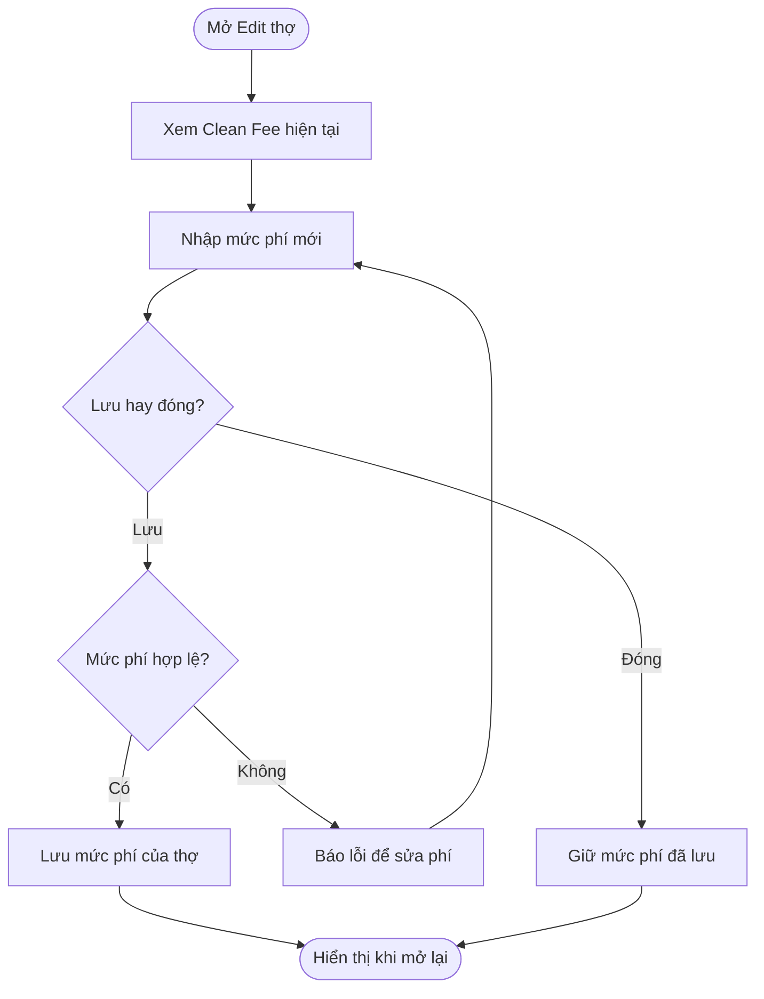

## POS - Setting thợ cho thêm phí clean

**Last Updated:** 2026-09-15

**Audience:** Chủ salon, người quản lý hồ sơ Staff, Product Owner, BA, QA

**Status:** Draft

### Overview

Bổ sung trường **Clean Fee ($)** trong form chỉnh sửa thợ tại **POS → Salon Settings → Staff → View & Edit**, thuộc nhóm **Role, Pay & Tips**. Người quản lý nhập và lưu mức phí vệ sinh bằng số tiền cố định cho từng thợ. Tài liệu mô tả cấu hình phí theo form prototype hiện tại.

### Key Concepts

| Thuật ngữ | Ý nghĩa |
| :--- | :--- |
| Clean Fee ($) | Mức phí vệ sinh riêng của thợ, nhập bằng USD và theo đơn vị cent. |
| Edit Technician Info | Form chỉnh sửa thông tin của thợ được chọn. |
| Save technician | Thao tác lưu hồ sơ, bao gồm Clean Fee đang nhập. |

### User Roles

| Vai trò | Trách nhiệm |
| :--- | :--- |
| Chủ salon / người quản lý hồ sơ Staff | Xem, nhập, điều chỉnh hoặc đưa Clean Fee của thợ về $0.00. |
| Thợ | Người được ghi nhận mức Clean Fee riêng trong hồ sơ. |

Vai trò trên mô tả người sử dụng nghiệp vụ; tính năng hiện tại chưa bổ sung cơ chế phân quyền riêng cho Clean Fee.

### End-to-End Workflows

#### Workflow: Cấu hình Clean Fee cho thợ

**Primary Actor:** Chủ salon / người quản lý hồ sơ Staff.

**Trigger:** Bấm **View & Edit** tại dòng của một thợ.

**Outcome:** Mức Clean Fee được lưu đúng hồ sơ và hiển thị lại khi mở form.

**User Stories:**

- **US-CF-01 — Thiết lập phí clean:** **As a** chủ salon hoặc người quản lý hồ sơ Staff, **I want to** nhập và điều chỉnh Clean Fee bằng số tiền cố định trong form Edit thợ, **so that** tôi có thể quản lý mức phí vệ sinh riêng cho từng thợ.
- **US-CF-02 — Bỏ thay đổi chưa lưu:** **As a** người quản lý hồ sơ Staff, **I want to** đóng form mà không lưu mức phí vừa nhập, **so that** mức phí trước đó được giữ nguyên.
- **US-CF-03 — Sửa phí không hợp lệ:** **As a** người quản lý hồ sơ Staff, **I want to** được báo khi nhập phí không hợp lệ, **so that** tôi có thể sửa trước khi lưu hồ sơ.

| Bước | Người thực hiện | Thao tác | Phản hồi hệ thống | Ghi chú |
| :--- | :--- | :--- | :--- | :--- |
| 1 | Người quản lý | Vào Staff, bấm View & Edit của thợ | Mở đúng hồ sơ và hiển thị Clean Fee đã lưu | Chưa có mức phí thì hiển thị $0.00. |
| 2 | Người quản lý | Nhập hoặc sửa Clean Fee | Hiển thị mức phí đang nhập | Đơn vị USD; nhập theo cent. |
| 3 | Người quản lý | Bấm Save technician | Kiểm tra giá trị; hợp lệ thì lưu và đóng form, không hợp lệ thì giữ form để sửa | Để trống được lưu thành $0.00. |
| 4 | Người quản lý | Mở lại hồ sơ | Hiển thị đúng mức phí đã lưu | Chỉ cập nhật phí của thợ đang chỉnh sửa. |
| Nhánh hủy | Người quản lý | Bấm Close hoặc nút đóng trước khi lưu | Đóng form; mở lại sẽ lấy mức phí đã lưu trước đó | Bỏ mức phí đang nhập. |

**Acceptance Criteria:**

| ID | Điều kiện / Thao tác | Kết quả mong đợi |
| :--- | :--- | :--- |
| AC-CF-01 | Mở Edit Technician Info | Có trường **Clean Fee ($)** trong nhóm **Role, Pay & Tips**, cạnh Commission trên desktop; xếp bên dưới khi màn hình nhỏ. |
| AC-CF-02 | Mở hồ sơ chưa có Clean Fee | Hiển thị mức mặc định $0.00. |
| AC-CF-03 | Nhập giá trị hợp lệ, ví dụ $12.35, rồi Save technician | Lưu mức $12.35 cho đúng thợ và đóng form. |
| AC-CF-04 | Mở lại hồ sơ hoặc tải lại trang sau khi lưu | Hiển thị đúng mức phí đã lưu, với hai chữ số thập phân. |
| AC-CF-05 | Để trống hoặc nhập 0 rồi lưu | Lưu mức phí $0.00; mở lại hiển thị $0.00. |
| AC-CF-06 | Nhập số âm hoặc giá trị lẻ dưới một cent, ví dụ -1 hoặc 1.234, rồi lưu | Báo giá trị không hợp lệ, giữ form mở và giữ nguyên mức phí đã lưu. |
| AC-CF-07 | Thay đổi phí rồi đóng form trước khi lưu | Khi mở lại, hiển thị mức phí đã lưu trước đó. |
| AC-CF-08 | Lưu Clean Fee của thợ A | Không thay đổi Clean Fee của thợ B; mức bảo đảm thu nhập đã lưu của thợ A được giữ nguyên. |
| AC-CF-09 | Mở Add Staff sau khi vừa chỉnh sửa một thợ | Clean Fee bắt đầu từ $0.00, không lấy mức phí của thợ vừa sửa. |

### System Configuration & Administration

- Mức Clean Fee được cấu hình riêng trong hồ sơ từng thợ.
- Trường cũng xuất hiện khi Add Staff, với mặc định $0.00.
- Prototype hiện lưu dữ liệu tại trình duyệt đang sử dụng; chưa có đồng bộ mức phí giữa các thiết bị.

### State Lifecycle

Clean Fee là thuộc tính của hồ sơ thợ, không có vòng đời trạng thái hoặc bước duyệt riêng. Giá trị đang nhập chỉ thay thế giá trị cũ khi lưu hồ sơ.

### Business Rules

1. Clean Fee là số tiền cố định bằng USD cho từng thợ.
2. Giá trị hợp lệ từ $0.00 trở lên, theo bước $0.01. Trường không bắt buộc nhập; để trống tương đương $0.00.
3. Mỗi thợ có một mức Clean Fee hiện hành trong hồ sơ.
4. Phạm vi user story là nhập, lưu và xem lại cấu hình phí. Kỳ áp dụng, căn cứ tính và việc khấu trừ vào thu nhập cần được xác định trong yêu cầu tính thu nhập riêng.

### Edge Cases & Exception Handling

| Tình huống | Hành vi | Người xử lý |
| :--- | :--- | :--- |
| Hồ sơ cũ chưa có Clean Fee | Hiển thị $0.00. | Người quản lý nhập khi cần. |
| Phí âm hoặc không theo đơn vị cent | Chặn lưu, giữ mức phí cũ. | Người quản lý sửa giá trị. |
| Xóa nội dung trường rồi lưu | Đưa mức phí về $0.00. | Người quản lý. |
| Đóng form trước khi lưu | Bỏ mức phí đang nhập; mở lại lấy mức đã lưu. | Người quản lý. |
| Trình duyệt chặn lưu hoặc hết dung lượng | Prototype chưa có thông báo lỗi lưu riêng; không bảo đảm thay đổi được giữ sau khi tải lại. | Người quản lý kiểm tra lại hồ sơ; đội phát triển xử lý cơ chế báo lỗi lưu. |

### Frequently Asked Questions

**Q: Làm thế nào đưa phí clean về 0?**

A: Nhập 0 hoặc để trống Clean Fee, rồi bấm Save technician.

**Q: $12.35 được tính theo ngày hay theo kỳ trả lương?**

A: User story này chỉ ghi nhận mức phí. Kỳ áp dụng chưa được xác định và tính năng hiện tại chưa tự khấu trừ phí vào thu nhập.

### Related Features

- [Technician Level](technician-level.md): Cấu hình khác trong hồ sơ thợ.
- [Techs Pay Daily](techs-pay-daily.md): Xem thu nhập vận hành của thợ trong ngày.
- [POS Salon Settings](../../html/pages/pos-salon-settings.html): Form View & Edit trong tab Staff.
- [POS Staff](../../html/pages/pos-staff.html): Form hồ sơ thợ tại màn Staff độc lập.
