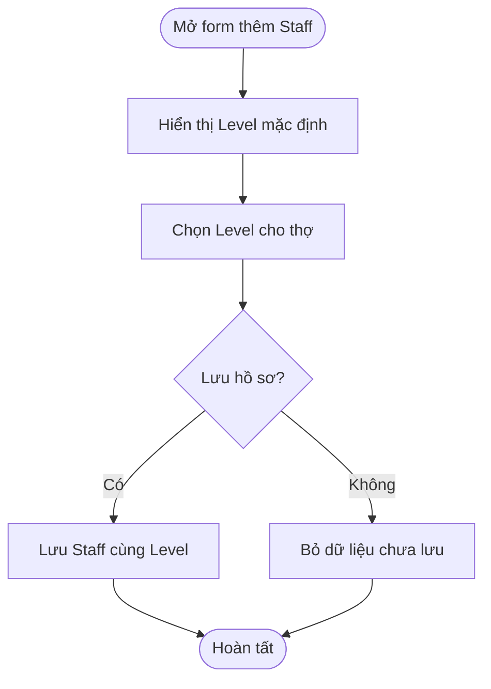
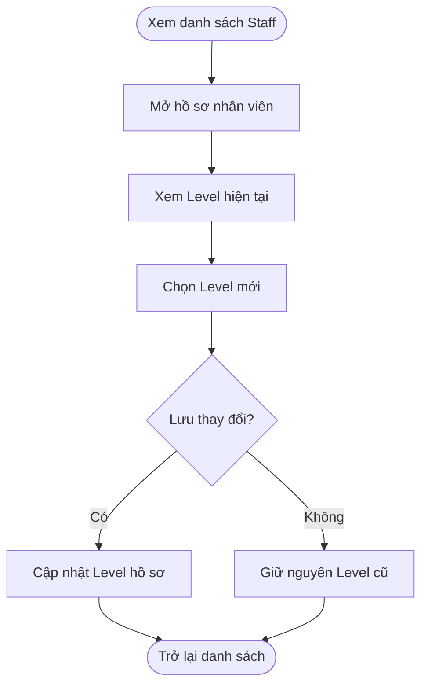

## Technician Level

**Last Updated:** 2026-09-07  
**Audience:** Chủ salon, quản lý hồ sơ Staff, Product Owner, BA, QA  
**Status:** Draft

### Overview

Technician Level cho phép người quản lý ghi nhận cấp độ chuyên môn của thợ khi thêm mới hoặc chỉnh sửa hồ sơ tại **POS → Salon Settings → Staff**. Tài liệu này mô tả việc chọn, lưu và xem Level trong prototype hiện tại. Tự động kiểm tra điều kiện phân công dịch vụ theo Level nằm ngoài phạm vi này.

### Key Concepts

| Thuật ngữ | Ý nghĩa |
| :--- | :--- |
| Level 1 · Basic services | Cấp độ dịch vụ cơ bản; giá trị mặc định khi thêm Staff. |
| Level 2 · Advanced services | Cấp độ dịch vụ nâng cao. |
| Level 3 · Senior / all approved services | Cấp độ cao, mô tả khả năng thực hiện các dịch vụ đã được phê duyệt; không tự động cấp quyền thực hiện mọi dịch vụ. |
| Turns today | Số lượt hôm nay được lưu trong hồ sơ, hiển thị để tham khảo khi chỉnh sửa. |

### User Roles

| Vai trò | Trách nhiệm |
| :--- | :--- |
| Người quản lý hồ sơ Staff | Chọn, cập nhật và kiểm tra Level của nhân viên. |
| Thợ | Nhân viên được ghi nhận Level trong hồ sơ. |

Vai trò trên mô tả người sử dụng nghiệp vụ; không khẳng định prototype đã có kiểm soát quyền chỉnh sửa theo tài khoản.

### End-to-End Workflows

#### Workflow: Thiết lập Level cho Staff mới

**Primary Actor:** Người quản lý hồ sơ Staff  
**Trigger:** Bấm **Add Staff** tại danh sách Staff.  
**Outcome:** Hồ sơ mới được lưu cùng Level đã chọn.

**User Stories:**

- **US-01 — Chọn Level khi thêm mới:** **As a** người quản lý hồ sơ Staff, **I want to** chọn cấp độ chuyên môn khi thêm thợ, **so that** hồ sơ phản ánh cấp độ của thợ ngay từ đầu.
- **US-02 — Hủy thao tác thêm:** **As a** người quản lý hồ sơ Staff, **I want to** đóng form trước khi lưu, **so that** lựa chọn đang nhập không tạo ra hồ sơ ngoài ý muốn.

**Acceptance Criteria:**

1. Form Add Staff có section **Technician Level** riêng, nằm sau **Role, Pay & Tips**.
2. Dropdown chỉ có ba lựa chọn Level 1, Level 2 và Level 3 với nhãn như bảng Key Concepts.
3. Khi mở form thêm mới, mặc định chọn **Level 1**.
4. Phần bên phải Level để trống: không có khung trạng thái, số lượt, tên nhân viên hoặc chữ “New staff member”.
5. Lưu hồ sơ thành công sẽ lưu cả Level đã chọn. Mở lại hồ sơ phải hiển thị đúng Level đó.
6. Đóng form khi chưa lưu không tạo Staff mới. Mở lại form thêm mới bắt đầu từ Level 1.

| Step | Who | Action | System Response | Notes |
| :--- | :--- | :--- | :--- | :--- |
| 1 | Người quản lý | Bấm Add Staff | Mở form thêm mới, chọn sẵn Level 1 | Section nằm sau phần pay và tips. |
| 2 | Người quản lý | Chọn Level | Hiển thị lựa chọn trong form | Chưa ghi vào hồ sơ. |
| 3 | Người quản lý | Lưu hoặc đóng form | Lưu hồ sơ kèm Level, hoặc bỏ thay đổi chưa lưu | Chỉ thao tác lưu mới ghi nhận Level. |

#### Workflow: Xem và cập nhật Level của Staff

**Primary Actor:** Người quản lý hồ sơ Staff  
**Trigger:** Xem danh sách Staff hoặc bấm **View** của một nhân viên.  
**Outcome:** Level được xem hoặc cập nhật đúng hồ sơ; các thông tin vận hành khác không bị thay đổi do lựa chọn Level.

**User Stories:**

- **US-03 — Xem Level:** **As a** người quản lý hồ sơ Staff, **I want to** xem Level ngay trong bảng Staff và form chỉnh sửa, **so that** tôi biết cấp độ đang được ghi nhận của từng thợ.
- **US-04 — Cập nhật Level:** **As a** người quản lý hồ sơ Staff, **I want to** thay đổi Level của một thợ, **so that** hồ sơ phản ánh đánh giá chuyên môn mới nhất.
- **US-05 — Giữ thông tin lượt:** **As a** người quản lý hồ sơ Staff, **I want to** cập nhật Level mà không thay đổi số lượt hôm nay, **so that** việc điều chỉnh hồ sơ không làm sai dữ liệu lượt đang được ghi nhận.
- **US-06 — Bỏ thay đổi chưa lưu:** **As a** người quản lý hồ sơ Staff, **I want to** đóng form mà không lưu Level vừa chọn, **so that** Level trước đó được giữ nguyên.

**Acceptance Criteria:**

1. Bảng Staff có cột **Level**, hiển thị Level của từng nhân viên.
2. Bấm View mở đúng hồ sơ và chọn sẵn Level đã lưu; form Edit không hiển thị **Choose from list**.
3. Bên phải dropdown hiển thị trạng thái và số lượt hôm nay của hồ sơ, kèm dòng: “Changing skills or level will not change today's turn position.” Khung không lặp lại tên thợ.
4. Khi chọn Level khác và lưu, chỉ hồ sơ nhân viên đang sửa được cập nhật; bảng Staff và lần mở form tiếp theo hiển thị Level mới.
5. Nếu chỉ sửa Level, số lượt đã lưu, pay structure, commission và tip preference được giữ nguyên.
6. Đóng form trước khi lưu giữ nguyên Level cũ.
7. Hồ sơ chưa có Level được hiển thị là Level 1.

| Step | Who | Action | System Response | Notes |
| :--- | :--- | :--- | :--- | :--- |
| 1 | Người quản lý | Xem bảng Staff | Hiển thị cột Level | Có thể tìm nhân viên theo tên. |
| 2 | Người quản lý | Bấm View | Mở hồ sơ với Level hiện tại và thông tin lượt | Không có phần chọn nhân viên từ danh sách. |
| 3 | Người quản lý | Chọn Level mới | Cập nhật lựa chọn trong form | Chưa thay đổi hồ sơ đã lưu. |
| 4 | Người quản lý | Lưu hoặc đóng form | Cập nhật Level hoặc giữ nguyên Level cũ | Không thay đổi số lượt do đổi Level. |

### System Configuration & Administration

- Danh sách ba Level cố định trong phiên bản hiện tại; chưa có màn hình cấu hình tên hoặc thêm Level.
- Cập nhật Level không tự động thay đổi danh sách dịch vụ được phê duyệt, cơ cấu thu nhập hay cấu hình tips.
- Chưa có luồng yêu cầu lý do hoặc lịch sử thay đổi riêng cho Level trong form Staff hiện tại.

### State Lifecycle

Không có vòng đời trạng thái riêng cho Technician Level. Đây là thuộc tính hồ sơ có ba giá trị; người quản lý có thể đổi từ một Level sang Level khác khi lưu. Không có bước duyệt hoặc quy tắc bắt buộc tăng lần lượt qua từng cấp.

### Business Rules

- Mỗi hồ sơ có một Level được chọn tại một thời điểm.
- Mặc định của Staff mới và hồ sơ chưa có Level là Level 1.
- Giá trị ngoài ba Level hợp lệ được đưa về Level 1 khi lưu trong prototype hiện tại.
- Level chỉ được ghi nhận khi lưu hồ sơ.
- Việc đổi Level không cập nhật số lượt được lưu trong hồ sơ.
- Dòng lưu ý về vị trí lượt thể hiện ý nghĩa nghiệp vụ; Turn Board đang dùng dữ liệu demo riêng, chưa đồng bộ việc phân công hoặc xếp lượt theo Level từ form Staff.
- Trạng thái và số lượt bên phải lấy từ hồ sơ. Khi thiếu dữ liệu, prototype hiển thị `available` và `0 turns today`; đây không phải xác nhận trạng thái vận hành thời gian thực.

### Edge Cases & Exception Handling

| Scenario | What Happens | Who Resolves It |
| :--- | :--- | :--- |
| Staff cũ chưa có Level | Hiển thị Level 1 | Người quản lý xem xét và cập nhật nếu cần. |
| Đổi Level rồi đóng form | Không lưu lựa chọn mới | Người quản lý mở lại nếu muốn cập nhật. |
| Mở Add sau khi vừa sửa thợ Level 3 | Form mới trở về Level 1, khung thông tin bên phải ẩn | Hệ thống. |
| Chỉ đổi Level | Giữ các giá trị hồ sơ khác và số lượt hiện có | Hệ thống. |
| Trình duyệt không lưu được dữ liệu | Prototype chưa có cơ chế báo lỗi lưu đầy đủ; chưa đảm bảo Level tồn tại sau khi tải lại trang | Cần bổ sung trước khi dùng vận hành thực tế. |

### Frequently Asked Questions

**Q: Chọn Level 3 có tự động cho phép thợ nhận tất cả dịch vụ không?**  
A: Không. Phạm vi hiện tại chỉ ghi nhận Level; chưa áp dụng Level vào kiểm tra điều kiện phân công dịch vụ.

**Q: Thay Level có làm thay đổi lượt hôm nay không?**  
A: Không thay đổi số lượt đang lưu trong hồ sơ. Turn Board demo chưa đồng bộ với Level của Staff.

**Q: Tại sao form thêm mới không có khung thông tin bên phải?**  
A: Staff mới chưa có thông tin vận hành cần hiển thị; phần này được để trống theo thiết kế.

### Related Features

- [Salon Settings — Staff](../../html/pages/pos-salon-settings.html)
- [Form Staff gốc](../../html/pages/pos-staff.html)
- [Turn Board prototype](../../html/pages/pos-front-desk-turn-board.html)
