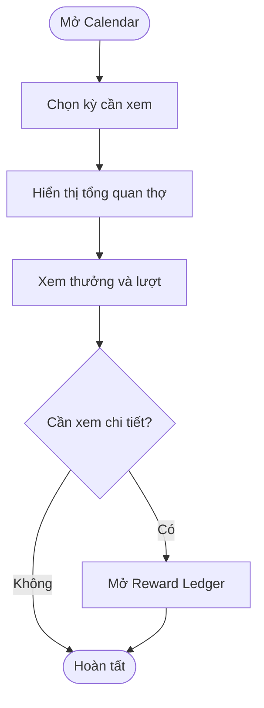
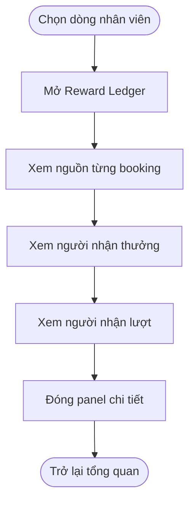
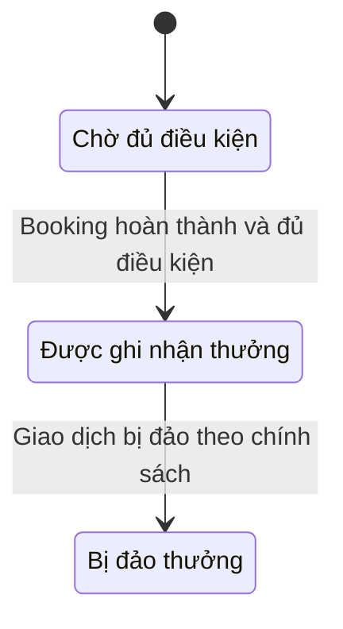

## Technician Overview

**Last Updated:** 2026-09-07  
**Audience:** Chủ salon, Manager, Front Desk, Product Owner, BA, QA  
**Status:** Draft

### Overview

**Technician Overview** nằm trong **POS → Front Desk → Appointments → Calendar**, giúp người quản lý xem booking hoàn thành, thưởng booking và ảnh hưởng đến lượt của từng thợ. Bấm một dòng nhân viên để mở **Reward Ledger** và xem nguồn booking, người nhận thưởng, người nhận lượt. Các chỉ số hiện được tạo từ dữ liệu demo; tài liệu phân biệt hành vi có sẵn với nghiệp vụ cần hoàn thiện.

### Key Concepts

| Thuật ngữ | Ý nghĩa |
| :--- | :--- |
| Completed | Số booking hoàn thành hiển thị cho thợ trong kỳ đang xem. |
| Reward | Số tiền thưởng booking được tính theo chính sách trong prototype; không phải khoản đã chi trả. |
| Walk-in turns | Số lượt walk-in được ghi nhận cho thợ. |
| Booking credit | Tổng lượt quy đổi từ booking được tính credit. |
| Effective turns | Tổng Walk-in turns và Booking credit. |
| Customer Request | Booking mà khách chọn đích danh thợ. |
| Anyone | Booking mà khách không chọn đích danh thợ, được hệ thống hoặc người quản lý phân công. |
| Reassigned Request | Booking khách yêu cầu một thợ nhưng người thực hiện là thợ khác. |
| Reward owner / Turn owner | Người được ghi nhận thưởng / người được ghi nhận lượt. Hai người có thể khác nhau. |
| Reward Ledger | Panel chi tiết giải thích nguồn booking và phân bổ thưởng, lượt. |

### User Roles

| Role | Responsibilities in this Feature |
| :--- | :--- |
| Chủ salon / Manager | Theo dõi kết quả, kiểm tra cách tính thưởng và cấu hình chính sách. |
| Front Desk phụ trách điều phối | Tham khảo số liệu lượt và booking để hiểu tình hình của thợ. |
| Thợ | Người được hiển thị kết quả và ghi nhận thưởng, lượt. |

Vai trò trên mô tả nhu cầu nghiệp vụ; prototype chưa kiểm soát quyền xem hay chỉnh chính sách theo tài khoản đăng nhập.

### End-to-End Workflows

#### Workflow: Xem tổng quan theo kỳ

**Primary Actor:** Chủ salon / Manager / Front Desk  
**Trigger:** Mở Calendar hoặc đổi chế độ thời gian.  
**Outcome:** Xem được các chỉ số của từng thợ trong phạm vi kỳ hiển thị.

**User Stories:**

- **US-01 — Xem kết quả từng thợ:** **As a** người quản lý salon, **I want to** xem Completed, Reward, Walk-in turns, Booking credit và Effective turns của từng thợ, **so that** tôi có cái nhìn tổng quan về booking, thưởng và lượt.
- **US-02 — Xem theo kỳ:** **As a** người quản lý salon, **I want to** chuyển giữa Day, Week, 2 Weeks, 3 Weeks và Month, **so that** tôi có thể xem tổng quan ở các khoảng thời gian khác nhau.
- **US-03 — Hiểu lượt quy đổi:** **As a** nhân viên Front Desk, **I want to** thấy riêng Walk-in turns và Booking credit cùng tổng Effective turns, **so that** tôi hiểu đóng góp của từng nguồn vào số lượt hiển thị.

**Acceptance Criteria — hiện có:**

1. Bảng có các cột Technician, Completed, Reward, Walk-in turns, Booking credit, Effective turns và Status.
2. Thông tin thợ gồm avatar chữ viết tắt, tên và cấp độ demo Junior/Senior/Master.
3. Reward hiển thị theo định dạng tiền USD; Booking credit và Effective turns hiển thị một chữ số thập phân.
4. Effective turns bằng Walk-in turns cộng Booking credit.
5. Đổi chế độ thời gian sẽ dựng lại bảng và mô tả kỳ đang xem.
6. Phần đầu bảng hiển thị thông tin kỳ chính sách và mức booking turn credit.
7. Bấm một dòng thợ mở Reward Ledger của đúng thợ đó.

**Giới hạn:** Chỉ số được mô phỏng theo thợ và số ngày của chế độ xem, không tổng hợp từ lịch hẹn thực tế. Chuyển sang ngày khác có cùng độ dài kỳ có thể cho cùng kết quả. Chính sách tính thưởng theo tuần/tháng chưa tạo ra các kỳ đối soát thực tế.

| Step | Who | Action | System Response | Notes |
| :--- | :--- | :--- | :--- | :--- |
| 1 | Người quản lý | Mở Calendar | Hiển thị Technician Overview | Danh sách thợ demo riêng. |
| 2 | Người quản lý | Chọn kỳ xem | Cập nhật các chỉ số và mô tả kỳ | Chưa dùng giao dịch thật. |
| 3 | Front Desk / Manager | Đọc thưởng và lượt | Hiển thị từng thành phần và tổng lượt | Không tự đổi thứ tự Turn Board. |

#### Workflow: Kiểm tra Reward Ledger

**Primary Actor:** Chủ salon / Manager  
**Trigger:** Bấm một dòng nhân viên trong Technician Overview.  
**Outcome:** Hiểu nguồn booking và cách phân bổ thưởng, lượt của thợ đang xem.

**User Stories:**

- **US-04 — Xem chi tiết booking:** **As a** người quản lý salon, **I want to** mở Reward Ledger của một thợ và xem khách, ngày, dịch vụ, nguồn booking và giá trị thưởng/lượt, **so that** tôi có thể giải thích các chỉ số tổng quan.
- **US-05 — Phân biệt người nhận thưởng và lượt:** **As a** người quản lý salon, **I want to** phân biệt người khách yêu cầu với người thực hiện dịch vụ, **so that** tôi hiểu cách ghi nhận khi booking được giao lại cho thợ khác.
- **US-06 — Trở lại tổng quan:** **As a** người quản lý salon, **I want to** đóng Reward Ledger mà giữ kỳ xem hiện tại, **so that** tôi tiếp tục xem các thợ khác thuận tiện.

**Acceptance Criteria — hiện có:**

1. Panel hiển thị tên, cấp độ của thợ và ba chỉ số: Completed, Earned reward, Effective turns.
2. Có dòng quy tắc **Only Customer Request earns reward**.
3. Mỗi dòng chi tiết có khách, ngày, dịch vụ, nhãn nguồn booking, số tiền thưởng và thông tin người nhận lượt.
4. Nhãn nguồn phân biệt Customer Request, Reassigned Request, Anyone · System Assigned và Anyone · Manager Assigned; dữ liệu demo còn có Pending và Reversed.
5. Các dòng Anyone hiển thị thưởng bằng 0 và **Not reward eligible**.
6. Với dòng Reassigned Request, người nhận thưởng là thợ được khách yêu cầu; người nhận lượt là người thực hiện trong dữ liệu mẫu.
7. Cuối panel có **Customer Request reward total** bằng Reward trong phần tổng quan.
8. Đóng bằng nút ×, vùng nền hoặc Escape sẽ trở lại bảng mà không đổi kỳ xem.

**Giới hạn:** Ledger chỉ dựng tối đa tám dòng booking đủ điều kiện mẫu, cộng dòng Pending/Reversed khi có. Tiền thưởng tổng hợp được phân bổ lại cho các dòng Customer Request mẫu; đây chưa phải bảng đối soát đầy đủ theo từng giao dịch.

| Step | Who | Action | System Response | Notes |
| :--- | :--- | :--- | :--- | :--- |
| 1 | Người quản lý | Bấm dòng thợ | Mở Reward Ledger tương ứng | Giữ kỳ xem hiện tại. |
| 2 | Người quản lý | Xem nguồn booking | Phân biệt Customer Request, Anyone và booking được giao lại | Chưa liên kết booking thật. |
| 3 | Người quản lý | So sánh người nhận thưởng/lượt | Hiển thị quy tắc phân bổ trên từng dòng mẫu | Không tạo giao dịch chi trả. |
| 4 | Người quản lý | Đóng panel | Quay lại Technician Overview | Không thay đổi dữ liệu. |

### System Configuration & Administration

**US-07 — Xem tác động của chính sách:** **As a** Chủ salon / Manager, **I want to** cập nhật Reward settings và xem lại kết quả Technician Overview, **so that** tôi có thể kiểm tra ảnh hưởng của cấu hình thưởng và lượt quy đổi.

| Cấu hình | Hành vi hiện tại |
| :--- | :--- |
| Thưởng cố định | Số booking dùng tính thưởng nhân đơn giá cố định. |
| Thưởng theo cấp độ | Số booking dùng tính thưởng nhân mức thưởng của Junior/Senior/Master demo. |
| Thưởng theo bậc | Hỗ trợ tính lũy tiến từng bậc hoặc áp mức của bậc đạt được cho toàn bộ số booking. |
| Booking turn credit | Dùng tính tổng Booking credit, sau đó cộng Walk-in turns. Giá trị mặc định dùng chung với Weighted Turn Settings; override trong phiên vẫn ưu tiên. |
| Bật/tắt thưởng | Tắt thưởng làm giá trị Reward bằng 0; booking credit vẫn được tính riêng. |
| Lưu chính sách | Cập nhật và tính lại Overview ngay trong phiên hiện tại. |

Cấu hình ngày hiệu lực và kỳ thưởng đang được hiển thị nhưng chưa được dùng để trì hoãn áp dụng hoặc khóa kỳ. Header vẫn ghi **Policy active** kể cả khi tắt thưởng; cần điều chỉnh trước khi dùng vận hành. Chi tiết toàn bộ Reward settings nằm ngoài tài liệu này.

### State Lifecycle

Prototype hiển thị các nhãn Earned, Pending và Reversed để minh họa kết quả thưởng. Đây chưa phải một vòng đời thưởng được cập nhật từ sự kiện giao dịch.

| Trạng thái / vị trí | Ý nghĩa | Cách hiển thị hiện tại |
| :--- | :--- | :--- |
| Earned trong Overview | Kết quả chưa có booking đảo trong bộ dữ liệu mô phỏng | Là nhãn tổng hợp của dòng thợ, không có nghĩa tiền đã được trả. |
| Reversed trong Overview | Có booking bị đảo trong bộ dữ liệu mô phỏng | Một thợ vẫn có thể có Reward dương từ các booking khác. |
| Pending trong Ledger | Booking mẫu đang chờ | Thưởng và lượt hiển thị bằng 0. |
| Reversed trong Ledger | Booking mẫu được mô tả là đã hoàn tiền | Thưởng và lượt dòng mẫu bằng 0; chưa có bút toán đảo giao dịch. |

**Vòng đời nghiệp vụ dự kiến — cần triển khai và xác nhận điều kiện:**

### Business Rules

- Quy tắc hiển thị trong Ledger là chỉ Customer Request đủ điều kiện thưởng; Anyone không được thưởng do khách yêu cầu đích danh.
- Với booking được giao lại, việc ghi nhận thưởng và ghi nhận lượt có thể thuộc hai thợ khác nhau.
- Completed và số booking dùng tính thưởng có thể khác nhau. Prototype trừ booking bị đảo trước khi tính thưởng và booking credit.
- Tổng lượt hiệu dụng là phép cộng các thành phần, chưa trực tiếp thay đổi vị trí thợ trên Turn Board.
- Reward chỉ là số liệu tính toán; màn hình không chuyển tiền, không đánh dấu đã thanh toán và không thực hiện payout.
- Cấp độ Junior/Senior/Master hiện chưa đồng bộ với Technician Level 1–3 trong Salon Settings.
- Phạm vi số liệu là kỳ Calendar đang xem; bộ lọc bên ngoài và tìm kiếm của lịch chưa lọc danh sách Technician Overview.

### Edge Cases & Exception Handling

| Scenario | What Happens | Who Resolves It |
| :--- | :--- | :--- |
| Không có booking hoàn thành | **Cần bổ sung:** hiển thị 0 và trạng thái chi tiết phù hợp. Bộ tạo dữ liệu mẫu hiện luôn tạo ít nhất một booking hoàn thành. | Đội phát triển. |
| Thưởng bị tắt | Reward bằng 0 nhưng credit lượt vẫn được tính; nhãn Policy active chưa phản ánh đúng cấu hình | Đội phát triển hoàn thiện nhãn; Manager kiểm tra cấu hình. |
| Có booking hoàn tiền | Demo giảm số booking tính thưởng, có nhãn Reversed; chưa đối soát giao dịch hoàn tiền thực tế | Cần quy định và triển khai cách đảo thưởng/lượt. |
| Chọn kỳ khác hoặc ngày khác | Tính lại theo độ dài kỳ, không lọc giao dịch theo ngày thực | Đội phát triển kết nối dữ liệu lịch hẹn. |
| Ledger có ít dòng hơn tổng Completed | Danh sách chỉ là các dòng minh họa có giới hạn | Cần dữ liệu đầy đủ, phân trang và đối soát thực tế. |
| Tổng Reward và nguồn booking | Tổng hiện tính trên booking đủ điều kiện demo rồi phân bổ cho các dòng Customer Request mẫu | Cần tính thưởng từ nguồn booking thực để bảo đảm quy tắc nhất quán. |
| Tải lại trang | Giữ cấu hình lượt chung của salon; phần thưởng và override trở về demo, chưa lưu kết quả Overview bền vững | Đội phát triển. |
| Tranh chấp phân bổ thưởng/lượt | Chưa có quy trình điều chỉnh hoặc phê duyệt trong panel này | Chủ salon xác định nghiệp vụ; đội phát triển bổ sung. |

### Frequently Asked Questions

**Q: Reward có phải số tiền thợ đã nhận không?**  
A: Không. Đây là số tiền thưởng tính toán trong prototype; không có thao tác chi trả ở màn hình này.

**Q: Vì sao người nhận thưởng khác người nhận lượt?**  
A: Booking có thể được khách yêu cầu một thợ nhưng do thợ khác thực hiện. Ledger minh họa việc giữ thưởng cho thợ được yêu cầu và lượt cho người thực hiện.

**Q: Có thể dùng Overview để chốt thưởng thực tế chưa?**  
A: Chưa. Cần đồng bộ booking thật, điều kiện đủ thưởng, hoàn tiền, ngày hiệu lực và đối soát chi tiết trước khi dùng vận hành.

### Related Features

- [Appointments Need Assignment](appointments-need-assignment.md)
- [Technician Level](technician-level.md)
- [Front Desk — Calendar](../../html/pages/pos-front-desk.html?tab=appointments&view=calendar)
- [Turn Board](../../html/pages/pos-front-desk-turn-board.html)
