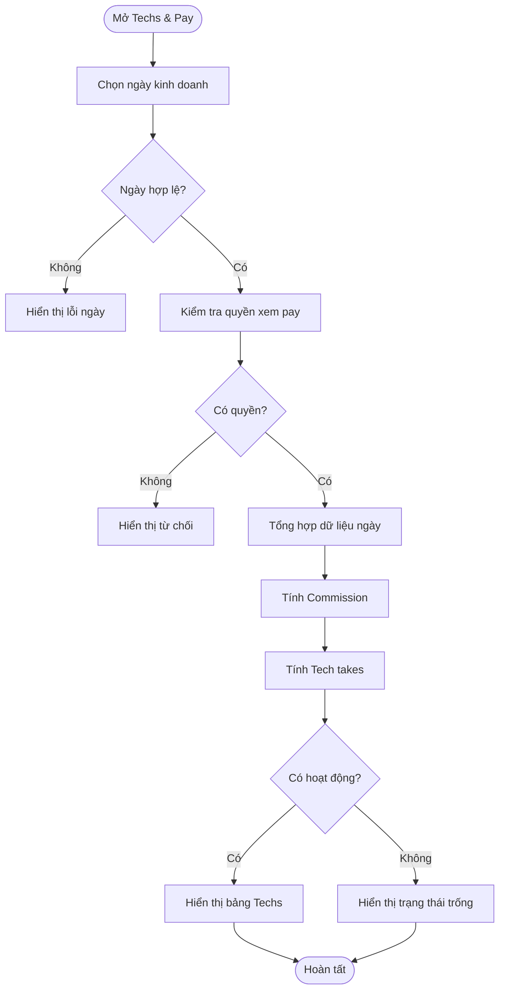
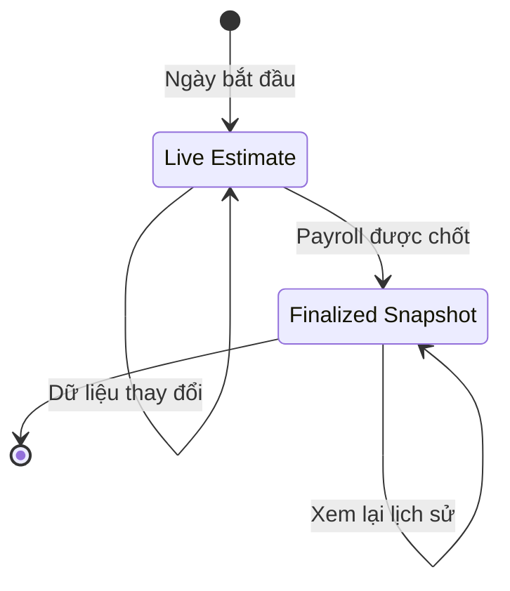

## Techs & Pay — Theo Ngày

**Last Updated:** 2026-08-18

**Audience:** Salon Owner, Manager, Accountant, Product Owner, Business Analyst, QA, Customer Support, API/Backend Team

**Status:** Review

---

### Overview

> Techs & Pay — Theo Ngày giúp người có quyền xem pay theo dõi kết quả làm việc và thu nhập vận hành của từng technician trong một ngày kinh doanh. Một API chỉ đọc tổng hợp toàn bộ dữ liệu cần cho bảng, bảo đảm Turns, Hours, Service, Commission, Tip, Comm % và Tech takes cùng dùng một ngày, một location và một thời điểm dữ liệu nhất quán.

---

### Key Concepts

| Term | Definition |
| :--- | :--- |
| Business Date | Ngày kinh doanh của salon, được xác định theo timezone của location thay vì timezone của server hoặc thiết bị người dùng. |
| Tech | Technician thuộc location trong ngày được chọn, hoặc có hoạt động được ghi nhận tại location trong ngày đó. |
| Turns | Số lượt phục vụ hợp lệ đã được ghi nhận cho technician trong ngày. |
| Hours | Tổng thời gian làm việc của technician trong ngày, được tổng hợp từ các phiên clock-in/clock-out hợp lệ. |
| Service | Doanh số dịch vụ ròng đủ điều kiện tính commission, sau discount và refund hợp lệ, không gồm tax và tip. |
| Commission | Số tiền hoa hồng trong ngày, được tính từ Service và Comm % có hiệu lực trong ngày đó. |
| Tip | Tổng tip hợp lệ đã xác nhận và phân bổ cho technician trong ngày. |
| Comm % | Tỷ lệ commission có hiệu lực cho technician trong ngày được chọn. |
| Tech takes | Số tiền vận hành trong ngày bằng Commission cộng Tip; đây chưa phải final payroll hoặc payout. |
| Live Estimate | Kết quả tạm tính của ngày chưa được chốt; số liệu có thể thay đổi khi có ticket, tip, refund hoặc điều chỉnh mới. |
| Finalized Snapshot | Kết quả đã được chốt và lưu snapshot; thay đổi Comm % hiện tại không được làm thay đổi lịch sử này. |

---

### User Roles

| Role | Responsibilities in this Feature |
| :--- | :--- |
| Salon Owner | Xem toàn bộ dữ liệu Techs & Pay của location mà mình sở hữu. |
| Manager | Xem dữ liệu khi được cấp quyền xem pay và commission. |
| Accountant | Xem dữ liệu khi được cấp quyền phục vụ đối soát và báo cáo. |
| Front Desk | Không được xem dữ liệu pay của toàn bộ technician. |
| Technician | Không dùng API này để xem dữ liệu của toàn bộ team; self-only pay view là phạm vi riêng. |
| Customer Support | Hỗ trợ điều tra lỗi theo request ID nhưng không được ghi số tiền pay hoặc PII vào log thông thường. |

---

### End-to-End Workflows

#### Workflow: Xem Techs & Pay Theo Ngày

**Primary Actor:** Salon Owner, Manager hoặc Accountant có quyền xem pay

**Trigger:** Người dùng mở khu vực Techs & Pay hoặc chọn một ngày khác

**Outcome:** Hệ thống hiển thị một dòng cho mỗi technician phù hợp với ngày đã chọn, với bảy cột dữ liệu nhất quán

**User Stories:**

- **As a** Salon Owner, **I want to** xem Techs & Pay của hôm nay, **so that** I can theo dõi hoạt động và thu nhập vận hành của team.
- **As a** Manager, **I want to** lọc theo một ngày trước đó, **so that** I can đối soát Turns, Hours, Service, Commission và Tip.
- **As a** Accountant, **I want to** thấy số liệu lịch sử đã chốt, **so that** thay đổi Comm % hiện tại không làm sai dữ liệu cũ.
- **As a** Authorized User, **I want to** nhận trạng thái trống rõ ràng khi ngày không có hoạt động, **so that** I do not mistake zero activity for a system error.
- **As a** Unauthorized User, **I want to** receive a clear access denial, **so that** sensitive pay data is not exposed.

| Step | Who | Action | System Response | Notes |
| :--- | :--- | :--- | :--- | :--- |
| 1 | Authorized User | Mở Techs & Pay. | Hệ thống chọn ngày hiện tại theo timezone của location. | Không dùng ngày theo thiết bị người dùng. |
| 2 | Authorized User | Giữ ngày mặc định hoặc chọn một ngày trong quá khứ. | Hệ thống kiểm tra định dạng ngày và chặn ngày tương lai. | Chỉ hỗ trợ một ngày mỗi request. |
| 3 | System | Kiểm tra quyền xem pay và quyền truy cập location. | Request được tiếp tục hoặc bị từ chối mà không làm lộ location của tenant khác. | Yêu cầu quyền xem toàn bộ Techs & Pay. |
| 4 | System | Xác định danh sách technician của ngày được chọn. | Technician active trong ngày hoặc có hoạt động trong ngày được đưa vào kết quả. | Technician đã deactivate vẫn có thể xuất hiện ở lịch sử. |
| 5 | System | Tổng hợp Turns, Hours, Service và Tip. | Tất cả nguồn dữ liệu dùng cùng Business Date và cùng một snapshot time. | Không trả partial success khi nguồn bắt buộc bị lỗi. |
| 6 | System | Lấy Comm % có hiệu lực và tính Commission. | Commission dùng Service × Comm %, hoặc dùng finalized snapshot nếu ngày đã chốt. | Tiền được tính bằng integer cents. |
| 7 | System | Tính Tech takes. | Tech takes bằng Commission cộng Tip. | Chưa gồm guarantee, bonus, deduction, tax hoặc payout. |
| 8 | System | Trả kết quả. | UI hiển thị Tech, Turns, Hours, Service, Commission, Tip, Comm % và Tech takes. | Ngày không có hoạt động vẫn trả success với giá trị `0`. |



---

### System Configuration & Administration

- **As a** System Administrator, **I want to** cấu hình IANA timezone cho từng location, **so that** Business Date được xác định chính xác.
- **As a** Salon Owner, **I want to** cấu hình Comm % có ngày hiệu lực cho từng technician, **so that** Commission được tính đúng cho hiện tại và lịch sử.
- **As a** Salon Owner, **I want to** cấp quyền xem pay theo role, **so that** chỉ người phù hợp mới thấy dữ liệu nhạy cảm.
- **As a** Auditor, **I want to** biết ai đã xem dữ liệu pay, location nào và ngày nào, **so that** hoạt động truy cập có thể được kiểm tra.

| Configuration | Business Requirement |
| :--- | :--- |
| Location Timezone | Bắt buộc là IANA timezone hợp lệ, ví dụ `America/Chicago`. |
| Currency | V1 sử dụng USD. |
| Pay View Permission | Chỉ Owner hoặc tài khoản được cấp quyền xem toàn bộ pay mới gọi được API. |
| Commission Rate | Lưu theo effective date; lịch sử đã chốt phải dùng rate snapshot. |
| Data Refresh | UI có thể refresh dữ liệu hôm nay mỗi 30–60 giây; ngày lịch sử không cần polling. |
| Sensitive Data Logging | Log request metadata nhưng không log số Tip, Commission, Tech takes hoặc PII ở application log thông thường. |

---

### State Lifecycle

Daily Techs & Pay có hai trạng thái tính toán. API chỉ đọc và báo trạng thái; việc finalize thuộc payroll/payout workflow khác.

| Current Status | Trigger | New Status | Notes |
| :--- | :--- | :--- | :--- |
| Chưa có snapshot | Ngày kinh doanh bắt đầu hoặc có hoạt động đầu tiên | Live Estimate | Kết quả được tính từ dữ liệu ledger hiện tại. |
| Live Estimate | Có ticket, tip, clock session, turn, refund hoặc điều chỉnh mới | Live Estimate | Số liệu có thể tăng hoặc giảm. |
| Live Estimate | Payroll/Payout workflow chốt ngày hoặc kỳ liên quan | Finalized Snapshot | Lưu Commission, Comm % và các số liệu dùng để đối soát lịch sử. |
| Finalized Snapshot | Người dùng xem lại ngày lịch sử | Finalized Snapshot | Thay đổi cấu hình hiện tại không được viết lại snapshot. |



---

### Business Rules

- **Rule 1 — Một API đọc:** V1 chỉ cung cấp một `GET` để lấy toàn bộ bảng Techs & Pay của một location và một Business Date.
- **Rule 2 — Một ngày thống nhất:** Turns, Hours, Service, Commission, Tip, Comm % và Tech takes phải dùng cùng Business Date trong một response.
- **Rule 3 — Ngày mặc định:** Nếu client không gửi ngày, hệ thống dùng ngày hiện tại theo timezone của location.
- **Rule 4 — Không xem ngày tương lai:** Ngày tương lai hoặc ngày không tồn tại phải bị từ chối; hệ thống không tự sửa ngày sai.
- **Rule 5 — Thứ tự cột:** Sau cột Tech, thứ tự là Turns, Hours, Service, Commission, Tip, Comm %, Tech takes.
- **Rule 6 — Turns:** Chỉ tính turn credit đã post; turn bị reverse hoặc assignment bị hủy không được tính. Kết quả hiển thị không âm.
- **Rule 7 — Hours:** Tổng hợp clock session hợp lệ giao với khoảng thời gian của Business Date. Phiên qua nửa đêm chỉ tính phần nằm trong ngày được chọn.
- **Rule 8 — Open shift:** Với hôm nay, clock session chưa đóng được tính đến snapshot time của response. Với ngày lịch sử, trạng thái on-shift luôn là false.
- **Rule 9 — Service:** Chỉ gồm service line đã paid hoặc settled, sau discount và refund; không gồm tax, tip, gift-card load và item không đủ điều kiện commission.
- **Rule 10 — Comm %:** Dùng rate có hiệu lực trong ngày được chọn. Finalized Snapshot dùng rate đã lưu cùng snapshot.
- **Rule 11 — Commission:** Với Live Estimate, Commission bằng Service nhân Comm %, làm tròn half-up đến cent gần nhất.
- **Rule 12 — Tip:** Chỉ gồm tip đã confirmed và adjustment hợp lệ; loại pending, disputed, voided, rejected và service charge không được phân loại là voluntary tip.
- **Rule 13 — Tip allocation:** Ưu tiên phân bổ tip rõ ràng theo technician. Nếu ticket không có allocation, chia theo tỷ trọng Service đủ điều kiện và dùng largest remainder để tổng cent bằng đúng tip của ticket.
- **Rule 14 — Tech takes:** Tech takes bằng Commission cộng Tip.
- **Rule 15 — Không phải final pay:** Tech takes không gồm weekly guarantee, bonus, deduction, tax withholding, gross pay, net pay hoặc payout status.
- **Rule 16 — Tiền và tỷ lệ:** Tiền trả bằng integer cents; Comm % trả bằng basis points, ví dụ `6000` là `60.00%`.
- **Rule 17 — Technician lịch sử:** Technician đã deactivate vẫn xuất hiện nếu có membership hoặc hoạt động trong ngày lịch sử được chọn.
- **Rule 18 — Zero activity:** Không có hoạt động không phải lỗi; trả success, giữ technician phù hợp và đặt số liệu bằng `0`.
- **Rule 19 — Snapshot nhất quán:** Tất cả nguồn bắt buộc phải được đọc từ cùng một consistent snapshot. Nếu một nguồn bắt buộc không dùng được, trả lỗi thay vì response thiếu cột.
- **Rule 20 — Data isolation:** Người gọi chỉ được xem location thuộc tenant của mình và phải có quyền xem pay.

> 💡 **Important:** Commission và Tech takes trên màn hình này chỉ là daily operational figures. Không được dùng chúng như bằng chứng rằng payroll, tax hoặc payout đã hoàn tất.

---

### API Delivery Contract

#### Request

```http
GET /api/v1/locations/{locationId}/tech-pay/daily?businessDate=YYYY-MM-DD
Authorization: Bearer <access-token>
Accept: application/json
```

| Input | Business Name | Required | Rule |
| :--- | :--- | :--- | :--- |
| `locationId` | Salon Location | Yes | Người gọi phải có quyền truy cập location này. |
| `businessDate` | Business Date | No | Định dạng `YYYY-MM-DD`; mặc định là hôm nay theo location timezone; không nhận ngày tương lai. |

#### Success response

```http
200 OK
Content-Type: application/json
Cache-Control: private, no-store
```

| Response Context | Type | Business Meaning |
| :--- | :--- | :--- |
| `locationId` | String | Location đã được kiểm tra quyền truy cập. |
| `businessDate` | Date | Ngày thực tế đã áp dụng cho toàn bộ dữ liệu. |
| `timezone` | IANA timezone | Timezone của location dùng để xác định Business Date. |
| `currency` | ISO currency | V1 trả `USD`. |
| `isToday` | Boolean | Cho biết ngày được chọn có phải hôm nay của location hay không. |
| `hasActivity` | Boolean | True khi có ít nhất một technician có hoạt động khác `0`. |
| `asOf` | RFC 3339 datetime | Snapshot time dùng cho toàn bộ response. |
| `technicians` | Array | Các dòng Techs & Pay của ngày được chọn. |
| `meta.requestId` | String | Mã tra cứu request cho Support và Engineering. |
| `meta.schemaVersion` | String | Phiên bản response contract; V1 bắt đầu bằng `1.0`. |

#### Response fields

| UI Column | API Field | Type | Business Meaning |
| :--- | :--- | :--- | :--- |
| Tech | `technicianId`, `displayName`, `avatarUrl`, `statusOnDate`, `sortOrder` | Identity fields | Định danh và thứ tự hiển thị technician. |
| Turns | `turns.count` | Integer | Số turn hợp lệ trong ngày. |
| Hours | `hours.workedMinutes`, `hours.onShift` | Integer, Boolean | Phút làm việc và trạng thái đang trong ca. |
| Service | `service.amountCents` | Integer cents | Doanh số dịch vụ ròng đủ điều kiện commission. |
| Commission | `commission.amountCents`, `commission.calculationStatus` | Integer cents, Status | Commission trong ngày và trạng thái Live Estimate/Finalized Snapshot. |
| Tip | `tip.amountCents` | Integer cents | Tip hợp lệ được phân bổ cho technician. |
| Comm % | `commissionRateBps` | Basis points | Tỷ lệ commission có hiệu lực trong ngày. |
| Tech takes | `techTakesCents` | Integer cents | Commission cộng Tip. |

#### Success example

```json
{
  "data": {
    "locationId": "loc_01J6XQ9R4A",
    "businessDate": "2026-08-18",
    "timezone": "America/Chicago",
    "currency": "USD",
    "isToday": true,
    "hasActivity": true,
    "asOf": "2026-08-18T14:35:21-05:00",
    "technicians": [
      {
        "technicianId": "tech_01J6XR2W7M",
        "displayName": "Tina Nguyen",
        "avatarUrl": null,
        "statusOnDate": "active",
        "sortOrder": 1,
        "turns": {
          "count": 4
        },
        "hours": {
          "workedMinutes": 465,
          "onShift": true
        },
        "service": {
          "amountCents": 42000
        },
        "commission": {
          "amountCents": 25200,
          "calculationStatus": "live_estimate"
        },
        "tip": {
          "amountCents": 5400
        },
        "commissionRateBps": 6000,
        "techTakesCents": 30600
      }
    ]
  },
  "meta": {
    "requestId": "req_01K2Y9SN6H5X",
    "schemaVersion": "1.0"
  }
}
```

#### Success behavior

| Condition | HTTP Result | Business Behavior |
| :--- | :--- | :--- |
| Có technician và có hoạt động | `200 OK` | `hasActivity` là true và trả các dòng đã tổng hợp. |
| Có technician nhưng không có hoạt động | `200 OK` | `hasActivity` là false; các cột số tiền, turns và hours trả `0`. |
| Không có technician thuộc ngày/location | `200 OK` | `hasActivity` là false và `technicians` là mảng rỗng. |

#### Error behavior

| HTTP Result | Error Code | Business Meaning |
| :--- | :--- | :--- |
| `400 Bad Request` | `INVALID_BUSINESS_DATE` | Ngày sai định dạng hoặc không tồn tại. |
| `400 Bad Request` | `FUTURE_BUSINESS_DATE` | Ngày được chọn nằm trong tương lai của location. |
| `401 Unauthorized` | `UNAUTHENTICATED` | Phiên đăng nhập thiếu, hết hạn hoặc không hợp lệ. |
| `403 Forbidden` | `TECH_PAY_ACCESS_DENIED` | Người gọi không có quyền xem toàn bộ Techs & Pay. |
| `404 Not Found` | `LOCATION_NOT_FOUND` | Location không tồn tại hoặc không thuộc tenant của người gọi. |
| `429 Too Many Requests` | `RATE_LIMITED` | Vượt giới hạn request; response cung cấp thời gian retry. |
| `500 Internal Server Error` | `INTERNAL_ERROR` | Lỗi hệ thống không dự kiến. |
| `503 Service Unavailable` | `TECH_PAY_SOURCE_UNAVAILABLE` | Một nguồn bắt buộc không sẵn sàng nên hệ thống không thể tạo snapshot nhất quán. |

Errors sử dụng `application/problem+json` và luôn có request ID để Support tra cứu.

---

### Edge Cases & Exception Handling

| Scenario | What Happens | Who Resolves It |
| :--- | :--- | :--- |
| Không gửi Business Date | Hệ thống dùng hôm nay theo timezone của location. | Automatic |
| Ngày sai hoặc ngày tương lai | API từ chối request và chỉ rõ lỗi ở Business Date. | User / Frontend |
| Location đổi timezone | Giao dịch lịch sử giữ nguyên Business Date đã được ghi nhận; không tự chuyển sang ngày khác. | System Administrator nếu cấu hình sai |
| Technician không có hoạt động | Technician vẫn xuất hiện với các giá trị `0` nếu membership active trong ngày. | Automatic |
| Technician đã deactivate | Technician vẫn xuất hiện ở ngày lịch sử khi có membership hoặc hoạt động trong ngày đó. | Automatic |
| Technician chưa clock-in | Hours bằng `0`; on-shift là false. | Technician / Manager nếu cần điều chỉnh |
| Technician đang trong ca | Hours được tính đến snapshot time và on-shift là true. | Automatic |
| Clock session qua nửa đêm | Chỉ phần thời gian nằm trong Business Date được cộng. | Automatic |
| Turn bị reverse hoặc reassign | Turn cũ bị trừ và turn mới được ghi cho technician nhận lượt. | Manager / Automatic audit trail |
| Ticket có tip nhưng thiếu allocation | Tip được chia theo tỷ trọng Service đủ điều kiện và bảo toàn tổng cent. | Automatic; Manager review nếu cần |
| Tip đang disputed hoặc voided | Tip không được cộng vào cột Tip. | Manager / Support |
| Ticket bị refund | Refund hợp lệ làm giảm Service và Commission live estimate theo business rules. | Automatic / Accountant review |
| Comm % thay đổi sau ngày lịch sử đã chốt | Finalized Snapshot giữ nguyên rate và Commission cũ. | Automatic |
| Không có quyền xem pay | API trả access denied và không trả dữ liệu technician. | Salon Owner / Administrator |
| Một ledger bắt buộc bị lỗi | API trả service unavailable, không trả partial `200`. | Engineering / Support |

---

### Acceptance Criteria

1. Chỉ một `GET` trả đủ Tech, Turns, Hours, Service, Commission, Tip, Comm % và Tech takes cho một ngày.
2. `businessDate` được áp dụng giống nhau cho tất cả cột dữ liệu.
3. Khi không gửi ngày, kết quả dùng hôm nay theo timezone của location.
4. Ngày sai và ngày tương lai trả đúng error contract.
5. UI mapping hiển thị đúng thứ tự cột đã chốt và không phụ thuộc vào thứ tự key trong JSON.
6. Hours xử lý đúng open shift và clock session qua nửa đêm.
7. Service loại tax, tip, item không đủ điều kiện và phản ánh discount/refund hợp lệ.
8. Commission dùng Service và Comm % có hiệu lực trong ngày.
9. Tip chỉ gồm dữ liệu hợp lệ và tổng phân bổ giữ đúng số cent của ticket.
10. Tech takes luôn bằng Commission cộng Tip.
11. Lịch sử đã chốt không thay đổi khi Comm % hiện tại thay đổi.
12. Ngày không có hoạt động trả `200`, `hasActivity: false` và giá trị `0`.
13. Technician đã deactivate vẫn được giữ trong lịch sử phù hợp.
14. Người không có quyền không thể xem hoặc suy ra location của tenant khác.
15. Khi thiếu nguồn dữ liệu bắt buộc, API trả `503` thay vì response một phần.

---

### Frequently Asked Questions

**Q: Tech takes có phải số tiền cuối cùng technician sẽ được trả không?**

A: Không. Tech takes trên màn hình này chỉ bằng Commission cộng Tip trong ngày. Final payroll có thể còn weekly guarantee, bonus, deduction, tax withholding và adjustment.

**Q: Tại sao Hours có thể tiếp tục tăng khi technician đang làm việc?**

A: Với ngày hiện tại, một open clock session được tính đến snapshot time của mỗi response.

**Q: Tại sao technician đã deactivate vẫn xuất hiện khi xem ngày cũ?**

A: Lịch sử cần giữ đúng người đã có membership hoặc hoạt động trong ngày đó để phục vụ đối soát.

**Q: Tại sao Comm % hiện tại khác Comm % ở ngày lịch sử?**

A: Comm % được quản lý theo ngày hiệu lực. Ngày đã chốt sử dụng rate snapshot của chính ngày đó.

**Q: Ngày không có hoạt động có phải API bị lỗi không?**

A: Không. API trả `200 OK`, `hasActivity: false` và các giá trị bằng `0`.

**Q: Vì sao API không trả một phần khi chỉ một nguồn dữ liệu bị lỗi?**

A: Các cột có quan hệ trực tiếp với nhau. Trả thiếu Tip, Service hoặc Comm % có thể tạo Commission và Tech takes sai, nên hệ thống phải từ chối toàn bộ snapshot.

---

### Out of Scope

- Add, edit, activate hoặc deactivate technician
- Update Comm % hoặc các pay settings khác
- Weekly guarantee và pay-model calculations
- Bonus, deduction, tax withholding, gross pay và net pay
- Gửi payout hoặc thay đổi payout status
- Finalize payroll và Tax IQ synchronization
- Date range, weekly summary, export, pagination và table/card preferences
- Technician self-service access

---

### Related Features

- [Nexora Touch Payout, Payroll và 1099](../nexora-touch-payout-payroll-1099-supplement-vi.md)
- [TaxIQ/Nexora — Tài liệu nghiệp vụ tổng thể](taxiq-nexora-tai-lieu-nghiep-vu.md)
- [Nexora Payout + Tax IQ Screen Flow](../nexora-payout-tax-iq-screen-flow-ba-v2.md)
