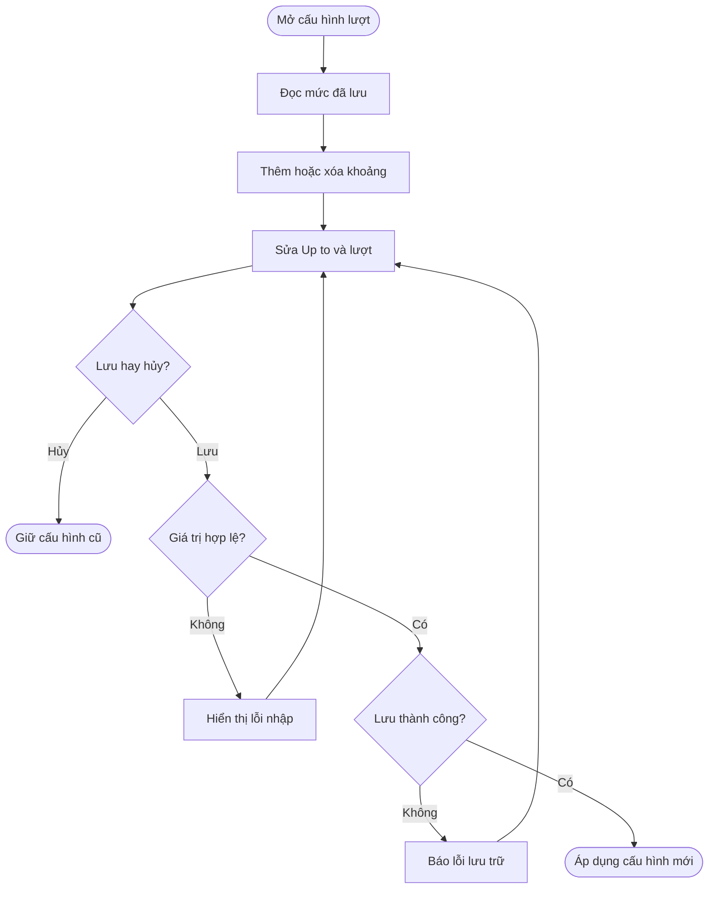
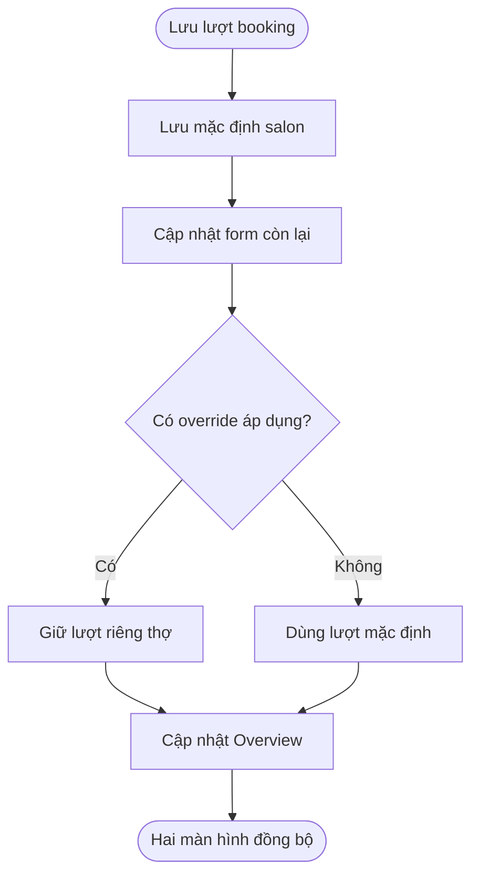
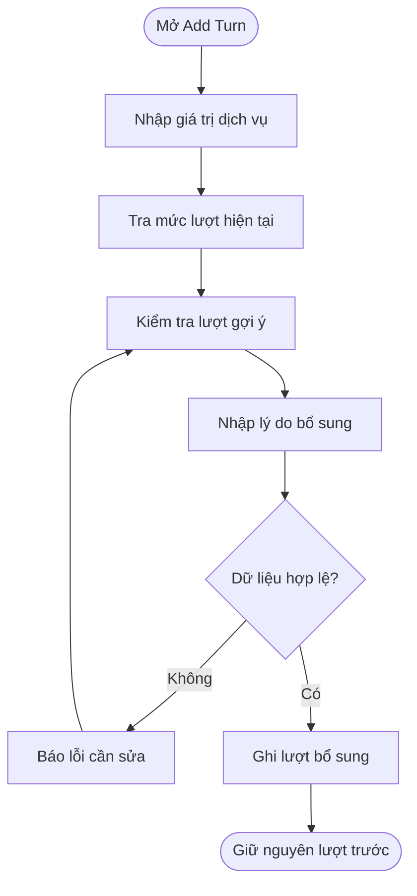
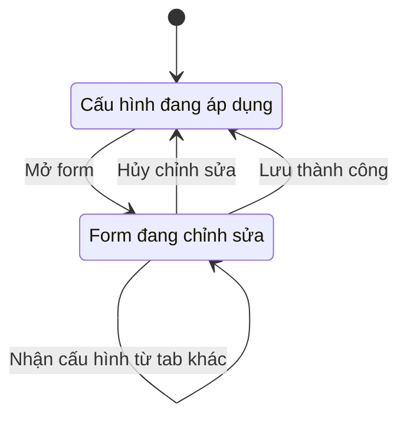

## Weighted Turn Settings

**Last Updated:** 2026-09-15

**Audience:** Chủ salon, Manager, Front Desk, Product Owner, BA, QA

**Status:** Draft

### Overview

**Weighted Turn Settings** cho phép người quản lý thiết lập khoảng giá trị dịch vụ, số lượt quy đổi cho từng khoảng và lượt booking mặc định của salon tại **POS → Front Desk → Turn Board**. Booking turn credit dùng chung với **Booking Incentive Policy** trong Calendar; các khoảng tiền và lượt dịch vụ chỉ được chỉnh tại Turn Board. Tài liệu mô tả hành vi hiện có của prototype và điều kiện nguồn booking đã chốt: chỉ **Customer Request** thuộc phạm vi tính Booking turn credit. Điều kiện này cần được triển khai trên dữ liệu booking thực tế; việc chia sẻ cấu hình hiện chưa bao gồm sổ lượt chung hoặc tự động ghi lượt từ booking hoàn thành.

### Key Concepts

| Thuật ngữ | Ý nghĩa |
| :--- | :--- |
| Turn credit | Số lượt quy đổi, có thể là 0 hoặc số lẻ như 0.5, 1.25. Không phải tiền thưởng. |
| Service turn credit | Số lượt ứng với một khoảng giá trị dịch vụ. |
| Booking turn credit | Lượt mặc định của salon cho mỗi booking được tính lượt trong Calendar. Theo quy tắc đã chốt, chỉ booking Customer Request thuộc phạm vi áp dụng. |
| Customer Request | Booking có yêu cầu đích danh thợ từ khách hàng. Đây là điều kiện nguồn booking để được xét Booking turn credit. |
| Anyone | Booking không có yêu cầu đích danh thợ từ khách hàng; không thuộc phạm vi tính Booking turn credit theo quy tắc đã chốt. |
| Weighted Turn Settings | Form chỉnh lượt booking mặc định, thêm hoặc xóa khoảng dịch vụ, chỉnh giới hạn Up to và số lượt của từng khoảng. |
| Up to | Số tiền cao nhất vẫn thuộc khoảng dịch vụ đó; chỉnh được ở mọi khoảng trừ khoảng cuối là No limit. |
| From | Số tiền bắt đầu khoảng, chỉ đọc: khoảng đầu là $0, mỗi khoảng tiếp theo bằng Up to của khoảng trước cộng $0.01. |
| Booking Incentive Policy | Chính sách thưởng booking; dùng cùng booking turn credit mặc định và có phần tùy chỉnh riêng theo thợ. |
| Technician override | Lượt booking riêng của thợ, được ưu tiên khi chính sách tùy chỉnh theo thợ đang áp dụng. |
| Add Turn | Thao tác thêm một lượt dịch vụ còn thiếu; gợi ý lượt theo mức dịch vụ đã lưu. |
| Lượt đã ghi | Lượt đã xuất hiện trên Turn Board; thay đổi cấu hình không tự tính lại các lượt này. |

### User Roles

| Role | Responsibilities in this Feature |
| :--- | :--- |
| Chủ salon / Manager | Thiết lập, kiểm tra và lưu mức lượt; quản lý cấu hình riêng của thợ qua Booking Incentive Policy. |
| Front Desk | Tham khảo cấu hình và sử dụng lượt gợi ý khi thêm lượt còn thiếu theo quy trình salon. |
| Thợ | Đối tượng được ghi nhận lượt; không có thao tác chỉnh cấu hình riêng trong phạm vi màn hình này. |

Đây là phân công nghiệp vụ dự kiến. Prototype hiện chưa kiểm soát quyền mở hoặc lưu cấu hình theo tài khoản.

### End-to-End Workflows

#### Workflow: Thiết lập và lưu cấu hình lượt

**Primary Actor:** Chủ salon / Manager

**Trigger:** Bấm Weighted Turn Settings trên Turn Board.

**Outcome:** Lưu bộ cấu hình lượt hợp lệ hoặc đóng form để giữ cấu hình trước đó.

**User Stories:**

- **US-01 — Xem cấu hình hiện tại:** **As a** Manager, **I want to** mở form và xem các mức lượt đang áp dụng, **so that** tôi có cơ sở kiểm tra trước khi thay đổi.
- **US-02 — Chỉnh sửa range số tiền:** **As a** Chủ salon / Manager, **I want to** nhập và chỉnh số tiền Up to cùng số turn của từng range ngay trong Weighted Turn Settings, **so that** tôi có thể điều chỉnh cách quy đổi giá trị dịch vụ thành lượt theo chính sách của salon.
- **US-03 — Thiết lập Booking turn credit:** **As a** Chủ salon / Manager, **I want to** xem và chỉnh số lượt quy đổi mặc định cho booking khách yêu cầu đích danh thợ tại Weighted Turn Settings, **so that** salon áp dụng thống nhất mức lượt booking với Booking Incentive Policy và giữ đúng mức riêng của thợ khi có tùy chỉnh đang áp dụng.
- **US-04 — Lưu hoặc hủy chỉnh sửa:** **As a** Manager, **I want to** lưu các mức lượt sau khi kiểm tra hoặc hủy thay đổi, **so that** chỉ cấu hình tôi quyết định lưu mới được áp dụng.
- **US-05 — Xử lý dữ liệu và lỗi lưu:** **As a** Manager, **I want to** nhận thông báo khi giá trị không hợp lệ hoặc không thể lưu, **so that** tôi biết cần sửa gì và không nhầm rằng cấu hình mới đã được áp dụng.
- **US-10 — Thêm range và gợi ý lượt:** **As a** Chủ salon / Manager, **I want to** thêm range ngoài bốn range mặc định và được điền sẵn số turn bằng số turn của range cuối cộng 0.5, **so that** tôi có thể mở rộng các mức tiền với ít thao tác nhập lại.
- **US-11 — Xóa range không còn dùng:** **As a** Chủ salon / Manager, **I want to** xóa một range và tự gộp khoảng tiền của nó vào range liền kề, **so that** tôi có thể giảm số mức quy đổi mà vẫn bao phủ toàn bộ giá trị dịch vụ.

**Acceptance Criteria — hiện có:**

| ID / User story | Given — Điều kiện | When — Thao tác | Then — Kết quả mong đợi |
| :--- | :--- | :--- | :--- |
| AC-01 / US-01 | Salon có cấu hình đã lưu hoặc chưa có cấu hình hợp lệ | Mở Weighted Turn Settings | Hiển thị cấu hình đã lưu; nếu chưa hợp lệ thì dùng bốn range mặc định. Mỗi dòng có From, Up to, Turn credit và thao tác xóa; có ô Booking turn credit riêng. |
| AC-02 / US-02 | Form đang mở | Nhập Up to hợp lệ cho một range có giới hạn | Cho nhập số tiền trực tiếp. From là chỉ đọc: range đầu bắt đầu tại $0; From của range tiếp theo tự cập nhật bằng Up to vừa nhập cộng $0.01. Range cuối luôn có Up to là No limit. |
| AC-03 / US-02 | Các mốc tiền hợp lệ và đã lưu | Dùng một giá trị dịch vụ đúng bằng Up to | Số tiền vẫn thuộc range đó; số tiền bằng Up to + $0.01 thuộc range tiếp theo. Các range liên tục, không hở hoặc chồng lấn. |
| AC-04 / US-02 | Đang chỉnh range đầu tiên có giới hạn | Nhập Up to bằng $0 | Chấp nhận: range đầu chỉ bao gồm $0; range kế tiếp bắt đầu từ $0.01. |
| AC-05 / US-02, US-03 | Form đang mở | Chỉnh Turn credit của range hoặc Booking turn credit | Cho nhập số hữu hạn không âm, gồm 0 và số lẻ. Các mức turn vẫn chỉnh độc lập, không bắt buộc tăng dần theo số tiền. |
| AC-06 / US-10 | Range cuối đang có lượt hợp lệ | Bấm Add range một hoặc nhiều lần | Không giới hạn ở bốn range. Up to của range cuối cũ trở thành ô trống bắt buộc; thêm một range No limit mới. Lượt mới bằng lượt cuối đang nhập cộng 0.5, ví dụ 2 → 2.5 → 3, và vẫn sửa được. Bộ đếm tăng theo số dòng; đặt con trỏ vào Up to cần nhập. |
| AC-07 / US-10, US-05 | Lượt của range cuối đang trống hoặc không hợp lệ | Bấm Add range | Giữ các giá trị đang chỉnh và để trống ô lượt mới. Người quản lý phải nhập Up to mới và sửa các ô lượt không hợp lệ trước khi lưu. |
| AC-08 / US-11 | Có ít nhất hai range | Xóa một range có Up to | Gộp khoảng tiền của range bị xóa vào range tiếp theo, giữ số lượt của range tiếp theo. Tự cập nhật From, số thứ tự và bộ đếm. |
| AC-09 / US-11 | Có ít nhất hai range | Xóa range cuối | Range trước đó trở thành No limit và giữ số lượt của chính nó. Nếu chỉ còn một range thì bao phủ từ $0 đến No limit và vô hiệu hóa nút xóa. |
| AC-10 / US-05 | Có Up to trống, âm, không hữu hạn, quá hai chữ số thập phân, trùng hoặc giảm; hoặc có ô lượt trống/không hợp lệ | Bấm Save Rules | Từ chối lưu, báo lỗi và giữ form cùng bản chỉnh sửa. Up to hợp lệ phải không âm và tăng dần; cấu hình đã lưu không bị ghi đè. |
| AC-11 / US-04 | Tất cả mốc tiền và các ô lượt đều hợp lệ | Bấm Save Rules và lưu thành công | Lưu toàn bộ range, lượt dịch vụ và lượt booking cùng nhau; đóng modal và thông báo thành công. Mở lại hoặc tải lại cùng địa chỉ ứng dụng, trình duyệt và salon đọc cấu hình mới. Mức mới dùng cho gợi ý Add Turn; lượt đã ghi không tự tính lại. |
| AC-12 / US-04 | Đã sửa tiền/lượt hoặc thêm/xóa range nhưng chưa lưu | Bấm Cancel, nút ×, nền ngoài modal hoặc Escape | Đóng form và bỏ bản chỉnh sửa. Mở lại lấy cấu hình đã lưu gần nhất. |
| AC-13 / US-05 | Bản chỉnh sửa hợp lệ nhưng trình duyệt không ghi được cấu hình | Bấm Save Rules | Báo lỗi lưu trữ và giữ form cùng bản chỉnh sửa để thử lại; không báo lưu thành công. |

**Chi tiết US-03 — Booking turn credit:**

**Điểm truy cập:** POS → Front Desk → Turn Board → Weighted Turn Settings → Booking turn credit.

**Điều kiện trước:** Người quản lý đã mở Weighted Turn Settings. Booking turn credit và cấu hình khoảng dịch vụ được lưu cùng một lần bằng Save Rules, nên toàn bộ form phải hợp lệ.

| Thành phần | Yêu cầu |
| :--- | :--- |
| Ô nhập | Nhãn **Turns per booking**, trong phần **Booking turn credit**. |
| Giá trị ban đầu | Giá trị mặc định của salon đã lưu gần nhất; dùng **0.5** nếu chưa có cấu hình hợp lệ. |
| Giá trị cho phép | Bắt buộc nhập số hữu hạn không âm; chấp nhận 0, số nguyên và số lẻ như 0.5, 1.25. Không bắt buộc theo bước 0.5; hiện chưa quy định mức tối đa riêng. |
| Phạm vi áp dụng | Mặc định chung của salon dành cho booking **Customer Request** theo quy tắc đã chốt. Mức riêng của thợ được quản lý qua **Booking Incentive Policy**. |

**Acceptance Criteria — hành vi hiện có của US-03:**

| ID | Given — Điều kiện | When — Thao tác | Then — Kết quả mong đợi |
| :--- | :--- | :--- | :--- |
| AC-BTC-01 | Có cấu hình salon hợp lệ đã lưu hoặc chưa có cấu hình hợp lệ | Mở Weighted Turn Settings | Hiển thị Booking turn credit đã lưu hoặc 0.5 tương ứng; có ô Turns per booking, mô tả mức mặc định của salon và liên kết Booking Incentive Policy. |
| AC-BTC-02 | Form đang mở, các khoảng dịch vụ hợp lệ | Nhập lần lượt 0, 0.5, 1 hoặc 1.25 và lưu từng giá trị | Chấp nhận từng giá trị. Mở lại form hiển thị đúng số lượt vừa lưu, không ép 1.25 thành bội số của 0.5. |
| AC-BTC-03 | Đang chỉnh Booking turn credit | Để trống, nhập số âm hoặc giá trị không phải số hữu hạn rồi yêu cầu lưu | Báo dữ liệu không hợp lệ, giữ form mở và không ghi đè cấu hình đã lưu. Người quản lý có thể sửa giá trị và thử lại. |
| AC-BTC-04 | Tất cả trường hợp lệ; chỉ Booking turn credit được sửa và không có cập nhật từ tab khác | Bấm Save Rules và lưu thành công | Lưu mức booking mới cùng bộ cấu hình; các khoảng tiền và lượt dịch vụ giữ giá trị đang có. Đóng form và thông báo đã lưu, dùng chung với Booking Incentive Policy. Mở lại hoặc tải lại cùng ứng dụng, trình duyệt và salon vẫn đọc được mức mới. |
| AC-BTC-05 | Booking turn credit hợp lệ nhưng một khoảng dịch vụ hoặc lượt dịch vụ không hợp lệ | Bấm Save Rules | Từ chối lưu toàn bộ form, kể cả Booking turn credit. Hiển thị lỗi để người quản lý sửa phần cấu hình chưa hợp lệ. |
| AC-BTC-06 | Đã sửa Booking turn credit nhưng chưa lưu | Bấm Cancel, nút ×, nền ngoài modal hoặc Escape | Đóng form và bỏ thay đổi chưa lưu. Mở lại lấy giá trị đã lưu gần nhất. |
| AC-BTC-07 | Toàn bộ form hợp lệ nhưng trình duyệt không ghi được cấu hình | Bấm Save Rules | Báo lỗi lưu trữ, giữ form và giá trị đang nhập để thử lại; không áp dụng mức mới và không báo thành công. |
| AC-BTC-08 | Weighted Turn Settings và Calendar thuộc cùng salon, địa chỉ ứng dụng và trình duyệt | Lưu Booking turn credit tại một màn hình rồi mở hoặc xem màn hình còn lại | Hai màn hình hiển thị cùng mức mặc định mới; áp dụng cho Calendar trong Front Desk và Calendar độc lập. Save policy từ Calendar giữ nguyên các khoảng tiền và lượt dịch vụ đã lưu mới nhất. |
| AC-BTC-09 | Calendar đang áp dụng Customize by technician; một thợ có mức riêng, thợ khác dùng mặc định | Đổi Booking turn credit tại Weighted Turn Settings và lưu | Technician Overview tính lại phần booking credit của thợ dùng mặc định theo mức mới; thợ có tùy chỉnh đang áp dụng giữ mức riêng. Nếu policy dùng Same policy for all thì tất cả dùng mức chung. |
| AC-BTC-10 | Một thợ dùng mức booking mặc định của salon | Đặt Booking turn credit bằng 0 và lưu | Phần booking credit của thợ đó trong Overview bằng 0. Mức thưởng booking, lượt dịch vụ và các lượt đã ghi trên Turn Board giữ nguyên. Thợ có mức riêng đang áp dụng vẫn dùng mức riêng. |
| AC-BTC-11 | Form có thay đổi chưa lưu | Bấm liên kết Booking Incentive Policy | Điều hướng đến policy trong Calendar; không tự lưu Booking turn credit đang nhập. Muốn giữ thay đổi, người quản lý phải Save Rules trước khi điều hướng. |
| AC-BTC-12 | Hai tab đang chỉnh cấu hình chung | Một tab lưu mức mới thành công | Weighted Turn Settings nhận lại bộ cấu hình chung mới nhất, kể cả khi form đang có thay đổi chưa lưu. Calendar cập nhật ô Booking turn credit và giữ các trường thưởng, Anyone assignment, override đang chỉnh. Chưa có cảnh báo xung đột; lần lưu sau cùng được áp dụng. |

**Acceptance Criteria — điều kiện nguồn booking đã chốt, cần triển khai và nghiệm thu:**

| ID | Given — Điều kiện | When — Thao tác | Then — Kết quả mong đợi |
| :--- | :--- | :--- | :--- |
| AC-BTC-13 | Booking có yêu cầu đích danh thợ từ khách hàng, được xác định là Customer Request | Xét điều kiện nguồn booking để tính Booking turn credit | Booking thuộc phạm vi được xét Booking turn credit. Việc ghi lượt còn phụ thuộc thời điểm và các điều kiện nghiệp vụ cần chốt riêng. |
| AC-BTC-14 | Booking Anyone, khách không yêu cầu đích danh thợ | Xét điều kiện nguồn booking để tính Booking turn credit | Booking không được tính Booking turn credit. Việc salon phân công một thợ cho booking Anyone không tự biến booking đó thành Customer Request. |

**Phạm vi quyết định:** Đã chốt điều kiện khách yêu cầu đích danh thợ. Chưa chốt cách kết hợp Booking turn credit với lượt dịch vụ, đơn vị tính khi có nhiều dịch vụ, người nhận khi đổi/nhiều thợ, thời điểm ghi hoặc thu hồi lượt và phạm vi áp dụng khi đổi cấu hình. Booking Anyone không có Booking turn credit không đồng nghĩa lượt dịch vụ của booking đó bằng 0.

**Ví dụ nghiệm thu — đổi mặc định từ 0.5 thành 1.25:**

Giả sử mỗi thợ có **3 booking Customer Request đủ điều kiện tính lượt**, Calendar đang áp dụng Customize by technician. Kết quả mong đợi theo quy tắc đã chốt:

| Thợ | Cấu hình lượt booking | Booking credit trước khi đổi | Booking credit sau khi lưu |
| :--- | :--- | :--- | :--- |
| Thợ A | Use default | 3 × 0.5 = 1.5 lượt | 3 × 1.25 = 3.75 lượt |
| Thợ B | Custom: 0.75 lượt/booking | 3 × 0.75 = 2.25 lượt | 3 × 0.75 = 2.25 lượt |

**Giới hạn nghiệm thu:** Technician Overview hiện tính trên số booking mô phỏng, chưa lọc Customer Request từ từng booking thực tế; kiểm tra phép nhân chưa đủ để xác nhận AC-BTC-13 và AC-BTC-14 đã được triển khai. Lưu Booking turn credit chưa tự ghi lượt khi booking hoàn thành, chưa thay đổi lượt lịch sử hoặc thứ tự thợ trên Turn Board. Cấu hình chung được giữ trong trình duyệt theo salon; override của thợ hiện chỉ được giữ trong phiên Calendar.

**Ví dụ nghiệm thu US-02 — Đổi Up to của range đầu từ $29.99 thành $49.99:**

| Range | Trước khi sửa | Sau khi lưu | Turn credit |
| :--- | :--- | :--- | ---: |
| 1 | $0–29.99 | $0–49.99 | 0.5 |
| 2 | $30–69.99 | $50–69.99 | 1 |
| 3 | $70–109.99 | $70–109.99 | 1.5 |
| 4 | $110 trở lên | $110 trở lên | 2 |

Sau khi lưu, Add Turn gợi ý **0.5 turn** cho dịch vụ **$49.99** và **1 turn** cho dịch vụ **$50**. Các lượt đã ghi trước đó giữ nguyên.

**Bộ cấu hình mặc định:**

| Loại lượt / giá trị dịch vụ | Lượt mặc định |
| :--- | ---: |
| Booking turn credit | 0.5 |
| $0–29.99 | 0.5 |
| $30–69.99 | 1 |
| $70–109.99 | 1.5 |
| $110 trở lên | 2 |

| Step | Who | Action | System Response | Notes |
| :--- | :--- | :--- | :--- | :--- |
| 1 | Manager | Mở Weighted Turn Settings | Hiển thị cấu hình đã lưu | Dùng mặc định nếu chưa có dữ liệu hợp lệ. |
| 2 | Manager | Thêm/xóa khoảng nếu cần, sửa Up to và lượt | Cập nhật số khoảng và From tương ứng | Khoảng mới cần nhập Up to; chưa áp dụng thay đổi. |
| 3 | Manager | Bấm Save Rules | Kiểm tra mốc tiền và tất cả các ô lượt | Giá trị không hợp lệ được báo lỗi. |
| 4 | Hệ thống | Lưu bộ cấu hình | Đóng form và thông báo thành công | Lỗi lưu trữ giữ form mở. |
| 5 | Manager | Hoặc đóng form trước khi lưu | Bỏ bản chỉnh sửa | Giữ cấu hình đã lưu gần nhất. |

#### Workflow: Đồng bộ với Booking Incentive Policy

**Primary Actor:** Chủ salon / Manager

**Trigger:** Lưu cấu hình từ Weighted Turn Settings hoặc Booking Incentive Policy.

**Outcome:** Hai màn hình đọc cùng booking turn credit mặc định và vẫn giữ lượt riêng của thợ khi override đang áp dụng.

**User Stories:**

- **US-06 — Đồng bộ hai chiều:** **As a** Manager, **I want to** lưu booking turn credit ở một màn hình và thấy giá trị mới ở màn hình còn lại, **so that** tôi không phải duy trì hai giá trị mặc định khác nhau.
- **US-07 — Giữ cấu hình riêng của thợ:** **As a** Chủ salon, **I want to** thay đổi lượt mặc định mà không ghi đè lượt riêng đang áp dụng của thợ, **so that** các thỏa thuận riêng được giữ đúng.

**Acceptance Criteria — hiện có:**

1. Save Rules trên Turn Board lưu danh sách khoảng tiền theo các giá trị Up to cùng booking turn credit mặc định và số lượt của từng khoảng. Phần cấu hình lượt chung trong Booking Incentive Policy chỉ chỉnh booking turn credit; Save policy giữ nguyên toàn bộ khoảng tiền và lượt dịch vụ đã lưu mới nhất. Việc thêm/xóa range, chỉnh Up to và lượt dịch vụ thực hiện tại Turn Board.
2. Trong cùng trình duyệt, cùng địa chỉ ứng dụng và cùng salon, booking turn credit đã lưu được cập nhật giữa các tab. Turn Board cũng đọc các khoảng tiền và lượt dịch vụ đã lưu khi mở lại hoặc tải lại trang.
3. Khi nhận cập nhật trong lúc đang chỉnh form, Turn Board nhận cấu hình lượt mới nhất; Calendar cập nhật ô booking turn credit. Các trường thưởng, Anyone assignment và override đang chỉnh trên Calendar được giữ nguyên.
4. Technician Overview cập nhật kết quả booking credit theo mặc định mới. Thợ có override đang áp dụng tiếp tục dùng lượt riêng; thay đổi lượt chung không đổi mức tiền thưởng.
5. Weighted Turn Settings có liên kết mở Booking Incentive Policy.
6. Liên kết này chỉ điều hướng, không tự lưu các giá trị đang nhập. Người dùng cần bấm Save trước nếu muốn giữ thay đổi.

**Giới hạn:** Chỉ cấu hình lượt chung được giữ qua lần tải lại trang. Phần thưởng, Anyone assignment và override trong Calendar vẫn là dữ liệu trong phiên. Chưa đồng bộ qua máy khác, chưa có kiểm soát xung đột hoặc lịch sử phiên bản cấu hình chung; giá trị lưu sau cùng được áp dụng.

| Step | Who | Action | System Response | Notes |
| :--- | :--- | :--- | :--- | :--- |
| 1 | Manager | Sửa và lưu booking turn credit từ một form | Ghi lượt booking mặc định của salon | Save policy giữ khoảng tiền và lượt dịch vụ mới nhất. |
| 2 | Hệ thống | Phát hiện cấu hình mới | Cập nhật booking turn credit ở tab còn lại | Không thay trường thưởng hoặc override đang chỉnh. |
| 3 | Manager | Mở màn hình còn lại | Hiển thị lượt booking vừa lưu | Có liên kết từ Turn Board sang Booking Incentive Policy. |
| 4 | Hệ thống | Cập nhật Overview | Áp dụng mặc định hoặc override tương ứng | Số liệu vẫn là mô phỏng. |

#### Workflow: Sử dụng mức lượt mới khi thêm lượt

**Primary Actor:** Manager / Front Desk

**Trigger:** Mở Add Turn sau khi lưu cấu hình dịch vụ.

**Outcome:** Lượt gợi ý dùng mức dịch vụ mới; lượt đã ghi không tự tính lại.

**User Stories:**

- **US-08 — Áp dụng cho lượt mới:** **As a** Front Desk, **I want to** Add Turn gợi ý đúng lượt theo cấu hình mới và giữ nguyên các lượt trước đó, **so that** tôi có thể bổ sung dịch vụ còn thiếu mà không thay đổi lịch sử lượt ngoài ý muốn.

**Acceptance Criteria — hiện có:**

1. Add Turn tìm khoảng giá trị tương ứng với Service amount đang nhập và điền lượt gợi ý theo cấu hình đã lưu.
2. Số tiền đúng bằng Up to vẫn thuộc khoảng đó. Với cấu hình mặc định: $29.99 → 0.5 lượt; $30 → 1; $70 → 1.5; $110 → 2. Nếu đổi Up to của khoảng đầu thành $40 và giữ nguyên các mức lượt, $40 gợi ý 0.5 lượt còn $40.01 gợi ý 1 lượt.
3. Nếu mức $30–69.99 được đổi thành 1.25, dịch vụ $45 gợi ý 1.25 lượt. Thêm lượt cho thợ đang có 4 lượt sẽ thành 5.25 khi dùng đúng mức gợi ý.
4. Nếu cấu hình được lưu từ tab khác khi Add Turn đang mở, phần gợi ý được tính lại theo số tiền đang nhập. Ô Turn credit vẫn có thể được người dùng sửa trước khi thêm.
5. Add Turn yêu cầu Service amount hữu hạn không âm, lý do bổ sung và lượt hữu hạn không âm. Số tiền dịch vụ hoặc số lượt đều có thể bằng 0.
6. Đổi cấu hình không tự sửa tổng lượt hoặc các ô lượt đã ghi trên Turn Grid, kể cả sau khi bảng được dựng lại.

**Giới hạn:** Assign Guest dùng cấu hình lượt đã lưu cho từng dịch vụ khi ticket mẫu có thông tin dịch vụ và số tiền. Chưa tự tính lượt theo giá trị checkout, chưa ghi lượt khi booking hoàn thành, chưa có sổ lượt chung giữa Calendar và Turn Board. Add Turn và lịch sử thao tác trên Turn Board hiện chỉ tồn tại trong phiên.

| Step | Who | Action | System Response | Notes |
| :--- | :--- | :--- | :--- | :--- |
| 1 | Front Desk | Mở Add Turn cho thợ | Điền lượt gợi ý theo số tiền hiện tại | Dùng cấu hình dịch vụ đã lưu. |
| 2 | Front Desk | Nhập Service amount | Tính lại lượt theo khoảng giá trị | Có thể sửa lượt trước khi xác nhận. |
| 3 | Manager / Front Desk | Nhập lý do và xác nhận | Thêm lượt và cập nhật tổng lượt trong phiên | Không thay các lượt trước đó. |

### System Configuration & Administration

**US-09 — Giữ cấu hình theo salon:** **As a** Chủ salon, **I want to** cấu hình lượt của salon được giữ sau khi tải lại trang, **so that** những lần thao tác tiếp theo không phải nhập lại mức lượt.

- Cấu hình chung được lưu theo salon trong bộ nhớ trình duyệt. Đây chưa phải cấu hình được lưu trên máy chủ theo tài khoản đăng nhập.
- Không có nút Reset mặc định, ngày hiệu lực, lịch áp dụng hoặc phê duyệt cấu hình tại Weighted Turn Settings.
- Nếu chưa có dữ liệu, dữ liệu bị hỏng hoặc không đọc được lưu trữ, hệ thống dùng bộ mặc định. Nếu không thể ghi lưu trữ, thao tác Save báo thất bại.
- Cấu hình cũ chỉ có số lượt vẫn giữ các lượt đã lưu và dùng ba giá trị Up to mặc định $29.99, $69.99, $109.99.
- Phần thưởng tiền và override của từng thợ được chỉnh trong Booking Incentive Policy, không có trường tương ứng trong modal Turn Board.

### State Lifecycle

Đây là vòng đời chỉnh sửa form, không phải các trạng thái phát hành hay phê duyệt một chính sách.

| Current Status | Trigger | New Status | Notes |
| :--- | :--- | :--- | :--- |
| Đang áp dụng cấu hình | Mở form | Đang chỉnh sửa | Lấy giá trị đã lưu gần nhất. |
| Đang chỉnh sửa | Cancel / đóng form | Đang áp dụng cấu hình | Bỏ thay đổi chưa lưu, gồm khoảng thêm hoặc xóa. |
| Đang chỉnh sửa | Save không hợp lệ hoặc lỗi lưu trữ | Đang chỉnh sửa | Giữ form mở và báo lỗi. |
| Đang chỉnh sửa | Save thành công | Đang áp dụng cấu hình mới | Đồng bộ các màn hình cùng trình duyệt. |
| Đang chỉnh sửa | Tab khác lưu cấu hình | Đang chỉnh sửa | Cấu hình lượt chung và khoảng tiền nhận giá trị mới nhất. |

### Business Rules

- **Điều kiện nguồn booking — đã chốt:** Chỉ booking khách yêu cầu đích danh thợ (Customer Request) thuộc phạm vi tính Booking turn credit; Anyone không được tính khoản lượt này. Prototype cần bổ sung kiểm tra nguồn trên từng booking thực tế.
- **Hai loại lượt riêng:** Booking turn credit dùng cho booking trong Calendar; Service turn credit dùng để gợi ý lượt dịch vụ tại Add Turn. Chia sẻ cấu hình không có nghĩa tự cộng cả hai cho cùng booking.
- **Cơ sở giá trị dịch vụ:** Giao diện mô tả giá trị sau giảm giá, loại trừ tip, thuế, sản phẩm và thanh toán gift card. Prototype nhận Service amount nhập tay, chưa tự bóc tách các khoản này từ giao dịch hoặc xử lý quy tắc gift card ở checkout.
- **Áp dụng cấu hình:** Mức mới được dùng ngay sau khi lưu thành công; Weighted Turn Settings không có lịch hiệu lực riêng.
- **Khoảng tiền thống nhất:** Toàn bộ danh sách khoảng tiền và lượt dịch vụ được chỉnh tại Turn Board, dùng cho gợi ý Add Turn và phần quy tắc lượt theo cấu hình hiện tại của Operating Standards. Save policy trong Calendar giữ nguyên các khoảng tiền và lượt dịch vụ đã lưu mới nhất.
- **Giữ lượt đã ghi:** Lưu cấu hình không phải thao tác sửa lượt của thợ. Việc điều chỉnh lượt đã ghi sử dụng thao tác khác trên Turn Board.
- **Ưu tiên override:** Lượt booking riêng chỉ ưu tiên khi chế độ tùy chỉnh theo thợ và override tương ứng đang áp dụng trong Calendar.
- **Phạm vi tiền:** Cấu hình lượt không thực hiện thu tiền, payout hoặc thay mức thưởng booking.

### Edge Cases & Exception Handling

| Scenario | What Happens | Who Resolves It |
| :--- | :--- | :--- |
| Một ô lượt bị bỏ trống, âm hoặc không hữu hạn | Không lưu; form báo lỗi | Người quản lý sửa giá trị. |
| Up to trống, âm, không hữu hạn, trùng/giảm hoặc có hơn hai chữ số thập phân | Không lưu; form giữ mở và báo lỗi | Người quản lý sửa Up to. |
| Up to của khoảng đầu bằng $0 | Hợp lệ; khoảng đầu chỉ gồm $0, khoảng tiếp theo bắt đầu tại $0.01 | Người quản lý xác nhận cấu hình phù hợp. |
| Add range nhưng chưa nhập Up to mới | Không lưu; form giữ mở và báo lỗi | Người quản lý nhập giới hạn hoặc xóa khoảng vừa thêm. |
| Chỉ còn một khoảng | Bao phủ $0 đến No limit; không thể xóa tiếp | Người quản lý thêm khoảng nếu cần chia mức lượt. |
| Mức lượt bằng 0 | Hợp lệ; lượt gợi ý của khoảng đó bằng 0 | Người quản lý xác nhận cấu hình phù hợp. |
| Mức lượt không tăng theo giá trị dịch vụ hoặc rất lớn | Hiện vẫn hợp lệ nếu hữu hạn và không âm | Chủ salon quyết định mức phù hợp; giới hạn nghiệp vụ chưa có. |
| Không thể ghi lưu trữ | Giữ form mở, báo lỗi; không thông báo lưu thành công | Người quản lý kiểm tra trình duyệt rồi thử lại. |
| Dữ liệu đã lưu bị hỏng hoặc bị xóa | Quay về bộ mặc định | Người quản lý kiểm tra và lưu lại nếu cần. |
| Hai tab cùng chỉnh sửa | Mức được lưu mới nhất thay cấu hình lượt chung và khoảng tiền; chưa có cảnh báo xung đột | Người quản lý kiểm tra trước khi lưu. |
| Bấm liên kết sang màn hình khác khi chưa lưu | Điều hướng không lưu bản chỉnh sửa | Người quản lý lưu trước nếu muốn giữ thay đổi. |
| Mở từ trình duyệt, thiết bị hoặc địa chỉ ứng dụng khác | Không đọc được bộ cấu hình của phiên trình duyệt cũ | Cần tích hợp máy chủ để đồng bộ rộng hơn. |
| Tải lại sau khi ghi thêm lượt | Cấu hình chung còn; các lượt bổ sung trong phiên không được lưu bền vững | Cần sổ lượt và lưu trữ giao dịch thực tế. |

### Frequently Asked Questions

**Q: Có thể chỉnh booking turn credit ngay trong Weighted Turn Settings không?**

A: Có. Đây là cùng giá trị mặc định với Booking Incentive Policy. Lượt riêng của từng thợ được chỉnh trong policy.

**Q: Chỉnh giới hạn tiền ở Up to hay From?**

A: Chỉnh Up to của mọi khoảng trừ khoảng cuối là No limit tại Weighted Turn Settings trên Turn Board. Bộ mặc định có bốn khoảng với Up to là $29.99, $69.99 và $109.99. From chỉ đọc và tự tính để các khoảng liên tục. Có thể thêm/xóa khoảng trước khi bấm Save Rules.

**Q: Có thể thêm nhiều hơn bốn khoảng không?**

A: Có. Bấm Add range để tách khoảng No limit, nhập Up to mới và chỉnh số lượt. Không giới hạn số khoảng; có thể xóa bớt nhưng phải giữ ít nhất một khoảng. Việc thêm/xóa chỉ áp dụng sau khi Save Rules thành công.

**Q: Lưu mức lượt mới có làm thay đổi lượt cũ hoặc thứ tự thợ ngay không?**

A: Không tự sửa các lượt đã ghi và không tự đổi thứ tự Turn Board. Mức dịch vụ mới được dùng cho gợi ý Add Turn; Calendar cập nhật số liệu booking credit mô phỏng theo cấu hình tương ứng.

**Q: Booking hoàn thành đã tự cộng lượt vào Turn Board chưa?**

A: Chưa. Hai màn hình hiện chia sẻ cấu hình lượt; luồng ghi lượt từ booking thực tế chưa được kết nối.

**Q: Đã có đồng bộ qua máy khác hoặc lịch sử thay đổi cấu hình chưa?**

A: Chưa. Cấu hình chung lưu trong trình duyệt theo salon, chưa có máy chủ hoặc lịch sử phiên bản riêng.

### Related Features

- [Booking Incentive Policy](booking-incentive-policy.md)
- [Technician Overview](technician-overview.md)
- [Appointments Need Assignment](appointments-need-assignment.md)
- [Weighted Turn Settings — Turn Board](../../html/pages/pos-front-desk-turn-board.html?settings=weighted-turns)
- [Booking Incentive Policy — Calendar](../../html/pages/pos-front-desk.html?tab=appointments&view=calendar&settings=booking-incentive)
