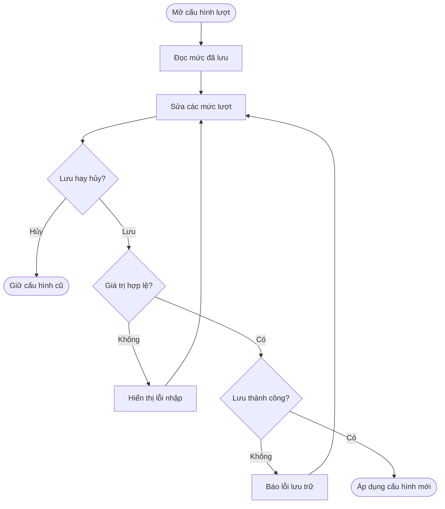
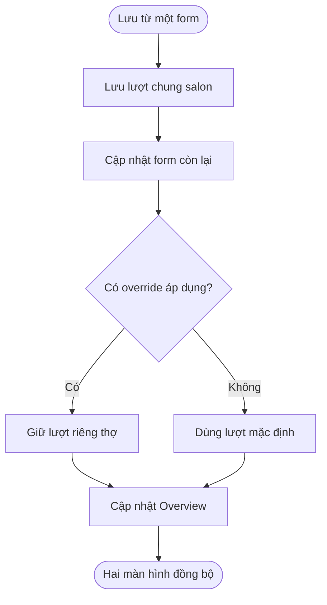
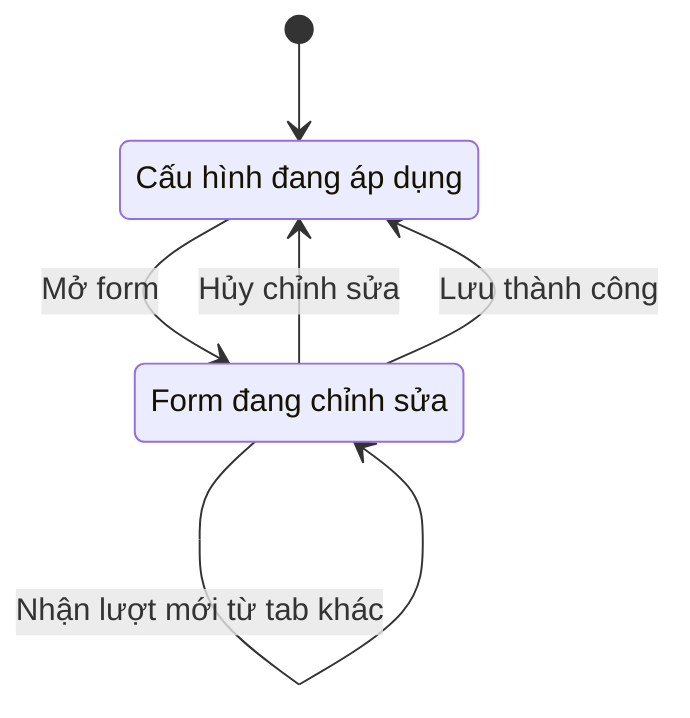

## Weighted Turn Settings

**Last Updated:** 2026-09-07

**Audience:** Chủ salon, Manager, Front Desk, Product Owner, BA, QA

**Status:** Draft

### Overview

**Weighted Turn Settings** cho phép người quản lý thiết lập số lượt quy đổi theo giá trị dịch vụ và lượt booking mặc định của salon tại **POS → Front Desk → Turn Board**. Cấu hình này dùng chung với **Booking Incentive Policy** trong Calendar, giúp hai màn hình sử dụng cùng giá trị đã lưu. Tài liệu mô tả hành vi hiện có của prototype; việc chia sẻ cấu hình chưa bao gồm sổ lượt chung hoặc tự động ghi lượt từ booking hoàn thành.

### Key Concepts

| Thuật ngữ | Ý nghĩa |
| :--- | :--- |
| Turn credit | Số lượt quy đổi, có thể là 0 hoặc số lẻ như 0.5, 1.25. Không phải tiền thưởng. |
| Service turn credit | Số lượt ứng với một khoảng giá trị dịch vụ. |
| Booking turn credit | Lượt mặc định của salon cho mỗi booking được tính lượt trong Calendar. |
| Weighted Turn Settings | Form chỉnh lượt booking mặc định và bốn mức lượt dịch vụ. |
| Booking Incentive Policy | Chính sách thưởng booking; có cùng cấu hình lượt chung và phần tùy chỉnh riêng theo thợ. |
| Technician override | Lượt booking riêng của thợ, được ưu tiên khi chính sách tùy chỉnh theo thợ đang áp dụng. |
| Add Turn | Thao tác thêm một lượt dịch vụ còn thiếu; gợi ý lượt theo mức dịch vụ đã lưu. |
| Lượt đã ghi | Lượt đã xuất hiện trên Turn Board; thay đổi cấu hình không tự tính lại các lượt này. |

### User Roles

| Role | Responsibilities in this Feature |
| :--- | :--- |
| Chủ salon / Manager | Thiết lập, kiểm tra và lưu mức lượt; quản lý cấu hình riêng của thợ qua Booking Incentive Policy. |
| Front Desk | Tham khảo cấu hình và sử dụng lượt gợi ý khi thêm lượt còn thiếu theo quy trình salon. |
| Thợ | Đối tượng được ghi nhận lượt; không có thao tác chỉnh cấu hình riêng trong phạm vi màn hình này. |

Đây là phân công nghiệp vụ dự kiến. Prototype hiện chưa kiểm soát quyền mở hoặc lưu cấu hình theo tài khoản.

### End-to-End Workflows

#### Workflow: Thiết lập và lưu cấu hình lượt

**Primary Actor:** Chủ salon / Manager

**Trigger:** Bấm Weighted Turn Settings trên Turn Board.

**Outcome:** Lưu bộ cấu hình lượt hợp lệ hoặc đóng form để giữ cấu hình trước đó.

**User Stories:**

- **US-01 — Xem cấu hình hiện tại:** **As a** Manager, **I want to** mở form và xem các mức lượt đang áp dụng, **so that** tôi có cơ sở kiểm tra trước khi thay đổi.
- **US-02 — Thiết lập lượt theo dịch vụ:** **As a** Chủ salon, **I want to** đặt số lượt cho từng khoảng giá trị dịch vụ, **so that** salon có thể quy đổi các dịch vụ thành lượt theo quy tắc đã thống nhất.
- **US-03 — Thiết lập lượt booking:** **As a** Chủ salon, **I want to** chỉnh booking turn credit mặc định ngay tại Turn Board, **so that** tôi có thể quản lý mức lượt chung mà không cần nhập lại ở Calendar.
- **US-04 — Lưu hoặc hủy chỉnh sửa:** **As a** Manager, **I want to** lưu các mức lượt sau khi kiểm tra hoặc hủy thay đổi, **so that** chỉ cấu hình tôi quyết định lưu mới được áp dụng.
- **US-05 — Xử lý dữ liệu và lỗi lưu:** **As a** Manager, **I want to** nhận thông báo khi giá trị không hợp lệ hoặc không thể lưu, **so that** tôi biết cần sửa gì và không nhầm rằng cấu hình mới đã được áp dụng.

**Acceptance Criteria — hiện có:**

1. Mở form đọc cấu hình đã lưu của salon. Nếu chưa có cấu hình hợp lệ, hiển thị bộ mặc định bên dưới.
2. Có một ô Booking turn credit và bốn ô Service turns. Các ngưỡng giá trị dịch vụ giữ cố định; không có thêm, xóa hoặc sửa khoảng.
3. Mọi ô lượt đều bắt buộc, chấp nhận số hữu hạn không âm, gồm cả 0 và số lẻ. Không yêu cầu mức lượt phải tăng dần theo giá trị dịch vụ; hiện chưa có giới hạn trên.
4. Save Rules kiểm tra và lưu toàn bộ năm giá trị cùng nhau. Thành công thì đóng modal và thông báo cấu hình đã chia sẻ với Booking Incentive Policy.
5. Ô trống, số âm hoặc số không hữu hạn khiến thao tác lưu bị từ chối. Form giữ mở, hiển thị thông báo lỗi và không ghi đè cấu hình cũ.
6. Không thể ghi vào bộ nhớ trình duyệt thì báo lỗi lưu trữ và giữ form mở. Người quản lý có thể thử lưu lại sau khi xử lý nguyên nhân.
7. Cancel, bấm nền ngoài modal hoặc Escape đóng form mà không lưu. Mở lại lấy giá trị đã lưu gần nhất.

**Bộ cấu hình mặc định:**

| Loại lượt / giá trị dịch vụ | Lượt mặc định |
| :--- | ---: |
| Booking turn credit | 0.5 |
| $0–29.99 | 0.5 |
| $30–69.99 | 1 |
| $70–109.99 | 1.5 |
| $110 trở lên | 2 |

| Step | Who | Action | System Response | Notes |
| :--- | :--- | :--- | :--- | :--- |
| 1 | Manager | Mở Weighted Turn Settings | Hiển thị cấu hình đã lưu | Dùng mặc định nếu chưa có dữ liệu hợp lệ. |
| 2 | Manager | Sửa các mức lượt | Giữ giá trị trong form | Chưa áp dụng thay đổi. |
| 3 | Manager | Bấm Save Rules | Kiểm tra tất cả các ô lượt | Giá trị không hợp lệ được báo lỗi. |
| 4 | Hệ thống | Lưu bộ cấu hình | Đóng form và thông báo thành công | Lỗi lưu trữ giữ form mở. |
| 5 | Manager | Hoặc đóng form trước khi lưu | Bỏ bản chỉnh sửa | Giữ cấu hình đã lưu gần nhất. |

#### Workflow: Đồng bộ với Booking Incentive Policy

**Primary Actor:** Chủ salon / Manager

**Trigger:** Lưu cấu hình từ Weighted Turn Settings hoặc Booking Incentive Policy.

**Outcome:** Hai màn hình đọc cùng cấu hình lượt chung và vẫn giữ lượt riêng của thợ khi override đang áp dụng.

**User Stories:**

- **US-06 — Đồng bộ hai chiều:** **As a** Manager, **I want to** lưu lượt ở một màn hình và thấy giá trị mới ở màn hình còn lại, **so that** tôi không phải duy trì hai bộ cấu hình giống nhau.
- **US-07 — Giữ cấu hình riêng của thợ:** **As a** Chủ salon, **I want to** thay đổi lượt mặc định mà không ghi đè lượt riêng đang áp dụng của thợ, **so that** các thỏa thuận riêng được giữ đúng.

**Acceptance Criteria — hiện có:**

1. Save Rules trên Turn Board và Save policy trên Calendar đều cập nhật cùng booking turn credit mặc định và bốn mức lượt dịch vụ.
2. Trong cùng trình duyệt, cùng địa chỉ ứng dụng và cùng salon, các tab đang mở nhận cập nhật cho các ô lượt chung. Mở lại hoặc tải lại trang cũng đọc các mức đã lưu.
3. Khi nhận cập nhật trong lúc đang chỉnh form, các ô lượt chung được thay bằng giá trị mới nhất. Các trường thưởng, Anyone assignment và override đang chỉnh trên Calendar được giữ nguyên.
4. Technician Overview cập nhật kết quả booking credit theo mặc định mới. Thợ có override đang áp dụng tiếp tục dùng lượt riêng; thay đổi lượt chung không đổi mức tiền thưởng.
5. Weighted Turn Settings có liên kết mở Booking Incentive Policy. Calendar có liên kết mở thẳng Weighted Turn Settings trên Turn Board.
6. Các liên kết chỉ điều hướng, không tự lưu các giá trị đang nhập. Người dùng cần bấm Save trước nếu muốn giữ thay đổi.

**Giới hạn:** Chỉ cấu hình lượt chung được giữ qua lần tải lại trang. Phần thưởng, Anyone assignment và override trong Calendar vẫn là dữ liệu trong phiên. Chưa đồng bộ qua máy khác, chưa có kiểm soát xung đột hoặc lịch sử phiên bản cấu hình chung; giá trị lưu sau cùng được áp dụng.

| Step | Who | Action | System Response | Notes |
| :--- | :--- | :--- | :--- | :--- |
| 1 | Manager | Sửa và lưu từ một form | Ghi cấu hình lượt chung của salon | Chỉ sau khi kiểm tra và lưu thành công. |
| 2 | Hệ thống | Phát hiện cấu hình mới | Cập nhật các ô lượt chung ở tab còn lại | Không thay trường thưởng hoặc override đang chỉnh. |
| 3 | Manager | Mở màn hình còn lại | Hiển thị mức lượt vừa lưu | Có liên kết giữa hai form. |
| 4 | Hệ thống | Cập nhật Overview | Áp dụng mặc định hoặc override tương ứng | Số liệu vẫn là mô phỏng. |

#### Workflow: Sử dụng mức lượt mới khi thêm lượt

**Primary Actor:** Manager / Front Desk

**Trigger:** Mở Add Turn sau khi lưu cấu hình dịch vụ.

**Outcome:** Lượt gợi ý dùng mức dịch vụ mới; lượt đã ghi không tự tính lại.

**User Stories:**

- **US-08 — Áp dụng cho lượt mới:** **As a** Front Desk, **I want to** Add Turn gợi ý đúng lượt theo cấu hình mới và giữ nguyên các lượt trước đó, **so that** tôi có thể bổ sung dịch vụ còn thiếu mà không thay đổi lịch sử lượt ngoài ý muốn.

**Acceptance Criteria — hiện có:**

1. Add Turn tìm khoảng giá trị tương ứng với Service amount đang nhập và điền lượt gợi ý theo cấu hình đã lưu.
2. Các mốc $30, $70 và $110 thuộc khoảng mới bắt đầu tại mốc đó. Với cấu hình mặc định: $29.99 → 0.5 lượt; $30 → 1; $70 → 1.5; $110 → 2.
3. Nếu mức $30–69.99 được đổi thành 1.25, dịch vụ $45 gợi ý 1.25 lượt. Thêm lượt cho thợ đang có 4 lượt sẽ thành 5.25 khi dùng đúng mức gợi ý.
4. Nếu cấu hình được lưu từ tab khác khi Add Turn đang mở, phần gợi ý được tính lại theo số tiền đang nhập. Ô Turn credit vẫn có thể được người dùng sửa trước khi thêm.
5. Add Turn yêu cầu Service amount lớn hơn 0, lý do bổ sung và lượt hữu hạn không âm. Một khoảng cấu hình có thể bằng 0 dù số tiền dịch vụ phải lớn hơn 0.
6. Đổi cấu hình không tự sửa tổng lượt hoặc các ô lượt đã ghi trên Turn Grid, kể cả sau khi bảng được dựng lại.

**Giới hạn:** Thao tác Assign Guest vẫn dùng quy tắc cộng lượt riêng của prototype. Chưa tự tính lượt theo giá trị checkout, chưa ghi lượt khi booking hoàn thành, chưa có sổ lượt chung giữa Calendar và Turn Board. Add Turn và lịch sử thao tác trên Turn Board hiện chỉ tồn tại trong phiên.

| Step | Who | Action | System Response | Notes |
| :--- | :--- | :--- | :--- | :--- |
| 1 | Front Desk | Mở Add Turn cho thợ | Điền lượt gợi ý theo số tiền hiện tại | Dùng cấu hình dịch vụ đã lưu. |
| 2 | Front Desk | Nhập Service amount | Tính lại lượt theo khoảng giá trị | Có thể sửa lượt trước khi xác nhận. |
| 3 | Manager / Front Desk | Nhập lý do và xác nhận | Thêm lượt và cập nhật tổng lượt trong phiên | Không thay các lượt trước đó. |

### System Configuration & Administration

**US-09 — Giữ cấu hình theo salon:** **As a** Chủ salon, **I want to** cấu hình lượt của salon được giữ sau khi tải lại trang, **so that** những lần thao tác tiếp theo không phải nhập lại mức lượt.

- Cấu hình chung được lưu theo salon trong bộ nhớ trình duyệt. Đây chưa phải cấu hình được lưu trên máy chủ theo tài khoản đăng nhập.
- Không có nút Reset mặc định, ngày hiệu lực, lịch áp dụng hoặc phê duyệt cấu hình tại Weighted Turn Settings.
- Nếu chưa có dữ liệu, dữ liệu bị hỏng hoặc không đọc được lưu trữ, hệ thống dùng bộ mặc định. Nếu không thể ghi lưu trữ, thao tác Save báo thất bại.
- Phần thưởng tiền và override của từng thợ được chỉnh trong Booking Incentive Policy, không có trường tương ứng trong modal Turn Board.

### State Lifecycle

Đây là vòng đời chỉnh sửa form, không phải các trạng thái phát hành hay phê duyệt một chính sách.

| Current Status | Trigger | New Status | Notes |
| :--- | :--- | :--- | :--- |
| Đang áp dụng cấu hình | Mở form | Đang chỉnh sửa | Lấy giá trị đã lưu gần nhất. |
| Đang chỉnh sửa | Cancel / đóng form | Đang áp dụng cấu hình | Bỏ thay đổi chưa lưu. |
| Đang chỉnh sửa | Save không hợp lệ hoặc lỗi lưu trữ | Đang chỉnh sửa | Giữ form mở và báo lỗi. |
| Đang chỉnh sửa | Save thành công | Đang áp dụng cấu hình mới | Đồng bộ các màn hình cùng trình duyệt. |
| Đang chỉnh sửa | Tab khác lưu cấu hình | Đang chỉnh sửa | Các ô lượt chung nhận giá trị mới nhất. |

### Business Rules

- **Hai loại lượt riêng:** Booking turn credit dùng cho booking trong Calendar; Service turn credit dùng để gợi ý lượt dịch vụ tại Add Turn. Chia sẻ cấu hình không có nghĩa tự cộng cả hai cho cùng booking.
- **Cơ sở giá trị dịch vụ:** Giao diện mô tả giá trị sau giảm giá, loại trừ tip, thuế, sản phẩm và thanh toán gift card. Prototype nhận Service amount nhập tay, chưa tự bóc tách các khoản này từ giao dịch hoặc xử lý quy tắc gift card ở checkout.
- **Áp dụng cấu hình:** Mức mới được dùng ngay sau khi lưu thành công; Weighted Turn Settings không có lịch hiệu lực riêng.
- **Giữ lượt đã ghi:** Lưu cấu hình không phải thao tác sửa lượt của thợ. Việc điều chỉnh lượt đã ghi sử dụng thao tác khác trên Turn Board.
- **Ưu tiên override:** Lượt booking riêng chỉ ưu tiên khi chế độ tùy chỉnh theo thợ và override tương ứng đang áp dụng trong Calendar.
- **Phạm vi tiền:** Cấu hình lượt không thực hiện thu tiền, payout hoặc thay mức thưởng booking.

### Edge Cases & Exception Handling

| Scenario | What Happens | Who Resolves It |
| :--- | :--- | :--- |
| Một ô lượt bị bỏ trống, âm hoặc không hữu hạn | Không lưu; form báo lỗi | Người quản lý sửa giá trị. |
| Mức lượt bằng 0 | Hợp lệ; lượt gợi ý của khoảng đó bằng 0 | Người quản lý xác nhận cấu hình phù hợp. |
| Mức lượt không tăng theo giá trị dịch vụ hoặc rất lớn | Hiện vẫn hợp lệ nếu hữu hạn và không âm | Chủ salon quyết định mức phù hợp; giới hạn nghiệp vụ chưa có. |
| Không thể ghi lưu trữ | Giữ form mở, báo lỗi; không thông báo lưu thành công | Người quản lý kiểm tra trình duyệt rồi thử lại. |
| Dữ liệu đã lưu bị hỏng hoặc bị xóa | Quay về bộ mặc định | Người quản lý kiểm tra và lưu lại nếu cần. |
| Hai tab cùng chỉnh sửa | Mức được lưu mới nhất thay các ô lượt chung; chưa có cảnh báo xung đột | Người quản lý kiểm tra trước khi lưu. |
| Bấm liên kết sang màn hình khác khi chưa lưu | Điều hướng không lưu bản chỉnh sửa | Người quản lý lưu trước nếu muốn giữ thay đổi. |
| Mở từ trình duyệt, thiết bị hoặc địa chỉ ứng dụng khác | Không đọc được bộ cấu hình của phiên trình duyệt cũ | Cần tích hợp máy chủ để đồng bộ rộng hơn. |
| Tải lại sau khi ghi thêm lượt | Cấu hình chung còn; các lượt bổ sung trong phiên không được lưu bền vững | Cần sổ lượt và lưu trữ giao dịch thực tế. |

### Frequently Asked Questions

**Q: Có thể chỉnh booking turn credit ngay trong Weighted Turn Settings không?**

A: Có. Đây là cùng giá trị mặc định với Booking Incentive Policy. Lượt riêng của từng thợ được chỉnh trong policy.

**Q: Có thể đổi ngưỡng $30, $70 hoặc $110 không?**

A: Chưa. Hiện chỉ chỉnh số lượt ứng với bốn khoảng cố định.

**Q: Lưu mức lượt mới có làm thay đổi lượt cũ hoặc thứ tự thợ ngay không?**

A: Không tự sửa các lượt đã ghi và không tự đổi thứ tự Turn Board. Mức dịch vụ mới được dùng cho gợi ý Add Turn; Calendar cập nhật số liệu booking credit mô phỏng theo cấu hình tương ứng.

**Q: Booking hoàn thành đã tự cộng lượt vào Turn Board chưa?**

A: Chưa. Hai màn hình hiện chia sẻ cấu hình lượt; luồng ghi lượt từ booking thực tế chưa được kết nối.

**Q: Đã có đồng bộ qua máy khác hoặc lịch sử thay đổi cấu hình chưa?**

A: Chưa. Cấu hình chung lưu trong trình duyệt theo salon, chưa có máy chủ hoặc lịch sử phiên bản riêng.

### Related Features

- [Booking Incentive Policy](booking-incentive-policy.md)
- [Technician Overview](technician-overview.md)
- [Appointments Need Assignment](appointments-need-assignment.md)
- [Weighted Turn Settings — Turn Board](../../html/pages/pos-front-desk-turn-board.html?settings=weighted-turns)
- [Booking Incentive Policy — Calendar](../../html/pages/pos-front-desk.html?tab=appointments&view=calendar&settings=booking-incentive)
