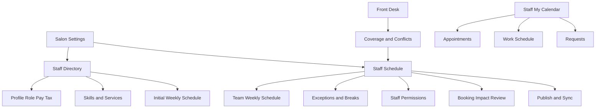
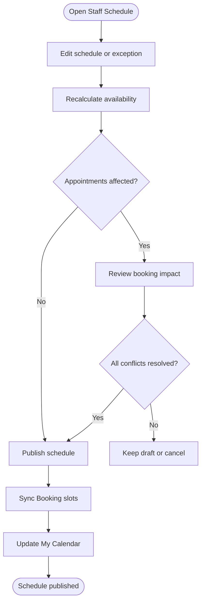
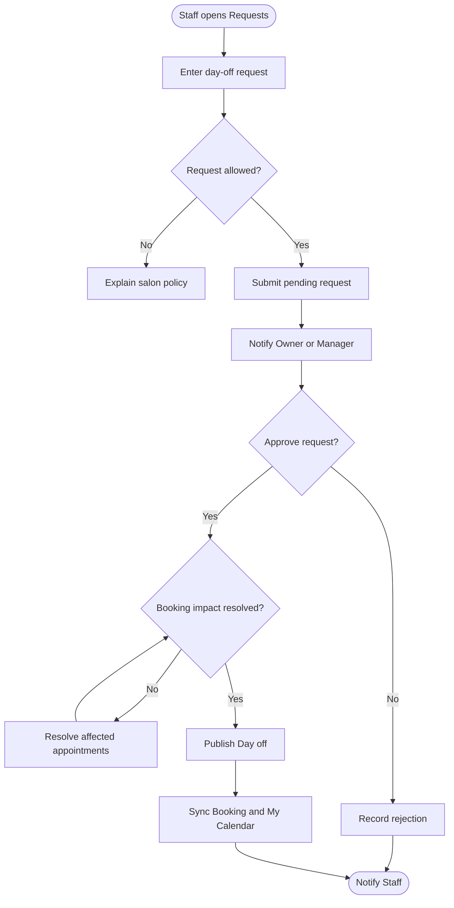
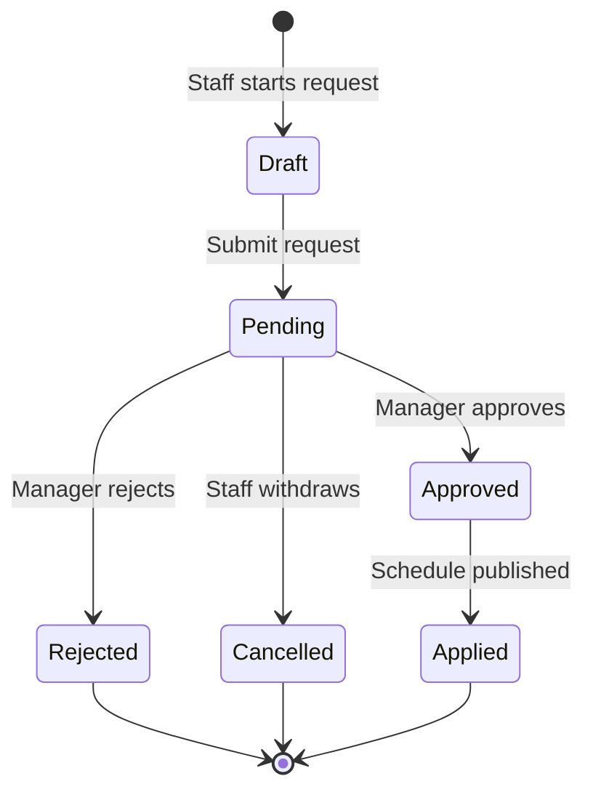

# Thiết kế Staff Schedule & Booking Availability

**Last Updated:** 2026-09-28

**Audience:** Product Owner, Business Analyst, Owner/Manager, Staff, QA, Developer

**Status:** Review

## Tổng quan

Staff Schedule & Booking Availability nhằm giúp salon quản lý lịch làm việc của thợ và chỉ mở các khung giờ Booking thực sự có thể phục vụ. Owner/Manager cấu hình lịch, kỹ năng, ngoại lệ và quyền thay đổi lịch trong Salon Settings; Front Desk chỉ theo dõi tình trạng vận hành và conflict; Staff xem lịch cá nhân, appointment và gửi yêu cầu nghỉ trong My Calendar.

Thiết kế nâng cấp ba bề mặt hiện có thay vì tạo thêm một sản phẩm độc lập:

- `pos-salon-settings.html`: nguồn quản trị lịch và availability của salon.
- `pos-front-desk.html`: tình trạng vận hành, cảnh báo conflict và đường dẫn sang phần quản trị.
- `pos-calendar.html`: lịch cá nhân của Staff.

## Khái niệm chính

| Thuật ngữ | Định nghĩa |
| :--- | :--- |
| Weekly Schedule | Lịch làm việc mặc định lặp lại theo tuần của một Staff tại một salon. |
| Schedule Exception | Thay đổi cho một ngày cụ thể, gồm Day off, custom hours hoặc break. |
| Booking Availability | Các khung giờ khách có thể đặt sau khi áp dụng đầy đủ giờ mở cửa, lịch thợ, kỹ năng, break và appointment hiện có. |
| Booking Impact | Appointment hiện có trở nên xung đột do thay đổi lịch Staff. |
| Day-off Request | Yêu cầu nghỉ do Staff gửi và chờ Owner/Manager xử lý. |
| Published Schedule | Phiên bản lịch đã được lưu và đồng bộ sang Booking và My Calendar. |

## Vai trò người dùng

| Vai trò | Trách nhiệm |
| :--- | :--- |
| Owner | Cấu hình lịch, kỹ năng, quyền thay đổi availability; duyệt yêu cầu; xử lý Booking Impact; publish lịch. |
| Manager | Thực hiện các thao tác quản trị được Owner cấp quyền, gồm chỉnh lịch và duyệt yêu cầu. |
| Front Desk | Xem coverage, break và conflict phục vụ vận hành; mở Salon Settings khi cần chỉnh lịch. |
| Staff | Xem appointment và lịch cá nhân; gửi Day-off Request hoặc yêu cầu thay đổi giờ khi được phép. |

## Kiến trúc thông tin



### Salon Settings

Thêm tab `Staff Schedule` tại `pos-salon-settings.html?section=staff-schedule`, đứng cạnh tab `Staff` hiện có.

Tab `Staff` tiếp tục quản lý hồ sơ, role, pay, tax, kỹ năng/dịch vụ và Weekly Schedule ban đầu. Sau khi tạo hoặc sửa Staff, hành động `Open full schedule` mở tab Staff Schedule và chọn đúng Staff.

Tab `Staff Schedule` gồm:

1. Header với salon selector, tuần đang xem, trạng thái đồng bộ và số thay đổi chưa lưu.
2. Summary về số Staff làm/nghỉ, open slots và coverage risk.
3. Lịch tuần toàn đội, mỗi ô ngày hiển thị giờ làm, break, appointment, open slot và conflict.
4. Drawer chỉnh lịch một Staff: Weekly Schedule, ngoại lệ theo ngày, kỹ năng, quyền thay đổi availability và quy tắc bảo vệ booking.
5. Booking Impact Review xuất hiện trước khi publish nếu thay đổi gây xung đột.
6. Các hành động `Save draft`, `Publish & Sync Booking` và `Discard changes`.

### Front Desk

Front Desk không sở hữu form quản trị lịch. Appointment Calendar chỉ bổ sung:

- vùng unavailable và break theo Staff;
- coverage summary theo ngày;
- badge số schedule conflict;
- cảnh báo khi tạo appointment ngoài availability;
- liên kết `Manage staff schedule` sang Salon Settings;
- liên kết `Edit availability` từ Staff đang được chọn.

### Staff My Calendar

Nâng cấp `pos-calendar.html` và giữ nguyên menu `My Calendar`. Màn hình gồm salon selector, bộ chọn ngày/tuần và ba tab:

- `Appointments`: appointment được giao cho Staff.
- `Work Schedule`: giờ bắt đầu, giờ kết thúc, break và open slot do salon công bố.
- `Requests`: gửi và theo dõi Day-off Request hoặc yêu cầu thay đổi giờ.

Day view dùng một timeline thống nhất cho Work starts, appointment, break, open slot và Work ends. Màn hình luôn cho biết trạng thái đồng bộ với Booking và không hiển thị lịch của Staff khác.

## Quy tắc tính Booking Availability

Một slot chỉ bookable khi đồng thời thỏa mãn:

```text
Salon Hours
∩ Published Staff Schedule
∩ Eligible Services
− Schedule Exceptions
− Breaks
− Existing Appointments
= Booking Availability
```

- Weekly Schedule là mặc định; Schedule Exception của ngày cụ thể được ưu tiên hơn.
- Day off loại toàn bộ availability của Staff trong ngày.
- Staff chỉ xuất hiện cho các dịch vụ đã được salon gán.
- Thay đổi chưa publish không làm thay đổi Booking hoặc My Calendar.
- Appointment hiện có không được tự động hủy, đổi giờ hoặc đổi Staff khi lịch thay đổi.
- Owner/Manager phải xử lý hoặc chấp nhận ngoại lệ cho từng Booking Impact trước khi publish.

## Workflow: Owner/Manager thay đổi lịch Staff

**Primary Actor:** Owner/Manager

**Trigger:** Người quản lý chỉnh Weekly Schedule hoặc Schedule Exception.

**Outcome:** Lịch hợp lệ được publish sang Booking và My Calendar.

| Bước | Người thực hiện | Hành động | Phản hồi hệ thống | Ghi chú |
| :--- | :--- | :--- | :--- | :--- |
| 1 | Owner/Manager | Mở Staff Schedule và chọn Staff/ngày | Hiển thị lịch hiện tại, break, appointment và open slot | Theo salon đang chọn |
| 2 | Owner/Manager | Thay đổi giờ, break hoặc Day off | Đánh dấu thay đổi chưa lưu và tính lại availability dự kiến | Chưa ảnh hưởng Booking |
| 3 | Hệ thống | Kiểm tra appointment hiện có | Hiển thị Booking Impact Review nếu có conflict | Không tự động sửa appointment |
| 4 | Owner/Manager | Xử lý từng conflict | Giữ ngoại lệ, đổi Staff, dời appointment hoặc hủy thay đổi lịch | Hành động prototype có thể mô phỏng cục bộ |
| 5 | Owner/Manager | Chọn Publish & Sync Booking | Lưu lịch, tính lại open slots và cập nhật My Calendar | Ghi nhận người và thời gian publish |



## Workflow: Staff gửi yêu cầu nghỉ

**Primary Actor:** Staff

**Trigger:** Staff chọn `Request day off` trong My Calendar.

**Outcome:** Yêu cầu được Owner/Manager duyệt hoặc từ chối; lịch chỉ thay đổi sau khi được duyệt.

| Bước | Người thực hiện | Hành động | Phản hồi hệ thống | Ghi chú |
| :--- | :--- | :--- | :--- | :--- |
| 1 | Staff | Chọn salon, ngày và lý do nghỉ | Kiểm tra quyền gửi yêu cầu | Staff không trực tiếp sửa Published Schedule |
| 2 | Staff | Gửi yêu cầu | Tạo yêu cầu trạng thái Pending | Hiển thị trong My Calendar và Salon Settings |
| 3 | Hệ thống | Kiểm tra Booking Impact | Hiển thị appointment bị ảnh hưởng cho người duyệt | Không tiết lộ lịch Staff khác cho người gửi |
| 4 | Owner/Manager | Approve hoặc Reject | Ghi nhận quyết định và thông báo cho Staff | Approve bị chặn nếu conflict chưa được xử lý |
| 5 | Hệ thống | Publish Day off đã duyệt | Cập nhật Booking Availability và My Calendar | Reject không thay đổi lịch |



## Vòng đời Day-off Request

| Trạng thái hiện tại | Trigger | Trạng thái mới | Ghi chú |
| :--- | :--- | :--- | :--- |
| Draft | Staff gửi yêu cầu | Pending | Yêu cầu bắt đầu chờ duyệt |
| Pending | Owner/Manager duyệt và conflict đã xử lý | Approved | Tạo Schedule Exception Day off |
| Pending | Owner/Manager từ chối | Rejected | Không thay đổi lịch |
| Pending | Staff rút yêu cầu trước khi xử lý | Cancelled | Không thay đổi lịch |
| Approved | Ngày nghỉ được publish | Applied | Booking và My Calendar đã đồng bộ |



## Quyền thay đổi availability

Salon cấu hình một trong các chính sách cho Staff:

| Chính sách | Hành vi |
| :--- | :--- |
| Not allowed | Staff chỉ xem lịch; các hành động yêu cầu bị ẩn hoặc disabled kèm giải thích. |
| Request approval | Staff gửi yêu cầu; Owner/Manager phải duyệt trước khi lịch thay đổi. Đây là mặc định. |
| Same-day self-service | Staff được bật/tắt availability hoặc tạo break trong ngày theo giới hạn salon; vẫn bị chặn nếu có appointment bị ảnh hưởng. |

Yêu cầu cho ngày tương lai mặc định luôn cần duyệt. Prototype không hỗ trợ Staff tự động đổi lịch đã publish khi có appointment.

## Trạng thái lỗi và ngoại lệ

| Tình huống | Hành vi |
| :--- | :--- |
| Lịch nằm ngoài giờ salon | Không cho publish và chỉ rõ ngày/giờ cần sửa. |
| Giờ kết thúc không sau giờ bắt đầu | Hiển thị validation tại field, không cập nhật draft. |
| Break nằm ngoài ca hoặc chồng nhau | Không cho publish cho đến khi sửa. |
| Thay đổi gây conflict appointment | Mở Booking Impact Review; không tự động hủy appointment. |
| Đồng bộ Booking thất bại | Giữ Published Schedule gần nhất, hiển thị Sync failed và cho retry. |
| Staff làm nhiều salon | Dữ liệu và request luôn gắn với salon đang chọn. |
| Staff không còn kỹ năng của appointment | Đánh dấu conflict kỹ năng và yêu cầu reassign trước khi publish. |

## Phạm vi mã nguồn dự kiến

- `html/pages/pos-salon-settings.html`: tab/panel Staff Schedule và các điểm liên kết từ Staff.
- `html/assets/pos-salon-settings.js`: điều hướng tab hiện có, mở đúng Staff và đồng bộ roster.
- `html/assets/pos-salon-settings.css`: style tích hợp với Salon Settings.
- `html/assets/staff-schedule-store.js`: nguồn dữ liệu dùng chung cho lịch, request, draft/publish và subscription giữa các tab trình duyệt.
- `html/assets/staff-schedule-settings.js`: render và tương tác của màn hình quản trị.
- `html/pages/pos-front-desk.html` và asset liên quan: coverage/conflict indicator và đường dẫn quản trị.
- `html/pages/pos-calendar.html`: My Calendar nâng cấp cho Staff.
- `tests/html/pages/`: test contract và hành vi theo cấu trúc test của dự án.

Các asset mới phải tách khỏi HTML lớn để tránh tiếp tục tăng kích thước `pos-salon-settings.html`. Dữ liệu appointment tiếp tục dùng appointment store hiện có; không tạo appointment model thứ hai.

## Kiểm thử và tiêu chí chấp nhận

- Owner/Manager mở được `?section=staff-schedule` và điều hướng tab không làm hỏng các section Salon Settings hiện có.
- Weekly Schedule, exception và break được hiển thị nhất quán trong Salon Settings, Front Desk và My Calendar.
- Service eligibility và availability được tính theo cùng một nguồn dữ liệu.
- Publish bị chặn khi có dữ liệu không hợp lệ hoặc Booking Impact chưa xử lý.
- Staff chỉ thấy dữ liệu cá nhân tại salon được chọn.
- Staff gửi được Day-off Request; request không thay đổi lịch trước khi Approved và Applied.
- Request bị Reject hoặc Cancelled không thay đổi Booking Availability.
- Các select/dropdown tuân thủ Form Controls: arrow cách mép phải 16px, icon rộng 16px, padding phải tối thiểu 44px trên mọi breakpoint.
- Giao diện hoạt động trên desktop, tablet và mobile; keyboard focus và aria state được duy trì.
- Toàn bộ test JavaScript mới nằm dưới `tests/` và `npm test` đạt.

## Ngoài phạm vi

- Backend/API thật, push notification hoặc đồng bộ đa thiết bị ngoài cơ chế prototype hiện có.
- Tự động gọi/SMS khách khi appointment cần dời.
- Tự động phân công lại Staff bằng thuật toán production.
- Promotion readiness, ad-spend suggestion và Staff App Preview từ prototype tổng hợp.
- Thay đổi payroll, time clock hoặc turn calculation.
