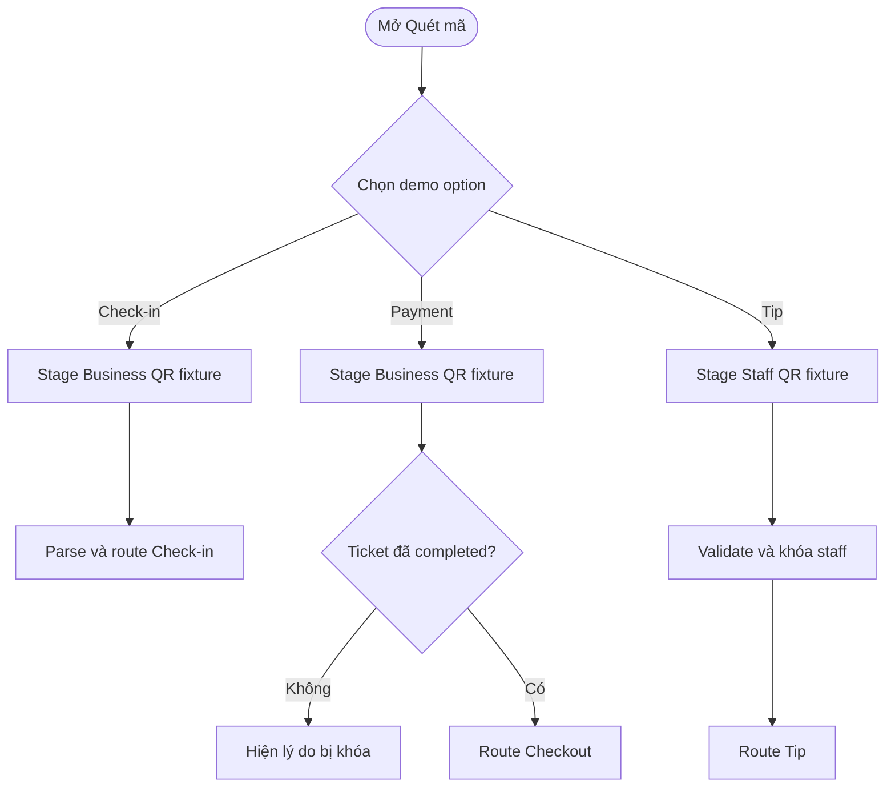
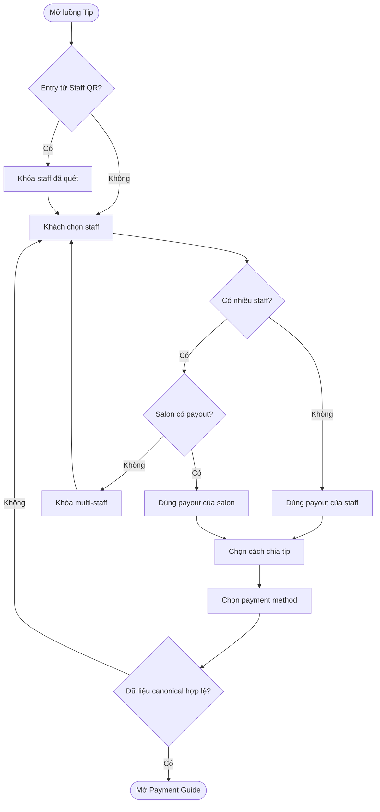
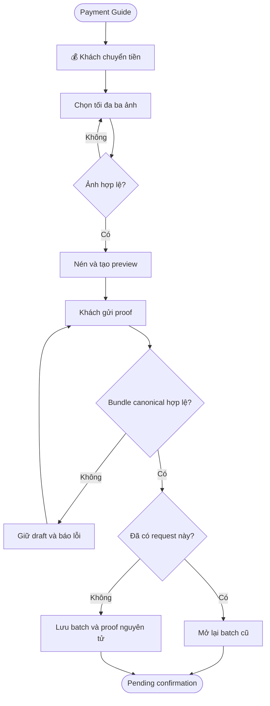
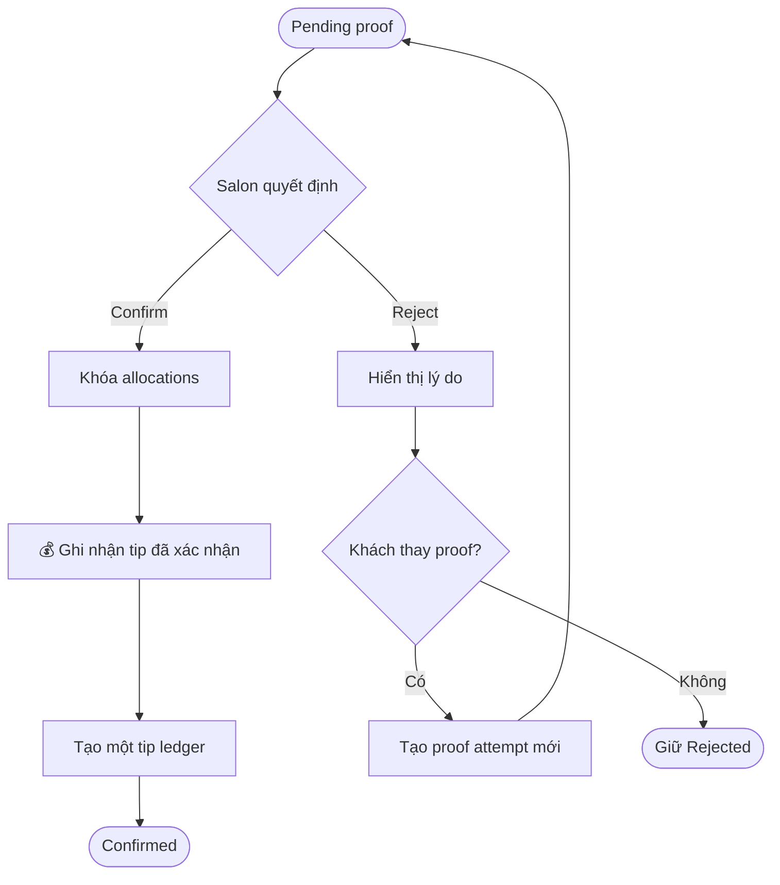
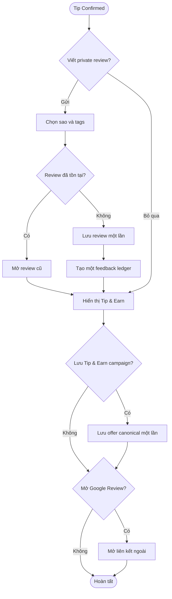
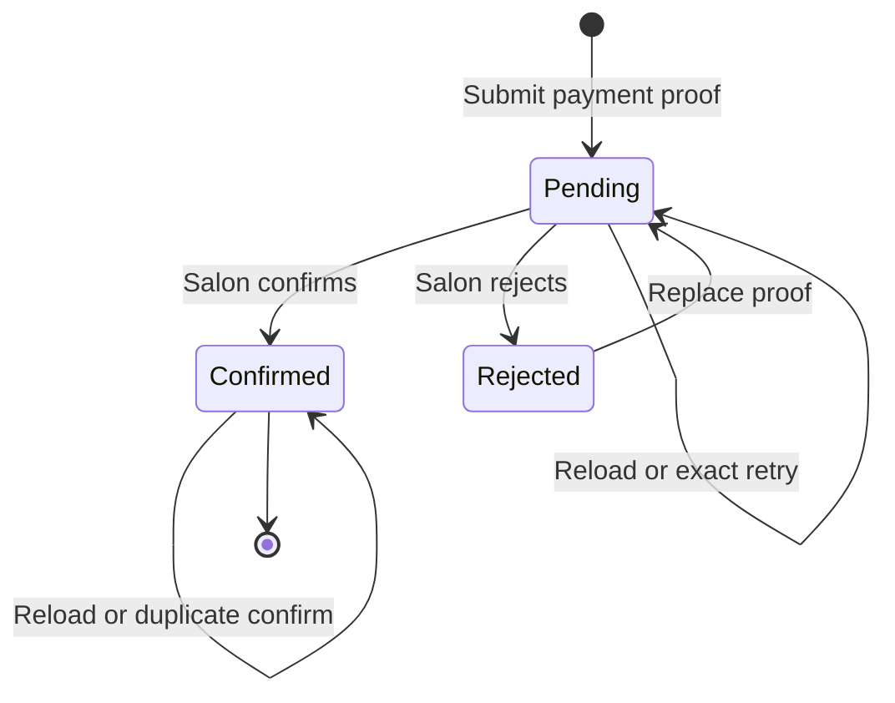
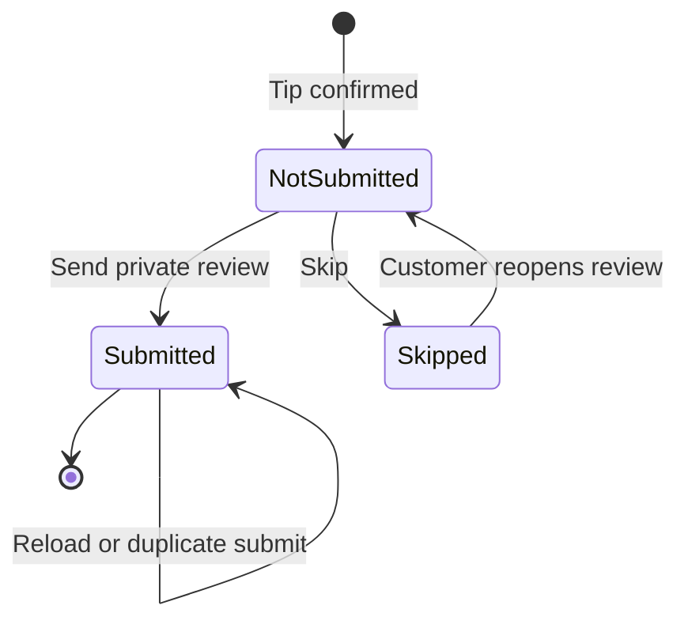
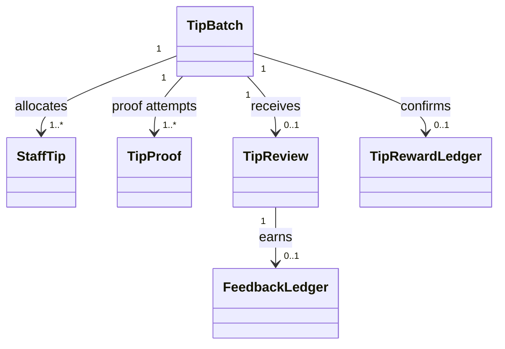

## Customer Tip Batch, Payment Proof & Review

**Last Updated:** 2026-07-16

**Audience:** Customer, Staff, Salon Front Desk, Product Owner, QA, Support

**Status:** Review

**Phạm vi prototype:** `html/customer/cutomer-reward.html` và test tương ứng

**Tham chiếu UX:** `html/tip-flow/select-staff.html`, `tip.html`, `tip-guide.html`, `review.html`

---

### Overview

> Tính năng mở rộng luồng Tip hiện có thành một quy trình đầy đủ: khách chọn một hoặc nhiều staff cùng salon, chia tiền tip, chọn phương thức, xem hướng dẫn chuyển tiền, gửi tối đa ba ảnh proof, chờ salon xác nhận và gửi private review. Prototype tái sử dụng ba screen `tip`, `tipdone`, `review`, vì vậy tổng số screen ID vẫn là **31**.

Tài liệu này là thiết kế V2, mở rộng thiết kế QR V1 tại `customer-qr-payment-tip-design.md`. Các contract QR canonical, ticket completion gate và tip lifecycle an toàn của V1 tiếp tục được giữ; V2 bổ sung multi-staff, payout routing, proof, batch idempotency và review gắn với batch. Phần standalone tip V2 này **supersede** quyết định “một staff, chưa có proof/review” trong mục ngoài phạm vi của V1; lịch sử tài liệu/plan V1 không bị sửa ngược.

---

### Key Concepts

| Term | Definition |
| :--- | :--- |
| Tip Batch | Giao dịch tip cha đại diện cho một lần khách gửi tiền, có một salon, một payment method và một hoặc nhiều người nhận. |
| Staff Tip | Phần phân bổ tip của từng staff trong một Tip Batch. Tổng các Staff Tip luôn bằng tổng Tip Batch. |
| Split Mode | Cách chia tiền: **Chia đều** từ một tổng tiền hoặc **Tip riêng** bằng số tiền nhập cho từng staff. |
| Payout Owner | Chủ tài khoản nhận tiền. Một staff thì Staff là owner; nhiều staff thì Salon là owner. |
| Payment Proof | Một lần khách xác nhận đã chuyển tiền, gồm ghi chú và 0–3 ảnh đã nén. |
| Private Review | Đánh giá trong NEXORA gồm số sao, experience tags và ghi chú; mỗi Tip Batch chỉ gửi thành công một lần. |
| Tip & Earn | Card tổng kết sau xác nhận. Card hiển thị reward ledger hiện có và optional salon campaign canonical; render card không tự cộng điểm hoặc tạo promo trùng. |
| Locked Staff | Staff có trong Staff QR vừa quét. Staff này bắt buộc luôn nằm trong danh sách nhận tip. |
| Canonical Catalog | Danh mục salon, staff, payment method và payout account tin cậy; form hoặc query string không được làm transaction authority. |

---

### User Roles

| Role | Responsibilities in this Feature |
| :--- | :--- |
| Customer | Quét QR hoặc mở Tip từ app, chọn staff, nhập tiền, chuyển tiền ngoài NEXORA, gửi proof và private review. |
| Staff | Là người nhận một phần hoặc toàn bộ tip; có payout account riêng khi là người nhận duy nhất. |
| Salon Front Desk | Xác nhận hoặc từ chối payment proof và bảo đảm phân bổ tip được ghi đúng cho từng staff. |
| Salon Owner/Admin | Cấu hình salon payout account và payment methods dùng cho multi-staff. |
| NEXORA Prototype | Validate canonical data, giữ lifecycle/idempotency, lưu localStorage và chỉ cộng reward sau xác nhận. NEXORA không giữ tiền. |

---

### Current-State Gap

Prototype Customer hiện đã có QR Staff, tip một staff, trạng thái `pending → confirmed`, private review, Google Review tùy chọn và reward ledger. Prototype còn thiếu các phần sau:

- chọn nhiều staff và tìm kiếm staff theo đúng salon;
- chia đều hoặc nhập tiền riêng;
- chuyển payout owner từ Staff sang Salon khi có nhiều người nhận;
- payment guide, copy payout information và tối đa ba ảnh proof;
- Tip Batch cha, các Staff Tip con và Payment Proof theo attempt;
- payout account catalog thật; hiện business/staff mới chủ yếu có danh sách method;
- rejected/resubmit cùng batch;
- review gắn với Tip Batch và card Tip & Earn không cộng reward trùng;
- reload/double-submit/corrupt-storage guard cho toàn bundle multi-staff.

Các file trong `html/tip-flow` cung cấp tham chiếu UI tốt nhưng đang truyền staff, amount và split mode qua query string, hardcode payout account và không có transaction authority. V2 chỉ tái sử dụng bố cục/trải nghiệm, không sao chép cơ chế dữ liệu đó.

---

### End-to-End Workflows

#### Workflow: Mô phỏng QR entry

**Primary Actor:** Customer

**Trigger:** Mở screen `scan`

**Outcome:** Khách chọn một trong ba demo entry và hệ thống đi qua đúng QR parser/router canonical.

**User Stories:**

- As a Customer testing the prototype, I want three clear Check-in, Payment and Tip options, so that I can enter each QR journey without a physical camera.

| Step | Who | Action | System Response | Notes |
| :--- | :--- | :--- | :--- | :--- |
| 1 | Customer | Mở Quét mã | Hiển thị camera simulation và đúng ba option: Check-in, Payment, Tip | Mobile stack; desktop có thể dùng grid 3 cột |
| 2A | Customer | Chọn Check-in | Stage Business QR fixture rồi chạy parser/router check-in hiện có | Không gọi thẳng screen check-in |
| 2B | Customer | Chọn Payment | Stage Business QR fixture rồi chạy completed-ticket candidate gate | Chưa completed thì hiện lý do, không mở checkout |
| 2C | Customer | Chọn Tip | Stage Staff QR fixture rồi chạy Staff QR validation và khóa scanned staff | Không gán staff trực tiếp từ button data |
| 3 | System | Resolve QR context | Chỉ route khi payload và canonical catalog hợp lệ | Giữ camera thật ngoài scope prototype |

#### Workflow: Chọn staff và phân bổ tip

**Primary Actor:** Customer

**Trigger:** Quét Staff QR, Business QR hoặc mở Tip từ menu/business profile

**Outcome:** Có Tip Batch draft hợp lệ với recipients, allocations, payment method và payout owner canonical.

**User Stories:**

- As a Customer, I want to tip one or more staff from the same salon, so that everyone who served me can receive the intended amount.
- As a Customer scanning a Staff QR, I want that staff to remain selected, so that I cannot accidentally send the tip to the wrong person.
- As a Customer, I want to split equally or enter individual amounts, so that the allocation matches my intent.

| Step | Who | Action | System Response | Notes |
| :--- | :--- | :--- | :--- | :--- |
| 1 | Customer | Mở Tip từ QR hoặc menu | Resolve exact salon context; Staff QR preselects and locks scanned staff | Không lấy staff/amount/account từ query string |
| 2 | Customer | Tìm và chọn staff cards | Chỉ hiển thị active, tip-eligible staff thuộc cùng salon | Card dùng `aria-pressed`; có selected state rõ ràng |
| 3 | System | Kiểm tra số người nhận | Một staff dùng Staff payout; từ hai staff dùng Salon payout | Không có Salon payout thì khóa chọn staff thứ hai |
| 4 | Customer | Chọn Chia đều hoặc Tip riêng | Chia đều nhận tổng tiền; Tip riêng nhận số tiền từng staff | Mọi giá trị là integer cents |
| 5 | Customer | Chọn payment method | Chỉ hiển thị method của đúng payout owner | Đổi recipients có thể làm method cũ mất hiệu lực |
| 6 | System | Validate draft | Re-resolve salon, staff, owner, account, method và allocations từ catalog canonical | Draft hợp lệ mới được sang Payment Guide |

#### Workflow: Chuyển tiền và gửi Payment Proof

**Primary Actor:** Customer

**Trigger:** Tip draft đã được validate

**Outcome:** Một Tip Batch duy nhất ở trạng thái chờ Salon xác nhận.

**User Stories:**

- As a Customer, I want clear payout instructions and a copy button, so that I can transfer to the correct account.
- As a Customer, I want to upload up to three screenshots, so that the salon has enough evidence to verify payment.
- As a Customer retrying after reload, I want to resume the same transaction, so that duplicate Tip Batches are not created.

| Step | Who | Action | System Response | Notes |
| :--- | :--- | :--- | :--- | :--- |
| 1 | System | Render Payment Guide | Hiển thị amount, method, masked account và payout owner canonical | Account reference không lấy từ form/query |
| 2 | Customer | Sao chép payout information | Copy đúng nội dung đang render và báo thành công/thất bại | Có fallback khi Clipboard API không khả dụng |
| 3 | Customer | Chụp/chọn ảnh nếu có | Validate type/size, normalize orientation, compress và preview | Ảnh optional, tối đa 3 ảnh |
| 4 | Customer | Xóa hoặc thay ảnh | Cập nhật draft proof, giải phóng object URL/data | Không mutate Tip Batch đã submit |
| 5 | Customer | Gửi xác nhận | Revalidate toàn bundle và persist Tip Batch + Staff Tips + Tip Proof atomically | 💰 Tiền đã được chuyển ngoài NEXORA; NEXORA chỉ ghi nhận proof |
| 6 | System | Hoàn tất commit | Mở `tipdone` ở trạng thái Pending | Pending chưa cộng điểm |

#### Workflow: Salon xác nhận, từ chối và retry

**Primary Actor:** Salon Front Desk

**Trigger:** Tip Batch có Payment Proof đang chờ

**Outcome:** Batch được xác nhận một lần hoặc khách thay proof trên chính batch cũ.

**User Stories:**

- As a Front Desk user, I want to confirm a valid proof, so that staff allocations and rewards become final.
- As a Customer, I want a rejected proof to show a reason and allow replacement, so that I can correct the evidence without creating another transaction.

| Step | Who | Action | System Response | Notes |
| :--- | :--- | :--- | :--- | :--- |
| 1 | Front Desk | Mở pending proof | Revalidate batch, proof, payout owner, total và allocations | Production lấy actor/business membership từ backend |
| 2A | Front Desk | Confirm | Batch và tất cả Staff Tips chuyển Confirmed; tạo đúng một tip reward ledger | Atomic and idempotent |
| 2B | Front Desk | Reject kèm lý do | Batch chuyển Rejected; proof attempt hiện tại bị đánh dấu Rejected | Không cộng điểm |
| 3 | Customer | Thay proof | Tạo proof attempt tiếp theo trên cùng batch | Không tạo Tip Batch hoặc Staff Tips mới |
| 4 | System | Re-submit | Batch quay lại Pending và mở `tipdone` | Retry cùng request trả đúng artifact cũ |

#### Workflow: Private Review và Tip & Earn

**Primary Actor:** Customer

**Trigger:** Tip Batch đã Confirmed

**Outcome:** Review được gửi một lần hoặc bỏ qua; card Tip & Earn hiển thị reward canonical.

**User Stories:**

- As a Customer, I want to rate with stars, tags and notes, so that I can give useful private feedback.
- As a Customer, I want Google Review to remain optional, so that my NEXORA reward does not depend on a public rating.
- As a Customer, I want to see Tip & Earn without duplicate points, so that the reward balance is trustworthy.

| Step | Who | Action | System Response | Notes |
| :--- | :--- | :--- | :--- | :--- |
| 1 | System | Mở `review` với batch context | Hiển thị salon, recipients, amount, 1–5 stars, experience tags và note | Không truyền context qua query string |
| 2A | Customer | Submit private review | Tạo đúng một Tip Review; dùng shared feedback claim/ledger contract | Mọi mức sao hợp lệ có cùng eligibility |
| 2B | Customer | Skip | Ghi nhận UI disposition và đi tiếp | Không tạo review hoặc reward |
| 3 | Customer | Chọn Google Review | Mở external link tùy chọn | Không thưởng, không phụ thuộc rating, không gating |
| 4 | System | Render Tip & Earn | Hiển thị reward tip/review đã có và salon campaign đủ điều kiện nếu có | Card không tự mint điểm hoặc auto-claim campaign |

---

### System Configuration & Administration

- As a Salon Owner, I want to configure a Salon payout account, so that customers can tip multiple staff in one transfer.
- As a Staff member, I want my enabled payment methods to be canonical, so that single-staff tips only offer accounts I can receive.
- As a Front Desk user, I want to see exact per-staff allocations, so that confirming a batch preserves the customer's intent.

| Configuration | Owner | Requirement |
| :--- | :--- | :--- |
| Staff payout accounts | Staff/Salon Admin | Có owner `staff`, business match, enabled method và masked display value |
| Salon payout account | Salon Owner/Admin | Bắt buộc cho multi-staff; owner `business`; không fallback sang staff đầu tiên |
| Payment methods | Canonical catalog | UI chỉ hiện method enabled của payout owner hiện tại |
| Tip limits | Product/Salon policy | Integer cents, minimum per recipient, maximum batch và currency thống nhất |
| Proof limits | Product | Tối đa 3 ảnh; type, source size, normalized size và total payload được validate |
| Tip & Earn campaign | Salon/Product | Campaign canonical có eligibility, expiry, minimum spend và unique claim key; không hardcode QR/promo trong UI |

Prototype dùng payout registry bất biến trong script/config làm canonical authority; localStorage chỉ giữ reference, transaction và audit snapshot, không được làm nguồn cho account/value tùy ý. Production phải resolve các cấu hình này từ backend tin cậy và không cho client tự xác nhận tip.

---

### State Lifecycle

#### Tip Batch lifecycle

| Current Status | Trigger | New Status | Notes |
| :--- | :--- | :--- | :--- |
| UI draft | Submit proof thành công | Pending | Tạo batch, staff tips và proof atomically |
| Pending | Salon confirms proof | Confirmed | Tạo một tip ledger; Staff Tips cùng confirmed |
| Pending | Salon rejects proof | Rejected | Lưu lý do; không tạo ledger |
| Rejected | Customer submits replacement proof | Pending | Reuse cùng batch và allocations; tăng proof attempt |
| Confirmed | Reload/retry/confirm lại | Confirmed | Idempotent, không tạo ledger mới |

#### Tip Review lifecycle

| Current Status | Trigger | New Status | Notes |
| :--- | :--- | :--- | :--- |
| Not submitted | Customer submits | Submitted | Một review duy nhất cho reward subject canonical |
| Not submitted | Customer skips | Skipped in UI | Không tạo Tip Review/ledger |
| Submitted | Reload/submit lại | Submitted | Trả review cũ; không tạo reward trùng |

---

### Data Contract

#### Tip Batch

| Field group | Required meaning |
| :--- | :--- |
| Identity | `id`, stable `clientRequestId`, created/updated timestamps |
| Context | `businessId`, entry type (`staff_qr`, `business_qr`, `menu`), optional ticket/visit reference |
| Money | `currency`, `totalCents`, `splitMode` |
| Payout | `paymentMethod`, canonical `payoutAccountId`, account version/fingerprint, masked audit snapshot, `payoutOwnerType`, `payoutOwnerId` |
| Integrity | Sorted recipient IDs + allocations fingerprint; optional locked Staff QR ID |
| Lifecycle | `status`, current proof attempt ID, confirmed/rejected timestamps and reject reason |

#### Staff Tip

| Field group | Required meaning |
| :--- | :--- |
| Identity | `id`, `tipBatchId`, `businessId`, `staffProfileId` |
| Money | `amountCents`, `currency` |
| Lifecycle | Mirrors parent status and confirmation timestamp |

#### Tip Proof

| Field group | Required meaning |
| :--- | :--- |
| Identity | `id`, `tipBatchId`, `attemptNumber` |
| Evidence | Explicit transfer assertion, note và 0–3 normalized image records/data URLs; source metadata stripped where possible |
| Lifecycle | `pending`, `confirmed` or `rejected`; created/resolved timestamps and reject reason |

#### Tip Review

| Field group | Required meaning |
| :--- | :--- |
| Identity | `id`, `tipBatchId`, canonical review/reward subject key |
| Feedback | Rating 1–5, normalized experience tags, optional trimmed note |
| Reward | Reference to shared feedback ledger if eligible; never a second independent reward |
| Lifecycle | Submitted timestamp; immutable after first successful submit in V2 |

Relations:

Raw payout account values, staff lists, amounts and owner IDs must not be transported in query strings. The UI stores only a local draft/reference; every submit re-resolves the canonical records.

---

### Screen Reuse — giữ đúng 31 screen ID

| Existing Screen | Nested views added or updated | Responsibility |
| :--- | :--- | :--- |
| `scan` | Camera simulation + 3 demo options: `Check-in`, `Payment`, `Tip` | Mọi option stage QR fixture rồi đi qua parser/router canonical; Staff QR khóa staff, Payment vẫn qua completed gate |
| `tip` | `staff`, `allocation`, `method`, `guide`, `proof` | Toàn bộ form multi-step; không tạo `.app-screen` mới |
| `tipdone` | `pending`, `rejected`, `confirmed`, `tip-and-earn` | Lifecycle, replacement proof và reward summary |
| `review` | `batch-review`, `submitted` | Stars, tags, note, skip, Google link |

Mỗi nested view dùng `hidden`, `aria-hidden`, heading focusable và state rõ ràng. Mobile hiển thị một cột với bottom navigation hiện có; desktop giữ sidebar và dùng lưới/card rộng hơn. Tailwind Browser CDN và Lucide hiện có tiếp tục được tái sử dụng; không thêm component utility kiểu `@apply app-*` gây unknown utility.

---

### Canonical Calculation & Validation

#### Allocation

- **Chia đều:** khách nhập `totalCents`; hệ thống chia phần nguyên cho tất cả recipients. Số cent dư được phân theo thứ tự `staffProfileId` canonical để kết quả ổn định sau reload.
- **Tip riêng:** khách nhập `amountCents` cho từng staff; tổng batch được derive từ tổng allocations, không tin một total độc lập.
- Mỗi allocation phải lớn hơn 0, cùng currency và tổng phải bằng chính xác `TipBatch.totalCents`.
- Staff phải active, tip-eligible, duy nhất và cùng `businessId`.
- Staff từ QR phải tồn tại trong recipients ở mọi bước và ngay trước submit.

#### Payout routing

- Một recipient: owner là chính staff đó; method/account phải thuộc staff và đang enabled.
- Từ hai recipients: owner là salon; method/account phải thuộc salon và đang enabled.
- Không có salon payout account: UI khóa multi-staff, domain action trả lỗi và không tự chuyển tiền về staff đầu tiên.
- Thêm/xóa staff làm payout owner thay đổi phải clear payment method không còn hợp lệ.
- Draft/retry phải revalidate account ID và version. Nếu account đã disabled/đổi owner, batch cũ chuyển read-only và khách phải tạo batch mới; không lặng lẽ đổi đích nhận tiền trong cùng request.

#### Proof normalization

- Ảnh là optional; tối đa 3 ảnh JPEG, PNG hoặc WebP, source tối đa 5 MB/ảnh.
- Chuẩn hóa orientation, bỏ metadata khi có thể, giới hạn cạnh dài 1.440 px và xuất JPEG nén.
- Mục tiêu tối đa 700 KB/ảnh và 1,8 MB cho toàn proof. Nếu không nén dưới ngưỡng, ảnh bị từ chối với thông báo rõ ràng.
- Trước commit, serialize toàn next state và thử persistence. `QuotaExceededError` hoặc lỗi encode phải rollback toàn bộ batch/proof/UI mutation.
- Payout value phải hiển thị trong vùng có thể chọn thủ công. Copy dùng Clipboard API khi có, có fallback và live status cho cả success/failure.

#### Aggregate invariants

| Batch state | Required aggregate |
| :--- | :--- |
| UI draft | Chỉ có `ui.tipDraft` + stable request ID; chưa có parent/children/proof/ledger transaction |
| Pending | Đúng một Tip Batch, N Staff Tips pending, đúng một active Tip Proof pending và không có tip ledger |
| Rejected | Parent/children rejected, proof attempt cuối rejected, không có tip ledger; lịch sử proof trước đó còn nguyên |
| Confirmed | Parent, mọi Staff Tip và active Tip Proof đều confirmed; có đúng một tip ledger tham chiếu Tip Batch |

Confirm phải update parent, toàn bộ children, active proof, reward balance và đúng một ledger trong cùng một transactional clone/persist. Parent thiếu child, child dư/trùng, nhiều active proofs hoặc lifecycle/ledger không khớp đều fail closed.

---

### Idempotency, Reload & Corrupt Storage

- `clientRequestId` được tạo một lần khi khởi tạo draft và giữ qua reload.
- Fingerprint gồm business, entry type, locked staff, sorted recipients, split mode, exact allocations, currency, method và payout owner/account references.
- Exact retry trả về đúng batch/proof hiện có với `idempotent: true`.
- Cùng `clientRequestId` nhưng fingerprint khác phải fail closed; không sửa batch cũ và không tạo batch mới.
- Double-click bị chặn ở UI và vẫn được chặn tại domain action.
- Reload đọc exact batch context và route về `tip`, `tipdone pending`, `tipdone rejected`, `review` hoặc Tip & Earn theo lifecycle.
- Bundle thiếu parent/child, duplicate ID, cross-business staff, sai tổng, sai payout owner, terminal batch thiếu ledger hoặc pending batch đã có ledger phải bị quarantine/fail closed.
- Migration không được biến một transaction corrupt thành draft sạch để vô tình gửi lại.

---

### Reward & Review Rules

- Pending hoặc Rejected không cộng điểm.
- Salon confirm tạo đúng **một** tip reward ledger cho toàn batch, tính từ `totalCents`; không tạo một reward cho mỗi Staff Tip.
- Tip & Earn chỉ đọc ledger đã tồn tại, tuyệt đối không tự cộng điểm khi render.
- Tip & Earn campaign phải lấy từ Offers/Rewards catalog canonical. CTA chỉ **Save offer** hoặc mở reward đã tồn tại; render/reload không auto-claim, auto-credit hay tạo campaign record trùng.
- Private Review tạo tối đa một feedback claim/ledger cho canonical review subject. Nếu batch gắn với visit đã review, UI hiển thị đã gửi và không tạo claim mới.
- Gửi review lại, reload hoặc double-submit trả review/ledger cũ.
- Google Review là link tùy chọn, không được thưởng, không phụ thuộc rating và không được dùng review-gating.

> 💡 **Important:** Money movement xảy ra ngoài NEXORA. Prototype chỉ mô phỏng proof/confirmation bằng localStorage; production cần backend authorization, immutable audit log và callback/approval tin cậy.

---

### Business Rules

- **BR-TB01:** Một Tip Batch chỉ thuộc một salon và một currency.
- **BR-TB02:** Staff QR luôn khóa staff đã quét trong recipients; chỉ thêm staff cùng salon.
- **BR-TB03:** Business QR hoặc entry từ menu không khóa staff; khách phải chọn ít nhất một recipient.
- **BR-TB04:** Một recipient dùng payout account của staff; nhiều recipients dùng payout account của salon.
- **BR-TB05:** Không có salon payout account thì multi-staff không khả dụng ở cả UI và domain.
- **BR-TB06:** Payment method, payout owner, staff eligibility, total và allocations phải được validate lại từ canonical catalog khi submit và confirm.
- **BR-TB07:** Query string không được chứa hoặc làm authority cho staff, amount, allocations, method, payout account hay transaction ID.
- **BR-TB08:** Mỗi submit logical request tạo tối đa một Tip Batch; retry/reload/double-submit reuse batch đó.
- **BR-TB09:** Một Tip Batch có một hoặc nhiều Staff Tips và một hoặc nhiều proof attempts, nhưng chỉ một current proof attempt.
- **BR-TB10:** Pending/Rejected không tạo reward; Confirmed tạo đúng một tip ledger.
- **BR-TB11:** Mỗi Tip Batch/review subject chỉ có một private review thành công và tối đa một feedback ledger.
- **BR-TB12:** Google Review luôn optional, no-points và không review-gating.
- **BR-TB13:** Single-tip hiện có được migrate thành Tip Batch có đúng một Staff Tip, không giữ hai transaction systems song song.
- **BR-TB14:** Tổng app vẫn có chính xác 31 `.app-screen`; mọi bước mới là nested view.
- **BR-TB15:** Tip & Earn campaign là offer canonical, được lưu/claim idempotent bằng unique campaign/customer key; không thay thế hoặc cộng trùng tip/review ledger.
- **BR-TB16:** Ba option mô phỏng trên `scan` không được bypass parser, business/staff validation, completed-ticket gate hoặc idempotency contract.
- **BR-TB17:** Reward tip được tính một lần trên `TipBatch.totalCents`, không cộng/làm tròn riêng từng Staff Tip.

---

### Edge Cases & Exception Handling

| Scenario | What Happens | Who Resolves It |
| :--- | :--- | :--- |
| Staff QR bị bỏ chọn | UI reselects/locks; domain từ chối submit nếu missing | Customer/System |
| Thêm staff khác salon | Card không xuất hiện; forged selection bị domain từ chối nguyên tử | System |
| Salon chưa có payout | Chỉ cho một staff; giải thích vì sao multi-staff bị khóa | Salon Admin |
| Method không thuộc payout owner | Clear selection và yêu cầu chọn lại; submit fail closed | Customer/System |
| Payout account đổi/disable sau khi draft | Khóa submit/retry batch đó, giữ read-only audit và yêu cầu bắt đầu batch mới | Customer/Salon Admin |
| Equal split có cent dư | Phân bổ deterministic theo canonical staff order | System |
| Individual allocations không bằng total | Total được derive lại; invalid/zero amount bị báo tại field | Customer |
| File sai type/quá lớn | Không thêm vào preview; công bố file và lý do lỗi | Customer |
| Quá 3 ảnh | Giữ ba ảnh hợp lệ đầu tiên, không mutate phần còn lại | Customer |
| localStorage đầy | Rollback batch/proof/UI state; giữ form và hướng dẫn giảm ảnh | Customer/System |
| Double-submit | Trả exact batch cũ, không sinh ID hoặc ledger mới | System |
| Reload lúc Pending | Mở cùng `tipdone` Pending và cùng batch | System |
| Proof bị từ chối | Hiện reason; replacement tạo attempt mới trên cùng batch | Customer/Front Desk |
| Corrupt parent/children | Quarantine/fail closed; không tự tạo transaction thay thế | Support/System |
| Confirm lại batch | Idempotent; trả ledger cũ | System |
| Review gửi lần hai | Hiện review đã gửi; không tạo claim/ledger mới | System |
| Tip & Earn campaign đã lưu | Hiện trạng thái đã lưu; reload/click lại không tạo record mới | System |
| Không có campaign đủ điều kiện | Chỉ hiện reward summary và CTA hoàn tất | System |
| Google popup bị chặn | Báo không mở được; không ảnh hưởng private review/reward | Customer |

---

### Accessibility, Language & Responsive

- VI/EN copy đi qua registry hiện có; dynamic staff, amount, method và error copy cũng phải có hai ngôn ngữ.
- Staff cards, split tabs, payment methods và experience tags dùng button/checkbox semantics, `aria-pressed` hoặc checked state phù hợp.
- Mỗi step change đưa focus về heading; validation đưa focus tới alert/field đầu tiên lỗi.
- Disabled multi-staff/submit controls có `disabled`, `aria-disabled` và `aria-describedby` nêu lý do.
- Upload có label, accepted formats/limits bằng text, preview alt phù hợp và nút xóa có tên file/index.
- Pending/Confirmed/Rejected không chỉ phân biệt bằng màu; luôn có icon, heading và text status.
- Mobile-first: một cột, CTA dễ chạm, bottom nav không che content. Desktop: sidebar hiện có, nội dung tối đa 2 cột khi hợp lý.

---

### Acceptance Criteria & Test Matrix

1. Screen `scan` có đúng ba demo option Check-in, Payment, Tip trên mobile và desktop.
2. Ba demo option đều stage QR fixture và chạy parser/router canonical, không gọi thẳng transaction screen.
3. Payment demo vẫn bị chặn khi ticket chưa completed; Tip demo khóa đúng Staff QR fixture.
4. Staff QR khóa đúng staff và staff đó không thể bị loại khỏi batch.
5. Business QR/menu cho phép chọn một hoặc nhiều staff active cùng salon.
6. Search lọc staff nhưng không làm mất selected state.
7. Equal split và individual split luôn tạo allocations integer cents có tổng chính xác.
8. Một staff dùng Staff payout; nhiều staff dùng Salon payout.
9. Salon thiếu payout account khóa multi-staff ở UI và domain.
10. Copy account dùng đúng canonical account đang render và có success/failure feedback.
11. Upload/chụp, preview, xóa và reorder-independent validation hoạt động với tối đa 3 ảnh.
12. File sai type/quá lớn/quá payload bị từ chối; localStorage quota failure rollback nguyên tử.
13. Submit tạo đúng một parent Tip Batch, N Staff Tips và một Tip Proof attempt.
14. Reload/double-submit/exact retry trả đúng batch cũ; mismatch/corrupt state fail closed.
15. Pending không có tip ledger; Confirmed có đúng một ledger; Rejected không có ledger.
16. Rejected proof được thay trên cùng batch và không nhân đôi allocations.
17. Review có 1–5 sao, experience tags, note, skip và submit một lần.
18. Tip & Earn không tạo reward ngoài shared tip/review ledger; campaign chỉ được lưu explicit và idempotent từ catalog canonical.
19. Google Review optional, no-points và không phụ thuộc rating.
20. Single-tip regression vẫn hoạt động nhưng được lưu dưới batch một staff.
21. QR V1, completed-ticket checkout và reward flow hiện có không regression.
22. Mobile/desktop, VI/EN, keyboard/focus, ARIA và Tailwind/Lucide static guards pass.
23. `cutomer-reward.html` vẫn có đúng 31 screen ID.
24. Confirm cập nhật batch, children, active proof, balance và ledger nguyên tử; lỗi persist rollback toàn bundle.
25. Payout account giả từ DOM/localStorage hoặc account version stale bị từ chối.

Test groups bắt buộc:

- single/multi-staff; Staff QR lock; forged/cross-business recipient;
- ba scan demo options, parser invocation và Payment completed gate;
- equal split, individual split, rounding và invalid totals;
- Staff/Salon payout routing, disabled methods và salon missing payout;
- copy account; upload/remove/limit/compress/quota rollback;
- pending/confirmed/rejected/replacement proof;
- exact retry, reload, double-submit, request fingerprint mismatch và corrupt bundle;
- review/tag/note/skip/Google, promo eligibility/save và reward deduplication;
- screen count, mobile/desktop contracts, VI/EN và ARIA/focus.

---

### Legacy Single-Tip Migration

- Mỗi legacy tip hợp lệ được bọc thành một Tip Batch có đúng một Staff Tip; không giữ hai write paths song song.
- Parent ID được derive deterministic từ legacy tip ID, vì vậy reload migration không phát UUID hoặc parent mới.
- Giữ nguyên tip ID, amount, staff, status, timestamps và ledger hiện có.
- Migration không thay balance, không tạo proof giả và không tạo ledger mới.
- Compatibility wrapper của `createTip`/`confirmTipRecord` gọi batch APIs; tip mới chỉ dùng Tip Batch authority.
- Legacy confirmed tip được validator chấp nhận với ledger legacy đúng cặp; partial/corrupt legacy aggregate vẫn bị quarantine.

---

### Frequently Asked Questions

**Q: Nhiều staff có nhận tiền trực tiếp vào từng tài khoản không?**

A: Không trong V2. Khách chuyển một lần vào Salon payout account; Tip Batch lưu chính xác phân bổ cho từng staff.

**Q: Vì sao không dùng payout của staff đầu tiên cho multi-staff?**

A: Staff đầu tiên không phải settlement authority cho các staff khác. Nếu salon chưa cấu hình payout, multi-staff phải bị khóa.

**Q: Khách có thể tip riêng một staff như hiện tại không?**

A: Có. Luồng cũ được giữ về trải nghiệm nhưng dữ liệu được lưu thành Tip Batch có một Staff Tip.

**Q: Proof có nghĩa NEXORA đã nhận hoặc giữ tiền không?**

A: Không. Proof chỉ là bằng chứng khách báo đã chuyển tiền ngoài NEXORA; salon vẫn phải xác nhận.

**Q: Tip & Earn có cộng thêm một lần điểm nữa không?**

A: Không. Card tổng hợp tip ledger và feedback ledger canonical đã có. Nếu salon có campaign đủ điều kiện, khách phải chủ động lưu offer; render hoặc reload không tự cộng điểm.

**Q: Public Google Review có được thưởng không?**

A: Không. Google Review luôn tùy chọn, không thưởng và không bị điều kiện theo số sao.

---

### Out of Scope

- Backend settlement tự động chia tiền từ salon tới staff.
- Camera QR thật, cloud upload, malware scan và image moderation production.
- Bank/payment provider webhook thật và dispute/chargeback workflow.
- Multi-business batch hoặc nhiều currency trong một batch.
- Sửa các standalone files trong `html/tip-flow`; chúng chỉ là UX reference.

---

### Related Features

- `customer-qr-payment-tip-design.md` — QR context, Staff QR tip và completed-ticket payment V1.
- `2026-07-16-customer-qr-payment-tip-implementation-plan.md` — kế hoạch V1 đã triển khai; V2 sẽ có plan riêng sau khi spec này được duyệt.
- `customer-app-developer-spec.md` — source-of-truth 31 screens, tip/review/reward rules.
- `customer-app-independent-guide.md` — hướng dẫn prototype độc lập và localStorage contracts.
- `html/tip-flow/*` — tham chiếu UX cho staff selection, split, guide, proof và review.
