## NEXORA TOUCH — Ứng dụng Khách hàng

**Last Updated:** 15/07/2026
**Audience:** Customer, Business Owner, Staff Member, Product Owner, QA, Support
**Status:** Draft

---

### Overview

NEXORA TOUCH giúp khách hàng theo dõi điểm theo từng doanh nghiệp, dùng một màn Salon Scan để quét QR check-in tại nhiều salon, đổi dịch vụ, gửi tip hoặc thanh toán trực tiếp, đặt lịch yêu cầu, lưu lại kiểu đã làm và khám phá các doanh nghiệp lân cận. Ứng dụng bảo vệ ranh giới giữa NEXORA và doanh nghiệp: NEXORA không giữ tiền, không phát hành nghĩa vụ điểm và chỉ hiển thị các giao dịch đã có trạng thái rõ ràng.

### Key Concepts

| Term | Definition |
| :--- | :--- |
| Customer | Người dùng cuối sử dụng ứng dụng để check-in, nhận điểm và tương tác với doanh nghiệp. |
| Business | Doanh nghiệp dịch vụ sở hữu quy tắc điểm, reward, phương thức nhận tiền và dữ liệu khách hàng của mình. |
| Staff Member | Nhân viên cung cấp dịch vụ hoặc nhận tip trực tiếp từ khách hàng. |
| Business Points | Điểm do từng doanh nghiệp tài trợ; số dư luôn được hiển thị tách theo doanh nghiệp. |
| Alliance | Nhóm doanh nghiệp cho phép dùng một số reward tại doanh nghiệp liên minh theo rule đã cấu hình. |
| Private Feedback | Đánh giá gửi riêng cho doanh nghiệp; mỗi visit hợp lệ được cộng 15 điểm. |
| Direct Payment | Khoản tiền khách gửi thẳng qua Venmo, Zelle, Cash App hoặc phương thức được doanh nghiệp bật; NEXORA không giữ tiền. |
| Reward Receipt | Mã đổi quà sau khi điểm đã được trừ, dùng để doanh nghiệp xác nhận việc sử dụng reward. |
| Booking Request | Yêu cầu đặt lịch chờ doanh nghiệp xác nhận; không phải instant booking và chưa phải giao dịch thanh toán. |
| Shared Visit | Lượt ghé đã xác thực giữa khách và nhân viên; là điều kiện tối thiểu để theo dõi technician. |
| Customer App Salon Scan | Màn Scan trong ứng dụng khách hàng dùng QR NEXORA TOUCH để nhận diện salon, station và technician tùy chọn; khách có thể check-in nhiều salon, mỗi nơi vẫn giữ điểm riêng. |
| Customer Data Store (`localStorage`) | Kho dữ liệu cục bộ của prototype trên một thiết bị; production cần API và đồng bộ nhiều thiết bị. |

### User Roles

| Role | Responsibilities in this Feature |
| :--- | :--- |
| Customer | Đăng nhập, cấp consent tùy chọn, check-in, dùng điểm, gửi tip/payment, đặt lịch, feedback và quản lý quyền riêng tư. |
| Business Owner | Cấu hình earn/redeem rule, alliance, reward, phương thức nhận tiền, xác nhận payment/tip/booking và sử dụng reward receipt. |
| Staff Member | Cung cấp dịch vụ, nhận tip trực tiếp và bật/tắt lựa chọn để khách theo dõi technician. |
| NEXORA Platform | Hiển thị trải nghiệm, ghi ledger trung lập, chống giao dịch trùng, gửi thông báo và bảo vệ consent. |
| Support/QA | Xử lý giao dịch pending, kiểm tra receipt, hướng dẫn privacy và xác nhận các trường hợp ngoại lệ. |

### End-to-End Workflows

#### Workflow: Đăng nhập, quà chào mừng và consent

**Primary Actor:** Customer
**Trigger:** Khách mở ứng dụng lần đầu hoặc bắt đầu check-in
**Outcome:** Khách có session hợp lệ, nhận điểm chào mừng của doanh nghiệp và chọn phạm vi liên lạc mong muốn.

**User Stories:**

- As a Customer, I want to nhận mã OTP, so that tôi đăng nhập mà không cần mật khẩu.
- As a Customer, I want to nhận điểm chào mừng mà không bắt buộc nhận marketing, so that tôi vẫn được lợi ích dù chưa đồng ý quảng cáo.
- As a Customer, I want to bỏ qua consent hoặc quyền push, so that tôi kiểm soát được thông báo mình nhận.

| Step | Who | Action | System Response | Notes |
| :--- | :--- | :--- | :--- | :--- |
| 1 | Customer | Nhập số điện thoại Mỹ | Kiểm tra định dạng và gửi OTP | Cooldown gửi lại 30 giây |
| 2 | Customer | Nhập OTP | Mở session nếu đúng | Tối đa 5 lần thử trong 15 phút |
| 3 | Customer | Nhập số điện thoại tại màn hình Welcome | Ghi nhận quà do business tài trợ | Không tạo tiền trong NEXORA |
| 4 | Customer | Chọn business/network consent hoặc Skip | Lưu quyết định với timestamp | Agree cần ít nhất một scope |
| 5 | Customer | Xác nhận double opt-in SMS | Kích hoạt scope đã chọn | Consent không phải điều kiện nhận điểm |
| 6 | Customer | Cấp quyền push hoặc chọn để sau | Lưu lựa chọn trên thiết bị | Transactional messages vẫn luôn bật |
| 7 | System | Phát hiện OTP sai, khóa hoặc số đã claim | Hiển thị lỗi và hướng dẫn thử lại | Không điều hướng thành công giả |

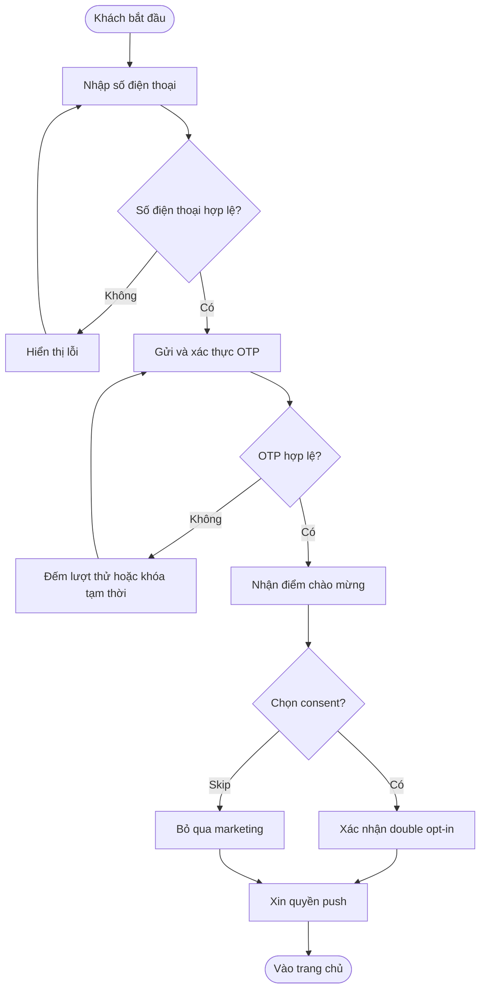

#### Workflow: Customer App Salon Scan — check-in nhiều salon

**Primary Actor:** Customer
**Trigger:** Khách chọn Scan hoặc nhập mã QR NEXORA TOUCH tại bất kỳ salon tham gia nào
**Outcome:** Màn Scan nhận diện đúng salon, station và technician tùy chọn; lượt ghé được ghi nhận một lần, điểm được cộng đúng salon hoặc được xếp hàng để gửi lại khi có mạng.

**User Stories:**

- As a Customer, I want to dùng một màn Scan cho nhiều salon, so that tôi không cần cài hoặc học một cách check-in riêng cho từng nơi.
- As a Customer, I want to biết QR đang thuộc salon nào trước khi ghi nhận, so that điểm không bị cộng nhầm business.
- As a Customer, I want to check-in khi mạng yếu, so that tôi không mất lượt ghé.
- As a Customer, I want to được báo khi quét trùng hoặc mã không hợp lệ, so that tôi biết cần làm gì tiếp theo.

| Step | Who | Action | System Response | Notes |
| :--- | :--- | :--- | :--- | :--- |
| 1 | Customer | Mở màn Scan | Hiển thị camera hoặc ô nhập mã dùng chung cho mọi salon | Không cần chọn salon trước |
| 2 | Customer | Quét QR tại salon A, B hoặc salon khác | Đọc mã NEXORA TOUCH | Prototype mô phỏng camera; production cần decoder |
| 3 | Platform | Nhận diện salon, station và technician tùy chọn | Hiển thị salon đích trước khi hoàn tất | Chỉ nhận QR có nguồn hợp lệ |
| 4 | Platform | Kiểm tra salon/station/technician và lượt ghé gần nhất | Từ chối mã sai hoặc check-in trùng tại cùng salon | Lịch sử salon khác không bị coi là trùng |
| 5 | Platform | Xác định trạng thái kết nối | Online ghi nhận ngay; offline đưa vào hàng đợi | Lưu thời điểm quét và salon đích |
| 6 | Platform | Ghi nhận visit và ledger của salon đã nhận diện | Cộng rule điểm của đúng salon | Không cộng vào balance chung |
| 7 | Customer | Trở lại trang chủ hoặc Wallet | Hiển thị salon vừa check-in, điểm và activity tương ứng | Có thể mở Scan để check-in salon tiếp theo |
| 8 | Platform | Nhận mạng lại hoặc xử lý retry | Gửi queue đúng salon và chống award lặp | Retry giữ nguyên scan timestamp |

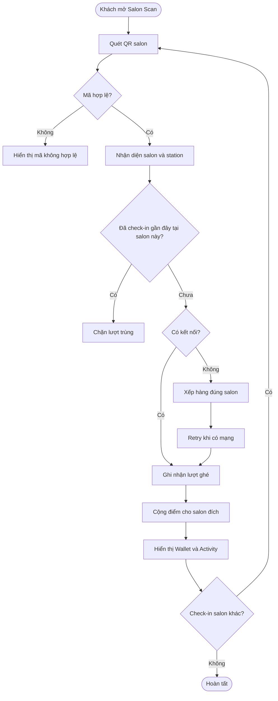

#### Workflow: Khám phá reward và đổi điểm

**Primary Actor:** Customer
**Trigger:** Khách mở Wallet hoặc Rewards
**Outcome:** Khách đổi được reward đủ điều kiện và nhận receipt để doanh nghiệp xác nhận sử dụng.

**User Stories:**

- As a Customer, I want to xem số dư theo từng business, so that tôi biết điểm thuộc về ai.
- As a Customer, I want to đổi reward trong cùng alliance, so that tôi dùng được quyền lợi liên minh mà không tạo ví chung.
- As a Customer, I want to nhận mã receipt không bị trừ lặp, so that tôi yên tâm khi bấm xác nhận lại.

| Step | Who | Action | System Response | Notes |
| :--- | :--- | :--- | :--- | :--- |
| 1 | Customer | Chọn business và reward | Hiển thị cost, số dư và business nhận reward | Không cộng số dư giữa các business |
| 2 | Platform | Kiểm tra điểm, alliance và điều kiện | Báo thiếu điểm hoặc khác alliance nếu không đạt | Rule do business cấu hình |
| 3 | Customer | Xác nhận đổi điểm | Trừ điểm nguyên tử và tạo Reward Receipt | Có idempotency để chống bấm lặp |
| 4 | Customer | Đưa mã/QR cho staff | Hiển thị receipt ở trạng thái sẵn sàng | Chưa được xem là đã sử dụng |
| 5 | Business Owner/Staff | Xác nhận đã cung cấp dịch vụ | Chuyển receipt sang đã sử dụng | Production cần callback từ business |
| 6 | Platform | Kiểm tra hết hạn | Đánh dấu receipt hết hạn khi quá hạn | Không hoàn điểm tự động nếu business chưa cấu hình |

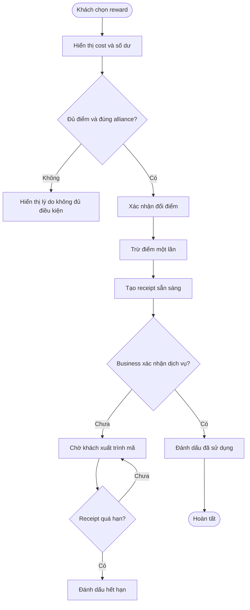

#### Workflow: Tip và thanh toán trực tiếp

**Primary Actor:** Customer
**Trigger:** Khách chọn Send a Tip hoặc Pay Salon Directly
**Outcome:** Tiền được gửi ngoài NEXORA; business xác nhận sau đó mới phát sinh điểm thưởng.

**User Stories:**

- As a Customer, I want to chọn Venmo/Zelle/Cash App, so that tiền đi thẳng tới đúng người nhận.
- As a Customer, I want to thấy trạng thái đang chờ xác nhận, so that tôi không nhầm rằng business đã nhận tiền.
- As a Business Owner, I want to xác nhận payment/tip, so that hệ thống mới cộng điểm theo rule của tôi.

| Step | Who | Action | System Response | Notes |
| :--- | :--- | :--- | :--- | :--- |
| 1 | Customer | Chọn người nhận, số tiền và phương thức | Kiểm tra amount và method được bật | Không có NEXORA wallet |
| 2 | Platform | Lưu giao dịch chờ xác nhận | Hiển thị pending receipt | Không cộng điểm ở bước này |
| 3 | Customer | Mở ứng dụng thanh toán ngoài | 💰 Gửi tiền trực tiếp cho staff/business | NEXORA không giữ hoặc thu phí nền tảng |
| 4 | Business Owner/Staff | Xác nhận đã nhận tiền | Chuyển giao dịch sang confirmed | Production dùng callback/webhook |
| 5 | Platform | Tính rule tip/payment | Ghi ledger và cộng điểm đúng business | Confirmation lặp lại phải idempotent |
| 6 | Support | Xử lý giao dịch không được xác nhận | Giữ pending và hướng dẫn liên hệ business | Không tự hiển thị thành công |

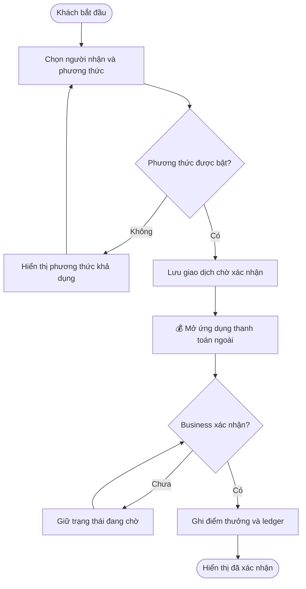

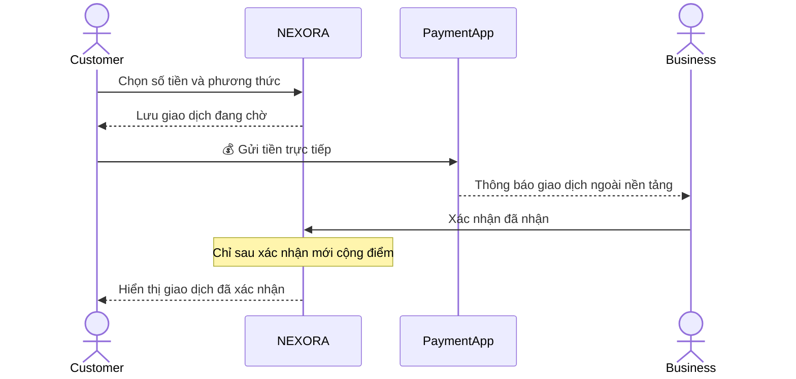

#### Workflow: Booking request và private feedback

**Primary Actor:** Customer
**Trigger:** Khách chọn Book tại business hoặc từ một look đã lưu
**Outcome:** Yêu cầu đặt lịch được business xác nhận; sau visit khách gửi feedback riêng tư và nhận 15 điểm.

**User Stories:**

- As a Customer, I want to gửi request với dịch vụ, staff và thời gian, so that business có thể xác nhận lịch phù hợp.
- As a Customer, I want to đánh giá riêng tư sau visit, so that business cải thiện dịch vụ mà không bị ép chia sẻ công khai.
- As a Customer, I want to mở Google review tùy chọn, so that tôi có thể chia sẻ trải nghiệm mà không ảnh hưởng điểm.

| Step | Who | Action | System Response | Notes |
| :--- | :--- | :--- | :--- | :--- |
| 1 | Customer | Chọn dịch vụ, staff, ngày và giờ | Hiển thị màn hình review request | Chưa có charge |
| 2 | Customer | Gửi booking request | Lưu trạng thái đã gửi yêu cầu | Business thường phản hồi trong SLA hiển thị |
| 3 | Business Owner/Staff | Xác nhận hoặc chưa xác nhận | Tạo appointment khi confirmed | Không được coi pending là lịch chắc chắn |
| 4 | Customer | Đến business và hoàn tất visit | Visit trở thành căn cứ feedback | Cần quan hệ visit hợp lệ |
| 5 | Customer | Chọn số sao và gửi private feedback | Cộng đúng 15 điểm một lần/visit | Không khóa điểm vì thiếu Google share |
| 6 | Customer | Chọn Google review nếu muốn | Mở Google ngoài nền tảng | Không cộng thêm điểm |

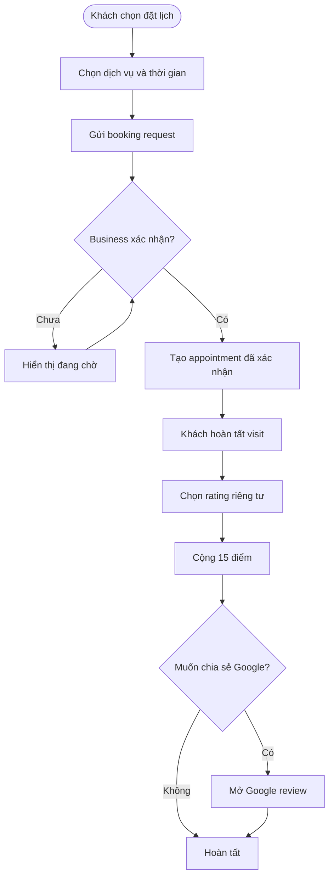

#### Workflow: Explore, offers và follow technician

**Primary Actor:** Customer
**Trigger:** Khách mở Explore hoặc nhận nearby/wish notification
**Outcome:** Khách tìm được business/offer phù hợp và chỉ theo dõi technician khi đủ shared visit và opt-in.

**User Stories:**

- As a Customer, I want to xem rating, khoảng cách, giá và trust signals, so that tôi chọn business có thông tin đáng tin.
- As a Customer, I want to lưu offer hoặc wish, so that tôi quay lại khi có dịch vụ phù hợp.
- As a Customer, I want to theo dõi technician tôi từng gặp, so that tôi biết khi họ chuyển sang salon mới nếu họ đã đồng ý.

| Step | Who | Action | System Response | Notes |
| :--- | :--- | :--- | :--- | :--- |
| 1 | Customer | Tìm theo tên hoặc danh mục | Lọc danh sách business | Metrics phải do hệ thống tính, không nhập tay từ client |
| 2 | Customer | Mở business profile | Hiển thị services, giá và trust signals | Sponsored offer phải có nhãn |
| 3 | Customer | Lưu offer hoặc gửi anonymous wish | Lưu trên thiết bị và chống trùng | Wish không làm lộ danh tính |
| 4 | Customer | Chọn follow technician | Kiểm tra shared visit và technician opt-in | Không cho follow nếu chưa từng cùng visit |
| 5 | Platform | Technician liên kết salon mới | Gửi tối đa một notification phù hợp | Không hiển thị PII trước khi hai bên accept |
| 6 | Customer | Mở notification | Điều hướng đến business mới | Chat chỉ sau khi có accept hai chiều |

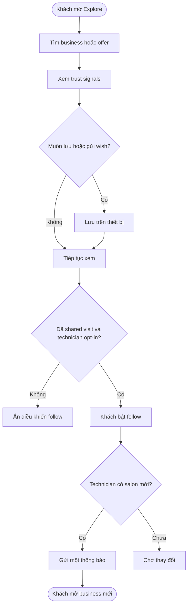

### System Configuration & Administration

- As a Business Owner, I want to cấu hình earn/redeem rule và hạn điểm, so that chi phí loyalty luôn thuộc đúng business.
- As a Business Owner, I want to chọn payment method và SLA xác nhận, so that khách chỉ thấy phương thức tôi thực sự hỗ trợ.
- As a Business Owner, I want to cấu hình reward và alliance, so that reward chỉ được dùng ở nơi tôi cho phép.
- As a Business Owner, I want to phát hành offer có điều kiện, ngày hết hạn và nhãn sponsored, so that thông tin quảng bá minh bạch.
- As a Staff Member, I want to bật/tắt follow notification, so that khách chỉ nhận thông báo khi tôi đồng ý.
- As a Customer, I want to bật/tắt marketing theo business, network offers, booking reminders, nearby deals và AI suggestions, so that tôi kiểm soát liên lạc.
- As a Support Agent, I want to xem transaction/receipt audit, so that tôi xử lý pending, duplicate hoặc callback thất bại mà không tự ý cộng điểm.

### State Lifecycle

#### Reward Receipt

| Current Status | Trigger | New Status | Notes |
| :--- | :--- | :--- | :--- |
| Chưa tạo | Customer xác nhận đổi điểm | Sẵn sàng (`ready`) | Điểm đã bị trừ, receipt chờ business sử dụng |
| Sẵn sàng | Staff xác nhận cung cấp dịch vụ | Đã sử dụng (`used`) | Không thể dùng lại |
| Sẵn sàng | Quá hạn theo rule business | Hết hạn (`expired`) | Cách hoàn điểm phải do business policy quy định |

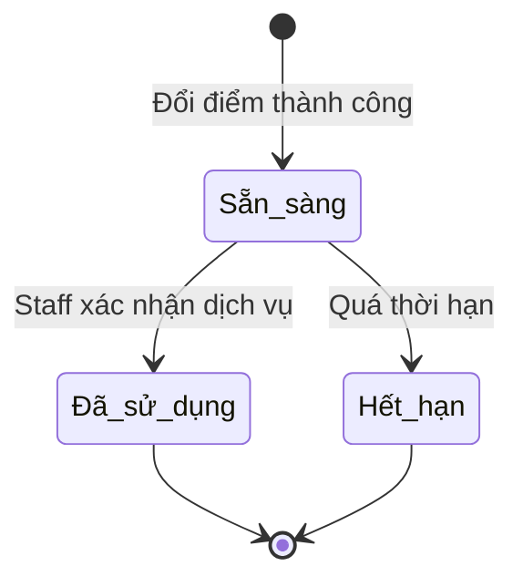

#### Tip và Direct Payment

| Current Status | Trigger | New Status | Notes |
| :--- | :--- | :--- | :--- |
| Chưa ghi nhận | Customer gửi giao dịch | Đang chờ (`pending`) | Tiền nằm ngoài NEXORA; chưa cộng điểm |
| Đang chờ | Business xác nhận | Đã xác nhận (`confirmed`) | Ghi ledger và cộng điểm theo rule |

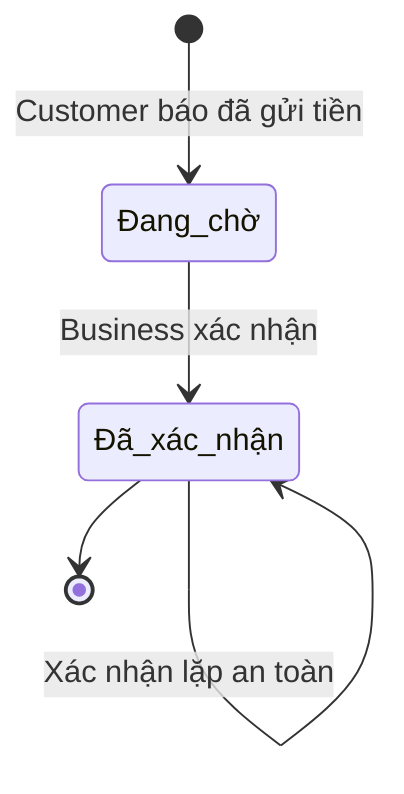

#### Booking Request và Check-in

| Entity | Current Status | Trigger | New Status | Notes |
| :--- | :--- | :--- | :--- | :--- |
| Booking request | Chưa gửi | Customer gửi yêu cầu | Đã gửi yêu cầu (`requested`) | Chưa phải lịch chắc chắn |
| Booking request | Đã gửi yêu cầu | Business xác nhận | Đã xác nhận (`confirmed`) | Tạo appointment và booking bonus nếu có |
| Check-in | Đang gửi (`queued`) | Thiết bị có mạng và retry thành công | Đã xác nhận (`confirmed`) | Ghi scan timestamp và điểm một lần |

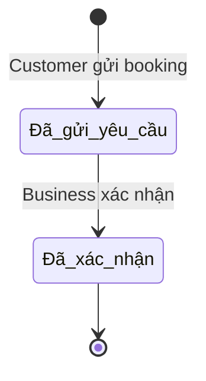

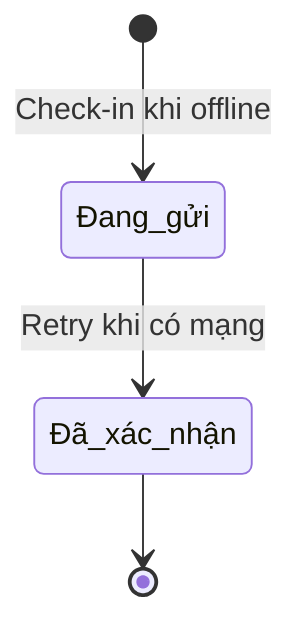

### Business Rules

- **Rule 1:** NEXORA không giữ tiền, không có cash wallet và không thu platform fee từ direct payment.
- **Rule 2:** Điểm thuộc về business phát hành; Wallet hiển thị tách theo business, không cộng thành một balance chung.
- **Rule 3:** Điểm không rút tiền, chuyển nhượng hoặc bán; chỉ đổi dịch vụ/offer trong phạm vi được business/alliance cho phép.
- **Rule 4:** Reward redemption phải kiểm tra đủ điểm, đúng business/alliance và không được debit hai lần.
- **Rule 5:** Tip/payment chỉ cộng điểm sau khi business xác nhận; pending không phải confirmed.
- **Rule 6:** Private feedback hợp lệ cộng 15 điểm một lần cho mỗi visit. Google review là tùy chọn và không được dùng làm điều kiện nhận điểm.
- **Rule 7:** Marketing consent là tùy chọn; double opt-in, STOP/HELP và timestamp phải được lưu. Transactional message luôn được phép gửi.
- **Rule 8:** QR check-in chỉ chấp nhận mã HTTPS NEXORA hợp lệ, đúng business/station/staff; check-in trùng bị từ chối.
- **Rule 9:** Booking là request; không thu tiền và không coi là confirmed trước khi business xác nhận.
- **Rule 10:** Follow technician chỉ dành cho shared visit; technician phải opt-in, dữ liệu ban đầu ẩn danh/coarse và chat cần accept hai chiều.
- **Rule 11:** Prototype chỉ lưu dữ liệu trên thiết bị; production phải chuyển auth, payment callback, push, camera, upload và metrics sang backend được kiểm soát.

> 💡 **Important:** Các bước có 💰 đều là bước tiền đi qua ứng dụng thanh toán ngoài NEXORA. NEXORA chỉ ghi nhận trạng thái và cộng điểm sau callback xác nhận; không được hiển thị tiền đã nhận khi chưa có xác nhận của business.

### Edge Cases & Exception Handling

| Scenario | What Happens | Who Resolves It |
| :--- | :--- | :--- |
| OTP sai quá số lần cho phép | Session bị khóa tạm thời, khách phải chờ rồi thử lại | Customer / Support |
| Số điện thoại đã nhận quà | Không cấp lại quà; yêu cầu đăng nhập bằng OTP | Customer |
| Không chọn consent | Không cho Agree; có thể Skip và giữ điểm | Customer |
| QR sai origin, station hoặc staff | Từ chối check-in, không tạo ledger | Customer / Support |
| Check-in trùng hoặc scan tương lai bất thường | Từ chối lượt mới, giữ lượt hợp lệ sớm nhất | Platform tự động |
| Offline khi check-in | Đưa vào queue và retry khi online | Platform tự động |
| Thiếu điểm hoặc khác alliance | Không tạo receipt, giữ nguyên balance | Customer / Business Owner |
| Payment/tip không được xác nhận | Giữ pending, không cộng điểm và không báo thành công | Business Owner / Support |
| Booking chưa được business xác nhận | Hiển thị đang chờ, chưa tạo lịch chắc chắn | Business Owner |
| Gửi feedback lần hai cho cùng visit | Từ chối reward bổ sung | Platform tự động |
| Theo dõi technician không có shared visit | Ẩn hoặc từ chối thao tác follow | Platform tự động |
| localStorage hỏng hoặc đầy | Khôi phục state an toàn; ảnh có thể được lưu không kèm file | Support / QA |

### Frequently Asked Questions

**Q: NEXORA có giữ tiền tip hoặc tiền thanh toán không?**
A: Không. Tiền đi trực tiếp qua Venmo, Zelle, Cash App hoặc phương thức do business bật. NEXORA chỉ chờ business xác nhận và ghi nhận điểm.

**Q: Tôi có thể dùng điểm của một business tại business khác không?**
A: Chỉ khi hai business thuộc cùng alliance và reward đó cho phép. Không có ví điểm chung toàn hệ thống.

**Q: Tôi có nhận điểm nếu không cho phép marketing không?**
A: Có. Consent marketing là tùy chọn và không phải điều kiện nhận welcome gift, visit points hoặc private feedback points.

**Q: Vì sao tip đã gửi nhưng điểm chưa tăng?**
A: Giao dịch đang chờ business xác nhận. Điểm chỉ tăng sau trạng thái confirmed.

**Q: Booking đã gửi có chắc chắn giữ chỗ chưa?**
A: Chưa. Booking chỉ là request cho đến khi business xác nhận.

**Q: Tôi có phải đăng Google review để nhận điểm không?**
A: Không. Private feedback đã đủ điều kiện cộng 15 điểm; Google review hoàn toàn tùy chọn và không cộng thêm điểm.

**Q: Tôi có thể follow mọi technician trên Explore không?**
A: Không. Bạn chỉ follow technician đã từng phục vụ mình trong một shared visit và đã bật opt-in.

### Related Features

- [Customer app developer spec](customer-app-developer-spec.md) — business rules, data model, màn hình và test cases.
- [Three-sided marketplace spec](three-sided-marketplace-spec.md) — Explore, follow technician, privacy và notification.
- [Customer reward localStorage design](customer-reward-localstorage-design.md) — persistence và ranh giới frontend prototype.
- [Customer app implementation guide](customer-app-independent-guide.md) — action/state/QA handoff chi tiết cho developer.
- [Customer reward prototype](cutomer-reward.html) — artifact frontend chạy được.

---

**Ghi chú phát hành:** Đây là tài liệu business-facing độc lập cho phạm vi Customer App. Khi thay đổi earn/redeem rule, payment callback, consent policy hoặc marketplace eligibility, Product Owner cần cập nhật bản tài liệu này cùng spec và test case liên quan.
