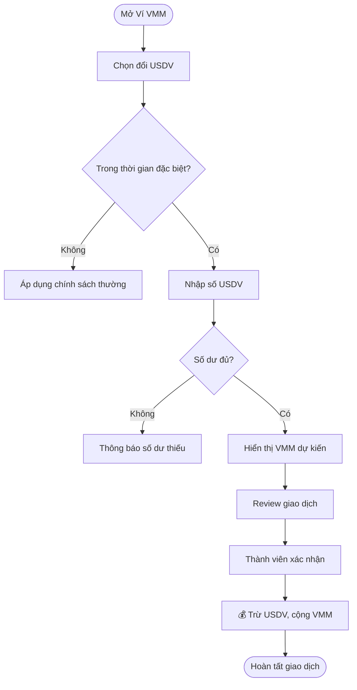
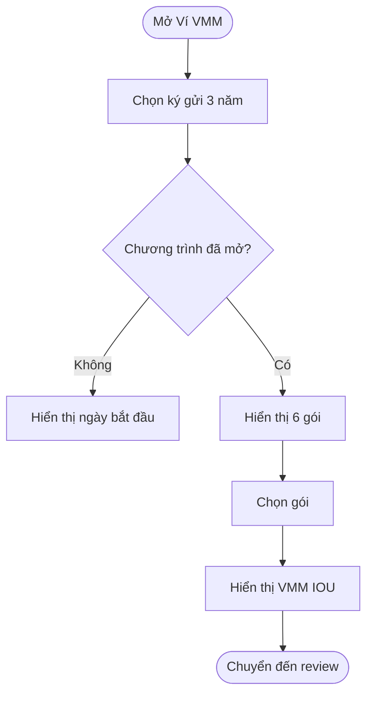
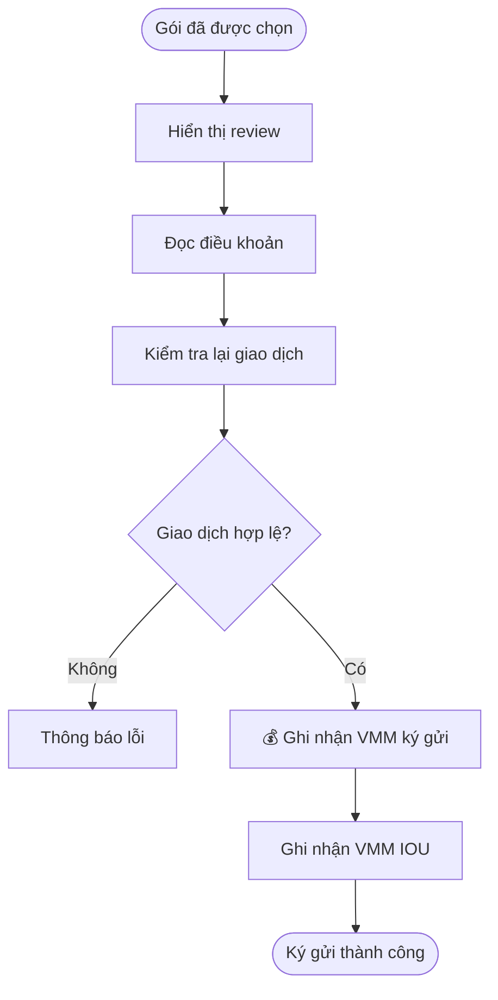
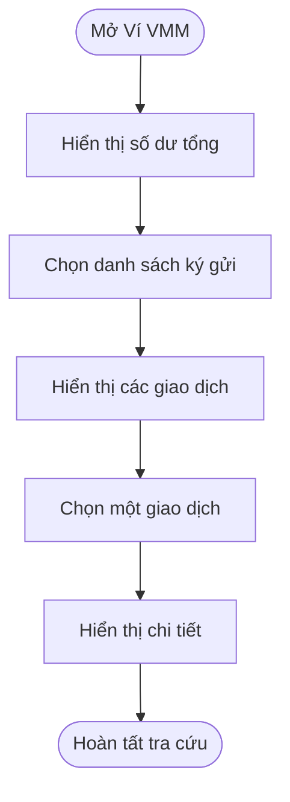
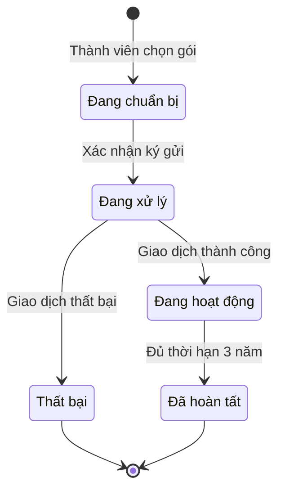

# Chương trình Ký gửi VMM 3 năm và Tặng VMM IOU

**Version:** 1.0  
**Last Updated:** 23/07/2026
**Audience:** Product Owner, Business Analyst, UX/UI, Development, QA, Customer Support  
**Status:** Draft

## Version History

| Version | Date | Changes |
| :--- | :--- | :--- |
| 1.0 | 22/07/2026 | Tạo tài liệu nghiệp vụ ban đầu dựa trên nội dung chương trình đã thống nhất. |
| 1.0 | 23/07/2026 | Đồng bộ ngày mở chương trình Sep 01, 2026; giữ luồng demo Terms/History/Detail theo UI hiện tại. |

---

## Overview

> Chương trình cho phép thành viên truy cập từ **Ví VMM**, chọn một gói **Ký gửi VMM 3 năm** và nhận số lượng **VMM IOU** cố định theo gói. Trong giai đoạn tháng 8/2026, thành viên được đổi **USDV sang VMM không bị giới hạn theo gói** từ **07/08/2026 đến hết 31/08/2026**; chương trình ký gửi chính thức bắt đầu từ **01/09/2026**.

### Business Value

- Tạo giai đoạn chuẩn bị để thành viên chủ động tích lũy VMM trước ngày mở chương trình.
- Đưa thao tác ký gửi vào đúng ngữ cảnh **Ví VMM**, giúp luồng dễ tìm và dễ hiểu.
- Công khai quyền lợi VMM IOU theo từng mức VMM, tránh cách tính suy diễn hoặc không rõ ràng.

### Scope

**In scope**

- Thông báo giai đoạn đổi USDV sang VMM trong tháng 8/2026.
- Luồng vào Ví VMM và chọn **Ký gửi VMM 3 năm**.
- Hiển thị 6 gói theo thứ tự từ nhỏ đến lớn.
- Kiểm tra số dư VMM trước khi xác nhận.
- Review thông tin, mở Terms & Conditions và xác nhận ký gửi.
- Ghi nhận VMM IOU theo đúng gói đã chọn.
- Hiển thị kết quả và lịch sử giao dịch.

**Out of scope của tài liệu này**

- Nội dung pháp lý chi tiết của Terms & Conditions.
- Chính sách rút hoặc chấm dứt trước 3 năm.
- Cơ chế sử dụng, chuyển đổi hoặc quy đổi VMM IOU.
- Chính sách phí và nguồn tỷ giá USDV → VMM.

---

## Key Concepts

| Term | Definition |
| :--- | :--- |
| Ví VMM | Khu vực hiển thị số dư VMM và điểm bắt đầu của luồng ký gửi 3 năm. |
| USDV | Tài sản được thành viên sử dụng để đổi sang VMM trong giai đoạn chuẩn bị tháng 8/2026. |
| VMM | Tài sản thành viên sử dụng để đăng ký một gói ký gửi 3 năm. |
| Ký gửi VMM 3 năm | Chương trình ghi nhận một lượng VMM cố định theo gói trong thời hạn 3 năm. |
| VMM IOU | Quyền lợi được tặng theo đúng gói VMM mà thành viên ký gửi thành công. |
| Gói ký gửi | Một mức VMM cố định trong bảng chương trình; mỗi mức có số VMM IOU tương ứng. |
| Giai đoạn chuyển đổi đặc biệt | Thời gian 07/08/2026–31/08/2026, thành viên được đổi USDV sang VMM không bị giới hạn theo gói. |
| Ngày mở chương trình | Ngày 01/09/2026, thành viên bắt đầu được xác nhận ký gửi VMM 3 năm. |

---

## User Roles

| Role | Responsibilities in this Feature |
| :--- | :--- |
| Thành viên | Chuẩn bị VMM, chọn gói, xem quyền lợi, đồng ý điều khoản và xác nhận ký gửi. |
| Hệ thống VLINKPAY | Kiểm tra thời gian chương trình, số dư, gói hợp lệ; ghi nhận giao dịch và cập nhật trạng thái. |
| Product/Admin | Cấu hình thời gian, danh sách gói, quyền lợi VMM IOU, Terms & Conditions và trạng thái chương trình. |
| Customer Support | Tra cứu và hỗ trợ các giao dịch thất bại, số dư không khớp hoặc quyền lợi chưa được ghi nhận. |

---

## Program Schedule

| Giai đoạn | Thời gian | Nội dung đã chốt |
| :--- | :--- | :--- |
| Chuẩn bị VMM | 07/08/2026–31/08/2026 | Thành viên được đổi USDV sang VMM không bị giới hạn theo gói. |
| Ký gửi VMM 3 năm | Từ 01/09/2026 | Thành viên vào Ví VMM, chọn gói ký gửi và nhận VMM IOU theo bảng quyền lợi. |

> 💡 **Important:** Việc đổi USDV sang VMM trong tháng 8 không tự động tạo gói ký gửi. Thành viên phải chủ động tham gia chương trình từ ngày 01/09/2026.

---

## Deposit Packages

Các gói phải được hiển thị **từ nhỏ đến lớn**.

| Thứ tự | VMM ký gửi | Thời hạn | VMM IOU được tặng |
| :---: | ---: | :---: | ---: |
| 1 | 10.000.000 VMM | 3 năm | 10.000 VMM IOU |
| 2 | 20.000.000 VMM | 3 năm | 25.000 VMM IOU |
| 3 | 50.000.000 VMM | 3 năm | 100.000 VMM IOU |
| 4 | 100.000.000 VMM | 3 năm | 1.000.000 VMM IOU |
| 5 | 250.000.000 VMM | 3 năm | 2.500.000 VMM IOU |
| 6 | 500.000.000 VMM | 3 năm | 10.000.000 VMM IOU |

> Số VMM IOU là quyền lợi cố định theo từng gói, không tính theo tỷ lệ tuyến tính.

---

## End-to-End Workflows

### Workflow 1: Đổi USDV sang VMM trong tháng 8

**Primary Actor:** Thành viên  
**Trigger:** Thành viên mở tính năng đổi USDV sang VMM trong thời gian 07/08/2026–31/08/2026  
**Outcome:** Giao dịch đổi được ghi nhận và số dư VMM được cập nhật

**User Stories:**

- **As a** Thành viên, **I want to** đổi USDV sang VMM không bị giới hạn theo gói trong tháng 8, **so that** tôi có thể chuẩn bị VMM trước ngày mở chương trình ký gửi.
- **As a** Thành viên, **I want to** xem thông tin giao dịch trước khi xác nhận, **so that** tôi biết số USDV sử dụng và số VMM dự kiến nhận.
- **As a** Thành viên, **I want to** biết khi giai đoạn đặc biệt đã kết thúc, **so that** tôi không hiểu nhầm chính sách đang áp dụng.

| Step | Who | Action | System Response | Notes |
| :--- | :--- | :--- | :--- | :--- |
| 1 | Thành viên | Mở Ví VMM và chọn đổi USDV sang VMM. | Hiển thị trạng thái chương trình và số dư liên quan. | Gắn nhãn chương trình đặc biệt khi còn hiệu lực. |
| 2 | Thành viên | Nhập số USDV muốn đổi. | Kiểm tra số dư và hiển thị số VMM dự kiến nhận. | Nguồn tỷ giá và phí: TBD. |
| 3 | Thành viên | Tiếp tục đến màn hình review. | Hiển thị thông tin giao dịch trước xác nhận. | Chưa thay đổi số dư. |
| 4 | Thành viên | Xác nhận giao dịch. | 💰 Trừ USDV, cộng VMM và tạo lịch sử giao dịch khi xử lý thành công. | Phải chống gửi trùng. |
| 5 | Hệ thống | Hoàn tất hoặc từ chối giao dịch. | Hiển thị kết quả rõ ràng. | Giao dịch thất bại không được làm thay đổi số dư. |

---

### Workflow 2: Chọn gói ký gửi từ Ví VMM

**Primary Actor:** Thành viên  
**Trigger:** Thành viên chọn **Ký gửi VMM 3 năm** trong Ví VMM  
**Outcome:** Một gói hợp lệ được chọn và chuyển sang màn hình review

**User Stories:**

- **As a** Thành viên, **I want to** truy cập chương trình trực tiếp từ Ví VMM, **so that** tôi dễ tìm đúng chức năng.
- **As a** Thành viên, **I want to** xem các gói từ nhỏ đến lớn, **so that** tôi dễ so sánh.
- **As a** Thành viên, **I want to** xem số dư khả dụng, **so that** tôi biết khả năng tham gia trước khi xác nhận.
- **As a** Thành viên, **I want to** thấy chính xác VMM IOU được tặng, **so that** tôi hiểu quyền lợi trước khi xác nhận.

| Step | Who | Action | System Response | Notes |
| :--- | :--- | :--- | :--- | :--- |
| 1 | Thành viên | Mở Ví VMM. | Hiển thị số dư VMM và nút **Ký gửi VMM 3 năm**. | Trước ngày mở, nút có thể dẫn đến màn hình giới thiệu/countdown. |
| 2 | Thành viên | Chọn **Ký gửi VMM 3 năm**. | Kiểm tra chương trình đã mở hay chưa. | Chỉ cho xác nhận từ 01/09/2026. |
| 3 | Hệ thống | Tải danh sách gói. | Hiển thị 6 gói từ 10 triệu đến 500 triệu VMM. | Luôn sắp xếp tăng dần. |
| 4 | Thành viên | Chọn một gói. | Làm nổi bật gói đã chọn và hiển thị VMM IOU tương ứng. | Một giao dịch chỉ chọn một gói. |
| 5 | Hệ thống | Hiển thị review sau khi chọn gói. | Hiển thị thông tin trước xác nhận. | Chưa ghi nhận ký gửi ở bước này. |

---

### Workflow 3: Review và xác nhận ký gửi 3 năm

**Primary Actor:** Thành viên  
**Trigger:** Thành viên đã chọn một gói hợp lệ  
**Outcome:** Giao dịch ký gửi được ghi nhận thành công và VMM IOU được ghi nhận theo gói

**User Stories:**

- **As a** Thành viên, **I want to** xem lại số VMM, thời hạn và VMM IOU, **so that** tôi hiểu đầy đủ giao dịch trước khi xác nhận.
- **As a** Thành viên, **I want to** đọc Terms & Conditions, **so that** tôi hiểu điều kiện tham gia.
- **As a** Thành viên, **I want to** nhận mã giao dịch và kết quả thành công, **so that** tôi có thể tra cứu về sau.

| Step | Who | Action | System Response | Notes |
| :--- | :--- | :--- | :--- | :--- |
| 1 | Hệ thống | Hiển thị màn hình review. | Hiển thị gói, VMM ký gửi, VMM IOU, thời hạn 3 năm, ngày bắt đầu và ngày hoàn tất dự kiến. | Số dư còn lại nên được hiển thị. |
| 2 | Thành viên | Mở Terms & Conditions. | Hiển thị tài liệu điều khoản chính thức. | Nội dung được xây dựng ở tài liệu riêng. |
| 3 | Thành viên | Xác nhận ký gửi. | Kiểm tra lại thời gian chương trình, số dư và gói. | Tránh số dư thay đổi sau bước chọn. |
| 4 | Hệ thống | Xử lý giao dịch. | 💰 Ghi nhận số VMM vào gói ký gửi và ghi nhận VMM IOU theo bảng chương trình. | Thời điểm ghi nhận là lúc giao dịch thành công. |
| 5 | Hệ thống | Hoàn tất giao dịch. | Hiển thị trạng thái thành công, mã giao dịch và thông tin gói. | Cập nhật Ví VMM và lịch sử. |

---

### Workflow 4: Theo dõi gói ký gửi

**Primary Actor:** Thành viên  
**Trigger:** Thành viên có giao dịch ký gửi thành công  
**Outcome:** Thành viên xem được trạng thái và thông tin gói trong Ví VMM

**User Stories:**

- **As a** Thành viên, **I want to** xem gói đang hoạt động, **so that** tôi theo dõi số VMM, VMM IOU và ngày hoàn tất.
- **As a** Customer Support, **I want to** tra cứu giao dịch trong lịch sử, **so that** tôi có thể hỗ trợ thành viên khi có sự cố.

| Step | Who | Action | System Response | Notes |
| :--- | :--- | :--- | :--- | :--- |
| 1 | Thành viên | Mở Ví VMM. | Hiển thị tổng VMM khả dụng, tổng VMM đang ký gửi và VMM IOU. | Cách tổng hợp VMM IOU theo wallet hiện hành: TBD. |
| 2 | Thành viên | Mở danh sách ký gửi. | Hiển thị các giao dịch ký gửi. | Đề xuất sắp xếp mới nhất trước. |
| 3 | Thành viên | Chọn một giao dịch. | Hiển thị gói, trạng thái, ngày bắt đầu và ngày hoàn tất. | Có thể hiển thị thời gian còn lại. |

---

## System Configuration & Administration

### Admin User Stories

- **As a** Product/Admin, **I want to** cấu hình ngày bắt đầu và kết thúc giai đoạn đổi USDV sang VMM, **so that** hệ thống tự động áp dụng đúng chính sách.
- **As a** Product/Admin, **I want to** cấu hình ngày mở chương trình ký gửi, **so that** giao dịch chỉ được xác nhận từ đúng thời điểm.
- **As a** Product/Admin, **I want to** quản lý danh sách gói và VMM IOU tương ứng, **so that** quyền lợi được kiểm soát tập trung.
- **As a** Product/Admin, **I want to** gắn phiên bản Terms & Conditions đang hiệu lực, **so that** hệ thống lưu đúng nội dung thành viên đã đồng ý.
- **As a** Product/Admin, **I want to** tạm dừng chương trình khi có sự cố, **so that** hệ thống không nhận giao dịch mới.

### Configuration Fields

| Configuration | Giá trị ban đầu | Trạng thái |
| :--- | :--- | :--- |
| Ngày bắt đầu đổi USDV → VMM đặc biệt | 07/08/2026 | Đã chốt |
| Ngày kết thúc đổi USDV → VMM đặc biệt | 31/08/2026 | Đã chốt |
| Ngày bắt đầu ký gửi VMM 3 năm | 01/09/2026 | Đã chốt |
| Thời hạn ký gửi | 3 năm | Đã chốt |
| Danh sách gói | 10M, 20M, 50M, 100M, 250M, 500M VMM | Đã chốt |
| Quyền lợi từng gói | Theo bảng Deposit Packages | Đã chốt |
| Tỷ giá USDV → VMM | Chưa xác định | TBD |
| Phí chuyển đổi | Chưa xác định | TBD |
| Múi giờ đóng/mở chương trình | Chưa xác định | TBD |
| Terms & Conditions version | Chưa có nội dung | Tài liệu riêng |
| Chính sách rút trước hạn | Chưa xác định | Tài liệu Terms & Conditions |
| Xử lý khi đủ 3 năm | Chưa xác định | TBD |

---

## State Lifecycle

### Deposit Transaction Status

| Current Status | Trigger | New Status | Notes |
| :--- | :--- | :--- | :--- |
| Chưa tạo | Thành viên chọn gói và vào review | Đang chuẩn bị | Chưa ghi nhận giao dịch tài chính. |
| Đang chuẩn bị | Thành viên xác nhận | Đang xử lý | Hệ thống kiểm tra lại dữ liệu. |
| Đang xử lý | Xử lý thành công | Đang hoạt động | Gói ký gửi và VMM IOU được ghi nhận. |
| Đang xử lý | Xử lý thất bại | Thất bại | Không được tạo gói đang hoạt động. |
| Đang hoạt động | Đủ thời hạn 3 năm | Đã hoàn tất | Cách trả/giải phóng VMM là TBD. |

---

## Business Rules

### Confirmed Rules

- **Rule 1:** Giai đoạn đổi USDV sang VMM không bị giới hạn theo gói áp dụng từ **07/08/2026 đến hết 31/08/2026**.
- **Rule 2:** Chương trình ký gửi VMM 3 năm bắt đầu từ **01/09/2026**.
- **Rule 3:** Thành viên bắt đầu luồng từ **Ví VMM** và chọn **Ký gửi VMM 3 năm**.
- **Rule 4:** Các gói phải hiển thị theo thứ tự: **10 triệu, 20 triệu, 50 triệu, 100 triệu, 250 triệu, 500 triệu VMM**.
- **Rule 5:** VMM IOU được tặng theo đúng bảng quyền lợi của gói đã chọn.
- **Rule 6:** Việc đổi USDV sang VMM không đồng nghĩa với việc tự động tham gia ký gửi.
- **Rule 7:** Terms & Conditions được xây dựng và công bố riêng.

### Proposed Implementation Rules — PO cần xác nhận

- **Rule P1:** Một giao dịch chỉ được chọn một gói; khả năng tham gia nhiều giao dịch/gói đồng thời là TBD.
- **Rule P3:** Hệ thống kiểm tra lại số dư ngay trước khi xử lý giao dịch.
- **Rule P5:** Giao dịch thất bại không được làm thay đổi số dư hoặc tạo gói đang hoạt động.
- **Rule P6:** Mỗi giao dịch thành công có mã giao dịch duy nhất và được ghi trong lịch sử Ví VMM.
- **Rule P7:** Hệ thống phải ngăn xử lý trùng khi thành viên bấm xác nhận nhiều lần.

> 💡 **Important:** Đổi USDV sang VMM và ghi nhận VMM vào gói ký gửi đều là money movement. Việc cập nhật số dư và bản ghi giao dịch phải thành công toàn bộ hoặc hoàn nguyên toàn bộ.

---

## Edge Cases & Exception Handling

| Scenario | What Happens | Who Resolves It |
| :--- | :--- | :--- |
| Mở chương trình đổi trước 07/08/2026 | Hiển thị ngày bắt đầu; chưa áp dụng quyền đặc biệt. | Hệ thống |
| Xác nhận đổi sau 31/08/2026 | Không áp dụng quyền “không giới hạn theo gói”; chuyển sang chính sách thông thường. | Hệ thống |
| Mở ký gửi trước 01/09/2026 | Hiển thị ngày chương trình bắt đầu; không cho xác nhận. | Hệ thống |
| Số dư VMM thấp hơn gói nhỏ nhất | Khóa nút xác nhận; hiển thị số dư chưa đủ. | Hệ thống |
| Số dư đủ khi chọn nhưng không đủ khi xác nhận | Dừng giao dịch và yêu cầu thành viên chọn lại. | Hệ thống |
| Thành viên bấm xác nhận nhiều lần | Chỉ xử lý một yêu cầu; các yêu cầu trùng bị chặn. | Hệ thống |
| Mất mạng sau khi xác nhận | Khi mở lại, tra cứu trạng thái giao dịch thay vì tạo giao dịch mới. | Hệ thống / Support |
| VMM đã được ghi nhận nhưng VMM IOU chưa hiển thị | Đánh dấu cần đối soát và cho Support tra cứu bằng mã giao dịch. | Support / Admin |
| Admin tạm dừng chương trình | Không nhận giao dịch mới; giao dịch đã hoàn tất vẫn được tra cứu. | Product/Admin |
| Thành viên yêu cầu rút trước 3 năm | Xử lý theo Terms & Conditions; hiện chưa có chính sách trong tài liệu này. | Support / Admin |

---

## UI Requirements

### Ví VMM

- Hiển thị số dư VMM khả dụng.
- Có nút chính **Ký gửi VMM 3 năm**.
- Trong tháng 8, hiển thị thông báo đổi **USDV → VMM không bị giới hạn theo gói**.
- Sau khi có giao dịch thành công, hiển thị khu vực theo dõi ký gửi.

### Màn hình chọn gói

- Hiển thị 6 gói từ nhỏ đến lớn.
- Mỗi gói hiển thị: số VMM ký gửi, thời hạn 3 năm và VMM IOU được tặng.
- Gói được chọn có trạng thái selected rõ ràng.
- Sau khi chọn gói, hiển thị trực tiếp màn hình review.

### Màn hình Review

- Số VMM ký gửi.
- VMM IOU được tặng.
- Thời hạn 3 năm.
- Ngày bắt đầu.
- Ngày hoàn tất dự kiến.
- Số dư VMM dự kiến còn lại.
- Liên kết mở Terms & Conditions.
- Ngày hiển thị theo format hệ thống: `MMM dd, yyyy`, ví dụ `Sep 01, 2026`.
- Nút **Xác nhận ký gửi**.

### Màn hình Thành công

- Trạng thái ký gửi thành công.
- Số VMM đã ký gửi.
- Số VMM IOU được tặng.
- Ngày bắt đầu và ngày hoàn tất dự kiến.
- Mã giao dịch.
- Nút **Xem Ví VMM**.
- Nút **Xem chi tiết ký gửi**.

---

## Acceptance Criteria

1. Trong giai đoạn 07/08/2026–31/08/2026, giao diện hiển thị đúng thông báo đổi USDV sang VMM không bị giới hạn theo gói.
2. Trước 01/09/2026, thành viên không thể xác nhận ký gửi VMM 3 năm.
3. Từ 01/09/2026, thành viên có thể mở danh sách gói từ Ví VMM.
4. Sáu gói luôn hiển thị đúng thứ tự từ 10 triệu đến 500 triệu VMM.
5. VMM IOU hiển thị đúng theo bảng quyền lợi.
6. Nút xác nhận bị khóa khi số dư khả dụng không đủ.
7. Màn hình review hiển thị đúng gói, số VMM, VMM IOU và thời hạn.
8. Khi giao dịch thành công, hệ thống tạo một giao dịch ký gửi và ghi nhận VMM IOU tương ứng.
9. Khi giao dịch thất bại, không tạo gói đang hoạt động và không để số dư ở trạng thái không nhất quán.
10. Giao dịch thành công có mã giao dịch duy nhất và hiển thị trong lịch sử.
11. Ví VMM hiển thị giao dịch vừa tạo cùng trạng thái và ngày hoàn tất dự kiến.

---

## Open Decisions / TBD

| Topic | Decision Needed |
| :--- | :--- |
| Tỷ giá USDV → VMM | Tỷ giá cố định, realtime hay lấy từ nguồn giá nào. |
| Phí chuyển đổi | Có thu phí hay không; cách tính và cách hiển thị. |
| Giới hạn khác | “Không giới hạn theo gói” có còn giới hạn theo KYC, giao dịch, ngày hoặc risk control hay không. |
| Nhiều gói | Thành viên có thể tạo nhiều gói đang hoạt động cùng lúc hay không. |
| Số dư ký gửi | VMM được chuyển sang balance riêng hay chỉ ghi nhận trạng thái giữ. |
| Rút trước hạn | Có cho phép hay không và xử lý VMM IOU thế nào. |
| Đủ thời hạn 3 năm | VMM tự động trở lại số dư khả dụng hay cần thao tác của thành viên. |
| VMM IOU usage | Điều kiện sử dụng, chuyển đổi hoặc quy đổi. |
| Múi giờ | Múi giờ chính thức để mở/đóng chương trình. |
| Terms & Conditions | Nội dung, versioning và bằng chứng thành viên đã đồng ý. |

---

## Frequently Asked Questions

**Q: Khi nào được đổi USDV sang VMM không bị giới hạn theo gói?**  
A: Từ ngày 07/08/2026 đến hết ngày 31/08/2026.

**Q: Khi nào chương trình ký gửi VMM 3 năm bắt đầu?**  
A: Từ ngày 01/09/2026.

**Q: Tôi tham gia chương trình ở đâu?**  
A: Thành viên vào Ví VMM và chọn **Ký gửi VMM 3 năm**.

**Q: Các gói được hiển thị theo thứ tự nào?**  
A: Từ nhỏ đến lớn: 10 triệu, 20 triệu, 50 triệu, 100 triệu, 250 triệu và 500 triệu VMM.

**Q: Đổi USDV sang VMM trong tháng 8 có tự động ký gửi không?**  
A: Không. Thành viên phải chủ động chọn một gói ký gửi từ ngày 01/09/2026.

**Q: Ký gửi 100 triệu VMM được tặng bao nhiêu VMM IOU?**  
A: 1.000.000 VMM IOU.

**Q: Có thể rút VMM trước khi đủ 3 năm không?**  
A: Nội dung này chưa được chốt và sẽ được quy định trong Terms & Conditions riêng.

---

## Related Features

- Ví VMM
- Chuyển đổi USDV sang VMM
- Lịch sử giao dịch Ví VMM
- VMM IOU Balance
- Terms & Conditions Management
- Customer Support Transaction Lookup

---

## Recommended Save Path

`docs/business/VLINKPAY_VMM_3Year_Deposit_Program_v1.0.md`
